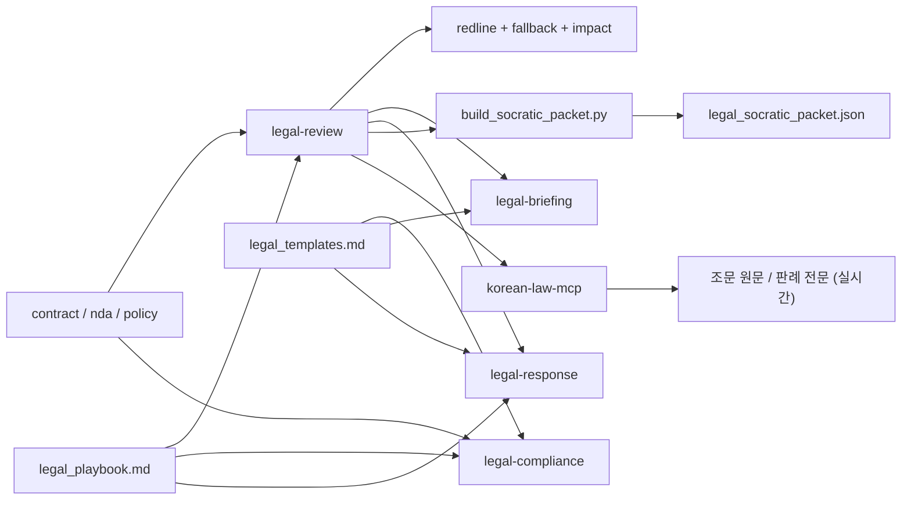

# Legal Suite Workflow

## 0. Dry Run

Use the suite runner when the goal is to validate the local legal flow end-to-end without sending anything externally.

```powershell
python .agent/skills/legal-review/scripts/run_legal_suite.py --preset vendor-saas --text "Vendor may transfer personal data without safeguards. All disputes shall be resolved by mandatory arbitration in California. Confidential obligations apply only to Customer and last for 10 years with no carve-outs."
```

Expected artifacts:
- `tmp/legal_suite_dry_run/{timestamp}/legal_review.md`
- `tmp/legal_suite_dry_run/{timestamp}/legal_compliance.md`
- `tmp/legal_suite_dry_run/{timestamp}/legal_briefing.md`
- `tmp/legal_suite_dry_run/{timestamp}/legal_response.md`
- `tmp/legal_suite_dry_run/{timestamp}/legal_socratic_packet.json`
- `tmp/legal_suite_dry_run/{timestamp}/legal_law_evidence.json` ← korean-law-mcp 연동 (optional)

Progress log:
- `.agent/state/legal_suite_dry_run_log.json`

The log stores each run, step status, generated files, stdout/stderr, and the latest review/packet summary.

## 0-1. Venue Regression

Use the venue regression runner when the goal is to verify that foreign venue / governing-law phrasing is still detected after changes to the playbook or review logic.

```powershell
python .agent/skills/legal-review/scripts/run_legal_venue_regression.py
```

Regression inputs:
- `.agent/state/legal_venue_regression_cases.json`

Regression outputs:
- `tmp/legal_suite_regression/{timestamp}/{case_id}/...`
- `.agent/state/legal_venue_regression_log.json`

The regression log stores which sample cases passed, which clause expectation failed, and the artifact directory for each case.

## 1. Current Coverage

- `legal-review`: contract review, NDA triage, redline suggestions, fallback positions, business impact
- `legal-compliance`: checklist-style compliance review
- `legal-briefing`: internal briefing memo
- `legal-response`: templated response draft
- `korean-law-mcp`: 법령·판례·행정규칙 실시간 조회 (API 키 설정 후 사용 가능)

## 2. Recommended Order

`run_legal_suite.py` 단일 명령으로 1~6 전체 자동 실행됨.

1. Review the contract or NDA with `legal-review`.
2. If policy/process coverage is needed, run `legal-compliance`.
3. If an internal discussion memo is needed, run `legal-briefing`.
4. If a counterparty reply draft is needed, run `legal-response`.
5. If learning/RAG follow-up is needed, build `legal_socratic_packet.json` with `build_socratic_packet.py`.
6. **[자동 연동]** `build_law_evidence.py` → review.md에서 법령·판례 참조 추출 → korean-law-mcp API 직접 호출 → `legal_law_evidence.json` 생성. API 키 미설정 시 graceful skip.

## 3. State Files

- Playbook: `.agent/state/legal_playbook.md`
- Template source: `.agent/state/legal_templates.md`
- Socratic packet: `.agent/state/legal_socratic_packet.json`
- Dry-run log: `.agent/state/legal_suite_dry_run_log.json`

## 4. Flow


