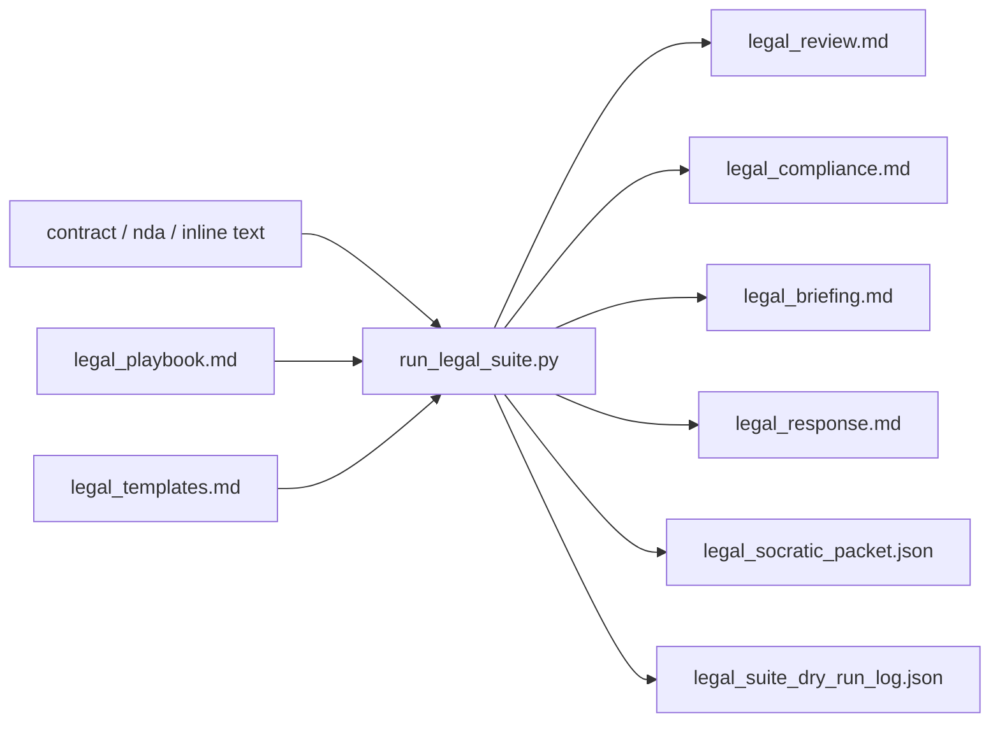
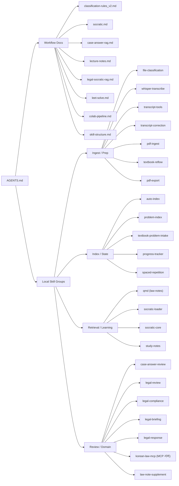
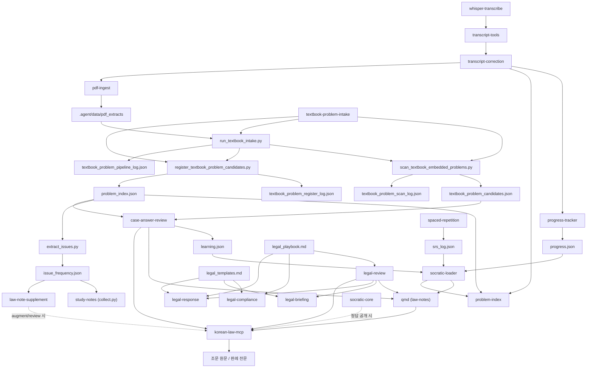
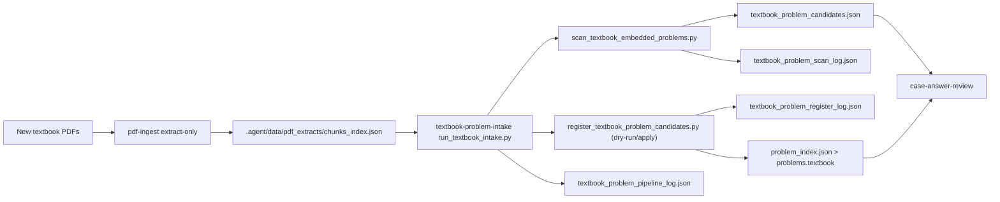
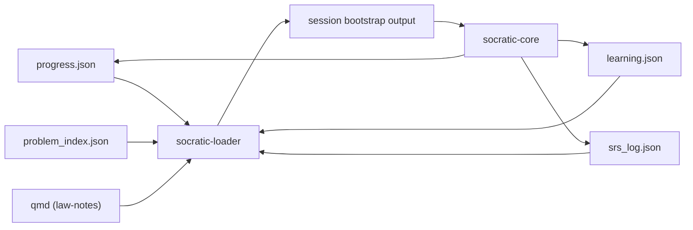

# Skill Structure

> **갱신 (2026-04-21)**: Ingest/Prep 그룹에 `pdf-export`(md→PDF 출력) 추가, `pdf-ingest`에 OCR 경로(`ocr_extract.py`) 문서화 완료. Local Skill Map의 G1 하위 노드 S17 추가.
>
> **갱신 (2026-04-10)**: LanceDB → qmd 이전 반영 완료. `lancedb-rag` 노드 제거, `qmd (law-notes)` 로 통합. 관련 helper: `.agent/lib/qmd_search.py`.

## 0. Detailed Legal Suite Flow

기준:
- `H:\내 드라이브\AGENTS.md`
- `H:\내 드라이브\.agent\skills\*`
- `H:\내 드라이브\.agent\workflows\socratic.md`
- `H:\내 드라이브\.agent\workflows\case-answer-rag.md`
- `H:\내 드라이브\.agent\workflows\legal-socratic-rag.md`
- `H:\내 드라이브\.agent\skills\textbook-problem-intake\SKILL.md`
- `H:\내 드라이브\.agent\skills\case-answer-review\SKILL.md`

메모:
- 아래 묶음은 현재 폴더와 문서 기준의 도식용 그룹이다.
- 연결선은 위 기준 문서에서 확인된 흐름만 표시한다.

## 1. Local Skill Map

## 2. Verified Flow Links

## 3. Current Reading Guide

- 조악한 교재/기출문제 파싱본을 최적의 렌더링으로 일관화할 때: `textbook-reflow`
- 정리노트 `.md`를 시험용 A4 PDF로 일괄 출력할 때: `pdf-export` (출력 경로 `5.기타/정리노트PDF/{YYYY-MM-DD}/`)
- 교재 내부 문제 후보를 잡을 때: `textbook-problem-intake` -> `problem-index`
- 전사문 교정과 완료 반영을 할 때: `transcript-correction`
- 사례답안 채점과 대비자료를 만들 때: `case-answer-review`
- 소크라틱 학습 세션을 열 때: `socratic.md` -> `socratic-loader` -> `socratic-core`
- 리걸 검토 결과를 학습/RAG와 분리 연계할 때: `legal-socratic-rag.md`
- 조문 원문·판례 전문이 필요할 때: `korean-law-mcp` (API 키 설정 후 MCP 도구 직접 호출)
- 기존 법학 노트 보완·오류검토·재구조화할 때: `law-note-supplement` (augment/review/restructure 모드)
- 기출/사례 쟁점 빈도를 추출할 때: `problem-index` → `extract_issues.py` → `issue_frequency.json`
- 노트 목차를 쟁점 중심으로 재배치할 때: `law-note-supplement` restructure(issue-priority) 서브모드

## 4. Detailed Intake Flow

## 5. Detailed Socratic Flow

