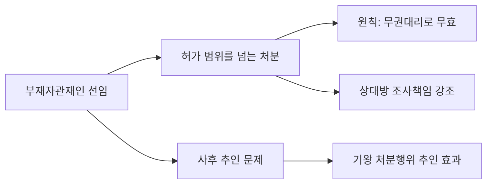
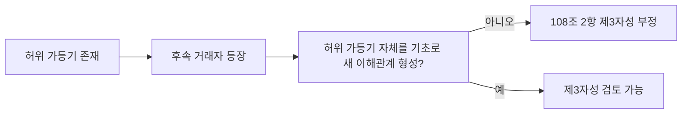
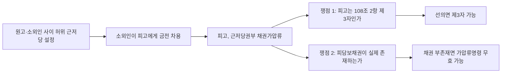
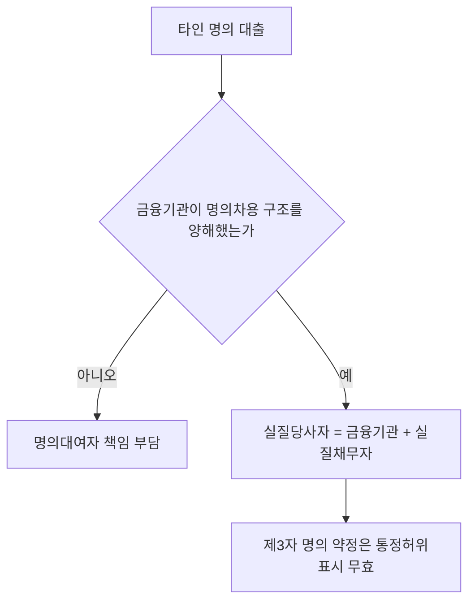
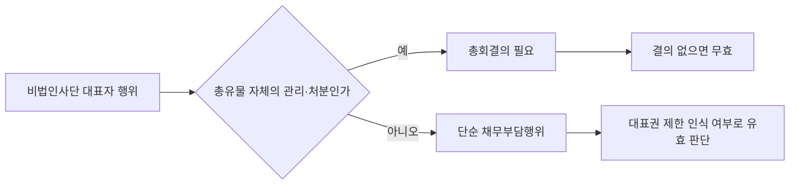
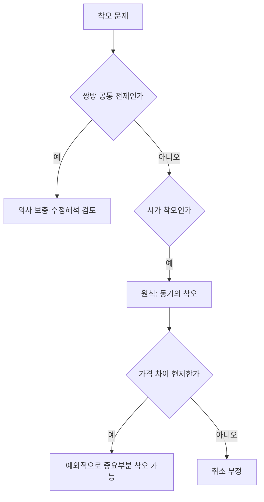

# 민법의 기초이론 1 강혜림 통합노트

## 0. 소스 범위
- `강의계획서`: `민법의_기초이론_1_강의계획서_p001-004.md`
- `송영곤 사례자료`: `기본민법_주요사례1_p001-016.md`
- `송영곤 정리자료`: `기본민법_6차시_민법총칙_의사표시_통정허위표시.md`
- `송영곤 교재추출`: `논점민법강의_권리주체_26_p001-030.md`
- `교수님 루트자료(법인)`: `민법기초이론_법인 관련 자료.pdf`
- `교수님 루트자료(판례)`: `민법기초이론I 관련 판례1(~사기까지).pdf`

## 1. 중간 범위와 통합축
- 강혜림 수업의 중간 전 범위는 `법률관계·권리주체·권리능력`, `자연인의 행위능력·주소·부재와 실종`, `법인`, `권리변동·법률행위·의사와 표시의 불일치`, `하자 있는 의사표시·효력발생 시기·대리 총설`, `대리행위·무권대리`까지다.
  - 근거 발췌: "2/23 ~ 3/1 강의개요 , 법률관계, 권리주체"; "3/30 ~ 4/5 대리행위, 무권대리"
  - 근거 위치: [《민법의_기초이론_1_강의계획서_p001-004.md》 p.3 | "2/23 ~ 3/1 강의개요 , 법률관계, 권리주체"] [《민법의_기초이론_1_강의계획서_p001-004.md》 p.3 | "3/30 ~ 4/5 대리행위, 무권대리"]
- 송영곤 자료로 바로 붙는 축은 크게 네 갈래다. `제한능력자/행위능력`, `부재자관재인과 무권대리`, `재단법인·대표기관`, `의사표시·통정허위표시·무권리자 처분`이다. 주소와 실종은 강의계획서상 범위에는 있으나, 이번에 바로 연결한 송영곤 소스는 위 네 갈래에 더 집중되어 있다.
  - 근거 발췌: "3/2 ~ 3/8 자연인의 행위능력 , 주소 , 부재와 실종"; "3/9 ~ 3/15 법인"; "3/23 ~ 3/29 하자있는 의사표시 , 의사표시의 효력발생 시기 , 법률행위의 대리 총설"
  - 근거 위치: [《민법의_기초이론_1_강의계획서_p001-004.md》 p.3 | "3/2 ~ 3/8 자연인의 행위능력 , 주소 , 부재와 실종"] [《민법의_기초이론_1_강의계획서_p001-004.md》 p.3 | "3/9 ~ 3/15 법인"] [《민법의_기초이론_1_강의계획서_p001-004.md》 p.3 | "3/23 ~ 3/29 하자있는 의사표시 , 의사표시의 효력발생 시기 , 법률행위의 대리 총설"]

## 2. 권리주체와 제한능력자: 민1 앞부분의 핵심 입구
- 송영곤 교재추출은 제한능력자 제도의 취지를 `거래의 안전을 희생시키더라도 제한능력자를 보호`하는 데서 찾고, 미성년자의 재산상 법률행위는 `법정대리인의 대리행위` 또는 `법정대리인의 동의`를 통해 처리된다고 정리한다. 따라서 권리주체 파트는 정의를 따로 외우기보다 `제한능력자 보호 취지 -> 미성년자 재산행위 방식 -> 취소/추인` 흐름으로 잡는 편이 좋다.
  - 근거 발췌: "제한능력자 제도는 ... 거래의 안전을 희생시키더라도 제한능력자를 보호하고자 함"; "2. 미성년자의 재산상의 법률행위 방식（행위능력의 범위）"
  - 근거 위치: 《논점민법강의_권리주체_26_p001-030.md》 p.18 | "제한능력자 제도는 ... 거래의 안전을 희생시키더라도 제한능력자를 보호하고자 함" / p.20 | "2. 미성년자의 재산상의 법률행위 방식（행위능력의 범위）"
- 주요사례 1번은 바로 이 구조를 사례형으로 묻는다. `미성년자는 제한능력자로서 재산적 법률행위를 하려면 법정대리인을 통하거나 동의를 얻어야` 하고, 위반 시 취소 대상이라는 출발점에서, 사후의 `묵시적 추인`과 `법정추인`까지 연결한다.
  - 근거 발췌: "미성년자는 제한능력자로서 재산적 법률행위를 하려면 ‘법정대리인’을 통하거나 ... ‘법정대리인의 동의’를 얻어야"; "乙이 사후에 丁에게 X부동산을 전매한 행위는 ｢묵시적 추인｣ ... 적어도 ｢법정추인｣"
  - 근거 위치: [《기본민법_주요사례1_p001-016.md》 p.2 | "미성년자는 제한능력자로서 재산적 법률행위를 하려면 ‘법정대리인’을 통하거나 ... ‘법정대리인의 동의’를 얻어야"] [《기본민법_주요사례1_p001-016.md》 p.2 | "乙이 사후에 丁에게 X부동산을 전매한 행위는 ｢묵시적 추인｣ ... 적어도 ｢법정추인｣"]
- 같은 사례 안에서 `중간생략등기`까지 한 번에 엮인다. 즉 민1 초반이라고 해도 단순 능력론만 나오는 것이 아니라, 제한능력자 문제 속에 등기와 추인 구조가 함께 들어온다.
  - 근거 발췌: "중간생략등기가 이미 이루어진 경우 제3자간 합의가 있을 때에 유효함은 물론"; "丁이 중간생략등기로 이전등기를 받은 점은 문제되지 않음"
  - 근거 위치: [《기본민법_주요사례1_p001-016.md》 p.3 | "중간생략등기가 이미 이루어진 경우 제3자간 합의가 있을 때에 유효함은 물론"] [《기본민법_주요사례1_p001-016.md》 p.3 | "丁이 중간생략등기로 이전등기를 받은 점은 문제되지 않음"]

## 3. 부재와 실종 파트는 부재자관재인 사례로 잡는 것이 효율적
- 강의계획서상 `부재와 실종`은 독립 범위지만, 이번에 바로 연결된 송영곤 사례는 `부재자관재인의 처분행위와 유효성`이다. 여기서 핵심은 `권한범위를 넘는 행위는 무권대리로서 무효`라는 출발점과, 법원의 사후 허가가 `기왕의 처분행위를 추인하는 효과`를 가질 수 있다는 점이다.
  - 근거 발췌: "3/2 ~ 3/8 자연인의 행위능력 , 주소 , 부재와 실종"; "위반시 ‘무권대리’로서 무효"; "기왕의 처분행위를 추인하는 효과"
  - 근거 위치: [《민법의_기초이론_1_강의계획서_p001-004.md》 p.3 | "3/2 ~ 3/8 자연인의 행위능력 , 주소 , 부재와 실종"] [《기본민법_주요사례1_p001-016.md》 p.2 | "위반시 ‘무권대리’로서 무효"] [《기본민법_주요사례1_p001-016.md》 p.2 | "기왕의 처분행위를 추인하는 효과"]
- 이 사례는 단순히 부재자관재인의 권한범위를 묻는 데서 끝나지 않는다. 법원이 처분권한을 주더라도 그것은 `부재자를 위하는 범위`라는 내재적 한계를 가진다고 보고, 이를 벗어나면 민법 제126조도 부정한다.
  - 근거 발췌: "부재자를 위하는 범위에서 행하여져야 한다"; "민법 제126조의 표현대리행위에 해당 ... ⇒ [判] 부정"
  - 근거 위치: [《기본민법_주요사례1_p001-016.md》 p.2 | "부재자를 위하는 범위에서 행하여져야 한다"] [《기본민법_주요사례1_p001-016.md》 p.2 | "민법 제126조의 표현대리행위에 해당 ... ⇒ [判] 부정"]
- 민1에서 대리 파트가 뒤에 나온다고 해도, 실제 공부는 여기서부터 `권한초과 -> 무권대리 -> 사후추인 -> 표현대리 부정`의 흐름을 먼저 익혀 두는 편이 낫다.
  - 근거 발췌: "3/23 ~ 3/29 ... 법률행위의 대리 총설"; "3/30 ~ 4/5 대리행위, 무권대리"
  - 근거 위치: [《민법의_기초이론_1_강의계획서_p001-004.md》 p.3 | "3/23 ~ 3/29 ... 법률행위의 대리 총설"] [《민법의_기초이론_1_강의계획서_p001-004.md》 p.3 | "3/30 ~ 4/5 대리행위, 무권대리"]

## 4. 법인 파트: 재단법인 귀속시기와 대표기관 하자
- 법인 파트의 첫 핵심은 `출연재산의 귀속시기`다. 송영곤 사례는 생전처분에 의한 재단법인 설립에서 출연재산이 `법인이 성립한 때`부터 법인의 재산이 되는지를 정면으로 다룬다.
  - 근거 발췌: "3/9 ~ 3/15 법인"; "출연재산은 ‘법인이 성립한 때’로부터 법인의 재산"; "법인성립시설 타당"
  - 근거 위치: [《민법의_기초이론_1_강의계획서_p001-004.md》 p.3 | "3/9 ~ 3/15 법인"] [《기본민법_주요사례1_p001-016.md》 p.3 | "출연재산은 ‘법인이 성립한 때’로부터 법인의 재산"] [《기본민법_주요사례1_p001-016.md》 p.3 | "법인성립시설 타당"]
- 이 쟁점은 곧바로 `설립등기 전/후 제3자 처분`, `상속인의 처분권한`, `법인과 제3자 중 누가 소유권을 갖는지`로 이어진다. 따라서 민1 법인 파트는 추상적 정의보다 `재단법인 출연재산 귀속` 사례를 기준으로 잡는 것이 효과적이다.
  - 근거 발췌: "출연재산 법인귀속시기에 따라서 丁에게 X토지를 매각한 乙의 처분권한 유무가 결정"; "X토지의 현재 소유권자는 A법인"
  - 근거 위치: [《기본민법_주요사례1_p001-016.md》 p.3 | "출연재산 법인귀속시기에 따라서 丁에게 X토지를 매각한 乙의 처분권한 유무가 결정"] [《기본민법_주요사례1_p001-016.md》 p.3 | "X토지의 현재 소유권자는 A법인"]
- 두 번째 핵심은 `대표기관이 행한 대표행위의 하자`다. 송영곤 사례는 `정관에서 정한 이사회결의를 거치지 않은 경우`와 `대표권남용`을 같이 묶는다.
  - 근거 발췌: "정관에서 정한 이사회결의를 거치지 않은 경우 및 대표권남용"; "이사의 대표권에 대한 제한은 정관에 기재하여야 효력이 있고"
  - 근거 위치: [《기본민법_주요사례1_p001-016.md》 p.4 | "정관에서 정한 이사회결의를 거치지 않은 경우 및 대표권남용"] [《기본민법_주요사례1_p001-016.md》 p.4 | "이사의 대표권에 대한 제한은 정관에 기재하여야 효력이 있고"]
- 따라서 법인 파트는 `권리능력 범위`, `정관상 대표권 제한의 대항력`, `대표권남용에서 상대방의 악의·중과실`을 하나의 세트로 외워야 한다.
  - 근거 발췌: "정관에 명시된 목적 자체에 국한되는 것이 아니라 그 목적을 수행하는 데 있어 직․간접으로 필요한 행위 모두 포함"; "이를 등기하지 아니하면 제3자에게 대항하지 못함"
  - 근거 위치: [《기본민법_주요사례1_p001-016.md》 p.4 | "정관에 명시된 목적 자체에 국한되는 것이 아니라 그 목적을 수행하는 데 있어 직․간접으로 필요한 행위 모두 포함"] [《기본민법_주요사례1_p001-016.md》 p.4 | "이를 등기하지 아니하면 제3자에게 대항하지 못함"]

## 5. 의사표시 파트: 도달주의, 수령능력, 비진의, 통정허위표시
- 송영곤 6차시 정리자료는 의사표시 파트를 `도달주의`, `수령능력`, `비진의 의사표시`, `통정허위표시`로 정리한다. 따라서 강의계획서의 `의사와 표시의 불일치`, `하자 있는 의사표시`, `효력발생 시기`를 이 네 문제로 묶어 공부하면 흐름이 잡힌다.
  - 근거 발췌: "의사표시 도달주의"; "수령능력"; "비진의 의사표시"; "통정허위표시"; "3/16 ~ 3/22 ... 의사와 표시의 불일치"; "3/23 ~ 3/29 하자있는 의사표시 , 의사표시의 효력발생 시기"
  - 근거 위치: 《기본민법_6차시_민법총칙_의사표시_통정허위표시.md》 소제목 "핵심 주제" | "의사표시 도달주의" / "수령능력" / "비진의 의사표시" / "통정허위표시" [《민법의_기초이론_1_강의계획서_p001-004.md》 p.3 | "3/16 ~ 3/22 ... 의사와 표시의 불일치"] [《민법의_기초이론_1_강의계획서_p001-004.md》 p.3 | "3/23 ~ 3/29 하자있는 의사표시 , 의사표시의 효력발생 시기"]
- 도달주의 쪽에서는 `상대방이 내용을 알 수 있는 객관적 상태`와 `수령 거부 시 거부할 때 도달`이 바로 시험 포인트다. 수령능력은 별도로 출제 표시가 붙어 있다.
  - 근거 발췌: "도달: 상대방이 내용을 알 수 있는 객관적 상태 (요지가능성)"; "수령 거부 시: 거부할 때 도달된 것으로 봄"; "수령능력 (112조) ★시험 출제"
  - 근거 위치: 《기본민법_6차시_민법총칙_의사표시_통정허위표시.md》 소제목 "도달주의 원칙 (111조)" | "도달: 상대방이 내용을 알 수 있는 객관적 상태 (요지가능성)" / "수령 거부 시: 거부할 때 도달된 것으로 봄" / 소제목 "수령능력 (112조) ★시험 출제" | "수령능력 (112조) ★시험 출제"
- 통정허위표시는 요건보다도 `당사자간 무효`, `선의 제3자 대항 불가`, `108조 2항의 제3자 범위`를 실제 사례와 붙여 보는 것이 중요하다.
  - 근거 발췌: "당사자간: 무효 (108조 1항)"; "선의 제3자: 대항 못함 (108조 2항)"
  - 근거 위치: 《기본민법_6차시_민법총칙_의사표시_통정허위표시.md》 소제목 "효과" | "당사자간: 무효 (108조 1항)" / "선의 제3자: 대항 못함 (108조 2항)"

## 6. 대리와 외관법리: 민1 후반부의 실전 쟁점
- 교재추출은 `대리인은 행위능력자임을 요하지 아니한다`고 분명히 적고 있다. 즉 대리 파트는 대리인 자신의 능력보다 `권한 유무`, `외관 형성`, `상대방 보호`가 핵심이다.
  - 근거 발췌: "제117조【대리인의 행위능력】 대리인은 행위능력자임을 요하지 아니한다."
  - 근거 위치: 《논점민법강의_권리주체_26_p001-030.md》 p.25 | "제117조【대리인의 행위능력】 대리인은 행위능력자임을 요하지 아니한다."
- 송영곤 사례 14번은 본인 소유 부동산을 대리인이 자기 명의로 옮긴 뒤 제3자에게 처분한 경우를 `무권리자 처분행위`로 본다. 여기서 중요한 것은 상대방이 본인의 대리인으로 안 것이 아니라 `등기명의인인 甲`과 거래했다는 점이다.
  - 근거 발췌: "甲의 행위는 ‘무권리자 처분행위’"; "상대방이 대리인을 진정한 소유권자인 것으로 알고 계약을 한 것이지 그 자를 본인의 대리인으로 알고 한 것이 아니라는 점"
  - 근거 위치: [《기본민법_주요사례1_p001-016.md》 p.14 | "甲의 행위는 ‘무권리자 처분행위’"] [《기본민법_주요사례1_p001-016.md》 p.14 | "상대방이 대리인을 진정한 소유권자인 것으로 알고 계약을 한 것이지 그 자를 본인의 대리인으로 알고 한 것이 아니라는 점"]
- 이 때문에 `민법 제126조 유추적용`과 `민법 제108조 제2항 유추적용`이 모두 부정되는 구조가 나온다. 민1에서 표현대리와 통정허위표시의 외관법리는 분리해서 볼 것이 아니라 여기서 합쳐서 봐야 한다.
  - 근거 발췌: "‘민법 제126조 유추적용’이 주장될 수 있는 이유"; "민법 제108조 제2항 유추적용"
  - 근거 위치: [《기본민법_주요사례1_p001-016.md》 p.14 | "‘민법 제126조 유추적용’이 주장될 수 있는 이유"] [《기본민법_주요사례1_p001-016.md》 p.14 | "민법 제108조 제2항 유추적용"]
- 사례 15번과 16번은 통정허위표시에서 `선의의 제3자 해당성`과 `누가 선의의 제3자에게 무효를 주장할 수 없는지`를 직접 묻는다. 여기서 송영곤 자료는 `허위 가등기 자체를 기초로 한 제3자가 아닌 경우`와 `허위표시의 당사자뿐 아니라 그 누구도 무효로 대항하지 못하는 경우`를 구별한다.
  - 근거 발췌: "민법 제108조 제2항 선의의 제3자 해당성"; "허위표시의 당사자뿐만 아니라 그 누구도 허위표시의 무효로써 대항하지 못함"
  - 근거 위치: [《기본민법_주요사례1_p001-016.md》 p.15 | "민법 제108조 제2항 선의의 제3자 해당성"] [《기본민법_주요사례1_p001-016.md》 p.16 | "허위표시의 당사자뿐만 아니라 그 누구도 허위표시의 무효로써 대항하지 못함"]

## 7. 시험 직전 정리 포인트
- `1순위`: 미성년자 단독행위와 사후추인, 부재자관재인의 권한초과와 사후추인, 재단법인 출연재산 귀속시기.
  - 근거 발췌: "묵시적 추인"; "기왕의 처분행위를 추인하는 효과"; "출연재산은 ‘법인이 성립한 때’로부터 법인의 재산"
  - 근거 위치: [《기본민법_주요사례1_p001-016.md》 p.2 | "묵시적 추인"] [《기본민법_주요사례1_p001-016.md》 p.2 | "기왕의 처분행위를 추인하는 효과"] [《기본민법_주요사례1_p001-016.md》 p.3 | "출연재산은 ‘법인이 성립한 때’로부터 법인의 재산"]
- `2순위`: 정관상 대표권 제한의 대항력, 대표권남용, 도달주의와 수령능력.
  - 근거 발췌: "이사의 대표권에 대한 제한은 정관에 기재하여야 효력이 있고"; "도달: 상대방이 내용을 알 수 있는 객관적 상태"; "수령능력 (112조) ★시험 출제"
  - 근거 위치: [《기본민법_주요사례1_p001-016.md》 p.4 | "이사의 대표권에 대한 제한은 정관에 기재하여야 효력이 있고"] 《기본민법_6차시_민법총칙_의사표시_통정허위표시.md》 소제목 "도달주의 원칙 (111조)" | "도달: 상대방이 내용을 알 수 있는 객관적 상태" / 소제목 "수령능력 (112조) ★시험 출제" | "수령능력 (112조) ★시험 출제"
- `3순위`: 무권리자 처분행위, 126조 유추적용 부정, 108조 2항 제3자 범위.
  - 근거 발췌: "甲의 행위는 ‘무권리자 처분행위’"; "‘민법 제126조 유추적용’이 주장될 수 있는 이유"; "민법 제108조 제2항 선의의 제3자 해당성"
  - 근거 위치: [《기본민법_주요사례1_p001-016.md》 p.14 | "甲의 행위는 ‘무권리자 처분행위’"] [《기본민법_주요사례1_p001-016.md》 p.14 | "‘민법 제126조 유추적용’이 주장될 수 있는 이유"] [《기본민법_주요사례1_p001-016.md》 p.15 | "민법 제108조 제2항 선의의 제3자 해당성"]

## 8. 보류 메모
- 강의계획서상 `주소`, `실종`, `의사표시의 효력발생 시기`는 분명 범위에 들어가지만, 이번에 직접 연결한 송영곤 소스에서는 위 세 항목을 표제나 주요 사례로 정면 처리한 페이지를 추가 특정하지 못했다. 자료 부족인 부분은 별도 보강이 필요하다.
- 다만 시험 체감상 중요한 사례축은 이미 충분히 드러난다. 민1은 `행위능력`, `부재자관재인`, `재단법인`, `대표기관`, `통정허위표시`, `무권리자 처분`을 먼저 고정해 두는 것이 효율적이다.

## 9. 주요판례 정리
- `대판(전합) 78다481`은 재단법인 출연재산 귀속시기를 둘러싼 기본판례다. 판례는 `출연자와 법인 사이`에서는 설립으로 충분하지만, `제3자에 대한 관계`에서는 등기가 필요하다고 본다. 민1에서는 이 판례를 `생전처분에 의한 재단법인 출연` 사례와 함께 외워야 한다.
  - 근거 발췌: "민법 제48조의 규정은 출연자와 법인과의 관계를 상대적으로 결정하는 기준"; "제3자에 대한 관계에 있어서 ... 출연재산의 법인에의 귀속은 ... 등기를 필요로 함(대판(全合) 78다481)"
  - 근거 위치: [《기본민법_주요사례1_p001-016.md》 p.3 | "민법 제48조의 규정은 출연자와 법인과의 관계를 상대적으로 결정하는 기준"] [《기본민법_주요사례1_p001-016.md》 p.3 | "제3자에 대한 관계에 있어서 ... 출연재산의 법인에의 귀속은 ... 등기를 필요로 함(대판(全合) 78다481)"]
- `대판 1987.11.10. 86다카371`은 대표권남용 법리를 정리하는 판례로, 송영곤 자료는 이를 `민법 제107조 제1항 단서 유추적용설`로 정리한다. 결국 상대방이 배임사실을 `알았거나 알 수 있었을 때`만 효력이 부정된다는 구조다.
  - 근거 발췌: "통설과 판례(대판 1987.11.10. 86다카371)는 ‘민법 제107조 제1항 단서 유추적용설’"; "대리인의 배임사실을 “상대방이 알았거나 알 수 있었을 때” 대리행위 효력 부정"
  - 근거 위치: [《기본민법_주요사례1_p001-016.md》 p.4 | "통설과 판례(대판 1987.11.10. 86다카371)는 ‘민법 제107조 제1항 단서 유추적용설’"] [《기본민법_주요사례1_p001-016.md》 p.4 | "대리인의 배임사실을 “상대방이 알았거나 알 수 있었을 때” 대리행위 효력 부정"]
- `대결 75마551`과 `대판 76다1437`, `80다3063`은 부재자관재인 사례의 줄기다. 이 묶음은 `권한범위를 넘는 행위는 무권대리`, `사후 허가는 기왕의 행위를 추인할 수 있음`, `부재자를 위하는 범위라는 내재적 한계`를 한 번에 정리한다.
  - 근거 발췌: "위반시 ‘무권대리’로서 무효(대판 76다1437)"; "기왕의 처분행위를 추인하는 효과(대판 80다3063)"; "부재자를 위하는 범위에서 행하여져야 한다는 내재적 한계가 있음(대결 75마551)"
  - 근거 위치: [《기본민법_주요사례1_p001-016.md》 p.2 | "위반시 ‘무권대리’로서 무효(대판 76다1437)"] [《기본민법_주요사례1_p001-016.md》 p.2 | "기왕의 처분행위를 추인하는 효과(대판 80다3063)"] [《기본민법_주요사례1_p001-016.md》 p.2 | "부재자를 위하는 범위에서 행하여져야 한다는 내재적 한계가 있음(대결 75마551)"]
- `대판 2020.1.30. 2019다280375`는 통정허위표시에서 `제108조 제2항의 제3자` 범위를 좁게 본 판례다. 자료는 丙이 `허위 가등기 자체를 기초로 새로운 이해관계를 맺은 자`가 아니라고 정리한다.
  - 근거 발췌: "대법원은 유사사안에서 丙은 乙 명의의 허위 가등기 자체를 기초로 하여 새로운 법률상 이해관계를 맺은 제3자 아니라고 판시(대판 2020.1.30. 2019다280375)"
  - 근거 위치: [《기본민법_주요사례1_p001-016.md》 p.15 | "대법원은 유사사안에서 丙은 乙 명의의 허위 가등기 자체를 기초로 하여 새로운 법률상 이해관계를 맺은 제3자 아니라고 판시(대판 2020.1.30. 2019다280375)"]
- `대판 1996.4.26. 94다12074`는 반대로 `진짜 제3자`가 등장한 뒤에는 누가 무효를 주장할 수 없는지를 넓게 잡는다. 이 판례는 허위표시의 당사자뿐 아니라 `그 누구도` 선의의 제3자에게 무효를 대항하지 못한다고 정리된다.
  - 근거 발췌: "허위표시의 당사자뿐만 아니라 그 누구도 허위표시의 무효로써 대항하지 못함(대판 1996.4.26. 94다12074)"
  - 근거 위치: [《기본민법_주요사례1_p001-016.md》 p.16 | "허위표시의 당사자뿐만 아니라 그 누구도 허위표시의 무효로써 대항하지 못함(대판 1996.4.26. 94다12074)"]

## 10. 학설·판례·검토
- `재단법인 출연재산 귀속시기`는 민1에서 가장 정리도가 필요한 학설대립이다. 자료는 `법인성립시설`과 `이전등기시설`을 대립시킨 뒤, 판례는 제3자 관계에서 등기를 요구하는 태도를 취한다고 정리한다.
  - 근거 발췌: "법인성립시설"; "이전등기시설"; "양설의 실질적 차이는 ... 제3자에게 이중 양도한 경우"; "제3자에 대한 관계에 있어서 ... 등기를 필요로 함"
  - 근거 위치: [《기본민법_주요사례1_p001-016.md》 p.3 | "법인성립시설"] [《기본민법_주요사례1_p001-016.md》 p.3 | "이전등기시설"] [《기본민법_주요사례1_p001-016.md》 p.3 | "양설의 실질적 차이는 ... 제3자에게 이중 양도한 경우"] [《기본민법_주요사례1_p001-016.md》 p.3 | "제3자에 대한 관계에 있어서 ... 등기를 필요로 함"]
- `대표권남용`은 민법 제60조의 제3자 개념과 제107조 단서 유추가 동시에 붙는다. 즉 `대표권 제한의 대항 문제`와 `남용 자체의 효력 문제`를 분리해서 써야 한다.
  - 근거 발췌: "민법 제60조에서 규정하고 있는 ‘제3자’에는 악의의 제3자도 포함"; "통설과 판례 ... ‘민법 제107조 제1항 단서 유추적용설’"
  - 근거 위치: [《기본민법_주요사례1_p001-016.md》 p.4 | "민법 제60조에서 규정하고 있는 ‘제3자’에는 악의의 제3자도 포함"] [《기본민법_주요사례1_p001-016.md》 p.4 | "통설과 판례 ... ‘민법 제107조 제1항 단서 유추적용설’"]
- `무권리자 처분행위`에서는 표현대리와 허위표시 외관법리가 쉽게 확장되지 않는다. 자료는 상대방이 대리인을 `본인의 대리인`으로 안 것이 아니라 `진정한 소유자`로 알고 거래한 경우에는 민법 제126조 유추적용을 부정하는 논리를 분명히 적고 있다.
  - 근거 발췌: "甲의 행위는 ‘무권리자 처분행위’"; "상대방이 대리인을 진정한 소유권자인 것으로 알고 계약을 한 것이지 그 자를 본인의 대리인으로 알고 한 것이 아니라는 점"
  - 근거 위치: [《기본민법_주요사례1_p001-016.md》 p.14 | "甲의 행위는 ‘무권리자 처분행위’"] [《기본민법_주요사례1_p001-016.md》 p.14 | "상대방이 대리인을 진정한 소유권자인 것으로 알고 계약을 한 것이지 그 자를 본인의 대리인으로 알고 한 것이 아니라는 점"]
- 통정허위표시에서는 `제108조 제2항 제3자성`이 핵심이다. `2019다280375`는 허위 가등기 자체에 의존하지 않은 경우 제3자성을 부정했고, `94다12074`는 선의의 제3자가 실제로 등장한 이후에는 무효대항 범위를 대폭 좁혔다. 민1에서는 이 두 판례를 세트로 봐야 한다.
  - 근거 발췌: "허위 가등기 자체를 기초로 하여 새로운 법률상 이해관계를 맺은 제3자 아니라고"; "허위표시의 당사자뿐만 아니라 그 누구도 허위표시의 무효로써 대항하지 못함"
  - 근거 위치: [《기본민법_주요사례1_p001-016.md》 p.15 | "허위 가등기 자체를 기초로 하여 새로운 법률상 이해관계를 맺은 제3자 아니라고"] [《기본민법_주요사례1_p001-016.md》 p.16 | "허위표시의 당사자뿐만 아니라 그 누구도 허위표시의 무효로써 대항하지 못함"]

## 11. 검토·비판 메모
- 재단법인 출연재산 귀속시기에 관하여 이 자료는 판례를 그대로 따르지 않고 명시적으로 비판한다. 즉 판례처럼 당사자 관계와 제3자 관계를 달리 보는 태도는 `성립요건주의`와 맞지 않는다고 보고, 결론도 `법인성립시설 타당`으로 정리한다.
  - 근거 발췌: "이는 대항요건주의 이론 그 자체이며 우리 민법이 취하고 있는 성립요건주의에서는 어울릴 수 없는 부당한 해석"; "따라서 법인성립시설 타당"
  - 근거 위치: [《기본민법_주요사례1_p001-016.md》 p.3 | "이는 대항요건주의 이론 그 자체이며 우리 민법이 취하고 있는 성립요건주의에서는 어울릴 수 없는 부당한 해석"] [《기본민법_주요사례1_p001-016.md》 p.3 | "따라서 법인성립시설 타당"]
- 부재자관재인 사례는 거래상대방 보호보다 `조사책임`을 더 강하게 요구하는 판례 태도를 보여 준다. 자료는 매수인이나 담보취득자는 관재인의 처분권한을 `엄밀히 조사`해야 한다고 적고 있으므로, 민1 외관법리 파트에서도 이 예외를 따로 적어 둘 필요가 있다.
  - 근거 발췌: "부재자의 재산을 매수하거나 담보로 취득하는 사람은 관재인의 처분권한을 엄밀히 조사하여야"; "권한 있다고 믿음에 있어 선의‧무과실×"
  - 근거 위치: [《기본민법_주요사례1_p001-016.md》 p.2 | "부재자의 재산을 매수하거나 담보로 취득하는 사람은 관재인의 처분권한을 엄밀히 조사하여야"] [《기본민법_주요사례1_p001-016.md》 p.2 | "권한 있다고 믿음에 있어 선의‧무과실×"]
- 대표권남용과 허위표시 외관법리는 모두 `상대방 보호법리`처럼 보이지만, 이 자료는 사실구조가 조금만 달라져도 적용을 엄격히 가른다. 따라서 민1에서는 외관법리를 넓게 일반화하지 말고, `어떤 외관을 누구가 형성했고 상대방이 무엇을 신뢰했는지`까지 써야 한다.
  - 근거 발췌: "대리인의 배임사실을 “상대방이 알았거나 알 수 있었을 때”"; "허위 가등기 자체를 기초로 하여 새로운 법률상 이해관계를 맺은 제3자 아니라고"
  - 근거 위치: [《기본민법_주요사례1_p001-016.md》 p.4 | "대리인의 배임사실을 “상대방이 알았거나 알 수 있었을 때”"] [《기본민법_주요사례1_p001-016.md》 p.15 | "허위 가등기 자체를 기초로 하여 새로운 법률상 이해관계를 맺은 제3자 아니라고"]

## 12. 중요도 구분
- `[A급] 제한능력자·법인·대리`. 민총 사례연습 자료와 윤동환 실전답안은 `미성년자`, `이사의 대표권제한`, `대표권남용`, `타인명의 사용과 무권대리`를 반복해서 묶는다. 민1 시험은 이 세 블록을 중심으로 돌아간다고 보는 편이 안전하다.
  - 근거 발췌: "사례 2 미성년자 ... [법전협 22년 제2차모의. 제2문의 1. 문제2.]"; "사례 3 법인 3-1. 이사의 대표권제한 : [법전협 20년 제3차모의. 제2문의 1. 문제 1.]"; "공동대표규정을 위반한 점"; "대표권남용이론"; "타인명의를 사용한 법률행위"
  - 근거 위치: [《2027 곽낙규 진도별 변시·사시 기출 민법사례연습_OCR_Optimized.pdf》 목차 | "사례 2 미성년자 ... [법전협 22년 제2차모의. 제2문의 1. 문제2.]"] [《2027 곽낙규 진도별 변시·사시 기출 민법사례연습_OCR_Optimized.pdf》 목차 | "사례 3 법인 3-1. 이사의 대표권제한 : [법전협 20년 제3차모의. 제2문의 1. 문제 1.]"] [《3-1_민법_윤동환_기본강의_민총답안_(사례)_p001-004.md》 p.1 | "공동대표규정을 위반한 점"] [《3-1_민법_윤동환_기본강의_민총답안_(사례)_p001-004.md》 p.1 | "대표권남용이론"] [《3-1_민법_윤동환_기본강의_민총답안_(사례)_p001-004.md》 p.3 | "타인명의를 사용한 법률행위"]
- `[B급] 부재자관재인·의사표시·통정허위표시`. 빠지면 곤란하지만, 실제 사례형 중심축은 대체로 A급에서 먼저 출발한다. 다만 `부재자관재인 권한초과`, `동기의 착오`, `통정허위표시 제3자`는 답안을 풍부하게 만드는 중간층이다.
  - 근거 발췌: "위반시 ‘무권대리’로서 무효"; "상대방에 의해 유발된 동기의 착오"; "민법 제108조 제2항 선의의 제3자 해당성"
  - 근거 위치: [《기본민법_주요사례1_p001-016.md》 p.2 | "위반시 ‘무권대리’로서 무효"] [《3-1_민법_윤동환_기본강의_민총답안_(사례)_p001-004.md》 p.4 | "상대방에 의해 유발된 동기의 착오"] [《기본민법_주요사례1_p001-016.md》 p.15 | "민법 제108조 제2항 선의의 제3자 해당성"]
- `[C급] 주소·실종의 세부론`. 강의계획서상 범위에는 포함되지만, 이번에 직접 연결된 사례와 답안 자료에서는 상대적으로 밀도가 낮다. 통합노트에는 남기되 회독 우선순위는 A·B급보다 뒤에 둔다.
  - 근거 발췌: "자연인의 행위능력 , 주소 , 부재와 실종"
  - 근거 위치: [《민법의_기초이론_1_강의계획서_p001-004.md》 p.3 | "자연인의 행위능력 , 주소 , 부재와 실종"]

## 13. 수업노트식 상세 흐름
- `1단 묶음: 권리주체와 제한능력`. 민1 앞부분은 정의 암기보다 `미성년자 보호 취지 -> 동의 없는 행위 -> 취소/추인`으로 잡는 편이 효율적이다. 변시·모의 사례집도 미성년자를 독립 사례군으로 묶고 있다.
  - 근거 발췌: "제한능력자 제도는 ... 거래의 안전을 희생시키더라도 제한능력자를 보호"; "묵시적 추인"; "사례 2 미성년자"
  - 근거 위치: [《논점민법강의_권리주체_26_p001-030.md》 p.18 | "제한능력자 제도는 ... 거래의 안전을 희생시키더라도 제한능력자를 보호"] [《기본민법_주요사례1_p001-016.md》 p.2 | "묵시적 추인"] [《2027 곽낙규 진도별 변시·사시 기출 민법사례연습_OCR_Optimized.pdf》 목차 | "사례 2 미성년자"]
- `2단 묶음: 법인`. 수업노트식으로는 `목적범위 -> 대표권 제한 -> 대표권남용 -> 제3자 보호` 순서가 가장 깔끔하다. 윤동환 답안도 바로 이 순서로 목차를 잡는다.
  - 근거 발췌: "목적범위 외의 법률행위"; "공동대표규정을 위반한 점"; "대표권남용이론"; "대표권 제한 미등기의 효력"
  - 근거 위치: [《3-1_민법_윤동환_기본강의_민총답안_(사례)_p001-004.md》 p.1 | "목적범위 외의 법률행위"] [《3-1_민법_윤동환_기본강의_민총답안_(사례)_p001-004.md》 p.1 | "공동대표규정을 위반한 점"] [《3-1_민법_윤동환_기본강의_민총답안_(사례)_p001-004.md》 p.1 | "대표권남용이론"] [《3-1_민법_윤동환_기본강의_민총답안_(사례)_p001-004.md》 p.1 | "대표권 제한 미등기의 효력"]
- `3단 묶음: 의사표시와 착오`. 민1에서 착오는 단순 조문문언보다 `중요부분`, `중과실`, `상대방 유발 동기착오`가 실전 포인트다. 실전답안 자료는 아예 별도로 `상대방에 의해 유발된 동기의 착오`를 검토한다.
  - 근거 발췌: "착오 취소의 요건"; "상대방에 의하여 유발된 동기의 착오"; "동기의 표시 여부를 묻지 않고 착오취소의 가능성을 인정"
  - 근거 위치: [《3-1_민법_윤동환_기본강의_민총답안_(사례)_p001-004.md》 p.4 | "착오 취소의 요건"] [《3-1_민법_윤동환_기본강의_민총답안_(사례)_p001-004.md》 p.4 | "상대방에 의하여 유발된 동기의 착오"] [《3-1_민법_윤동환_기본강의_민총답안_(사례)_p001-004.md》 p.4 | "동기의 표시 여부를 묻지 않고 착오취소의 가능성을 인정"]
- `4단 묶음: 대리`. 여기서는 무권대리와 표현대리로 바로 들어가기 전에 `계약당사자 확정`을 먼저 써야 하는 경우가 많다. 타인명의 사용 사례는 이 점을 가장 잘 보여 준다.
  - 근거 발췌: "성립요건과 관련하여 ‘법률행위 해석’을 통해 계약의 당사자가 ... 인지를 확정"; "무권대리의 법률관계"; "표현대리의 법리를 유추적용"
  - 근거 위치: [《3-1_민법_윤동환_기본강의_민총답안_(사례)_p001-004.md》 p.3 | "성립요건과 관련하여 ‘법률행위 해석’을 통해 계약의 당사자가 ... 인지를 확정"] [《3-1_민법_윤동환_기본강의_민총답안_(사례)_p001-004.md》 p.3 | "무권대리의 법률관계"] [《3-1_민법_윤동환_기본강의_민총답안_(사례)_p001-004.md》 p.3 | "표현대리의 법리를 유추적용"]
- `함정 메모`. 민1에서는 `목적범위 내 행위`와 `대표권남용`을 혼동하거나, `동기의 착오`와 `표시상의 착오`를 섞거나, `무권리자 처분`에 외관법리를 기계적으로 적용하는 실수가 자주 나온다.
  - 근거 발췌: "행위자의 주관적 구체적 의사에 따라 판단할 것은 아니므로"; "상대방에 의해 유발된 동기의 착오"; "무권리자 처분행위"
  - 근거 위치: [《3-1_민법_윤동환_기본강의_민총답안_(사례)_p001-004.md》 p.1 | "행위자의 주관적 구체적 의사에 따라 판단할 것은 아니므로"] [《3-1_민법_윤동환_기본강의_민총답안_(사례)_p001-004.md》 p.4 | "상대방에 의해 유발된 동기의 착오"] [《기본민법_주요사례1_p001-016.md》 p.14 | "무권리자 처분행위"]

## 14. 변호사시험·모의·기출 연결
- 변시 사례연습서는 `기출문제는 반드시 풀어 보고 숙지한 뒤에` 새 문제로 가는 것이 가장 효율적이라고 못 박고 있다. 민1 노트도 같은 원칙으로, 먼저 `미성년자-법인-대리`의 기출형 논점을 고정하고 나머지를 붙이는 방식이 맞다.
  - 근거 발췌: "기출문제는 반드시 풀어 보고 숙지한 뒤에"; "민법 고득점을 향한 가장 효율적인 학습방법"
  - 근거 위치: [《2027 곽낙규 진도별 변시·사시 기출 민법사례연습_OCR_Optimized.pdf》 2026년 개정11판 머리말 | "기출문제는 반드시 풀어 보고 숙지한 뒤에"] [《2027 곽낙규 진도별 변시·사시 기출 민법사례연습_OCR_Optimized.pdf》 2026년 개정11판 머리말 | "민법 고득점을 향한 가장 효율적인 학습방법"]
- 특히 이 자료는 `사례 2 미성년자`, `사례 3 법인`을 별도 사례군으로 두고 각각 `법전협 모의`를 직접 연결해 놓고 있다. 즉 민1의 핵심은 단권화된 개념이 아니라 이미 사례형으로 굳어진 쟁점들이다.
  - 근거 발췌: "사례 2 미성년자 ... [법전협 22년 제2차모의. 제2문의 1. 문제2.]"; "사례 3 법인 3-1. 이사의 대표권제한"; "3-2. 법인 대표기관의 대표권 제한의 대항요건"
  - 근거 위치: [《2027 곽낙규 진도별 변시·사시 기출 민법사례연습_OCR_Optimized.pdf》 목차 | "사례 2 미성년자 ... [법전협 22년 제2차모의. 제2문의 1. 문제2.]"] [《2027 곽낙규 진도별 변시·사시 기출 민법사례연습_OCR_Optimized.pdf》 목차 | "사례 3 법인 3-1. 이사의 대표권제한"] [《2027 곽낙규 진도별 변시·사시 기출 민법사례연습_OCR_Optimized.pdf》 목차 | "3-2. 법인 대표기관의 대표권 제한의 대항요건"]
- 윤동환 실전답안은 실제 서술형 목차를 보여 주는 보조자료다. 따라서 민1 답안 연습은 `개념 암기 -> 사례 검토`가 아니라 `사례 목차를 먼저 외우고 개념을 그 안에 채워 넣는 방식`이 더 효율적이다.
  - 근거 발췌: "문제점"; "대표권 제한 미등기의 효력"; "의 착오취소 가부"
  - 근거 위치: [《3-1_민법_윤동환_기본강의_민총답안_(사례)_p001-004.md》 p.1 | "문제점"] [《3-1_민법_윤동환_기본강의_민총답안_(사례)_p001-004.md》 p.1 | "대표권 제한 미등기의 효력"] [《3-1_민법_윤동환_기본강의_민총답안_(사례)_p001-004.md》 p.4 | "의 착오취소 가부"]

## 15. 주요 비교 개념 표
### 15-1. 비교표
| 비교축 | A | B | 실전 포인트 |
| --- | --- | --- | --- |
| 재단법인 출연재산 귀속 | 법인성립시설 | 이전등기시설 | 제3자와의 관계, 이중양도·상속 문제에서 차이가 난다 |
| 법인 대표 관련 | 대표권 제한의 대항 문제 | 대표권남용의 효력 문제 | 제한은 외부대항, 남용은 상대방의 악의·과실 판단이 핵심 |
| 외관법리 구별 | 무권대리 | 무권리자 처분행위 | 상대방이 `본인의 대리인`으로 신뢰했는지 여부를 먼저 본다 |
| 통정허위표시 제108조 제2항 | 제3자성 인정 | 제3자성 부정 | 허위 외관 자체를 기초로 새로운 이해관계를 맺었는지 확인 |

### 15-2. 비교 근거
- `법인성립시설 / 이전등기시설`
  - 근거 발췌: "법인성립시설"; "이전등기시설"; "양설의 실질적 차이는 ... 제3자에게 이중 양도한 경우"; "제3자에 대한 관계에 있어서 ... 등기를 필요로 함"
  - 근거 위치: [《기본민법_주요사례1_p001-016.md》 p.3 | "법인성립시설"] [《기본민법_주요사례1_p001-016.md》 p.3 | "이전등기시설"] [《기본민법_주요사례1_p001-016.md》 p.3 | "양설의 실질적 차이는 ... 제3자에게 이중 양도한 경우"] [《기본민법_주요사례1_p001-016.md》 p.3 | "제3자에 대한 관계에 있어서 ... 등기를 필요로 함"]
- `대표권 제한 / 대표권남용`
  - 근거 발췌: "대표권 제한 미등기의 효력"; "민법 제60조에서 규정하고 있는 ‘제3자’에는 악의의 제3자도 포함"; "통설과 판례 ... ‘민법 제107조 제1항 단서 유추적용설’"
  - 근거 위치: [《3-1_민법_윤동환_기본강의_민총답안_(사례)_p001-004.md》 p.1 | "대표권 제한 미등기의 효력"] [《기본민법_주요사례1_p001-016.md》 p.4 | "민법 제60조에서 규정하고 있는 ‘제3자’에는 악의의 제3자도 포함"] [《기본민법_주요사례1_p001-016.md》 p.4 | "통설과 판례 ... ‘민법 제107조 제1항 단서 유추적용설’"]
- `무권대리 / 무권리자 처분행위`
  - 근거 발췌: "타인명의를 사용한 법률행위"; "무권대리의 법률관계"; "甲의 행위는 ‘무권리자 처분행위’"; "상대방이 ... 본인의 대리인으로 알고 한 것이 아니라"
  - 근거 위치: [《3-1_민법_윤동환_기본강의_민총답안_(사례)_p001-004.md》 p.3 | "타인명의를 사용한 법률행위"] [《3-1_민법_윤동환_기본강의_민총답안_(사례)_p001-004.md》 p.3 | "무권대리의 법률관계"] [《기본민법_주요사례1_p001-016.md》 p.14 | "甲의 행위는 ‘무권리자 처분행위’"] [《기본민법_주요사례1_p001-016.md》 p.14 | "상대방이 ... 본인의 대리인으로 알고 한 것이 아니라"]
- `통정허위표시 제3자성 인정 / 부정`
  - 근거 발췌: "민법 제108조 제2항 선의의 제3자 해당성"; "허위 가등기 자체를 기초로 하여 새로운 법률상 이해관계를 맺은 제3자 아니라고"; "허위표시의 당사자뿐만 아니라 그 누구도 허위표시의 무효로써 대항하지 못함"
  - 근거 위치: [《기본민법_주요사례1_p001-016.md》 p.15 | "민법 제108조 제2항 선의의 제3자 해당성"] [《기본민법_주요사례1_p001-016.md》 p.15 | "허위 가등기 자체를 기초로 하여 새로운 법률상 이해관계를 맺은 제3자 아니라고"] [《기본민법_주요사례1_p001-016.md》 p.16 | "허위표시의 당사자뿐만 아니라 그 누구도 허위표시의 무효로써 대항하지 못함"]

## 16. 주요 판례 사실관계·요지
- 아래 사실관계는 소스에서 직접 드러나는 범위까지만 적었다. 사건의 세부 연혁이 빠진 경우에는 `사실관계의 뼈대`만 정리한다.

### 16-1. `75마551·76다1437·80다3063` 부재자관재인 판례군
- 소스 기준 사실관계: 부재자관재인이 `허가 범위를 넘는 처분`을 하거나, 사후에 `기왕의 처분행위 추인`이 문제된 사례군이다.
- 요지: 허가 범위 초과 처분은 `무권대리`로 무효이고, 추인은 기존 처분행위를 추인하는 효과를 가진다. 상대방은 관재인의 처분권한을 `엄밀히 조사`해야 한다.

- 근거 발췌: "위반시 ‘무권대리’로서 무효"; "기왕의 처분행위를 추인하는 효과"; "부재자의 재산을 매수하거나 담보로 취득하는 사람은 관재인의 처분권한을 엄밀히 조사하여야"
- 근거 위치: [《기본민법_주요사례1_p001-016.md》 p.2 | "위반시 ‘무권대리’로서 무효"] [《기본민법_주요사례1_p001-016.md》 p.2 | "기왕의 처분행위를 추인하는 효과"] [《기본민법_주요사례1_p001-016.md》 p.2 | "부재자의 재산을 매수하거나 담보로 취득하는 사람은 관재인의 처분권한을 엄밀히 조사하여야"]

### 16-2. `78다481`
- 소스 기준 사실관계: `생전처분을 수반한 재단법인 출연`에서 출연재산의 귀속시기와 제3자와의 관계가 문제된 사건으로 정리된다.
- 요지: 자료는 이 사건을 `법인성립시설 / 이전등기시설` 대립의 기준 판례로 배치하면서, 제3자 관계에서 등기 문제를 논점화한다. 다만 강의자료의 검토는 `법인성립시설 타당` 쪽에 선다.

- 근거 발췌: "78다481"; "법인성립시설"; "이전등기시설"; "따라서 법인성립시설 타당"
- 근거 위치: [《기본민법_주요사례1_p001-016.md》 p.3 | "78다481"] [《기본민법_주요사례1_p001-016.md》 p.3 | "법인성립시설"] [《기본민법_주요사례1_p001-016.md》 p.3 | "이전등기시설"] [《기본민법_주요사례1_p001-016.md》 p.3 | "따라서 법인성립시설 타당"]

### 16-3. `86다카371`
- 소스 기준 사실관계: 법인의 대표자가 외형상 대표권 범위 안에서 행위했으나 실질적으로는 `배임적 목적`이 있는 경우가 문제된 사건이다.
- 요지: 대표권남용은 민법 제60조의 대항문제와 별도로 보아야 하고, 상대방이 배임사실을 `알았거나 알 수 있었을 때`에는 효력이 부정된다. 통설과 판례는 `107조 단서 유추적용설`을 취한다.

- 근거 발췌: "대판 1987.11.10. 86다카371"; "민법 제60조에서 규정하고 있는 ‘제3자’에는 악의의 제3자도 포함"; "대리인의 배임사실을 “상대방이 알았거나 알 수 있었을 때”"; "통설과 판례 ... ‘민법 제107조 제1항 단서 유추적용설’"
- 근거 위치: [《기본민법_주요사례1_p001-016.md》 p.4 | "대판 1987.11.10. 86다카371"] [《기본민법_주요사례1_p001-016.md》 p.4 | "민법 제60조에서 규정하고 있는 ‘제3자’에는 악의의 제3자도 포함"] [《기본민법_주요사례1_p001-016.md》 p.4 | "대리인의 배임사실을 “상대방이 알았거나 알 수 있었을 때”"] [《기본민법_주요사례1_p001-016.md》 p.4 | "통설과 판례 ... ‘민법 제107조 제1항 단서 유추적용설’"]

### 16-4. `2019다280375`
- 소스 기준 사실관계: `허위 가등기`가 존재하는 상태에서 후속 거래자가 민법 제108조 제2항의 제3자인지가 문제된 사건이다.
- 요지: 자료는 `허위 가등기 자체를 기초로 하여` 새로운 이해관계를 맺은 사람이 아니면 제3자성을 부정한다고 정리한다.

- 근거 발췌: "허위 가등기 자체를 기초로 하여 새로운 법률상 이해관계를 맺은 제3자 아니라고"; "대판 2020.1.30. 2019다280375"
- 근거 위치: [《기본민법_주요사례1_p001-016.md》 p.15 | "허위 가등기 자체를 기초로 하여 새로운 법률상 이해관계를 맺은 제3자 아니라고"] [《기본민법_주요사례1_p001-016.md》 p.15 | "대판 2020.1.30. 2019다280375"]

### 16-5. `94다12074`
- 소스 기준 사실관계: 통정허위표시 이후 `선의의 제3자`가 등장한 뒤, 누가 무효를 주장할 수 있는지가 문제된 사건이다.
- 요지: 선의의 제3자가 등장하면 허위표시 당사자뿐 아니라 `그 누구도` 무효로써 대항하지 못한다.

- 근거 발췌: "허위표시의 당사자뿐만 아니라 그 누구도 허위표시의 무효로써 대항하지 못함"; "대판 1996.4.26. 94다12074"
- 근거 위치: [《기본민법_주요사례1_p001-016.md》 p.16 | "허위표시의 당사자뿐만 아니라 그 누구도 허위표시의 무효로써 대항하지 못함"] [《기본민법_주요사례1_p001-016.md》 p.16 | "대판 1996.4.26. 94다12074"]

## 17. 교수님 루트자료 전면 반영: 민1의 중심축 재배치
- 교수님 루트폴더 자료를 반영하면 민1의 중심축은 더 이상 `제한능력자-법인-통정허위표시` 정도에 머물지 않는다. 실제 수업 포인트는 `법인의 계약상 책임`, `법인의 불법행위책임`, `비법인사단`, `친권남용`, `차명대출`, `쌍방 공통 동기의 착오`, `시가 착오`, `사기와 담보책임 경합`까지 넓게 잡혀 있다.
  - 근거 발췌: "《법인의 계약상 책임》"; "《법인의 불법행위책임》"; "《비법인사단의 계약상 책임》"; "〈차명대출의 문제〉"; "〈쌍방 공통 동기의 착오 문제〉"; "〈시가에 관한 착오 문제〉"; "〈사기와 담보책임의 경합〉"
  - 근거 위치: [《민법기초이론_법인 관련 자료.pdf》 p.1 | "《법인의 계약상 책임》"] [《민법기초이론_법인 관련 자료.pdf》 p.3 | "《법인의 불법행위책임》"] [《민법기초이론_법인 관련 자료.pdf》 p.5 | "《비법인사단의 계약상 책임》"] [《민법기초이론I 관련 판례1(~사기까지).pdf》 p.8 | "〈차명대출의 문제〉"] [《민법기초이론I 관련 판례1(~사기까지).pdf》 p.10 | "〈쌍방 공통 동기의 착오 문제〉"] [《민법기초이론I 관련 판례1(~사기까지).pdf》 p.10 | "〈시가에 관한 착오 문제〉"] [《민법기초이론I 관련 판례1(~사기까지).pdf》 p.11 | "〈사기와 담보책임의 경합〉"]
- 따라서 민1 통합노트의 읽는 순서도 `권리주체 -> 법정대리/부재 -> 법인/비법인사단 -> 의사표시/대리 -> 착오/사기`로 다시 잡는 편이 맞다. 교수님 자료는 각 쟁점을 개별 사건번호가 아니라 `논점군`으로 묶어 주기 때문에, 이 구조를 그대로 따라가는 것이 복습 효율이 높다.
  - 근거 발췌: "의사능력의 의미"; "행위무능력자 제도"; "민법 제921조의 이해상반행위"; "법정대리인인 친권자의 대리행위"; "타인의 이름을 임의로 사용하여 계약"; "대법원 2006. 11. 23. 선고 2005다13288 판결"
  - 근거 위치: [《민법기초이론I 관련 판례1(~사기까지).pdf》 p.2 | "의사능력의 의미"] [《민법기초이론I 관련 판례1(~사기까지).pdf》 p.3 | "행위무능력자 제도"] [《민법기초이론I 관련 판례1(~사기까지).pdf》 p.3 | "민법 제921조의 이해상반행위"] [《민법기초이론I 관련 판례1(~사기까지).pdf》 p.5 | "법정대리인인 친권자의 대리행위"] [《민법기초이론I 관련 판례1(~사기까지).pdf》 p.8 | "타인의 이름을 임의로 사용하여 계약"] [《민법기초이론I 관련 판례1(~사기까지).pdf》 p.10 | "대법원 2006. 11. 23. 선고 2005다13288 판결"]

## 18. 법인·비법인사단: 교수님 법인 자료 기준 재정리

### 18-1. 법인의 계약상 책임은 네 단계로 끊어서 본다
- 교수님 자료는 법인의 계약상 책임을 `대표기관의 현명`, `목적범위 내 행위`, `대표권 범위 내 행위`, `대표권 남용 부재`의 네 단계로 제시한다. 민1에서 법인 문제는 이 네 줄을 먼저 적고 사실관계를 끼워 넣는 방식이 가장 안정적이다.
  - 근거 발췌: "① 대표기관 현명"; "② 법인의 권리능력 범위 내의 행위일 것"; "③ 대표자의 대표권 범위 내의 행위일 것"; "④ 대표권 남용 사안이 아닐 것"
  - 근거 위치: [《민법기초이론_법인 관련 자료.pdf》 p.1 | "① 대표기관 현명"] [《민법기초이론_법인 관련 자료.pdf》 p.1 | "② 법인의 권리능력 범위 내의 행위일 것"] [《민법기초이론_법인 관련 자료.pdf》 p.1 | "③ 대표자의 대표권 범위 내의 행위일 것"] [《민법기초이론_법인 관련 자료.pdf》 p.2 | "④ 대표권 남용 사안이 아닐 것"]
- 목적범위 판단은 정관 문언을 기계적으로 읽는 문제가 아니라 `직접·간접으로 필요한 행위인지`를 보고, 그 필요성은 `행위의 객관적 성질`로 판단한다. 즉 법인의 내심 목적이나 담당자의 주관적 의도는 1차 기준이 아니다.
  - 근거 발췌: "그 목적을 수행하는 데 있어 직접, 간접으로 필요한 행위는 모두 포함한다"; "목적수행에 필요한지의 여부는 행위의 객관적 성질에 따라 판단"
  - 근거 위치: [《민법기초이론_법인 관련 자료.pdf》 p.1 | "그 목적을 수행하는 데 있어 직접, 간접으로 필요한 행위는 모두 포함한다"] [《민법기초이론_법인 관련 자료.pdf》 p.1 | "목적수행에 필요한지의 여부는 행위의 객관적 성질에 따라 판단"]
- 대표권 제한은 `법령상 제한`과 `정관상 제한`을 반드시 나누어야 한다. 학교법인이 이사회 결의와 감독청 허가 없이 차용한 경우는 강행규정 위반으로 무효이고, 정관상 대표권 제한은 등기하지 않으면 선악 불문 대항할 수 없다는 판례 태도가 잡혀 있다.
  - 근거 발췌: "이사회의 결의와 감독청의 허가 없이 타인으로부터 금원을 차용한 경우 ... 효력이 없다"; "판례는 무제한설의 입장"; "등기하지 않았다면 제3자의 선악 불문하고 대항할 수 없다는 무제한설"
  - 근거 위치: [《민법기초이론_법인 관련 자료.pdf》 p.1 | "이사회의 결의와 감독청의 허가 없이 타인으로부터 금원을 차용한 경우에 그 차용행위는 학교법인에 대하여 효력이 없다"] [《민법기초이론_법인 관련 자료.pdf》 p.1 | "판례는 무제한설의 입장"] [《민법기초이론_법인 관련 자료.pdf》 p.2 | "등기하지 않았다면 제3자의 선악 불문하고 대항할 수 없다는 무제한설"]
- 대표권 남용은 정관상 제한 대항문제가 아니라 `107조 1항 단서 유추` 문제다. 외형상 권한범위 안의 행위라도 상대방이 배임적 성격을 알았거나 알 수 있었으면 본인인 법인에 효력이 귀속되지 않는다.
  - 근거 발췌: "대리인의 진의가 본인의 이익이나 의사에 반하여"; "상대방이 알거나 알 수 있었을 경우"; "본인은 대리인의 행위에 대하여 아무런 책임이 없다"
  - 근거 위치: [《민법기초이론_법인 관련 자료.pdf》 p.2 | "대리인의 진의가 본인의 이익이나 의사에 반하여"] [《민법기초이론_법인 관련 자료.pdf》 p.2 | "상대방이 알거나 알 수 있었을 경우"] [《민법기초이론_법인 관련 자료.pdf》 p.2 | "본인은 대리인의 행위에 대하여 아무런 책임이 없다"]

### 18-2. 법인의 불법행위책임은 외형설을 기본으로 한다
- `직무에 관하여`는 실제 권한행사인지보다 외형상 대표자의 직무행위로 보이는지가 핵심이다. 따라서 대표자가 사리를 도모했거나 법령을 위반했더라도 외형상 직무행위이면 제35조 책임이 붙을 수 있다.
  - 근거 발췌: "행위의 외형상 법인의 대표자의 직무행위라고 인정할 수 있는 것이라면"; "설사 그것이 대표자 개인의 사리를 도모하기 위한 것이었거나 혹은 법령의 규정에 위배된 것이었다 하더라도"
  - 근거 위치: [《민법기초이론_법인 관련 자료.pdf》 p.3 | "행위의 외형상 법인의 대표자의 직무행위라고 인정할 수 있는 것이라면"] [《민법기초이론_법인 관련 자료.pdf》 p.3 | "설사 그것이 대표자 개인의 사리를 도모하기 위한 것이었거나 혹은 법령의 규정에 위배된 것이었다 하더라도"]
- 종중 대표자 사례는 이 외형설을 사실관계에 얹어 보는 좋은 예다. 처음 매매 자체는 종중 대표자의 직무행위 외형이 약했더라도, 이후 대표자 지위에서 이전을 약속하고 총회결의서 등을 동원한 단계는 외형상 직무관련 행위가 되어 종중 책임이 인정된다.
  - 근거 발췌: "외형상 피고 종중의 대표자의 직무에 관한 행위로 볼 수 있는 것"; "피고 종중은 그 대표자인 위 소외인이 그 직무에 관련하여 저지른 불법행위로 인하여"
  - 근거 위치: [《민법기초이론_법인 관련 자료.pdf》 p.4 | "외형상 피고 종중의 대표자의 직무에 관한 행위로 볼 수 있는 것"] [《민법기초이론_법인 관련 자료.pdf》 p.4 | "피고 종중은 그 대표자인 위 소외인이 그 직무에 관련하여 저지른 불법행위로 인하여"]
- 다만 피해자 스스로 직무관련성이 없음을 알았거나, 조금만 주의했으면 알 수 있었는데도 만연히 믿은 경우에는 보호가 끊긴다. 여기서 말하는 중대한 과실은 거의 고의에 가까운 수준의 주의 결여다.
  - 근거 발췌: "피해자 자신이 알았거나 또는 중대한 과실로 인하여 알지 못한 경우"; "거의 고의에 가까운 정도의 주의를 결여"
  - 근거 위치: [《민법기초이론_법인 관련 자료.pdf》 p.4 | "피해자 자신이 알았거나 또는 중대한 과실로 인하여 알지 못한 경우"] [《민법기초이론_법인 관련 자료.pdf》 p.4 | "거의 고의에 가까운 정도의 주의를 결여"]
- 대표자의 행위가 제3자에 대한 불법행위를 구성하면 대표자 개인도 면책되지 않는다. 반면 사원총회나 이사회 결의는 원칙적으로 내부행위라서, 단순 찬성만으로 제3자에 대한 불법행위책임이 곧바로 성립하는 것은 아니다.
  - 근거 발췌: "대표자도 제3자에 대하여 손해배상책임을 면하지 못하며"; "사원총회, 대의원 총회, 이사회의 의결은 원칙적으로 법인의 내부행위에 불과"
  - 근거 위치: [《민법기초이론_법인 관련 자료.pdf》 p.4 | "대표자도 제3자에 대하여 손해배상책임을 면하지 못하며"] [《민법기초이론_법인 관련 자료.pdf》 p.5 | "사원총회, 대의원 총회, 이사회의 의결은 원칙적으로 법인의 내부행위에 불과"]

### 18-3. 비법인사단은 총유물 문제와 대표권 제한 문제를 나눠야 한다
- 비법인사단은 `총유물 자체의 관리·처분`인지, 아니면 단순한 `채무부담행위`인지가 먼저 갈린다. 총유물 관리·처분이면 총회결의가 없으면 무효이고, 단순 채무부담행위면 정관상 대표권 제한 문제로 넘어간다.
  - 근거 발췌: "그러한 절차를 거치지 아니한 채 한 행위는 무효이다"; "단순한 채무부담행위에 불과하여 총유물 그 자체에 대한 관리 및 처분행위라고 볼 수 없다"
  - 근거 위치: [《민법기초이론_법인 관련 자료.pdf》 p.5 | "그러한 절차를 거치지 아니한 채 한 행위는 무효이다"] [《민법기초이론_법인 관련 자료.pdf》 p.6 | "단순한 채무부담행위에 불과하여 총유물 그 자체에 대한 관리 및 처분행위라고 볼 수 없다"]
- 종중 총유물 처분은 대표자 명의의 행위라도 총회결의를 거치지 않으면 무효다. 반면 설계용역계약이나 보증, 대출계약처럼 총유물 그 자체에 대한 처분이 아닌 것은 내부적 대표권 제한으로 풀어야 한다.
  - 근거 발췌: "종중 재산의 처분이라고 하더라도 그러한 절차를 거치지 아니한 채 한 행위는 무효"; "총유물 관리·처분행위가 아니라 정관에 의한 단순한 대표권 제한으로 본 경우: 타인의 채무를 보증하는 행위, 설계용역계약을 체결하는 행위, 대출계약을 체결하는 행위"
  - 근거 위치: [《민법기초이론_법인 관련 자료.pdf》 p.5 | "종중 재산의 처분이라고 하더라도 그러한 절차를 거치지 아니한 채 한 행위는 무효"] [《민법기초이론_법인 관련 자료.pdf》 p.6 | "총유물 관리·처분행위가 아니라 정관에 의한 단순한 대표권 제한으로 본 경우: 타인의 채무를 보증하는 행위, 설계용역계약을 체결하는 행위, 대출계약을 체결하는 행위"]
- 비법인사단은 대표권 제한을 등기할 방법이 없어서 민법 제60조를 그대로 끌어오기 어렵다. 그래서 상대방이 제한 사실을 알았거나 알 수 있었는지가 유효성 판단의 핵심이 되고, 그 악의·과실은 비법인사단 측이 주장·입증한다.
  - 근거 발췌: "대표자의 대표권 제한에 관하여 등기할 방법이 없어 민법 제60조의 규정을 준용할 수 없고"; "거래 상대방이 그와 같은 대표권 제한 사실을 알았거나 알 수 있었을 경우가 아니라면 그 거래행위는 유효"
  - 근거 위치: [《민법기초이론_법인 관련 자료.pdf》 p.6 | "대표자의 대표권 제한에 관하여 등기할 방법이 없어 민법 제60조의 규정을 준용할 수 없고"] [《민법기초이론_법인 관련 자료.pdf》 p.6 | "거래 상대방이 그와 같은 대표권 제한 사실을 알았거나 알 수 있었을 경우가 아니라면 그 거래행위는 유효"]
- 비법인사단의 불법행위책임은 교수님 자료상 `법인 사안과 동일하게` 풀면 된다. 즉 제35조 유추적용이므로 직무관련성, 상대방 보호필요성, 대표자 개인책임 구조를 그대로 복사해 쓰면 된다.
  - 근거 발췌: "법인의 불법행위책임(제35조) 유추적용되므로(2002다27088)"; "법인 사안과 동일하게 풀면 됨"
  - 근거 위치: [《민법기초이론_법인 관련 자료.pdf》 p.6 | "법인의 불법행위책임(제35조) 유추적용되므로(2002다27088)"] [《민법기초이론_법인 관련 자료.pdf》 p.6 | "법인 사안과 동일하게 풀면 됨"]

### 18-4. 법인과 비법인사단 비교표
| 비교축 | 법인 | 비법인사단 | 실전 포인트 |
| --- | --- | --- | --- |
| 목적범위 판단 | 목적 수행에 직접·간접으로 필요한 행위 포함 | 동일 | 둘 다 `행위의 객관적 성질`이 출발점 |
| 대표권 제한의 공시 | 정관상 제한은 등기 필요 | 등기 방법 없음 | 비법인사단은 상대방의 악의·과실이 쟁점 |
| 총회결의의 의미 | 원칙적으로 내부관계 문제 | 총유물 관리·처분이면 효력요건 | 총유물인지 단순 채무부담인지 먼저 자른다 |
| 불법행위책임 | 제35조 직접 적용 | 제35조 유추 적용 | 직무관련성 판단 구조는 거의 같다 |

- 근거 발췌: "목적수행에 필요한지의 여부는 행위의 객관적 성질에 따라 판단"; "제3자에게 대항하기 위해서는 등기까지 하여야"; "대표권 제한에 관하여 등기할 방법이 없어"; "총유물의 관리 및 처분행위"; "법인의 불법행위책임(제35조) 유추적용되므로"
- 근거 위치: [《민법기초이론_법인 관련 자료.pdf》 p.1 | "목적수행에 필요한지의 여부는 행위의 객관적 성질에 따라 판단"] [《민법기초이론_법인 관련 자료.pdf》 p.1 | "제3자에게 대항하기 위해서는 등기까지 하여야"] [《민법기초이론_법인 관련 자료.pdf》 p.6 | "대표권 제한에 관하여 등기할 방법이 없어"] [《민법기초이론_법인 관련 자료.pdf》 p.6 | "총유물의 관리 및 처분행위"] [《민법기초이론_법인 관련 자료.pdf》 p.6 | "법인의 불법행위책임(제35조) 유추적용되므로"]

## 19. 교수님 판례집 반영: 총칙 전반의 누락 논점 보강

### 19-1. 총칙 초입부 판례군도 범위 안에서 정리해 둘 것
- 교수님 판례집의 초입은 `관습법과 사실인 관습`, `호의동승`, `토지거래허가제`, `사정변경`으로 시작한다. 민1 답안의 중심 쟁점은 아니어도, 총칙의 법원·신의칙·계약구속력 예외를 묻는 단문형 문제에는 그대로 연결된다.
  - 근거 발췌: "관습법은 바로 법원으로서 법령과 같은 효력을 갖는"; "사실인 관습은 ... 법률행위의 당사자의 의사를 보충함에 그치는 것"; "사고 차량에 단순히 호의로 동승하였다는 사실만 가지고"; "유상계약에만 한정되어 적용"; "사정변경으로 인한 계약해제"
  - 근거 위치: [《민법기초이론I 관련 판례1(~사기까지).pdf》 p.1 | "관습법은 바로 법원으로서 법령과 같은 효력을 갖는"] [《민법기초이론I 관련 판례1(~사기까지).pdf》 p.1 | "사실인 관습은 ... 법률행위의 당사자의 의사를 보충함에 그치는 것"] [《민법기초이론I 관련 판례1(~사기까지).pdf》 p.1 | "사고 차량에 단순히 호의로 동승하였다는 사실만 가지고"] [《민법기초이론I 관련 판례1(~사기까지).pdf》 p.1 | "유상계약에만 한정되어 적용"] [《민법기초이론I 관련 판례1(~사기까지).pdf》 p.2 | "사정변경으로 인한 계약해제"]
- 사정변경은 `예견할 수 없었던 현저한 사정변경`, `책임 없는 사유`, `신의칙에 현저히 반하는 결과`가 갖춰져야 하고, 일방의 주관적 목적 실패만으로는 부족하다. 이 틀은 이후 착오 파트와 비교해 둘 가치가 있다.
  - 근거 발췌: "예견할 수 없었던 현저한 사정의 변경"; "책임 없는 사유"; "일방당사자의 주관적 또는 개인적인 사정을 의미하는 것은 아니다"
  - 근거 위치: [《민법기초이론I 관련 판례1(~사기까지).pdf》 p.2 | "예견할 수 없었던 현저한 사정의 변경"] [《민법기초이론I 관련 판례1(~사기까지).pdf》 p.2 | "책임 없는 사유"] [《민법기초이론I 관련 판례1(~사기까지).pdf》 p.2 | "일방당사자의 주관적 또는 개인적인 사정을 의미하는 것은 아니다"]

### 19-2. 행위능력·법정대리·부재 파트 보강
- 대법원 2006. 9. 22. 선고 `2006다29358` 판결은 의사능력을 단순한 정신상태 묘사가 아니라 `구체적 법률행위의 의미와 효과를 이해할 수 있는지`로 판단한다. 특히 특별한 법률효과가 붙는 연대보증 같은 행위는 일상적 의미를 넘어서 법률효과까지 이해해야 한다.
  - 근거 발췌: "자신의 행위의 의미나 결과를 정상적인 인식력과 예기력을 바탕으로 합리적으로 판단"; "법률적인 의미나 효과에 대하여도 이해할 수 있을 것을 요한다"
  - 근거 위치: [《민법기초이론I 관련 판례1(~사기까지).pdf》 p.2 | "자신의 행위의 의미나 결과를 정상적인 인식력과 예기력을 바탕으로 합리적으로 판단"] [《민법기초이론I 관련 판례1(~사기까지).pdf》 p.2 | "법률적인 의미나 효과에 대하여도 이해할 수 있을 것을 요한다"]
- 대법원 `2005다71659,71666,71673` 판결은 미성년자의 신용구매계약 취소가 원칙적으로 신의칙 위반이 아니라고 보고, 다만 묵시적 동의나 처분허락이 인정되는 범위에서는 취소가 막힌다고 본다. 이어 대법원 `2003다60297,60303,60310,60327` 판결은 현존이익 반환 문제를 별개로 남겨 카드회사 지급액 상당 이익이 현존하는 것으로 추정될 수 있다고 본다.
  - 근거 발췌: "이를 취소하는 것이 신의칙에 위배된 것이라고 할 수 없다"; "법정대리인의 동의는 언제나 명시적이어야 하는 것은 아니고 묵시적으로도 가능한 것"; "현존하는 한도에서 상환할 책임"; "이러한 이익은 금전상의 이득으로서 ... 현존하는 것으로 추정"
  - 근거 위치: [《민법기초이론I 관련 판례1(~사기까지).pdf》 p.3 | "이를 취소하는 것이 신의칙에 위배된 것이라고 할 수 없다"] [《민법기초이론I 관련 판례1(~사기까지).pdf》 p.3 | "법정대리인의 동의는 언제나 명시적이어야 하는 것은 아니고 묵시적으로도 가능한 것"] [《민법기초이론I 관련 판례1(~사기까지).pdf》 p.3 | "현존하는 한도에서 상환할 책임"] [《민법기초이론I 관련 판례1(~사기까지).pdf》 p.3 | "이러한 이익은 금전상의 이득으로서 특별한 사정이 없는 한 현존하는 것으로 추정된다"]
- 대법원 `96다10270`과 `91다32466`은 이해상반행위를 `객관적 성질상 이해 대립 우려`로 보아야 하고, 친권자의 주관적 의도나 실제 결과는 묻지 않는다고 한다. 다만 두 판례 모두 제3자 채무담보를 위한 근저당 설정이 곧바로 이해상반행위가 되는 것은 아니라는 점을 보여 준다.
  - 근거 발췌: "행위의 객관적 성질상"; "친권자의 의도나 그 행위의 결과 실제로 이해의 대립이 생겼는지의 여부는 묻지 않는다"; "이해상반행위라고 볼 수 없다"
  - 근거 위치: [《민법기초이론I 관련 판례1(~사기까지).pdf》 p.3 | "행위의 객관적 성질상"] [《민법기초이론I 관련 판례1(~사기까지).pdf》 p.3 | "친권자의 의도나 그 행위의 결과 실제로 이해의 대립이 생겼는지의 여부는 묻지 않는다"] [《민법기초이론I 관련 판례1(~사기까지).pdf》 p.4 | "이해상반행위라고 볼 수 없다"]
- 대법원 `2011다64669`와 `2016다3201`은 친권남용을 이해상반행위와 따로 잡는다. 본인인 미성년자에게 경제적 손실만 주고 친권자나 제3자에게 이익을 주는 행위이며, 상대방이 이를 알았거나 알 수 있었으면 107조 1항 단서 유추로 본인에게 효력이 미치지 않는다. 그리고 그 외형을 기초로 새 이해관계를 맺은 선의의 제3자에게는 108조 2항 유추가 붙는다.
  - 근거 발췌: "미성년자 본인에게는 경제적인 손실만을 초래"; "상대방이 이러한 사실을 알았거나 알 수 있었을 때"; "제107조 제1항 단서의 규정을 유추적용"; "선의의 제3자에 대하여는 같은 조 제2항의 규정을 유추적용"
  - 근거 위치: [《민법기초이론I 관련 판례1(~사기까지).pdf》 p.5 | "미성년자 본인에게는 경제적인 손실만을 초래"] [《민법기초이론I 관련 판례1(~사기까지).pdf》 p.5 | "상대방이 이러한 사실을 알았거나 알 수 있었을 때"] [《민법기초이론I 관련 판례1(~사기까지).pdf》 p.5 | "제107조 제1항 단서의 규정을 유추적용"] [《민법기초이론I 관련 판례1(~사기까지).pdf》 p.5 | "선의의 제3자에 대하여는 같은 조 제2항의 규정을 유추적용"]
- 대법원 `69다719`와 `91다11810`에 따르면 부재자 재산관리인은 선임결정이 취소되기 전까지 권한을 행사할 수 있고, 그 사이 처분행위에 기한 등기는 적법하게 경료된 것으로 추정된다. 따라서 부재자 사망 발견과 권한 소멸을 곧바로 연결하면 틀린다.
  - 근거 발췌: "결정이 취소되지 않는 한 선임된 부재자재산관리인의 권한이 당연히는 소멸되지 아니한다"; "재산관리인의 처분행위에 기하여 경료된 등기는 ... 적법하게 경료된 것으로 추정된다"
  - 근거 위치: [《민법기초이론I 관련 판례1(~사기까지).pdf》 p.4 | "결정이 취소되지 않는 한 선임된 부재자재산관리인의 권한이 당연히는 소멸되지 아니한다"] [《민법기초이론I 관련 판례1(~사기까지).pdf》 p.4 | "재산관리인의 처분행위에 기하여 경료된 등기는 ... 적법하게 경료된 것으로 추정된다"]
- 대법원 `96다26176`과 `2002다38927`은 목적물 특정과 불공정한 법률행위도 시험형으로 직접 연결된다는 점을 보여 준다. 목적물은 사후 특정 기준이 정해져 있으면 되지만 지나치게 추상적이면 계약 성립이 부정되고, 불공정 법률행위는 현저한 불균형과 궁박·경솔·무경험 및 상대방 악의를 본다.
  - 근거 발췌: "사후에라도 구체적으로 특정할 수 있는 방법과 기준이 정해져 있으면 족하다"; "목적물의 표시가 너무 추상적이어서"; "현저한 불균형이 존재"; "피해 당사자측의 사정을 알면서 이를 이용하려는 의사"
  - 근거 위치: [《민법기초이론I 관련 판례1(~사기까지).pdf》 p.4 | "사후에라도 구체적으로 특정할 수 있는 방법과 기준이 정해져 있으면 족하다"] [《민법기초이론I 관련 판례1(~사기까지).pdf》 p.5 | "목적물의 표시가 너무 추상적이어서"] [《민법기초이론I 관련 판례1(~사기까지).pdf》 p.5 | "현저한 불균형이 존재"] [《민법기초이론I 관련 판례1(~사기까지).pdf》 p.5 | "피해 당사자측의 사정을 알면서 이를 이용하려는 의사"]

### 19-3. 의사표시·대리·착오·사기 파트 보강
- 대법원 `94다4912`는 타인 이름을 임의 사용한 경우 곧바로 비진의표시나 통정허위표시로 가지 말고, 먼저 `누가 계약당사자인지`를 확정해야 한다고 본다. 의사가 일치하면 그 의사대로, 일치하지 않으면 계약 성질·내용·체결경위 등으로 규범적으로 정한다.
  - 근거 발췌: "누가 그 계약의 당사자인가를 먼저 확정하여야"; "계약의 성질, 내용, 체결 경위 및 계약체결을 전후한 구체적인 제반 사정"
  - 근거 위치: [《민법기초이론I 관련 판례1(~사기까지).pdf》 p.8 | "누가 그 계약의 당사자인가를 먼저 확정하여야"] [《민법기초이론I 관련 판례1(~사기까지).pdf》 p.8 | "계약의 성질, 내용, 체결 경위 및 계약체결을 전후한 구체적인 제반 사정"]
- 대법원 `97다8403`, `96다18182`, `2001다11765`는 차명대출을 `금융기관의 양해가 없는 원칙형`과 `금융기관이 형식상 명의대여를 알면서 받아들인 예외형`으로 분리한다. 원칙형에서는 명의대여자가 주채무자로서 책임을 지고, 예외형에서는 금융기관과 실질 채무자 사이의 통정허위표시로 무효가 된다.
  - 근거 발췌: "제3자는 ... 대출금채무에 대한 주채무자로서의 책임을 지겠다는 것으로 보아야"; "비진의표시에 해당한다고 볼 수 없고"; "금융기관도 이를 양해하여"; "통정허위표시에 해당하는 무효의 법률행위"
  - 근거 위치: [《민법기초이론I 관련 판례1(~사기까지).pdf》 p.8 | "대출금채무에 대한 주채무자로서의 책임을 지겠다는 것으로 보아야"] [《민법기초이론I 관련 판례1(~사기까지).pdf》 p.9 | "비진의표시에 해당한다고 볼 수 없고"] [《민법기초이론I 관련 판례1(~사기까지).pdf》 p.9 | "금융기관도 이를 양해하여"] [《민법기초이론I 관련 판례1(~사기까지).pdf》 p.9 | "통정허위표시에 해당하는 무효의 법률행위"]
- 대법원 `2003다70041`은 통정허위표시와 가압류 문제에서 `가압류권자도 108조 2항 제3자에 해당할 수 있는지`, `피담보채권이 없으면 근저당권부 가압류도 무효인지`를 함께 본다. 교수님 자료는 전자를 긍정하면서도, 후자는 별도 심리대상으로 분리한다.
  - 근거 발췌: "그 가압류권자는 ... 민법 제108조 제2항의 제3자에 해당"; "선의이면 족하고 무과실은 요건이 아니다"; "피담보채권이 존재하지 않는다면 그 가압류명령은 무효"
  - 근거 위치: [《민법기초이론I 관련 판례1(~사기까지).pdf》 p.6 | "그 가압류권자는 ... 민법 제108조 제2항의 제3자에 해당"] [《민법기초이론I 관련 판례1(~사기까지).pdf》 p.6 | "선의이면 족하고 무과실은 요건이 아니다"] [《민법기초이론I 관련 판례1(~사기까지).pdf》 p.7 | "피담보채권이 존재하지 않는다면 그 가압류명령은 무효"]
- 대법원 `2005다13288`, `93다24810`, `92다29337`, `97다44737`을 묶어 보면, 쌍방 공통 동기의 착오는 곧바로 착오취소 문제라기보다 `의사 보충에 의한 수정해석` 문제로 접근한다. 반면 시가 착오는 원칙적으로 동기의 착오에 그치지만, 가격 차이가 현저한 예외적 경우에는 중요부분 착오가 인정될 수 있다.
  - 근거 발췌: "당사자의 의사를 보충하여 계약을 해석할 수 있는바"; "수정 해석"; "시가에 관한 착오는 ... 동기의 착오에 불과"; "그 가격 차이의 정도가 현저"
  - 근거 위치: [《민법기초이론I 관련 판례1(~사기까지).pdf》 p.10 | "당사자의 의사를 보충하여 계약을 해석할 수 있는바"] [《민법기초이론I 관련 판례1(~사기까지).pdf》 p.10 | "수정 해석"] [《민법기초이론I 관련 판례1(~사기까지).pdf》 p.10 | "시가에 관한 착오는 ... 동기의 착오에 불과"] [《민법기초이론I 관련 판례1(~사기까지).pdf》 p.10 | "그 가격 차이의 정도가 현저"]
- `사기와 담보책임의 경합`도 민1 후반부에서 빠뜨리면 안 된다. 타인의 권리의 매매가 유효하더라도, 매수인이 기망으로 인해 그것을 매도인의 물건으로 오인해 매수했다면 110조에 의한 취소가 열릴 수 있다.
  - 근거 발췌: "타인의 권리의 매매를 유효로 규정한 것은 선의의 매수인의 신뢰 이익을 보호하기 위한 것"; "민법 110조에 의하여 매수의 의사표시를 취소할 수 있다"
  - 근거 위치: [《민법기초이론I 관련 판례1(~사기까지).pdf》 p.11 | "타인의 권리의 매매를 유효로 규정한 것은 선의의 매수인의 신뢰 이익을 보호하기 위한 것"] [《민법기초이론I 관련 판례1(~사기까지).pdf》 p.11 | "민법 110조에 의하여 매수의 의사표시를 취소할 수 있다"]

## 20. 교수님 루트자료 반영 후 중요도 재정렬
- `A급`: 법인의 계약상 책임, 법인의 불법행위책임, 비법인사단의 총유물/대표권 제한, 친권남용, 차명대출, 통정허위표시와 108조 2항 제3자, 공통동기의 착오, 시가 착오. 교수님 루트자료가 각 쟁점을 별도 표제로 묶고 다수 판례를 붙인 핵심 군이다.
  - 근거 발췌: "《법인의 계약상 책임》"; "《법인의 불법행위책임》"; "《비법인사단의 계약상 책임》"; "〈차명대출의 문제〉"; "〈쌍방 공통 동기의 착오 문제〉"; "〈시가에 관한 착오 문제〉"
  - 근거 위치: [《민법기초이론_법인 관련 자료.pdf》 p.1 | "《법인의 계약상 책임》"] [《민법기초이론_법인 관련 자료.pdf》 p.3 | "《법인의 불법행위책임》"] [《민법기초이론_법인 관련 자료.pdf》 p.5 | "《비법인사단의 계약상 책임》"] [《민법기초이론I 관련 판례1(~사기까지).pdf》 p.8 | "〈차명대출의 문제〉"] [《민법기초이론I 관련 판례1(~사기까지).pdf》 p.10 | "〈쌍방 공통 동기의 착오 문제〉"] [《민법기초이론I 관련 판례1(~사기까지).pdf》 p.10 | "〈시가에 관한 착오 문제〉"]
- `B급`: 의사능력, 미성년자 취소와 묵시적 동의, 현존이익 반환, 이해상반행위, 부재자 재산관리인, 목적물 특정, 불공정한 법률행위. 사례형에서 충분히 출제될 수 있으나, 교수님 자료상 별도 핵심 묶음보다는 보조 논점군에 가깝다.
  - 근거 발췌: "의사능력의 의미"; "행위무능력자 제도"; "민법 제921조의 이해상반행위"; "부재자의 재산관리인 선임결정"; "매매계약의 목적물"; "불공정한 법률행위"
  - 근거 위치: [《민법기초이론I 관련 판례1(~사기까지).pdf》 p.2 | "의사능력의 의미"] [《민법기초이론I 관련 판례1(~사기까지).pdf》 p.3 | "행위무능력자 제도"] [《민법기초이론I 관련 판례1(~사기까지).pdf》 p.3 | "민법 제921조의 이해상반행위"] [《민법기초이론I 관련 판례1(~사기까지).pdf》 p.4 | "부재자의 재산관리인 선임결정"] [《민법기초이론I 관련 판례1(~사기까지).pdf》 p.4 | "매매계약의 목적물"] [《민법기초이론I 관련 판례1(~사기까지).pdf》 p.5 | "불공정한 법률행위"]
- `C급`: 관습법과 사실인 관습, 호의동승 감액, 토지거래허가제의 유상계약 한정, 사정변경. 총칙 일반론이나 단문형 문제 대비용으로는 중요하지만, 민1 사례형 중심축에서는 후순위다.
  - 근거 발췌: "관습법이란"; "호의로 동승"; "유상계약에만 한정되어 적용"; "사정변경으로 인한 계약해제"
  - 근거 위치: [《민법기초이론I 관련 판례1(~사기까지).pdf》 p.1 | "관습법이란"] [《민법기초이론I 관련 판례1(~사기까지).pdf》 p.1 | "호의로 동승"] [《민법기초이론I 관련 판례1(~사기까지).pdf》 p.1 | "유상계약에만 한정되어 적용"] [《민법기초이론I 관련 판례1(~사기까지).pdf》 p.2 | "사정변경으로 인한 계약해제"]

## 21. 주요 비교 개념 표 보강

### 21-1. 대표권 제한과 효력 비교
| 구분 | 기준 | 상대방 보호 기준 | 결론 |
| --- | --- | --- | --- |
| 법령상 대표권 제한 | 강행규정 위반 여부 | 상대방 선악 불문 | 위반행위 무효 |
| 정관상 대표권 제한(법인) | 정관 기재 + 등기 여부 | 등기 없으면 선악 불문 대항 불가 | 판례는 무제한설 |
| 대표권 남용 | 배임적 목적 + 상대방 인식 | 상대방이 알았거나 알 수 있었는지 | 107조 1항 단서 유추 |
| 정관상 대표권 제한(비법인사단) | 총유물 처분인지 여부 + 내부결의 | 상대방이 제한 사실을 알았거나 알 수 있었는지 | 총유물 아니면 원칙 유효 |

- 근거 발췌: "강행법규 위반으로 무효"; "무제한설의 입장"; "상대방이 알거나 알 수 있었을 경우"; "거래 상대방이 그와 같은 대표권 제한 사실을 알았거나 알 수 있었을 경우가 아니라면 그 거래행위는 유효"
- 근거 위치: [《민법기초이론_법인 관련 자료.pdf》 p.1 | "강행법규 위반으로 무효"] [《민법기초이론_법인 관련 자료.pdf》 p.2 | "무제한설의 입장"] [《민법기초이론_법인 관련 자료.pdf》 p.2 | "상대방이 알거나 알 수 있었을 경우"] [《민법기초이론_법인 관련 자료.pdf》 p.6 | "거래 상대방이 그와 같은 대표권 제한 사실을 알았거나 알 수 있었을 경우가 아니라면 그 거래행위는 유효"]

### 21-2. 이해상반행위와 친권남용 비교
| 비교축 | 이해상반행위 | 친권남용 |
| --- | --- | --- |
| 판단기준 | 행위의 객관적 성질상 이해대립 우려 | 본인에게 손실, 친권자·제3자에게 이익 |
| 효과 | 특별대리인 없이 한 행위는 무권대리 문제 | 107조 1항 단서 유추로 본인에게 효력 부정 |
| 제3자 보호 | 표현대리 등 별도 검토 | 외형상 이해관계 맺은 선의의 제3자에 108조 2항 유추 |

- 근거 발췌: "행위의 객관적 성질상"; "미성년자 본인에게는 경제적인 손실만을 초래"; "제107조 제1항 단서의 규정을 유추적용"; "같은 조 제2항의 규정을 유추적용"
- 근거 위치: [《민법기초이론I 관련 판례1(~사기까지).pdf》 p.3 | "행위의 객관적 성질상"] [《민법기초이론I 관련 판례1(~사기까지).pdf》 p.5 | "미성년자 본인에게는 경제적인 손실만을 초래"] [《민법기초이론I 관련 판례1(~사기까지).pdf》 p.5 | "제107조 제1항 단서의 규정을 유추적용"] [《민법기초이론I 관련 판례1(~사기까지).pdf》 p.5 | "같은 조 제2항의 규정을 유추적용"]

### 21-3. 차명대출 비교
| 구분 | 금융기관의 양해 없음 | 금융기관의 양해 있음 |
| --- | --- | --- |
| 법적 평가 | 명의대여자 책임 부담 | 형식상 명의대여, 실질당사자는 금융기관과 실질채무자 |
| 적용조문 | 비진의표시 부정 또는 상대방 선의 | 통정허위표시 |
| 결론 | 명의대여자 주채무자로 책임 | 대출약정 무효 |

- 근거 발췌: "주채무자로서의 책임을 지겠다는 것으로 보아야"; "비진의표시에 해당한다고 볼 수 없고"; "금융기관도 이를 양해하여"; "통정허위표시에 해당하는 무효의 법률행위"
- 근거 위치: [《민법기초이론I 관련 판례1(~사기까지).pdf》 p.8 | "주채무자로서의 책임을 지겠다는 것으로 보아야"] [《민법기초이론I 관련 판례1(~사기까지).pdf》 p.9 | "비진의표시에 해당한다고 볼 수 없고"] [《민법기초이론I 관련 판례1(~사기까지).pdf》 p.9 | "금융기관도 이를 양해하여"] [《민법기초이론I 관련 판례1(~사기까지).pdf》 p.9 | "통정허위표시에 해당하는 무효의 법률행위"]

### 21-4. 공통동기의 착오와 시가착오 비교
| 구분 | 쌍방 공통 동기의 착오 | 시가에 관한 착오 |
| --- | --- | --- |
| 기본 접근 | 의사 보충에 의한 수정해석 | 원칙적으로 동기의 착오 |
| 취소 가능성 | 수정해석으로 해결되면 취소 배제 | 원칙 부정, 다만 가격 차이 현저하면 예외 가능 |
| 실전 포인트 | 계약기초가 양 당사자에게 공통인지 확인 | 가격 차이의 정도와 거래 구조를 본다 |

- 근거 발췌: "당사자의 의사를 보충하여 계약을 해석"; "수정 해석"; "동기의 착오에 불과"; "가격 차이의 정도가 현저"
- 근거 위치: [《민법기초이론I 관련 판례1(~사기까지).pdf》 p.10 | "당사자의 의사를 보충하여 계약을 해석"] [《민법기초이론I 관련 판례1(~사기까지).pdf》 p.10 | "수정 해석"] [《민법기초이론I 관련 판례1(~사기까지).pdf》 p.10 | "동기의 착오에 불과"] [《민법기초이론I 관련 판례1(~사기까지).pdf》 p.10 | "가격 차이의 정도가 현저"]

## 22. 교수님 루트자료 판례 사실관계·요지 보강

### 22-1. `2016다3201` 친권남용과 선의의 제3자
- 사실관계: 친권자가 2011. 6. 30. 미성년 자녀들 소유 부동산을 소외 2에게 매도하고 이전등기를 마쳤다. 이후 소외 2가 2013. 8. 26. 피고에게 다시 이전등기를 해 주었고, 원고는 소외 2 명의 등기가 원인무효이므로 피고 명의 등기도 무효라고 주장했다.
- 요지: 친권남용으로 첫 매매의 효과가 자녀에게 미치지 않더라도, 후행 매수인이 그 외형을 기초로 새로운 이해관계를 맺은 선의의 제3자라면 108조 2항 유추로 보호될 수 있으므로, 후행 매수인의 선의 여부를 심리해야 한다.

- 근거 발췌: "2011. 6. 30."; "2013. 8. 26."; "새로운 법률상 이해관계를 가지게 되었고"; "선의의 제3자인지 여부를 심리"
- 근거 위치: [《민법기초이론I 관련 판례1(~사기까지).pdf》 p.6 | "2011. 6. 30.경 소외 2에게 이 사건 각 부동산을 매도"] [《민법기초이론I 관련 판례1(~사기까지).pdf》 p.6 | "2013. 8. 26. 이 사건 각 부동산에 관하여 피고 앞으로"] [《민법기초이론I 관련 판례1(~사기까지).pdf》 p.6 | "새로운 법률상 이해관계를 가지게 되었고"] [《민법기초이론I 관련 판례1(~사기까지).pdf》 p.6 | "선의의 제3자인지 여부를 심리"]

### 22-2. `2003다70041` 통정허위표시와 가압류권자
- 사실관계: 원고와 소외인이 통모하여 허위의 근저당권설정계약을 체결하고 등기를 마쳤다. 이후 소외인이 그 근저당권설정계약서를 제시해 피고에게 돈을 빌리고, 피고는 피담보채권 중 일부에 관해 근저당권부 채권가압류결정을 받았다.
- 요지: 가압류권자는 허위표시에 기초한 새로운 이해관계를 맺은 제3자가 될 수 있다. 그러나 근저당권은 피담보채권 성립행위가 별도로 있어야 하므로, 피담보채권이 존재하지 않으면 가압류명령도 무효가 될 수 있다.

- 근거 발췌: "가압류권자는 ... 제3자에 해당"; "선의이면 족하고 무과실은 요건이 아니다"; "피담보채권을 성립시키는 법률행위가 있어야"; "피담보채권이 존재하지 않는다면 그 가압류명령은 무효"
- 근거 위치: [《민법기초이론I 관련 판례1(~사기까지).pdf》 p.6 | "가압류권자는 ... 제3자에 해당"] [《민법기초이론I 관련 판례1(~사기까지).pdf》 p.6 | "선의이면 족하고 무과실은 요건이 아니다"] [《민법기초이론I 관련 판례1(~사기까지).pdf》 p.7 | "피담보채권을 성립시키는 법률행위가 있어야"] [《민법기초이론I 관련 판례1(~사기까지).pdf》 p.7 | "피담보채권이 존재하지 않는다면 그 가압류명령은 무효"]

### 22-3. `97다8403·2001다11765` 차명대출 원칙과 예외
- 사실관계: 한쪽은 금융기관 양해 없이 타인 명의로 대출을 받아 실질 채무자에게 자금을 쓰게 한 사안이고, 다른 쪽은 동일인 대출한도 회피를 위해 금융기관도 실질 구조를 알면서 제3자를 형식상 주채무자로 세운 사안이다.
- 요지: 전자에서는 명의대여자가 법률상 효과를 자신에게 귀속시키는 것으로 평가되어 책임을 지고, 후자에서는 금융기관과 실질 채무자 사이의 통정허위표시로 보아 제3자 명의 대출약정이 무효가 된다.

- 근거 발췌: "주채무자로서의 책임을 지겠다는 것으로 보아야"; "금융기관이 제3자의 내심의 의사마저 알았거나 알 수 있었다고 볼 수는 없다"; "금융기관도 이를 양해하여"; "제3자 명의로 되어 있는 대출약정은 ... 통정허위표시에 해당하는 무효"
- 근거 위치: [《민법기초이론I 관련 판례1(~사기까지).pdf》 p.8 | "주채무자로서의 책임을 지겠다는 것으로 보아야"] [《민법기초이론I 관련 판례1(~사기까지).pdf》 p.9 | "금융기관이 제3자의 내심의 의사마저 알았거나 알 수 있었다고 볼 수는 없다"] [《민법기초이론I 관련 판례1(~사기까지).pdf》 p.9 | "금융기관도 이를 양해하여"] [《민법기초이론I 관련 판례1(~사기까지).pdf》 p.9 | "제3자 명의로 되어 있는 대출약정은 ... 통정허위표시에 해당하는 무효"]

### 22-4. `96다18656·2002다64780` 비법인사단의 총유물과 대표권 제한
- 사실관계: 한쪽은 종중 대표자가 총유물 자체를 처분한 사안이고, 다른 쪽은 재건축조합이 설계용역계약을 체결하거나 대외적 거래행위를 한 사안이다.
- 요지: 총유물 자체의 관리·처분은 총회결의가 없으면 무효이지만, 단순 채무부담행위는 총유물 처분이 아니므로 내부적 대표권 제한 문제로 보고, 상대방이 그 제한을 알았거나 알 수 있었는지가 핵심이 된다.

- 근거 발췌: "종중 재산의 처분"; "그러한 절차를 거치지 아니한 채 한 행위는 무효"; "단순한 채무부담행위에 불과"; "거래 상대방이 ... 알았거나 알 수 있었을 경우가 아니라면 그 거래행위는 유효"
- 근거 위치: [《민법기초이론_법인 관련 자료.pdf》 p.5 | "종중 재산의 처분"] [《민법기초이론_법인 관련 자료.pdf》 p.5 | "그러한 절차를 거치지 아니한 채 한 행위는 무효"] [《민법기초이론_법인 관련 자료.pdf》 p.6 | "단순한 채무부담행위에 불과"] [《민법기초이론_법인 관련 자료.pdf》 p.6 | "거래 상대방이 그와 같은 대표권 제한 사실을 알았거나 알 수 있었을 경우가 아니라면 그 거래행위는 유효"]

### 22-5. `2005다13288·92다29337·97다44737` 착오의 세 갈래
- 사실관계: 공통 전제에 관한 착오가 있었으나 계약서에 구체적 약정이 비어 있는 사안, 부동산 시가를 잘못 안 상태에서 매매한 사안, 그리고 감정평가가 현저히 과다했던 사안이 각각 문제된다.
- 요지: 공통 전제 착오는 수정해석으로 먼저 해결하고, 시가 착오는 원칙적으로 동기의 착오라 중요부분 착오가 아니다. 다만 가격 차이가 비정상적으로 크면 예외적으로 중요부분 착오가 인정될 수 있다.

- 근거 발췌: "당사자의 의사를 보충하여 계약을 해석"; "시가에 관한 착오는 ... 동기의 착오에 불과"; "그 가격 차이의 정도가 현저"; "중요한 부분을 이루고 있다고 봄이 상당하다"
- 근거 위치: [《민법기초이론I 관련 판례1(~사기까지).pdf》 p.10 | "당사자의 의사를 보충하여 계약을 해석"] [《민법기초이론I 관련 판례1(~사기까지).pdf》 p.10 | "시가에 관한 착오는 ... 동기의 착오에 불과"] [《민법기초이론I 관련 판례1(~사기까지).pdf》 p.10 | "그 가격 차이의 정도가 현저"] [《민법기초이론I 관련 판례1(~사기까지).pdf》 p.11 | "중요한 부분을 이루고 있다고 봄이 상당하다"]

---

## 23. 대리 총설 — 대리의 구조와 요건 [A급]

### 23-1. 위치
- 강의계획서 5주차(3/23~3/29)에 **"법률행위의 대리 총설"**, 6주차(3/30~4/5)에 **"대리행위, 무권대리"**로 명시
  - 근거 위치: [《민법의_기초이론_1_강의계획서_p001-004.md》 p.3 | "3/23 ~ 3/29 하자있는 의사표시 , 의사표시의 효력발생 시기 , 법률행위의 대리 총설"] [《민법의_기초이론_1_강의계획서_p001-004.md》 p.3 | "3/30 ~ 4/5 대리행위, 무권대리"]

### 23-2. 대리의 의의와 종류
- 대리란 **대리인이 본인의 이름으로** 의사표시를 하거나 의사표시를 수령하면, 그 **법률효과가 본인에게 귀속**되는 제도
- 임의대리(위임에 의한 대리)와 법정대리(법률 규정에 의한 대리)로 구분
- **대리인은 행위능력자임을 요하지 아니한다** (§117)
  - 근거 위치: [《논점민법강의_권리주체_26_p001-030.md》 p.25 | "제117조【대리인의 행위능력】 대리인은 행위능력자임을 요하지 아니한다."]

### 23-3. 현명주의
- 대리인은 **본인을 위한 것임을 표시**(현명)하여야 함 (§114 ①)
- 현명 없이 대리인 자기 이름으로 한 행위는 원칙적으로 대리인 자신의 행위로 효력 발생
- 다만 판례는 **본인 명의로도 대리행위 가능**하다고 보아 융통성을 인정
  - 근거 위치: [《3-3_민법_윤동환_모의2회_문제_사례_p001-011.md》 p.189 | "본인명의로도 할 수 있다고 하므로(대판 1963.5.9, 다63 67)"]

### 23-4. 대리행위의 하자 (§116)
- 의사표시의 흠·사기·강박·선의/악의/과실 여부는 **대리인**을 기준으로 결정 (§116 ①)
- 반사회적 이중매매에서 대리인이 맺은 계약의 반사회성도 대리인을 표준으로 결정
  - 근거 발췌: "민법 제116조를 유추적용하여 대리인이 맺은 매매계약의 반사회성 여부는 … 대리인을 표준으로 하여 결정"
  - 근거 위치: [《민법강의_26_p241-270.md》 p.246 | "민법 제116조를 유추적용하여 대리인이 맺은 매매계약의 반사회성 여부는 … 대리인을 표준으로"]

### 🎯 시험 포인트
- 대리는 단독 출제보다 **제한능력자·법인·통정허위표시**와 결합하여 출제됨
- 현명 없는 대리행위 vs 타인명의 사용(계약당사자 확정 문제)의 구별이 핵심

---

## 24. 표현대리 3유형 [A급]

### 24-1. 대리권 수여의 표시에 의한 표현대리 (§125)
- 대리권을 수여하지 않았으나 **제3자에 대해 대리권을 수여한 것처럼 표시**한 경우
- 본인이 외관을 작출한 귀책 → 상대방 보호
- 요건: ① 대리권 수여의 표시, ② 대리인에 의한 법률행위, ③ 상대방의 선의·무과실

### 24-2. 권한을 넘은 표현대리 (§126)
- **기본대리권**이 있는 대리인이 그 권한을 넘은 행위를 한 경우
- 요건: ① 기본대리권의 존재, ② 권한을 넘은 대리행위, ③ 상대방의 **정당한 이유**(=대리권 있다고 믿은 것이 정당)
  - 근거 발췌: "제126조의 표현대리가 성립하려면 ①기본대리권의 존재, ②권한을 넘은 대리행위, ③상대방의 정당한 이유"
  - 근거 위치: [《5-07_윤동환_민법의맥_선생님_선행학습_가이드_p001-008.md》 p.239 | "제126조의 표현대리가 성립하려면 ①기본대리권의 존재, ②권한을 넘은 대리행위, ③상대방의 정당한 이유"]
- **부재자관재인**의 권한초과 행위에는 §126이 부정됨 — 부재자를 위하는 범위라는 내재적 한계
  - 근거 위치: [《기본민법_주요사례1_p001-016.md》 p.2 | "민법 제126조의 표현대리행위에 해당 … ⇒ [判] 부정"]
- 법인 대표에도 §59 ②에 의해 §126이 **준용됨**
  - 근거 위치: [《5-07_윤동환_민법의맥_선생님_선행학습_가이드_p001-008.md》 p.238 | "대표권은 본질적으로 대리권과 유사하다는 점에서 … 대리의 규정이 준용"]

### 24-3. 대리권 소멸 후의 표현대리 (§129)
- 대리권이 소멸한 후에 대리인이었던 자가 대리행위를 한 경우
- 요건: ① 과거에 대리권이 존재했을 것, ② 대리권 소멸 후 대리행위, ③ 상대방의 선의·무과실

### 24-4. 표현대리의 효과
- 표현대리가 성립하면 **유권대리와 동일한 효과** → 법률효과가 본인에게 귀속
- 타인명의 사용(명의모용) 사안에서는 판례가 **특별한 사정**이 있는 경우에 한하여 §126 유추적용 인정
  - 근거 위치: [《3-3_민법_윤동환_모의2회_문제_사례_p001-011.md》 p.184~186 | "특별한 사정이 있는 경우에 한하여 제126조의 표현대리의 법리를 유추적용"]

### 🎯 시험 포인트
- 표현대리 3유형의 **요건 비교**가 OX·서술 단골 출제
- §126의 '정당한 이유'의 입증책임은 상대방에게 있음
- 무권리자 처분행위에서는 상대방이 `본인의 대리인`으로 안 것이 아니라 `진정한 소유자`로 알고 거래한 경우 §126 유추적용 **부정**
  - 근거 위치: [《기본민법_주요사례1_p001-016.md》 p.14 | "상대방이 대리인을 진정한 소유권자인 것으로 알고 계약을 한 것이지 그 자를 본인의 대리인으로 알고 한 것이 아니라는 점"]

---

## 25. 협의의 무권대리 [A급]

### 25-1. 의의
- 대리권 없는 자의 대리행위로서 표현대리도 성립하지 않는 경우

### 25-2. 본인의 추인 (§130·§132·§133)
- 본인이 **추인**하면 → 소급하여 유효 (§133 본문, 단 제3자의 권리 해하지 못함)
- 본인이 **추인 거절**하면 → 확정적 무효
- 상대방의 최고에 대해 본인이 침묵하면 → **추인 거절로 간주** (§131)

### 25-3. 상대방 보호 (§130~§134)
1. **최고권** (§131): 상대방은 상당한 기간을 정해 본인에게 추인 여부 확답 최고 가능
2. **철회권** (§134): 본인이 추인하기 전에 상대방은 철회 가능 (다만 계약 당시 무권대리 사실을 알았으면 철회 불가)
3. **무권대리인의 책임** (§135): 무권대리인은 상대방의 선택에 따라 **이행** 또는 **손해배상** 책임
  - 근거 발췌: "무권대리인의 책임이나 불법행위책임을 질 수 있다(제135조 유추적용, 제750조)"
  - 근거 위치: [《3-3_민법_윤동환_모의2회_문제_사례_p001-011.md》 p.183 | "무권대리인의 책임이나 불법행위책임을 질 수 있다(제135조 유추적용, 제750조)"]

### 25-4. 단독행위의 무권대리 (§134)
- 단독행위의 무권대리는 **확정적 무효** (추인에 의한 유효화 불가)
- 다만 상대방이 무권대리인에게 대리권이 있다고 **신뢰한 경우** 예외적으로 유효화 논의 있음

### 🎯 시험 포인트
- 무권대리인에게 본인의 상속이 열린 경우 → 추인 의제 여부가 주요 논점
- 부재자관재인·친권자의 권한초과·명의모용 사례가 모두 무권대리 법리로 수렴

---

## 26. 자기계약·쌍방대리 (§124) [B급]

### 26-1. 원칙적 금지
- 대리인이 **자기를 상대방으로** 하거나(자기계약), **동시에 당사자 쌍방을 대리**하는 행위(쌍방대리)는 원칙적으로 금지 (§124 전문)
- 이해충돌 방지 취지

### 26-2. 예외
- **본인의 허락** 또는 **채무의 이행**인 경우에는 허용 (§124 후문)

### 26-3. 위반의 효과
- §124 위반 행위는 **무권대리**로 처리 → 본인의 추인 가능

### 🎯 시험 포인트
- 이해상반행위(§921)와의 비교 — 친권자의 자기계약은 특별대리인 선임 필요

---

## 27. 대리권남용 [A급]

### 27-1. 법리 구성
- 대리인이 대리권 범위 내의 행위를 하였으나 **본인의 이익이 아닌 자기 또는 제3자의 이익**을 위한 경우
- 통설·판례: **§107 ①단서 유추적용설** → 상대방이 대리인의 배임 사실을 **알았거나 알 수 있었을 때** 대리행위의 효력 부정
  - 근거 발췌: "통설과 판례(대판 1987.11.10. 86다카371)는 '민법 제107조 제1항 단서 유추적용설'"
  - 근거 위치: [《기본민법_주요사례1_p001-016.md》 p.4 | "통설과 판례(대판 1987.11.10. 86다카371)는 '민법 제107조 제1항 단서 유추적용설'"]

### 27-2. 법인 대표권남용
- 법인의 대표기관이 **대표권**을 행사하면서 법인의 이익이 아닌 자신의 사리를 추구한 경우에도 동일 법리
- 친권남용(법정대리인의 대리행위가 객관적으로 미성년자에게 손실만 초래)에도 동일하게 적용
  - 근거 발췌: "법정대리인인 친권자의 대리행위가 객관적으로 볼 때 미성년자 본인에게는 경제적인 손실만을 초래"
  - 근거 위치: [《3-3_민법_윤동환_모의2회_문제_사례_p001-011.md》 p.74 | "법정대리인인 친권자의 대리행위가 객관적으로 볼 때 미성년자 본인에게는 경제적인 손실만을 초래"]
- 교수님 자료도 대리권남용 법리를 명시
  - 근거 발췌: "대리인의 진의가 본인의 이익이나 의사에 반하여"; "상대방이 알거나 알 수 있었을 경우"; "본인은 대리인의 행위에 대하여 아무런 책임이 없다"
  - 근거 위치: [《민법기초이론_법인 관련 자료.pdf》 p.2]

### 🎯 시험 포인트
- **이해상반행위**(§921, 무권대리 문제)와 **대리권남용**(§107 ①단서 유추)은 별개 쟁점 — 비교표 §19 참조
- 사례에서는 두 쟁점을 순차적으로 검토하는 것이 답안 구성의 핵심

---

## 28. 복대리 [B급]

### 28-1. 의의와 지위
- 복대리인: 대리인이 선임한 **본인의 대리인** (대리인의 대리인이 아님)
- 복대리인의 행위의 효과는 **본인에게 직접 귀속**

### 28-2. 복임권 (§120~§123)
- **임의대리인**: 원칙적으로 복대리인 선임 불가 → 본인의 **허락** 또는 **부득이한 사유**가 있어야 함 (§120)
- **법정대리인**: 원칙적으로 복임권이 인정됨 (§122), 다만 부득이한 사유로 선임한 경우 선임·감독에 관한 책임만 부담 (§122 단서)

### 28-3. 복대리인의 권한 범위
- 복대리인의 권한은 **대리인의 권한 범위 내**
- 대리인의 대리권이 소멸하면 복대리인의 권한도 **소멸**

### 🎯 시험 포인트
- 교재 목차(p.256~260)에서 독립 항목으로 배치되어 있으나 단독 출제보다는 대리 전체 구조의 일부로 출제됨
  - 근거 위치: [《민법강의_26_p001-030.md》 p.516~526 | "제3항 복대리 ... 복대리인 … 복대리인의 지위 … 복대리의 삼면관계"]

---

# ⬛ 기출 쟁점 추가 보완 파트

> 아래는 갭 분석에서 식별된 미싱 쟁점을 교재·전사문·곽낙규 사례연습에 근거하여 보강한 것이다.

---

## 20. 실종선고 — 요건·효과·취소 [C급 → B급 격상]

### 20-1. 실종선고의 요건 (제27조, 제28조)
- **보통실종**: 부재자의 생사가 5년간 분명하지 않을 것 + 이해관계인/검사의 청구 + 공시최고 절차
- **특별실종**: 선박실종·항공기실종·전쟁실종·위난실종 → 각각의 위난 종료 후 **1년** 경과
  - 판례: "자의로 바다에 입수하였다가 부상을 입지 아니한 채 행방불명이 된 사안에서, 특별실종인 위난실종에 해당하지 않고, 보통실종에 해당" (대결 2011. 1. 31, 2010스132)
- **이해관계인**: 상속인·출·가 하기 전의 배우자·보험금수익자 등
- 법원은 요건 충족 시 **반드시** 실종선고를 하여야 한다 (기속행위)
  - 근거 발췌: "실종선고의 요건을 갖추어 그 청구를 하면 법원은 실종선고를 '하여야 한다'고 규정"
  - 근거 위치: [《민법강의_민총_26_p061-090.md》 L944-946 | "실종선고에는 다음의 실질적 요건과 형식적 요건이 필요하다. 이 두 요건을 갖추면 법원은 반드시 실종선고를 하여야 한다"]

### 20-2. 실종선고의 효과 (제28조)
- 실종기간이 **만료된 때**에 사망한 것으로 **간주** → 반증으로 뒤집을 수 없고, 취소 절차 필요
- 사망의 효과는 **종래의 주소(거소) 중심의 법률관계**에만 미침 → 다른 곳(신주소)에서의 법률관계에는 사망의 효과 미치지 않음
  - 교수님 강의 예시: "한국에서 실종선고가 됐는데 알고 보니까 하와이에서 살고 있었다 → 한국에서의 법률관계에만 사망 효과, 하와이에서의 법률관계는 영향 없음"
  - 근거 발췌: "그 효과가 생기는 범위는 실종자의 종래의 주소(또는 거소)를 중심으로 하는 법률관계에만 미친다"
  - 근거 위치: [《민법강의_민총_26_p061-090.md》 L1044-1048 | "실종선고로 사망의 효과가 생기지만, 사망에서와 같이 권리능력이 종국적·절대적으로 소멸하는 것은 아니다"]
- **실종기간 만료시** 소급 → 그 사이에 부재자 재산에 대한 강제집행은 상속인의 재산에 대한 것이 되어 무효 가능
- 실종자를 당사자로 한 판결 확정 후 실종선고 확정 → 사망 간주 시점이 소 제기 전으로 소급하더라도 판결 자체가 당연 무효는 아님
  - 근거 발췌: "실종자를 당사자로 한 판결이 확정된 후에 실종선고가 확정되어 그 사망 간주의 시점이 소 제기 전으로 소급하는 경우에... 당연 무효로 되는 것은 아니다"
  - 근거 위치: [《민법강의_민총_26_p061-090.md》 L1050-1053]

### 20-3. 실종선고의 취소 (제29조)
- **취소 요건** (3가지 중 1개 증명): ① 실종자 생존, ② 실종기간 만료시와 다른 때에 사망, ③ 실종기간 기산점 이후 생존 사실
- **취소의 효과** — 원칙: 처음부터 실종선고 없었던 것 → 소급 무효
- **예외 1** (제29조 1항 후단) — "실종선고를 직접적인 원인으로 하여 재산을 취득한 자"
  - 선의: 현존이익 한도 반환 / 악의: 전부 반환 + 이자 + 손해배상
  - **"직접적인 원인"** = 상속·보험금 수령 등 실종선고가 없었으면 발생하지 않았을 권리 취득 (매매 등 별도 원인행위에 의한 취득은 해당 안 됨)
- **예외 2** (제29조 2항) — **실종선고 후 취소 전에 선의로 한 행위**의 효력은 영향 받지 않음
  - **쌍방 선의** 요구 (통설)
  - 교수님 강의 예시: "실종자 A의 부동산을 B가 상속하여 C에게 팔았다 → 실종자가 돌아와서 실종선고 취소 → B·C 모두 선의이면 C의 소유권 취득은 유효"
  - 근거 발췌: "실종선고 후 그 취소 전에 선의로 한 행위에 대해서는 실종선고의 취소가 있더라도 그 영향을 받지 않는다"
  - 근거 위치: [《민법강의_민총_26_p061-090.md》 L1121-1123 | "실종선고 후 그 취소 전에 선의로 한 행위의 효력"]

### 20-4. 실종선고 부재자관재인과의 연결
- 부재자관재인이 선임된 경우 → 선임 결정 취소 전까지 권한 보유 → 실종기간 만료 후에도 관재인이 체결한 법률행위의 효과는 상속인에게 미침
- 근거 발췌: "설사 실종기간 만료 후에 제3자와 매매계약을 체결하였더라도... 관리인이 제3자와 법률관계를 맺은 경우에도 그 효과는 부재자의 상속인에게 미친다"
- 근거 위치: [《민법강의_민총_26_p061-090.md》 L1060-1067]

### 🎯 시험 포인트
- 실종선고의 취소 시 **선의의 보호** (§29 ②)의 범위가 핵심 출제 포인트
- 곽낙규 사례연습에는 실종선고 독립 사례 없으나, 물권법 취득시효 파트에서 실종선고와 연결되는 출제 존재
- 강혜림 교수님 강의에서 실종선고를 별도 차시(3-3)에서 상세 설명 → 출제 가능성 있음

---

## 21. 비진의표시(107조) — 단독 쟁점 정리 [B급]

### 21-1. 비진의표시의 의의와 요건
- 표의자가 표시행위가 자신의 진의(의사)가 아님을 **알고** 하는 의사표시
- "진의"의 의미: 효과의사가 아닌 **내심의 참뜻** (대판 2008. 2. 14, 2007다17971)
  - 예: 법률상 효과를 받으려는 의사가 있는 한 비진의표시가 아님
  - 예: 학교법인이 사립학교 교원 임용 시 형식상 사직원 제출을 요구 → 교원이 재직 의사로 사직원 제출 → 비진의표시에 해당하지만, 학교법인이 그 사정을 알았거나 알 수 있었다고 볼 수 없으므로 유효
  - 근거 발췌: "진의 아닌 의사표시(비진의표시)는 표의자가 표시행위가 자신의 진의(의사)가 아님을 알고 하는 의사표시"
  - 근거 위치: [《민법강의_민총_26_p181-210.md》 L906 | "비진의표시"]

### 21-2. 효력
- **원칙**: 유효 (표시대로의 효과 발생) — 표의자의 자기책임
- **예외**: 상대방이 표의자의 진의 아님을 **알았거나 알 수 있었을 경우** → **무효** (§107 ① 단서)
  - 판단 시점: **도달한 때**가 아니라 **상대방이 의사표시를 수령한 때**
- 무효인 경우에도 **선의의 제3자**에게 대항 못함 (§107 ② — 2017년 개정으로 추가)
  - 근거 발췌: "비진의표시가 예외적으로 무효가 되는 경우에도, 그 무효는 '선의의 제3자'에게 대항하지 못한다"
  - 근거 위치: [《민법강의_민총_26_p181-210.md》 L962 | "비진의표시가 예외적으로 무효가 되는 경우에도"]

### 21-3. 비진의표시 vs 통정허위표시·대표권 남용과의 구별

| 구분 | 비진의표시 (§107) | 통정허위표시 (§108) |
|---|---|---|
| 당사자 | 표의자 **단독** | 표의자 + 상대방 **합의** |
| 원칙 | 유효 | 무효 |
| 상대방 악의·과실 시 | 무효 | (항상 무효) |
| 선의 제3자 보호 | ② 적용 | ② 적용 |

- **대표권 남용과 107조 유추**: 대표자가 법인의 이익이 아니라 자기 또는 제3자의 이익을 위해 대표권 행사 → 판례는 **107조 단서 유추** (상대방이 대표자의 진의를 알았거나 알 수 있었으면 무효)
  - 이 부분은 §18-1(법인 계약상 책임 4단계)에서 이미 정리되어 있으므로 교차 참조
- **차명대출 사례에서의 비진의표시 부정**: 판례는 차명대출의 경우 "제3자가 대출금채무에 대한 주채무자로서의 책임을 지겠다는 것이어서 비진의표시에 해당한다고 볼 수 없다"고 판시
  - 근거 발췌: "비진의표시에 해당한다고 볼 수 없고"
  - 근거 위치: [《민법기초이론I 관련 판례1(~사기까지).pdf》 p.9 | "비진의표시에 해당한다고 볼 수 없고"]

### 🎯 시험 포인트
- 비진의표시 단독 사례 출제보다는 **통정허위표시·대표권 남용·차명 사례**와의 구별·연결 형태 출제 가능성이 높음
- 곽낙규 사례연습 민총 파트에도 비진의 독립 사례는 없고 통정허위표시·착오·사기와 묶여 출제됨
- 핵심은 **"진의"의 판례상 개념** + **107 ② 선의의 제3자 규정** (2017년 개정)

---

## 22. 무효·취소 일반론 — 총론 정리 [B급]

### 22-1. 무효와 취소의 차이

| 구분 | 무효 | 취소 |
|---|---|---|
| 효력 | 처음부터 효력 없음 | 취소 시 소급하여 무효 (§141) |
| 주장권자 | 누구든지 (절대적 무효 원칙) | 취소권자만 (§140) |
| 기간 제한 | 없음 (원칙) | 추인 가능한 날부터 3년, 행위 시부터 10년 (§146) |
| 추인 | 무효행위의 추인 → 새로운 행위 (§139) | 취소할 수 있는 행위의 추인 → 확정적 유효 (§143) |

### 22-2. 무효 일반론
- **절대적 무효**: 누구에 대해서나 효력 없음 (통설)
  - 예외: 상대적 무효 — 통정허위표시의 선의 제3자(§108 ②), 비진의표시의 선의 제3자(§107 ②)
- **무효행위의 전환** (§138): 무효인 법률행위가 다른 법률행위의 요건을 갖추고, 당사자가 그 무효를 알았더라면 다른 법률행위를 하였을 것으로 인정될 때 → 다른 법률행위로서 효력
- **무효행위의 추인** (§139): 무효인 것을 알고 추인 → **새로운 법률행위**로 봄 (소급효 없음, 원칙)
  - 근거 발췌: "무효인 법률행위는 추인하여도 그 효력이 생기지 아니한다. 그러나 당사자가 그 무효임을 알고 추인한 때에는 새로운 법률행위로 본다"
  - 근거 위치: [《민법강의_민총_26_p301-330.md》 무효와 취소 부분] [《민법강의_26_p001-030.md》 L544-545 | "무효 일반" / "무효행위의 추인"]

### 22-3. 유동적 무효의 법리
- 의의: 현재는 무효이지만 장래 일정 요건 충족 시 **소급하여 유효**로 될 수 있는 상태
  - 대표적 예: 타인의 권리 처분 → 무권리자의 처분행위는 무효이나, 후에 권리를 취득하면 소급 유효
  - 곽낙규 사례9: "유동적 무효의 법리" — 법전협 21년 제2차모의 제2문의 2 문제 1
- **유동적 무효에서의 추인**: 일반적 무효행위 추인과 달리, 권리자의 추인은 **소급효**가 인정됨
  - 근거 발췌: "유동적 무효에서 무효행위의 추인"
  - 근거 위치: [《곽낙규_민법사례연습_총론,채권총론_23_p001-030.md》 L167-168 | "사례 9 무효: 유동적 무효의 법리"]

### 22-4. 취소 일반론
- 취소권자: 제한능력자 본인·법정대리인·승계인 (§140)
- 취소의 효과: **소급하여 무효** (§141) → 절대적 효력
- **법정추인** (§145): 전부·일부 이행, 이행청구, 경개, 담보제공, 취소할 수 있는 행위로 취득한 권리 처분 등
  - 이미 §13(법정추인)에서 정리한 내용과 교차 참조
- **무효와 취소의 경합**: 의사무능력과 제한능력이 동시에 문제될 때 → 무효를 주장할 수도 있고 취소를 할 수도 있음 (택일적 주장)
  - 근거 발췌: "통설은 무효나 취소는 일응 관계를 맺고 있는 사람은 어느 하나를 선택하여 주장할 수 있다"
  - 근거 위치: [《민법강의_26_p091-120.md》 L702-706 | "의사무능력을 이유로 한 무효와 제한능력을 이유로 한 취소가 경합"]

### 🎯 시험 포인트
- 무효·취소 일반론 자체가 독립 출제된 적은 드물지만, **사례형에서 무효 주장과 취소 주장의 선택** 판단이 자주 등장
- **유동적 무효**는 곽낙규 사례연습에 독립 출제되어 있어 변시 기출 반영 쟁점
- **무효행위의 전환**·**추인**의 차이 (소급효 유무)가 핵심 구별점

