# 민법의 기초이론 1 강혜림 통합노트 (도표추가본)

## 0. 소스 범위
- `강의계획서`: `민법의_기초이론_1_강의계획서_p001-004.md`
- `송영곤 사례자료`: `기본민법_주요사례1_p001-016.md`
- `송영곤 정리자료`: `기본민법_6차시_민법총칙_의사표시_통정허위표시.md`
- `송영곤 쟁점노트`: `민사법쟁점노트_재산법_26.pdf`, `민사법쟁점노트_재산법_26_p001-030.md`, `민사법쟁점노트_재산법_26_p361-390.md`
- `송영곤 교재추출`: `논점민법강의_권리주체_26_p001-030.md`
- `윤동환 사례교재`: `.agent/data/exam_extracts/1-9_민법_윤동환_사례의맥_(교재)_p091-120.md`
- `윤동환 물권교재`: `.agent/data/exam_extracts/1-4_민법_윤동환_민법의맥_물권_(교재)_p001-030.md`
- `교수님 루트자료(법인)`: `민법기초이론_법인 관련 자료.pdf`
- `교수님 루트자료(판례)`: `민법기초이론I 관련 판례1(~사기까지).pdf`
- `추가 판례자료`: `민법기초이론1_2026_판례추가.pdf`
- `중요도 범례`: `★★★` 메인쟁점·반복출제 / `★★` 요건·비교·포섭축 / `★` 개념보조·혼동포인트

## 0-1. 한국 대륙법식 읽는 순서

### 📊 민1 독법

1. 민1은 **청구권기초**를 먼저 잡고 읽는다.
2. 각 쟁점은 **조문 → 요건 ①②③ → 효과** 순서로 본다.
3. 그다음 **원칙·예외**와 **항변·재항변**을 붙여 본다.
4. 판례는 `어느 요건에서 결론이 갈렸는지` 중심으로 읽는다.
5. 마지막에 **원고는 무엇을 주장하고 피고는 무엇으로 막는지**까지 모답형으로 닫는다.

## 1. 중간 범위와 통합축

### 📊 강의계획서 기반 중간 범위 체계도
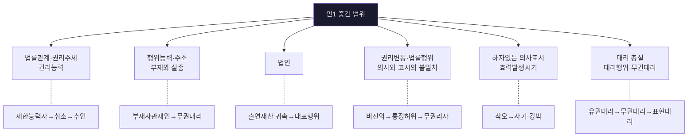

### 📊 송영곤 사례 4갈래 축
- 출처 위치: [《민법의_기초이론_1_강의계획서_p001-004.md》 p.3 | "3/2 ~ 3/8 자연인의 행위능력 , 주소 , 부재와 실종"] [《기본민법_주요사례1_p001-016.md》 p.2 | "위반시 ‘[[무권대리]]’로서 무효"] [《기본민법_주요사례1_p001-016.md》 p.3 | "출연재산은 ‘법인이 성립한 때’로부터 법인의 재산"] [《기본민법_6차시_민법총칙_의사표시_통정허위표시.md》 소제목 "효과" | "당사자간: 무효 (108조 1항)"]
| 축 | 핵심 쟁점 | 연결 조문 |
|---|---|---|
| ① 제한능력자/행위능력 | 미성년자 취소·묵시적 추인·법정추인 | §5, §13, §15, §17 |
| ② 부재자관재인과 무권대리 | 권한초과→무권대리→사후추인→§126 부정 | §22, §118, §126, §130 |
| ③ 재단법인·대표기관 | 출연재산 귀속시기·정관위반·대표권남용 | §45, §48, §60 |
| ④ 의사표시·통정허위·무권리자 | 선의제3자 보호·94조2항·무권리자 처분 | §107~§110 |

### 📊 민법 제1조: 관습법 vs 사실인 관습
| 구분 | 법적 성격 | 효력 | 법원의 태도 |
|---|---|---|---|
| **관습법** | 법적 확신을 얻은 사회규범 | 법령과 같은 효력 | 법원이 직권으로 확정 |
| **사실인 관습** | 단순한 관행 | 당사자 의사 보충에 그침 | 원칙적으로 당사자 주장·입증 |

- `[판례]` 관습법은 사회의 법적 확신과 인식에 의하여 법적 규범으로 승인된 것으로서 법령과 같은 효력을 갖는다.
  - 근거 발췌: "사회의 법적 확신과 인식에 의하여 법적 규범으로 승인"; "법령과 같은 효력을 갖는 관습"
  - 근거 위치: [《민법기초이론I 관련 판례1(~사기까지).pdf》 p.1 | "사회의 법적 확신과 인식에 의하여 법적 규범으로 승인"] [《민법기초이론I 관련 판례1(~사기까지).pdf》 p.1 | "법령과 같은 효력을 갖는 관습"]
- `[판례]` 사실인 관습은 법률행위 당사자의 의사를 보충하는 데 그치고, 강행규정 영역에서는 원칙적으로 법적 효력을 부여할 수 없다.
  - 근거 발췌: "법률행위의 당사자의 의사를 보충함에 그치는 것"; "강행규정일 경우"; "법적 효력을 부여할 수 없다"
  - 근거 위치: [《민법기초이론I 관련 판례1(~사기까지).pdf》 p.1 | "법률행위의 당사자의 의사를 보충함에 그치는 것"] [《민법기초이론I 관련 판례1(~사기까지).pdf》 p.1 | "강행규정일 경우"] [《민법기초이론I 관련 판례1(~사기까지).pdf》 p.1 | "법적 효력을 부여할 수 없다"]

---

## 2. 권리주체와 제한능력자

### 📊 제한능력자 제도 체계도
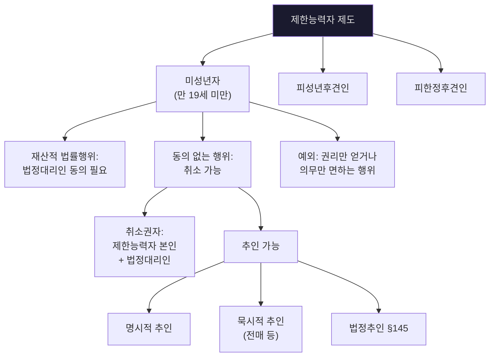

- `[개념요지]` 제한능력자 제도는 거래의 안전을 일정 부분 희생하더라도 제한능력자를 보호하려는 제도다.
  - 근거 위치: [《민법의_기초이론_1_강혜림_송영곤_주요사례_쟁점정리.md》 L20-L22 | "거래의 안전을 희생시키더라도 제한능력자를 보호"]

### 📊 추인 유형 비교표
| 유형 | 의의 | 요건 | 효과 | 사례 |
|---|---|---|---|---|
| **명시적 추인** | 취소할 수 있는 행위를 명시적으로 추인 | 취소원인 소멸 후 + 추인 의사표시 | 처음부터 유효 (소급) | "그 계약 인정합니다" |
| **묵시적 추인** | 추인 의사를 추단할 수 있는 행위 | 취소권자의 추인으로 볼 수 있는 행위 | 처음부터 유효 (소급) | 乙이 丁에게 전매 |
| **법정추인 §145** | 법률이 정한 행위를 하면 추인 간주 | 전부·일부 이행, 이행청구, 권리양도 등 | 처음부터 유효 | 대금 일부 지급 |

- 주요사례 1번 핵심: `미성년자 → 법정대리인 동의 없이 매매·전매 → 묵시적 추인 or 법정추인`
- 같은 사례에서 `[[중간생략등기]]`까지 연결됨.

### 📊 의사능력·미성년자 신용구매 판례 보강
| 쟁점 | 기준 | 결론 |
|---|---|---|
| **의사능력** | 행위의 의미·결과를 합리적으로 판단할 능력 | 특별한 법률효과 있는 행위는 그 법률적 의미까지 이해해야 함 |
| **묵시적 동의** | 명시적일 필요 없음 | 연령·지능·직업·소득·계약경위 등 종합판단 |
| **현존이익 반환** | 취소 후 받은 이익이 남아 있는 범위 | 신용카드 이용계약 취소와 개별 매매는 별개 |

- `[판례]` 의사능력은 자신의 행위의 의미와 결과를 정상적인 인식력·예기력으로 합리적으로 판단할 수 있는 정신적 능력이고, 특별한 법률효과가 붙는 행위라면 그 법률적 의미와 효과까지 이해해야 한다.
  - 근거 발췌: "자신의 행위의 의미나 결과를"; "합리적으로 판단할 수 있는 정신적 능력"; "법률적인 의미나 효과에 대하여도 이해"
  - 근거 위치: [《민법기초이론I 관련 판례1(~사기까지).pdf》 p.2 | "자신의 행위의 의미나 결과를"] [《민법기초이론I 관련 판례1(~사기까지).pdf》 p.2 | "합리적으로 판단할 수 있는 정신적 능력"] [《민법기초이론I 관련 판례1(~사기까지).pdf》 p.2 | "법률적인 의미나 효과에 대하여도 이해"]
- `[판례]` 미성년자의 신용구매취소는 원칙적으로 [[신의칙]] 위반이 아니고, 법정대리인의 동의는 묵시적으로도 가능하다.
  - 근거 발췌: "신의칙에 위배된 것이라고 할 수 없다"; "언제나 명시적이어야 하는 것은 아니고 묵시적으로도 가능"
  - 근거 위치: [《민법기초이론I 관련 판례1(~사기까지).pdf》 p.3 | "신의칙에 위배된 것이라고 할 수 없다"] [《민법기초이론I 관련 판례1(~사기까지).pdf》 p.3 | "언제나 명시적이어야 하는 것은 아니고 묵시적으로도 가능"]
- `[판례]` 묵시적 동의·처분허락 여부는 미성년자의 연령·지능·직업·독자적 소득·계약의 성질·체결경위 등을 종합해 판단한다.
  - 근거 발췌: "연령·지능·직업·경력"; "독자적인 소득의 유무"; "계약의 성질·체결경위·내용"
  - 근거 위치: [《민법기초이론I 관련 판례1(~사기까지).pdf》 p.3 | "연령·지능·직업·경력"] [《민법기초이론I 관련 판례1(~사기까지).pdf》 p.3 | "독자적인 소득의 유무"] [《민법기초이론I 관련 판례1(~사기까지).pdf》 p.3 | "계약의 성질·체결경위·내용"]
- `[판례]` 신용카드 이용계약이 취소되어도 개별 매매는 특별한 사정이 없으면 유효하고, 미성년자는 현존이익 한도에서만 상환책임을 진다.
  - 근거 발췌: "현존하는 한도에서 상환할 책임"; "개별적인 매매계약은"; "유효하게 존속"
  - 근거 위치: [《민법기초이론I 관련 판례1(~사기까지).pdf》 p.3 | "현존하는 한도에서 상환할 책임"] [《민법기초이론I 관련 판례1(~사기까지).pdf》 p.3 | "개별적인 매매계약은"] [《민법기초이론I 관련 판례1(~사기까지).pdf》 p.3 | "유효하게 존속"]

### 📊 제한능력자 특유 배제사유·상대방 보호수단
| 항목 | 문장형 정리 | 원칙·예외 |
|---|---|---|
| **① 확답촉구권 (§15)** | 상대방은 제한능력자나 법정대리인에게 1개월 이상의 기간을 정해 추인 여부 확답을 촉구할 수 있다. | 원칙적으로 기간 내 발송이 없으면 추인 간주, 특별한 절차가 필요한 행위는 취소 간주다. |
| **② 철회권·거절권 (§16)** | 추인 전 상대방은 자신의 의사표시를 철회하거나 단독행위를 거절할 수 있다. | 다만 계약 당시 상대방이 제한능력자임을 알았으면 철회권은 제한된다. |
| **③ 속임수 (§17)** | 제한능력자가 자기를 능력자로 믿게 하거나 법정대리인 동의가 있는 것처럼 속이면 취소권이 소멸한다. | 단순 침묵이 아니라 상대방을 오인하게 하는 적극적 기망이어야 안전하다. |
| **④ 현존이익 반환** | 취소 후 제한능력자는 받은 이익이 현존하는 한도에서만 반환한다. | 일반 부당이득보다 특별히 보호되는 특칙이다. |

- `쟁점노트 정리`: ① 제한능력자 문제는 먼저 일반 추인·법정추인을 본 뒤, ② 상대방 보호수단인 확답촉구권·철회권·거절권·속임수를 순서대로 확인하고, ③ 취소되면 현존이익 반환으로 닫는 구조가 가장 안정적이다.
  - 근거 발췌: "확답촉구권(제15조)"; "철회권 · 거절권(제16조)"; "제한능력자 속임수와 취소권 소멸(제17조)"; "받은 이익이 현존하는 한도"
  - 근거 위치: [《민사법쟁점노트_재산법_26_p001-030.md》 p.4-5 | "확답촉구권(제15조)"] [《민사법쟁점노트_재산법_26_p001-030.md》 p.5 | "철회권 • 거절권(제16조)"] [《민사법쟁점노트_재산법_26_p001-030.md》 p.5 | "제한능력자 속임수와 취소권 소멸(제17조)"] [《민사법쟁점노트_재산법_26_p001-030.md》 p.5 | "받은 이익이 현존하는 한도"]
- `암기 문장`: ① 제한능력자 취소사안은 `추인`과 `상대방 보호수단`을 먼저 보고, ② 상대방 보호수단은 `확답촉구 → 철회·거절 → 속임수` 순서로 외우며, ③ 취소가 되면 결국 `현존이익 반환`으로 정리한다.

### 📊 동기의 착오
| 항목 | 정리 | 답안 포인트 |
|---|---|---|
| **의의** | 의사와 표시는 일치하지만, 의사를 결정하게 한 동기가 사실과 다름 | 표시행위 자체의 착오와 구별 |
| **원칙** | 원칙적으로 취소할 수 있는 착오에서 제외 | 동기가 표시되어 계약 내용이 된 경우 예외 문제 |
| **확장 포인트** | 쌍방 공통의 동기의 착오가 별도 쟁점이 될 수 있음 | 단순 사정착오인지 계약내용화됐는지 구별 |

- `[교재 정리]` 동기의 착오에서는 의사와 표시는 일치하고, 단지 의사를 결정하게 한 동기가 실제와 다르다.
  - 근거 발췌: "동기의 착오에서는 의사와 표시는 일치한다"
  - 근거 위치: [《민법강의_26_p241-270.md》 L980 | "동기의 착오에서는 의사와 표시는 일치한다"]
- `[교재 정리]` 통설은 동기의 착오를 원칙적으로 취소할 수 있는 착오의 범주에서 제외한다.
  - 근거 발췌: "동기의 착오를 취소할 수 있는 착오의 범주에서 제외"
  - 근거 위치: [《민법강의_26_p241-270.md》 L987 | "동기의 착오를 취소할 수 있는 착오의 범주에서 제외"]
- `암기 문장`: ① 원칙적으로 동기의 착오는 의사표시 자체의 착오가 아니므로 취소 대상이 아니고, ② 예외적으로 그 동기가 표시되어 법률행위 내용으로 편입되면 착오 문제가 될 수 있으며, ③ 쌍방 공통 동기의 착오도 이 `내용화` 여부를 중심으로 본다.
  - 근거 발췌: "동기의 착오에서는 의사와 표시는 일치한다"; "동기의 착오를 취소할 수 있는 착오의 범주에서 제외"
  - 근거 위치: [《민법강의_26_p241-270.md》 L980 | "동기의 착오에서는 의사와 표시는 일치한다"] [《민법강의_26_p241-270.md》 L987 | "동기의 착오를 취소할 수 있는 착오의 범주에서 제외"]

---

## 3. 부재와 실종: 부재자관재인 사례

### 📊 부재자관재인 처분행위 판단 플로우
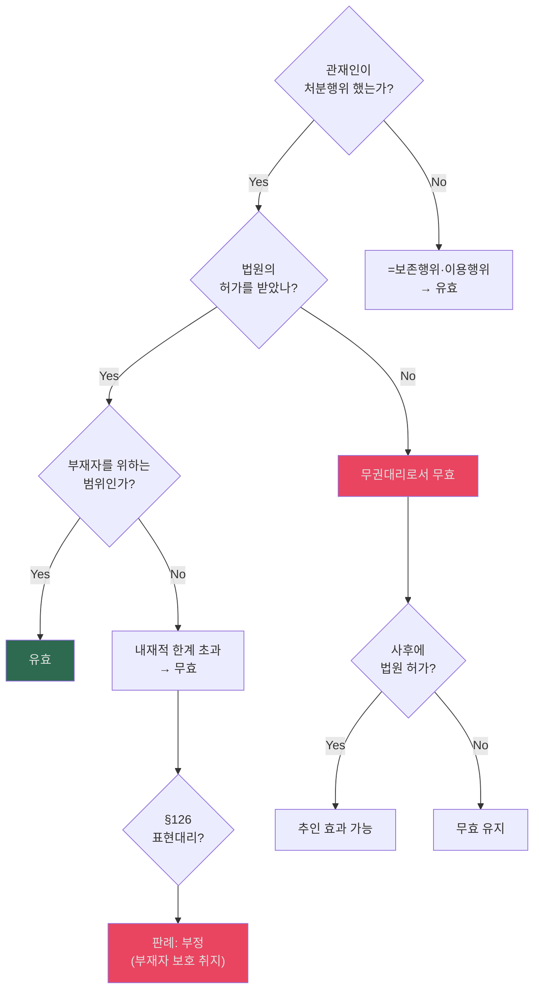

- `핵심`: 관재인의 권한은 `부재자를 위하는 범위`라는 내재적 한계 → 이를 넘으면 §126도 부정.
- `대리 파트 선연결`: 여기서 `권한초과 → [[무권대리]] → 사후추인 → [[표현대리]] 부정` 흐름을 먼저 익힘.

### 📊 실종선고 취소와 제3자 전매 사례 (§29 ① 단서)
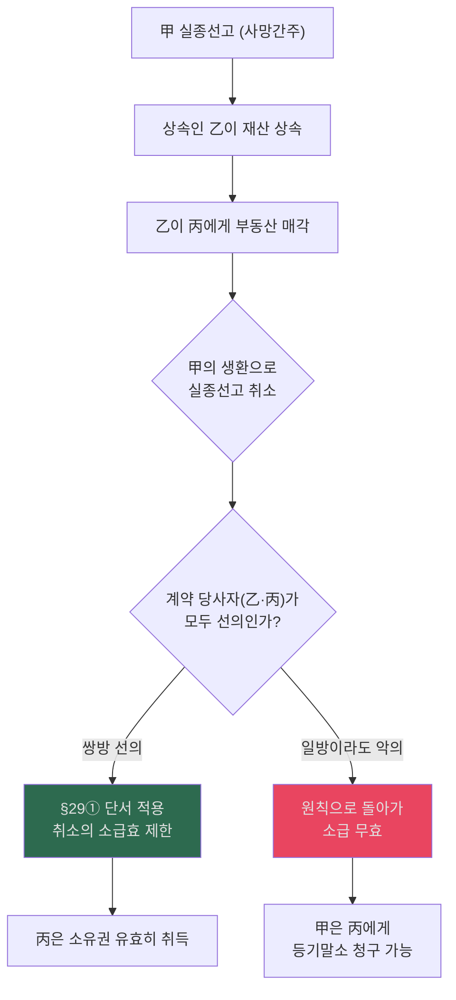
- `사례형 답안 포인트`: 실종선고 취소 시 원칙적으로 소급하여 무효가 되나, 취소 전 **선의**로 한 행위는 효력을 잃지 않음(§29① 단서). 판례는 재산행위의 경우 **계약 당사자 쌍방(乙, 丙)이 모두 선의**여야 한다고 엄격하게 해석함.

---

## 4. 법인 파트: 재단법인 출연재산 귀속

### 📊 재단법인 출연재산 귀속시기 학설 비교
- 출처 위치: [《기본민법_주요사례1_p001-016.md》 p.5 | "출연재산은 ‘법인이 성립한 때’로부터 법인의 재산"] [《기본민법_주요사례1_p001-016.md》 p.5 | "제3자에 대한 관계에 있어서 ... 등기를 필요로 함(대판(全合) [[78다481]])"]
| 학설 | 귀속 시점 | 설립등기 전 상속인 처분 | 지위 |
|---|---|---|---|
| **출연시설** | 출연행위 시 | 상속인 처분 불가 | 소수 |
| **법인성립시설** | 법인 설립등기 시 (§48) | 설립 전까지 상속인 처분 가능 | **판례·다수설** |
| **조건부 효력설** | 출연 시 → 성립으로 조건부 확정 | — | 소수 |

- `[판례]` 생전처분에 의한 재단법인 출연재산은 법인이 성립한 때부터 법인의 재산이 된다.
  - 근거 발췌: "출연재산은 ‘법인이 성립한 때’로부터 법인의 재산"
  - 근거 위치: [《기본민법_주요사례1_p001-016.md》 p.5 | "출연재산은 ‘법인이 성립한 때’로부터 법인의 재산"]
- `[판례]` 다만 제3자와의 관계에서 출연재산이 부동산이면 등기를 마쳐야 이를 대항할 수 있다.
  - 근거 발췌: "제3자에 대한 관계에 있어서 ... 등기를 필요로 함"
  - 근거 위치: [《기본민법_주요사례1_p001-016.md》 p.5 | "제3자에 대한 관계에 있어서 출연행위는 법률행위이므로 출연재산의 법인에의 귀속은 부동산의 권리에 관한 것일 경우 등기를 필요로 함(대판(全合) [[78다481]])"]

### 📊 재단법인 설립~출연 흐름도
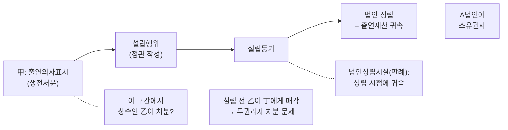

### 📊 법인 대표행위 하자 판단표
| 하자 유형 | 내용 | 법률효과 | 판례 |
|---|---|---|---|
| **정관 위반 (내부적 제한)** | 이사회결의 없이 대표행위 | 등기 없으면 선의 제3자에 대항 불가 (§60) | 상대방 악의·과실이면 무효 |
| **대표권남용** | 사적 이익 추구 | 원칙 유효, 상대방 악의·중과실이면 §107① 유추 무효 | §107① 유추 |
| **권한 유월** | 대표권 범위 초과 | 무효, §126 표현대리 유추 가능 | — |

- `[판례]` 정관상 대표권 제한은 등기하지 않으면 제3자에게 대항할 수 없고, 여기의 제3자에는 악의의 제3자도 포함된다.
  - 근거 발췌: "민법 제60조에서 규정하고 있는 ‘제3자’에는 악의의 제3자도 포함"
  - 근거 위치: [《기본민법_주요사례1_p001-016.md》 p.7 | "민법 제60조에서 규정하고 있는 ‘제3자’에는 악의의 제3자도 포함"]
- `[판례]` 대표권남용은 상대방이 배임사실을 알았거나 알 수 있었을 때에만 효력이 부정된다.
  - 근거 발췌: "대리인의 배임사실을 “상대방이 알았거나 알 수 있었을 때” 대리행위 효력 부정"
  - 근거 위치: [《기본민법_주요사례1_p001-016.md》 p.7 | "대리인의 배임사실을 “상대방이 알았거나 알 수 있었을 때” 대리행위 효력 부정"]

---

## 5. 의사표시: 비진의·통정허위·착오·사기 — ★★★

### 📚 재작성: 의사표시는 `유효 → 무효 → 취소 → 효과` 순서로 본다
| 1차 분류 | 조문 | 기본 효력 | 소송상 첫 주장 | 상대방 방어 |
|---|---|---|---|---|
| **확정적 유효** | §107 본문 | 원칙 유효 | 상대방은 계약유효·이행청구 | 표의자는 `상대방 악의·과실` 없으면 무효 주장 불가 |
| **잠정 유효(취소 전 유효)** | §109, §110 | 취소 전까지 유효 | 표의자는 취소의 의사표시 + 요건사실 주장 | 상대방은 `중과실`, `제3자 보호`, `기망 부존재` 등 항변 |
| **확정적 무효** | §108, §103 | 처음부터 무효 | 무효 주장 + 원상회복·말소·부당이득 주장 | 상대방은 선의 제3자 보호, 불법원인급여, 적극가담 부존재 등 방어 |

- `정리 포인트`: ① 먼저 `유효인지/무효인지/취소 가능한지` 법률효과를 가른다. ② 그 다음 `누가 무엇을 청구하는지`로 넘어간다. ③ 마지막에 제3자 보호와 [[부당이득]]·말소의 문제를 붙인다.

### 📊 재작성: 유효의 두 층위와 무효·취소 이후 효과
| 층위 | 유형 | 왜 중요한가 | 바로 이어지는 효과 |
|---|---|---|---|
| **확정적 유효** | 비진의표시 본문, 진의 있는 의사표시 | 일단 계약이 완전히 살아 있다 | 이행청구·채무불이행책임으로 직행 |
| **잠정 유효** | 착오·사기·강박 | 취소 전까지는 유효라서 이미 급부가 이루어질 수 있다 | 취소되면 소급적으로 무효 → 부당이득반환 구조 |
| **처음부터 무효** | 통정허위, §103 위반 | 등기·인도·급부가 있어도 원인행위가 처음부터 없다 | 말소청구·부당이득·대위·제3자보호 문제 |

- `암기 문장`: ① 비진의는 `원칙 유효`, ② 착오·사기·강박은 `취소 전 유효`, ③ 통정허위·반사회질서는 `처음부터 무효`로 외우면 공방 순서가 정리된다.

### 📚 2026 판례추가 PDF 반영: 의사표시 판례축 재작성
| 판례 | 들어가는 쟁점 | 판례가 실제로 정리한 포인트 |
|---|---|---|
| **93다2629, 2636** | 목적물 표시 착오·해석 | 계약서 표시가 잘못되어도 쌍방이 실제로 무엇을 팔고 사려 했는지 의사합치가 있으면 그 목적물에 관한 계약이 성립하고, 잘못 표시된 토지에 대한 등기는 원인무효가 된다 |
| **2000다12259** | 동기의 착오 | 동기가 내용으로 표시되었고 중요부분 착오이면 취소 가능하며, 중대한 과실은 `보통 요구되는 주의를 현저히 결여`한 경우를 말한다 |
| **2013다49794** | 착오 일반법리 | 특별한 배제규정이 없는 한 민법 제109조는 원칙적으로 모든 사법상 의사표시에 적용되고, 상대방이 착오를 알고 이용한 경우에는 표의자의 중과실이 있어도 취소가 허용될 수 있다 |
| **85도167** | 사기와 동기착오의 경합 | 기망으로 동기의 착오가 생긴 경우에도 사기에 의한 의사표시 취소가 가능하다 |
| **2004다43824** | 표시상의 착오 vs 사기 | 제3자의 기망으로 서명했더라도 본질이 `기명날인의 착오`이면 사기 규정보다 착오 규정으로 처리한다 |

- `판례 요지`: 새 판례 파일은 의사표시 파트를 `해석 → 착오 → 사기 → 경합 부정` 순서로 정리한다. 따라서 민1 답안도 ① 먼저 해석으로 해결되는지 보고, ② 안 되면 착오, ③ 상대방이나 제3자의 기망이 있으면 사기, ④ 다만 표시상의 착오로 정리되는 경우에는 사기 법리로 바로 가지 않는 구조가 안정적이다.
  - 근거 발췌: "갑 토지에 관하여 이를 매매의 목적물로 한다는 쌍방당사자의 의사합치"; "중대한 과실"; "민법 제109조의 법리는 ... 원칙적으로 모든 사법상 의사표시에 적용"; "기망행위로 인하여 동기의 착오"; "표시상의 착오에 해당"
  - 근거 위치: [《m1_2026_판례추가_extract.md》 p.1 | "갑 토지에 관하여 이를 매매의 목적물로 한다는 쌍방당사자의 의사합치"] [《m1_2026_판례추가_extract.md》 p.1 | "중대한 과실"] [《m1_2026_판례추가_extract.md》 p.1-2 | "민법 제109조의 법리는 ... 원칙적으로 모든 사법상 의사표시에 적용"] [《m1_2026_판례추가_extract.md》 p.2 | "기망행위로 인하여 동기의 착오"] [《m1_2026_판례추가_extract.md》 p.2 | "표시상의 착오에 해당"]

### 📊 재작성: 의사표시 사례 공방 순서
| 단계 | 원고가 먼저 적을 것 | 피고가 자주 버티는 지점 |
|---|---|---|
| **1 해석** | 계약의 실제 목적물·의사합치 | 문언상 표시만을 내세워 다른 계약이라고 주장 |
| **2 착오** | 중요부분 착오 + 내용 편입 + 중과실 부재 | 동기 불과, 중요성 부족, 중과실 항변 |
| **3 사기** | 기망행위 + 인과관계 + 취소 | 제3자 사기, 상대방 선의, 사기 아닌 착오 주장 |
| **4 효과** | 취소/무효 후 말소·부당이득·손배 | 제3자 보호, §746, 적극가담 부존재 |

- `모답형 문장`: 계약서 문언이 잘못 적혀 있어도 당사자의 실제 의사합치가 특정 목적물에 모여 있으면 해석으로 그 목적물을 계약목적물로 확정한다. 그 다음 해석으로 해결되지 않는다면 동기가 내용으로 표시되었는지, 중요부분 착오인지, 표의자에게 중대한 과실이 없는지를 따져 착오취소를 검토한다. 상대방 또는 제3자의 기망이 개입한 경우에는 사기취소도 함께 문제되지만, 표시상의 착오로 평가되는 경우에는 사기보다 착오법리로 처리하는 것이 판례 흐름이다.

### 📊 의사표시 하자 유형 체계도
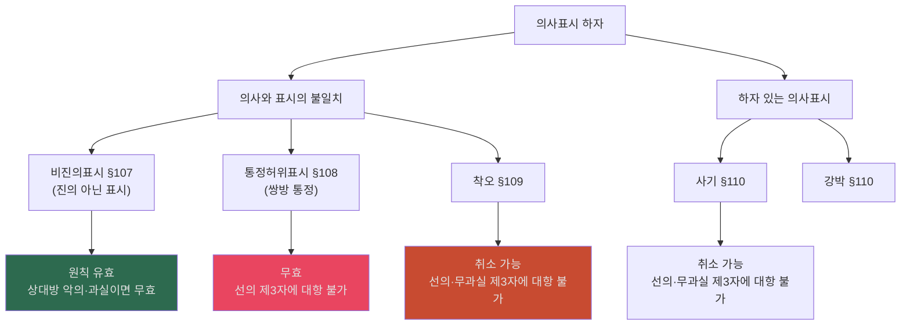

### 📊 §107~§110 비교 총정리표 — ★★★
- 출처 위치: [《기본민법_6차시_민법총칙_의사표시_통정허위표시.md》 소제목 "효과" | "당사자간: 무효 (108조 1항)"] [《3-1_민법_윤동환_기본강의_민총답안_(사례)_p001-004.md》 p.4 | "착오 취소의 요건"] [《민법기초이론I 관련 판례1(~사기까지).pdf》 p.11 | "민법 110조에 의하여 매수의 의사표시를 취소할 수 있다"]
| 조문 | 유형 | 효력 | 무효/취소 | 제3자 보호 | 제3자 요건 |
|---|---|---|---|---|---|
| **§107** | 비진의표시 | 원칙 **유효** | 상대방 악의·과실 → 무효 | §107② | **선의** |
| **§108** | 통정허위표시 | **무효** | — | §108② | **선의** |
| **§109** | 착오 | **취소** 가능 | 표의자 중과실 → 취소 불가 | §109② | **선의·무과실** |
| **§110** | 사기·강박 | **취소** 가능 | 제3자 사기 → 상대방 과실 시 취소 | §110③ | **선의·무과실** |

### 📊 비진의표시(§107) 단독 출제 핵심 판례 비교
| 사안 유형 | 판례의 태도 (비진의표시 인정 여부) | 결론 |
|---|---|---|
| **근로자의 일괄 사직서 제출** | 경영방침에 따라 어쩔 수 없이 제출한 경우 **비진의표시 O** | 사용자(회사)도 알았으므로 §107① 단서 적용 → **무효** |
| **물의를 일으킨 자의 사직서 제출** | 사태 수습을 위해 스스로 사직서 제출 **비진의표시 X** | 당시 최선이라 판단했으므로 진의 O → **유효** |
| **대출금 명의대여** | 학교법인/제3자가 타인(명의자) 이름으로 대출 **비진의표시 X** | 법률상 효과를 받을 의사가 있었으므로 진의 O → **유효** |
- `판례 요지`: 비진의표시에서 '진의'란 특정한 내용의 의사표시를 하고자 하는 **표의자의 생각**을 말하는 것이지, 표의자가 **진정으로 마음속에서 바라는 사항**을 뜻하는 것은 아님.

### 📊 통정허위표시 선의 제3자 범위 다이어그램
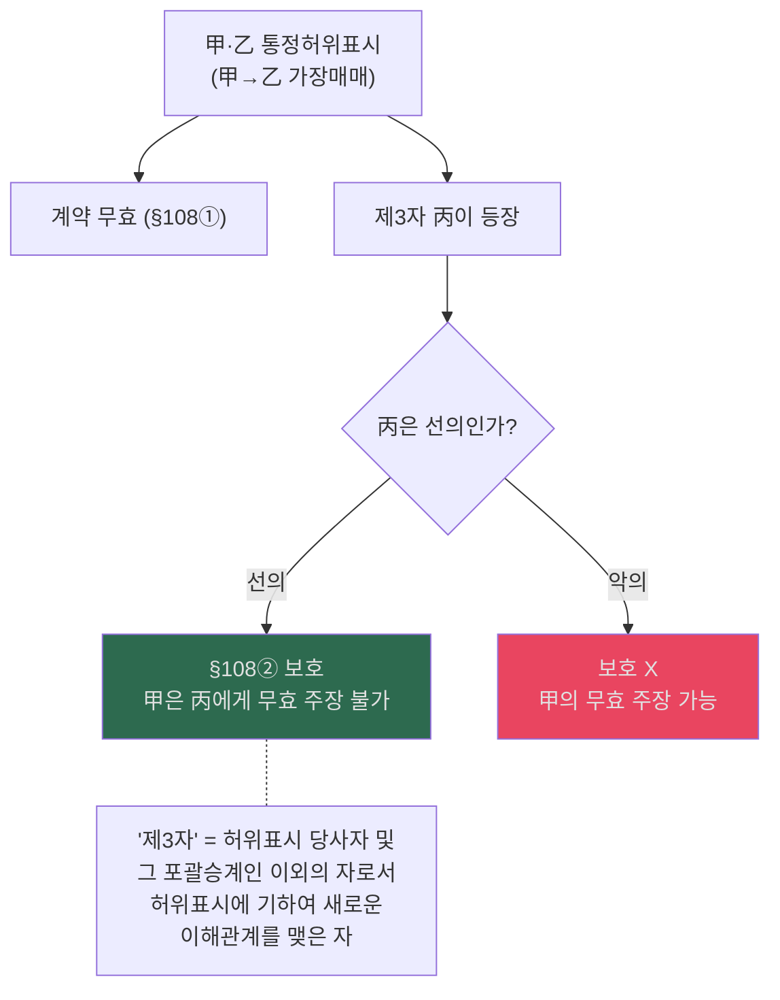

---

## 6. 대리 제도 — ★★★

### 📊 재작성: 대리 분쟁의 소송 흐름
| 순서 | 확인할 것 | 조문·법리 | 원고/피고 공방 포인트 |
|---|---|---|---|
| **1** | 현명 있는가 | §114 | 본인 명의 행위인지, 이름을 밝히지 않았는지 |
| **2** | 대리권 있는가 | §118 이하 | 수권행위, 범위, 소멸 여부 |
| **3** | 대리권 없으면? | §130 이하 | 본인 추인 여부, 상대방 최고·철회 여부 |
| **4** | 그래도 본인 책임이 붙는가 | §125, §126, §129 | 표현대리 성립 여부 |
| **5** | 끝까지 본인 책임이 없으면 | §135 | 무권대리인 책임으로 이동 |

- `공방 흐름`: ① 원고는 먼저 `현명 + 본인효과귀속`을 주장한다. ② 피고가 `대리권 부존재`를 다투면, ③ 다시 [[표현대리]] 또는 본인 추인을 붙이고, ④ 모두 막히면 무권대리인 개인책임으로 내려간다.
- `서브개념 메모`: 상대방은 최고권·철회권을 통해 본인의 추인 여부를 압박할 수 있고, 본인이 추인하면 원칙적으로 소급하여 유효가 된다. 그래서 사례에서는 `추인 전 철회가 있었는지`, `본인이 추인을 거절했는지`를 반드시 적는다.

### 📊 대리 제도 체계도
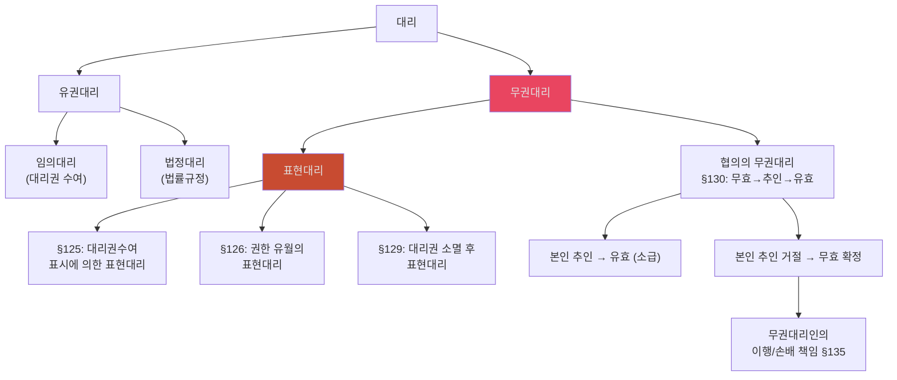

- `[개념요지]` 민법상의 대리는 대리인이 본인의 이름으로 법률행위를 하고 그 효과가 본인에게 직접 귀속되는 제도다.
  - 근거 위치: [《민법의_기초이론_1_강혜림_송영곤_주요사례_쟁점정리.md》 L535-L537 | "대리인이 본인의 이름으로"] [《민법의_기초이론_1_강혜림_송영곤_주요사례_쟁점정리.md》 L535-L537 | "법률효과가 본인에게 귀속"]
- `[개념 정리]` 대리 파트는 먼저 `현명`으로 본인 명의 행위인지 확인하고, 다음에 `대리권 유무`를 본 뒤, 마지막으로 그 효과가 본인에게 직접 귀속되는지를 정리하면 가장 안정적이다.
  - 근거 발췌: "대리인이 본인의 이름으로"; "법률효과가 본인에게 귀속"
  - 근거 위치: [《민법의_기초이론_1_강혜림_송영곤_주요사례_쟁점정리.md》 L535-L535 | "대리인이 본인의 이름으로"] [《민법의_기초이론_1_강혜림_송영곤_주요사례_쟁점정리.md》 L535-L535 | "법률효과가 본인에게 귀속"]

### 📊 대리행위 하자(§116) 판단 기준표
| 하자·사정 유형 | 기준자 | 예외 |
|---|---|---|
| **비진의·통정·착오·사기·강박** | **대리인** | 특정 법률행위 위임 + 본인 지시 좇은 경우 → 본인 기준 |
| **선/악의, 과실 유무** | **대리인** | (동상) |
| **궁박** | **본인** | 불공정한 법률행위(§104) 시 궁박만 본인 기준 |
| **경솔·무경험** | **대리인** | — |

### 📊 대리권 남용의 판단 및 처리 (판례 매핑) — ★★★
- 출처 위치: [《기본민법_주요사례1_p001-016.md》 p.4 | "통설과 판례(대판 1987.11.10. [[86다카371]])는 ‘민법 제107조 제1항 단서 유추적용설’"] [《기본민법_주요사례1_p001-016.md》 p.4 | "대리인의 배임사실을 “상대방이 알았거나 알 수 있었을 때” 대리행위 효력 부정"]
| 쟁점 | 내용 | 적용 판례 (대표 사례) |
|---|---|---|
| **처리 원칙** | 원칙적 유효, 상대방이 알았거나 알 수 있었을 경우 **§107① 단서 유추 적용** → 무효 | 은행 대출담당자의 대출금 횡령 |
| **상대방의 악의·과실** | 대리인의 배임적 의도를 상대방이 알았거나 중대한 과실/과실로 알지 못함 | 과다한 커미션 수수, 이례적 단기 고리 대출 |
| **책임 귀속** | 무효 시 본인의 이행책임 부정 | 본인(은행) 책임 ✗ |

### 📊 표현대리 3유형 비교표
| 유형 | 조문 | 상황 | 요건 | 효과 |
|---|---|---|---|---|
| **대리권수여 표시** | §125 | 대리권 수여한 적 없으나 수여한 것처럼 표시 | ① 표시행위 ② 상대방 선의·무과실 | 본인에게 효력 |
| **권한 유월** | §126 | 대리권은 있으나 범위 초과 | ① 기본대리권 존재 ② 상대방 선의·무과실 | 본인에게 효력 |
| **대리권 소멸 후** | §129 | 대리권 소멸 후 대리행위 | ① 과거 대리권 존재 ② 상대방 선의·무과실 | 본인에게 효력 |

### 📊 §126 표현대리 인정/부정 판단 플로우
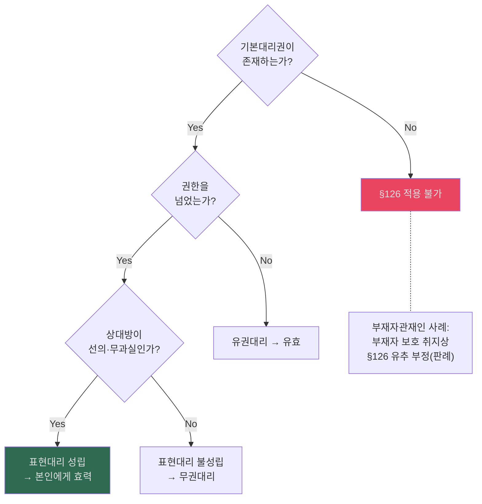

---

## 7. 착오 (§109) 심화

### 📊 착오 유형 분류
| 착오 유형 | 내용 | 취소 가능 여부 |
|---|---|---|
| **내용의 착오** | 표시행위의 의미에 대한 착오 | ○ |
| **표시상의 착오** | 표시 자체의 오기·오언 | ○ |
| **동기의 착오** (원칙) | 의사표시의 동기에 착오 | ✗ (원칙) |
| **공통동기의 착오** | 양당사자가 공통된 동기를 전제 | ○ (판례) |
| **시가착오** | 물건의 가치 판단 착오 | ✗ (판례) |

### 📊 착오상 '중대한 과실' 유무 판례 비교표
| 중대한 과실 인정 (취소 ✗) | 중대한 과실 부정 (취소 ○) |
|---|---|
| **공장설립 부지 매수**자가 관할관청에 설립 가능 여부를 알아보지 않은 경우 | **공인중개사**를 통해 매매계약 체결하며 중개사 말만 믿은 경우 |
| **전문 보증기관**이 채무자의 보증요건을 제대로 확인하지 않은 경우 | 관할관청의 **행정지도**를 믿고 계약을 체결한 경우 |
| 토지대장, 임야도 등을 직접 확인하지 않은 경우 (개인거래 시) | 상대방(매도인)에 의해 **유발된 착오**인 경우 |

> **판단 기준**: 표의자의 직업, 행위의 종류, 목적 등에 비추어 일반적으로 요구되는 주의를 현저히 결여했는지 여부.

### 📊 착오와 사기의 경합 처리
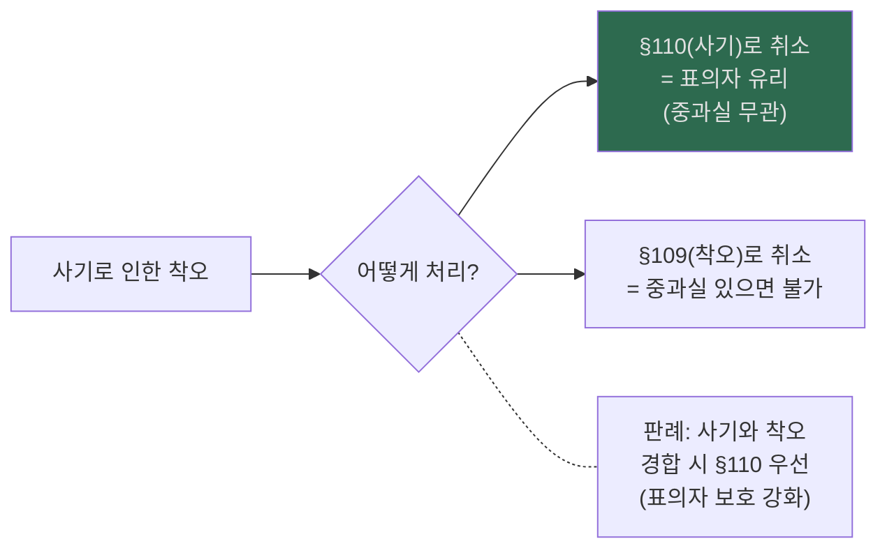

---

## 8. 법인 불법행위와 비법인사단

### 📊 법인 계약상 책임 4단계
| 단계 | 요건 | 실전 포인트 |
|---|---|---|
| ① 대표기관 현명 | 대표기관 명의로 한 행위일 것 | 대표기관 행위가 아니면 법인 귀속이 끊긴다 |
| ② 목적범위 | 법인의 권리능력 범위 내 행위일 것 | 직접·간접 필요행위를 포함하고 객관적 성질로 판단한다 |
| ③ 대표권 범위 | 법령상 제한인지, 정관상 제한인지 구별할 것 | 정관상 제한은 등기하지 않으면 대항 문제가 생긴다 |
| ④ 대표권 남용 부재 | 외형상 권한 범위 내라도 상대방 악의·과실이 없을 것 | 상대방이 알거나 알 수 있었으면 107조 1항 단서 유추 문제다 |

- `요건 정리`: ① 대표기관 현명 → ② 법인의 권리능력 범위 → ③ 대표권 범위 → ④ 대표권 남용 여부 순으로 본다.
  - 근거 발췌: "① 대표기관 현명"; "② 법인의 권리능력 범위 내의 행위일 것"; "③ 대표자의 대표권 범위 내의 행위일 것"; "④ 대표권 남용 사안이 아닐 것"
  - 근거 위치: [《민법기초이론_법인 관련 자료.pdf》 p.1 | "① 대표기관 현명"] [《민법기초이론_법인 관련 자료.pdf》 p.1 | "② 법인의 권리능력 범위 내의 행위일 것"] [《민법기초이론_법인 관련 자료.pdf》 p.1 | "③ 대표자의 대표권 범위 내의 행위일 것"] [《민법기초이론_법인 관련 자료.pdf》 p.2 | "④ 대표권 남용 사안이 아닐 것"]
- `[교재 보강]` 법인 파트는 자연인처럼 `의사능력` 문제로 접근하는 게 아니라, ① 법인에 어떤 범위의 권리·의무를 인정할지 ② 그 권리를 누가 어떤 형식으로 행사하는지 ③ 누구의 어떤 불법행위에 대해 법인 자신이 책임지는지의 구조로 정리하는 것이 교재 기준이다.
  - 근거 발췌: "의사를 전제로 하는 능력은 문제가 되지 않고"; "① 법인에 어떠한 범위의 권리와 의무를 인정할 것인가"; "② 그것을 누가 어떠한 형식으로 하는가"; "③ 누구의 어떠한 불법행위에 대하여 법인 자신이 배상책임을 부담하는가"
  - 근거 위치: [《민법강의_민총_26_p031-060.md》 L721-725 | "의사를 전제로 하는 능력은 문제가 되지 않고"] [《민법강의_민총_26_p031-060.md》 L723-725 | "① 법인에 어떠한 범위의 권리와 의무를 인정할 것인가"] [《민법강의_민총_26_p031-060.md》 L723-725 | "② 그것을 누가 어떠한 형식으로 하는가"] [《민법강의_민총_26_p031-060.md》 L724-725 | "③ 누구의 어떠한 불법행위에 대하여 법인 자신이 배상책임을 부담하는가"]
- `[원교재 보강]` 원PDF도 같은 구조를 분명히 적고 있다. 법인은 `의사능력` 문제가 아니라 `권리의무 범위`, `행위주체와 형식`, `법인 자신의 배상책임`이라는 세 갈래로 보는 것이 교재의 기본 틀이다.
  - 근거 발췌: "의사를 전제로 하는 능력은 문제가 되지 않고"; "① 법인에 어떠한 범위의 권리와 의무를 인정할 것인가"; "② 그것을 누가 어떠한 형식으로 하는가"; "③ 누구의 어떠한 불법행위에 대하여 법인 자신이 배상책임을 부담하는가"
  - 근거 위치: [《민법강의_민총_26.pdf》 p.50 | "의사를 전제로 하는 능력은 문제가 되지 않고"] [《민법강의_민총_26.pdf》 p.50 | "① 법인에 어떠한 범위의 권리와 의무를 인정할 것인가"] [《민법강의_민총_26.pdf》 p.50 | "② 그것을 누가 어떠한 형식으로 하는가"] [《민법강의_민총_26.pdf》 p.50 | "③ 누구의 어떠한 불법행위에 대하여 법인 자신이 배상책임을 부담하는가"]
- `목적범위 판례문구`: "그 목적을 수행하는 데 있어 직접, 간접으로 필요한 행위는 모두 포함한다"; "목적수행에 필요한지의 여부는 행위의 객관적 성질에 따라 판단"
  - 근거 위치: [《민법기초이론_법인 관련 자료.pdf》 p.1 | "그 목적을 수행하는 데 있어 직접, 간접으로 필요한 행위는 모두 포함한다"] [《민법기초이론_법인 관련 자료.pdf》 p.1 | "목적수행에 필요한지의 여부는 행위의 객관적 성질에 따라 판단"]
- `대표권 제한·남용 판례문구`: "등기하지 않았다면 제3자의 선악 불문하고 대항할 수 없다는 무제한설"; "상대방이 알거나 알 수 있었을 경우"; "본인은 대리인의 행위에 대하여 아무런 책임이 없다"
  - 근거 위치: [《민법기초이론_법인 관련 자료.pdf》 p.2 | "등기하지 않았다면 제3자의 선악 불문하고 대항할 수 없다는 무제한설"] [《민법기초이론_법인 관련 자료.pdf》 p.2 | "상대방이 알거나 알 수 있었을 경우"] [《민법기초이론_법인 관련 자료.pdf》 p.2 | "본인은 대리인의 행위에 대하여 아무런 책임이 없다"]

#### ✍️ 법인 대표행위 하자 모답형
대표자의 계약행위가 법인에게 귀속되는지는 먼저 대표기관의 현명 여부, 다음으로 법인의 권리능력 범위, 직무관련성, 마지막으로 대표권 남용 여부를 차례로 검토하여야 한다. 외형상 대표권 범위 내의 행위라 하더라도 상대방이 대표자의 배임적 목적을 알았거나 알 수 있었다면 대표권 남용으로서 법인에게 효력이 귀속되지 않는다.
- 근거 발췌: "① 대표기관 현명"; "② 법인의 권리능력 범위"; "대표권 남용"; "상대방이 알았거나 알 수 있었는지"
- 근거 위치: [《민법기초이론_법인 관련 자료.pdf》 p.1 | "① 대표기관 현명"] [《민법기초이론_법인 관련 자료.pdf》 p.1 | "② 법인의 권리능력 범위"] [《민법의_기초이론_1_강혜림_송영곤_주요사례_쟁점정리_도표추가본.md》 L390-L392 | "대표권 남용"] [《민법의_기초이론_1_강혜림_송영곤_주요사례_쟁점정리_도표추가본.md》 L390-L392 | "상대방이 알았거나 알 수 있었는지"]

### 📊 법인 불법행위 책임 (§35) — 외형설
| 요건 | 내용 | 판례 포인트 |
|---|---|---|
| ① 대표기관의 행위 | 이사 등 대표권 있는 자의 행위 | 대표자 개인책임과 병존 가능 |
| ② 직무관련성 | 외형상 대표자의 직무행위로 보이면 족함 | 사리를 도모했거나 법령에 위반했어도 외형이 있으면 가능 |
| ③ 일반 불법행위 요건 | 고의·과실, 위법성, 손해, 인과관계 | 민법상 일반 불법행위 구조를 그대로 탄다 |
| ④ 피해자 선의 | 피해자가 무관련성을 알지 못할 것 | 피해자 악의·중과실이면 법인 책임이 끊긴다 |

- `요건 정리`: ① 대표기관의 행위일 것, ② 외형상 직무관련성이 있을 것, ③ 일반 불법행위 요건이 갖추어질 것, ④ 피해자의 악의·중과실이 없을 것을 순서대로 본다.
  - 근거 발췌: "행위의 외형상 법인의 대표자의 직무행위라고 인정할 수 있는 것이라면"; "피해자 자신이 알았거나 또는 중대한 과실로 인하여 알지 못한 경우"
  - 근거 위치: [《민법기초이론_법인 관련 자료.pdf》 p.3 | "행위의 외형상 법인의 대표자의 직무행위라고 인정할 수 있는 것이라면"] [《민법기초이론_법인 관련 자료.pdf》 p.4 | "피해자 자신이 알았거나 또는 중대한 과실로 인하여 알지 못한 경우"]
- `원칙·예외`: ① 원칙적으로 대표자의 행위가 외형상 직무행위로 보이면 법인책임이 성립하고, ② 예외적으로 피해자가 직무관련성 부재를 알았거나 중대한 과실로 알지 못하면 책임이 끊기며, ③ 대표자 개인의 사리도모나 법령위반 사정만으로는 곧바로 법인책임이 배제되지 않는다.
  - 근거 발췌: "행위의 외형상 법인의 대표자의 직무행위라고 인정할 수 있는 것이라면"; "피해자 자신이 알았거나 또는 중대한 과실로 인하여 알지 못한 경우"; "설사 그것이 대표자 개인의 사리를 도모하기 위한 것이었거나 혹은 법령의 규정에 위배된 것이었다 하더라도"
  - 근거 위치: [《민법기초이론_법인 관련 자료.pdf》 p.3 | "행위의 외형상 법인의 대표자의 직무행위라고 인정할 수 있는 것이라면"] [《민법기초이론_법인 관련 자료.pdf》 p.4 | "피해자 자신이 알았거나 또는 중대한 과실로 인하여 알지 못한 경우"] [《민법기초이론_법인 관련 자료.pdf》 p.3 | "설사 그것이 대표자 개인의 사리를 도모하기 위한 것이었거나 혹은 법령의 규정에 위배된 것이었다 하더라도"]
- `주요 판례문구`: "행위의 외형상 법인의 대표자의 직무행위라고 인정할 수 있는 것이라면"; "설사 그것이 대표자 개인의 사리를 도모하기 위한 것이었거나 혹은 법령의 규정에 위배된 것이었다 하더라도"; "거의 고의에 가까운 정도의 주의를 결여"
  - 근거 위치: [《민법기초이론_법인 관련 자료.pdf》 p.3 | "행위의 외형상 법인의 대표자의 직무행위라고 인정할 수 있는 것이라면"] [《민법기초이론_법인 관련 자료.pdf》 p.3 | "설사 그것이 대표자 개인의 사리를 도모하기 위한 것이었거나 혹은 법령의 규정에 위배된 것이었다 하더라도"] [《민법기초이론_법인 관련 자료.pdf》 p.4 | "거의 고의에 가까운 정도의 주의를 결여"]

### 📊 법인의 불법행위책임(§35) vs 사용자책임(§756) 비교표 [채권법 연계]
| 비교축 | 법인의 불법행위책임 (§35) | 사용자책임 (§756) |
|---|---|---|
| **적용 대상** | 대표기관 (이사, 임시이사, 청산인 등) | 피용자 (대표기관 이외의 일반 직원) |
| **직무 관련성** | 직무에 관하여 (외형설 - 폭넓게 인정) | 사무집행에 관하여 (외형설) |
| **면책 규정** | **면책 불가** (무과실 증명해도 책임) | **면책 가능** (선임·감독에 상당한 주의 증명 시) |
| **본인(법인)의 책임** | 법인 자신의 불법행위책임 | 타인의 행위에 대한 대위(보충적) 책임 |
| **책임의 경합** | §35가 성립하면 §756은 배제됨 | §35 불성립 시 피용자면 §756 성립 가능 |
- `핵심 연결`: 대표기관의 권한유월·남용 시 상대방이 선의·무과실이면 유권대리, 상대방이 악의면 107조 유추 무효가 되더라도, 이로 인해 손해를 입은 제3자(상대방 포함)는 법인에게 **35조 불법행위책임**을 물을 수 있음.

### 📊 비법인사단 핵심 정리표
| 항목 | 내용 |
|---|---|
| **재산 소유형태** | 총유 (§275) |
| **총유물 처분** | 사원총회 결의 필요 |
| **대표권 제한** | 정관에 의한 내부적 제한 → 선의 제3자 보호 |
| **등기능력** | 없음 → 대표자 명의로 등기 |
| **소송능력** | 있음 (민소법 §52) |

---

## 9. 친권남용

### 📊 친권남용 법적 처리 비교
| 처리 방안 | 적용 조문 | 내용 | 판례 |
|---|---|---|---|
| **§107 유추** | 비진의표시 유추 | 친권자가 진의 아닌 대리행위 → 상대방 악의·과실이면 무효 | — |
| **§108② 유추** | 통정허위 제3자 보호 유추 | 친권남용을 알지 못한 선의 제3자 보호 | — |
| **§921 대리권 남용** | 자기계약·쌍방대리 금지 | 친권자의 이익충돌 행위 → 특별대리인 선임 | 대법원 |

---

## 10. 무효·취소 및 무권리자 처분 (타 파트 교차쟁점) — ★★★

### 📊 무효와 취소 종합 비교표 — ★★★
| 비교축 | 무효 | 취소 |
|---|---|---|
| **효력** | 처음부터 효력 없음 | 취소 시까지 유효, 취소 후 소급 무효 |
| **주장권자** | 누구나 | 취소권자 (제한능력자, 착오자, 사기·강박 피해자 등) |
| **추인** | 원칙적 불가 (예외: 무효행위의 추인 §139) | 추인 가능 → 확정적 유효 |
| **기간** | 기간 제한 없음 | 취소권 제척기간 (§146: 3년/10년) |
| **제3자보호** | 개별 규정 (§108②, §548① 등) | §109②, §110③ |
| **부분무효** | §137: 일부 무효→전부 무효 (일부만 유효할 의사 시 일부 유효) | — |
| **중복취소** | — | 이미 취소된 행위를 다시 취소 불가 |

- `[개념요지]` 무효는 처음부터 확정적으로 효력이 없고 누구나 주장할 수 있는 반면, 취소는 일단 유효하게 성립한 행위를 취소권자가 소급적으로 뒤집는 제도다.
  - 근거 위치: [《민법강의_민총_26_p271-300.md》 L697-L710 | "무효와 취소는 다음의 네 가지 점에서 차이가 있다"] [《민법강의_민총_26_p271-300.md》 L697-L710 | "무효는 누구"] [《민법강의_민총_26_p301-330.md》 L28-L28 | "취소는 성립하여 일단 유효하게 된 법률행위를"]

### 📊 무효·취소 판단 순서
1. 먼저 `해석으로 해결되는지` 본다. 쌍방 공통 동기 문제는 곧바로 취소로 가지 않고 `수정 해석`이 가능한지부터 검토한다.
2. 해석으로 해결되지 않으면 `착오 취소 가능성`을 본다. 다만 시가 착오는 원칙적으로 `동기의 착오`에 그친다.
3. 상대방의 기망이 있으면 `사기 취소`를 검토한다. 타인의 권리 매매라도 기망으로 매수의사를 형성했다면 110조 취소가 열린다.

- `수정해석 판례문구`: "당사자의 의사를 보충하여 계약을 해석할 수 있는바"; "수정 해석"
  - 근거 위치: [《민법기초이론I 관련 판례1(~사기까지).pdf》 p.10 | "당사자의 의사를 보충하여 계약을 해석할 수 있는바"] [《민법기초이론I 관련 판례1(~사기까지).pdf》 p.10 | "수정 해석"]
- `착오 판례문구`: "시가에 관한 착오는 ... 동기의 착오에 불과"
  - 근거 위치: [《민법기초이론I 관련 판례1(~사기까지).pdf》 p.10 | "시가에 관한 착오는 ... 동기의 착오에 불과"]
- `사기 판례문구`: "민법 110조에 의하여 매수의 의사표시를 취소할 수 있다"
  - 근거 위치: [《민법기초이론I 관련 판례1(~사기까지).pdf》 p.11 | "민법 110조에 의하여 매수의 의사표시를 취소할 수 있다"]

### 📊 부동산 이중매매 종합 구제수단 (§103 + 불법원인급여 + 채권자대위)
| 쟁점 | 결론 | 실전 포인트 |
|---|---|---|
| §103 무효 성립요건 | 제2매수인이 매도인의 배임행위에 `적극 가담`해야 함 | 단순 악의만으로는 부족 |
| 무효의 효과 | 반사회적 이중매매는 절대적 무효 | 전전양수인도 보호되지 않는다 |
| 제1매수인 구제 | 매도인을 대위하여 제2매수인 명의 등기말소 청구 가능 | 직접 말소청구가 아니라 `대위구조`로 쓴다 |
| 불법원인급여 제한 | 불법원인급여면 부당이득반환청구권뿐 아니라 물권적 청구권 행사도 제한 | 매도인 직접 반환청구 차단 논점 |
| 채권자취소권 | 소유권이전등기청구권을 피보전채권으로 한 채권자취소권은 부정 | 특정물채권이라는 점을 적는다 |

- `§103 요건 판례문구`: "제2 매수인이 매도인의 배 임행위에 적극 가담한 경우에는 ‘정의관념에 반하는 행위’로서 [[반사회질서]] 행위로서 무효가 된다"
  - 근거 위치: [《민법_윤동환_사례의맥_(교재)_p091-120.md》 L946-947 | "제2 매수인이 매도인의 배 임행위에 적극 가담한 경우에는 ‘정의관념에 반하는 행위’로서 [[반사회질서]] 행위로서 무효가 된다"]
- `대위말소 판례문구`: "반사회적인 이중매매의 경우에 제1 매수인은 매도인을 대 위하여 제2매수인에 대 해 등기의 말소를 청구할 수 있 다"
  - 근거 위치: [《민법_윤동환_사례의맥_(교재)_p091-120.md》 L968-969 | "반사회적인 이중매매의 경우에 제1 매수인은 매도인을 대 위하여 제2매수인에 대 해 등기의 말소를 청구할 수 있 다"]
- `[[부당이득]]·채권자취소권 제한 문구`: "불법원인급여의 경우에는 부당이득반환청구권 뿐만 아니 라 물권적 청구권의 행사도 제한된다."; "‘소유권이전등기청구권을 피보전채권’으로 한 채권자취소권도 행사할 수 없다"
  - 근거 위치: [《민법_윤동환_민법의맥_물권_(교재)_p001-030.md》 L710-711 | "불법원인급여의 경우에는 부당이득반환청구권 뿐만 아니 라 물권적 청구권의 행사도 제한된다."] [《민법_윤동환_사례의맥_(교재)_p091-120.md》 L933-934 | "‘소유권이전등기청구권을 피보전채권’으로 한 채권자취소권도 행사할 수 없다"]

- `사례형 답안 포인트`: 이중매매가 §103 무효가 되려면 단순 악의(안 것)로는 부족하고 **적극 가담(권유, 회유 등)** 이 입증되어야 함. 절대적 무효이므로 丙이 정(丁)에게 전매해도 정은 선의 불문 소유권 취득 불가.
- **가장 많이 묻는 교차 함정**: 제1양수인이 제2양수인을 상대로 `사해행위취소권(§406)`을 행사할 수 있는가? → **원칙적으론 부정** (이 사안에서 乙이 가진 `소유권이전등기청구권` 자체를 피보전채권으로 한 채권자취소권은 부정된다. 다만 `손해배상채권`을 피보전채권으로 세울 수 있는지는 별도 검토사항이다).

### 📊 재작성: §103·§746·이중매매의 공방 구조
| 장면 | 원고 주장 | 피고 항변 | 결론 구조 |
|---|---|---|---|
| **일반 무효 사안** | `원인행위 무효 → §741 반환` | 법률상 원인 존재, 제3자 보호 | 원칙적으로 부당이득반환·말소 모두 가능 |
| **반사회적 이중매매** | 제1매수인: `§103 무효 → 대위말소` | 제2매수인: 적극가담 부인 | `적극가담` 입증되면 무효 + 대위말소 |
| **§103 + §746 문제** | 급여자: 반환·말소·손배 우회청구 | 수익자: `불법원인급여` 항변 | 불법원인급여면 반환청구와 우회청구가 함께 막히는지 검토 |

- `정리 문장`: ① `§103 무효`와 `§746 반환배제`는 별개 논점이라서 순서를 나눠 써야 한다. ② 먼저 [[반사회질서]] 위반으로 무효인지 보고, ③ 그 다음 급여자가 다시 반환을 구할 수 있는지 `[[불법원인급여]]`를 붙여야 한다.
- `소송 구조`: 제1매수인은 보통 `매도인에 대한 계약상 청구`와 함께, 반사회적 이중매매가 인정되면 `매도인을 대위한 제2매수인 상대 말소청구`로 간다. 여기서 제2매수인의 단순 악의만으로는 부족하고, `적극 가담`을 입증하는 쪽이 원고의 핵심 부담이다.

### 📊 통정허위표시(§108)와 채권자취소권(§406) 경합 구조
| 상황 | 법리 판단 | 채권자의 조치 |
|---|---|---|
| 채무자가 강제집행을 면탈하기 위해 친구와 허위 매매로 등기 이전한 경우 | ① **가장매매 무효** (108조)   ② **사해행위 성립** (채권자 해함) | 채권자대위권에 의한 **등기말소 청구** (무효 주장)   OR 사해행위로 인한 **채권자취소권 행사** (취소 및 원상회복) |
- `판례 요지`: 통정허위표시로 무효인 법률행위라고 하더라도 사해행위의 요건을 갖춘 경우 **채권자취소권의 대상이 될 수 있다.** (양자 경합 시 채권자가 선택하여 행사 가능).

### 📊 채권자취소권 기본 구조 (§406)
| 단계 | 문장형 정리 | 원칙·예외 |
|---|---|---|
| **① 피보전채권** | 원칙적으로 사해행위 전에 이미 채권이 존재해야 한다. | 예외적으로 채권발생의 기초가 되는 법률관계와 가까운 장래 발생의 고도의 개연성이 있으면 가능하다. |
| **② 사해행위** | 채무자의 적극재산 감소 또는 소극재산 증가로 공동담보가 줄어들어야 한다. | 연속된 행위는 원칙적으로 각 행위별로, 특별사정이 있으면 일괄해 판단한다. |
| **③ 무자력** | 사해행위시 무자력이어야 하고 사실심변론종결시까지 유지되어야 한다. | 사해행위 당시 무자력 입증은 원고가 부담한다. |
| **④ 악의** | 채무자는 사해의사를, 수익자·전득자는 악의를 요한다. | 대가관계, 담보관계, 우선변제권 유무가 쟁점이 되면 그 범위만큼 권리행사가 제한된다. |

- `쟁점노트 정리`: ① 채권자취소권은 `피보전채권 → 사해행위 → 무자력 → 악의` 순서로 적고, ② 물적 담보가 있으면 우선변제권 범위를 먼저 공제한 뒤 나머지 부분에 대해서만 취소권을 인정하는 구조를 써야 한다.
  - 근거 발췌: "가까운 장래에 그 법률관계에 기하여 채권이 발생하리라는 고도의 개연성"; "채무초과상태"; "사해행위시"; "사실심변론종결시"; "초과한 채권액에 대해서만 채권자취소권 인정"
  - 근거 위치: [《민사법쟁점노트_재산법_26_p361-390.md》 p.361 | "가까운 장래에 그 법률관계에 기하여 채권이 발생하리라는「고도의 개연성」"] [《민사법쟁점노트_재산법_26_p361-390.md》 p.361 | "채무초과상태"] [《민사법쟁점노트_재산법_26_p361-390.md》 p.362 | "사해행위시"] [《민사법쟁점노트_재산법_26_p361-390.md》 p.362 | "사실심변론종결시"] [《민사법쟁점노트_재산법_26_p361-390.md》 p.361 | "초과한 채권액에 대해서만 채권자취소권 인정"]
- `암기 문장`: ① 채권자취소권은 `피보전채권-사해행위-무자력-악의` 4단계를 적고, ② 담보가 있으면 전액이 아니라 `초과분`만 남는지 먼저 본 뒤, ③ 존재시기와 무자력 판단시점을 각각 구별해야 한다.

### 📊 무효/취소 시 부당이득반환과 물권적 청구권 [채권/물권 연계]
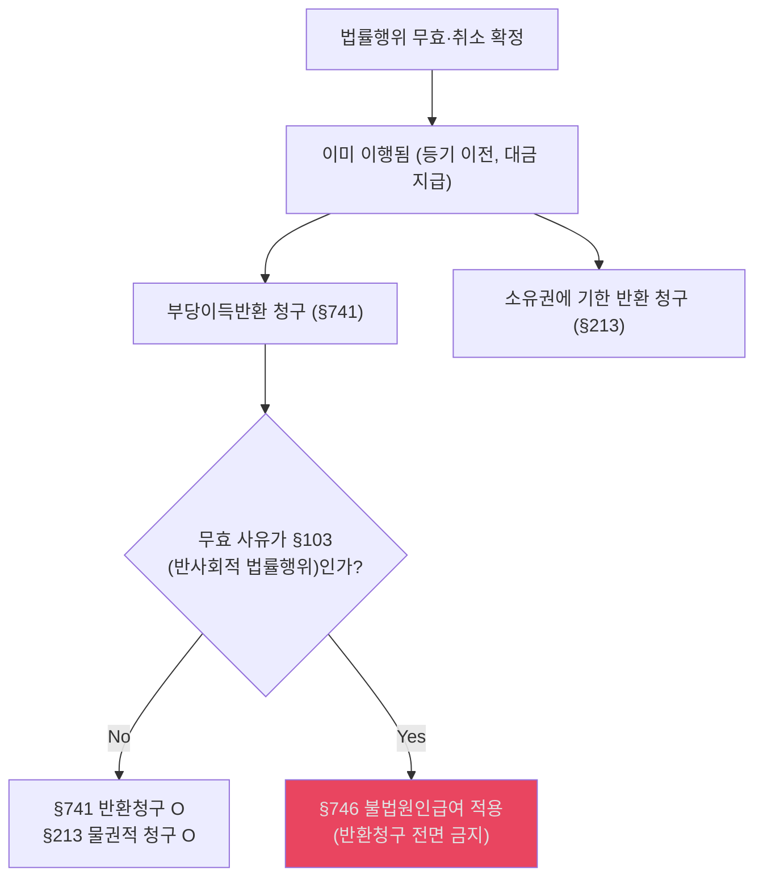
- `핵심 주의`: 사기·강박·착오·[[통정허위표시]] 무효/취소는 §103 위반이 아니므로 §746이 적용되지 않아 반환 청구 가능.

### 📊 효력규정 vs 단속규정
| 구별 | 효력규정 | 단속규정 |
|---|---|---|
| **의미** | 위반행위의 사법상 효력을 부정하는 규정 | 위반해도 원칙적으로 행위 효력은 유지되는 규정 |
| **효과** | 법률행위 무효 | 행정상·형사상 제재가 중심 |
| **예외 메모** | 통정하여 단속규정을 위반하면 §103 문제로 다시 무효 가능 | 단순 위반만으로 바로 무효는 아님 |

- `[교재 정리]` 효력규정은 위반행위의 사법상 효력을 부정하지만, 단속규정은 원칙적으로 행위 효력 자체에는 영향을 주지 않는다.
  - 근거 발췌: "효력규정"; "단속규정"; "이를 위반하여 한 거래행위는 원칙적으로 무효가 되지 않는다"
  - 근거 위치: [《민법강의_26_p211-240.md》 L837-L843 | "효력규정"] [《민법강의_26_p211-240.md》 L837-L843 | "단속규정"] [《민법강의_26_p211-240.md》 L843 | "이를 위반하여 한 거래행위는 원칙적으로 무효가 되지 않는다"]
- `[교재 정리]` 다만 당사자가 통정하여 단속규정을 위반한 경우에는 반사회적 법률행위로 무효가 될 수 있다.
  - 근거 발췌: "당사자가 통정하여 단속규정을 위반하는 법률행위"; "반사회적 법률행위에 해당하여 무효"
  - 근거 위치: [《민법강의_26_p211-240.md》 L1073-L1074 | "당사자가 통정하여 단속규정을 위반하는 법률행위"] [《민법강의_26_p211-240.md》 L1074 | "반사회적 법률행위에 해당하여 무효"]

### 📊 부당이득·일반 불법행위 기본 요건 [사례형 기본 청구권]
| 청구권 | 핵심 요건 | 바로 쓰는 포섭 문장 |
|---|---|---|
| **부당이득반환청구 (§741)** | ① **법률상 원인 없음** ② **타인의 재산·노무로 이익** ③ **그로 인한 타인의 손해** ④ **이익과 손해 사이 인과관계** | 법률상 원인 없이 상대방이 급부를 보유하여 재화의 정당한 귀속이 어긋난 경우, 부당이득반환청구를 검토한다. |
| **일반 불법행위 (§750)** | ① **고의·과실** ② **위법한 가해행위** ③ **권리·법익 침해** ④ **손해 발생** ⑤ **인과관계** | 상대방의 고의·과실 있는 위법행위로 권리 또는 법익이 침해되어 손해가 발생했다면 불법행위책임을 검토한다. |
| **양자 경합** | 동일 사실관계가 부당이득과 불법행위에 모두 해당할 수 있음 | 두 청구권은 선택 행사할 수 있지만, 중첩적으로 행사하여 이중 회복할 수는 없다. |

- `[교재 정리]` 부당이득은 `법률상 원인 없는 이득`이라는 사실 자체에 의해 발생하는 법정채권이고, 수익자의 귀책사유를 문제삼지 않는다는 점에서 불법행위와 구조가 다르다.
- `[판례 요지]` 불법행위 손해배상을 청구하려면 `가해행위·권리침해·귀책사유·손해 발생·인과관계`를 입증해야 한다.
- `[교재 정리]` 침해부당이득 사안처럼 하나의 사실관계가 부당이득과 불법행위에 동시에 해당하면 두 청구권은 경합할 수 있으나, 선택행사만 가능하고 중첩행사는 허용되지 않는다.
- 출처 위치: [《민법강의_26_p1051-1080.md》 p.1063-1065 | "법률상 원인 없이 타인의 재산이나 노무로 이익을 얻고 그로 인하여 타인에게 손해를 입힌 경우"] [《민법강의_26_p1051-1080.md》 p.1063 | "수익자의 귀책사유를 문제삼지 않는 점에서"] [《민법강의_26_p1051-1080.md》 p.1064 | "채권자는 어느 것이라도 선택하여 행사할 수 있지만 중첩적으로 행사할 수는 없다"] [《민법강의_26_p1081-1110.md》 p.1097 | "고의나 과실로 인한 위법행위로 타인에게 손해를 입히는 행위가 '불법행위'"] [《민법강의_26_p121-150.md》 p.134 | "불법행위를 이유로 피해자가 손해배상을 청구하기 위해서는 가해행위 · 권리침해 · 귀책사유 · 손해 발생 · 인과관계를 입증하여야 한다"]

#### ✍️ 부당이득 vs 불법행위 모답형
법률상 원인 없이 상대방 재산 또는 노무로 이익을 얻고 그로 인해 상대방에게 손해가 발생하였다면 우선 부당이득반환청구를 검토한다. 반면 상대방의 고의 또는 과실에 의한 위법한 가해행위로 권리 또는 법익이 침해되고 손해와 인과관계가 인정되면 불법행위책임이 성립한다. 같은 사실관계가 두 청구권에 모두 해당할 수 있으나, 이는 경합할 뿐 이중회복은 허용되지 않는다.
- 근거 발췌: "수익자의 귀책사유를 문제삼지 않는"; "가해행위"; "권리침해"; "손해 발생"; "인과관계"; "경합하여 병존"
- 근거 위치: [《민법강의_26_p1051-1080.md》 L482 | "수익자의 귀책사유를 문제삼지 않는"] [《민법강의_채총_26_p121-150.md》 p.134 | "가해행위"] [《민법강의_채총_26_p121-150.md》 p.134 | "권리침해"] [《민법강의_채총_26_p121-150.md》 p.134 | "손해 발생"] [《민법강의_채총_26_p121-150.md》 p.134 | "인과관계"] [《민법강의_26_p1051-1080.md》 L609 | "경합하여 병존"]

### 📊 무권리자의 처분행위 처리법 [물권/채권/대리 연계]
- 출처 위치: [《기본민법_주요사례1_p001-016.md》 p.14 | "甲의 행위는 ‘무권리자 처분행위’"] [《기본민법_주요사례1_p001-016.md》 p.14 | "상대방이 대리인을 진정한 소유권자인 것으로 알고 계약을 한 것이지 그 자를 본인의 대리인으로 알고 한 것이 아니라는 점"] [《기본민법_주요사례1_p001-016.md》 p.15 | "민법 제108조 제2항 선의의 제3자 해당성"]
| 파트 | 적용 법리 | 내용 및 예시 |
|---|---|---|
| **채권법** | **타인권리매매** (§569) | 甲소유 토지를 乙이 자기 이름으로 丙에게 매도 → **계약 자체는 채권적으로 유효** (乙은 이전 의무 부담) |
| **물권법** | **등기 공신력 부정 / 선의취득** | 乙이 丙에게 이전등기 해줘도 丙은 소유권 취득 ✗ (부동산 등기 공신력 없음) / 동산이면 선의취득(§249) 검토 |
| **민법총칙** | **무권대리의 유추적용** (판례) | 원소유자 甲이 乙의 처분행위를 **추인**하면 어떻게 되는가? → 무권대리 추인(§130) 등 유추적용하여 **소급 유효** |

- `사례 연결`: 명의신탁, 상속재산 임의처분, 재단법인 설립 전 상속인의 처분 등에서 등장. 乙의 처분행위 자체는 무권리자 처분으로 물권적 효력은 무효이나, 甲의 사후 추인 시 효력이 발생함.

---

## 10-2. 부관 (조건과 기한)

### 📊 조건과 기한의 구별 및 핵심 요건
| 구분 | 내용 | 입증책임 |
|---|---|---|
| **조건** | 장래의 **불확실한** 사실에 의존 (성취 여부 미정) | 조건 존재: 그 효과를 다투는 자 / 조건 성취: 권리 취득을 주장하는 자 |
| **기한** | 장래의 **확실한** 사실에 의존 (도래 시기만 미정일 수 있음) | - |
| **단독행위 결부** | 원칙적 불가 (취소, 해제, 상계 등). 상대방 동의 시 예외적 허용 | - |

### 📊 조건부 법률행위의 주요 쟁점 흐름도
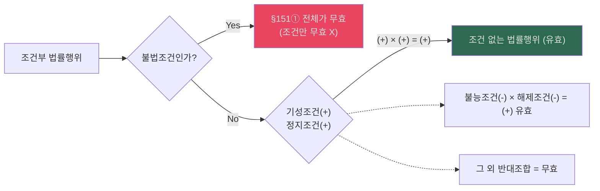
- `핵심 연결`: 불법행위를 하지 않을 것을 조건으로 하는 것도 불법조건이 되어 **전체가 무효**임. 기성/불능조건 결합은 수학의 부호 곱셈(+,-)으로 암기하면 편리함.

---

## 11. 차명대출·차명계약

### 📊 차명대출 원칙/예외
| 상황 | 원칙 | 예외 |
|---|---|---|
| 차명 명의자 앞 대출 | 명의자가 채무자 | 실질 차주 인정 요건 충족 시 실질 차주 |
| 금융실명법 위반 차명거래 | — | §3조 위반 → 실체적 권리자 기준 |

---

## 12. 종합 학설 비교표

### 📊 민1 주요 학설 대립 정리
- 출처 위치: [《기본민법_주요사례1_p001-016.md》 p.3 | "법인성립시설"] [《기본민법_주요사례1_p001-016.md》 p.4 | "통설과 판례 ... ‘민법 제107조 제1항 단서 유추적용설’"] [《3-1_민법_윤동환_기본강의_민총답안_(사례)_p001-004.md》 p.1 | "대표권 제한 미등기의 효력"] [《민법기초이론I 관련 판례1(~사기까지).pdf》 p.10 | "시가에 관한 착오는 ... 동기의 착오에 불과"]
| 쟁점 | A설 | B설 | 판례 |
|---|---|---|---|
| **출연재산 귀속시기** | 출연시설 | **법인성립시설** | **법인성립시설** |
| **비진의표시 대표권남용** | §107① 직접 적용 | §107① **유추** 적용 | **유추** |
| **착오와 사기 경합** | §109 우선 | §110 우선 | **§110 우선** |
| **부재자관재인 §126** | 적용 가능 | **적용 부정** | **부정** |
| **외형설 (법인 불법행위)** | 직무 자체 한정 | **외형상** 직무 포함 | **외형설** |

---

## 13. 시험 직전 판례·조문 카드

### 📊 핵심 조문 기능 요약
| 조문 | 기능 | 핵심 한 줄 |
|---|---|---|
| **§5** | 미성년자 보호 | 법정대리인 동의 없는 행위 = 취소 |
| **§22** | 부재자관재인 관할 | 관재인 처분 = 법원 허가 필요 |
| **§45** | 재단법인 출연재산 | 성립 시 법인 귀속 |
| **§60** | 이사 대표권 제한 | 등기 없으면 제3자 대항 불가 |
| **§107** | 비진의표시 | 원칙 유효, 상대방 악의·과실이면 무효 |
| **§108** | 통정허위표시 | 무효, 선의 제3자 보호 |
| **§109** | 착오 | 취소 가능, 중과실이면 불가 |
| **§110** | 사기·강박 | 취소 가능, 제3자 사기는 상대방 과실 시 |
| **§118** | 무권대리 | 본인 추인까지 무효 |
| **§125** | 대리권수여 표시 | 선의·무과실 상대방 보호 |
| **§126** | 권한 유월 | 선의·무과실 상대방 보호 |
| **§130** | 무권대리 추인 | 추인 시 계약 시에 소급 유효 |
| **§139** | 무효행위 추인 | 무효 알고 추인 = 새로운 행위 |
| **§145** | 법정추인 | 전부·일부 이행 등 → 추인 간주 |

---

## 14. 전체 흐름 다이어그램

### 📊 민1 중간 전체 학습 순서

---

## 15. 채무불이행 보강: 비교축 재구성 — ★★

- `소스 메모`: 교수님 판서 이미지나 별도 판서파일은 현재 민1 폴더 소스에서 직접 확인할 수 없습니다. 아래 표는 원교재와 송영곤 자료에서 공통으로 확인되는 비교축을 기준으로 재구성한 회독표이며, 교수님 판서 도식을 그대로 복원한 것이라고 단정하지 않습니다.
- `[교재 기준 회독축]` 이 비교표는 `이행 가능 여부 → 본래 급부청구 유지 여부 → 전보배상 구조(§395는 지체 전보배상, §390은 일반 손해배상) → 해제 가능 시점(§546 포함) → 손해액 기준시기` 순서로 읽으면 가장 안정적이다.
  - 근거 위치: [《민법강의_채총_26_p121-150.md》 L335-L336 | "이행지체는 채무의 이행이 가능한데도 이행하지 않는 것이고, 이행불능은 채권의 성립 후"] [《민법강의_채총_26_p121-150.md》 L512-L512 | "제395조에 의해"] [《민법강의_채총_26_p121-150.md》 L584-L590 | "이행불능이란 채권이 성립한 후에"] [《민법강의_채총_26_p121-150.md》 L584-L590 | "금전채무에서는 이행지체만이 있을 뿐 이행불능은 생기지 않는다"] [《민법강의_채총_26_p121-150.md》 L1186-L1186 | "이행거절은 이행이 가능한데도 채무자가 이행을 거절하는 것이므로"]
- `[교재 기준 구별 포인트]` 이행거절은 개념상 `이행 가능성을 전제로 한 명시적 거절`이므로 이행불능과 구별되지만, 효과 면에서는 전보배상·해제에서 이행불능에 준해 처리된다는 점을 같이 봐야 한다.
  - 근거 위치: [《민법강의_채총_26_p121-150.md》 L353-L360 | "이행거절은 이행불능에 준해 취급되지만"] [《민법강의_채총_26_p121-150.md》 L1186-L1186 | "이행거절은 이행이 가능한데도 채무자가 이행을 거절하는 것이므로"]

### 📊 비교표 재구성: 이행지체·이행불능·이행거절 — ★★★
- 출처 위치: [《민법강의_채총_26.pdf》 p.143-145] [《민법강의_채총_26_p121-150.md》 L335-336 | "이행지체는 채무의 이행이 가능한데도 이행하지 않는 것이고, 이행불능은 채권의 성립 후"] [《민법강의_채총_26_p121-150.md》 L353-360 | "갈음한 전보배상을 하여야 하는 점에서 다르다"] [《민법강의_채총_26_p121-150.md》 L353-360 | "이행거절은 이행불능에 준해 취급되지만"] [《민법강의_채총_26_p121-150.md》 L584-590 | "이행불능이란 채권이 성립한 후에 채무자의 귀책사유로"] [《민법강의_채총_26_p121-150.md》 L584-590 | "금전채무에서는 이행지체만이 있을 뿐 이행불능은 생기지 않는다"] [《민법강의_채총_26_p151-180.md》 L3-9 | "최고나 자기 채무의 이행의 제공 없이도 곧바로 계약을 해제할 수 있다"] [《민법강의_채총_26_p151-180.md》 L3-9 | "이행거절 당시의 급부목적물의 시가를 기준으로 한다"]
| 항목 | 이행지체 | 이행불능 | 이행거절 |
|---|---|---|---|
| **의의** | 이행이 가능한데도 이행하지 않음 | 채권 성립 후 후발적 불능 + 채무자 귀책사유 | 이행이 가능한데도 채무자가 명백히 거절 |
| **본래 급부청구** | 유지 | 불가 | 유지 |
| **손해배상** | 지연배상 원칙, §395면 전보배상 | 전보배상 | 전보배상 가능 |
| **계약해제** | 상당한 기간을 정한 최고가 원칙 | 불능 시 바로 가능, 최고·이행제공 불요 | 명백한 거절이면 최고·이행제공 없이 가능 |
| **손해액 기준시기** | 최고 후 상당한 기간 경과 시가 | 이행불능 당시 시가 원칙 | 이행거절 당시 시가 |
| **비고** | 지체 후 불능은 불능 법리로 처리 | 금전채무는 원칙적으로 불능 X | 철회하면 이행지체 법리 적용 |

- `[개념요지]` 이행지체는 이행 가능한데도 이행하지 않는 경우이고, 이행불능은 채권 성립 후 후발적으로 이행이 불가능해진 경우이며, 이행거절은 이행 가능한데도 채무자가 명백히 거절하는 경우다.
  - 근거 위치: [《민법강의_채총_26_p121-150.md》 L335-L335 | "이행지체는 채무의 이행이 가능한데도 이행하지 않는 것이고, 이행불능은 채권의 성립 후"] [《민법강의_채총_26_p121-150.md》 L592-L592 | "채무불이행으로서의 이행불능은 채권이 성립한 후에 이행이 불가능하게 된"] [《민법강의_채총_26_p121-150.md》 L1186-L1186 | "이행거절은 이행이 가능한데도 채무자가 이행을 거절하는 것이므로"]

- `조문 축`: §390은 채무불이행 손해배상 일반규정이고, §395는 이행지체에서의 전보배상, §546은 이행불능을 이유로 한 계약해제의 직접 조문이다.
  - 근거 발췌: "민법 제390조 본문은"; "제395조에 의해"; "제546조【이행불능과 해제】"
  - 근거 위치: [《민법강의_채총_26_p121-150.md》 L245 | "민법 제390조 본문은"] [《민법강의_채총_26_p121-150.md》 L512 | "제395조에 의해"] [《civ_1-06_song_perform_basic_26_p121-150.md》 L629 | "제546조【이행불능과 해제】"]

### 📊 전보배상 청구권 정리
- 출처 위치: [《민법강의_채총_26_p121-150.md》 L707-712 | "본래의 급부를 목적으로 하는 청구권은 소멸되고 그에 갈음하여 손해배상청구권이 성립한다"] [《민법강의_채총_26_p121-150.md》 L707-712 | "채권자는 잔존 부분의 급부청구와 함께 불능 부분의 전보배상을 청구할 수 있다"] [《민법강의_채총_26_p151-180.md》 L853-865 | "이행불능이 됨으로 말미암아 매수인이 입는 손해액은 원칙적으로"] [《민법강의_채총_26_p151-180.md》 L853-865 | "이행거절 당시의 급부 목적물의 시가를 기준으로"] [《civ_1-06_song_perform_basic_26_p121-150.md》 L1083-1086 | "채무불이행으로 인한 전보배상에 관하여 손해배상액을 예정한 경우"]
| 상황 | 조문/법리 | 요건 | 효과 | 기준시기 |
|---|---|---|---|---|
| **이행불능 전보배상** | §390, 계약이면 §546 | 후발적 불능 + 채무자 귀책사유 | 본래 급부청구권 소멸, 손해배상청구권으로 전환 | 이행불능 당시 시가 원칙 |
| **이행지체의 전보배상** | §395 | 최고 후 불이행 또는 지체 후 이행이 무익 | 이행에 갈음한 손해배상, 채권 만족으로 소멸 | 최고 후 상당한 기간 경과 시가 |
| **이행거절의 전보배상** | §390 + 판례 | 명백한 이행거절 | 최고 없이 손해배상·해제 가능 | 이행거절 당시 시가 |

- `[판례]` 이행불능으로 인한 손해액은 원칙적으로 `이행불능 당시의 목적물 시가`이고, 이후 가격 등귀는 특별사정손해로 처리된다.
  - 근거 발췌: "손해액은 원칙적으로 그 이행불능이 될 당시의 목적물의 시가 상당액"; "그 이후 목적물의 가격이 등귀하였다 하여도 그로 인한 손해는 특별한 사정"
  - 근거 위치: [《민법강의_채총_26_p151-180.md》 L853-856 | "손해액은 원칙적으로 그 이행불능이 될 당시의 목적물의 시가 상당액"] [《민법강의_채총_26_p151-180.md》 L853-856 | "그 이후 목적물의 가격이 등귀하였다 하여도 그로 인한 손해는 특별한 사정"]
- `[판례]` 원소유자의 말소등기청구소송으로 이전등기의무가 확정적으로 막힌 경우에는 손해배상액 산정시점을 `패소 확정시`로 본다.
  - 근거 발췌: "손해배상액의 산정은 그 패소 확정시를 기준으로 하여야"; "그 등기의 말소시를 기준으로 할 것이 아니다"
  - 근거 위치: [《민법강의_채총_26_p151-180.md》 L860-861 | "손해배상액의 산정은 그 패소 확정시를 기준으로 하여야"] [《민법강의_채총_26_p151-180.md》 L860-861 | "그 등기의 말소시를 기준으로 할 것이 아니다"]
- `[송영곤 기준]` 전보배상에 관한 손해배상액 예정은 채무불이행을 이유로 계약을 해제·해지해도 원칙적으로 실효되지 않는다.
  - 근거 발췌: "전보배상에 관하여 손해배상액을 예정한 경우"; "원칙적으로 손해배상액의 예정은 실효되지 않고"
  - 근거 위치: [《civ_1-06_song_perform_basic_26_p121-150.md》 L1083-1086 | "전보배상에 관하여 손해배상액을 예정한 경우"] [《civ_1-06_song_perform_basic_26_p121-150.md》 L1083-1086 | "원칙적으로 손해배상액의 예정은 실효되지 않고"]

### 📊 대상청구권 요건·효과 정리 — ★★
- 출처 위치: [《민법강의_채총_26_p121-150.md》 L900-902 | "우리 민법에는 이행불능의 효과로서"] [《민법강의_채총_26_p121-150.md》 L900-902 | "해석상 대상청구권을 부정할 이유가 없다"] [《민법강의_채총_26_p121-150.md》 L938-939 | "소위 대상청구권의 행사로서"] [《민법강의_채총_26_p121-150.md》 L938-939 | "수용보상금의 반환을 청구할 수 있다"] [《civ_1-06_song_perform_basic_26_p091-120.md》 L14-20 | "원채무와 동일성이 인정되므로"] [《civ_1-06_song_perform_basic_26_p091-120.md》 L14-20 | "양자는 동시이행관계에 있다"] [《civ_1-06_song_perform_basic_26_p091-120.md》 L14-20 | "매도인의 소유권이전등기의무가 이행불능되었을 때부터"] [《civ_1-06_song_perform_basic_26_p091-120.md》 L38-43 | "보상금 전부에 대하여 대상청구권을 행사할 수"] [《civ_1-06_song_perform_basic_26_p091-120.md》 L38-43 | "보상금의 반환을 청구하거나"]
| 항목 | 내용 |
|---|---|
| **법적 근거** | 명문 조문 없음, 이행불능의 효과로 해석상 인정 |
| **기본 구조** | 본래 급부가 이행불능이 된 뒤 채무자가 그 대가·대상적 이익을 취득한 경우 그 대상으로 청구 전환 |
| **동일성** | 원채무와 동일성 인정 → 원채무의 항변권 등도 대항 가능 |
| **쌍무계약** | 채권자도 반대채무를 이행해야 하고, 양자는 동시이행관계 |
| **행사방법** | 대상물 반환청구 또는 대상채권 양도청구 |
| **범위** | 특별한 사정이 없으면 보상금·보험금 등 대상 전부 가능 |
| **소멸시효** | 원칙적으로 이행불능 시부터 진행 |

- `[개념 정리]` 대상청구권은 본래 급부가 후발적으로 불능이 된 뒤 채무자에게 그 급부를 대신하는 대상이 생긴 경우, 채권자가 그 대상을 청구하는 권리로 정리하면 된다.
  - 근거 발췌: "보상금을 청구한 것을 대상청구권을 행사한 것으로 보고"; "해석상 대상청구권을 부정할 이유가 없다"
  - 근거 위치: [《민법강의_채총_26_p121-150.md》 L898-L902 | "보상금을 청구한 것을 대상청구권을 행사한 것으로 보고"] [《민법강의_채총_26_p121-150.md》 L900-L902 | "해석상 대상청구권을 부정할 이유가 없다"]
- `[판례]` 우리 민법에 명문 규정은 없지만, 대상청구권 자체는 해석상 인정된다.
  - 근거 발췌: "우리 민법에는 이행불능의 효과로서"; "해석상 대상청구권을 부정할 이유가 없다"
  - 근거 위치: [《민법강의_채총_26_p121-150.md》 L900-902 | "우리 민법에는 이행불능의 효과로서"] [《민법강의_채총_26_p121-150.md》 L900-902 | "해석상 대상청구권을 부정할 이유가 없다"]
- `[판례]` 취득시효가 완성된 토지가 수용되어 이전등기의무가 이행불능이 된 경우, 권리자는 `수용보상금 반환`을 대상청구권으로 구할 수 있다.
  - 근거 발췌: "소위 대상청구권의 행사로서"; "그 토지의 대가로서 받은 수용보상금의 반환을 청구할 수 있다"
  - 근거 위치: [《민법강의_채총_26_p121-150.md》 L938-939 | "소위 대상청구권의 행사로서"] [《민법강의_채총_26_p121-150.md》 L938-939 | "그 토지의 대가로서 받은 수용보상금의 반환을 청구할 수 있다"]
- `[교재 보강]` 교재는 이 판결을 `이행불능의 효과로서 대상청구권을 인정한 첫 판결`로 정리하고, `채무자 위험부담주의`가 적용되는 사안에서도 대상청구권을 인정할 수 있다고 해설한다.
  - 근거 발췌: "본 판결은 이행불능의 효과로서 대상청구권을 인정한 첫 판결이다"; "채무자 위험부담주의'가 적용되는 경우에도 대상청구권을 인정할 수 있다고 본다"
  - 근거 위치: [《민법강의_채총_26_p121-150.md》 L903-903 | "본 판결은 이행불능의 효과로서 대상청구권을 인정한 첫 판결이다"] [《민법강의_채총_26_p121-150.md》 L920-921 | "채무자 위험부담주의'가 적용되는 경우에도 대상청구권을 인정할 수 있다고 본다"]
- `[교재 보강]` 따라서 채권자는 제537조에 따른 [[부당이득]] 반환구조를 택할 수도 있고 대상청구권을 행사할 수도 있으며, 후자를 택하면 반대급부는 그대로 이행해야 한다.
  - 근거 발췌: "채권자는 둘 중 하나를 선택할 수 있다"; "A는 B에게 잔금 1백만원을 지급하여야 한다"
  - 근거 위치: [《민법강의_채총_26_p121-150.md》 L931-934 | "채권자는 둘 중 하나를 선택할 수 있다"] [《민법강의_채총_26_p121-150.md》 L934-934 | "A는 B에게 잔금 1백만원을 지급하여야 한다"]
- `요건 문장`: ① 본래 급부가 후발적으로 이행불능이 되고, ② 채무자가 그 급부를 대신하는 대상적 이익을 취득하며, ③ 채권자가 본래 급부 대신 그 대상을 청구하는 구조로 정리한다.
  - 근거 발췌: "이행불능의 효과로서"; "그 토지의 대가로서 받은 수용보상금의 반환을 청구할 수 있다"
  - 근거 위치: [《민법강의_채총_26_p121-150.md》 L900-902 | "이행불능의 효과로서"] [《민법강의_채총_26_p121-150.md》 L938-939 | "그 토지의 대가로서 받은 수용보상금의 반환을 청구할 수 있다"]
- `원칙·예외`: ① 원칙적으로 특별한 사정이 없으면 대상 전부를 청구할 수 있고, ② 예외적으로 채권자는 제537조에 따른 위험부담·[[부당이득]] 구조를 택할 수도 있으며, ③ 대상청구권을 택하면 반대급부는 그대로 이행해야 한다.
  - 근거 발췌: "대상이 되는 것 전부에 대해 청구할 수"; "채권자는 둘 중 하나를 선택할 수 있다"; "A는 B에게 잔금 1백만원을 지급하여야 한다"
  - 근거 위치: [《민법강의_채총_26.pdf》 p.143 | "대상이 되는 것 전부에 대해 청구할 수"] [《민법강의_채총_26_p121-150.md》 L931-934 | "채권자는 둘 중 하나를 선택할 수 있다"] [《민법강의_채총_26_p121-150.md》 L934-934 | "A는 B에게 잔금 1백만원을 지급하여야 한다"]
- `[원교재 보강]` 원PDF는 대상청구권의 범위를 `손해 한도`로 제한하지 않는다고 정리한다. 본래 급부를 대신하는 대상이 생긴 이상, 특별한 사정이 없으면 그 `대상 전부`를 청구할 수 있다는 취지다.
  - 근거 발췌: "판례는 손해를 한도로 하지 않는다"; "화재보험금 전부에 대해 대상청구권을 행사할 수 있고"; "대상이 되는 것 전부에 대해 청구할 수"
  - 근거 위치: [《민법강의_채총_26.pdf》 p.143 | "판례는 손해를 한도로 하지 않는다"] [《민법강의_채총_26.pdf》 p.143 | "화재보험금 전부에 대해 대상청구권을 행사할 수 있고"] [《민법강의_채총_26.pdf》 p.143 | "대상이 되는 것 전부에 대해 청구할 수"]
- `[원교재 보강]` 또 원PDF는 `채무자 위험부담주의`가 적용되는 사안에서도 대상청구권을 병행적으로 인정할 수 있고, 채권자는 `제537조 구조`와 `대상청구권` 중 하나를 선택할 수 있다고 설명한다.
  - 근거 발췌: "채무자 위험부담주의'가 적용되는 경우에도 대상청구권을 인정할 수 있다고 본다"; "채권자는 둘 중 하나를 선택할 수 있다"
  - 근거 위치: [《민법강의_채총_26.pdf》 p.144 | "채무자 위험부담주의'가 적용되는 경우에도 대상청구권을 인정할 수 있다고 본다"] [《민법강의_채총_26.pdf》 p.144 | "채권자는 둘 중 하나를 선택할 수 있다"]
- `[송영곤 기준]` 대상청구권은 원채무와 동일성이 인정되므로, 원채무에 붙은 항변권이 그대로 미치고 쌍무계약에서는 동시이행관계가 된다.
  - 근거 발췌: "원채무와 동일성이 인정되므로"; "양자는 동시이행관계에 있다"
  - 근거 위치: [《civ_1-06_song_perform_basic_26_p091-120.md》 L14-16 | "원채무와 동일성이 인정되므로"] [《civ_1-06_song_perform_basic_26_p091-120.md》 L14-16 | "양자는 동시이행관계에 있다"]
- `[송영곤 기준]` 대상청구권의 범위는 특별한 사정이 없으면 보상금 전부에 미치고, 소멸시효는 원칙적으로 `이행불능 시`부터 진행한다.
  - 근거 발췌: "보상금 전부에 대하여 대상청구권을 행사할 수"; "매도인의 소유권이전등기의무가 이행불능되었을 때부터"
  - 근거 위치: [《civ_1-06_song_perform_basic_26_p091-120.md》 L38-43 | "보상금 전부에 대하여 대상청구권을 행사할 수"] [《civ_1-06_song_perform_basic_26_p091-120.md》 L38-43 | "보상금의 반환을 청구하거나"] [《civ_1-06_song_perform_basic_26_p091-120.md》 L19-23 | "매도인의 소유권이전등기의무가 이행불능되었을 때부터"]

#### ✍️ 대상청구권 모답형
쌍무계약상 채무의 이행이 후발적으로 불능이 되었는데 채무자가 그 급부의 대상 또는 전환이익을 취득한 경우, 채권자는 본래 급부를 대신하여 그 대상을 청구할 수 있는지가 문제된다. 대상청구권은 채권적 청구권으로 이해되며, 급부목적물 자체에서 생긴 이익뿐 아니라 법률행위에 의해 얻은 이익도 포함한다. 또한 계약해제권과는 선택관계에 있으므로 어느 구조로 청구할 것인지 먼저 정리해야 한다.
- 근거 발췌: "대상청구권은 채권적 청구권이다"; "급부목적물로부터 얻은 이익"; "법률행위에 의해 얻은 이익"; "계약해제권과 대상청구권을 선택적"
- 근거 위치: [《민법강의_26_p541-570.md》 L766 | "대상청구권은 채권적 청구권이다"] [《민법강의_채총_26_p121-150.md》 L789-L790 | "급부목적물로부터 얻은 이익"] [《민법강의_채총_26_p121-150.md》 L789-L790 | "법률행위에 의해 얻은 이익"] [《민법강의_26_p541-570.md》 L756 | "계약해제권과 대상청구권을 선택적"]

### 📊 사정변경에 의한 계약해제 보충
| 요건 | 내용 |
|---|---|
| **예견불가능한 현저한 사정변경** | 계약성립 당시 예견할 수 없던 변화일 것 |
| **당사자에게 책임 없는 사유** | 해제권자 책임으로 생긴 사정변경이면 안 됨 |
| **객관적 기초사정 변경** | 주관적 동기 변화만으로는 부족 |
| **신의칙에 현저히 반하는 결과** | 계약구속을 그대로 유지하는 것이 부당해야 함 |

- `[판례]` 사정변경 해제는 계약성립 당시 예견할 수 없었던 현저한 사정의 변경이 있고, 그 사정이 책임 없는 사유로 생겨 계약구속을 유지하는 것이 신의칙에 현저히 반할 때에만 예외적으로 인정된다.
  - 근거 발췌: "예견할 수 없었던 현저한 사정의 변경"; "책임 없는 사유"; "신의칙에 현저히 반하는 결과"
  - 근거 위치: [《민법기초이론I 관련 판례1(~사기까지).pdf》 p.2 | "예견할 수 없었던 현저한 사정의 변경"] [《민법기초이론I 관련 판례1(~사기까지).pdf》 p.2 | "책임 없는 사유"] [《민법기초이론I 관련 판례1(~사기까지).pdf》 p.2 | "신의칙에 현저히 반하는 결과"]
- `[판례]` 여기서 말하는 사정은 계약의 기초가 된 객관적 사정이어야 하고, 일방의 주관적 목적 달성 실패만으로는 부족하다.
  - 근거 발췌: "계약의 기초가 되었던 객관적인 사정"; "주관적 또는 개인적인 사정"; "주관적인 매수목적"
  - 근거 위치: [《민법기초이론I 관련 판례1(~사기까지).pdf》 p.2 | "계약의 기초가 되었던 객관적인 사정"] [《민법기초이론I 관련 판례1(~사기까지).pdf》 p.2 | "주관적 또는 개인적인 사정"] [《민법기초이론I 관련 판례1(~사기까지).pdf》 p.2 | "주관적인 매수목적"]

### 📊 교재·사례문제 기반 포섭 체크
| 쟁점 | 답안 출발점 | 사례형 마무리 |
|---|---|---|
| **[사례] 법인 대표행위 하자** | `권리능력 범위 → 정관상 대표권 제한의 등기 여부 → 대표권남용` 순으로 본다 | 계약책임이 막히면 곧바로 `§35 불법행위책임 + 부당이득반환`까지 내려간다 |
| **[사례] 취소와 부당이득** | 취소원인 인정 시 계약은 소급 무효가 되고 반환은 `부당이득`으로 처리한다 | 선의 수익자는 `현존이익 한도`에서만 반환한다 |
| **[기준] 전보배상** | `지체·불능·거절`을 먼저 나누고, 각 유형별 `기준시기`를 적는다 | 이행불능은 불능 당시, 이행거절은 거절 당시 시가가 기본이다 |
| **[판례·기준] 대상청구권** | 본래 급부가 후발적으로 불능이 된 뒤 채무자가 `대상적 이익`을 취득했는지 본다 | 명문은 없지만 해석상 인정되고, 쌍무계약에서는 원채무 항변이 그대로 붙는다 |

- `[사례]` 법인의 대표권 제한이 등기되어 있어 계약책임이 막히는 경우에도, 대표기관의 직무관련성이 인정되면 법인에 대한 `불법행위책임`과 `부당이득반환책임`은 별도로 검토해야 한다.
  - 근거 발췌: "등기되어 있을 경우 A법인을 상대로 불법행위책임 및 부당이득반환책임을 물을 수 있고"; "甲과 乙을 상대로 해서도 불법행위책임을 물을 수 있음"
  - 근거 위치: [《기본민법_주요사례1_p001-016.md》 L28 | "등기되어 있을 경우 A법인을 상대로 불법행위책임 및 부당이득반환책임을 물을 수 있고"] [《기본민법_주요사례1_p001-016.md》 L28 | "甲과 乙을 상대로 해서도 불법행위책임을 물을 수 있음"]
- `[사례]` 제한능력자의 기부행위가 취소되면, 수증 법인은 `민법 제748조 제1항`에 따라 받은 금원을 현존이익 한도에서 반환한다.
  - 근거 발췌: "甲이 A법인에게 한 기부행위는 취소가능"; "A법인은 민법 제748조 제1항에 따라 받은 금원을 반환해야 함"
  - 근거 위치: [《기본민법_주요사례1_p001-016.md》 L14 | "甲이 A법인에게 한 기부행위는 취소가능"] [《기본민법_주요사례1_p001-016.md》 L14 | "A법인은 민법 제748조 제1항에 따라 받은 금원을 반환해야 함"]
- `[판례]` 대상청구권은 우리 민법에 명문 규정은 없지만, 이행불능의 효과로 해석상 인정되고 수용보상금 반환도 그 행사 형태로 본다.
  - 근거 발췌: "우리 민법에는 이행불능의 효과로서"; "해석상 대상청구권을 부정할 이유가 없다"; "수용보상금의 반환을 청구할 수 있다"
  - 근거 위치: [《민법강의_채총_26_p121-150.md》 L900-902 | "우리 민법에는 이행불능의 효과로서"] [《민법강의_채총_26_p121-150.md》 L900-902 | "해석상 대상청구권을 부정할 이유가 없다"] [《민법강의_채총_26_p121-150.md》 L938-939 | "수용보상금의 반환을 청구할 수 있다"]

---

## 16. [사례형 IRAC] 법인 대표행위 하자 및 불법행위책임 (청구권/항변 구조)

**사례 개요**: 甲이 A법인 대표이사로서 정관상 금지된 행위를 상대방 乙과 계약함. 乙은 정관의 제한 사실을 알지 못함. A법인의 乙에 대한 책임은?

### 📝 IRAC 플로우 및 근거 포섭
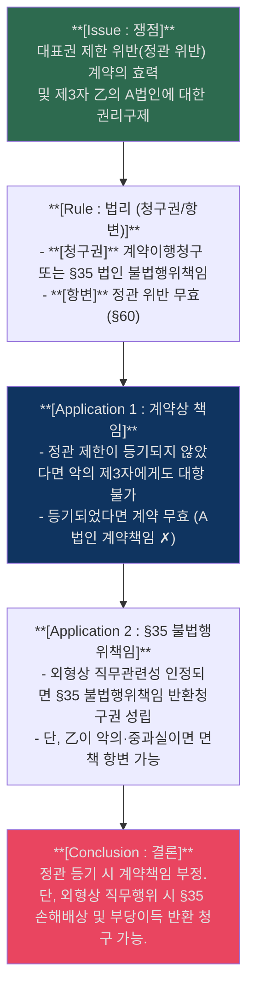

- `[Rule/Application 포섭 근거]` (Rule #25 적용): 대표권 제한은 등기하지 않으면 선/악 불문 대항할 수 없으나, 외형상 대표자의 직무행위면 법인의 불법행위책임 청구권이 성립한다.
  - 근거 발췌: "등기하지 않았다면 제3자의 선악 불문하고 대항할 수 없다는 무제한설"; "행위의 외형상 법인의 대표자의 직무행위라고 인정할 수 있는 것이라면"
  - 근거 위치: [《민법기초이론_법인 관련 자료.pdf》 p.2 | "등기하지 않았다면 제3자의 선악 불문하고 대항할 수 없다는 무제한설"] [《민법기초이론_법인 관련 자료.pdf》 p.3 | "행위의 외형상 법인의 대표자의 직무행위라고 인정할 수 있는 것이라면"]

## 17. [보강] 사례형 기본개념 카드

### 📊 제한능력자 반환·수익자 책임 확장 카드
| 항목 | 내용 | 답안 포인트 |
|---|---|---|
| **제한능력자 반환책임** | 취소된 법률행위로 이익을 받은 제한능력자는 `현존이익` 범위에서만 반환 | 취소 효과를 적은 뒤 바로 `민법이 제한능력자를 특별히 보호`한다는 점을 적는다 |
| **선의 수익자** | 현존이익 범위 내 반환 | 사용·소비로 남지 않은 이익은 반환대상 아님 |
| **악의 수익자** | 받은 이익 + 이자, 손해 있으면 배상 | 단순 반환이 아니라 가중된 책임 구조 |
| **사례 포섭** | 미성년자 취소 사안에서는 `현존이익`부터 본다 | 신용구매·카드대금 문제도 이 틀로 정리 |

- `[교재 정리]` 제한능력자는 일반 [[부당이득]] 법리보다 더 보호되므로 현존이익 범위 내에서만 반환책임을 진다.
  - 근거 발췌: "제한능력자는 현존이익 범위 내에서 반환책임"
  - 근거 위치: [《민법강의_26_p331-360.md》 L241 | "제한능력자는 현존이익 범위 내에서 반환책임"]
- `[교재 정리]` [[부당이득]] 반환은 수익자의 선의·악의에 따라 책임 강도가 갈린다.
  - 근거 발췌: "선의의 수익자는 현존이익"; "악의의 수익자는 얻은 이익에 이자를 붙여 반환"
  - 근거 위치: [《민법강의_26_p331-360.md》 L910-L912 | "선의의 수익자는 현존이익"] [《민법강의_26_p331-360.md》 L910-L912 | "악의의 수익자는 얻은 이익에 이자를 붙여 반환"]

### 📊 부당이득·불법행위 사례형 추가 포인트
| 쟁점 | 정리 | 시험장 문장 |
|---|---|---|
| **부당이득의 성질** | 법률상 원인 없는 이익이 있으면 성립하는 법정채권 | "수익자의 귀책사유는 부당이득 성립요건이 아니다." |
| **불법행위와 차이** | 불법행위는 위법한 가해행위와 귀책사유 입증 필요 | "불법행위는 가해행위, 권리침해, 손해, 인과관계, 귀책사유를 본다." |
| **경합관계** | 같은 사실관계가 부당이득과 불법행위에 모두 걸릴 수 있음 | "경합은 가능하나 이중회복은 허용되지 않는다." |

- `[교재 정리]` 부당이득은 이익의 보유 자체를 문제 삼는 구조라서, 수익자의 고의·과실은 성립단계의 요소가 아니다.
  - 근거 발췌: "수익자의 귀책사유를 문제시하지 않는 점에서"
  - 근거 위치: [《민법강의_26_p1051-1080.md》 p.1063 | "수익자의 귀책사유를 문제시하지 않는 점에서"]
- `[교재 정리]` 불법행위는 가해행위와 권리침해, 귀책사유와 손해발생, 인과관계를 입증해야 한다.
  - 근거 발췌: "가해행위"; "권리침해"; "귀책사유"; "손해 발생"; "인과관계"
  - 근거 위치: [《민법강의_채총_26_p121-150.md》 p.134 | "가해행위"] [《민법강의_채총_26_p121-150.md》 p.134 | "권리침해"] [《민법강의_채총_26_p121-150.md》 p.134 | "귀책사유"] [《민법강의_채총_26_p121-150.md》 p.134 | "손해 발생"] [《민법강의_채총_26_p121-150.md》 p.134 | "인과관계"]

### 📊 대상청구권 범위·법적 성질 추가 카드
| 항목 | 내용 | 답안 포인트 |
|---|---|---|
| **대상의 범위** | 급부목적물 자체에서 생긴 이익 + 법률행위로 얻은 이익 | 보험금, 수용보상금, 전매대금 등으로 확장 |
| **법적 성질** | 채권적 청구권 | 물권적 추급이 아니라 상대방에 대한 채권 |
| **해제와의 관계** | 계약해제권과 대상청구권은 선택관계 | 둘을 동시에 적기보다 어느 구조로 갈지 정한다 |
| **반대급부 관계** | 쌍무계약이면 상대방도 자기 반대급부를 이행해야 함 | 대상만 떼어 가져가는 구조 아님 |

- `[교재 정리]` 대상에는 급부목적물 자체에서 얻은 이익뿐 아니라 처분·전환으로 얻은 이익도 포함된다.
  - 근거 발췌: "급부목적물로부터 얻은 이익"; "법률행위에 의해 얻은 이익"
  - 근거 위치: [《민법강의_채총_26_p121-150.md》 L789-L790 | "급부목적물로부터 얻은 이익"] [《민법강의_채총_26_p121-150.md》 L789-L790 | "법률행위에 의해 얻은 이익"]
- `[교재 정리]` 대상청구권은 채권적 청구권으로 정리되고, 계약해제권과는 선택관계로 본다.
  - 근거 발췌: "대상청구권은 채권적 청구권"; "계약해제권과 대상청구권을 선택적"
  - 근거 위치: [《민법강의_채총_26_p121-150.md》 L841 | "대상청구권은 채권적 청구권"] [《민법강의_채총_26_p121-150.md》 L831 | "계약해제권과 대상청구권을 선택적"]
