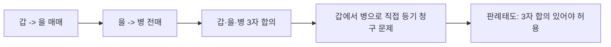
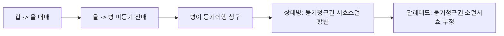
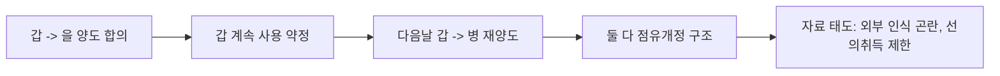
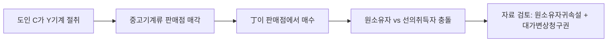

# 민법의 기초이론 3 전경운 통합노트

## 0. 소스 범위
- `강의계획서`: `민법의_기초이론_3_강의계획서_p001-007.md`
- `선배 정리자료`: `민법의_기초이론_3_전경운_주제별_모의답안_p001-012.md`
- `별세모 요약본`: `민법의_기초이론_3_전경운_중간고사_별세모_요약본pdf_p001-023.md`
- `기출`: `민법의_기초이론_3_전경운_2010~2020_중간고사_문제_p001-022.md`

## 1. 중간 범위 지도
- 중간 전 범위는 `물권법의 의의·객체·법원·특질`, `물권법정주의`, `우선적 효력`, `물권적 청구권`, `물권변동`, `물권행위의 유인성·무인성`, `부동산등기`, `법률행위에 의한 부동산물권변동`, `중간생략등기`, `물권적 기대권`, `등기청구권과 소멸시효`, `등기의 효력`, `동산물권변동`, `선의취득`, `명인방법`, `물권 소멸`까지다.
  - 근거 발췌: "3/2 ~ 3/8 물권법정주의, 물권의 종류, 우선적 효력, 물권적 청구권"; "3/23 ~ 3/29 중간생략등기, 물권적 기대권, 법률행위에 의하지 않은 부동산물권변동"; "4/6 ~ 4/12 동산물권변동, 선의취득, 명인방법, 물권 소멸"
  - 근거 위치: [《민법의_기초이론_3_강의계획서_p001-007.md》 p.3 | "3/2 ~ 3/8 물권법정주의, 물권의 종류, 우선적 효력, 물권적 청구권"] [《민법의_기초이론_3_강의계획서_p001-007.md》 p.3 | "3/23 ~ 3/29 중간생략등기, 물권적 기대권, 법률행위에 의하지 않은 부동산물권변동"] [《민법의_기초이론_3_강의계획서_p001-007.md》 p.3 | "4/6 ~ 4/12 동산물권변동, 선의취득, 명인방법, 물권 소멸"]
- 전경운 중간은 `총론 -> 부동산 물권변동 -> 등기/가등기 -> 동산물권변동`의 순서로 이어진다. 선배 정리자료의 배열도 정확히 이 흐름을 따라간다.
  - 근거 발췌: "물권의 종류와 내용을 법률로 정하는 것에 한정하는 원칙"; "판례는 우리 법제가 물권행위의 독자성과 무인성을 인정하고 있지 않다고 하여 유인설의 입장"; "본등기 순위는 가등기의 순위에 의한다"; "동산을 점유하고 있는 자를 권리자로 믿고"
  - 근거 위치: [《민법의_기초이론_3_전경운_주제별_모의답안_p001-012.md》 p.1 | "물권의 종류와 내용을 법률로 정하는 것에 한정하는 원칙"] [《민법의_기초이론_3_전경운_주제별_모의답안_p001-012.md》 p.3 | "판례는 우리 법제가 물권행위의 독자성과 무인성을 인정하고 있지 않다고 하여 유인설의 입장"] [《민법의_기초이론_3_전경운_주제별_모의답안_p001-012.md》 p.5 | "본등기 순위는 가등기의 순위에 의한다"] [《민법의_기초이론_3_전경운_주제별_모의답안_p001-012.md》 p.11 | "동산을 점유하고 있는 자를 권리자로 믿고"]

## 2. 물권법 총론: 물권법정주의와 물권적 청구권
- 선배 정리자료는 첫머리를 `물권법정주의`로 시작한다. 여기서 핵심 문장은 "물권의 종류와 내용을 법률로 정하는 것에 한정하는 원칙"이다. 즉 물권법 총론은 자유로운 사적 형성보다 법정성을 먼저 잡는 구조다.
  - 근거 발췌: "물권의 종류와 내용을 법률로 정하는 것에 한정하는 원칙"
  - 근거 위치: [《민법의_기초이론_3_전경운_주제별_모의답안_p001-012.md》 p.1 | "물권의 종류와 내용을 법률로 정하는 것에 한정하는 원칙"]
- 바로 다음 장이 `물권적 청구권`이다. 물권적 청구권은 `물권의 내용의 실현이 전면적 또는 부분적으로 방해`되는 상황에서 문제된다고 정리되어 있어, 물권법 총론을 단순 정의 암기보다 `법정주의 -> 물권 보호수단`으로 이어서 잡게 만든다.
  - 근거 발췌: "물권적 청구권이란 물권의 내용의 실현이 전면적 또는 부분적으로 방해당하고"
  - 근거 위치: [《민법의_기초이론_3_전경운_주제별_모의답안_p001-012.md》 p.2 | "물권적 청구권이란 물권의 내용의 실현이 전면적 또는 부분적으로 방해당하고"]
- 기출에서도 이 총론 파트는 독립되지 않고 바로 사례화된다. 2015 문제는 `침범건물`을 통해 물권적 청구권을, 같은 세트 안에서 `재단법인 출연`과 `등기청구권 소멸시효`를 함께 엮는다.
  - 근거 발췌: "Y토지 40평방미터를 침범하여"; "자기 소유의 나대지인 X토지 760평을 乙재단법인의 설립을 위하여 출연"; "소유권이전등기 청구권이 시효로 소멸하였다고 항변"
  - 근거 위치: [《민법의_기초이론_3_전경운_2010~2020_중간고사_문제_p001-022.md》 p.4 | "Y토지 40평방미터를 침범하여"] [《민법의_기초이론_3_전경운_2010~2020_중간고사_문제_p001-022.md》 p.11 | "자기 소유의 나대지인 X토지 760평을 乙재단법인의 설립을 위하여 출연"] [《민법의_기초이론_3_전경운_2010~2020_중간고사_문제_p001-022.md》 p.11 | "소유권이전등기 청구권이 시효로 소멸하였다고 항변"]

## 3. 부동산 물권변동: 유인성·무인성, 진정명의회복, 재단법인 출연
- 중간에서 가장 중요한 전환점은 `물권행위의 유인성/무인성`이다. 전경운 자료는 판례가 `독자성과 무인성을 인정하고 있지 않다`고 하여 `유인설` 입장이라는 점을 앞세운다.
  - 근거 발췌: "판례는 우리 법제가 물권행위의 독자성과 무인성을 인정하고 있지 않다고 하여 유인설의 입장"
  - 근거 위치: [《민법의_기초이론_3_전경운_주제별_모의답안_p001-012.md》 p.3 | "판례는 우리 법제가 물권행위의 독자성과 무인성을 인정하고 있지 않다고 하여 유인설의 입장"]
- 이 다음에 곧바로 `진정명의회복`이 배치된다는 점이 중요하다. 선배 정리자료는 `말소등기에 갈음하여 허용되는 진정명의회복`을 따로 정리하고 있어, 물권변동의 하자와 구제수단을 한 흐름으로 본다.
  - 근거 발췌: "말소등기에 갈음하여 허용되는 진정명의회복"
  - 근거 위치: [《민법의_기초이론_3_전경운_주제별_모의답안_p001-012.md》 p.4 | "말소등기에 갈음하여 허용되는 진정명의회복"]
- 같은 페이지 묶음에 `재단법인 출연재산 귀속`이 들어가는 것도 시험상 중요하다. 즉 전경운 민3에서는 재단법인 출연이 민1의 법인론에만 머무는 것이 아니라, 물권변동과 등기의 관점에서도 다시 나온다.
  - 근거 발췌: "재단법인 출연재산 귀속"
  - 근거 위치: [《민법의_기초이론_3_전경운_주제별_모의답안_p001-012.md》 p.4 | "재단법인 출연재산 귀속"]

## 4. 가등기, 이중등기, 중간생략등기: 중간고사의 핵심 덩어리
- `가등기`는 이 과목 중간에서 가장 빼기 어려운 쟁점이다. 선배 정리자료가 `청구권보전의 가등기`를 별도 페이지로 두고, 핵심을 `본등기 순위는 가등기의 순위에 의한다`는 문장으로 잡는다.
  - 근거 발췌: "청구권보전의 가등기"; "본등기 순위는 가등기의 순위에 의한다"
  - 근거 위치: [《민법의_기초이론_3_전경운_주제별_모의답안_p001-012.md》 p.5 | "청구권보전의 가등기"] [《민법의_기초이론_3_전경운_주제별_모의답안_p001-012.md》 p.5 | "본등기 순위는 가등기의 순위에 의한다"]
- `중간생략등기`는 가등기와 거의 한 세트로 돌려야 한다. 선배 정리자료는 `판례는 3자의 합의가 있는 경우에 이를 인정한다`고 정리하고, 실제 기출도 중간생략등기를 반복해서 꺼낸다.
  - 근거 발췌: "판례는 3자의 합의가 있는 경우에 이를 인정한다"; "그 등기를 갑에게서 병으로 바로 하기로 하는 합의를 갑, 을, 병 사이에서"; "그리고 이들 당사자 사이에 중간생략등기의 합의"
  - 근거 위치: [《민법의_기초이론_3_전경운_주제별_모의답안_p001-012.md》 p.7 | "판례는 3자의 합의가 있는 경우에 이를 인정한다"] [《민법의_기초이론_3_전경운_2010~2020_중간고사_문제_p001-022.md》 p.5 | "그 등기를 갑에게서 병으로 바로 하기로 하는 합의를 갑, 을, 병 사이에서"] [《민법의_기초이론_3_전경운_2010~2020_중간고사_문제_p001-022.md》 p.14 | "그리고 이들 당사자 사이에 중간생략등기의 합의"]
- `이중등기`도 같은 구간에서 같이 봐야 한다. 선배 정리자료가 p.6을 아예 `이중등기`로 잡고 있기 때문이다. 따라서 부동산 등기 파트는 `가등기-이중등기-중간생략등기` 세 개를 묶어 외우는 편이 효율적이다.
  - 근거 발췌: "이중등기"; "중간생략등기"
  - 근거 위치: [《민법의_기초이론_3_전경운_주제별_모의답안_p001-012.md》 p.6 | "이중등기"] [《민법의_기초이론_3_전경운_주제별_모의답안_p001-012.md》 p.7 | "중간생략등기"]

## 5. 등기청구권, 무효등기의 유용, 등기의 추정력
- 선배 정리자료는 `무효등기의 유용`과 `매매에 기한 소유권이전등기청구권`을 같은 페이지에 배치한다. 이 배치는 전경운 중간에서 등기를 형식으로만 보지 않고, 청구권 및 시효 문제와 함께 다룬다는 뜻이다.
  - 근거 발췌: "무효등기의 유용"; "매매에 기한 소유권이전등기청구권"
  - 근거 위치: [《민법의_기초이론_3_전경운_주제별_모의답안_p001-012.md》 p.8 | "무효등기의 유용"] [《민법의_기초이론_3_전경운_주제별_모의답안_p001-012.md》 p.8 | "매매에 기한 소유권이전등기청구권"]
- 등기청구권에 대해서는 `채권적 청구권`이라는 정리가 중심이고, 다만 `매수인이 그 목적물을 인도받아서 이를 사용, 수익하고 있는 경우`에는 시효 문제가 달라진다는 판례축까지 함께 공부해야 한다.
  - 근거 발췌: "판례는 법률행위에 의한 부동산물권변동의 경우의 등기청구권을 채권적 청구권"; "매수인이 그 목적물을 인도받아서 이를 사용,수익하고 있는 경우"
  - 근거 위치: [《민법의_기초이론_3_전경운_주제별_모의답안_p001-012.md》 p.8 | "판례는 법률행위에 의한 부동산물권변동의 경우의 등기청구권을 채권적 청구권"] [《민법의_기초이론_3_전경운_주제별_모의답안_p001-012.md》 p.8 | "매수인이 그 목적물을 인도받아서 이를 사용,수익하고 있는 경우"]
- 여기에 `등기의 추정력`이 붙는다. 즉 등기 파트 전체는 `원인 없는 등기`, `그 등기의 활용 가능성`, `등기로부터 무엇이 추정되는지`를 한 번에 이해해야 한다.
  - 근거 발췌: "등기의 추정력"
  - 근거 위치: [《민법의_기초이론_3_전경운_주제별_모의답안_p001-012.md》 p.9 | "등기의 추정력"]

## 6. 동산 물권변동: 이중의 점유개정, 선의취득, 도품·유실물
- 중간 후반부 동산 파트의 첫 논점은 `이중의 점유개정`이다. 선배 정리자료는 `먼저 점유개정에 의하여 양수받은 자가 소유권을 취득`한다고 정리한다.
  - 근거 발췌: "이중의 점유개정"; "먼저 점유개정에 의하여 양수받은 자가 소유권을 취득"
  - 근거 위치: [《민법의_기초이론_3_전경운_주제별_모의답안_p001-012.md》 p.10 | "이중의 점유개정"] [《민법의_기초이론_3_전경운_주제별_모의답안_p001-012.md》 p.10 | "먼저 점유개정에 의하여 양수받은 자가 소유권을 취득"]
- 그 다음 핵심은 `선의취득`이다. 전경운 자료는 `동산을 점유하고 있는 자를 권리자로 믿고` 거래하는 구조를 기본으로 잡는다.
  - 근거 발췌: "선의취득"; "동산을 점유하고 있는 자를 권리자로 믿고"
  - 근거 위치: [《민법의_기초이론_3_전경운_주제별_모의답안_p001-012.md》 p.11 | "선의취득"] [《민법의_기초이론_3_전경운_주제별_모의답안_p001-012.md》 p.11 | "동산을 점유하고 있는 자를 권리자로 믿고"]
- 마지막으로 `도품, 유실물인 경우 제3자가 선의취득의 요건을 갖추었더라도`라는 특칙이 붙는다. 그래서 동산 파트는 항상 `선의취득 일반론 -> 도품·유실물 예외`의 순서로 보아야 한다.
  - 근거 발췌: "도품, 유실물 특칙"; "도품, 유실물인 경우 제 3자가 선의취득의 요건을 갖추었더라도"
  - 근거 위치: [《민법의_기초이론_3_전경운_주제별_모의답안_p001-012.md》 p.12 | "도품, 유실물 특칙"] [《민법의_기초이론_3_전경운_주제별_모의답안_p001-012.md》 p.12 | "도품, 유실물인 경우 제 3자가 선의취득의 요건을 갖추었더라도"]

## 7. 기출 반복축
- `중간생략등기`는 2012와 2018에서 반복 확인된다. 전자는 `갑-을-병 사이의 합의`, 후자는 `당사자 사이에 중간생략등기의 합의`라는 문장으로 바로 드러난다.
  - 근거 발췌: "그 등기를 갑에게서 병으로 바로 하기로 하는 합의를 갑, 을, 병 사이에서"; "그리고 이들 당사자 사이에 중간생략등기의 합의"
  - 근거 위치: [《민법의_기초이론_3_전경운_2010~2020_중간고사_문제_p001-022.md》 p.5 | "그 등기를 갑에게서 병으로 바로 하기로 하는 합의를 갑, 을, 병 사이에서"] [《민법의_기초이론_3_전경운_2010~2020_중간고사_문제_p001-022.md》 p.14 | "그리고 이들 당사자 사이에 중간생략등기의 합의"]
- `가등기`는 2012와 2019에서 다시 확인된다. 즉 중간용 통합노트에서는 절대 빠질 수 없는 상수다.
  - 근거 발췌: "을을 가등기권리자로 하는 소유권이전청구권 보전을 목적으로 하는 가등기"; "乙을 가등기권리자로 하여 소유권이전 등기청구권의 보전을 목적으로 하는 가등기"
  - 근거 위치: [《민법의_기초이론_3_전경운_2010~2020_중간고사_문제_p001-022.md》 p.5 | "을을 가등기권리자로 하는 소유권이전청구권 보전을 목적으로 하는 가등기"] [《민법의_기초이론_3_전경운_2010~2020_중간고사_문제_p001-022.md》 p.17 | "乙을 가등기권리자로 하여 소유권이전 등기청구권의 보전을 목적으로 하는 가등기"]
- `등기청구권 소멸시효`, `재단법인 출연`, `물권적 청구권`은 2015 세트에서 한꺼번에 나온다. 따라서 공부도 분절하지 말고 같이 묶는 편이 좋다.
  - 근거 발췌: "소유권이전등기 청구권이 시효로 소멸하였다고 항변"; "자기 소유의 나대지인 X토지 760평을 乙재단법인의 설립을 위하여 출연"; "Y토지 40평방미터를 침범하여"
  - 근거 위치: [《민법의_기초이론_3_전경운_2010~2020_중간고사_문제_p001-022.md》 p.11 | "소유권이전등기 청구권이 시효로 소멸하였다고 항변"] [《민법의_기초이론_3_전경운_2010~2020_중간고사_문제_p001-022.md》 p.11 | "자기 소유의 나대지인 X토지 760평을 乙재단법인의 설립을 위하여 출연"] [《민법의_기초이론_3_전경운_2010~2020_중간고사_문제_p001-022.md》 p.4 | "Y토지 40평방미터를 침범하여"]
- `선의취득·도품유실물`은 2010과 2019에서 직접 확인된다. 동산 파트도 단발성 보조문제가 아니라 반복문제다.
  - 근거 발췌: "병은 결국선의취득을할 수 있다"; "Y기계를 훔쳐서 중고 기 계류 판매점에 매각"
  - 근거 위치: [《민법의_기초이론_3_전경운_2010~2020_중간고사_문제_p001-022.md》 p.2 | "병은 결국선의취득을할 수 있다"] [《민법의_기초이론_3_전경운_2010~2020_중간고사_문제_p001-022.md》 p.17 | "Y기계를 훔쳐서 중고 기 계류 판매점에 매각"]
- `무권대리와 물권적 청구권`, `계약무효와 부당이득 반환(선의점유자 과실수취권)`, `취득시효와 전보배상`, `명의신탁과 자주점유 추정`은 2023 중간고사에서 폭넓게 세트로 묶여 출제되었다. 
  - 근거 위치: [《민법의_기초이론_3_전경운_2023_중간고사_문제_1.jpg》] [《민법의_기초이론_3_전경운_2023_중간고사_문제_2.jpg》]
- `공유관계(소수지분권자 인도청구불가/보존행위/부당이득)`, `전세권저당권의 물상대위`, `분묘기지권 지료지급시기`는 2023 기말고사에서 연속하여 출제되었다. 중간 범위(총론) 밖의 쟁점이지만, 기말 대비의 최우선 타겟이다.
  - 근거 위치: [《민법의_기초이론_3_전경운_2023_기말고사_문제_1.jpg》] [《민법의_기초이론_3_전경운_2023_기말고사_문제_2.jpg》] [《민법의_기초이론_3_전경운_2023_기말고사_문제_3.jpg》]

## 8. 시험용 우선순위
- `1순위`: 물권법정주의, 물권적 청구권, 유인성/무인성, 진정명의회복.
  - 근거 발췌: "물권의 종류와 내용을 법률로 정하는 것에 한정하는 원칙"; "물권적 청구권이란"; "유인설의 입장"; "진정명의회복"
  - 근거 위치: [《민법의_기초이론_3_전경운_주제별_모의답안_p001-012.md》 p.1 | "물권의 종류와 내용을 법률로 정하는 것에 한정하는 원칙"] [《민법의_기초이론_3_전경운_주제별_모의답안_p001-012.md》 p.2 | "물권적 청구권이란"] [《민법의_기초이론_3_전경운_주제별_모의답안_p001-012.md》 p.3 | "유인설의 입장"] [《민법의_기초이론_3_전경운_주제별_모의답안_p001-012.md》 p.4 | "진정명의회복"]
- `2순위`: 가등기, 이중등기, 중간생략등기, 등기청구권과 소멸시효.
  - 근거 발췌: "청구권보전의 가등기"; "이중등기"; "중간생략등기"; "등기청구권을 채권적 청구권"
  - 근거 위치: [《민법의_기초이론_3_전경운_주제별_모의답안_p001-012.md》 p.5 | "청구권보전의 가등기"] [《민법의_기초이론_3_전경운_주제별_모의답안_p001-012.md》 p.6 | "이중등기"] [《민법의_기초이론_3_전경운_주제별_모의답안_p001-012.md》 p.7 | "중간생략등기"] [《민법의_기초이론_3_전경운_주제별_모의답안_p001-012.md》 p.8 | "등기청구권을 채권적 청구권"]
- `3순위`: 이중의 점유개정, 선의취득, 도품·유실물 특칙.
  - 근거 발췌: "이중의 점유개정"; "선의취득"; "도품, 유실물 특칙"
  - 근거 위치: [《민법의_기초이론_3_전경운_주제별_모의답안_p001-012.md》 p.10 | "이중의 점유개정"] [《민법의_기초이론_3_전경운_주제별_모의답안_p001-012.md》 p.11 | "선의취득"] [《민법의_기초이론_3_전경운_주제별_모의답안_p001-012.md》 p.12 | "도품, 유실물 특칙"]

## 9. 압축 결론
- 전경운 민3 중간은 `물권법정주의 -> 물권적 청구권 -> 유인성/무인성 -> 진정명의회복 -> 가등기/이중등기/중간생략등기 -> 등기청구권과 시효 -> 동산 선의취득`의 순서로 잡으면 된다.
- 기출 반복성이 가장 강한 것은 `중간생략등기`, `가등기`, `등기청구권 소멸시효`, `재단법인 출연`, `선의취득`이다.
- 별세모 요약본은 위 쟁점들의 설명을 더 풀어 주는 보강자료로 보고, 시험 직전에는 주제별 모의답안과 2010~2020 기출 문구를 중심으로 회독하는 편이 효율적이다.

## 10. 주요판례·판례태도 정리
- `물권적 청구권`에 대해 자료는 판례가 `절충설` 입장이라고 정리한다. 즉 물권적 청구권은 채권은 아니지만, 물권의 효력에서 파생하는 `특수한 청구권`으로 본다.
  - 근거 발췌: "판례 : 물권적 청구권은 물권의 효력으로부터 발생하며 채권적 청구권은 아니라 하여 절충설의 입장"
  - 근거 위치: [《민법의_기초이론_3_전경운_주제별_모의답안_p001-012.md》 p.2 | "판례 : 물권적 청구권은 물권의 효력으로부터 발생하며 채권적 청구권은 아니라 하여 절충설의 입장"]
- `물권행위의 유인성`에 관하여 판례는 명확히 `유인설` 입장이라고 정리된다. 따라서 민3에서는 물권행위 독자성과 무인성을 전제로 답안을 짜면 안 된다.
  - 근거 발췌: "판례는 우리 법제가 물권행위의 독자성과 무인성을 인정하고 있지 않다고 하여 유인설의 입장"
  - 근거 위치: [《민법의_기초이론_3_전경운_주제별_모의답안_p001-012.md》 p.3 | "판례는 우리 법제가 물권행위의 독자성과 무인성을 인정하고 있지 않다고 하여 유인설의 입장"]
- `가등기`에서는 판례가 `소극설`을 취한다. 즉 본등기 전의 가등기 자체에는 실체법상 효력이 없고, 경고적 기능만 남는다는 구조다.
  - 근거 발췌: "소극설(통설)은 본등기가 없는 동안은 그 자체로서는 아무런 실체법상의 효력이 없다고 본다"; "판례는 소극설의 입장이다"
  - 근거 위치: [《민법의_기초이론_3_전경운_주제별_모의답안_p001-012.md》 p.5 | "소극설(통설)은 본등기가 없는 동안은 그 자체로서는 아무런 실체법상의 효력이 없다고 본다"] [《민법의_기초이론_3_전경운_주제별_모의답안_p001-012.md》 p.5 | "판례는 소극설의 입장이다"]
- `등기청구권`에 대해서는 판례가 `채권적 청구권설`을 취한다. 다만 매수인이 목적물을 인도받아 사용·수익 중인 경우에는 소멸시효가 진행되지 않는다는 예외까지 같이 적어야 한다.
  - 근거 발췌: "판례는 물권행위의 독자성을 부인하면서 채권행위로부터 발생하는 채권적 청구권으로 파악한다"; "매수인의 등기청구권은 다른 채권과는 달리 소멸시효에 걸리지 않는다고"
  - 근거 위치: [《민법의_기초이론_3_전경운_주제별_모의답안_p001-012.md》 p.8 | "판례는 물권행위의 독자성을 부인하면서 채권행위로부터 발생하는 채권적 청구권으로 파악한다"] [《민법의_기초이론_3_전경운_주제별_모의답안_p001-012.md》 p.8 | "매수인의 등기청구권은 다른 채권과는 달리 소멸시효에 걸리지 않는다고"]
- `이중의 점유개정`에서는 판례가 점유개정에 의한 선의취득을 `부정`한다. 여기서 핵심은 점유개정만으로는 외부에서 거래존재를 인식하기 어렵고, 진정한 권리자 보호가 우선된다는 점이다.
  - 근거 발췌: "부정설(다수설)"; "판례는 부정설의 입장이다"; "진정한 권리자를 보호하는 부정설이 타당하다"
  - 근거 위치: [《민법의_기초이론_3_전경운_주제별_모의답안_p001-012.md》 p.10 | "부정설(다수설)"] [《민법의_기초이론_3_전경운_주제별_모의답안_p001-012.md》 p.10 | "판례는 부정설의 입장이다"] [《민법의_기초이론_3_전경운_주제별_모의답안_p001-012.md》 p.10 | "진정한 권리자를 보호하는 부정설이 타당하다"]
- `도품·유실물 특칙`과 `대가변상청구권`에서는 판례가 `251조의 무과실 요건 인정`, `대가변상청구권설`을 취한다고 정리된다.
  - 근거 발췌: "다수설과 판례는 ... 무과실도 당연한 요건"; "통설과 판례는 대가변상청구권으로 해석한다"
  - 근거 위치: [《민법의_기초이론_3_전경운_주제별_모의답안_p001-012.md》 p.12 | "다수설과 판례는 ... 무과실도 당연한 요건"] [《민법의_기초이론_3_전경운_주제별_모의답안_p001-012.md》 p.12 | "통설과 판례는 대가변상청구권으로 해석한다"]

## 11. 학설·판례·검토
- `물권법정주의`에서는 관습법과 성문법의 관계를 둘러싸고 `보충적 효력설`, `대등적 효력설`, `변경적 효력설`이 대립한다. 이 자료는 공시제도 보호를 이유로 `보충적 효력설`을 타당한 견해로 정리한다.
  - 근거 발췌: "보충적 효력설"; "대등적 효력설"; "변경적 효력설"; "검토 : 대등적이나 변경적은 공시제도인 부동산등기제도를 무력화시킬 수 있다. 보충적이 타당"
  - 근거 위치: [《민법의_기초이론_3_전경운_주제별_모의답안_p001-012.md》 p.1 | "보충적 효력설"] [《민법의_기초이론_3_전경운_주제별_모의답안_p001-012.md》 p.1 | "대등적 효력설"] [《민법의_기초이론_3_전경운_주제별_모의답안_p001-012.md》 p.1 | "변경적 효력설"] [《민법의_기초이론_3_전경운_주제별_모의답안_p001-012.md》 p.1 | "검토 : 대등적이나 변경적은 공시제도인 부동산등기제도를 무력화시킬 수 있다. 보충적이 타당"]
- `물권적 청구권`은 법적 성질, 소멸시효, 비용부담까지 학설이 갈린다. 자료는 `절충설`, `소멸시효 부정 다수설`, `적극적 행위청구권설` 중심으로 정리한다.
  - 근거 발췌: "학설 : i) 물권설 ... ii) 채권설 ... iii) 절충설"; "다수설이 타당하다"; "적극적 행위청구권설(다수설)"
  - 근거 위치: [《민법의_기초이론_3_전경운_주제별_모의답안_p001-012.md》 p.2 | "학설 : i) 물권설 ... ii) 채권설 ... iii) 절충설"] [《민법의_기초이론_3_전경운_주제별_모의답안_p001-012.md》 p.2 | "다수설이 타당하다"] [《민법의_기초이론_3_전경운_주제별_모의답안_p001-012.md》 p.2 | "적극적 행위청구권설(다수설)"]
- `가등기`와 `등기청구권`은 단순 암기보다 세트로 보는 편이 낫다. 가등기에서는 `소극설 vs 적극설`, 등기청구권에서는 `채권적 청구권설 vs 물권적 청구권설`이 대립하고, 중간생략등기와 연결될 때는 `3자간 합의`까지 붙는다.
  - 근거 발췌: "소극설(통설)"; "적극설(소수설)"; "채권행위로 발생하는 채권적 청구권설"; "물권적 기대권으로 발생하는 물권적 청구권설"; "판례는 합의조건부 유효설의 입장으로 3자간의 합의가 있어야 한다"
  - 근거 위치: [《민법의_기초이론_3_전경운_주제별_모의답안_p001-012.md》 p.5 | "소극설(통설)"] [《민법의_기초이론_3_전경운_주제별_모의답안_p001-012.md》 p.5 | "적극설(소수설)"] [《민법의_기초이론_3_전경운_주제별_모의답안_p001-012.md》 p.8 | "채권행위로 발생하는 채권적 청구권설"] [《민법의_기초이론_3_전경운_주제별_모의답안_p001-012.md》 p.8 | "물권적 기대권으로 발생하는 물권적 청구권설"] [《민법의_기초이론_3_전경운_주제별_모의답안_p001-012.md》 p.8 | "판례는 합의조건부 유효설의 입장으로 3자간의 합의가 있어야 한다"]
- `도품·유실물`에서는 `선의취득자귀속설`과 `원소유자귀속설`이 충돌한다. 이 자료는 연혁과 권리자 보호를 이유로 `원소유자귀속설`을 타당하다고 본다.
  - 근거 발췌: "선의취득자귀속설(통설)"; "원소유자귀속설(소수설)"; "선의취득의 연혁을 고려해 보면 원소유자귀속설이 타당하다"
  - 근거 위치: [《민법의_기초이론_3_전경운_주제별_모의답안_p001-012.md》 p.12 | "선의취득자귀속설(통설)"] [《민법의_기초이론_3_전경운_주제별_모의답안_p001-012.md》 p.12 | "원소유자귀속설(소수설)"] [《민법의_기초이론_3_전경운_주제별_모의답안_p001-012.md》 p.12 | "선의취득의 연혁을 고려해 보면 원소유자귀속설이 타당하다"]

## 12. 검토·비판 메모
- 이 자료가 가장 강하게 비판하는 것은 `대등적 효력설`과 `변경적 효력설`이다. 이유는 명확하다. 이 두 견해를 허용하면 `등기제도` 자체가 흔들리기 때문이다.
  - 근거 발췌: "대등적이나 변경적은 공시제도인 부동산등기제도를 무력화시킬 수 있다"
  - 근거 위치: [《민법의_기초이론_3_전경운_주제별_모의답안_p001-012.md》 p.1 | "대등적이나 변경적은 공시제도인 부동산등기제도를 무력화시킬 수 있다"]
- `물권적 청구권 소멸시효 인정설`도 자료는 사실상 비판한다. 물권은 살아 있는데 청구권만 시효로 사라진다고 보면 `물권의 실질`이 무너진다는 논리다.
  - 근거 발췌: "물권이 존재함에도 물권적 청구권만이 소멸시효에 걸린다고 하면 물권의 실질을 상실하게 되므로 다수설이 타당하다"
  - 근거 위치: [《민법의_기초이론_3_전경운_주제별_모의답안_p001-012.md》 p.2 | "물권이 존재함에도 물권적 청구권만이 소멸시효에 걸린다고 하면 물권의 실질을 상실하게 되므로 다수설이 타당하다"]
- `점유개정에 의한 선의취득 긍정설`에 대해서도 비판이 분명하다. 자료는 점유개정으로는 외형상 점유이전이 없으므로 진정한 권리자 보호가 우선된다고 본다.
  - 근거 발췌: "점유개정은 관념적 점유이전방법 중에서 가장 불명확하여 외부에서 거래행위의 존재를 전혀 인식할 수 없다고 하여 부정"; "진정한 권리자를 보호하는 부정설이 타당하다"
  - 근거 위치: [《민법의_기초이론_3_전경운_주제별_모의답안_p001-012.md》 p.10 | "점유개정은 관념적 점유이전방법 중에서 가장 불명확하여 외부에서 거래행위의 존재를 전혀 인식할 수 없다고 하여 부정"] [《민법의_기초이론_3_전경운_주제별_모의답안_p001-012.md》 p.10 | "진정한 권리자를 보호하는 부정설이 타당하다"]
- `도품·유실물` 파트는 선의취득자 보호만이 아니라 원소유자 보호, 그리고 거래안전의 균형을 같이 보라는 메시지가 강하다. 그래서 자료는 `원소유자귀속설 타당`과 `대가변상청구권 타당`을 함께 적고 있다.
  - 근거 발췌: "원소유자귀속설이 타당하다"; "선의취득자의 이익과 거래안전을 보호하는 것이 본조의 취지이므로 대가변상청구권이 타당하다"
  - 근거 위치: [《민법의_기초이론_3_전경운_주제별_모의답안_p001-012.md》 p.12 | "원소유자귀속설이 타당하다"] [《민법의_기초이론_3_전경운_주제별_모의답안_p001-012.md》 p.12 | "선의취득자의 이익과 거래안전을 보호하는 것이 본조의 취지이므로 대가변상청구권이 타당하다"]

## 13. 중요도 구분
- `[A급] 물권적 청구권 + 가등기/중간생략등기/등기청구권 + 선의취득/도품·유실물`. 현재까지 확보한 선배정리, 기출문제, 모의답안에서 가장 자주 반복되는 축이다. 중간 대비는 우선 이 세 덩어리를 완전히 말할 수 있게 만드는 것이 맞다.
  - 근거 발췌: "물권적 청구권"; "청구권보전의 가등기"; "중간생략등기"; "선의취득"; "도품, 유실물 특칙"; "등기의 추정력이 문제된다"; "물권적 청구권의 이행불능으로 인한 전보배상 인정 여부"
  - 근거 위치: [《민법의_기초이론_3_전경운_주제별_모의답안_p001-012.md》 p.2 | "물권적 청구권"] [《민법의_기초이론_3_전경운_주제별_모의답안_p001-012.md》 p.5 | "청구권보전의 가등기"] [《민법의_기초이론_3_전경운_주제별_모의답안_p001-012.md》 p.7 | "중간생략등기"] [《민법의_기초이론_3_전경운_주제별_모의답안_p001-012.md》 p.11 | "선의취득"] [《민법의_기초이론_3_전경운_주제별_모의답안_p001-012.md》 p.12 | "도품, 유실물 특칙"] [《민법의_기초이론_3_전경운_중간_모의답안_2023_김혜선.pdf》 [2023 제1문] | "등기의 추정력이 문제된다"] [《민법의_기초이론_3_전경운_중간_모의답안_2023_김혜선.pdf》 [2023 제1문] | "물권적 청구권의 이행불능으로 인한 전보배상 인정 여부"]
- `[B급] 유인성/무인성·진정명의회복·등기의 추정력·선의점유`. 시험에 꾸준히 나오지만, 대개 A급 덩어리 안에서 전제 논점이나 파생 논점으로 배치된다. 답안 분량이 짧을수록 A급보다 한 줄 뒤로 밀릴 수 있다.
  - 근거 발췌: "유인설의 입장"; "진정명의회복"; "등기의 추정력"; "선의점유자의 과실취득권"
  - 근거 위치: [《민법의_기초이론_3_전경운_주제별_모의답안_p001-012.md》 p.3 | "유인설의 입장"] [《민법의_기초이론_3_전경운_주제별_모의답안_p001-012.md》 p.4 | "진정명의회복"] [《민법의_기초이론_3_전경운_주제별_모의답안_p001-012.md》 p.9 | "등기의 추정력"] [《민법의_기초이론_3_전경운_중간_모의답안_2023_김혜선.pdf》 [2023 제1문] | "선의점유자의 과실취득권(제201조 제1항)"]
- `[C급] 재단법인 출연·이중등기 세부론`. 중요하지 않다는 뜻이 아니라, 먼저 A·B급 틀을 세운 뒤 얹어야 하는 범위라는 뜻이다. 다만 재단법인 출연은 민1과의 교차논점이므로 최소한 구조는 기억해야 한다.
  - 근거 발췌: "재단법인 출연재산 귀속"; "이중등기"
  - 근거 위치: [《민법의_기초이론_3_전경운_주제별_모의답안_p001-012.md》 p.4 | "재단법인 출연재산 귀속"] [《민법의_기초이론_3_전경운_주제별_모의답안_p001-012.md》 p.6 | "이중등기"]

## 14. 수업노트식 상세 흐름
- `1단 묶음: 물권법정주의 -> 물권적 청구권`. 민3 첫머리는 정의를 외우는 파트가 아니라, `물권을 왜 엄격히 정형화하는가`와 `그 물권을 어떻게 보호하는가`를 연결해서 쓰는 파트다. 그래서 물권법정주의를 쓴 직후 바로 물권적 청구권으로 넘어갈 수 있어야 한다.
  - 근거 발췌: "물권의 종류와 내용을 법률로 정하는 것에 한정하는 원칙"; "물권적 청구권이란 물권의 내용의 실현이 전면적 또는 부분적으로 방해당하고"
  - 근거 위치: [《민법의_기초이론_3_전경운_주제별_모의답안_p001-012.md》 p.1 | "물권의 종류와 내용을 법률로 정하는 것에 한정하는 원칙"] [《민법의_기초이론_3_전경운_주제별_모의답안_p001-012.md》 p.2 | "물권적 청구권이란 물권의 내용의 실현이 전면적 또는 부분적으로 방해당하고"]
- `2단 묶음: 유인성/무인성 -> 진정명의회복 -> 등기의 추정력`. 이 구간은 부동산물권변동의 하자를 보는 파트다. 판례가 유인설을 취한다는 점, 등기의 추정력이 쉽게 깨지지 않는다는 점, 하자가 있더라도 구제수단을 별도로 검토해야 한다는 점을 함께 익혀야 한다.
  - 근거 발췌: "유인설의 입장"; "말소등기에 갈음하여 허용되는 진정명의회복"; "등기의 추정력이 문제된다"
  - 근거 위치: [《민법의_기초이론_3_전경운_주제별_모의답안_p001-012.md》 p.3 | "유인설의 입장"] [《민법의_기초이론_3_전경운_주제별_모의답안_p001-012.md》 p.4 | "말소등기에 갈음하여 허용되는 진정명의회복"] [《민법의_기초이론_3_전경운_중간_모의답안_2023_김혜선.pdf》 [2023 제1문] | "등기의 추정력이 문제된다"]
- `3단 묶음: 가등기 -> 중간생략등기 -> 등기청구권과 소멸시효`. 중간고사 실전에서는 이 세 논점이 따로 나오지 않고 한 사실관계 안에서 묶여 나오는 경우가 많다. 그래서 가등기의 효력, 3자합의, 등기청구권의 법적 성질과 시효를 한 세트로 회독해야 한다.
  - 근거 발췌: "본등기 순위는 가등기의 순위에 의한다"; "판례는 3자의 합의가 있는 경우에 이를 인정한다"; "등기청구권을 채권적 청구권"; "소유권이전등기 청구권이 시효로 소멸하였다고 항변"
  - 근거 위치: [《민법의_기초이론_3_전경운_주제별_모의답안_p001-012.md》 p.5 | "본등기 순위는 가등기의 순위에 의한다"] [《민법의_기초이론_3_전경운_주제별_모의답안_p001-012.md》 p.8 | "판례는 3자의 합의가 있는 경우에 이를 인정한다"] [《민법의_기초이론_3_전경운_주제별_모의답안_p001-012.md》 p.8 | "등기청구권을 채권적 청구권"] [《민법의_기초이론_3_전경운_2010~2020_중간고사_문제_p001-022.md》 p.11 | "소유권이전등기 청구권이 시효로 소멸하였다고 항변"]
- `4단 묶음: 점유개정 -> 선의취득 -> 도품·유실물`. 동산 파트는 항상 `일반 선의취득`과 `예외로서 도품·유실물`의 대조로 정리해야 한다. 특히 점유개정에 의한 선의취득 부정은 함정으로 반복된다.
  - 근거 발췌: "점유개정에 의한 선의취득을 부인"; "선의취득"; "도품, 유실물인 경우 제 3자가 선의취득의 요건을 갖추었더라도"
  - 근거 위치: [《민법의_기초이론_3_전경운_주제별_모의답안_p001-012.md》 p.10 | "점유개정에 의한 선의취득을 부인"] [《민법의_기초이론_3_전경운_주제별_모의답안_p001-012.md》 p.11 | "선의취득"] [《민법의_기초이론_3_전경운_주제별_모의답안_p001-012.md》 p.12 | "도품, 유실물인 경우 제 3자가 선의취득의 요건을 갖추었더라도"]

## 15. 모의답안·기출 연결
- `2023 중간 모의답안`은 민3가 실제로 어떤 식으로 묶여 나오는지를 그대로 보여 준다. 제1문만 봐도 `등기의 추정력`, `선의점유자의 과실취득권`, `물권적 청구권의 이행불능과 전보배상`이 한 사건 흐름 안에 배치된다.
  - 근거 발췌: "등기의 추정력이 문제된다"; "선의점유자의 과실취득권(제201조 제1항)"; "물권적 청구권의 이행불능으로 인한 전보배상 인정 여부"
  - 근거 위치: [《민법의_기초이론_3_전경운_중간_모의답안_2023_김혜선.pdf》 [2023 제1문] | "등기의 추정력이 문제된다"] [《민법의_기초이론_3_전경운_중간_모의답안_2023_김혜선.pdf》 [2023 제1문] | "선의점유자의 과실취득권(제201조 제1항)"] [《민법의_기초이론_3_전경운_중간_모의답안_2023_김혜선.pdf》 [2023 제1문] | "물권적 청구권의 이행불능으로 인한 전보배상 인정 여부"]
- `2010~2020 중간고사 문제`는 중간생략등기, 가등기, 등기청구권 시효, 선의취득이 반복 출제된다는 점을 보여 준다. 따라서 이 과목의 수업노트는 `한 번 본 쟁점`이 아니라 `반복된 쟁점군` 중심으로 짜야 한다.
  - 근거 발췌: "그 등기를 갑에게서 병으로 바로 하기로 하는 합의를 갑, 을, 병 사이에서"; "乙을 가등기권리자로 하여 소유권이전 등기청구권의 보전을 목적으로 하는 가등기"; "병은 결국선의취득을할 수 있다"
  - 근거 위치: [《민법의_기초이론_3_전경운_2010~2020_중간고사_문제_p001-022.md》 p.5 | "그 등기를 갑에게서 병으로 바로 하기로 하는 합의를 갑, 을, 병 사이에서"] [《민법의_기초이론_3_전경운_2010~2020_중간고사_문제_p001-022.md》 p.17 | "乙을 가등기권리자로 하여 소유권이전 등기청구권의 보전을 목적으로 하는 가등기"] [《민법의_기초이론_3_전경운_2010~2020_중간고사_문제_p001-022.md》 p.2 | "병은 결국선의취득을할 수 있다"]
- 이번 턴에서 `변시·사시 사례연습` 책의 존재와 민법총칙 파트 목차는 확인했지만, 물권법 파트의 세부 쟁점까지 직접 추출해서 확인하지는 못했다. 따라서 민3 노트의 변시 연결은 현재 직접 읽은 `모의답안 + 학교기출 + 전경운 기출` 중심으로 유지한다.

## 16. 주요 비교 개념 표
### 16-1. 비교표
| 비교축 | A | B | C | 실전 포인트 |
| --- | --- | --- | --- | --- |
| 물권법정주의와 관습법 | 보충적 효력설 | 대등적 효력설 | 변경적 효력설 | 자료는 공시제도 보호를 이유로 보충적 효력설을 타당하다고 본다 |
| 물권적 청구권의 성질 | 물권설 | 채권설 | 절충설 | 자료 정리는 절충설 + 소멸시효 부정 쪽에 선다 |
| 가등기의 효력 | 소극설 | 적극설 | - | 판례와 자료 모두 소극설을 중심으로 배치한다 |
| 등기청구권의 성질 | 채권적 청구권설 | 물권적 청구권설 | - | 중간생략등기와 붙이면 `3자간 합의`까지 같이 써야 한다 |
| 도품·유실물 귀속 | 선의취득자귀속설 | 원소유자귀속설 | - | 자료는 원소유자귀속설을 타당한 견해로 본다 |

### 16-2. 비교 근거
- `보충적 / 대등적 / 변경적 효력설`
  - 근거 발췌: "보충적 효력설"; "대등적 효력설"; "변경적 효력설"; "검토 : 대등적이나 변경적은 공시제도인 부동산등기제도를 무력화시킬 수 있다. 보충적이 타당"
  - 근거 위치: [《민법의_기초이론_3_전경운_주제별_모의답안_p001-012.md》 p.1 | "보충적 효력설"] [《민법의_기초이론_3_전경운_주제별_모의답안_p001-012.md》 p.1 | "대등적 효력설"] [《민법의_기초이론_3_전경운_주제별_모의답안_p001-012.md》 p.1 | "변경적 효력설"] [《민법의_기초이론_3_전경운_주제별_모의답안_p001-012.md》 p.1 | "검토 : 대등적이나 변경적은 공시제도인 부동산등기제도를 무력화시킬 수 있다. 보충적이 타당"]
- `물권설 / 채권설 / 절충설`
  - 근거 발췌: "학설 : i) 물권설 ... ii) 채권설 ... iii) 절충설"; "다수설이 타당하다"
  - 근거 위치: [《민법의_기초이론_3_전경운_주제별_모의답안_p001-012.md》 p.2 | "학설 : i) 물권설 ... ii) 채권설 ... iii) 절충설"] [《민법의_기초이론_3_전경운_주제별_모의답안_p001-012.md》 p.2 | "다수설이 타당하다"]
- `가등기 소극설 / 적극설`
  - 근거 발췌: "소극설(통설)"; "적극설(소수설)"; "판례는 소극설의 입장"
  - 근거 위치: [《민법의_기초이론_3_전경운_주제별_모의답안_p001-012.md》 p.5 | "소극설(통설)"] [《민법의_기초이론_3_전경운_주제별_모의답안_p001-012.md》 p.5 | "적극설(소수설)"] [《민법의_기초이론_3_전경운_주제별_모의답안_p001-012.md》 p.5 | "판례는 소극설의 입장"]
- `채권적 등기청구권설 / 물권적 등기청구권설`
  - 근거 발췌: "채권행위로 발생하는 채권적 청구권설"; "물권적 기대권으로 발생하는 물권적 청구권설"; "판례는 합의조건부 유효설의 입장으로 3자간의 합의가 있어야 한다"
  - 근거 위치: [《민법의_기초이론_3_전경운_주제별_모의답안_p001-012.md》 p.8 | "채권행위로 발생하는 채권적 청구권설"] [《민법의_기초이론_3_전경운_주제별_모의답안_p001-012.md》 p.8 | "물권적 기대권으로 발생하는 물권적 청구권설"] [《민법의_기초이론_3_전경운_주제별_모의답안_p001-012.md》 p.8 | "판례는 합의조건부 유효설의 입장으로 3자간의 합의가 있어야 한다"]
- `선의취득자귀속설 / 원소유자귀속설`
  - 근거 발췌: "선의취득자귀속설(통설)"; "원소유자귀속설(소수설)"; "선의취득의 연혁을 고려해 보면 원소유자귀속설이 타당하다"
  - 근거 위치: [《민법의_기초이론_3_전경운_주제별_모의답안_p001-012.md》 p.12 | "선의취득자귀속설(통설)"] [《민법의_기초이론_3_전경운_주제별_모의답안_p001-012.md》 p.12 | "원소유자귀속설(소수설)"] [《민법의_기초이론_3_전경운_주제별_모의답안_p001-012.md》 p.12 | "선의취득의 연혁을 고려해 보면 원소유자귀속설이 타당하다"]

## 17. 주요 판례·기출사실관계 정리
- 민3 자료는 일부 쟁점에서 `사건번호보다 판례태도`를 먼저 정리한다. 그래서 아래는 `판례태도 + 기출사실관계`를 함께 묶은 방식으로 적는다.

### 17-1. 중간생략등기
- 소스 기준 사실관계: 갑이 을에게 토지를 매도하고, 을이 다시 병에게 전매한 뒤 `갑·을·병 사이에 갑에서 병으로 바로 등기하기로 합의`한 사안이다.
- 요지: 자료는 판례가 `합의조건부 유효설`을 취하여 `3자간 합의`가 있어야 중간생략등기를 인정한다고 정리한다.

- 근거 발췌: "그 등기를 갑에게서 병으로 바로 하기로 하는 합의를 갑, 을, 병 사이에서"; "판례는 합의조건부 유효설의 입장으로 3자간의 합의가 있어야 한다"
- 근거 위치: [《민법의_기초이론_3_전경운_2010~2020_중간고사_문제_p001-022.md》 p.5 | "그 등기를 갑에게서 병으로 바로 하기로 하는 합의를 갑, 을, 병 사이에서"] [《민법의_기초이론_3_전경운_주제별_모의답안_p001-012.md》 p.8 | "판례는 합의조건부 유효설의 입장으로 3자간의 합의가 있어야 한다"]

### 17-2. 가등기와 본등기
- 소스 기준 사실관계: 을이 `가등기권리자`로서 소유권이전등기청구권 보전을 위한 가등기를 해 둔 상태에서, 갑이 다시 병에게 매도하거나 증여하여 병 명의 본등기를 넘긴 사안이다.
- 요지: 자료는 판례가 `소극설`을 취하고, `본등기 순위는 가등기의 순위에 의한다`고 정리한다.

- 근거 발췌: "乙을 가등기권리자로 하여 소유권이전 등기청구권의 보전을 목적으로 하는 가등기"; "소극설(통설)"; "판례는 소극설의 입장"; "본등기 순위는 가등기의 순위에 의한다"
- 근거 위치: [《민법의_기초이론_3_전경운_2010~2020_중간고사_문제_p001-022.md》 p.17 | "乙을 가등기권리자로 하여 소유권이전 등기청구권의 보전을 목적으로 하는 가등기"] [《민법의_기초이론_3_전경운_주제별_모의답안_p001-012.md》 p.5 | "소극설(통설)"] [《민법의_기초이론_3_전경운_주제별_모의답안_p001-012.md》 p.5 | "판례는 소극설의 입장"] [《민법의_기초이론_3_전경운_주제별_모의답안_p001-012.md》 p.5 | "본등기 순위는 가등기의 순위에 의한다"]

### 17-3. 등기청구권과 소멸시효
- 소스 기준 사실관계: 갑이 을에게 매도하고 을이 다시 병에게 전매한 뒤, 병이 을의 상속인을 상대로 직접 등기이행을 구하자 갑 또는 그 상속인이 `소유권이전등기청구권은 시효로 소멸했다`고 항변한 사안이다.
- 요지: 자료는 판례가 `매수인의 등기청구권은 다른 채권과 달리 소멸시효에 걸리지 않는다`고 정리한다.

- 근거 발췌: "甲은 乙의 상속인의 甲에 대한 소유권이전등기 청구권이 시효로 소멸하였다고 항변하였다"; "매수인의 등기청구권은 다른 채권과는 달리 소멸시효에 걸리지 않는다고"
- 근거 위치: [《민법의_기초이론_3_전경운_2010~2020_중간고사_문제_p001-022.md》 p.11 | "甲은 乙의 상속인의 甲에 대한 소유권이전등기 청구권이 시효로 소멸하였다고 항변하였다"] [《민법의_기초이론_3_전경운_주제별_모의답안_p001-012.md》 p.8 | "매수인의 등기청구권은 다른 채권과는 달리 소멸시효에 걸리지 않는다고"]

### 17-4. 점유개정과 동산 이중양도
- 소스 기준 사실관계: 갑이 복사기를 을에게 양도하기로 하고 `폐업 시까지 계속 사용`하기로 하였는데, 다음날 다시 병에게도 같은 복사기를 양도하고 역시 `계속 사용`하기로 한 사안이다.
- 요지: 자료는 점유개정이 외부에서 거래존재를 인식하기 어려운 방식이므로, 선의취득 문제에서 강하게 제한적으로 본다.

- 근거 발췌: "甲이 사업을 정리할 때인 7월 30일까지 甲이 복사기를 무상으로 계속 사용하기로 약속"; "甲이 복사가게를 폐업할 때인 7월 30일까지 복사기를 무상으로 계속 사용하기로 합의를 하였다"; "점유개정은 관념적 점유이전방법 중에서 가장 불명확하여 외부에서 거래행위의 존재를 전혀 인식할 수 없다고 하여 부정"
- 근거 위치: [《민법의_기초이론_3_전경운_2010~2020_중간고사_문제_p001-022.md》 p.6 | "甲이 사업을 정리할 때인 7월 30일까지 甲이 복사기를 무상으로 계속 사용하기로 약속"] [《민법의_기초이론_3_전경운_2010~2020_중간고사_문제_p001-022.md》 p.6 | "甲이 복사가게를 폐업할 때인 7월 30일까지 복사기를 무상으로 계속 사용하기로 합의를 하였다"] [《민법의_기초이론_3_전경운_주제별_모의답안_p001-012.md》 p.10 | "점유개정은 관념적 점유이전방법 중에서 가장 불명확하여 외부에서 거래행위의 존재를 전혀 인식할 수 없다고 하여 부정"]

### 17-5. 도품·유실물
- 소스 기준 사실관계: 도인 C가 `Y기계를 훔쳐` 중고기계류 판매점에 매각했고, 정이 그 판매점에서 다시 매수한 사안이다.
- 요지: 자료는 도품·유실물에서는 단순 선의취득 논리만으로 끝나지 않고, `원소유자귀속설`과 `대가변상청구권`을 함께 검토해야 한다고 정리한다.

- 근거 발췌: "2018. 7월 도인 C가 Y기계를 훔쳐서 중고 기계류 판매점에 매각"; "이 중고기계류 판매점으로부터 Y기계를 300만원에 매수"; "원소유자귀속설이 타당하다"; "대가변상청구권이 타당하다"
- 근거 위치: [《민법의_기초이론_3_전경운_2010~2020_중간고사_문제_p001-022.md》 p.17 | "2018. 7월 도인 C가 Y기계를 훔쳐서 중고 기계류 판매점에 매각"] [《민법의_기초이론_3_전경운_2010~2020_중간고사_문제_p001-022.md》 p.17 | "이 중고기계류 판매점으로부터 Y기계를 300만원에 매수"] [《민법의_기초이론_3_전경운_주제별_모의답안_p001-012.md》 p.12 | "원소유자귀속설이 타당하다"] [《민법의_기초이론_3_전경운_주제별_모의답안_p001-012.md》 p.12 | "대가변상청구권이 타당하다"]

---

# ⬛ 기출 쟁점 추가 보완 파트

> 아래는 갭 분석에서 식별된 미싱 쟁점을 교재(전경운 민법 물권총론) 및 강의계획서에 근거하여 보강한 것이다.

---

## 18. 법률행위에 의하지 않은 부동산물권변동 (§187) [A급]

### 18-1. 의의 및 근거
- 민법 §187: "상속, 공용징수, 판결, 경매 기타 법률의 규정에 의한 부동산에 관한 물권의 취득은 등기를 요하지 아니한다. 그러나 등기를 하지 아니하면 이를 처분하지 못한다."
- 등기 없이 물권을 취득할 수 있는 이유: 등기 불가능(상속, 목적물 증감), 정책적 고려(판결, 공용징수), 법적 공백 방지(상속) 등
- "법률의 규정에 의한 물권변동"이 아니라 **"법률행위에 의하지 않은 물권변동"**이라고 하는 것이 타당 — '법률의 규정에 의한 물권변동'은 일부 모습에 불과
  - 근거 발췌: "이에 해당하는 경우에는 등기를 하지 않아도 물권이 이전된다. 그러나 '법률행위에 의하지 않는 부동산물권변동'이라고 함이 타당"
  - 근거 위치: [《전경운_민법_물총_26_p091-120.md》 p.91 L7-9 | "법률행위에 의하지 않는 부동산물권변동"]

### 18-2. §187의 적용범위 — 5가지 유형
1. **상속(포괄승계)**: 피상속인 사망 시 법률상 당연히 상속인에게 이전 (§997). 회사합병도 포함.
2. **공용징수**: 수용개시일에 사업시행자가 소유권 취득 (토지보상법 §45 ①). 원시취득이나 이전등기의 형식에 의함.
3. **판결**: **형성판결**만 해당 (대판 1998.7.28, 96다50025). 소유권이전 약정의 화해조서·인락조서는 §187 비적용.
   - 형성판결의 예: 공유물분할판결(§269 ①), 사해행위취소판결(§406), 상속재산 현물분할판결(§1013)
4. **경매**: 매수인이 매각대금 완납 시 소유권 취득 (민사집행법 §135)
5. **기타 법률 규정**: 신축건물 원시취득, 법정지상권, 관습법상 법정지상권, 혼동, 소멸시효, 취득시효 등
  - 근거 발췌: "제187조의 적용범위... i) 상속, ii) 공용징수, iii) 판결, iv) 경매, v) 기타 법률의 규정에 의한 경우"
  - 근거 위치: [《전경운_민법_물총_26_p091-120.md》 p.91 L34-37 | "물권의 취득뿐만 아니라 ... 물권의 소멸까지도 포함"]

### 18-3. §187 단서 — 처분 제한
- 법률행위에 의하지 않고 취득한 물권도 **처분하려면 먼저 등기**해야 함 (§187 단서)
- 처분금지 위반 시 처분은 **무효** (채권적 효력까지 부인하는 것은 아님)
  - 근거 발췌: "제187조의 단서규정에 의하여 부동산물권자는 처분권이 제한된다"
  - 근거 위치: [《전경운_민법_물총_26_p091-120.md》 p.91 L17-18]
- 판례상 예외: 상속인이 상속부동산을 등기 없이 양도한 경우, 신축 보존등기 없이 양도한 경우, 무효등기의 유용 등

### 18-4. 예외 — 부동산 점유취득시효 (§245 ①)
- 법률행위에 의하지 않은 물권변동이라면 등기 없이 취득해야 하나, 점유취득시효는 예외로 **"등기함으로써"** 소유권 취득 → §187 본문의 예외
  - 근거 발췌: "민법은 20년간 부동산을 소유의 의사로 평온·공연하게 점유한 자는 '등기함으로써' 소유권을 취득한다고 하여, ... 제187조의 예외를 인정하고 있다"
  - 근거 위치: [《전경운_민법_물총_26_p091-120.md》 p.93 L120-123 | "부동산 물권의 점유취득시효에 관하여, 등기를 시효취득의 요건으로 규정"]

### 🎯 시험 포인트
- §187과 §186(법률행위에 의한 물권변동)의 대비가 핵심
- "판결"에는 형성판결만 해당된다는 점, 점유취득시효는 §187의 예외라는 점이 함정

---

## 19. 취득시효 [A급]

### 19-1. 부동산 점유취득시효 (§245 ①)
- 20년간 부동산을 **소유의 의사**로 **평온·공연**하게 점유한 자는 **등기함으로써** 소유권 취득
- 요건: ① 20년간 점유, ② 소유의 의사(자주점유), ③ 평온·공연, ④ **등기**
- **자주점유의 추정** (§197): 점유자는 소유의 의사로 점유하는 것으로 추정 → 입증책임 전환

### 19-2. 등기부취득시효 (§245 ②)
- 부동산의 **소유자로 등기**한 자가 **10년간** 소유의 의사로 평온·공연하게 **선의·무과실**로 점유 → 소유권 취득
- 기산점: 등기한 때부터 10년
- 등기부취득시효 완성 후 등기가 말소되거나 타인 앞으로 이전되더라도, 시효완성의 효력에 영향 없음
  - 근거 발췌: "등기부취득시효가 완성된 후에 그 부동산에 관한 점유자 명의의 등기가 말소되거나 적법한 원인 없이 다른 사람 앞으로 소유권이전등기가 경료되었다 하더라도"
  - 근거 위치: [《전경운_민법_물총_26_p061-090.md》 L759-760 | 등기부취득시효 완성 후 등기 말소·타인 이전]

### 19-3. 취득시효 완성으로 인한 등기청구권
- 성질: **채권적 청구권** (판례·다수설)
- 소멸시효: **점유가 계속되는 한** 시효로 소멸하지 않음 (대판(전합) 1995.3.28, 93다47745)
- 점유 상실 후: 상실 시점부터 **10년** 경과 시 소멸시효 완성
- 양도성: 매매에 의한 등기청구권과 달리, 취득시효 완성으로 인한 등기청구권은 **양도제한의 법리가 적용되지 않음** → 자유롭게 양도 가능
  - 근거 발췌: "취득시효완성으로 인한 소유권이전등기 청구권의 양도의 경우에는 매매로 인한 소유권이전등기 청구권에 관한 양도제한의 법리가 적용되지 않는다"
  - 근거 위치: [《전경운_민법_물총_26_p091-120.md》 p.96 L240-243 | 대법원 2018.7.12. 선고 2015다36167]

### 🎯 시험 포인트
- 취득시효 단독 출제보다는 등기청구권·등기의 추정력과 결합되어 출제 가능성 높음
- 강의계획서에 "소유권의 취득(특히 취득시효)"로 별도 강조 + 참조논문 지정
- 자주점유 추정과 그 번복 사유가 사례형의 핵심

---

## 20. 명인방법에 의한 물권변동 [B급]

### 20-1. 명인방법의 의의
- **관습법상의 공시방법**으로서, 수목이나 미분리의 과실의 현재 소유자가 누구라는 것을 알 수 있게 하는 표지
- 부동산에 부합된 수목이나 미분리 과실을 독립한 물건으로 분리하여 거래하기 위한 제도
  - 근거 발췌: "명인방법이란 관습법상의 공시방법으로서, 수목이나 미분리의 과실의 현재 소유자가 누구라는"
  - 근거 위치: [《전경운_민법_물총_26_p001-030.md》 L581 | "명인방법이란 관습법상의 공시방법"]

### 20-2. 명인방법의 적용 대상
1. **수목의 집단** — 입목등기 또는 명인방법으로 독립 부동산 인정
2. **개개의 수목** — 명인방법에 의하여 공시하면 독립된 부동산
3. **미분리의 과실** — 수목의 일부이지만, 명인방법을 갖추면 독립한 물건으로 거래 가능
   - 미분리 과실이 부동산인지 동산인지 문제됨
4. **무권원 경작자의 농작물** — 판례는 아무런 권원 없이 타인의 토지에 경작한 경우, 명인방법 없이도 경작자가 소유권 취득
  - 근거 발췌: "아무런 권원없이 타인의 토지에 경작·재배한 경우에 명인방법을 갖출 필요없이 그 농작물의"
  - 근거 위치: [《전경운_민법_물총_26_p001-030.md》 L593 | "권원없이 타인의 토지에 경작"]

### 🎯 시험 포인트
- 강의계획서 4주차(4/6~4/12)에 '명인방법에 의한 물권변동'으로 명시
- 명인방법은 관습법상 인정되는 공시방법이라는 점에서 물권법정주의(§185)의 관습법 파트와 연결

---

## 21. 물권의 소멸 [B급]

### 21-1. 물권 소멸의 원인
| 소멸 원인 | 내용 | 등기 필요 여부 |
| --- | --- | --- |
| **목적물 멸실** | 물건 자체가 소멸하면 물권도 소멸 | 말소등기 필요 |
| **혼동** (§191) | 소유권과 제한물권이 동일인에 귀속 → 제한물권 소멸 | §187 적용, 등기 불요 |
| **소멸시효** | 소유권 외의 재산권은 소멸시효에 걸림 (§162 ②) | §187 적용, 등기 불요 |
| **존속기간 만료** | 지상권·전세권 등 약정 기간 도과 | §187 적용 |
| **권리의 포기** | 물권자의 일방적 의사표시 | 등기 필요 (법률행위에 의한 변동) |
| **피담보채권 소멸** | 저당권 등 담보물권의 부종성에 의한 소멸 | 말소등기 필요 |

### 21-2. 혼동 (§191)
- **원칙**: 동일한 물건에 대해 소유권과 다른 물권이 동일인에게 귀속 → 다른 물권 소멸
- **예외**: 그 물권이 제3자의 권리의 목적인 때에는 소멸하지 않음
  - 예: 저당권이 설정된 지상권의 경우, 지상권자가 토지소유권도 취득해도 저당권자 보호를 위해 지상권 소멸하지 않음
- 혼동에 의한 물권소멸은 **법률행위에 의하지 않은 물권변동** → §187 적용 → 등기 없이 소멸

### 21-3. 소멸시효에 의한 물권소멸
- 판례·다수설(절대적 소멸설)에 의하면, 소멸시효 완성으로 제한물권(지상권, 전세권 등)이 말소등기 없이 소멸
- 소멸시효 완성 후 말소등기 청구권의 성질: **소유권에 기한 물권적 청구권** (§214)

### 🎯 시험 포인트
- 혼동의 예외(제3자 권리의 목적)와 소멸시효에 의한 물권소멸이 사례형에서 전제 논점으로 등장 가능
- 강의계획서에 '물권 소멸'로 명시 (4주차)

---

## 22. 물권행위의 독자성·무인성 보강 [B급]

### 22-1. 물권행위의 독자성
- **의의**: 물권행위가 채권행위(원인행위)와 별개의 독립된 법률행위인지 여부
- **독자성 긍정설**: 물권행위는 채권행위와 구별되는 독립된 법률행위 → 무인성 논의로 이어짐
- **독자성 부정설(판례)**: 물권행위는 채권행위에 포함되어 별도의 독립된 법률행위가 아님
  - 실무적 귀결: 매매계약(채권행위) 자체에서 등기청구권이 발생하고, 등기청구권은 채권적 청구권
  - 근거 발췌: "판례는 우리 법제가 물권행위의 독자성과 무인성을 인정하고 있지 않다고 하여 유인설의 입장"
  - 근거 위치: [《민법의_기초이론_3_전경운_주제별_모의답안_p001-012.md》 p.3 | "유인설의 입장"]

### 22-2. 물권행위의 무인성
- **무인성 긍정설(독일법)**: 물권행위의 효력은 원인행위의 유무·유효에 영향받지 않음
- **무인성 부정설(유인설, 판례·통설)**: 원인행위가 무효·취소되면 물권행위도 효력을 잃음
  - 실무적 귀결: 매매계약이 무효이면 이전등기도 원인무효 → 말소등기 청구 가능
  - 만약 무인설을 취하면: 매매 무효여도 물권변동은 유효 → 부당이득반환으로만 청구 가능 → 물권적 보호 약화

### 22-3. 동산 물권변동에서의 의미
- 동산소유권 양도에도 물권행위 독자성·무인성 논의가 적용되나, **선의취득(§249)**이 인정되므로 물권행위 무인성에 관한 논의는 실제로 거의 의미를 갖지 못함
  - 근거 발췌: "동산물권의 양도에 선의취득(제249조)이 인정되므로, 물권행위의 무인성에 관한 논의는 실제로 거의 의미를 갖지 못한다"
  - 근거 위치: [《전경운_민법_물총_26_p091-120.md》 p.106 L703-704 | "선의취득이 인정되므로, 물권행위의 무인성에 관한 논의는 실제로 거의 의미를 갖지 못한다"]

### 🎯 시험 포인트
- 물권행위 독자성·무인성에 관한 판례 입장(유인설)은 이미 §3에서 다루었으나, **등기청구권의 성질(채권적 청구권설)과의 논리적 연결**이 핵심
- 독자성 부정 → 채권행위에서 등기청구권 발생 → 채권적 청구권 → 소멸시효 적용 원칙의 흐름을 한 줄로 쓸 수 있어야 함

---

# ⬛ 찌라시·별세모 보강 파트

> 아래는 선배 찌라시(15p), 별세모 요약본(23p), 중간모답 10~23 목차볼드(128p) 전수 대조 후 기존 통합노트에 반영되지 않은 내용을 추가한 것이다.

---

## 23. 물권적 청구권 — 전보배상·비용부담·퇴거 청구 보강 [A급]

### 23-1. 전보배상 청구권의 인정 여부 — 판례: 부정
- 물권적 청구권의 기초인 소유권이 소멸하여 말소등기가 불능이 된 경우, **§390에 기한 전보배상(채무불이행 손해배상)은 인정되지 않는다**
- 이유: 물권적 청구권은 물권에 부종하는 특수한 청구권으로서 채권과 차이가 있고, 소유자가 소유권을 상실하면 발생의 기반이 사라짐
- 다만 **부당이득반환청구권(§741)**, **불법행위에 기한 손해배상청구권(§750)**은 행사 가능하며, 양 청구권은 경합한다
  - 근거 발췌: "물권적 청구권은 물권에 부종하는 특수한 청구권으로서 채권과 차이가 있고, 권리자인 소유자가 소유권을 상실하면 발생의 기반이 사라진다"
  - 근거 위치: [《찌라시》 쟁점1 Case 3 | "방해원인의 제거를 구하는 자가 소유자가 아닌 경우… 물권적 청구가 허용될 수 없음은 당연하다"]

### 23-2. 비용부담 — 학설 및 판례
| 학설 | 내용 |
|---|---|
| **적극적 행위청구권설** (다수설) | 물권적 청구권 = 상대방에 대한 적극적 행위 청구 → 비용은 **상대방 부담** |
| 인용청구권설 | 물권자가 스스로 침해상태를 제거하는 것을 상대방에게 인용 → 비용은 **청구권자 부담** (예외: 침해원인이 상대방에게 있는 때) |
| **판례** | 명백한 태도는 없으나, 물권적 청구권이 적극적 행위청구권임을 분명히 함 → **상대방 비용부담** |

  - 근거 위치: [《찌라시》 쟁점1-5 | "적극적 행위청구권설(다수설)"]

### 23-3. 건물 소유자에 대한 퇴거 청구 — 판례: 불가
- **대법원 1999.7.9, 98다57457**: 건물 소유자가 건물 소유를 통해 타인 소유 토지를 점유하고 있더라도, 토지 소유자는 건물 **철거·대지 인도**만 청구 가능 → 건물 점유자에 대한 **퇴거 청구 불가**
- **대법원 2020.5.21, 2018다287522 (전원합의체)**: 공유자가 건물을 점유하는 것도 자기 소유 건물에 대한 점유로 봐야 → 퇴거 청구 불가 원리가 **공유관계에도 적용**
  - 근거 위치: [《목차볼드》 p.79 | "토지 소유자로서는 건물의 철거와 대지 부분의 인도를 청구할 수 있을 뿐"]

### 23-4. 물권적 청구권과 다른 청구권의 관계
- 타인이 물권을 침범해 불법점유 → 점유 자체가 부당이득 → **부당이득반환청구권(§741)과 경합**
- **불법행위 손해배상(§750)**과 함께 행사하거나 선택적 행사 가능
- 부당이득반환 시 악의 수익자는 받은 이익에 이자를 붙여 반환 + 손해 있으면 배상
  - 근거 위치: [《찌라시》 쟁점1-6 | "부당이득반환청구권과 경합"]

---

## 24. 등기청구권 — 양도성·시효 학설 보강 [A급]

### 24-1. 등기청구권의 양도성 — 판례: 소극(부정)
- 학설은 채권양도 방식에 의한 양도를 긍정하나, **판례**는 등기청구권은 **당사자 사이 특별한 신뢰관계가 전제**되는 채권 → §449① 단서에 의한 **성질상 양도 제한**
- 매도인의 승낙·동의 없이는 양수인이 직접 매도인에게 소유권이전등기를 청구할 수 없다
  - 근거 발췌: "판례는 해당 청구권의 성질을 채권적 청구권으로 보면, 권리의 성질상 양도가 제한되고, 채무자의 승낙이나 동의를 요하기 때문에 채권적 청구권으로 등기청구권을 보면서도 그 양도성을 부정"
  - 근거 위치: [《찌라시》 쟁점2-2 | "양도를 이유로 소유권이전등기청구권을 청구할 수 없다"]

### 24-2. 등기청구권 소멸시효 — 학설 대립 정리
| 학설 | 내용 |
|---|---|
| 판례 태도 **부정론** | 인도받아 점유 → 등기청구권의 행사가 아니라 목적부동산인도청구권 행사일 뿐 |
| 판례 태도 **긍정론** | 매도인의 채무 승인으로 시효 중단, 법적 안정성 |
| 물권적 청구권설 | 물권적 청구권이므로 소멸시효에 걸리지 않음 |
| **검토** (찌라시 결론) | 재산권이전청구권(§568①) 행사로 볼 수 있으므로, 핵심인 **등기청구권에도 시효중단의 효력이 미친다** |

  - 근거 위치: [《찌라시》 쟁점2-1 | "적어도 재산권이전청구권 행사라고 볼 수 있으므로"]

---

## 25. 중간생략등기 — 토지거래허가구역·부등특법 보강 [A급]

### 25-1. 부동산등기특별조치법 §2의 법적 성질 — 판례: 단속규정
- 효력규정설: 입법 취지상 사법상 효력도 부정 → 중간생략등기 무효
- **단속규정설(판례)**: 위반 시 형사제재는 별론, **거래안전 보호를 위해 사법상 효력은 유효**
  - 근거 위치: [《찌라시》 쟁점3-2 | "판례는 단속규정으로 보아… 사법상 효력은 인정된다"]

### 25-2. 토지거래허가구역 내 중간생략등기 — 판례: 확정적 무효
- 판례는 3자 합의 있으면 적극적 중간생략등기 인정하지만, **토지거래허가구역**에서는:
  1. 각 매매계약 당사자는 **각각의 매매계약에 관해** 토지거래허가를 받아야 함
  2. 중간생략등기 합의가 있었다고 해서 **최초 매도인과 최종 매수인 사이에 매매계약이 체결되었다고 볼 수 없음**
  3. 최종 매수인이 자신과 최초 매도인을 당사자로 하는 허가를 받았더라도 → **적법한 허가 없이 경료된 등기 → 확정적 무효**
  - 근거 위치: [《찌라시》 쟁점3-6 | "적법한 허가 없이 경료된 등기로서 처음부터 확정적 무효"]

---

## 26. 등기의 추정력 — 범위·번복 보강 [B급]

### 26-1. 추정력의 물적 범위
1. 등기 절차의 적법 추정
2. 등기된 모든 부동산 물권의 권리 추정
3. **등기 원인의 적법 추정** — 판례는 등기에 의해 등기원인이 진실로 존재하고 절차가 적법하게 행해졌다고 추정
   - 다수설은 등기 원인에는 미치지 않는다고 보았으나, **판례는 긍정** (등기 원인에도 추정 미침)
   - 등기 원인으로 주장된 계약서가 진정하지 않음이 증명되면 → **추정 번복**

### 26-2. 추정력의 인적 범위
- **제3자뿐 아니라 물권변동 당사자 사이에도** 추정력이 미침
- 매매를 원인으로 소유권이전등기 경료 → 계약은 **유효한 것으로 추정** → 말소 청구하는 이전 소유자가 **무효 사실을 주장·증명** 책임

### 26-3. 추정력 번복 — 반증 필요
- 등기 사실의 진실성을 부인하는 자가 **적극적인 반증(본증 수준의 증명)** 부담
  - 근거 위치: [《찌라시》 쟁점6 | "등기의 추정력이란 경료된 등기에 대응하는 실체적 권리관계의 추정으로"]

---

## 27. 선의취득 — 필요비상환·간이인도 보강 [A급]

### 27-1. 필요비상환청구권 (§203)
- 무권원 점유자가 점유물 반환 시 회복자에 대해 보존·관리 비용 상환 청구 가능
- **이행기 도래 시점** (판례): 점유자가 **반환을 청구받거나 반환한 때** 비로소 행사 가능
- 통상의 필요비: §203① 단서 — 점유자가 과실을 취득한 경우(선의 점유자 §201①) → 청구 불가
- 특별의 필요비(임시비): 상환 청구 가능
- **§741 부당이득으로는 비용반환 청구 불가** — §203이 특별규정이므로
  - 근거 위치: [《찌라시》 쟁점7-4 | "판례는 제203조가 정당한 법률관계가 없는 물건 점유자와 회복자 사이 특별규정"]

### 27-2. 간이인도에 의한 선의취득 — 판례: 인정
- 이미 현실적 점유를 하고 있는 양수인 → **간이인도(§188②)**에 의한 점유 취득으로 선의취득 요건 충족
  - 근거 위치: [《찌라시》 쟁점7-1 | "이미 현실적인 점유를 하고 있는 양수인에게는 간이인도에 의한 점유취득으로 그 요건이 충족"]

### 27-3. 점유보조자의 처분 — 도품·유실물 해당 여부
- **통설·판례**: 점유보조자가 점유물을 처분한 경우 → **도품·유실물에 해당하지 않음** (위탁물 횡령과 다를 바 없음)
- 직접점유자의 의사를 표준으로 판단 → 점유보조자의 의사에 의한 것이므로 §250 적용 배제
  - 근거 위치: [《찌라시》 쟁점7 Case 2 | "점유보조자의 처분으로서 위탁물 횡령과 다를 바 없어, 도품에는 해당하지 않는다"]

---

## 28. 과실수취권 (§201) 보강 [B급]

### 28-1. 선의 점유자의 과실취득권
- 선의의 점유자는 §201① → 점유물의 과실(천연·법정·사용이익 포함) **전부에 대한 소유권 취득**
- 해당 범위에서 **부당이득 불성립**
- 매매계약 취소의 경우에도 §748①의 특칙으로 **§201 적용 긍정** (판례)

### 28-2. '선의'의 의미와 판단
- 과실수취권을 **포함하는 본권**(소유권·지상권·전세권·임차권 등)을 가지고 있다고 **오신**하는 것
- **과실수취권을 포함하지 않는** 질권·유치권 등을 오신해도 해당하지 않음
- 선의 → 악의 전환:
  1. 적극적으로 과실취득권 없음을 알게 된 때 → **악의**
  2. 본권 소 패소 → **소 제기시부터** 악의 (§197②)
  3. 선의라도 **폭력·은비**에 의한 점유자 → 악의 간주 (§201③)

### 28-3. 무과실 요구 여부 — 판례: 요구
- 통설: 과실 있어도 §201① 적용
- 소수설: 과실로 오신한 점유자에게까지 과실취득권 부인
- **판례: 오신에 오신할 만한 정당한 이유가 있어야** 과실취득권 인정
  - 근거 위치: [《찌라시》 쟁점8 | "판례는 오신하는 데에는 오신할 만한 이유가 있어야 과실취득권이 인정될 수 있다고 한다"]

### 28-4. 농작물의 소유권 — 판례: 경작자 귀속 (권원 불문)
- §256 단서: 정당한 권원에 의해 타인 토지에 경작한 농작물 → 토지와 독립된 물건
- **판례**: 아무런 권원 없이 경작한 경우에도 **명인방법 불요**, 경작자가 소유권 취득
- 토지 소유자 → 경작자에게 **토지 사용 기간 지료에 상당하는 부당이득반환**만 청구 가능 (농작물 판매수익은 대상 아님)
  - 근거 위치: [《찌라시》 쟁점8 Case 3 | "권원 유무와 상관없이 소유권이 경작자에게 있으므로"]

---

## 29. 물권행위의 유인성 — §109② 제3자 범위 보강 [B급]

### 29-1. 유인설에서 §109②의 의미
- 유인설: §109② = 거래안전 보호를 위한 **중요한 필요적 규정**
- 무인설: §109② = 주의적 규정 (물권변동 자체가 유효하므로)

### 29-2. 제3자의 범위 — 판례: 확대 해석
- 통설·판례: 착오로 인한 계약 **취소 이전**에 선의로 이해관계를 맺은 제3자는 물론, **등기 말소 이전**에 선의로 이해관계를 맺은 제3자도 포함
- 따라서 유인설 하에서도 선의의 제3자가 보호될 수 있는 범위가 넓어짐
  - 근거 위치: [《찌라시》 쟁점9-2 | "착오로 인한 계약 취소 이전에 선의로 이해관계를 맺은 제3자는 물론이고, 등기 말소 이전에 선의로 이해관계를 맺은 제3자도 포함"]

---

## 30. 재단법인 출연재산 — 대내/대외 구분 보강 [C급]

### 30-1. 판례의 변경된 입장 — 대내적 등기불요 + 대외적 등기필요
- 초기 판례: 등기불요설(다수설) 입장
- **변경 후 판례**: 출연자와 법인 사이 **대내적 관계**에서는 등기 없이도 법인 설립과 동시에 재산 귀속, **대외적 관계**(제3자 대항)에서는 §186에 따라 **등기 필요**
- 검토 (찌라시): 등기필요설은 재단법인 보호 불가, 판례는 대항요건주의 자체이므로 문제 → **다수설(등기불요설)이 타당**
  - 근거 발췌: "판례는 출연자와 법인 간에는… 등기 없이도 법인 설립과 동시에 재단법인에 귀속하지만, 법인이 취득한 부동산을 가지고 제3자에게 대항하기 위하여는 제186조의 원칙에 따라 등기를 해야 한다는 입장"
  - 근거 위치: [《찌라시》 쟁점10 | "대외적 관계에서 제3자에 대한 대항을 위해서는 제186조에 따라 등기가 필요하다는 입장"]

---

## 31. 찌라시 쟁점별 Case 포인트 종합

> 아래는 찌라시의 Case 사실관계에서 시험 답안 작성 시 꼭 짚어야 할 포인트를 쟁점별로 정리한 것이다.

### 31-1. 물권적 청구권 Case
| Case | 핵심 포인트 |
|---|---|
| Case 1 | 미등기 매수인 → §213 단서 항변(점유할 권리), 10년 넘으면 등기청구권 시효 논점 |
| Case 2 | 인접 토지 침범 건축 → §213 대지인도 + §214 건물철거, 부당이득·불법행위 경합 |
| Case 3 | 소유권 소멸·말소불능 → §390 전보배상 **불가**, 부당이득·불법행위만 가능 |
| Case 4 | 토지 소유자 → 건물 **퇴거 청구 불가**, 철거·인도만 가능 |
| Case 5 | 공중 통행 도로 제공 → 배타적 사용수익권 포기로 볼 수 있으면 권리남용 |
| Case 6 | 상수도시설·고압송전탑 → 권리남용에 **해당하지 않음** |

### 31-2. 등기청구권 Case
| Case | 핵심 포인트 |
|---|---|
| Case 1 | 인도받아 사용·수익 중 → 시효 부정 |
| Case 2 | 전전 매도·3자 합의 → 진정명의회복 불가 (이전 등기 없던 자) |
| Case 3 | 등기청구권 양도를 이유로 한 청구 → **인용 불가** (§449① 단서) |
| Case 4 | 소유권 소멸·말소불능 → §390 불가, §741·§750 가능 |

### 31-3. 중간생략등기 Case
| Case | 핵심 포인트 |
|---|---|
| Case 1 | 3자 합의 있으나 중간자에게 대금 미지급 → 동시이행 항변, 채권자대위권 |
| Case 2 | 부등특법 위반 → 단속규정(사법상 유효), 토지거래허가구역 → 확정적 무효 |
| Case 3 | 미등기 전매 후 등기청구권 양도 주장 → 매도인 동의 없으면 인용 불가 |

### 31-4. 선의취득 Case
| Case | 핵심 포인트 |
|---|---|
| Case 1 | 을의 빌린 노트북 매입 → 무과실 입증 시 선의취득, 부당이득의무 없음 |
| Case 2 | 점유보조자 기계 무단반출 → §250 도품 **아님**, 도인의 절취면 §250 적용 |
| Case 3 | 이중 점유개정 → 선의취득 부정, 먼저 양수받은 자 소유권 |
| Case 4 | 도품 + 중고품 상인 매수 → §250 반환청구(2년) + §251 대가변상 |
| Case 5 | 세금계산서 없이·포장 해체 → 무과실 입증 어려움 |
| Case 6 | 점유보조자 처분 → §250·§251 적용 불가 |
| Case 7 | 통상 필요비 → 선의 점유자(§201①) 과실 취득 시 청구 불가 |
| Case 8 | **교수님 판례**: 동명이인 문서위조 → §214 진정명의회복 + §203 유익비(이행기 미도래 → 기각) |

### 31-5. 과실수취권 Case
| Case | 핵심 포인트 |
|---|---|
| Case 1 | 매매 착오 취소 전 선의 점유 → §201① 과실취득, 부당이득 불성립 |
| Case 2 | 무효 등기 모르고 매수 → 선의 점유, 패소 소 제기일부터 악의 → §201② 부당이득 반환 |
| Case 3 | 타인 토지 벼농사 → 농작물 소유권은 경작자, 토지 사용 지료만 청구 가능 |

### 31-6. 유인성/무인성 Case
| Case | 핵심 포인트 |
|---|---|
| Case 1 | 착오 취소 → 유인설: 물권 갑에게 복귀, 병 선의면 §109② 보호, 악의면 §214 말소 |

