# 민법의 기초이론 3 전경운 통합노트 (도표추가본)

## 0. 소스 범위
> 전체 구조: **§0.소스범위** > §0-1.읽는순서 > §1.범위지도 > §2.물권총론 > §3.부동산변동 > §4.가등기 > §5.등기효력 > §6.동산변동 > §7.취득시효 > §8.비법률행위변동 > §9.명인방법 > §10.기타정리 > §11.학설비교 > §11-A.공유침해 > §12.흐름도 > §13.명의신탁IRAC > §14.포섭포인트 > §15.시효IRAC > §16.통행권 > §17.점유반환

- `강의계획서`: `민법의_기초이론_3_강의계획서_p001-007.md`
- `선배 정리자료`: `민법의_기초이론_3_전경운_주제별_모의답안_p001-012.md`
- `별세모 요약본`: `민법의_기초이론_3_전경운_중간고사_별세모_요약본pdf_p001-023.md`
- `기출`: `민법의_기초이론_3_전경운_2010~2020_중간고사_문제_p001-022.md`
- `교수님 교재(원PDF)`: `전경운_민법_물총_26.pdf`
- `교수님 교재추출`: `전경운_민법_물총_26_p031-060.md`, `전경운_민법_물총_26_p091-120.md`
- `송영곤 쟁점노트`: `민사법쟁점노트_재산법_26.pdf`, `민사법쟁점노트_재산법_26_p601-616.md`
- `중요도 범례`: `★★★` 메인쟁점·반복출제 / `★★` 요건·비교·포섭축 / `★` 개념보조·혼동포인트

## 0-1. 한국 대륙법식 읽는 순서
> 전체 구조: §0.소스범위 > **§0-1.읽는순서** > §1.범위지도 > §2.물권총론 > §3.부동산변동 > §4.가등기 > §5.등기효력 > §6.동산변동 > §7.취득시효 > §8.비법률행위변동 > §9.명인방법 > §10.기타정리 > §11.학설비교 > §11-A.공유침해 > §12.흐름도 > §13.명의신탁IRAC > §14.포섭포인트 > §15.시효IRAC > §16.통행권 > §17.점유반환

### 📊 민3 독법
> `권리상태·명의·점유` → `조문 §186·§187·§188` → `요건 ①②③` → `효과` → `원칙·예외` → `판례` → `등기·인도·청구구조`

1. 민3은 먼저 **누가 현재 소유자이고 누가 점유자인지**를 잡고 읽는다.
2. 그다음 **등기·인도·점유취득** 관련 조문과 요건을 본다.
3. 각 논점은 **성립요건 ①②③ → 효과 → 원칙·예외** 순으로 외운다.
4. 판례는 `등기 없이 가능한지`, `누구를 상대로 어떤 청구를 하는지`가 보이게 읽는다.
5. 마지막에 **물권적 청구권/등기청구권/소유권이전청구권** 중 무엇을 쓰는지로 닫는다.

## 1. 중간 범위 지도
> 전체 구조: §0.소스범위 > §0-1.읽는순서 > **§1.범위지도** > §2.물권총론 > §3.부동산변동 > §4.가등기 > §5.등기효력 > §6.동산변동 > §7.취득시효 > §8.비법률행위변동 > §9.명인방법 > §10.기타정리 > §11.학설비교 > §11-A.공유침해 > §12.흐름도 > §13.명의신탁IRAC > §14.포섭포인트 > §15.시효IRAC > §16.통행권 > §17.점유반환

### 📊 중간 범위 체계도
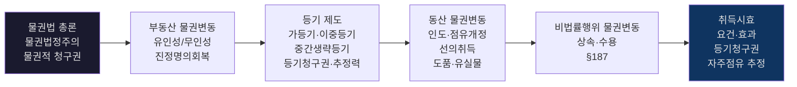

- 의미상 연결: 물권 **총론**(법정주의·청구권) → 부동산 **변동**(법률행위 기반) → **등기**(공시방법) → 동산 **변동**(인도·[[선의취득]]) → **비법률행위**(상속·수용) → **취득시효**(점유 기반 원시취득)

### 📊 민3 기출 반복 패턴 (2010~2020)
- 출처 위치: [《민법의_기초이론_3_전경운_2010~2020_중간고사_문제_p001-022.md》 p.5 | "그 등기를 갑에게서 병으로 바로 하기로 하는 합의를 갑, 을, 병 사이에서"] [《민법의_기초이론_3_전경운_2010~2020_중간고사_문제_p001-022.md》 p.11 | "소유권이전등기 청구권이 시효로 소멸하였다고 항변"] [《민법의_기초이론_3_전경운_2010~2020_중간고사_문제_p001-022.md》 p.17 | "乙을 가등기권리자로 하여 소유권이전 등기청구권의 보전을 목적으로 하는 가등기"]
| 쟁점 | 출제 횟수 (6회) | 빈도 |
|---|:---:|---|
| **등기청구권·소멸시효** | 5/6 | ★★★ |
| **물권적 청구권** | 4/6 | ★★★ |
| **중간생략등기** | 4/6 | ★★★ |
| **유인성/무인성** | 4/6 | ★★★ |
| **선의취득** | 3/6 | ★★ |
| **가등기** | 3/6 | ★★ |
| **재단법인 출연** | 3/6 | ★★ |
| **이중등기** | 2/6 | ★ |
| **취득시효** | 2/6 | ★ |
| **이중의 점유개정** | 2/6 | ★ |

---

## 2. 물권법 총론: 물권법정주의와 물권적 청구권 — ★★★
> 전체 구조: §0.소스범위 > §0-1.읽는순서 > §1.범위지도 > **§2.물권총론** > §3.부동산변동 > §4.가등기 > §5.등기효력 > §6.동산변동 > §7.취득시효 > §8.비법률행위변동 > §9.명인방법 > §10.기타정리 > §11.학설비교 > §11-A.공유침해 > §12.흐름도 > §13.명의신탁IRAC > §14.포섭포인트 > §15.시효IRAC > §16.통행권 > §17.점유반환

### 📊 물권의 객체 — 물건의 의의·특수유형 [교재/전사문 보강]

| 쟁점 | 판례 | 요지 |
|---|---|---|
| **건물의 독립성** | 대판 1970.9.22, **70다1494** | 기둥·지붕·주벽이 갖추어지면 독립한 부동산으로 본다 |
| **집합물 특정** | 대판 1990.12.26, **88다카20224** | 특정 양만장 내의 뱀장어 등 어류 전부에 대한 양도담보는 목적물이 특정되어 유효 |
| **컴퓨터 정보의 물건성** | 대판 2002.7.12, **2002도745** | 컴퓨터에 저장된 정보는 유체물이 아니고 물질성을 가진 동력도 아니므로 재물이 될 수 없다 |
| **유체·유골 귀속** | 대판(전합) 2008.11.20, **2007다27670** → 대판(전합) 2023.5.11, **2018다248626** | 2008년: 제사주재자에게 승계. 2023년 변경: 공동상속인 공유 |
| **종물** | (교재 p.16~17) | 백화점 전화교환설비·볼링장 볼링설비 = 건물의 종물. 주물 처분의 효력은 종물에 미침(§100②) |
| **양도담보 돼지의 새끼** | (전사문 민3_2-1) | 양도담보 목적물인 돼지의 새끼는 천연과실이므로 양도담보의 효력 미치지 않고 설정자에게 귀속 |
| **국립공원 입장료** | (전사문 민3_2-1) | 국립공원 입장료는 토지사용 대가가 아니라 유지관리 부담이므로 법정과실이 아님 |

- 근거 위치: [《전경운_민법_물총_26_p001-030.md》 L240 | "특정 양만장 내의 뱀장어"] [《전경운_민법_물총_26_p001-030.md》 L300 | "컴퓨터에 저장된 정보"] [《전경운_민법_물총_26_p001-030.md》 L487 | "기둥과 지붕 그리고 주벽"] [《전경운_민법_물총_26_p001-030.md》 L328-351 | "유체·유골"]

### 📊 물권법정주의 내용과 한계
| 내용 | 설명 |
|---|---|
| **종류 강제** | 법률에 정한 물권만 인정 |
| **내용 강제** | 법률이 정한 내용만 가능 |
| **근거** | 거래 안전·법적 명확성 |
| **한계** | 관습법상 물권 인정 여부 → 판례: 관습법상 법정지상권, 분묘기지권 인정 |

- 출처 위치: [《민법의_기초이론_3_전경운_주제별_모의답안_p001-012.md》 p.1 | "원심이 원고들에게 관습상의 통행권이 있다고 판단하여 ... 위법"] [《민법의_기초이론_3_전경운_주제별_모의답안_p001-012.md》 p.1 | "소유자가 채권적으로 상대방에 대하여 사용, 수익의 권능을 포기"] [《민법의_기초이론_3_전경운_주제별_모의답안_p001-012.md》 p.1 | "객관적인 사정이 현저히 변경된 경우에는 다시 사용, 수익권을 포함한 완전한 소유권에 기한 권리주장을 할 수 있다"]
- `[판례]` 관습상의 통행권이 있다고 보아 통행권 확인청구를 인용하는 것은 위법하다.
  - 근거 위치: [《민법의_기초이론_3_전경운_주제별_모의답안_p001-012.md》 p.1 | "원심이 원고들에게 관습상의 통행권이 있다고 판단하여 원고들의 통행권 확인 청구를 인용한 것은 위법"]
- `[판례]` 소유자가 채권적으로 상대방에게 배타적 사용·수익권능의 대세적·영구적 포기를 약정하는 것은 물권법정주의에 반하여 허용되지 않는다.
  - 근거 위치: [《민법의_기초이론_3_전경운_주제별_모의답안_p001-012.md》 p.1 | "소유자가 채권적으로 상대방에 대하여 사용, 수익의 권능을 포기하거나 사용, 수익권 행사에 제한을 설정하는 것 외에 소유권의 핵심적 권능에 속하는 배타적인 사용, 수익 권능이 소유자에게 존재하지 아니한다고 하는 것은 물권법정주의에 반하여 허용될 수 없다"] [《민법의_기초이론_3_전경운_주제별_모의답안_p001-012.md》 p.1 | "사용, 수익권을 대세적, 영구적으로 포기하는 것은 법률에 의하지 않고 새로운 물권을 창설하는 것과 다를 바 없어 허용되지 않는다"]
- `[판례]` 다만 기존 이용상태가 유지되는 동안 신의칙상 부당이득반환청구가 제한될 뿐이고, 객관적 사정이 현저히 변경되면 다시 완전한 소유권에 기한 권리주장을 할 수 있다.
  - 근거 위치: [《민법의_기초이론_3_전경운_주제별_모의답안_p001-012.md》 p.1 | "신의칙상 기존의 이용상태가 유지되는 한 부당이득반환을 청구할 수 없는 것일 뿐이고, 사용, 수익권 자체를 대세적, 확정적으로 상실하는 것은 아니다. 따라서 객관적인 사정이 현저히 변경된 경우에는 다시 사용, 수익권을 포함한 완전한 소유권에 기한 권리주장을 할 수 있다"]

### 📊 물권적 청구권 조문 원문 — ★★★

| 조문 | 원문 | 해설 |
|---|---|---|
| **§213 (소유물반환청구권)** | "소유자는 그 소유에 속한 물건을 점유한 자에 대하여 반환을 청구할 수 있다. 그러나 점유자가 그 물건을 점유할 권리가 있는 때에는 반환을 거부할 수 있다." | 물권적 반환청구권의 근거. 점유할 권리(임대차·유치권 등)가 있으면 거부 가능 |
| **§214 (소유물방해제거·방해예방청구권)** | "소유자는 소유권을 방해하는 자에 대하여 방해의 제거를 청구할 수 있고 소유권을 방해할 염려 있는 행위를 하는 자에 대하여 그 예방이나 손해배상의 담보를 청구할 수 있다." | 방해배제·예방의 근거. 점유 침탈이 아닌 방해(담 쌓기, 폐수 유입 등)에 적용 |
| **§205 (점유물반환청구권 준용)** | 점유권에 기한 반환·방해배제·예방청구권 (§204~§206)도 유사 구조 | 점유권 기한 청구권은 1년 제척기간 적용 (§204②) |

- `조문 해설 핵심`: §213은 '점유할 권리' 유무가 반환청구 인용/기각의 분기점. §214는 '방해'와 '방해 염려'를 나누어 제거와 예방을 구분. 물권적 청구권의 3유형은 이 두 조문에서 도출된다.

### 📊 물권적 청구권 3유형 — ★★★
| 유형 | 조문 | 내용 | 상대방 | 비용부담 |
|---|---|---|---|---|
| **반환청구권** | §213 | 목적물 점유 회복 | 부당한 점유자 | 점유자 부담 |
| **방해배제청구권** | §214 전단 | 현존하는 방해 제거 | 방해자 | 학설 대립 |
| **방해예방청구권** | §214 후단 | 장래의 방해 방지 | 방해 우려자 | 학설 대립 |

### 📊 물권적 청구권 특징
| 특징 | 내용 | 비고 |
|---|---|---|
| **소멸시효** | 소유권 기한 X / 제한물권은 논점 | **채권적 청구권과 가장 큰 차이점**. 판례(대판 1982.7.27, **80다2968**; 대판 1993.12.21, **91다41170**): 소유권에 기한 물권적 청구권은 소멸시효에 걸리지 않는다 |
| **발생 근거** | 물권 자체에서 발생하는 청구권 | — |
| **과실 불요** | 상대방의 고의·과실 불요 | — |
| **즉시 행사** | 점유 침탈/방해 시 즉시 행사 가능 | — |

- `[판례요지]` 물권적 청구권은 물권의 효력으로부터 발생하는 권리이므로 물권과 운명을 같이하고, 물권과 분리하여 독립 양도할 수 없다.
  - 근거 위치: [《민법의_기초이론_3_전경운_중간고사_합본_p001-030.md》 L880-L888 | "물권적 청구권이란"] [《민법의_기초이론_3_전경운_중간고사_합본_p001-030.md》 L880-L888 | "판례는 물권적 청구권은 물권의 효력으로부터 발생"] [《민법의_기초이론_3_전경운_중간고사_합본_p001-030.md》 L880-L888 | "물권과 분리하여 물권적 청구권만이 양도될 수 없다"]

### 📊 물권적 청구권 요건·효과 보강
- `요건 정리`: ① 현재의 침해 또는 침해 위험이라는 객관적 사실이 존재할 것, ② 침해가 위법할 것, ③ 상대방에게 정당한 권원이 없을 것. 침해자의 고의·과실은 불요하고, 과거 침해만으로는 물권적 청구권이 인정되지 않는다.
  - 근거 위치: [《민법의_기초이론_3_전경운_중간고사_합본_p001-030.md》 p.2 | "물권의 침해 또는 침해의 위험성은 객관적인 사실로서 존재하면 되고"] [《민법의_기초이론_3_전경운_중간고사_합본_p001-030.md》 p.2 | "침해사실은 현재해야만 한다(과거의 침해에 대한 물권적 청구권은 인정X)"] [《민법의_기초이론_3_전경운_중간고사_합본_p001-030.md》 p.2 | "상대방의 정당한 권원에 의한 경우에는 물권적 청구권이 인정되지 아니한다"]
- `비용부담`: 다수설은 상대방이 목적물 반환·방해제거·예방을 적극적으로 이행하고 비용도 부담한다는 적극적 행위청구권설, 소수설은 권리자가 스스로 제거하고 상대방은 이를 인용한다는 인용청구권설이다. 판례는 명시적으로 정리하지는 않지만 적극적 행위청구권을 전제로 상대방 부담 경향으로 읽힌다.
  - 근거 위치: [《민법의_기초이론_3_전경운_중간고사_합본_p001-030.md》 p.2 | "상대방에 대하여 적극적인 행위를 청구할 수 있고, 비용도 상대방이 부담"] [《민법의_기초이론_3_전경운_중간고사_합본_p001-030.md》 p.2 | "비용은 청구권자가 부담"] [《민법의_기초이론_3_전경운_중간고사_합본_p001-030.md》 p.2 | "그러한 행위에 필요한 비용은 상대방의 부담으로 하게 될 것이다"]
- `[교수님 교재 기준]` 소유권에 기한 물권적 청구권은 판례상 소멸시효에 걸리지 않고, 제한물권에 기한 부분은 `다수설=소멸시효 X / 소수설=소멸시효 O / 판례 직접 판단 없음`으로 정리한다. 따라서 메인노트에서는 제한물권 부분을 `학설대립`으로 적고 단정하지 않는다.
  - 근거 위치: [《전경운_민법_물총_26_p031-060.md》 L234-L247 | "다수설: 소유권으로 인한 물권적 청구권은 물론, 제한물권에 기한 물권적 청구권도 역시 소멸시효에 걸리지 않는다"] [《전경운_민법_물총_26_p031-060.md》 L234-L247 | "소수설: 소유권에 기한 물권적 청구권은 소멸시효에 걸리지 않으나, 소유권 이외의 제한물권에 기한 물권적 청구권은 소멸시효에 걸린다"] [《전경운_민법_물총_26_p031-060.md》 L234-L247 | "판례: 소유권에 기한 물권적 청구권이 소멸시효에 걸리지 않는다는 판결은 있지만"] [《전경운_민법_물총_26_p031-060.md》 L234-L247 | "제한물권에 기한 경우에 관하여는 판결이 없다"]
- `[송영곤 보조기준]` 찌라시처럼 한 줄 결론이 필요한 회독표에서는 송영곤 정리에 따라 `제한물권에 기한 물권적 청구권 소멸시효 O`를 별도 보조메모로만 사용한다.
  - 근거 위치: [《civ_1-02_song_basic_juract_26_p091-120.md》 p.97 | "제한물권에 기한 물권적 청구권 소멸시효0"]
- `물권과의 불가분성`: 물권적 청구권은 물권과 분리해 양도할 수 없으므로, 물권을 양도하면 물권적 청구권도 상실한다. 소송 계속 중 소유권을 양도한 자는 더 이상 방해제거를 청구할 수 없다.
  - 근거 위치: [《민법의_기초이론_3_전경운_중간고사_합본_p001-030.md》 p.3 | "물권적 청구권은 물권과 분리하여 양도될 수 없으므로"] [《민법의_기초이론_3_전경운_중간고사_합본_p001-030.md》 p.3 | "물권을 양도한 사람은 물권적 청구권도 상실한다"]
- `[교수님 교재 보강]` 물권적 청구권의 법적 성질은 `물권에 부종하는 특수한 독립 청구권`이라는 절충설로 정리하는 것이 기본이고, 판례도 `물권의 효력으로부터 발생`하지만 `채권적 청구권은 아니다`는 방향으로 설명된다.
  - 근거 위치: [《전경운_민법_물총_26.pdf》 p.35 | "물권적 청구권은 물권의 효력을 기초로 생기는 특수한 독립된 청구권"] [《전경운_민법_물총_26.pdf》 p.35 | "물권적 청구권은 물권의 효력으로부터 발생"] [《전경운_민법_물총_26.pdf》 p.35 | "채권적 청구권은 아니라"]
- `[교수님 교재 보강]` 교수님 교재도 물권적 청구권은 `언제나 물권과 운명을 같이`하는 물권 의존적 권리라서, 물권과 분리한 양도는 허용되지 않는다고 정리한다.
  - 근거 위치: [《전경운_민법_물총_26.pdf》 p.35 | "물권적 청구권은 물권에 의존하는 권리여서 언제나 물권과 운명을 같이 한다"] [《전경운_민법_물총_26.pdf》 p.35 | "물권과 분리하여 물권적 청구권만이 양도될 수"]
- `[판례]` 인근 소음으로 생활이익이 사회통념상 수인한도를 넘어 침해되면, 건물 소유자 또는 점유자는 소유권 또는 점유권에 기하여 유지청구를 할 수 있다.
  - 근거 위치: [《민법의_기초이론_3_전경운_중간고사_합본_p001-030.md》 p.3 | "정온하고 쾌적한 일상생활을 영유할 수 있는 생활이익이 침해되고"] [《민법의_기초이론_3_전경운_중간고사_합본_p001-030.md》 p.3 | "소음 피해의 제거나 예방을 위한 유지청구를 할 수 있다"]
- `[판례]` 학교 교사 철거청구는 권리남용이 될 수 있지만, 상수도관 철거청구는 공익사업이라는 사정만으로 곧바로 권리남용이 되지는 않는다.
  - 근거 위치: [《민법의_기초이론_3_전경운_중간고사_합본_p001-030.md》 p.3 | "권리남용에 해당한다"] [《민법의_기초이론_3_전경운_중간고사_합본_p001-030.md》 p.3 | "권리남용에 해당한다고 할 수 없다"]
- `[판례]` 매수인이 아직 등기를 마치지 않았더라도 매매계약의 이행으로 토지를 인도받아 점유·사용할 권리를 취득했고, 그로부터 다시 매수한 자도 그 지위를 승계하므로 매도인은 그 전득자에게 소유권에 기한 물권적 청구권을 행사할 수 없다.
  - 근거 위치: [《민법의_기초이론_3_전경운_중간고사_합본_p001-030.md》 p.3 | "이를 점유·사용할 권리가 생기게 된 것으로 보아야"] [《민법의_기초이론_3_전경운_중간고사_합본_p001-030.md》 p.3 | "매도인은 매수인으로부터 다시 위 토지를 매수한 자에 대하여 토지 소유권에 기한 물권적 청구권을 행사할 수 없다"]
- `[판례]` 소유자가 그 후 소유권을 상실하면 물권적 청구권의 기반이 없어지므로, 그 실현불능을 이유로 민법 제390조의 전보배상을 청구할 수 없다.
  - 근거 위치: [《민법의_기초이론_3_전경운_중간고사_합본_p001-030.md》 p.4 | "민법 제390조상의 손해배상청구권을 가진다고 말할 수 없다"] [《민법의_기초이론_3_전경운_중간고사_합본_p001-030.md》 p.4 | "그 발생의 기반이 아예 없게 되어 더 이상 그 존재 자체가 인정되지 아니하는 것이다"]
- `[송영곤 쟁점노트]` 토지 위에 지상권이나 담보지상권이 설정되어 있어도 소유권 자체가 소멸하는 것은 아니므로, 소유자는 불법점유자를 상대로 여전히 방해배제청구를 할 수 있다.
  - 근거 위치: [《민사법쟁점노트_재산법_26_p601-616.md》 p.603 | "소유권은 그 토지에 대한 지상권설정이 있어도"] [《민사법쟁점노트_재산법_26_p601-616.md》 p.603 | "불법으로 점유하는 자에게 대하여 방해배제를 구할 수 있는 물권적 청구권"]

#### 📊 물권적 청구권 판례 쟁점별 정리
| 쟁점 | 판례번호 | 핵심 판례 요지 | 관련 특성 |
|---|---|---|---|
| **불가분성** | — | 소유물반환청구는 공유지분에 기한 것도 가능하되, 전부반환은 공유자 전원이 행사 | 물권의 불가분성 |
| **소음·유지청구** | **2004다37904** | 인근 소음으로 생활이익이 수인한도를 넘어 침해되면 유지청구 가능 | 방해배제+방해예방 |
| **권리남용 긍정** | **93다4366** | 대지 침범면적 0.3%, 철거에 상당한 비용 → 건물 철거청구는 권리남용 | 권리남용 인정 |
| **권리남용 부정** | **2003다40422** | 공익사업(상수도관) 사정만으로 곧바로 철거청구가 권리남용이 되지는 않음 | 권리남용 부정 |
| **송전탑 권리남용** | (전사문 민3_3-1) | 송전탑·송전선 설치 후 토지를 취득하여 철거+고액 요구 = 권리남용 | 악의 취득 + 권리남용 |
| **퇴거청구 불가** | 대판(전합) **2010다28604** | 토지 소유자가 건물 점유자에게 직접 퇴거를 구할 수 없다 | 철거+대지인도만 가능 |
| **미등기매수인** | — | 소유권 미취득 → 직접 물권적 청구 불가, 채권자대위로만 가능 | 소유권 기반 요건 |
| **소유권 상실 후** | **68다725** | 물건의 소유권 상실시 물권적 반환청구 불가. §390 전보배상도 불가 | 물권에 수반 |
| **방해예방 비용** | **2014다52612** | 상대방이 방해예방에 필요한 시설을 할 '권리'까지 있는 것은 아님 | 비용부담 한계 |
| **비용부담** | — | 방해배제 비용은 원칙적으로 방해자 부담(다수설=적극적 행위청구권설) | 비용 귀속 |

### 📊 물권적 청구권 비용부담 학설 [기출 모답 보강]

| 학설 | 내용 | 지위 |
|---|---|---|
| **적극적 행위청구권설** | 상대방이 목적물 반환·방해제거·예방을 적극적으로 이행, 비용도 상대방 부담 | **다수설** |
| **인용청구권설** | 권리자가 스스로 제거하고 상대방은 이를 인용, 비용은 청구권자 부담 | 소수설 |
| **소유자책임설** | 소유자가 비용부담, 상대방은 인용만 | 소수설 |
| **책임설** | 귀책사유 있는 자가 비용부담 | 소수설 |
| **절충설** | 사안별로 적극적 행위/인용을 구분 | 학설 |

- 근거 위치: [《민법의_기초이론_3_전경운_중간고사_합본_p001-030.md》 p.2 | "상대방에 대하여 적극적인 행위를 청구할 수 있고, 비용도 상대방이 부담"] [《민법의_기초이론_3_전경운_중간고사_합본_p001-030.md》 p.2 | "비용은 청구권자가 부담"]

### ✍️ 물권적 청구권 이행불능 → 전보배상 부정 IRAC [기출 모답 보강]

> **[쟁점]** 물권적 청구권이 이행불능이 된 경우, 권리자가 §390에 의한 전보배상을 청구할 수 있는가?
>
> **[판례]** 판례는 "소유자가 그 후 소유권을 상실하면 물권적 청구권의 기반이 없어지므로, 그 실현불능을 이유로 민법 제390조의 전보배상을 청구할 수 없다"고 한다. 물권적 청구권은 채권적 청구권이 아니어서 §390(채무불이행으로 인한 손해배상)이 직접 적용되지 않기 때문이다.
>
> **[결론]** 따라서 물권적 청구권이 이행불능이 된 경우 §390의 전보배상은 인정되지 않고, 별도로 불법행위(§750)에 의한 손해배상이나 [[부당이득]](§741) 반환이 검토대상이 된다.

- 근거 위치: [《민법의_기초이론_3_전경운_중간고사_합본_p001-030.md》 p.4 | "민법 제390조상의 손해배상청구권을 가진다고 말할 수 없다"]

#### ✍️ 물권적 청구권 모답형 (조문·판례 구조)

> **[조문]** §213(소유물반환청구권), §214(소유물방해제거·방해예방청구권)에 의하면, 소유자는 그 소유에 속한 물건을 점유한 자에 대하여 반환을 청구할 수 있고, 소유권을 방해하는 자에 대하여 방해의 제거를 청구할 수 있다. 이때 "물권의 침해 또는 침해의 위험성은 객관적인 사실로서 존재하면 되고" 침해자의 고의·과실은 요건이 아니다.
>
> **[판례]** 판례는 "상대방의 정당한 권원에 의한 경우에는 물권적 청구권이 인정되지 아니한다"고 하며, "물권적 청구권은 물권의 효력을 기초로 생기는 특수한 독립된 청구권"이므로 "물권과 분리하여 물권적 청구권만이 양도될 수" 없다고 본다.
>
> **[포섭·결론]** 따라서 본 사안에서는 ① 현재의 점유침탈 또는 방해·방해위험이 객관적으로 존재하는지, ② 상대방에게 정당한 권원이 없는지를 순서대로 검토하여 반환·방해배제·방해예방청구 가부를 판단한다. 비용부담은 다수설상 상대방 부담으로 정리하되, 제한물권의 소멸시효 문제는 학설대립으로만 적는 것이 안전하다.

- 근거 위치: [《민법의_기초이론_3_전경운_중간고사_합본_p001-030.md》 p.2 | "물권의 침해 또는 침해의 위험성은 객관적인 사실로서 존재하면 되고"] [《민법의_기초이론_3_전경운_중간고사_합본_p001-030.md》 p.2 | "상대방의 정당한 권원에 의한 경우에는 물권적 청구권이 인정되지 아니한다"] [《전경운_민법_물총_26.pdf》 p.35 | "물권적 청구권은 물권의 효력을 기초로 생기는 특수한 독립된 청구권"] [《전경운_민법_물총_26.pdf》 p.35 | "물권과 분리하여 물권적 청구권만이 양도될 수"]

### 📊 불법원인급여(§746)와 물권적 청구권 관계
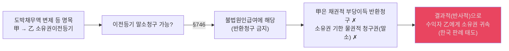

### 📊 미등기 무허가건물 양수인의 지위 (물권법정주의 판례)
| 권리 주장 | 인정 여부 | 이유 (판례) |
|---|---|---|
| **소유권 취득** | **✗** | 법률행위에 의한 물권변동이므로 등기 필요 (§186) |
| **소유권에 준하는 관습상 물권** | **✗** | 물권법정주의(§185) 위반 (새로운 형태의 물권 창설 금지) |
| **관습상 법정지상권** | **✗** | 대지와 건물이 동일인 소유여야 하나, 양수인은 소유자가 아님 |
| **직접 물권적 방해배제청구** | **✗** | 소유자가 아니므로 (양도인을 **대위**하여 행사만 가능) |

#### 📊 미등기 무허가건물 양수인의 법적 지위 심화
| 쟁점 | 결론 | 근거 |
|---|---|---|
| **점유권 인정** | O — 사실적 지배로 점유자 지위 인정, 점유보호청구권(§204~§206) 행사 가능 | 점유는 사실상태이므로 소유권 유무와 무관 |
| **피고적격 (건물철거·토지인도)** | O — 건물 점유자로서 대지소유자의 토지인도청구의 피고적격 있음 | 건물 소유자가 아니더라도 점유자이면 피고적격 인정 |
| **부당이득반환 (토지 사용이익)** | O — 법률상 원인 없는 점유로 대지소유자에게 차임 상당 부당이득 반환의무 | 대법원 판례: 무허가건물 양수인도 토지 점유 사용에 대해 부당이득반환의무 |
| **물권적 청구권 행사** | X — 소유권 미취득으로 직접 행사 불가, 채권자대위권으로만 가능 | 기존 표(L164~L170)와 동일 |

---

## 3. 부동산 물권변동: 유인성·무인성 — ★★★
> 전체 구조: §0.소스범위 > §0-1.읽는순서 > §1.범위지도 > §2.물권총론 > **§3.부동산변동** > §4.가등기 > §5.등기효력 > §6.동산변동 > §7.취득시효 > §8.비법률행위변동 > §9.명인방법 > §10.기타정리 > §11.학설비교 > §11-A.공유침해 > §12.흐름도 > §13.명의신탁IRAC > §14.포섭포인트 > §15.시효IRAC > §16.통행권 > §17.점유반환

### 📊 물권행위의 독자성·무인성 학설 비교
| | 독자성 | 무인성 | 채권행위 무효 시 | 지위 |
|---|---|---|---|---|
| **독자성·무인성 인정설** | ○ | ○ | 물권행위 유효 → 부당이득반환 | 독일법계 |
| **독자성만 인정설** | ○ | ✗ | 물권행위도 무효 → 소유권 복귀 | 소수 |
| **유인설 (판례·다수설)** | ✗ | ✗ | 물권행위도 무효 → 소유권 복귀 | **한국 판례** |

- `[판례] 독자성·[[무인성]] 부정 문구`: "우리 민법은 물권행위의 독자성과 무인성을 인정하지 아니하므로, 매매계약이 무효이거나 취소된 때에는 그에 터잡은 소유권이전등기도 원인무효의 등기가 되어 말소되어야 한다" (대법원 [[77다1872]] 등 다수).
- `[판례] 채권행위 해제 시`: "매매계약이 적법하게 해제된 경우에는 그 계약의 이행으로 변동이 생겼던 물권은 당연히 그 계약이 없었던 원상태로 복귀한다" (대법원 [[77다1241]] 등). 이것이 유인설의 실전적 귀결이다.
- `핵심`: 한국 판례는 물권행위의 독자성·무인성을 **모두 부정**하므로, 채권행위가 무효·취소·해제되면 물권변동도 효력을 잃는다. 따라서 원소유자는 말소등기청구 또는 진정명의회복등기청구로 소유권을 회복할 수 있고, 독일법처럼 부당이득반환만 청구할 수 있는 것이 아니다.

### 📊 유인성의 실전적 의미
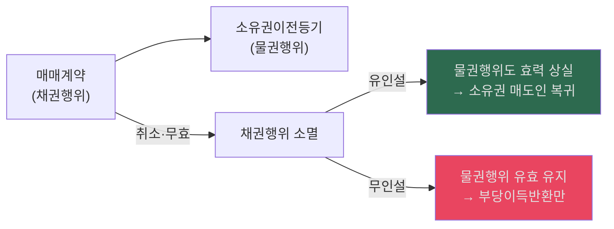

### 📊 진정명의회복 등기
| 항목 | 내용 |
|---|---|
| **의의** | 말소등기에 갈음하여 진정한 소유자 명의로 이전등기 |
| **요건** | ① 원고가 진정한 소유자일 것, ② 피고 명의의 등기가 경료되어 있을 것, ③ 피고 등기의 원인이 무효일 것 |
| **적용 한계** | 중간에 제3자 권리가 없을 것 |
| **판례** | 중간 전전 양수인이 있으면 직접 진정명의회복 불가 |

- `[판례요지]` 진정명의회복을 위한 소유권이전등기청구는 현재의 등기명의인을 상대로 하는 물권적 구제수단이다.
  - 근거 위치: [《민법의_기초이론_3_전경운_중간고사_합본_p001-030.md》 L189-L189 | "진정한 등기명의의 회복을 위한 소유권이전등기청구는 현재의 등기명의인을 상대로 하여야"]

#### ✍️ 유인성·무인성 모답형 (조문·판례 구조)

> **[조문]** §186(부동산물권변동)에 의하면 "부동산에 관한 법률행위로 인한 물권의 득실변경은 등기하여야 그 효력이 생긴다." 물권행위의 유인성이란 물권행위의 효력이 그 원인인 채권행위의 부존재·무효·취소·해제 등에 의해 영향을 받는다는 것이고, 무인성은 원인에 영향받지 않는다는 것이다.
>
> **[판례]** 판례([[75다1394]])는 "우리 법제가 물권행위의 독자성과 무인성을 인정하고 있지 않다는 점과 민법 제548조 제1항 단서가 거래의 안전을 위한 특별규정이라는 점을 생각할 때 계약이 해제되면 그 계약의 이행으로 변동이 생겼던 물권은 당연히 그 계약이 없었던 상태로 복귀한다"고 판시하였다. 다수설·판례에 의하면 원인행위 실효 시 §187이 적용되어 등기 없이 물권이 당연 복귀한다.
>
> **[포섭·결론]** 따라서 채권행위가 무효·취소·해제된 경우 원소유자는 말소등기청구 또는 진정명의회복등기청구로 소유권을 회복하며, 독일법처럼 부당이득반환만 청구할 수 있는 것이 아니다.

- 근거 위치: [《전경운_민법_물총_26_p031-060.md》 pp.54-56 | "물권행위의 [[유인성]]·[[무인성]]"] [《전경운_민법_물총_26_p061-090.md》 p.69 | "원인행위의 실효는 물권행위의 실효를 초래하고 말소등기를 요하지 않고 물권은 당연히 복귀한다"]

---

## 4. 가등기·이중등기·중간생략등기 — ★★★
> 전체 구조: §0.소스범위 > §0-1.읽는순서 > §1.범위지도 > §2.물권총론 > §3.부동산변동 > **§4.가등기** > §5.등기효력 > §6.동산변동 > §7.취득시효 > §8.비법률행위변동 > §9.명인방법 > §10.기타정리 > §11.학설비교 > §11-A.공유침해 > §12.흐름도 > §13.명의신탁IRAC > §14.포섭포인트 > §15.시효IRAC > §16.통행권 > §17.점유반환

### 📊 부동산 등기 3대 쟁점 비교표 — ★★★
- 출처 위치: [《민법의_기초이론_3_전경운_주제별_모의답안_p001-012.md》 p.5 | "청구권보전의 가등기"] [《민법의_기초이론_3_전경운_주제별_모의답안_p001-012.md》 p.6 | "이중등기"] [《민법의_기초이론_3_전경운_주제별_모의답안_p001-012.md》 p.7 | "판례는 3자의 합의가 있는 경우에 이를 인정한다"]
| 쟁점 | 핵심 | 효과 | 판례 |
|---|---|---|---|
| **가등기** | 청구권보전 목적 | 본등기 시 가등기 순위로 소급 | 가등기 자체로 청구권 존재 추정력 X. 가등기상 권리 양도 가능(부기등기 형식, **98다24105**) |
| **이중등기** | 동일 부동산에 중복등기 | 선등기 원칙 유효, 후등기 원칙 무효 | 대판(전합) **87다카2961·87다453**: 선등기 원인무효 아닌 한 후등기 무효 |
| **중간생략등기** | A→B→C에서 A→C 직접 | **3자 합의** 있으면 유효 (판례) | 합의 없으면 무효. 부특법 위반은 사법상 유효(**92다39112**), 허가구역은 확정적 무효(**96다22464**) |

- `[판례]` 가등기 자체로는 청구권이 존재한다는 추정력이 인정되지 않는다.
  - 근거 위치: [《민법의_기초이론_3_전경운_중간고사_합본_p001-030.md》 p.10 | "판례는 가등기는 청구권이 존재한다는 추정력을 가지지 않는다고 판시하여 가등기 자체의 효력을 부정한다"]
- `[판례]` 가등기상의 권리를 양도한 경우에는 양도인과 양수인의 공동신청으로 그 권리의 이전등기를 가등기에 대한 부기등기 형식으로 경료할 수 있다.
  - 근거 위치: [《민법의_기초이론_3_전경운_주제별_모의답안_p001-012.md》 p.5 | "가등기는 원래 순위를 확보하는 데에 그 목적이 있으나, 순위 보전의 대상이 되는 물권변동의 청구권은 그 성질상 양도 될 수 있는 재산권일 뿐만 아니라 가등기로 이하여 그 권리가 공시되어 결과적으로 공시방법까지 마련된 셈이므로, 이를 양도한 경우에는 양도인과 양수인의 공동신청으로 그 가등기상의 권리의 이전등기를 가등기에 대한 부기등기의 형식으로 경료할 수 있다"]
- `[판례]` 가등기에 기한 본등기절차의 이행을 금지하는 취지의 가처분은 등기사항이 아니어서 허용되지 않는다.
  - 근거 위치: [《민법의_기초이론_3_전경운_주제별_모의답안_p001-012.md》 p.5 | "가등기에 기한 본등기절차의 이행을 금지하는 취지의 가처분은 등기사항이 아니어서 허용되지 아니한다"]
- `[판례]` 중간생략등기는 3자의 합의가 있으면 적극적 이행청구까지 인정된다.
  - 근거 위치: [《민법의_기초이론_3_전경운_중간고사_합본_p001-030.md》 p.18 | "최초양수인, 중간취득자, 최후 양수인 3자의 합의가 있으면 유효"] [《민법의_기초이론_3_전경운_중간고사_합본_p001-030.md》 p.18 | "판례는 3자의 합의가 있는 경우에 적극적 중간생략등기이행청구권을 인정하고 있다"]
- `[원교재 보강]` 원PDF는 가등기 자체의 효력에 대해 `순위보전적 효력만` 인정하고, 본등기 전에는 `청구권 존재 추정력`도 없다고 정리한다. 따라서 가등기만으로 제3자 등기의 말소를 청구할 수는 없다는 점까지 같이 잡아 두는 편이 안전하다.
  - 근거 위치: [《전경운_민법_물총_26.pdf》 p.104 | "가등기 자체로서는 아무런 효력이 생기지 않는다"] [《전경운_민법_물총_26.pdf》 p.104 | "가등기는 청구권이 존재한다는 추정 력을 가지지 않는다"] [《전경운_민법_물총_26.pdf》 p.104 | "가등기만으로는 아무런 실체법상 효력을 갖지 아니하고"]

### 📊 중복등기 요건·판례 보강
- `문제 구조`: 중복등기는 동일 부동산에 복수의 등기기록이 중복 존재할 때 어느 등기를 유효로 볼지의 문제이고, 전형적으로는 동일 부동산에 `이중으로 소유권보존등기`가 된 경우를 가리킨다.
  - 근거 위치: [《civ_1-09_song_propertychg_basic_26_p061-090.md》 p.63 | "동일부동산에 관하여 복수의 등기기록이 중복하여 존재하는 경우"] [《civ_1-09_song_propertychg_basic_26_p061-090.md》 p.63 | "중복등기 문제는 동일부동산에 '이중으로 소유권보존등기가 행하여진 경우'에 발생한다"]
- `학설 축`: 소스상 학설은 `절차법설`, `실체법설`, `절충설`로 정리되고, 송영곤 정리도 1부동산 1등기용지주의를 형식적 유효요건으로 보는지 여부를 핵심 축으로 잡는다.
  - 근거 위치: [《민법의_기초이론_3_전경운_중간고사_합본_p001-030.md》 p.6 | "절차법설"] [《민법의_기초이론_3_전경운_중간고사_합본_p001-030.md》 p.6 | "실체법설"] [《민법의_기초이론_3_전경운_중간고사_합본_p001-030.md》 p.6 | "절충설"]
- `[판례]` 선행 보존등기가 원인무효가 아닌 한, 후행 보존등기는 실체관계에 부합하더라도 무효다.
  - 근거 위치: [《민법의_기초이론_3_전경운_중간고사_합본_p001-030.md》 p.7 | "먼저 이루어진 소유권보존등기가 원인무효가 되지 않는 한, 뒤에 이루어진 소유권보존등기는 그 부동산의 매수인에 의하여 행해진 경우라도 무효"]
- `[송영곤 기준]` 하나의 보존등기 이후 소유권이전등기나 지분이전등기 과정에서 중복이 생긴 경우에도, 선순위등기가 원인무효이거나 직권말소될 경우가 아니면 후순위등기는 무효다.
  - 근거 위치: [《civ_1-09_song_propertychg_basic_26_p061-090.md》 p.63 | "'동일부동산에 하나의 소유권보존등기가 경료된 이후 소유권(지분)이전등기 과정에서 중복등기 발생한 경우'"] [《civ_1-09_song_propertychg_basic_26_p061-090.md》 p.63 | "후순위등기는 실체적, 권리관계에 부합하는지에 관계없이 무효"]
- `[판례]` 무효가 된 후등기나 그에 터잡은 이전등기를 근거로는 `[[등기부취득시효]]` 완성을 주장할 수 없다.
  - 근거 위치: [《민법의_기초이론_3_전경운_중간고사_합본_p001-030.md》 p.8 | "뒤에 된 소유권 보존등기나 이에 터잡은 소유권이전등기를 근거로 하여서는 등기부취득시효의 완성을 주장할 수 없다"]
- `[판례]` 후행등기 명의인이 20년 점유로 점유취득시효를 완성했더라도, 그 사정만으로 후행 보존등기나 그에 기한 이전등기가 유효로 전환되지는 않는다.
  - 근거 위치: [《civ_1-09_song_propertychg_basic_26_p061-090.md》 p.65 | "점유취득시효가 완성되었더라도"] [《civ_1-09_song_propertychg_basic_26_p061-090.md》 p.65 | "유효로 될 수 없고"]
- `[송영곤 기준]` 다만 후행등기 명의인은 후행등기의 존속을 주장하는 방식이 아니라, 별도로 `[[점유취득시효]] 완성`을 원인으로 선행등기명의인에게 이전등기를 청구하는 방식은 가능하다.
  - 근거 위치: [《civ_1-09_song_propertychg_basic_26_p061-090.md》 p.65 | "'[[점유취득시효]] 완성을 원인으로 하여 소유권이전등기를 청구'하는 것은 가능하다"]
- `[판례]` 계약에 기해 부동산에 대한 전면적인 지배를 양수인에게 취득하게 한 이상, 등기의무자의 신청에 의하지 않은 하자가 있어도 그 등기가 실체관계에 부합하면 유효하다.
  - 근거 위치: [《민법의_기초이론_3_전경운_주제별_모의답안_p001-012.md》 p.6 | "계약에 기해 부동산에 대한 전면적인 지배를 양수인에게 취득케 한 이상 양수인 명의의 등기는 등기의무자의 신청에 의하지 아니한 하자가 있다고 해도 실체관계에 부합되는 등기로서 유효하다"]

### 📊 중간생략등기 판단 플로우
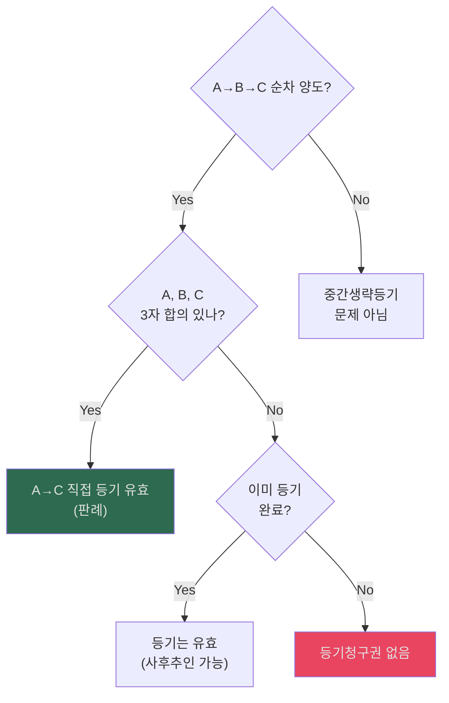

- `요건 정리`: 순차 양도가 있고, 최종 양수인이 최초 양도인에게 직접 등기청구를 하려면 관계 당사자 전원의 의사합치, 즉 `3자 합의`가 있어야 한다.
  - 근거 위치: [《민법의_기초이론_3_전경운_중간고사_합본_p031-060.md》 L409-410 | "판례는 3자간의 합의가 있는 경우에 최종 양수인이 직접 적극적으로 중간생략등기를 청구할 수 있다고 본다"] [《민법의_기초이론_3_전경운_중간고사_합본_p031-060.md》 L431-433 | "관계 당사자 전원의 의사합치"]
- `주요 판례문구`: "부동산의 양도계약이 순차 이루어져 최종 양수인이 중간생략등기의 합의를 이유로 최초 양도인에게 직접 그 소유권이전등기 청구권을 행사하기 위하여는 관계 당사자 전원의 의사합치"
  - 근거 위치: [《민법의_기초이론_3_전경운_중간고사_합본_p031-060.md》 L431-433 | "부동산의 양도계약이 순차 이루어져 최종 양수인이 중간생략등기의 합의를 이유로 최초 양도인에게 직접 그 소유권이전등기 청구권을 행사하기 위하여는 관계 당사자 전원의 의사합치"]
- `보충 판례문구`: "합의가 없다고 할지라도 이미 적법한 중간생략등기가 성립하여 있는 경우에는 유효라고 본다"
  - 근거 위치: [《민법의_기초이론_3_전경운_중간고사_합본_p031-060.md》 L399-400 | "합의가 없다고 할지라도 이미 적법한 중간생략등기가 성립하여 있는 경우에는 유효라고 본다"]

### 📊 [심화] 중간생략등기 특수 사례 (허가구역 및 부등특법)
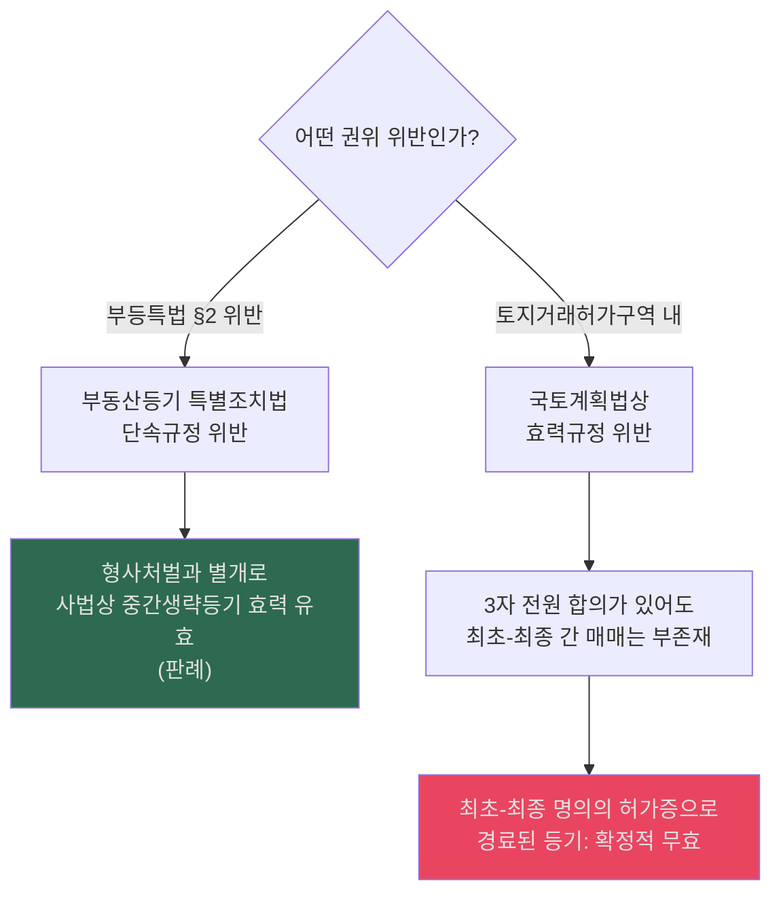

#### 📊 부특법 vs 국토법 — 왜 결론이 다른가?

| 구분 | 부등특법 §2 위반 | 국토계획법 (토지거래허가구역) 위반 |
|---|---|---|
| **법규 성격** | **단속규정** | **효력규정** |
| **단속/효력 구별** | 위반 시 형사처벌 대상이지만, 사법상 법률행위의 효력까지 부정하지는 않음 | 위반 시 사법상 법률행위 자체가 **무효** |
| **이유** | 부등특법은 등기의 **신속·정확한 이행**을 촉진하기 위한 행정목적 규정이므로, 등기 지연·우회 자체를 처벌하되 사법관계까지 뒤집지는 않음 | 국토법상 토지거래허가는 **투기 방지·국토 이용의 공적 통제**라는 강행적 공익 목적이므로, 허가 없는 거래는 사법상으로도 효력이 발생하지 않음 |
| **중간생략등기 효과** | 사법상 **유효** (형사 처벌만) | A-C 간 직접 매매가 부존재하므로 등기 **확정적 무효** |
| **암기** | 단속 = 처벌O, 효력O | 효력 = 처벌O, 효력X |

- `핵심 구별`: 법규 위반이 사법상 효력에 영향을 미치는지는 그 법규가 **단속규정**인지 **효력규정**인지에 따라 결정된다. 부특법은 단속규정이라 사법상 유효, 국토법은 효력규정이라 사법상 무효.
- `[원교재 보강]` 부특법 위반의 효과: "부동산실권리자명의등기에관한법률은 단속법규에 불과하므로, 이에 위반한 명의신탁약정이 무효라 하더라도 그에 기한 물권변동 자체가 무효로 되지는 않는다"는 판례 법리에 따라, 부특법 위반 = 명의신탁약정 무효 + 물권변동 원칙 유효(다만 §4 예외).  반면 국토계획법상 토지거래허가 없는 매매계약은 "확정적 무효"로서 물권변동 자체가 불발한다.
  - 근거 위치: [《전경운 교재 해당 단원》 | "부특법은 단속규정" / "국토법은 효력규정"] (교재 확인 필요)

### 📊 가등기의 순위보전 효력
| 순서 | 일자 | 등기 내용 | 순위 |
|:---:|:---:|---|---|
| ① | 3/1 | 甲 **가등기** | 1순위 |
| ② | 3/15 | 乙 **본등기** | 2순위 |
| ③ | 4/1 | 甲 가등기→**본등기** 전환 | **甲 본등기 순위 = 3/1 (가등기 순위로 소급)** → 乙은 순위에서 밀림 |

#### ✍️ 3대 등기쟁점 모답형 (조문·판례 구조)

> **[조문]** §186에 의하면 부동산물권변동은 등기하여야 효력이 생기고, 가등기(부동산등기법)는 청구권보전을 위한 순위보전등기로서 본등기 시 가등기 순위로 소급한다.
>
> **[판례]** 판례는 "가등기는 청구권이 존재한다는 추정력을 가지지 않는다"고 하여, 가등기만으로 실체권을 주장할 수 없다고 본다. 중복등기에 관하여는 "먼저 이루어진 소유권보존등기가 원인무효가 되지 않는 한" 후행 보존등기는 실체관계에 부합해도 무효이다. 중간생략등기에 관하여는 "판례는 3자간의 합의가 있는 경우에 최종 양수인이 직접 적극적으로 중간생략등기를 청구할 수 있다고 본다"고 하고, "합의가 없다고 할지라도 이미 적법한 중간생략등기가 성립하여 있는 경우에는 유효"라고 한다.
>
> **[포섭·결론]** 따라서 가등기·중복등기·[[중간생략등기]] 사안에서는, ① 가등기는 순위보전 효력만 있고 추정력이 없다는 점, ② 중복등기는 선행등기 유효 시 후행등기가 무효라는 점, ③ 중간생략등기는 3자 합의 유무를 기준으로 유효성을 판단한다는 점을 순서대로 검토한다.

- 근거 위치: [《전경운_민법_물총_26.pdf》 p.104 | "가등기는 청구권이 존재한다는 추정 력을 가지지 않는다"] [《민법의_기초이론_3_전경운_중간고사_합본_p001-030.md》 p.7 | "먼저 이루어진 소유권보존등기가 원인무효가 되지 않는 한"] [《민법의_기초이론_3_전경운_중간고사_합본_p031-060.md》 L409-410 | "판례는 3자간의 합의가 있는 경우에 최종 양수인이 직접 적극적으로 중간생략등기를 청구할 수 있다고 본다"] [《민법의_기초이론_3_전경운_중간고사_합본_p031-060.md》 L399-400 | "합의가 없다고 할지라도 이미 적법한 중간생략등기가 성립하여 있는 경우에는 유효"]

---

## 5. 등기의 효력·등기청구권·무효등기 유용·등기의 추정력 — ★★★
> 전체 구조: §0.소스범위 > §0-1.읽는순서 > §1.범위지도 > §2.물권총론 > §3.부동산변동 > §4.가등기 > **§5.등기효력** > §6.동산변동 > §7.취득시효 > §8.비법률행위변동 > §9.명인방법 > §10.기타정리 > §11.학설비교 > §11-A.공유침해 > §12.흐름도 > §13.명의신탁IRAC > §14.포섭포인트 > §15.시효IRAC > §16.통행권 > §17.점유반환

### 📊 등기의 효력 체계 — ★★★ (효력 먼저, 추정력 나중)

| 효력 | 내용 | 조문 | 핵심 |
|---|---|---|---|
| **① 권리변동적 효력 (성립요건)** | 법률행위에 의한 물권변동은 등기해야 효력 발생 | §186 | 미등기 = 물권변동 미발생. 한국법 핵심 원칙 |
| **② 권리추정적 효력 (추정력)** | 등기가 있으면 실체관계와 부합하는 것으로 추정 | (판례) | 등기명의인 = 적법한 권리자로 추정. 반증으로 번복 가능 |
| **③ 순위확정적 효력** | 같은 부동산에 수개의 등기가 있으면 접수순서에 따라 순위 결정 | §370, 등기법 §4 | 선순위 등기가 우선. 가등기의 순위보전 효력도 여기서 파생 |
| **④ 형식적 확정력** | 등기관이 등기를 수리하면 실질적 심사 없이 등기부에 기재 | 등기법 §29 | 등기관은 형식적 심사권만 가짐 → 실체와 불일치 가능 |

> **§186 (부동산물권변동의 효력)**: "부동산에 관한 법률행위로 인한 물권의 득실변경은 등기하여야 그 효력이 생긴다."
> **§187 (등기를 요하지 아니하는 부동산물권취득)**: "상속, 공용징수, 판결, 경매 기타 법률의 규정에 의한 부동산에 관한 물권의 취득은 등기를 요하지 아니한다. 그러나 등기를 하지 아니하면 이를 처분하지 못한다."

- `§186 해설 — 등기요건주의`: 법률행위에 의한 부동산물권변동은 등기해야 효력 발생. 이는 의사주의(프랑스)와 대비되는 형식주의이다. 물권적 합의([[물권행위]])만으로는 부족하고, 등기라는 형식을 갖춰야 비로소 물권변동이 완성된다.
- `§187 해설`:
  - **본문**: 등기 없이도 물권취득이 가능한 경우 — 상속·공용징수·판결·경매·법률규정에 의한 취득.
  - **단서 "처분하지 못한다"**: 등기 없이 취득한 물권이라도 이를 다시 처분하려면 등기가 필요하다. 여기서 '처분'은 물권적 처분행위(이전·설정·소멸)에 한정되며, 채권행위(매매계약 체결 등)는 등기 없이도 유효하다.
- `효력 vs 추정력 구별`: §186의 성립요건적 효력(등기 없으면 물권변동 자체가 불발생)과 추정력(등기가 있으면 적법한 것으로 추정)은 다른 개념이다. 효력은 등기의 **존부** 문제이고, 추정력은 등기가 존재할 때의 **증명 효과** 문제이다.
- `§187과의 관계`: 법률 규정에 의한 취득(상속·수용·판결)은 등기 없이도 물권 취득 → 단, 처분하려면 등기 필요.

---

### 📊 등기청구권 유형별 정리표 — ★★★
| 유형 | 근거 | 소멸시효 | 특징 |
|---|---|---|---|
| **채권적 등기청구권** | 매매계약 등 채권관계 | ✅ **적용** (10년) | 채권이 소멸하면 등기청구권도 소멸 |
| **물권적 등기청구권** | 물권 자체 | ✗ 미적용 | 물권이 존속하는 한 소멸 X |
| **법률규정에 의한** | §187 등 | — | 상속·수용 등 |

- `[개념요지]` 등기청구권은 등기권리자가 등기의무자에 대하여 등기에 협력할 것을 청구할 수 있는 실체법상의 권리다.
  - 근거 위치: [《전경운_민법_물총_26_p091-120.md》 L129-L132 | "등기청구권이란 등기권리자가 등기의무자에 대하여 등기에 협력할 것을 청구할 수 있는 실체법상의 권리"]
- `[원교재 보강]` 등기청구권은 원칙적으로 등기권리자의 권리지만, 자기 명의 등기로 인해 과세 등 불이익을 받는 등기의무자도 예외적으로 `등기 인수청구권`을 행사할 수 있다.
  - 근거 위치: [《전경운_민법_물총_26_p091-120.md》 L133-L138 | "등기의무자도 등기권리자에 대하여 등기청구권을 행사"] [《전경운_민법_물총_26_p091-120.md》 L136-L138 | "등기 인수청구권"]

### 📊 [심화] 등기청구권 양도성 및 소멸시효 (학설/판례)
- 출처 위치: [《전경운_민법_물총_26.pdf》 p.94-97] [《전경운_민법_물총_26_p091-120.md》 p.94 | "등기청구권이란 등기권리자가 등기의무자에 대하여 등기에 협력할 것을 청구할 수 있는 실체법상의 권리"] [《전경운_민법_물총_26_p091-120.md》 p.95-96 | "등기청구권은 채권행위에서 발생하고, 그 법적 성질은 채권적 청구권"] [《전경운_민법_물총_26_p091-120.md》 p.95-96 | "그 이행과정에 신뢰관계가 따르므로"] [《전경운_민법_물총_26_p091-120.md》 p.97 | "매수인이 목적물을 인도받아 사용 • 수익하고 있는 경우에는 매수인의 등기청구권은 소멸시효에 걸리지 않는다"]
| 쟁점 | 채권양도 일반론 | **한국 판례 태도 (A급 출제포인트)** |
|---|---|---|
| **양도성 인정 여부** | 일반 채권(§449)처럼 양도 통지만으로 대항 가능 | **성질상 양도제한** (양 당사자간 신뢰관계). **매도인의 동의·승낙** 없이는 양수인이 직접 등기 청구 불가 |
| **목적물 인도·사용수익 중 시효 진행 여부** | 원칙적으로 10년 경과 시 시효 완성으로 소멸 | 매수인이 목적물을 인도받아 **사용·수익 중**이면 권리 위에 잠자는 자가 아니므로 **소멸시효에 걸리지 않음** |

### 📊 등기청구권 요건·판례 보강
- `의의·당사자`: 등기청구권은 등기를 원하는 등기권리자가 등기의무자에게 등기협력을 청구하는 실체법상 권리다.
  - 근거 위치: [《민법의_기초이론_3_전경운_중간고사_합본_p001-030.md》 p.8 | "등기청구권이란 등기를 원하는 일방당사자가 타방당사자에 대하여 등기에 협력할 것을 청구할 수 있는 실체법상의 권리"]
- `법적 성질`: 학설은 채권적 청구권설, 물권적 합의로부터 발생하는 채권적 청구권설, 물권적 기대권의 효력으로 발생하는 물권적 청구권설로 나뉘지만, 판례는 채권행위로부터 발생하는 채권적 청구권설이다.
  - 근거 위치: [《민법의_기초이론_3_전경운_중간고사_합본_p001-030.md》 p.8 | "학설은 ⓵원인행위인 채권행위로부터 발생하는 채권적 청구권설"] [《민법의_기초이론_3_전경운_중간고사_합본_p001-030.md》 p.8 | "판례는 채권행위로부터 발생하는 채권적 청구권으로 파악한다"]
- `소멸시효 원칙`: 법률행위에 의한 소유권이전등기청구권은 원칙적으로 채권으로서 10년 소멸시효에 걸린다.
  - 근거 위치: [《민법의_기초이론_3_전경운_중간고사_합본_p001-030.md》 p.8 | "등기청구권은 채권적 청구권으로 10년의 소멸시효에 걸린다"] [《civ_1-02_song_basic_juract_26_p091-120.md》 p.96 | "채권은 10년간 행사하지 아니하면 소멸시효가 완성한다"]
- `판례상 예외`: 미등기 매수인이 목적물을 인도받아 사용·수익하고 있으면 권리 위에 잠자는 자로 볼 수 없어 소유권이전등기청구권은 소멸시효에 걸리지 않는다. 제3자에게 처분하고 점유를 승계한 경우도 마찬가지다.
  - 근거 위치: [《civ_1-02_song_basic_juract_26_p091-120.md》 p.96 | "매수인의 등기청구권은 소멸시효에 걸리지 않음"] [《civ_1-02_song_basic_juract_26_p091-120.md》 p.96 | "이전등기청구권의 소멸시효는 진행되지 않음"]
- `예외의 한계`: 미등기 매수인이 점유를 상실하면 그 시점부터는 다시 소멸시효가 진행한다. 건물을 신축해 보유하다가 공매로 건물 소유권을 상실한 경우도 같은 구조로 정리된다.
  - 근거 위치: [《civ_1-02_song_basic_juract_26_p091-120.md》 p.96 | "점유상실시점으로부터 소멸시효 진행"] [《civ_1-02_song_basic_juract_26_p091-120.md》 p.96 | "건물소유권 상실된 때로부터 소멸시효가 진행됨"]
- `양도성 제한`: 부동산 매매로 인한 소유권이전등기청구권은 이행과정에 특별한 신뢰관계가 따르므로, 매도인의 동의나 승낙이 없으면 양수인은 채권양수만을 이유로 직접 이전등기를 청구할 수 없다.
  - 근거 위치: [《민법의_기초이론_3_전경운_중간고사_합본_p001-030.md》 p.9 | "그 이행과정에 신뢰관계가 따르는 특별한 권리"] [《민법의_기초이론_3_전경운_중간고사_합본_p001-030.md》 p.9 | "채권양도를 이유로 하여 소유권이전등기청구권을 청구할 수 없다고 판시"]
- `[판례]` 등기의무자는 자기 명의로 있어서는 안 될 등기로 인해 사회생활상 또는 법상 불이익을 받을 우려가 있으면, 등기권리자를 상대로 등기를 인수받아 갈 것을 구하는 소를 제기할 수 있다.
  - 근거 위치: [《민법의_기초이론_3_전경운_중간고사_합본_p001-030.md》 p.9 | "등기를 인수받아 갈 것을 구하고"] [《민법의_기초이론_3_전경운_중간고사_합본_p001-030.md》 p.9 | "등기를 강제로 실현할 수 있도록 한 것이다"]
- `[송영곤 기준]` 등기청구권도 유형별로 나눠 봐야 한다. 일반 매매의 등기청구권과 달리, 명의신탁 해지나 중간생략등기명의신탁처럼 목적 부동산 점유가 계속되는 유형은 시효 법리가 다르게 작동한다.
  - 근거 위치: [《civ_1-02_song_basic_juract_26_p091-120.md》 p.96 | "이 소유권에 기한 등기청구권은 시효에 의해서 소멸되는 것이 아님"] [《civ_1-02_song_basic_juract_26_p091-120.md》 p.96 | "중간생략등기명의신탁 ... 등기청구권은 시효소멸되지 않음"]
- `[원교재 보강]` 전경운 교재도 등기청구권을 `의의 → 채권적 청구권설/판례 → 양도성 제한 → 사용·수익 중 시효 예외`의 순서로 정리한다. 민3에서는 이 순서대로 답안을 짜는 것이 가장 안정적이다.
  - 근거 위치: [《전경운_민법_물총_26.pdf》 p.94-97] [《전경운_민법_물총_26_p091-120.md》 p.94-97 | "등기청구권이란"] [《전경운_민법_물총_26.pdf》 p.94-97] [《전경운_민법_물총_26_p091-120.md》 p.94-97 | "등기청구권은 채권행위에서 발생하고, 그 법적 성질은 채권적 청구권"] [《전경운_민법_물총_26.pdf》 p.94-97] [《전경운_민법_물총_26_p091-120.md》 p.94-97 | "그 이행과정에 신뢰관계가 따르므로"] [《전경운_민법_물총_26.pdf》 p.94-97] [《전경운_민법_물총_26_p091-120.md》 p.94-97 | "매수인이 목적물을 인도받아 사용 • 수익하고 있는 경우에는 매수인의 등기청구권은 소멸시효에 걸리지 않는다"]

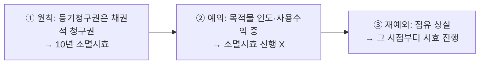
- `암기 문장`: ① 원칙적으로 법률행위에 의한 등기청구권은 채권적 청구권으로서 10년 소멸시효에 걸리고, ② 예외적으로 매수인이 목적물을 인도받아 사용·수익 중이면 권리 위에 잠자는 자가 아니므로 시효가 진행하지 않으며, ③ 재예외적으로 점유를 상실하면 그때부터 다시 시효가 진행한다.
  - 근거 위치: [《민법의_기초이론_3_전경운_중간고사_합본_p001-030.md》 p.8 | "등기청구권은 채권적 청구권으로 10년의 소멸시효에 걸린다"] [《civ_1-02_song_basic_juract_26_p091-120.md》 p.96 | "매수인의 등기청구권은 소멸시효에 걸리지 않음"] [《civ_1-02_song_basic_juract_26_p091-120.md》 p.96 | "점유상실시점으로부터 소멸시효 진행"]

### 📊 등기청구권 소멸시효 — §568① 논증 경로 [기출 모답 보강]

> 기출(2011, 2013, 2014, 2017, 2023 거의 매년 출제) 모답에서 반복되는 논증 구조:
> ① 매매계약에 기한 소유권이전등기청구권은 **§568① 재산권이전청구권**으로서 채권적 성질
> ② 원칙: §162① 10년 소멸시효에 걸림 (기산점: 매매대금 완납 시 또는 계약체결 시)
> ③ 예외: 매수인이 목적물을 인도받아 **사용·수익 중**이면 시효 불진행
> ④ 재예외: 점유를 상실하면 그 시점부터 다시 시효 진행
> ⑤ 답안에서는 위 ①→②→③→④를 순서대로 기재 후 사안 포섭

### 📊 등기청구권 양도 + 채무자 동의 [기출 모답 보강]

| 항목 | 내용 |
|---|---|
| **양도 제한 이유** | 등기청구권은 이행과정에 특별한 신뢰관계가 따르는 권리이므로, 성질상 양도가 제한됨 |
| **양도 방법** | 매도인(등기의무자)의 **동의 또는 승낙** 있으면 양수인이 직접 등기청구 가능 |
| **동의 없는 경우** | 채권양수만을 이유로 직접 이전등기 청구 불가 |
| **중간생략등기와의 관계** | 중간생략등기의 실현방법 중 하나로서 "등기청구권 양도 + 채무자 동의" 조합이 모답의 핵심 논증 경로 |

- 근거 위치: [《민법의_기초이론_3_전경운_중간고사_합본_p001-030.md》 p.9 | "그 이행과정에 신뢰관계가 따르는 특별한 권리"] [《전경운_민법_물총_26_p091-120.md》 p.95-96 | "그 이행과정에 신뢰관계가 따르므로"]

### 📊 중간생략등기 3가지 실현방법 [기출 모답 보강]

| 방법 | 구조 | 요건 | 모답 출현 빈도 |
|---|---|---|---|
| **① 적극적 이행청구권** | 甲→乙→丙에서 丙이 甲에게 직접 이전등기 청구 | 甲·乙·丙 **3자 합의** | ★★★ |
| **② 채권자대위권** | 丙이 乙의 甲에 대한 등기청구권을 **대위행사** → 乙 명의 등기 → 丙에게 이전 | 피보전채권(丙의 乙에 대한 등기청구권) + 채무자의 권리불행사 | ★★ |
| **③ 계약인수** | 제1매수인 乙이 매도인 甲과의 매매계약상 지위를 丙에게 이전 → 丙이 甲에게 직접 이전등기 | 계약인수의 합의(3자) | ★ |

- 근거 위치: [《민법의_기초이론_3_전경운_중간모답_10~23_목차볼드_p001-030.md》 2011 1-2문] [《민법의_기초이론_3_전경운_중간모답_10~23_목차볼드_p091-120.md》 2022 2문]

### 📊 등기청구권 vs 등기신청권
| 항목 | 등기청구권 | 등기신청권 |
|---|---|---|
| **성질** | 실체법상 권리 | 공법상 권리 |
| **상대방** | 등기의무자 | 등기관청 상대 |
| **문제되는 장면** | 이전등기, 말소등기, 진정명의회복 | 신청절차 하자, 신청 협력 |
| **답안 포인트** | 먼저 실체법상 등기청구권 존재를 본다 | 신청권은 그 다음 절차 문제 |

- `[교재 정리]` 등기청구권은 실체법상 권리이고, 등기신청권은 공법상 권리라서 구별해야 한다.
  - 근거 위치: [《전경운_민법_물총_26_p091-120.md》 L136-L150 | "실체법상의 권리"] [《전경운_민법_물총_26_p091-120.md》 L150 | "공법상의 권리"]

#### 📊 매매에 기한 소유권이전청구권
| 항목 | 내용 |
|---|---|
| **발생 근거** | 매매계약 체결 → 매도인의 소유권이전등기의무(§568), 매수인의 소유권이전등기청구권 |
| **성질** | 채권적 등기청구권. 특정이행청구권의 일종 |
| **동시이행** | 매수인의 잔금지급의무와 동시이행관계(§536). 등기서류 교부와 잔금지급은 동시이행 |
| **이행불능** | 매도인이 제3자에게 이전등기를 마친 경우 → 이행불능 → 전보배상(§390) |
| **소멸시효** | 매매대금 완납 시부터 10년(채권 소멸시효). 다만 인도·점유 이전 후에도 등기청구권은 별도 진행 |
| **이중매매** | 제1매수인의 등기청구권은 제2매수인 앞 등기 경료로 이행불능. 매도인에 대해 채무불이행 책임. 제2매수인의 불법행위 성립 여부는 배임 가담 법리 |

- (교재 확인 필요) 위 표의 조문 번호 및 판례 근거는 전경운 교재 해당 단원에서 재확인 권장.

#### ✍️ 등기청구권 모답형 (조문·판례 구조)

> **[조문]** §186에 의하면 "부동산에 관한 법률행위로 인한 물권의 득실변경은 등기하여야 그 효력이 생긴다." 따라서 등기권리자가 등기의무자에 대하여 등기에 필요한 협력을 구하는 실체법상 권리, 즉 등기청구권이 문제된다.
>
> **[판례]** 판례는 법률행위에 의한 등기청구권을 "채권행위로부터 발생하는 채권적 청구권"으로 파악하여 원칙적으로 10년 소멸시효에 걸린다고 본다. 다만 "매수인이 목적물을 인도받아 사용·수익하고 있는 경우에는 매수인의 등기청구권은 소멸시효에 걸리지 않는다"고 하여, 권리 위에 잠자는 자가 아닌 때에는 시효가 진행하지 않는다.
>
> **[포섭·결론]** 따라서 본 사안에서는 먼저 실체법상 등기청구권의 발생 여부를 판단하고, 그 다음으로 등기신청권 등 절차 문제를 나누어 보되, 매수인이 인도받아 사용·수익 중인 경우에는 소멸시효 불진행 여부까지 함께 검토한다.

- 근거 위치: [《전경운_민법_물총_26_p091-120.md》 L149-L150 | "실체법상의 권리"] [《전경운_민법_물총_26_p091-120.md》 L149-L150 | "공법상의 권리"]

### 📊 등기의 추정력
- 출처 위치: [《민법의_기초이론_3_전경운_중간고사_합본_p001-030.md》 p.10 | "판례는 이를 법률상 추정으로 본다"] [《민법의_기초이론_3_전경운_중간고사_합본_p001-030.md》 p.10 | "등기원인이 진실로 존재하고 등기절차가 적법하게 행하여졌다는 추정도 받는다"] [《민법의_기초이론_3_전경운_주제별_모의답안_p001-012.md》 p.9 | "등기명의인 뿐 아니라 제3자도 추정의 효과를 원용할 수 있고, 등기명의인의 이익 뿐 아니라 불이익을 위해서도 추정이 인정된다"]
| 항목 | 내용 |
|---|---|
| **의의** | 등기가 있으면 실체관계와 부합하는 것으로 **추정** |
| **추정 제외** | 표제부의 등기, 가등기, 구 예고등기에는 추정력 불인정 |
| **추정의 성격** | 통설·판례는 **법률상 추정**으로 본다 |
| **객관적 범위** | 등기권리·절차의 적법성이 추정되고, 판례는 등기원인의 존재와 등기절차의 적법성에도 추정력이 미친다고 본다 |
| **인적 범위** | 등기명의인뿐 아니라 제3자도 원용할 수 있고, 등기명의인의 이익뿐 아니라 불이익을 위해서도 추정이 인정된다 |
| **번복 방법** | 반대사실을 주장하는 자가 본증으로 권리 부존재를 입증해야 한다 |
| **이중등기 시** | 먼저 된 등기에 추정력 |

- `[판례]` 등기명의자가 등기원인행위의 태양이나 과정을 다소 다르게 주장하더라도, 그 주장만으로 등기의 추정력이 깨어진다고 할 수는 없다.
  - 근거 위치: [《민법의_기초이론_3_전경운_중간고사_합본_p001-030.md》 p.10 | "이러한 주장만 가지고 그 등기의 추정력이 깨어진다고 할 수 없다"]
- `[판례]` 토지대장에 소유자로 기재되어 있더라도 등기부와 같은 권리추정력은 인정되지 않는다(대판 2013.7.11, **[[2013다202878]]**).
  - 근거 위치: [《전경운_민법_물총_26_p091-120.md》 L495-500 | "토지대장의 권리추정력 부정"]

### 📊 등기 추정력의 부수적 효과 [기출 모답 보강]

| 효과 | 내용 |
|---|---|
| **① 등기명의인의 선의·무과실 추정** | 등기에 기해 권리를 취득한 자는 선의·무과실로 추정 |
| **② 등기부 미조사 시 과실 추정** | 부동산 거래에서 등기부를 조사하지 않은 자에게는 과실이 추정됨 |
| **③ 부동산물권 취득자의 악의 추정** | 등기가 있는 부동산에 대해 별도 물권을 주장하는 제3자는 등기 존재를 알았다고 추정 |
| **④ 점유추정력과의 관계** | 등기추정력이 점유추정력(§200)에 우선한다 |

- 근거 위치: [《민법의_기초이론_3_전경운_중간모답_10~23_목차볼드_p091-120.md》 2020·2023 기출 모답 구조]

### 📊 등기의 공신력
| 항목 | 정리 |
|---|---|
| **원칙** | 현행 민법상 등기의 공신력은 인정되지 않음 |
| **의미** | 등기부를 신뢰한 선의자라도 무조건 보호되지 않음 |
| **답안 포인트** | 등기 공신력 대신 개별 제도(선의취득, 표현대리 유사문제, 손해배상 등)를 따로 본다 |

- `[교재 정리]` 우리 민법은 등기의 공신력을 현행법상 인정하지 않는다는 데 학설과 판례가 일치한다.
  - 근거 위치: [《전경운_민법_물총_26_p091-120.md》 L568-L572 | "등기의 공신력이 현행법상 인정되지 않는다는 데에 학설, 판례"]

### 📊 무효등기의 유용 요건
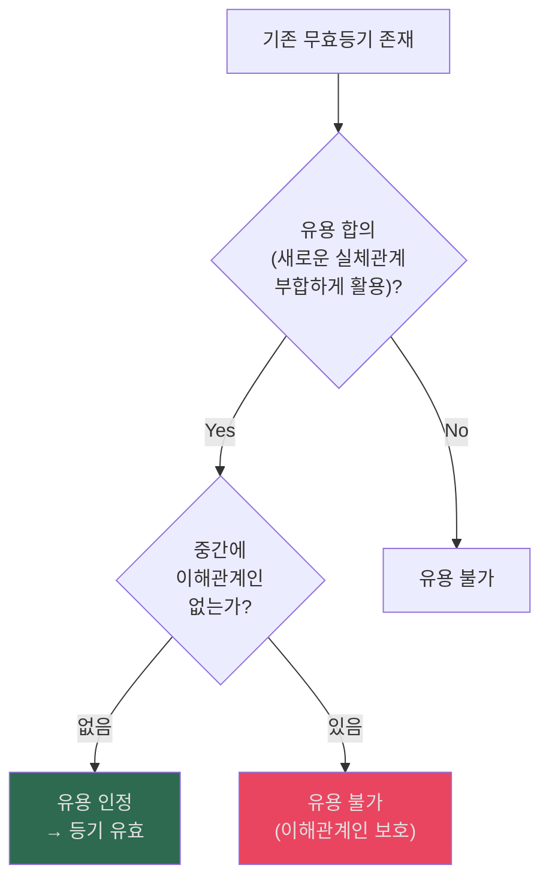

- `요건 정리`: ① 등기 유용의 합의, ② 무효등기에 부합하는 실체관계의 존재, ③ 유용 합의 전에 등기부상 이해관계인이 없을 것이 요구된다.
  - 근거 위치: [《민법의_기초이론_3_전경운_중간고사_합본_p031-060.md》 L476-478 | "등기 유용의 합의, 무효등기에 부합하는 실체관계의 존재, 등기유용의 합의전에 등기부상 이해관계인이 없을 것이 요구된다"]
- `효과`: 유용하더라도 그때부터 유효해질 뿐이고 등기시점으로 소급하지 않는다.
  - 근거 위치: [《민법의_기초이론_3_전경운_중간고사_합본_p031-060.md》 L479-481 | "무효등기를 유용하더라도 그 때부터 유효한 등기가 되고, 등기시점으로 소급효가 인정되지는 않는다"]
- `주요 판례문구`: "가장 매매를 원인으로 한 소유권 이전등기는 무효이나, 후에 적법한 매매 등으로 다시 이전등기를 하게 되어 처음의 무효등기를 적법한 원인에 의한 등기로 유용하는 경우에는 부당한 결과를 가져오지 않으므로 유효하다"; "저당권 설정등기의 유용은 그 유용합의 이전에 등기상의 이해관계를 가진 제 3자가 없는 경우에 한하여 유효하다고 본다"
  - 근거 위치: [《민법의_기초이론_3_전경운_중간고사_합본_p031-060.md》 L484-486 | "가장 매매를 원인으로 한 소유권 이전등기는 무효이나, 후에 적법한 매매 등으로 다시 이전등기를 하게 되어 처음의 무효등기를 적법한 원인에 의한 등기로 유용하는 경우에는 부당한 결과를 가져오지 않으므로 유효하다"] [《민법의_기초이론_3_전경운_중간고사_합본_p031-060.md》 L490-491 | "저당권 설정등기의 유용은 그 유용합의 이전에 등기상의 이해관계를 가진 제 3자가 없는 경우에 한하여 유효하다고 본다"]

### 물권변동과 민법총칙 쟁점 — 조문 정리

#### 📊 §103 반사회적 법률행위와 물권변동
| 항목 | 내용 |
|---|---|
| **조문** | §103: 선량한 풍속 기타 사회질서에 위반한 사항을 내용으로 하는 법률행위는 무효 |
| **이중매매 적용** | 매도인이 제1매수인에 대한 배신적 악의로 제2매수인에게 이전한 경우, 제2매수인이 배임행위에 적극 가담하면 §103에 의해 제2매매계약 무효 가능(판례) |
| **물권변동 효과** | §103 무효 → 원인행위 무효 → 물권변동도 무효 → 말소등기청구 가능 |
| **§746과의 관계** | 불법원인급여(§746)는 급여자의 반환청구를 차단하나, §103 무효는 제3자 보호 측면에서 별도 판단 |

#### 📊 법인 이사의 대리권과 부동산 처분
| 항목 | 내용 |
|---|---|
| **이사의 대표권** | §59: 법인의 이사는 법인의 사무를 대표. 부동산 처분도 대표권 범위에 포함 |
| **대표권 제한** | 정관·사원총회 결의로 대표권을 제한할 수 있으나, 선의의 제3자에게 대항 불가(§59②) |
| **물권변동 효과** | 대표권 제한 위반 처분 → 거래 상대방이 선의이면 유효한 물권변동 |

#### 📊 강행법규 위반과 물권변동
| 항목 | 내용 |
|---|---|
| **원칙** | 강행법규 위반 법률행위 = §105(→실제로는 §103 또는 개별 강행법규)에 의해 무효 → 물권변동 불발 |
| **단속규정 vs 효력규정** | 단속규정 위반 = 법률행위 자체는 유효(과태료 등 행정제재만), 효력규정 위반 = 법률행위 무효 |
| **부특법(단속)** | 명의신탁약정 무효이나 물권변동 원칙 유효 (§4 예외) |
| **국토법(효력)** | 토지거래허가 없는 매매 = 확정적 무효, 물권변동 불발 |

#### 📊 총유물 처분 제한
| 항목 | 내용 |
|---|---|
| **조문** | §276②: 총유물의 처분·변경은 사원총회의 결의에 의한다 |
| **위반 효과** | 총회 결의 없는 총유 부동산 처분 = 무효. 등기가 경료되어도 무효 |
| **답안 포인트** | 비법인사단의 부동산이 총유인 경우 처분 시 반드시 사원총회 결의 요건 검토 |
| **판례** | 총회 결의 없이 비법인사단 대표자가 임의 처분한 경우 무효(대법원 확립 판례) |

---

**사례문제: 미등기 부동산의 보존등기 방법** `[송영곤 사례연습 물권 p.6-7]`

> A는 자기 소유 X토지에 상가건물을 신축하기 위해 건축업자 B에게 건축을 의뢰하면서, 건축허가는 B 명의로 받되 건물 소유권은 A에게 귀속시키기로 합의하였다. B는 자신이 건축허가 명의자임을 이용하여 자기 명의의 소유권보존등기를 마쳤고, 곧이어 B의 채권자 C가 가압류를 하였다. A는 B를 상대로 보존등기 말소를, 대한민국을 상대로 소유권확인을, C를 상대로 가압류등기 말소를 각 청구하였다.

**쟁점**: 도급인·수급인 간 건물 소유권 귀속 기준, 미등기 부동산의 보존등기 방법, 국가 상대 소유권확인의 소이익, 가압류등기 말소청구의 적법성

**풀이 요지**:
> [조문] §187 본문 → [판례] 신축건물 소유권 귀속의 가장 우선적 기준은 '당사자 사이의 합의'이므로, A·B 합의에 따라 건물 소유권은 A에게 원시적으로 귀속되고, B 명의 보존등기는 원인무효이다. → A는 §214 방해배제청구로 B 명의 보존등기의 말소를 구할 수 있다(청구인용). 말소확정판결을 관련자료로 제출하여 A 명의 보존등기를 신청하면 된다(부동산등기법 §65②). → 대한민국 상대 소유권확인은 등기명의자 상대 판결만으로 보존등기가 가능하므로 별도 소이익이 없어 소각하(대판 1995.7.25. [[95다14817]]). → C 상대 가압류등기 말소는 법원 촉탁으로만 처리되므로 직접 소구하면 소이익 결여로 각하. 다만 C는 '등기상 이해관계 있는 제3자'에 해당하여, 보존등기 말소에 대한 승낙의 의사표시를 구하는 것은 허용된다(대판 1997.2.14. [[95다13951]], 대판 1998.11.27. [[97다41103]]).

---

**사례문제: 등기 말소소송에서 피고적격자** `[송영곤 사례연습 물권 p.8-10]`

> Z 소유 X토지에 관해 甲이 공시송달 판결로 소유권이전등기를 마쳤으나, Z이 추후보완항소하여 甲의 청구를 기각하는 판결이 확정되었다. 한편 항소심 진행 중 甲은 실체 없는 A종중을 만들어 A종중 명의로 증여를 원인으로 한 소유권이전등기를 마치고, 이후 A종중의 대표자를 변경하는 부기등기까지 경료하였다. Z은 각 등기의 말소를 구하고자 한다.

**쟁점**: 등기말소소송에서의 피고적격, 실체 없는 단체 명의 불실등기의 말소 상대방, 대표자 변경 부기등기의 말소 가부

**풀이 요지**:
> [판례] 등기말소·말소회복등기 이행청구에서는 '등기의무자'를 피고로 해야 하고, 그렇지 않으면 피고적격 흠결로 각하된다(대판 1994.2.25. [[93다39225]]). → (1) 甲 명의 소유권이전등기의 말소는 등기의무자인 '甲'을 상대로 소구한다. → (2) 실체 없는 A종중 명의 등기는, 등기명의인이 허무인 또는 실체가 없는 단체인 때에는 '실제 등기행위를 한 자'를 상대로 말소를 구할 수 있으므로(대판 2019.5.30. [[2015다47105]]), 역시 '甲'을 상대로 소구한다. → (3) 대표자 변경 부기등기는 등기명의인의 동일성을 유지하는 범위 내의 표시변경에 불과하여 권리변동을 가져오지 않으므로, 그 말소를 소구하는 것은 소의 이익이 없어 허용되지 않는다(대판 2000.5.12. [[99다69983]], 대판 2019.5.30. [[2015다47105]]).

---

## 6. 동산 물권변동: 인도·점유개정·선의취득 — ★★
> 전체 구조: §0.소스범위 > §0-1.읽는순서 > §1.범위지도 > §2.물권총론 > §3.부동산변동 > §4.가등기 > §5.등기효력 > **§6.동산변동** > §7.취득시효 > §8.비법률행위변동 > §9.명인방법 > §10.기타정리 > §11.학설비교 > §11-A.공유침해 > §12.흐름도 > §13.명의신탁IRAC > §14.포섭포인트 > §15.시효IRAC > §16.통행권 > §17.점유반환

### 📊 동산 인도 4유형
| 유형 | 내용 | 조문 | 선의취득 가부 |
|---|---|---|---|
| **현실인도** | 직접 점유 이전 | §188① | ○ |
| **간이인도** | 양수인이 이미 점유 중 | §188② | ○ |
| **점유개정** | 양도인이 계속 점유 | §189 | **✗** (판례: **77다1872**, **2004다37430**) |
| **반환청구권 양도** | 제3자 점유 시 반환청구권 양도 | §190 | ○ |

- `[판례요지]` 점유개정은 외부에서 거래상태를 인식하기 가장 불명확한 인도방법이어서, 판례는 점유개정에 의한 선의취득을 부정한다.
  - 근거 위치: [《전경운_민법_물총_26_p091-120.md》 L1077-L1087 | "점유개정에 의하여 점유를 취득한 경우"] [《전경운_민법_물총_26_p091-120.md》 L1077-L1087 | "진정한 권리자를 우선적으로 보호"] [《전경운_민법_물총_26_p091-120.md》 L1077-L1087 | "판례는 점유개정의 경우에는 선의취득을 부정"]

### 📊 선의취득 요건 체계도 — ★★
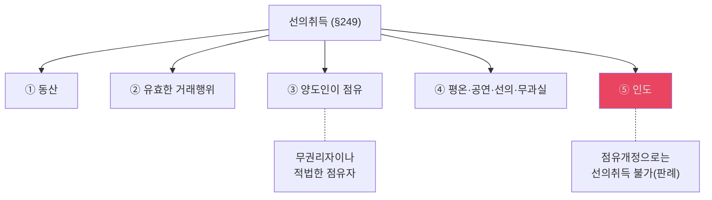

- `요건 정리`: ① 객체는 동산일 것, ② 양도인이 점유 중인 무권리자일 것, ③ 유효한 거래행위가 있을 것, ④ 양수인이 선의·무과실일 것, ⑤ 인도로 점유를 취득할 것을 본다.
  - 근거 위치: [《민법의_기초이론_3_전경운_중간고사_합본_p061-090.md》 L8-10 | "선의 취득의 객체는 동산이며, 양도인이 목적물을 점유하고 있을 것"] [《민법의_기초이론_3_전경운_중간고사_합본_p061-090.md》 L13-16 | "동산 물권의 유효한 거래행위가 있을 것이 요구"] [《민법의_기초이론_3_전경운_중간고사_합본_p061-090.md》 L18-20 | "양수인은 선의 무과실 일것이 요구"] [《민법의_기초이론_3_전경운_중간고사_합본_p061-090.md》 L26-27 | "양수인이 점유를 취득하였을 것"]
- `무과실 판례문구`: "무과실에 대해서는 추정규정이 없으므로, 선의취득자에게 무과실에 대한 입증 책임이 있다고 한다"
  - 근거 위치: [《민법의_기초이론_3_전경운_중간고사_합본_p061-090.md》 L21-23 | "무과실에 대해서는 추정규정이 없으므로, 선의취득자에게 무과실에 대한 입증 책임이 있다고 한다"]
- `[[점유개정]] 관련 문구`: "점유개정은 관념적 점유 이전의 방법 중에서 가장 불명확하고, 외부에서 거래를 인식할 수 없으므로, 부정설이 타당하다"; "판례 역시 선의 취득을 부정하고 있는 바"
  - 근거 위치: [《민법의_기초이론_3_전경운_중간고사_합본_p061-090.md》 L28-33 | "점유개정은 관념적 점유 이전의 방법 중에서 가장 불명확하고, 외부에서 거래를 인식할 수 없으므로, 부정설이 타당하다"] [《민법의_기초이론_3_전경운_중간고사_합본_p061-090.md》 L28-33 | "판례 역시 선의 취득을 부정하고 있는 바"]
- `원칙·예외`: ① 원칙적으로 유효한 거래행위와 인도까지 갖추면 선의취득이 성립하고, ② 예외적으로 점유개정은 외부에서 거래를 인식하기 어려워 선의취득이 부정되며, ③ 따라서 이중의 [[점유개정]] 사안도 뒤의 양수인은 현실 인도 등 별도 취득요건을 더 검토해야 한다.
  - 근거 위치: [《전경운_민법_물총_26_p091-120.md》 L1090-L1096 | "그 동산에 관한 물권을 취득"] [《민법의_기초이론_3_전경운_중간고사_합본_p061-090.md》 L28-33 | "점유개정은 관념적 점유 이전의 방법 중에서 가장 불명확"] [《민법의_기초이론_3_전경운_중간고사_합본_p061-090.md》 L28-33 | "판례 역시 선의 취득을 부정"]

### 📊 간접점유·점유개정·점유보조자
| 항목 | 정리 | 시험 포인트 |
|---|---|---|
| **점유개정** | 양도인이 계속 직접점유하고 양수인에게 간접점유를 취득시키는 방식 | 인도의 한 형태 |
| **점유매개관계** | 간접점유를 가능하게 하는 기초관계 | 임대차·보관 등과 연결 |
| **점유보조자 한계** | 단순 점유보조자만 남는 경우 점유개정 성립 안 됨 | 정원사 예시처럼 바로 출제 가능 |

- `[교재 정리]` 점유개정은 양도인이 계속 점유하면서 양수인에게 간접점유를 취득시키는 경우를 말하고, 이를 위해 점유매개관계가 필요하다.
  - 근거 위치: [《전경운_민법_물총_26_p091-120.md》 L753-L770 | "양수인에게 간접점유를 취득시키는 경우"] [《전경운_민법_물총_26_p091-120.md》 L769-L770 | "점유매개관계가 성립하여야"]
- `[교재 정리]` 양도인이 직접점유자가 아니라 단순한 점유보조자 지위만 보유하는 경우에는 점유개정이 성립하지 않는다.
  - 근거 위치: [《전경운_민법_물총_26_p091-120.md》 L773-L774 | "단순히 점유보조자의 지위를 보유할 뿐인 때에는 점유개정은 성립되지 않는다"]
- `[교재 정리]` 선의취득에서는 점유보조자가 점유물을 처분한 경우에도 취득자의 선의취득이 인정될 수 있다.
  - 근거 위치: [《전경운_민법_물총_26_p091-120.md》 L960-L962 | "점유보조자가 점유물을 처분한 경우에도 취득자의 선의취득이 인정된다"]

### 📊 선의취득 효과 카드
| 항목 | 내용 | 답안 포인트 |
|---|---|---|
| **효과** | 선의취득자는 동산에 관한 물권을 취득 | 단순 점유보호가 아니라 물권취득 |
| **확정성** | 취득은 확정적 | 사후에 진정권리자가 나타나도 원칙적 유지 |
| **요건 점검** | 동산, 유효한 거래행위, 점유자 처분, 평온·공연·선의·무과실, 인도 | 점유개정만으로는 부정되는지 별도 확인 |

- `[교재 정리]` 선의취득은 최종적으로 물권취득을 발생시키는 제도이고, 그 취득은 확정적이다.
  - 근거 위치: [《전경운_민법_물총_26_p091-120.md》 L1090-L1096 | "그 동산에 관한 물권을 취득"] [《전경운_민법_물총_26_p091-120.md》 L1096 | "물권취득은 확정적이다"]

### 📊 이중의 점유개정 문제
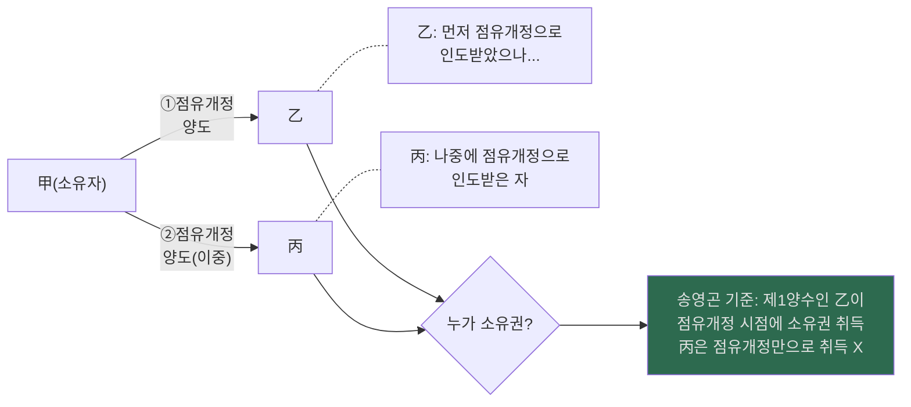

- `[송영곤 기준]` 현행 정리는 `후행 현실인도` 중심 판례 표현만 남기면 오해가 생긴다. 송영곤 자료는 점유개정도 인도이므로 제1양수인이 먼저 소유권을 취득하고, 제2양수인은 점유개정만으로는 취득할 수 없다고 정리한다.
  - 근거 위치: [《civ_1-09_song_propertychg_basic_26_p061-090.md》 p.88 | "처음 점유개정의 방법으로 동산을 양도함으로써 소유권은 제1양수인에게 넘어갔다고 보아야"] [《civ_1-09_song_propertychg_basic_26_p061-090.md》 p.88 | "점유개정으로 인한 선의취득은 인정되지 않으므로"]

### 📊 도품·유실물 특칙 (§250)
- 출처 위치: [《civ_1-09_song_propertychg_basic_26_p061-090.md》 p.87 | "도난 또는 유실한 날로부터 2년 내에 그 물건의 반환을 청구할 수 있다"] [《civ_1-09_song_propertychg_basic_26_p061-090.md》 p.88 | "위 반환기간 동안에 도품의 소유권은 선의취득자가 취득하되 반환기간 중에 반환청구를 당하면 소유권을 상실한 것으로 본다"] [《civ_1-09_song_propertychg_basic_26_p061-090.md》 p.88 | "제251조는 제249조를 전제로 한 규정이므로 이는 '선의 · 무과실'로 해석해야 한다"]
| 항목 | 내용 |
|---|---|
| **원칙** | 선의취득 요건을 갖추더라도 피해자·유실자는 **2년 내 반환청구 가능** |
| **송영곤 회독기준** | 반환기간 중에는 **선의취득자귀속설(즉시취득설)** 로 정리 |
| **교수님 교재 기준** | 교재는 `통설=선의취득자귀속설 / 소수설=원소유자귀속설`을 함께 소개 |
| **기간** | 2년 이내 반환청구 가능 |
| **대가변상청구권** | 선의·무과실의 취득자가 경매·공개시장·동종류 상인에게서 유상 취득한 경우 → **대가 변상 후 반환** |

- `[개념 정리]` 도품은 절도·강도로 점유자의 의사에 반하여 점유를 박탈당한 물건이고, 유실물은 점유자의 의사에 의하지 않고 점유를 이탈한 물건이다.
- `[개념 정리]` 점유이탈물인지 여부는 간접점유자가 아니라 직접점유자의 의사를 기준으로 판단한다.
- `[판례 요지]` 점유보조자나 소지기관이 임의 처분한 물건은 형사법상 절도 문제와 별개로 민법 제250조의 도품·유실물에 해당하지 않는다(대판 1991.3.22, **[[91다70]]**).
- `[판례 요지]` 제251조의 대가변상은 대가변상청구권으로 해석한다(대판 1972.5.23, **[[72다115]]**).
- `[교수님 교재 기준]` 반환기간은 점유상실시부터 2년이고, 조속한 권리관계 안정을 위한 제척기간으로 보는 것이 타당하다고 정리한다.
- `[판례 요지]` 제251조는 제249조·제250조를 전제로 하므로 선의뿐 아니라 무과실까지 요구하고, 통설·판례는 대가변상청구권설을 취한다.
- `[교수님 교재 기준]` 전경운 교재는 도품·유실물 귀속 문제를 `통설=선의취득자귀속설`과 `소수설=원소유자귀속설`로 나눈 뒤, 점유이탈물 보호와 비교법 논거에서 후자의 타당성도 함께 소개한다. 따라서 이 블록은 `판례`로 단정하지 말고 `자료 기준`을 밝혀 두는 편이 안전하다.
- 근거 위치: [《전경운_민법_물총_26_p091-120.md》 L1135-L1146 | "도품이라 함은 절도 또는 강도에 의하여 점유자의 의사에 반해서 그의 점유를 박탈당한 물건"] [《전경운_민법_물총_26_p091-120.md》 L1135-L1146 | "유실물은 점유자의 의사에 의하지 않고 그의 점유를 이탈한 물건"] [《전경운_민법_물총_26_p091-120.md》 L1140-L1146 | "직접점유자의 의사를 표준으로 하여 결정하여야 한다"] [《전경운_민법_물총_26_p091-120.md》 L1142-L1156 | "도품 • 유실물에 해당하지 않는다"] [《전경운_민법_물총_26_p091-120.md》 L1170-L1173 | "제척기간이라고 보아야 할 것이다"] [《전경운_민법_물총_26_p091-120.md》 L1176-L1182 | "통설은 도품 • 유실물이라 하더라도 취득과 동시에 일단 소유권은 선의취득자에게 귀속"] [《전경운_민법_물총_26_p091-120.md》 L1176-L1182 | "원소유자귀속설（즉시취득부정설）은 도품이나 유실물의 소유권은 원소유자에게 있다고 한다"] [《전경운_민법_물총_26_p091-120.md》 L1235-L1249 | "무과실도 당연한 요건이라고 해석하여야 한다"] [《전경운_민법_물총_26_p091-120.md》 L1245-L1249 | "통설과 판례는 대가변상청구권으로 해석한다"] [《전경운_민법_물총_26.pdf》 p.113-120]

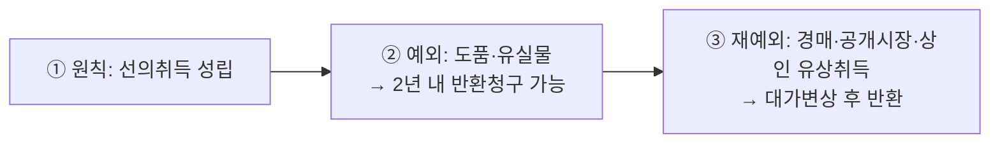
- `암기 문장`: ① 원칙적으로 동산의 [[선의취득]] 요건을 갖추면 취득자는 물권을 취득하지만, ② 예외적으로 그 목적물이 도품·유실물이면 원소유자나 유실자는 상실일로부터 2년 내 반환을 청구할 수 있고, ③ 재예외적으로 경매·공개시장·동종류 상인에게서 선의·무과실로 유상취득한 경우에는 대가를 변상해야만 반환을 구할 수 있다.
  - 근거 위치: [《전경운_민법_물총_26_p091-120.md》 L1090-L1096 | "그 동산에 관한 물권을 취득"] [《civ_1-09_song_propertychg_basic_26_p061-090.md》 p.87 | "도난 또는 유실한 날로부터 2년 내에 그 물건의 반환을 청구할 수 있다"] [《전경운_민법_물총_26_p091-120.md》 L1245-L1249 | "통설과 판례는 대가변상청구권으로 해석한다"]

### 📊 도품·유실물 추가 체크리스트
| 항목 | 내용 | 답안 포인트 |
|---|---|---|
| **객체** | 금전 제외 도품·유실물 | 금전은 특칙 적용에서 빠진다 |
| **기간** | 도난·유실일로부터 2년 내 반환청구 | 기산점을 처분일이 아니라 상실일로 적는다 |
| **판단기준** | 직접점유자의 의사를 기준 | 간접점유자 의사가 아니라 직접점유자 |
| **대가변상** | 통설·판례는 대가변상청구권 구조 | 경매·공개시장·상인 매수 장면과 연결 |

- `[교재 정리]` 도품·유실물 특칙은 금전을 제외하고, 상실일로부터 2년 내 반환청구를 인정한다.
  - 근거 위치: [《전경운_민법_물총_26_p091-120.md》 L1128-L1134 | "2년내"] [《전경운_민법_물총_26_p091-120.md》 L1134 | "금전을 제외한 도품이나 유실물"]
- `[교재 정리]` 도품·유실물 해당 여부는 직접점유자의 의사를 기준으로 판단하고, 대가변상은 통설·판례상 청구권으로 이해한다.
  - 근거 위치: [《전경운_민법_물총_26_p091-120.md》 L1140 | "직접점유자의 의사를 표준"] [《전경운_민법_물총_26_p091-120.md》 L1247 | "통설과 판례는 대가변상청구권"]
- `시험장 기준`: ① 교수님 교재는 `선의취득자귀속설/원소유자귀속설`을 함께 소개하므로 학설대립을 적는 것이 정확하고, ② 회독표나 선배찌라시형 정리에서는 송영곤 기준에 따라 `반환기간 중 선의취득자 귀속 + 2년 내 반환청구`로 정리한 뒤, ③ 답안에서는 반드시 `자료상 대립` 문구를 붙여 단정 리스크를 줄인다.
  - 근거 위치: [《전경운_민법_물총_26_p091-120.md》 L1176-L1182 | "통설은 도품 • 유실물이라 하더라도 취득과 동시에 일단 소유권은 선의취득자에게 귀속"] [《전경운_민법_물총_26_p091-120.md》 L1179-L1182 | "원소유자귀속설（즉시취득부정설）은 도품이나 유실물의 소유권은 원소유자에게 있다고 한다"] [《civ_1-09_song_propertychg_basic_26_p061-090.md》 p.88 | "위 반환기간 동안에 도품의 소유권은 선의취득자가 취득하되 반환기간 중에 반환청구를 당하면 소유권을 상실한 것으로 본다"]

#### ✍️ 선의취득·도품유실물 모답형 (조문·판례 구조)

> **[조문]** §249([[선의취득]])에 의하면, 평온·공연하게 동산을 양수한 자가 선의이며 과실 없이 그 동산을 점유한 때에는 즉시 "그 동산에 관한 물권을 취득"하고, 그 "물권취득은 확정적이다." §250(도품·유실물)에 의하면, "금전을 제외한 도품이나 유실물"은 피해자 또는 유실자가 도난 또는 유실한 날로부터 "2년내"에 그 물건의 반환을 청구할 수 있다.
>
> **[판례]** 판례는 점유이탈물 해당 여부를 "직접점유자의 의사를 표준"으로 판단한다. 또한 공개시장 등에서 선의로 유상 취득한 경우에는 "대가변상청구권" 구조로 처리한다.
>
> **[포섭·결론]** 따라서 본 사안에서는 ① 양수인의 평온·공연·선의·무과실 점유취득 여부를 먼저 검토하고, ② 목적물이 도품·유실물에 해당하는지(직접점유자의 의사 기준), ③ 해당한다면 2년 내 반환청구 가부 및 대가변상청구권 구조까지 순차 검토한다.

- 근거 위치: [《전경운_민법_물총_26_p091-120.md》 L1090-L1096 | "그 동산에 관한 물권을 취득"] [《전경운_민법_물총_26_p091-120.md》 L1096 | "물권취득은 확정적이다"] [《전경운_민법_물총_26_p091-120.md》 L1128-L1134 | "2년내"] [《전경운_민법_물총_26_p091-120.md》 L1134 | "금전을 제외한 도품이나 유실물"] [《전경운_민법_물총_26_p091-120.md》 L1140 | "직접점유자의 의사를 표준"] [《전경운_민법_물총_26_p091-120.md》 L1247 | "대가변상청구권"]

### 📊 [심화] 선의취득 특수 사례 (점유보조자, 간이인도, 필요비)
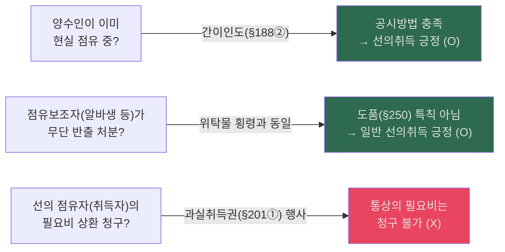

- `[교수님 교재 정리]` 선의취득의 점유취득 방식은 현실인도·간이인도·반환청구권 양도까지는 인정되고, 점유개정은 판례상 부정된다. 또한 점유보조자 처분물은 제250조 도품이 아니고, 선의점유자는 과실을 취득하는 동안 통상의 필요비를 청구하지 못한다.
  - 근거 위치: [《전경운_민법_물총_26_p091-120.md》 L1069-L1070 | "현실의 인도, 간이인도"] [《전경운_민법_물총_26_p091-120.md》 L1087-L1088 | "판례는 점유개정의 경우에는 선의취득을 부정"] [《전경운_민법_물총_26_p091-120.md》 L1142-L1146 | "도품 • 유실물이 아니다"] [《민법의_기초이론_3_전경운_중간고사_합본_p001-030.md》 p.17 | "통상의 필요비의 경우 점유자가 과실을 취득하고 있는 경우 청구하지 못하나"]

---

## 7. 취득시효 (§245, §246) — ★★
> 전체 구조: §0.소스범위 > §0-1.읽는순서 > §1.범위지도 > §2.물권총론 > §3.부동산변동 > §4.가등기 > §5.등기효력 > §6.동산변동 > **§7.취득시효** > §8.비법률행위변동 > §9.명인방법 > §10.기타정리 > §11.학설비교 > §11-A.공유침해 > §12.흐름도 > §13.명의신탁IRAC > §14.포섭포인트 > §15.시효IRAC > §16.통행권 > §17.점유반환

### 📊 취득시효 유형 비교표 — ★★
| | 부동산 등기부취득시효 (§245②) | 부동산 점유취득시효 (§245①) | 동산 취득시효 (§246) |
|---|---|---|---|
| **기간** | **10년** | **20년** | 10년 |
| **점유 요건** | 소유의 의사·평온·공연·선의·무과실 | 소유의 의사·평온·공연 | 평온·공연·선의·무과실 |
| **등기 요건** | 자기 명의 **등기** 필요 | 불요 | — |
| **효과** | 소유권 취득 | 등기청구권 발생 → 등기로 소유권 취득 | 소유권 취득 |

### 📊 취득시효 판단 플로우
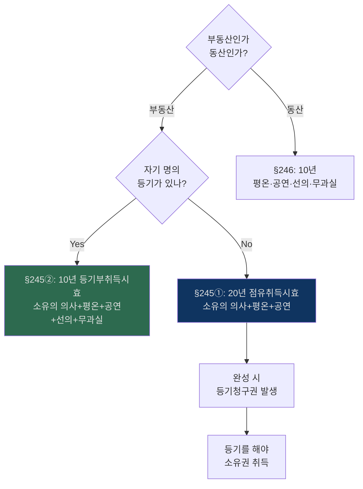

- `요건 정리`: 부동산 점유취득시효는 `20년간 소유의 의사 + 평온·공연 + 등기`, 등기부취득시효는 `자기 명의 등기 + 10년간 소유의 의사 + 평온·공연 + 선의·무과실`로 정리한다.
  - 근거 위치: [《민법의_기초이론_3_전경운_기출_선배정리_통합노트.md》 L341-347 | "20년간 부동산을 소유의 의사로 평온·공연하게 점유한 자는 '등기함으로써' 소유권을 취득"] [《민법의_기초이론_3_전경운_기출_선배정리_통합노트.md》 L341-347 | "부동산의 소유자로 등기한 자가 10년간 소유의 의사로 평온·공연하게 선의·무과실로 점유"]
- `판례문구`: "등기부취득시효가 완성된 후에 그 부동산에 관한 점유자 명의의 등기가 말소되거나 적법한 원인 없이 다른 사람 앞으로 소유권이전등기가 경료되었다 하더라도"
  - 근거 위치: [《민법의_기초이론_3_전경운_기출_선배정리_통합노트.md》 L348-350 | "등기부취득시효가 완성된 후에 그 부동산에 관한 점유자 명의의 등기가 말소되거나 적법한 원인 없이 다른 사람 앞으로 소유권이전등기가 경료되었다 하더라도"]

### 📊 자주점유 추정 (§197)
| 항목 | 내용 |
|---|---|
| **추정** | 점유자는 **소유의 의사**로 점유하는 것으로 추정 |
| **번복** | 점유 취득 원인인 권원의 성질이나 점유 관련 모든 사정으로 판단 |
| **판례** | 매매계약으로 인도받으면 자주점유 추정, 타인 소유 알면서 무단점유면 타주점유 |

- `[판례요지]` 자주점유 추정은 점유 취득의 권원 성질이 분명하거나 타인 소유임을 알면서 무단점유한 사정이 드러나면 번복된다.
  - 근거 위치: [《민법의_기초이론_3_전경운_중간고사_합본_p001-030.md》 L533-L539 | "점유권원의 성질이 분명하지 않은 경우"] [《민법의_기초이론_3_전경운_중간고사_합본_p001-030.md》 L533-L539 | "타인 소유 부동산을 무단점유"] [《민법의_기초이론_3_전경운_중간고사_합본_p001-030.md》 L533-L539 | "자주점유의 추정이 깨어진다고 하고 있다"]

### 📊 취득시효 완성 후 소유자의 제3자 처분 (이중양도와 유사)
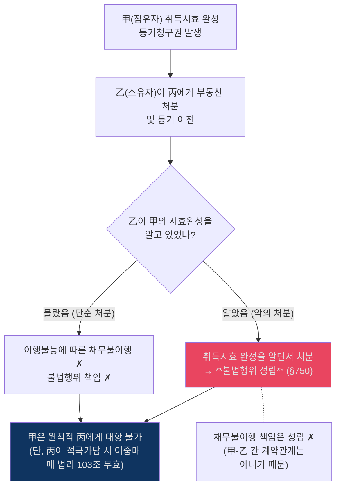

### 📊 취득시효 심화 쟁점 (기출 빈출)
| 쟁점 | 사실관계 구조 | 대법원 판례 태도 |
|---|---|---|
| **시효완성 후 근저당권 설정** | 1. 甲(점유자) 취득시효 완성 2. 乙(소유자)이 丙(은행)에게 근저당권 설정 3. 甲이 소유권이전등기 후 피담보채무 대위변제 | **부당이득 반환 청구 (✗)** 甲은 자신에게 이전된 소유권에 설정된 제한을 없애기 위해 **자신의 이익을 위하여** 변제한 것이므로 乙에게 구상권 및 부당이득반환을 청구할 수 없음. |
| **무효인 중복등기와 등기부취득시효** | 1. 乙(소유자) 선순위 보존등기 유효 2. 甲 명의 후순위 이중 보존등기(무효) 경료 3. 甲이 10년간 등기·점유 | **등기부취득시효 완성 (✗)** 1부동산 1등기기록주의에 입각하여 무효인 중복등기(후등기)에 터잡아 등기부취득시효를 주장할 수 없음. 제3자 명의로 이전되더라도 마찬가지임. |

---

**사례문제: 시효완성 전 소유자 처분과 시효취득자의 권리** `[송영곤 사례연습 물권 p.32-33]`

> A는 1980. 1. 1.부터 甲 소유 X토지를 소유의 의사로 평온·공연하게 점유하고 있다(취득시효완성일: 2000. 1. 1.). (1) 甲이 시효완성 전인 1999. 12. 23. X토지를 乙에게 매각·이전등기한 경우, A는 乙을 상대로 이전등기를 청구할 수 있는가? (2) 甲이 같은 날 乙에게 저당권을 설정한 경우, A가 이전등기 후 피담보채무를 변제하면 甲에게 구상금·부당이득반환을 청구할 수 있는가?

**쟁점**: 시효완성 전 소유자의 처분과 시효취득의 상대방, 시효취득의 원시취득 성격과 기존 제한물권의 소멸

**풀이 요지**:
> [판례] (1) 시효완성을 이유로 한 이전등기청구의 상대방은 '시효완성시 진정한 소유자'이므로, 시효완성 전에 소유권을 취득한 乙은 물권변동의 당사자에 해당하여 A는 乙을 상대로 이전등기를 청구할 수 있다(대판 1977.8.23. [[77다785]]). 소유명의 변경은 점유상태의 계속을 파괴하지 않아 시효중단 사유가 아니다(대판 1993.5.25. [[92다52764]]). → (2) 시효취득은 원시취득이고(대판 2004.9.24. [[2004다31463]]), 취득의 효력은 점유 개시시에 소급한다(§247). 따라서 A가 이전등기를 마치면 시효완성 전에 설정된 乙 명의 저당권은 사후적으로 무효가 되어 소유권에 기해 말소를 청구할 수 있다.

---

**사례문제: 시효완성 후 제3자 양도와 시효취득자의 구제수단** `[송영곤 사례연습 물권 p.33-34]`

> A는 1980. 1. 1.부터 甲 소유 X토지를 소유의 의사로 평온·공연하게 점유(취득시효완성일: 2000. 1. 1.). 甲은 시효완성 후인 2002. 12. 23. X토지를 乙에게 매각·이전등기하였다. A는 乙을 상대로 이전등기를 청구할 수 있는가? 불가한 경우 甲에 대한 구제수단은?

**쟁점**: 시효완성 후 소유자의 제3자 처분과 이중양도 유사 법리, 시효취득자의 불법행위·대상청구권

**풀이 요지**:
> [판례] 시효완성 후 제3자가 소유권을 취득한 경우, 시효완성자와 제3취득자는 이중양도와 같이 취급되어 시효완성자는 제3자에게 대항할 수 없다(대판 1977.3.22. [[76다242]]). → 甲에 대한 구제수단: (1) 불법행위: 甲이 시효완성 사실을 알면서 처분했다면 불법행위 성립(대판 1989.4.11. [[88다카8217]]). 다만 甲의 악의는 A가 입증해야 한다. (2) 채무불이행: 시효완성으로 계약관계가 생기는 것이 아니므로 채무불이행책임은 불가(대판 1995.7.11. [[94다4509]]). (3) 대상청구권: 판례는 인정하되, 이행불능 전에 시효완성자가 그 권리를 주장·행사하였어야 한다는 제한을 둔다(대판 1994.12.9. [[94다25025]], 대판 1996.12.10. [[94다43825]]).

---

**사례문제: 구분소유적 공유와 시효취득** `[송영곤 사례연습 물권 p.31, p.35]`

> X토지는 甲과 乙이 구분소유적 공유(공유지분 각 1/2)하는 토지로, (a)부분은 甲이, (b)부분은 乙이 단독 소유한다. A는 (a)부분을 20년간 점유하여 취득시효가 완성되었다. (1) A는 누구를 상대로 이전등기를 소구해야 하는가? (2) 시효완성 후 乙이 (b)부분을 丙에게 양도하고 공유지분 이전등기를 마친 경우, A는 丙에게도 시효완성을 주장할 수 있는가?

**쟁점**: 구분소유적 공유 토지에서 취득시효의 상대방, 시효완성 후 다른 공유자의 지분 양도와 시효취득자의 지위

**풀이 요지**:
> [판례] (1) 구분소유적 공유관계는 제3자인 시효취득자에게 대항할 수 없으므로, (a)부분과 무관한 乙도 자기 공유지분에 대해 이전등기의무를 부담한다. 따라서 A는 甲과 乙을 상대로 각 1/2 지분씩 이전등기를 소구한다(대판 1997.6.13. [[97다1730]]). → (2) 시효완성 후 '다른 공유자의 특정 구분소유부분'이 양도되어 지분이전등기가 경료되면, 대외적으로 '시효완성된 특정 부분 중 다른 공유자 명의 지분'에 관해 소유명의가 변동된 것에 해당하므로, A는 丙에게 시효완성을 주장할 수 없다(대판 2006.10.12. [[2006다44753]]). 결론적으로 A는 甲에게 1/2 지분 이전을 청구할 수 있고, 丙에게는 청구할 수 없다.

---

**사례문제: 시효취득 후 저당권 피담보채무 변제와 구상금** `[송영곤 사례연습 물권 p.35-37]`

> A는 甲 소유 X토지를 20년간 점유하여 취득시효가 완성되었다. 시효완성 후 甲이 乙에게 저당권을 설정하였다. A가 甲을 상대로 시효완성을 원인으로 이전등기를 마친 후 乙에게 피담보채무를 변제하여 저당권을 말소하였다. A는 甲에게 구상금 또는 부당이득반환을 청구할 수 있는가?

**쟁점**: 시효완성 후 원소유자의 저당권 설정의 유효성, 시효취득자의 피담보채무 변제의 법적 성격

**풀이 요지**:
> [판례] 시효완성 후에도 이전등기가 마쳐지기까지 원소유자는 적법한 소유자로서 권리를 행사할 수 있으므로 甲의 저당권 설정은 유효하다(대판 2006.5.12. [[2005다75910]]). → A의 변제는 '이해관계 있는 제3자의 변제'(§469②)에 해당한다. → 그러나 대법원은 "시효취득자가 원소유자에 의하여 그 토지에 설정된 근저당권의 피담보채무를 변제하는 것은 자신의 토지상 부담을 제거하여 완전한 소유권을 확보하기 위한 것으로서 자신의 이익을 위한 행위"라고 보아, 원소유자에게 구상권이나 부당이득반환을 청구할 수 없다고 판시하였다(대판 2006.5.12. [[2005다75910]]).

---

## 8. 법률행위에 의하지 않은 부동산물권변동 (§187)
> 전체 구조: §0.소스범위 > §0-1.읽는순서 > §1.범위지도 > §2.물권총론 > §3.부동산변동 > §4.가등기 > §5.등기효력 > §6.동산변동 > §7.취득시효 > **§8.비법률행위변동** > §9.명인방법 > §10.기타정리 > §11.학설비교 > §11-A.공유침해 > §12.흐름도 > §13.명의신탁IRAC > §14.포섭포인트 > §15.시효IRAC > §16.통행권 > §17.점유반환

### 📊 §187 적용 유형
| 유형 | 예시 | 등기 없이 취득? |
|---|---|---|
| **상속** | 피상속인 사망 → 상속인 | ✅ 즉시 취득 |
| **공용징수** | 토지수용 | ✅ 즉시 취득 |
| **판결** | 형성판결 | ✅ 즉시 취득 |
| **경매** | 낙찰 대금 완납 | ✅ 즉시 취득 |

> §187로 취득한 권리도 **처분**할 때는 등기 필요 (§186 원칙 복귀)

- `[개념 정리]` 제187은 `상속·공용징수·판결·경매 기타 법률 규정`처럼 법률행위에 의하지 않는 부동산물권변동을 다루며, 취득뿐 아니라 소멸까지 포함한다.
- `[개념 정리]` 판결에 의한 물권변동 중 제187이 적용되는 것은 형성판결뿐이고, 확인판결이나 이행판결은 여기에 포함되지 않는다.
- `[포섭 문장]` 제187에 따라 등기 없이 권리를 취득했더라도, 그 권리를 다시 법률행위로 처분하려면 먼저 자기 앞으로 취득등기를 한 뒤 처분등기를 해야 한다.
- `[판례 요지]` 제187 단서를 어기고 미등기 상태에서 처분하면 물권적 처분은 무효지만, 채권적 효력까지 당연히 부정되는 것은 아니다.
- 근거 위치: [《전경운_민법_물총_26_p091-120.md》 L5-L19 | "상속, 공용징수, 판결, 경매 기타 법률의 규정에 의한 부동산에 관한 물권의 취득은 등기를 요하지 아니한다"] [《전경운_민법_물총_26_p091-120.md》 L14-L19 | "물권의 취득을 등기하고 그 후에 처분에 따르는 등기를 하여야 한다"] [《전경운_민법_물총_26_p091-120.md》 L18-L19 | "그 처분은 무효가 된다（물론 처분행위의 채권적 효력까지 부인할 수 없다）"] [《전경운_민법_물총_26_p091-120.md》 L34-L37 | "물권의 취득뿐만 아니라 법률의 규정에 의한 '물권의 소멸'까지도 포함"] [《전경운_민법_물총_26_p091-120.md》 L36-L37 | "판결의 경우에는 형성판결만을 의미한다는 점에 주의"]

### 📊 재단법인 출연재산 귀속시기 (§47·§48) — ★★

| 구분 | 생전처분 (§48①) | 유언 (§48②) |
|---|---|---|
| **귀속시점** | 법인 성립시 | 유언 효력 발생시(=사망시) |
| **준용규정** | §47①: 증여에 관한 규정 | §47②: 유증에 관한 규정 |
| **부동산 등기** | 당사자 간 불요, 제3자 관계 필요 (판례) | 당사자 간 불요, 제3자 관계 필요 (판례) |

#### 학설 대립 — 출연재산이 부동산인 경우

| 학설 | 내용 | §187 적용 | 제3자 이중양도 시 |
|---|---|---|---|
| **법인성립시설** | §48을 §187의 '기타 법률 규정'으로 봄 → 등기 없이 법인 귀속 | ○ | 법인이 소유자 |
| **이전등기시설** | 성립시에는 이전등기청구권만 → 등기해야 귀속 (효력은 성립시 소급) | ✗ | 제3자가 보호 |

- `[판례]` 대판(全合) 1979.12.11. [[78다481]]: "§48은 출연자와 법인의 관계를 상대적으로 결정하는 기준에 불과하여, 당사자 사이에서는 등기를 요하지 않지만, **제3자에 대한 관계에서는** 출연재산이 부동산인 경우 **등기를 필요로 한다**."
  - 근거 위치: [《민사법쟁점노트_재산법_26》 p.10 | "제3자에 대한 관계에 있어서 출연행위는 법률행위이므로 출연재산의 법인에의 귀속은 부동산의 권리에 관한 것일 경우 등기를 필요로 함"]
- `[판례]` 대판 1984.9.11. 83누578: 유언으로 재단법인을 설립하는 경우, 출연재산은 유언 효력 발생시부터 법인에 귀속하므로 상속재산에 포함되지 않고, 상속인의 처분행위는 **무권한자의 행위**가 된다.
  - 근거 위치: [《민사법쟁점노트_재산법_26》 p.11 | "출연재산은 상속인의 상속재산에 포함되지 않는 것으로서 재산상속인의 출연재산 처분행위는 무권한자의 행위"]
- `[판례]` 대판 1993.9.14. [[93다8054]]: 유언 출연의 경우에도 제3자 관계에서는 등기 필요. 미등기 상태에서 상속인으로부터 지분을 취득한 **선의의 제3자에 대해 대항 불가**.
  - 근거 위치: [《민사법쟁점노트_재산법_26》 p.11 | "선의의 제3자에 대하여 대항할 수 없음"]
- `[비판]` 판례의 이분론(당사자 간 §187, 제3자 간 §186)은 대항요건주의 논리이며, 우리 민법의 성립요건주의와 정면배치된다는 비판이 유력하다.
  - 근거 위치: [《민사법쟁점노트_재산법_26》 p.11 | "대항요건주의 이론 그 자체이며 우리 민법이 취하고 있는 성립요건주의와 정면배치"]

---

## 9. 명인방법·물권 소멸
> 전체 구조: §0.소스범위 > §0-1.읽는순서 > §1.범위지도 > §2.물권총론 > §3.부동산변동 > §4.가등기 > §5.등기효력 > §6.동산변동 > §7.취득시효 > §8.비법률행위변동 > **§9.명인방법** > §10.기타정리 > §11.학설비교 > §11-A.공유침해 > §12.흐름도 > §13.명의신탁IRAC > §14.포섭포인트 > §15.시효IRAC > §16.통행권 > §17.점유반환

### 📊 명인방법
| 항목 | 내용 |
|---|---|
| **대상** | 수목의 집단·미분리과실·입목 |
| **방법** | 소유자를 알 수 있는 **표지·표식** |
| **효과** | 명인방법을 갖추면 제3자에게 대항 가능 |
| **등기와의 관계** | 등기할 수 없는 물건에 대한 **공시방법 대체** |

### 📊 물권 소멸 유형표
| 소멸 원인 | 내용 | 예시 |
|---|---|---|
| **혼동** | 소유권과 제한물권이 동일인에게 귀속 | 저당권자가 소유권 취득 |
| **포기** | 물권자의 일방적 포기 | 지상권 포기 |
| **소멸시효** | 일정 기간 불행사 | 지역권 20년 불행사 |
| **목적물 멸실** | 물건 자체 소멸 | 건물 전소 |

---

## 10. 기타 정리사항 — ★★★
> 전체 구조: §0.소스범위 > §0-1.읽는순서 > §1.범위지도 > §2.물권총론 > §3.부동산변동 > §4.가등기 > §5.등기효력 > §6.동산변동 > §7.취득시효 > §8.비법률행위변동 > §9.명인방법 > **§10.기타정리** > §11.학설비교 > §11-A.공유침해 > §12.흐름도 > §13.명의신탁IRAC > §14.포섭포인트 > §15.시효IRAC > §16.통행권 > §17.점유반환

### 📊 찌라시 전체 쟁점 맵 — ★★★
- 출처 위치: [《민법의_기초이론_3_전경운_중간고사_합본_p001-030.md》 p.2 | "I. 물권적 청구권★"] [《민법의_기초이론_3_전경운_중간고사_합본_p001-030.md》 p.8 | "VII. 등기청구권★"] [《민법의_기초이론_3_전경운_중간고사_합본_p001-030.md》 p.10 | "IX. 가등기의 효력★"] [《민법의_기초이론_3_전경운_중간고사_합본_p001-030.md》 p.11 | "X. 이중의 [[점유개정]] ▲ 121p"] [《민법의_기초이론_3_전경운_중간고사_합본_p001-030.md》 p.12 | "XI. [[선의취득]]★ 124p"] [《민법의_기초이론_3_전경운_중간고사_합본_p001-030.md》 p.14 | "XII. 자주점유와 타주점유 ▲ 149p"] [《민법의_기초이론_3_전경운_중간고사_합본_p001-030.md》 p.16 | "XIV. 점유권의 효력"] [《민법의_기초이론_3_전경운_중간고사_합본_p001-030.md》 p.18 | "XV. [[중간생략등기]] 92p"]
| 순번 | 찌라시 쟁점 | 이번 반영 포인트 |
|---|---|---|
| 1 | 물권적 청구권 | 요건, 비용부담, 소유권 상실 후 효과 |
| 2 | 등기청구권 | 법적 성질, 시효 원칙·예외, 양도 제한 |
| 3 | 중간생략등기 | 3자 합의, 합의의 성질, 허가구역 제한 |
| 4 | 동일인 명의 이중등기 | 선등기 우선, 후등기 무효, 후등기 기초 시효취득 부정 |
| 5 | 가등기 | 본등기 후 순위보전, 본등기 전 효력 제한 |
| 6 | 등기의 추정력 | 적용범위, 등기원인 추정, 번복 한계 |
| 7 | 선의취득·이중의 점유개정 | 선의취득 요건, 간이인도/점유개정 구별 |
| 8 | 도품·유실물 | 반환청구, 소유권 귀속, 대가변상 |
| 9 | 자주점유·과실취득권·비용상환 | 자주점유 추정, 선의점유자 보호, 필요비·유익비 |

### ① 물권적 청구권
- `[요건]` 현재의 물권침해 또는 침해의 위험이 객관적으로 존재하고, 그 침해가 위법하여 상대방에게 정당한 권원이 없어야 한다.
  - 근거 위치: [《민법의_기초이론_3_전경운_중간고사_합본_p001-030.md》 p.2 | "물권의 침해 또는 침해의 위험성은 객관적인 사실로서 존재하면 되고"] [《민법의_기초이론_3_전경운_중간고사_합본_p001-030.md》 p.2 | "물권의 침해 또는 침해의 위험성은 위법해야 한다"]
- `[송영곤 기준]` 소유권에 기한 물권적 청구권은 소멸시효 대상이 아니고, 소유권을 상실하면 물권적 청구권의 발생 기반 자체가 사라진다.
  - 근거 위치: [《civ_1-02_song_basic_juract_26_p091-120.md》 p.97 | "소유권에 기한 물권적 청구권 소멸시효X"] [《민법의_기초이론_3_전경운_중간고사_합본_p001-030.md》 p.4 | "그 권리자인 소유자가 소유권을 상실하면 이제 그 발생의 기반이 아예 없게 되어"]
- `[판례]` 미등기 매수인에게서 다시 매수하여 점유·사용하는 자에게는 매도인이 소유권에 기한 물권적 청구권을 행사할 수 없다.
  - 근거 위치: [《민법의_기초이론_3_전경운_중간고사_합본_p001-030.md》 p.3 | "매도인은 매수인으로부터 다시 위 토지를 매수한 자에 대하여 토지 소유권에 기한 물권적 청구권을 행사할 수 없다"]

### ② 등기청구권
- `[의의·성질]` 등기청구권은 등기권리자가 등기의무자에게 협력등기를 청구하는 실체법상 권리이고, 판례는 매매 등 채권행위로부터 발생하는 채권적 청구권으로 본다.
  - 근거 위치: [《민법의_기초이론_3_전경운_중간고사_합본_p001-030.md》 p.8 | "등기청구권이란 등기를 원하는 일방당사자가 타방당사자에 대하여 등기에 협력할 것을 청구할 수 있는 실체법상의 권리"] [《민법의_기초이론_3_전경운_중간고사_합본_p001-030.md》 p.8 | "판례는 채권행위로부터 발생하는 채권적 청구권으로 파악한다"]
- `[송영곤 기준]` 원칙은 10년 소멸시효지만, 부동산 매수인이 목적물을 인도받아 사용·수익하고 있으면 권리 위에 잠자는 자로 보지 않아 시효가 진행하지 않는다. 재처분 후 점유 승계의 경우도 동일하다.
  - 근거 위치: [《civ_1-02_song_basic_juract_26_p091-120.md》 p.96 | "매수인의 등기청구권은 소멸시효에 걸리지 않음"] [《civ_1-02_song_basic_juract_26_p091-120.md》 p.96 | "그 이전등기청구권의 소멸시효는 진행되지 않음"]
- `[판례]` 매매로 인한 소유권이전등기청구권은 특별한 신뢰관계를 전제로 하므로, 매도인의 승낙이나 동의가 없으면 채권양도만으로 직접 이전등기를 청구할 수 없다.
  - 근거 위치: [《민법의_기초이론_3_전경운_중간고사_합본_p001-030.md》 p.9 | "매도인의 그 양도에 대한 승낙이나 동의가 없다면 양수인은 매도인에 대하여 채권양도를 이유로 하여 소유권이전등기청구권을 청구할 수 없다고 판시"]

### ③ 중간생략등기
- `[요건]` 이미 경료된 중간생략등기는 3자 합의가 있으면 유효하고, 적극적 중간생략등기청구권도 3자 합의를 전제로 인정된다.
  - 근거 위치: [《민법의_기초이론_3_전경운_중간고사_합본_p001-030.md》 p.18 | "최초양수인, 중간취득자, 최후 양수인 3자의 합의가 있으면 유효"] [《민법의_기초이론_3_전경운_중간고사_합본_p001-030.md》 p.18 | "판례는 3자의 합의가 있는 경우에 적극적 중간생략등기이행청구권을 인정"]
- `[판례]` 중간생략등기의 합의는 각 매매계약의 유효를 전제로 이행 편의를 위해 최초매도인으로부터 최종매수인 앞으로 직접 등기하기로 하는 합의일 뿐, 최초매도인과 최종매수인 사이 매매계약 체결을 뜻하지는 않는다.
  - 근거 위치: [《civ_1-04_song_basic_contracts_26_p031-060.md》 p.38 | "중간생략등기의 합의란 부동산이 전전매도된 경우 각 매매계약이 유효하게 성립함을 전제로 그 이행의 편의상 최초매도인으로부터 최종매수인 앞으로 소유권이전등기를 경료하기로 한다는 당사자 사이의 합의에 불과"]
- `[송영곤 기준]` 토지거래허가구역에서는 최종매수인이 최초매도인에게 직접 허가협력청구를 할 수 없고, 허가 잠탈 목적 전전매매는 확정적으로 무효가 된다.
  - 근거 위치: [《civ_1-04_song_basic_contracts_26_p031-060.md》 p.38 | "최종매수인은 최초매도인에 대하여 직접 그 토지에 관한 토지거래허가 신청절차의 협력의무 이행청구권을 가지고 있다고 할 수 없다"] [《civ_1-04_song_basic_contracts_26_p031-060.md》 p.38 | "그 각각의 매매계약은 모두 확정적으로 무효"]

### ④ 이중등기·가등기·등기의 추정력
- `[판례]` 동일 부동산에 등기명의인을 달리하는 이중의 소유권보존등기가 있으면, 선등기가 원인무효가 아닌 한 후등기는 실체관계에 부합해도 무효다.
  - 근거 위치: [《민법의_기초이론_3_전경운_중간고사_합본_p001-030.md》 p.7 | "먼저 이루어진 소유권보존등기가 원인무효가 되지 않는 한, 뒤에 이루어진 소유권보존등기는 그 부동산의 매수인에 의하여 행해진 경우라도 무효"]
- `[판례]` 무효인 후등기나 그에 터잡은 이전등기를 근거로는 [[등기부취득시효]] 완성을 주장할 수 없다.
  - 근거 위치: [《민법의_기초이론_3_전경운_중간고사_합본_p001-030.md》 p.8 | "뒤에 된 소유권 보존등기나 이에 터잡은 소유권이전등기를 근거로 하여서는 등기부취득시효의 완성을 주장할 수 없다"]
- `[송영곤 기준]` 후행등기 명의인이 점유취득시효를 완성했더라도 후행등기의 유효를 주장할 수는 없고, 별도로 [[점유취득시효]] 완성을 원인으로 이전등기를 청구하는 방식으로 가야 한다.
  - 근거 위치: [《civ_1-09_song_propertychg_basic_26_p061-090.md》 p.65 | "점유취득시효가 완성되었더라도"] [《civ_1-09_song_propertychg_basic_26_p061-090.md》 p.65 | "'[[점유취득시효]] 완성을 원인으로 하여 소유권이전등기를 청구'하는 것은 가능하다"]
- `[송영곤 기준]` 청구권보전을 위한 가등기는 본등기 후 순위보전 효력만 있을 뿐, 가등기 자체로는 실체법상 효력이 없다. 담보가등기와 구별해야 한다.
  - 근거 위치: [《civ_1-09_song_propertychg_basic_26_p031-060.md》 p.56 | "가등기 자체로는 실체법상 효력이 없음"]
- `[판례]` 등기명의자가 등기원인행위의 태양이나 과정을 다소 다르게 주장하더라도 그 주장만으로 등기의 추정력이 깨지지는 않는다.
  - 근거 위치: [《민법의_기초이론_3_전경운_중간고사_합본_p001-030.md》 p.10 | "이러한 주장만 가지고 그 등기의 추정력이 깨어진다고 할 수 없다"]

### ⑤ 선의취득·이중의 점유개정
- `[요건]` 선의취득은 동산을 대상으로, 전주가 점유하는 무권리자로부터, 유효한 거래행위에 기해, 양수인이 선의·무과실로 점유를 취득해야 성립한다.
  - 근거 위치: [《civ_1-09_song_propertychg_basic_26_p061-090.md》 p.84 | "선의취득자는 점유를 취득해야 한다"] [《civ_1-09_song_propertychg_basic_26_p061-090.md》 p.85 | "선의 · 무과실이란 '양도인이 무권리자가 아니라고 양수인이 오신하고 또한 그렇게 믿는데 관하여 과실이 없는 것'"]
- `[원교재 보강]` 전경운 교재도 [[선의취득]] 요건을 `동산 / 무권리자 / 유효한 거래행위 / 선의·무과실 / 점유취득`으로 정리하고, 동산거래 안전은 점유의 공신력으로 보장된다고 설명한다.
  - 근거 위치: [《전경운_민법_물총_26.pdf》 p.111-112] [《전경운_민법_물총_26_p091-120.md》 p.106 | "선의취득이란 동산을 점유하고 있는 자를 권리자로 믿고 평온 • 공연 • 선의 • 무과실로 거래한 경우"] [《전경운_민법_물총_26_p091-120.md》 p.106 | "동산의 점유에 공신력을 인정하여 거래의 안전을 확보하기 위한 것"]
- `[송영곤 기준]` 선의취득의 점유취득 방식에는 현실인도·간이인도·반환청구권 양도가 포함되지만, 점유개정은 제외된다.
  - 근거 위치: [《civ_1-09_song_propertychg_basic_26_p061-090.md》 p.84 | "간이인도"] [《civ_1-09_song_propertychg_basic_26_p061-090.md》 p.84 | "점유개정의 경우에는 선의취득이 인정되지 않는다"]
- `[원교재 보강]` 전경운 교재도 점유개정에 의한 선의취득을 통설·판례 모두 부정하고, 이중의 점유개정에서는 제1양수인이 먼저 취득하며 제2양수인은 현실인도에 의한 선의취득이 없는 한 취득하지 못한다고 정리한다.
  - 근거 위치: [《전경운_민법_물총_26.pdf》 p.111-112] [《전경운_민법_물총_26_p091-120.md》 p.102-103 | "먼저 점유개정에 의하여 양수받은 자가 소유권을 취득"] [《전경운_민법_물총_26.pdf》 p.111-112] [《전경운_민법_물총_26_p091-120.md》 p.102-103 | "현실의 인도를 받아야 소유권을 취득할 수 있다"] [《전경운_민법_물총_26_p091-120.md》 p.103 | "점유개정에 의한 선의취득은 부정된다（통설, 판례）"]
- `[송영곤 기준]` 이중의 점유개정에서는 제1양수인이 이미 점유개정으로 소유권을 취득하므로, 제2양수인은 점유개정만으로는 취득할 수 없고 현실인도와 [[선의취득]] 요건까지 갖추어야 한다.
  - 근거 위치: [《civ_1-09_song_propertychg_basic_26_p061-090.md》 p.88 | "소유권은 제1양수인에게 넘어갔다고 보아야"] [《civ_1-09_song_propertychg_basic_26_p061-090.md》 p.88 | "제2양수인이 소유권을 취득할 수 없다"]
- `[원교재 보강]` 선의취득의 점유취득 방식은 현실인도·간이인도·반환청구권 양도까지는 인정되지만, 판례는 점유개정에 의한 선의취득은 부정한다.
  - 근거 위치: [《전경운_민법_물총_26_p091-120.md》 L1068-L1076 | "현실의 인도, 간이인도"] [《전경운_민법_물총_26_p091-120.md》 L1072-L1076 | "목적물반환청구권의 양도"] [《전경운_민법_물총_26_p091-120.md》 L1087-L1088 | "판례는 점유개정의 경우에는 선의취득을 부정"]

### ⑥ 도품·유실물·대가변상
- `[요건]` 도품·유실물의 경우에도 [[선의취득]] 요건은 전제되지만, 피해자 또는 유실자는 도난·유실한 날부터 2년 내 현재 점유자에게 반환을 청구할 수 있고, 전전양수인에게도 그 특질이 계속 부착된다.
  - 근거 위치: [《civ_1-09_song_propertychg_basic_26_p061-090.md》 p.86 | "도난 또는 유실한 날로부터 2년 내에 그 물건의 반환을 청구할 수 있다"] [《civ_1-09_song_propertychg_basic_26_p061-090.md》 p.87 | "그 특정승계인도 해당한다"]
- `[찌라시 회독 기준]` 도품·유실물의 소유권은 반환기간 중 일단 선의취득자에게 귀속하고, 반환청구를 당하면 상실하는 것으로 정리한다. 찌라시 블록에서는 이 송영곤 기준을 우선 회독축으로 쓴다.
  - 근거 위치: [《civ_1-09_song_propertychg_basic_26_p061-090.md》 p.88 | "위 반환기간 동안에 도품의 소유권은 선의취득자가 취득하되 반환기간 중에 반환청구를 당하면 소유권을 상실한 것으로 본다"]
- `[교수님 교재 메모]` 전경운 교재는 이 쟁점에서 `통설(선의취득자귀속설)`과 `원소유자귀속설`을 모두 대비한 뒤, 비교법 논거를 이용해 점유이탈물 보호 논증까지 병기한다. 따라서 민3에서는 `교재 기준`과 `찌라시 회독 기준`을 나눠 적고, 판례 직접문구를 확보하지 못한 상태에서 하나의 결론으로 단정하지 않는 편이 안전하다.
  - 근거 위치: [《전경운_민법_물총_26.pdf》 p.116-119] [《전경운_민법_물총_26_p091-120.md》 p.112 | "통설은 ... 선의취득자귀속설（즉시취득설）을 취한다"] [《전경운_민법_물총_26_p091-120.md》 p.112 | "원소유자귀속설（즉시취득부정설）"] [《전경운_민법_물총_26_p091-120.md》 p.113 | "점유이탈물의 경우에는 선의취득자의 선의취득을 부정하는 것이 타당할 것이다"]
- `[시험장 기준]` 답안에서는 먼저 `교재상 학설대립`을 짚고, 별도 지시가 없으면 회독표 기준에 따라 `선의취득자귀속설 + 2년 반환청구권 구조`로 정리하되, 판례 직접문구는 확보되지 않았다고 메모해 두는 구성이 가장 안전하다.
- `[판례]` 점유보조자가 물건을 임의처분한 경우 형법상 절도죄가 될 수는 있어도 민법 제250조의 도품에는 해당하지 않는다.
  - 근거 위치: [《civ_1-09_song_propertychg_basic_26_p061-090.md》 p.87 | "점원과 같은 점유보조자가 가게의 물건을 임의로 처분하면 형법상 절도죄에 해당하지만 ... 그 목적물이 도품에 해당하는 것은 아니라는 입장"]
- `[판례]` 대가변상은 단순 항변이 아니라 대가변상청구권으로 이해하고, 제251조의 `선의`는 제249조를 전제로 하여 `선의·무과실`로 해석한다.
  - 근거 위치: [《civ_1-09_song_propertychg_basic_26_p061-090.md》 p.88 | "제251조는 제249조를 전제로 한 규정이므로 이는 '선의 · 무과실'로 해석해야 한다"] [《civ_1-09_song_propertychg_basic_26_p061-090.md》 p.88 | "제251조는 선의취득자에게 r대가변상의 청구권!을 준 것으로 본다"]

### ⑦ 자주점유·과실취득권·비용상환
- `[개념]` 점유는 원칙적으로 `사실상의 지배`가 있어야 성립하고, 점유설정의사는 법률효과의 발생을 원하는 의사가 아니라 사실상의 지배를 하고자 하는 의사다.
  - 근거 위치: [《civ_1-10_song_ownposs_basic_26_p121-150.md》 p.121 | "점유는 원칙적으로 사실상의 지배가 있어야 성립"] [《civ_1-10_song_ownposs_basic_26_p121-150.md》 p.121 | "사실상의 지배를 하고자 하는 의사를 말한다"]
- `[개념]` 자주점유의 `소유의 의사`는 소유자로서 점유하는 의사이고, 사실상 소유할 의사면 족하며 실제로 소유자라고 믿을 것까지 요구하지 않는다. 타주점유는 타인의 소유권을 전제로 한 점유다.
  - 근거 위치: [《민법의_기초이론_3_전경운_중간고사_합본_p001-030.md》 p.14 | "소유자로서 점유하는 의사"] [《민법의_기초이론_3_전경운_중간고사_합본_p001-030.md》 p.14 | "사실상 소유할 의사로 족하며 소유자라고 믿는 것은 아니다"] [《민법의_기초이론_3_전경운_중간고사_합본_p001-030.md》 p.14 | "타인이 소유권을 가지고 있다는 것을 전제로 한 점유"]
- `[판례]` 자기 소유 부동산이라도 등기를 하지 않아 증명이 어렵거나 제3자에게 대항할 수 없는 등 예외적 경우에는, 그 점유도 취득시효의 기초가 되는 점유로 볼 수 있다.
  - 근거 위치: [《civ_1-10_song_ownposs_basic_26_p001-030.md》 p.3 | "등기를 하고 있지 않아 자신의 소유권을 증명하기 어렵거나"] [《civ_1-10_song_ownposs_basic_26_p001-030.md》 p.3 | "자기 소유 부동산에 대한 점유도 취득시효를 인정하기 위해 기초가 되는 점유로 볼 수 있다"]
- `[판례]` 반대로 적법·유효한 자기 명의 등기를 마친 소유자가 자기 부동산을 점유하는 경우에는, 그 점유는 취득시효의 기초가 되는 점유가 아니다.
  - 근거 위치: [《civ_1-10_song_ownposs_basic_26_p001-030.md》 p.3 | "적법 · 유효한 등기를 마치고 그 소유권을 취득한 사람"] [《civ_1-10_song_ownposs_basic_26_p001-030.md》 p.3 | "그러한 점유는 취득시효의 기초가 되는 점유라고 할 수 없다"]
- `[송영곤 기준]` 공유자 1인이 공유토지 전부를 점유하더라도 다른 공유자의 지분비율 범위 내에서는 타주점유다.
  - 근거 위치: [《민법의_기초이론_3_전경운_중간고사_합본_p001-030.md》 p.14 | "공유자 1인이 공유토지 전부를 점유하는 경우"] [《민법의_기초이론_3_전경운_중간고사_합본_p001-030.md》 p.14 | "다른 공유자의 지분비율의 범위내에서는 타주점유자이다"]
- `[요건]` 자주점유는 소유의 의사에 의한 점유이고, 권원의 성질과 관련 사정으로 객관적으로 판단한다. 권원 성질이 분명하지 않으면 자주점유로 추정되지만, 무단점유가 입증되면 추정은 깨어진다.
  - 근거 위치: [《민법의_기초이론_3_전경운_중간고사_합본_p001-030.md》 p.14 | "권원의 성질에 의해서 객관적으로 결정"] [《민법의_기초이론_3_전경운_중간고사_합본_p001-030.md》 p.15 | "점유자는 소유릐 의사로써 점유하는 자주점유로 추정된다"] [《민법의_기초이론_3_전경운_중간고사_합본_p001-030.md》 p.15 | "무단점유한 것임이 입증된 경우 자주점유의 추정이 깨어진다고 하고 있다"]
- `[원교재 보강]` 원PDF도 자주점유 판단을 `권원의 객관적 성질 → 권원이 불명하면 자주점유 추정 → 악의의 무단점유 입증 시 추정 번복`의 순서로 정리한다. 답안에서는 이 3단계를 그대로 적어주면 안정적이다.
  - 근거 위치: [《전경운_민법_물총_26.pdf》 p.208 | "자주점유의 유무는 i） 1차적으로 권원의 객관적 성질을 기준"] [《전경운_민법_물총_26.pdf》 p.208 | "점유자는 소유의 의사로 점유한 것으로 추정된다"] [《전경운_민법_물총_26.pdf》 p.208 | "악의의 무단점유가 입증된 때에는 자주점유의 추정이 깨어진다"]
- `[송영곤 기준]` 선의의 점유자는 `과실수취권을 포함하는 본권`이 있다고 오신하는 점유자여야 하고, 그 오신에는 정당한 근거가 있어야 한다. 이 경우 점유사용이득의 부당이득반환의무도 부담하지 않는다.
  - 근거 위치: [《civ_1-05_song_basic_oblspec_26_p001-030.md》 p.27 | "'선의의 점유자'란 '과실수취권을 포함하는 본권을 가지고 있다고 오신하는 점유자'"] [《civ_1-05_song_basic_oblspec_26_p001-030.md》 p.27 | "그 오신에 정당한 근거가 있어야 한다"]
- `[요건]` 비용상환은 현재 점유자가 회복자에게 청구하고, 통상의 필요비는 점유자가 과실을 취득하는 경우 청구하지 못하나, 특별한 필요비와 유익비는 청구할 수 있다.
  - 근거 위치: [《민법의_기초이론_3_전경운_중간고사_합본_p001-030.md》 p.17 | "현재의 점유자로"] [《민법의_기초이론_3_전경운_중간고사_합본_p001-030.md》 p.17 | "통상의 필요비의 경우 점유자가 과실을 취득하고 있는 경우 청구하지 못하나"] [《민법의_기초이론_3_전경운_중간고사_합본_p001-030.md》 p.17 | "유익비란 물건의 개량이나 가치를 증가시키기 위해 지출한 비용"]

### ✍️ 선의점유자 과실취득권(§201①) + 부당이득 IRAC [기출 모답 보강: 2020~2022 3년 연속 출제]

> **[쟁점]** 선의점유자가 §201①에 의해 과실을 취득하는 경우, 그 점유자에게 부당이득반환의무가 있는가?
>
> **[학설]** "선의의 점유자"란 과실수취권을 포함하는 본권이 있다고 **오신**하는 점유자를 말한다. 판례는 그 오신에 **정당한 근거(오신할만한 이유)**가 있어야 선의점유자로 보호한다.
> - 요건 필요설(판례): 무과실까지 요구 → "오신할만한 정당한 이유" 필요
> - 요건 불요설: 단순 선의로 족함
>
> **[판례]** 선의점유자가 §201①에 의해 과실을 취득하는 경우, 그 점유사용이익에 대한 부당이득반환의무는 부정된다. 선의점유자의 과실취득이 법률상 원인이 되기 때문이다.
>
> **[결론]** 따라서 ① 점유자가 선의인지(오신할만한 이유 유무) → ② 선의이면 과실취득권 인정(§201①) → ③ 부당이득반환의무 부정의 순서로 검토한다.

### ✍️ 필요비(§203) + 과실취득 상호작용 IRAC [기출 모답 보강]

| 비용 유형 | 선의점유자(과실취득 중) | 악의점유자 |
|---|---|---|
| **통상의 필요비** | 청구 **불가** (§203① 단서) — 과실 취득이 대체 | 청구 가능 |
| **특별필요비** | 청구 **가능** | 청구 가능 |
| **유익비** | 가액증가 현존한 때 청구 가능(§203②) | 가액증가 현존한 때 청구 가능 |

- 근거 위치: [《민법의_기초이론_3_전경운_중간고사_합본_p001-030.md》 p.17 | "통상의 필요비의 경우 점유자가 과실을 취득하고 있는 경우 청구하지 못하나"] [《civ_1-05_song_basic_oblspec_26_p001-030.md》 p.27 | "'선의의 점유자'란 '과실수취권을 포함하는 본권을 가지고 있다고 오신하는 점유자'"]

---

## 11. 종합 학설 비교표
> 전체 구조: §0.소스범위 > §0-1.읽는순서 > §1.범위지도 > §2.물권총론 > §3.부동산변동 > §4.가등기 > §5.등기효력 > §6.동산변동 > §7.취득시효 > §8.비법률행위변동 > §9.명인방법 > §10.기타정리 > **§11.학설비교** > §11-A.공유침해 > §12.흐름도 > §13.명의신탁IRAC > §14.포섭포인트 > §15.시효IRAC > §16.통행권 > §17.점유반환

### 📊 민3 주요 학설 대립 정리
- 출처 위치: [《민법의_기초이론_3_전경운_주제별_모의답안_p001-012.md》 p.2 | "판례 : 물권적 청구권은 물권의 효력으로부터 발생하며 채권적 청구권은 아니라 하여 절충설의 입장"] [《민법의_기초이론_3_전경운_주제별_모의답안_p001-012.md》 p.5 | "판례는 소극설의 입장"] [《민법의_기초이론_3_전경운_주제별_모의답안_p001-012.md》 p.8 | "판례는 합의조건부 유효설의 입장으로 3자간의 합의가 있어야 한다"] [《civ_1-09_song_propertychg_basic_26_p061-090.md》 p.88 | "위 반환기간 동안에 도품의 소유권은 선의취득자가 취득하되 반환기간 중에 반환청구를 당하면 소유권을 상실한 것으로 본다"]
| 쟁점 | A설 | B설 | 판례·기준 |
|---|---|---|---|
| **물권행위 독자성·무인성** | 인정 | **부인 (유인설)** | **유인설** |
| **가등기의 효력** | 적극설 | **소극설** | **소극설** |
| **중간생략등기** | 무효 | **3자 합의시 유효** | **3자 합의시 유효** |
| **등기청구권 소멸시효** | 채권적: 적용 ○ | 물권적: 적용 ✗ | **채권적 O / 물권적 X** |
| **점유개정으로 선의취득** | 가능 | **불가** | **불가** |
| **도품·유실물 귀속** | **선의취득자귀속설** | 원소유자귀속설 | **자료상 대립: 송영곤은 선의취득자귀속설, 전경운 교재는 통설 소개 후 반대논증 병기, 판례 직접문구는 미확인** |
| **물권적 청구권 소멸시효** | 적용 | **미적용** | **소유권기한 X / 제한물권은 자료상 대립** |
| **자주점유 추정 번복** | 주관적 의사 기준 | **권원의 성질 기준** | **권원의 성질** |

---

## 11-A. 공유관계의 침해와 구제 (빈출 심화)
> 전체 구조: §0.소스범위 > §0-1.읽는순서 > §1.범위지도 > §2.물권총론 > §3.부동산변동 > §4.가등기 > §5.등기효력 > §6.동산변동 > §7.취득시효 > §8.비법률행위변동 > §9.명인방법 > §10.기타정리 > §11.학설비교 > **§11-A.공유침해** > §12.흐름도 > §13.명의신탁IRAC > §14.포섭포인트 > §15.시효IRAC > §16.통행권 > §17.점유반환

### 📊 공유자 간 공유물 배타적 점유·사용 시 구제수단
- 출처 위치: [《민법의_기초이론_3_전경운_판례모음집.md》 §12.1 | "대법원 2020.5.21, [[2018다287522]] (전합)"] [《민법의_기초이론_3_전경운_판례모음집.md》 §12.1 | "공유자의 건물 점유는 자기 소유 건물 점유로 봐야 함 — 퇴거 청구 불가 원리 확장"]
과반수 지분에 미달하는 **소수 지분권자**가 공유물을 독점적으로 점유하는 경우, 다른 소수 지분권자의 구제방법 (대법원 2020.5.21 전원합의체)

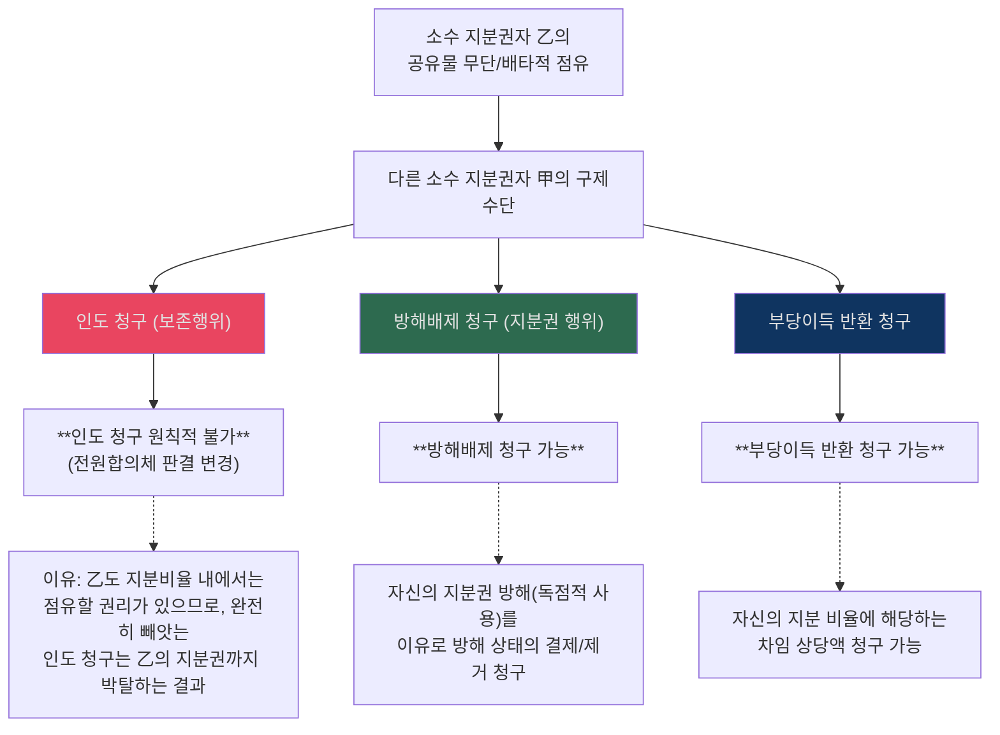

- `판례 포인트`: 공유자의 점유는 지분을 넘는 부분을 관념적으로 분리해 타인 점유로 볼 수 없으므로, 건물 점유자에 대한 `퇴거 청구`는 허용되지 않는다.
  - 근거 위치: [《민법의_기초이론_3_전경운_중간모답_10~23_목차볼드_p061-090.md》 L549-559 | "공유자가 건물을 점유하는 것은 그 소유 지분과 관계없이 자기 소유의 건물에 대한 점유로 보아야 하고, 소유 지분을 넘는 부분을 관념적으로 분리하여 그 부분을 타인의 점유라고 볼 수 없다"]
- `주요 판례문구`: "토지 소유자는 토지 소유권에 기한 방해배제청구권의행사로써 그 지상 건물의 철거와 해당 토지의 인도를 구할 수 있을 뿐이고 건물의 점유 자체를 회복하거나"; "철거집행 전까지 토지 점유에 관한 부당이득반환 등을 청구하는 방법으로 권리구제를 받을 수 있다"; "을은 갑에게 퇴거를 청구할 수 없다"
  - 근거 위치: [《민법의_기초이론_3_전경운_중간모답_10~23_목차볼드_p061-090.md》 L560-565 | "토지 소유자는 토지 소유권에 기한 방해배제청구권의행사로써 그 지상 건물의 철거와 해당 토지의 인도를 구할 수 있을 뿐이고 건물의 점유 자체를 회복하거나"] [《민법의_기초이론_3_전경운_중간모답_10~23_목차볼드_p061-090.md》 L570-573 | "철거집행 전까지 토지 점유에 관한 부당이득반환 등을 청구하는 방법으로 권리구제를 받을 수 있다"] [《민법의_기초이론_3_전경운_중간모답_10~23_목차볼드_p061-090.md》 L570-573 | "을은 갑에게 퇴거를 청구할 수 없다"]

### 📊 과반수/소수 지분권자의 임대차행위 비교
| 임대인 지분 비율 | 소수 지분권자 乙의 임차인 丙에 대한 권리행사 가부 |
|---|---|
| **甲(임대인)이 과반수 지분(예: 3/5)** | 丙의 점유는 **적법** (관리행위로서 유효). 따라서 乙은 丙에게 **인도 청구 ✗**, **부당이득반환 청구 ✗**. (단, 乙은 임대인 甲에게 자신의 지분만큼 차임 상당 부당이득반환 청구 가능) |
| **甲(임대인)이 소수 지분(예: 2/5)** | 丙의 점유는 **불법** (비율초과 관리행위 무효). 따라서 乙은 보존행위로서 丙에게 **인도 청구 ○**. 또한 자신의 지분비율 내에서 丙에게 **부당이득반환 청구 ○**. |

---

## 12. 전체 흐름 다이어그램
> 전체 구조: §0.소스범위 > §0-1.읽는순서 > §1.범위지도 > §2.물권총론 > §3.부동산변동 > §4.가등기 > §5.등기효력 > §6.동산변동 > §7.취득시효 > §8.비법률행위변동 > §9.명인방법 > §10.기타정리 > §11.학설비교 > §11-A.공유침해 > **§12.흐름도** > §13.명의신탁IRAC > §14.포섭포인트 > §15.시효IRAC > §16.통행권 > §17.점유반환

### 📊 민3 중간 전체 학습 순서
| 단계 | 주제 |
|:---:|---|
| 1 | 물권법 총론 — 법정주의·청구권 |
| 2 | 유인성·무인성 — 진정명의회복 |
| **3** | **가등기·이중등기·중간생략등기** |
| 4 | 등기청구권 — 추정력·유용 |
| 5 | 동산변동 — 선의취득·도품 |
| **6** | **취득시효 — 자주점유** |
| 7 | 비법률행위변동 — 명인방법·소멸 |

---

## 13. [사례형 IRAC] 명의신탁 특수 쟁점
> 전체 구조: §0.소스범위 > §0-1.읽는순서 > §1.범위지도 > §2.물권총론 > §3.부동산변동 > §4.가등기 > §5.등기효력 > §6.동산변동 > §7.취득시효 > §8.비법률행위변동 > §9.명인방법 > §10.기타정리 > §11.학설비교 > §11-A.공유침해 > §12.흐름도 > **§13.명의신탁IRAC** > §14.포섭포인트 > §15.시효IRAC > §16.통행권 > §17.점유반환

### 📊 명의신탁 3유형 분류표 — ★★★
| 유형 | 구조 | 효력 핵심 | 소유권 귀속 / 기본 구제 |
|---|---|---|---|
| **이전형 명의신탁 (2자간)** | 원소유자 명의의 부동산을 수탁자 앞으로 이전등기 | 명의신탁약정 무효, 그에 따른 물권변동도 무효 | 소유권은 여전히 신탁자에게 있고, 수탁자는 대내외적으로 소유권 주장 불가 |
| **중간생략형 명의신탁 (3자간, 등기명의신탁)** | 신탁자가 매도인과 계약, 등기만 수탁자 앞으로 | 명의신탁약정 무효, 수탁자 앞으로의 등기 무효, 매매계약은 유효 | 소유권은 매도인에게 남고, 신탁자는 매도인에게 소이등 청구 + 매도인을 대위해 수탁자 명의 말소 |
| **계약명의신탁** | 수탁자가 직접 계약당사자로 매도인과 계약 | 매도인 **선의**면 물권변동 유효, **악의**면 무효 | 선의면 수탁자 소유, 악의면 매도인 소유. 신탁자는 금전 부당이득반환 등 채권적 구제 검토 |

- `[구별 기준]` 3자간 등기명의신탁과 계약명의신탁의 구별은 결국 `누가 계약당사자인가`를 확정하는 문제다.
- `[판례 요지]` 등기명의신탁에서 신탁자는 수탁자에게 직접 소유권이전등기를 청구할 수 없고, 매도인을 대위하여 수탁자 명의 등기의 말소를 구해야 한다.
- 근거 위치: [《전경운_민법_물총_26_p241-270.md》 L588-L595 | "명의신탁에는 3가지 유형이 있는 것으로 설명되고, 그에 따라 효력에 차이가 있다"] [《전경운_민법_물총_26_p241-270.md》 L590-L595 | "이전형 명의신탁"] [《전경운_민법_물총_26_p241-270.md》 L707-L721 | "중간생략형 명의신탁（등기명의신탁, 3자간 명의신탁）"] [《전경운_민법_물총_26_p241-270.md》 L714-L721 | "명의신탁자는 매도인에 대하여 소유권이전등기청구권을 가진다"] [《전경운_민법_물총_26_p241-270.md》 L717-L721 | "명의신탁자는 명의수탁자를 상대로 부당이득반환을 원인으로 하여 소유권이전등기를 청구할 수 없다고 한다"] [《전경운_민법_물총_26_p241-270.md》 L733-L746 | "구별은 계약당사자가 누구인가를 확정하는 문제로 귀결"] [《전경운_민법_물총_26_p241-270.md》 L802-L816 | "계약명의신탁（위임형 명의신탁）"] [《전경운_민법_물총_26_p241-270.md》 L806-L816 | "매도인의 선의.악의에 따라 그 효력을 달리한다"]

### 📊 명의신탁 분류 추가 포인트
| 구별 축 | 내용 | 빠른 기준 |
|---|---|---|
| **핵심 질문** | 누가 매도인과 계약했는가 | 계약당사자 기준으로 2자간/3자간/계약명의신탁 분리 |
| **계약명의신탁 선의** | 수탁자 완전 취득 | 매도인 선의 여부를 먼저 본다 |
| **계약명의신탁 악의** | 물권변동 무효, 금전적 청구 검토 | 부동산 자체 반환청구가 바로 되지 않는 구조 주의 |

- `[교재 정리]` 명의신탁 3유형 구별은 결국 계약당사자가 누구인지가 기준이고, 계약명의신탁은 매도인 선의·악의에 따라 결론이 갈린다.
  - 근거 위치: [《전경운_민법_물총_26_p241-270.md》 L734 | "구별은 계약당사자가 누구인가"] [《전경운_민법_물총_26_p241-270.md》 L815 | "매도인이 선의인 때에는 수탁자는 완전히 물권을 취득"]

#### ✍️ 명의신탁 모답형 (조문·판례 구조)

> **[조문]** 부동산실권리자명의등기에관한법률(부실법) §4①에 의하면, 명의신탁약정은 무효이고, 그에 의한 등기로 이루어진 부동산물권변동도 무효이다. 다만 §4②단서에 의하면, 계약명의신탁에서 매도인이 명의신탁 사실을 알지 못한 경우에는 그 물권변동의 효력에 영향을 미치지 아니한다.
>
> **[판례]** 판례는 명의신탁 유형의 "구별은 계약당사자가 누구인가"에 달려 있다고 보며, 계약명의신탁에서 "매도인이 선의인 때에는 수탁자는 완전히 물권을 취득"한다고 한다. 반면 매도인이 악의이면 물권변동이 무효가 되어 소유권은 매도인에게 남는다.
>
> **[포섭·결론]** 따라서 본 사안에서는 ① 2자간 명의신탁, 3자간 등기명의신탁, 계약명의신탁 중 어느 유형인지를 먼저 분류하고, ② 계약명의신탁이라면 매도인의 선의·악의에 따라 물권변동의 효력을 나누어 검토한다. 매도인 악의 시에는 부동산 자체가 아닌 금전적 청구구조(부당이득반환 등)를 검토한다.

- 근거 위치: [《전경운_민법_물총_26_p241-270.md》 L734 | "구별은 계약당사자가 누구인가"] [《전경운_민법_물총_26_p241-270.md》 L815 | "매도인이 선의인 때에는 수탁자는 완전히 물권을 취득"]

### 📊 명의신탁 해지
| 단계 | 문장형 정리 | 원칙·예외 |
|---|---|---|
| **① 해지권 행사** | 명의신탁자는 언제든지 명의신탁을 해지하고 재산반환을 청구할 수 있다. | 채권자도 채권자대위권으로 행사 가능하다. |
| **② 일부 해지** | 수탁자가 여러 명이면 일부 수탁자에 대해서만 해지할 수 있다. | 해지의 불가분성이 그대로 적용되지 않는다. |
| **③ 내부관계** | 신탁자는 종료만을 이유로 이전등기를 청구할 수 있고, 소유권에 기해 청구하는 경우 시효소멸 문제도 다르게 본다. | 소유권에 기한 청구는 시효소멸 대상이 아니다. |
| **④ 외부관계** | 해지효과는 장래효에 그치므로 소유권이 당연히 신탁자에게 복귀하지 않는다. | 재이전등기 전까지 외부적으로는 수탁자가 소유자다. |
| **⑤ 제3자 처분** | 수탁자가 먼저 제3자에게 처분하면 제3자는 적법하게 취득하고 수탁자의 이전의무는 이행불능이 된다. | 부부간 명의신탁 종료 후 직접처분은 일반채권자에 대한 사해행위가 될 수 있다. |

- `송영곤 쟁점노트`: ① 명의신탁 해지는 `언제든지` 가능하고, ② 일부 수탁자에 대한 부분해지도 되며, ③ 내부적으로는 이전등기청구·소유권기한 청구를 나누고, ④ 외부적으로는 소급효가 없어 재이전 전까지 수탁자 소유로 남는다는 점을 한 번에 적어 두어야 한다.
  - 근거 위치: [《민사법쟁점노트_재산법_26_p601-616.md》 p.602 | "언제든지"] [《민사법쟁점노트_재산법_26_p601-616.md》 p.602 | "채권자대위권"] [《민사법쟁점노트_재산법_26_p601-616.md》 p.602 | "일부에 한하여 해지의 효과"] [《민사법쟁점노트_재산법_26_p601-616.md》 p.602 | "소유명의의 이전등기절차이행을 청구"] [《민사법쟁점노트_재산법_26_p601-616.md》 p.602 | "시효소멸 대상이 아님"] [《민사법쟁점노트_재산법_26_p601-616.md》 p.602 | "소급하지 않고 장래에 향하여 효력이 있음"] [《민사법쟁점노트_재산법_26_p601-616.md》 p.602 | "적법하게 소유권을 취득"] [《민사법쟁점노트_재산법_26_p601-616.md》 p.602 | "사해행위에 해당"]
- `암기 문장`: ① 명의신탁 해지는 `언제든지 가능`, ② 효과는 `장래효`라서 당연복귀가 아니고, ③ 재이전 전 처분은 제3자에게 유효하며, ④ 부부간 명의신탁 종료 후 직접처분은 사해행위까지 연결된다.

### 📝 중간생략등기명의신탁 (제3자간 명의신탁)
**사례 개요**: 신탁자 甲이 매도인 乙과 매매계약을 체결하되, 등기는 수탁자 丙 명의로 바로 이전하기로 합의함 (부동산실명법 위반).

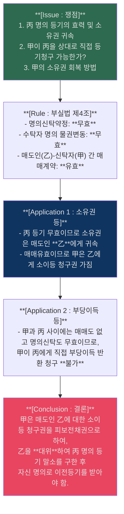
> [!NOTE] 판례 근거 (소유권 이전 청구 불가)
> 대법원 판례에 따르면, 제3자간 명의신탁에서 신탁자는 수탁자에게 소유권이전등기를 직접 청구할 수 없으며, 매도인을 대위하여 수탁자 명의 등기의 말소를 구하여야 함. (다만 丙이 자의로 甲에게 이전등기해준 경우 실체관계 부합 유효)

### 📊 계약명의신탁 매도인 선/악의 비교
수탁자 丙이 계약당사자가 되어 매도인 乙과 매매계약을 체결한 경우 (자금 제공자 甲)

| 매도인(乙) | 명의신탁 효력 | 매매·등기 효력 | 소유권자 | 신탁자(甲)의 구제수단 (부당이득 반환 범위) |
|---|---|---|---|---|
| **선의** (부실법 §4② 단서) | **무효** | **유효** | 수탁자 **丙** | 丙이 유효하게 소유권을 취득하므로, 甲은 **제공한 매수자금 상당의 부당이득반환**만 청구 가능. (부동산 자체 청구 불가) |
| **악의** | **무효** | **무효** | 매도인 **乙** | 丙의 등기가 무효이므로 甲과 丙 모두 소유권 취득 불가. 甲은 丙에게 부당이득으로 반환받은 돈을 청구하고, 매도인 乙에게 별도 청구 불가. |

---

**사례문제: 종중 명의신탁 부동산에서의 취득시효와 수탁자의 매수** `[송영곤 사례연습 물권 p.31]`

> X토지는 甲종중 소유인데 종중원 乙에게 명의신탁되어 乙 명의로 등기되어 있었다. A가 X토지를 20년간 소유의 의사로 점유하여 시효가 완성되었다. 시효완성 후 乙이 甲종중으로부터 X토지를 매수하여 완전한 소유권을 취득한 상태에서, A가 시효완성을 이유로 이전등기를 소구하고자 한다. A는 乙을 상대로 청구할 수 있는가?

**쟁점**: 종중-종중원 명의신탁(부실법 적용 제외)에서의 대외적 소유권 귀속, 수탁자가 신탁자로부터 매수한 후 시효취득자의 지위

**풀이 요지**:
> [조문] 부동산실명법 §8 제1호 → 종중-종중원 명의신탁은 부실법 적용이 제외되어 종전 판례 법리에 따른다. → [판례] 명의신탁된 부동산의 소유권은 대외적으로 수탁자에게 귀속되므로 수탁자 명의 등기는 유효하다. 수탁자가 그 후 신탁자로부터 부동산을 매수하더라도 이는 내부적 소유권 취득에 불과하고, 대외적으로는 소유권이나 등기명의에 아무런 변동이 없다. 따라서 시효취득자는 수탁자를 상대로 취득시효 완성을 원인으로 소유권이전등기를 청구할 수 있다(대판 1989.10.27. [[88다카23506]]). → 결론: A는 乙을 상대로 시효완성을 이유로 이전등기를 청구할 수 있다.

---

## 14. 교재·기출·사례문제 기반 포섭 포인트
> 전체 구조: §0.소스범위 > §0-1.읽는순서 > §1.범위지도 > §2.물권총론 > §3.부동산변동 > §4.가등기 > §5.등기효력 > §6.동산변동 > §7.취득시효 > §8.비법률행위변동 > §9.명인방법 > §10.기타정리 > §11.학설비교 > §11-A.공유침해 > §12.흐름도 > §13.명의신탁IRAC > **§14.포섭포인트** > §15.시효IRAC > §16.통행권 > §17.점유반환

### 📊 빈출 쟁점 답안형 체크
| 쟁점 | 답안 첫 문장 | 포섭 포인트 |
|---|---|---|
| **[모의답안] 물권적 청구권** | 현재의 침해 또는 침해 위험이 객관적으로 존재하고 상대방에게 정당한 권원이 없는지를 먼저 적는다 | 과거 침해만으로는 부족하고, 권리남용 항변 가능성까지 본다 |
| **[판례] 등기청구권** | 판례는 법률행위에 의한 등기청구권을 원칙적으로 `채권적 청구권`으로 본다고 시작한다 | 다만 인도·사용수익 중이면 소멸시효 문제를 따로 적는다 |
| **[판례] 중간생략등기** | `3자 합의` 유무를 먼저 쓰고, 없으면 채권자대위 가능성으로 내려간다 | 합의가 있어도 최초 매도인의 대금항변이 사라지는 것은 아니다 |
| **[판례] 이중의 점유개정·선의취득** | 먼저 점유개정 받은 자가 취득하고, 제2양수인은 `현실의 인도`가 있어야 선의취득 문제로 넘어간다 | 점유개정만으로는 선의취득이 부정된다 |
| **[기출정리] 취득시효** | `자주점유 추정`을 출발점으로 쓰되, 새로운 권원이나 소유의사 표시가 있는지 확인한다 | 타주점유자는 곧바로 시효취득으로 가지 않고 전환요건을 적어야 한다 |

- `[모의답안]` 물권적 청구권은 물권의 실효성 확보를 위한 절대적 보호수단이므로, 사례형에서는 `침해사실의 객관성`과 `침해의 위법성`을 먼저 적는 구성이 가장 안정적이다.
  - 근거 위치: [《민법의_기초이론_3_전경운_주제별_모의답안_p001-012.md》 L5 | "현재하는 침해사실이 객관적으로 존재해야 한다"] [《민법의_기초이론_3_전경운_주제별_모의답안_p001-012.md》 L5 | "상대방에게 정당한 권원이 있는 경우에는 물권적 청구권이 인정되지 않는다"]
- `[모의답안]` 등기청구권은 원칙적으로 채권적 청구권이지만, 매수인이 목적물을 인도받아 사용·수익하고 있으면 권리 위에 잠자는 자가 아니므로 소멸시효가 진행하지 않는다고 정리한다.
  - 근거 위치: [《민법의_기초이론_3_전경운_주제별_모의답안_p001-012.md》 L23 | "등기청구권을 채권적 청구권으로 파악"] [《민법의_기초이론_3_전경운_주제별_모의답안_p001-012.md》 L23 | "매수인의 등기청구권은 다른 채권과는 달리 소멸시효에 걸리지 않는다고 보며"]
- `[모의답안]` 중간생략등기는 판례상 `3자 합의`가 있으면 적극적 이행청구까지 가능하지만, 최초 매도인의 중간자에 대한 대금항변은 그대로 남는다.
  - 근거 위치: [《민법의_기초이론_3_전경운_주제별_모의답안_p001-012.md》 L20 | "판례는 3자의 합의가 있는 경우에 이를 인정한다"] [《민법의_기초이론_3_전경운_주제별_모의답안_p001-012.md》 L20 | "최초 매도인은 인상된 매매대금이 지급되지 않았음을 이유로 최종 매수인 명의로의 소유권이전등기의무의 이행을 거절할 수 있다"]
- `[기출정리]` 이중의 점유개정에서는 먼저 점유개정에 의해 양수받은 자가 소유권을 취득하고, 뒤의 양수인은 [[선의취득]] 요건을 갖추지 못하면 소유권을 취득할 수 없다.
  - 근거 위치: [《민법의_기초이론_3_전경운_중간고사_합본_p001-030.md》 L400-408 | "먼저 점유개정에 의하여 양수받은 자가 소유권을 취득하며"] [《민법의_기초이론_3_전경운_중간고사_합본_p001-030.md》 L400-408 | "점유개정으로는 선의취득이 인정되지 아니하므로"]
- `[기출정리]` 자주점유 추정에서 출발하더라도, 타주점유가 자주점유로 전환되려면 새로운 권원 또는 소유의사 표시가 필요하다는 점을 적어야 취득시효 포섭이 안정된다.
  - 근거 위치: [《민법의_기초이론_3_전경운_중간고사_합본_p001-030.md》 L533-541 | "점유자는 소유의 의사로써 점유하는 자주점유로 추정된다"] [《민법의_기초이론_3_전경운_중간고사_합본_p001-030.md》 L533-541 | "타주점유가 자주점유로 전환되려면"]

---

## 15. [사례형 IRAC] 점유취득시효 완성과 등기청구권 (청구권/항변 구조)
> 전체 구조: §0.소스범위 > §0-1.읽는순서 > §1.범위지도 > §2.물권총론 > §3.부동산변동 > §4.가등기 > §5.등기효력 > §6.동산변동 > §7.취득시효 > §8.비법률행위변동 > §9.명인방법 > §10.기타정리 > §11.학설비교 > §11-A.공유침해 > §12.흐름도 > §13.명의신탁IRAC > §14.포섭포인트 > **§15.시효IRAC** > §16.통행권 > §17.점유반환

**사례 개요**: 甲이 乙 소유의 토지를 소유의 의사로 평온, 공연하게 20년간 점유하여 취득시효기간이 만료됨. 甲의 권리 구제 수단과 자주점유의 입증 책임은?

### 📝 IRAC 플로우 및 근거 포섭
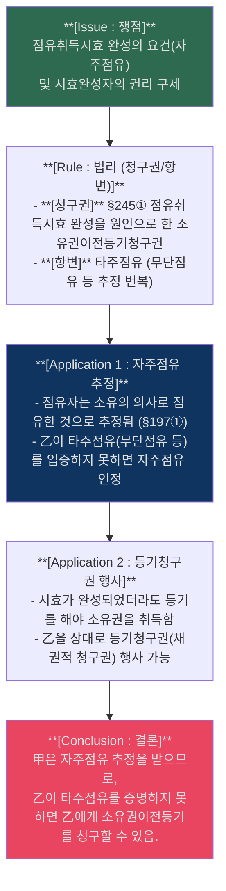

- `[Rule/Application 포섭 근거]` (Rule #25 적용): 점유자는 자주점유로 추정되지만, 타주점유가 자주점유로 전환되려면 새로운 권원이나 소유의사 표시가 요구된다.
  - 근거 위치: [《민법의_기초이론_3_전경운_중간고사_합본_p001-030.md》 L533-541 | "자주점유 추정"] [《민법의_기초이론_3_전경운_중간고사_합본_p001-030.md》 L533-541 | "타주점유 전환 요건"]

---

## 16. 주위토지통행권 (§219~§220) — 보강
> 전체 구조: §0.소스범위 > §0-1.읽는순서 > §1.범위지도 > §2.물권총론 > §3.부동산변동 > §4.가등기 > §5.등기효력 > §6.동산변동 > §7.취득시효 > §8.비법률행위변동 > §9.명인방법 > §10.기타정리 > §11.학설비교 > §11-A.공유침해 > §12.흐름도 > §13.명의신탁IRAC > §14.포섭포인트 > §15.시효IRAC > **§16.통행권** > §17.점유반환

### 📊 §219 (주위토지통행권) 조문 요건 분리

| 항 | 조문 원문 (요건 분리) | 효과 |
|---|---|---|
| **§219①** | 1) **어느 토지와 공로 사이에 그 토지의 용도에 필요한 통로가 없는** 경우에 2) 그 **토지소유자**는 | 주위의 토지를 **통행**할 수 있고 필요한 경우에는 **통로를 개설**할 수 있다 |
| **§219②** | 위 통행권자는 | 통행지 소유자의 **손해가 가장 적은 장소와 방법**을 선택하여야 한다 |
| **§219③** | 통행권자는 | 통행지 소유자의 **손해를 보상**하여야 한다 |

- 요건 1) "공로에의 통로 없음": 맹지(袋地), 즉 공로에 접하지 않아 통행이 불가능하거나 과다한 비용을 요하는 토지.
- 요건 2) "토지소유자": 소유자뿐 아니라 지상권자·전세권자·임차인도 유추적용 가능(판례).

| 쟁점 | 판례 태도 | 답안 포인트 |
|---|---|---|
| **통행권의 법적 성질** | 법정 물권적 청구권(상린관계) | 당사자 합의 없이 법률상 당연히 발생 |
| **주변 도로가 있으나 불충분한 경우** | 기존 통로가 있더라도 토지의 이용에 적합하지 않으면 §219 적용 가능 | "토지의 용도에 필요한 통로"가 있는지를 기준으로 판단 |
| **손해 최소 원칙** | 통행지 소유자에게 가장 손해가 적은 방법 선택 의무 | 여러 경로 중 손해 최소 경로를 특정해야 |
| **보상** | 손해보상은 통행권 행사의 조건 | 보상 없이 통행권만 주장하면 인용 곤란 |
| **통행권의 범위** | 통행권은 토지의 용도에 필요한 범위로 제한 | 건축을 위한 차량 통행은 건축 완료 시까지 등 |

### 📊 §220 (분할·일부양도와 주위토지통행권)

| 조문 | 요건 | 효과 |
|---|---|---|
| **§220** | 1) **분할**로 인하여 또는 토지의 **일부 양도**로 인하여 2) 공로에 통하지 못하는 토지가 있는 때 | 그 토지소유자는 **공로에 출입하기 위하여 다른 분할자의 토지를 통행**할 수 있다. 이 경우 **보상의 의무가 없다** |

- `§219 vs §220 비교`:
  - §219: 일반 맹지 → 주위 **어떤** 토지든 통행 가능, **보상 필요**
  - §220: 분할·일부양도로 인한 맹지 → **분할 상대방** 토지만 통행, **보상 불요**

---

## 17. 점유물반환청구권 (§204~§206) 조문 보강
> 전체 구조: §0.소스범위 > §0-1.읽는순서 > §1.범위지도 > §2.물권총론 > §3.부동산변동 > §4.가등기 > §5.등기효력 > §6.동산변동 > §7.취득시효 > §8.비법률행위변동 > §9.명인방법 > §10.기타정리 > §11.학설비교 > §11-A.공유침해 > §12.흐름도 > §13.명의신탁IRAC > §14.포섭포인트 > §15.시효IRAC > §16.통행권 > **§17.점유반환**

### 📊 §204 (점유의 회수) 조문 요건 분리

| 항 | 조문 원문 (요건 분리) | 효과 |
|---|---|---|
| **§204①** | 1) **점유자**가 2) **점유의 침탈**을 당한 때에는 | 그 **물건의 반환** 및 **손해의 배상**을 청구할 수 있다 |
| **§204②** | 위 청구권은 3) **침탈을 당한 날로부터 1년** 내에 행사하여야 한다 | **제척기간** (소멸시효가 아님) |

### 📊 §205 (점유의 보유) 조문 요건 분리

| 조문 | 조문 원문 (요건 분리) | 효과 |
|---|---|---|
| **§205①** | 1) **점유자**가 2) **점유의 방해**를 받은 때에는 | 그 **방해의 제거** 및 **손해의 배상**을 청구할 수 있다 |
| **§205②** | 위 청구권은 **방해가 존속하는 동안** 또는 **방해가 종료한 날로부터 1년** 내에 | 행사하여야 한다 |

### 📊 §206 (점유의 보전) 조문 요건 분리

| 조문 | 조문 원문 (요건 분리) | 효과 |
|---|---|---|
| **§206** | 1) **점유자**가 2) **점유의 방해를 받을 염려**가 있는 때에는 | 그 **방해의 예방** 또는 **손해배상의 담보**를 청구할 수 있다 |

### 📊 점유보호청구권 vs 물권적 청구권 비교표

| 비교축 | 점유보호청구권 (§204~§206) | 소유권 기한 물권적 청구권 (§213~§214) |
|---|---|---|
| **근거** | 점유라는 사실상 지배 보호 | 소유권이라는 물권 보호 |
| **권리 증명** | 점유 사실만 증명 (본권 증명 불요) | 소유권 증명 필요 |
| **제척기간** | 1년 (§204②) | 없음 (소유권 기한은 시효 X) |
| **상대방 항변** | 본권 항변 가능 (§208) | 점유할 권리(임대차 등) 항변 |
| **병행 행사** | 소유자도 점유보호청구권 행사 가능 | — |
| **자력구제** | §209 자력구제 허용 (침탈 직후) | 원칙 불가 |

- `[개념요지]` 점유보호청구권은 점유라는 사실적 지배 자체를 보호하는 제도이므로, 본권(소유권 등)의 유무와 관계없이 점유자이면 행사할 수 있다. 다만 본권에 의한 항변(§208)이 가능하므로 소유자가 방해자에게 점유보호를 구해도 방해자가 본권을 입증하면 기각될 수 있다.
