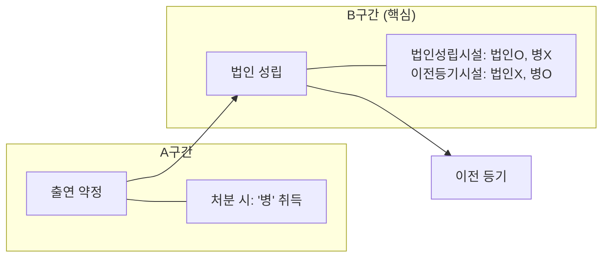
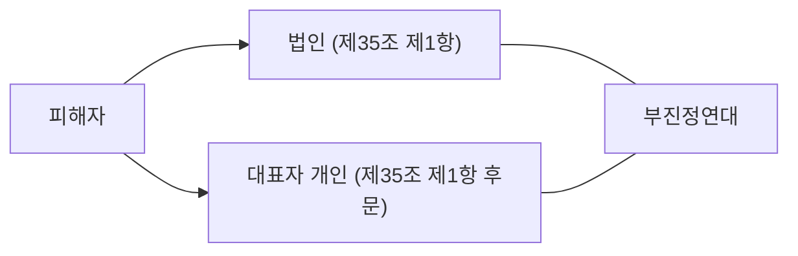

# 출연재산귀속 법인능력

#민법 #송영곤 #기본민법 #수업정리

# 민법강의 수업정리 Part 14 (출연재산 귀속시기 · 법인의 능력)

## 1. 출연재산의 귀속시기

### (1) 법조문 구조

| 조문 | 규율 대상 | 귀속 시기 |
|:-----|:---------|:---------|
| **제47조 제1항** | 생전 처분 → 증여 준용 | 제48조 제1항 |
| **제47조 제2항** | 유언 → 유증 준용 | 제48조 제2항 |
| **제48조 제1항** | 생전 처분 | **법인 성립 시** |
| **제48조 제2항** | 유언 | **유언 효력 발생 시**(사망 시) |

---

### (2) 생전 처분 — 학설 대립 (시험 빈출)

> **쟁점**: 부동산을 출연한 경우, 이전 등기 없이 법인 것이 되는가?

| 학설 | 법인 소유권 취득 시점 | 법적 근거 |
|:-----|:-------------------|:---------|
| **법인성립시설** (다수설) | 법인 성립 시 (등기 불요) | 제187조 |
| **이전등기시설** | 이전 등기 시 → 법인 성립 시로 소급 | 제186조 |
| **판례** | 대내적: 법인 성립 시 / 대외적: 등기 필요 | (비판 多) |

### (3) 학설 차이가 나타나는 경우

- **A구간** (법인 성립 전 처분): 제3자('병')가 소유권 취득 → 학설 불문
- **B구간** (법인 성립 후~이전 등기 전 처분):
  - **법인성립시설**: 이미 법인 것 → 타인 권리 매매 → 병 무효 → **법인 등기 말소 청구 가능**
  - **이전등기시설/판례**: 아직 출연자 것 → 병 유효 취득

---

### (4) 유언에 의한 출연 (제48조 제2항)

> **문제점**: 출연자 사망 시 법인이 아직 성립하지 않음 (귀속 주체 부존재)

**제48조 제2항의 취지** (곽윤직):

- 적극적 귀속 주장이 아니라 **상속재산에서 배제**하는 의미
- 상속인이 처분하면 → **무권리자 처분행위** → 물권변동 불발생

**구별해야 할 상황**:

| 유언 내용 | 성질 | 결론 |
|:---------|:-----|:-----|
| "X 건물로 재단법인 설립하라" | 법인 설립 유언 | 상속재산 X |
| "X 건물을 기존 A법인에 기부하라" | 특정유증 | 상속재산 O → A법인이 상속인에게 청구 |

---

## 2. 법인의 권리능력

### (1) 권리능력의 범위

| 제한 요소 | 내용 |
|:---------|:-----|
| **법률의 규정** | 개별법(의료법, 사립학교법 등)에 따른 제한 |
| **정관의 목적** | 정관에 기재된 목적 범위 내 |
| **성질** | 자연인에게만 인정되는 권리(생명권 등) 불가 |

### (2) 정관 목적의 해석

| 학설 | 내용 | 판례 |
|:-----|:-----|:----:|
| **협의설** (판례) | 정관에 명시된 목적 달성에 **필요한** 행위만 | O |
| **광의설** | 정관 목적에 **위배되지 않는** 행위까지 가능 | X |

---

## 3. 법인의 불법행위능력 (제35조) — **특A급 쟁점**

### (1) 요건

| 요건 | 내용 |
|:-----|:-----|
| ① 주체 | **이사 기타 대표자** |
| ② 행위 | **직무에 관하여** (외형이론 적용) |
| ③ 결과 | 타인에게 **손해** 발생 |

### (2) 효과 — 책임 주체

- **법인 + 대표자 개인** 모두 손해배상 책임
- 관계: **부진정연대채무**
- 대표자는 법인 배상으로 자기 책임 면제 불가

### (3) 목적 범위 외 행위 (제35조 제2항)

- **법인은 책임 없음**
- **의결 찬성자, 집행자** (사원, 이사 등) 개인이 **연대** 배상
- 법조문은 "연대"이나 해석상 **부진정연대**로 봄

---

## 4. 복습 포인트

- [ ] **법인성립시설 vs 이전등기시설**: B구간(법인 성립~이전 등기) 처분 시 결론 달라짐
- [ ] **제48조 제2항 취지**: 상속재산 배제 → 상속인 처분은 무권리자 처분
- [ ] **불법행위능력(제35조)**: 이사 + 직무에 관하여 + 손해 → 법인·대표자 부진정연대
- [ ] **정관 목적 해석**: 판례는 협의설 (필요한 행위만)

---

## Source & Context

- **과목**: #민법
- **강사**: #송영곤
- **강의**: 기본민법
- **출처**: [[part14]]
- **Original File**: `2-14_민법_송영곤_기본민법_수업정리_part14(출연재산귀속_법인능력).md`
