# 형법의 기초이론 I 서보학 기말 암기정리노트 (도표추가본)

## 0. 범위 전제
- 기말 강의록 범위: `자구행위`, `추정적 승낙`, `정당행위`, `책임론`, `원인에 있어서 자유로운 행위`, `금지착오`, `강요된 행위`, `과실범론`, `결과적 가중범`, `부작위범론`, `미수론`, `정범 및 공범론`.
- 기말 요약본 **반복 표시(★)**: `신뢰의 원칙 ★ 17, 20`, `부작위범 17, 20, 23`, `불능미수 ★ 17, 20`, `공모관계이탈 ★ 17, 20, 23`, `공모공동정범 20, 23`, `합동범의 공동정범 ★ 20, 23`, `교사범 20`, `형법 제33조 해석론 ★ 20`.
- `홍형철 보강자료`: `홍형철_쟁점정리_형법_25.pdf`
- `중요도 범례`: `★★★` 메인쟁점·반복출제 / `★★` 요건·비교·포섭축 / `★` 보조쟁점·개념정리

## 0-1. 형법 쟁점정리식 읽는 순서

### 📊 형1 기말 독법
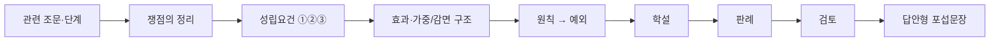

1. 기말도 먼저 **어느 조문·어느 단계 문제인지**와 **쟁점명**을 잡고 읽는다.
2. `위전착`, `금지착오`, `공범론`, `§33`, `결과적 가중범`은 기본적으로 `쟁점의 정리 → 학설 → 판례 → 검토` 순으로 읽는다.
3. `추정적 승낙`, `정당행위`, `강요된 행위`, `과실범`, `부작위범`, `미수론`처럼 조문요건이 뚜렷한 파트는 `요건 ①②③ → 효과 → 원칙·예외 → 판례 → 검토` 순으로 본다.
4. 공범론은 언제나 **누구에게 어느 구성요건이 귀속되는지**를 중심으로 보고, 판례와 다수설이 갈리면 둘을 나눠 적는다.
5. 마지막에는 **답안형 포섭문장**으로 바로 써 먹을 수 있게 다시 읽는다.

- `홍형철 구조`: 홍형철 쟁점정리는 사례형에 바로 쓸 수 있게 `쟁점의 정리 - 학설 - 판례 - 검토`를 기본틀로 하고, 연결사안은 답안 목차까지 함께 제시한다.
  - 근거 발췌: "‘쟁점의 정리 - 학설 - 판례 - 검토’ 순서대로 정리"; "답안작성에 필요한 목차와 그에 따른 세부쟁점 내용을 한 번에 정리"
  - 근거 위치: [《홍형철_쟁점정리_형법_ocr_extract.md》 L54-L60 | "‘쟁점의 정리 - 학설 - 판례 - 검토’ 순서대로 정리"] [《홍형철_쟁점정리_형법_ocr_extract.md》 L57-L60 | "답안작성에 필요한 목차와 그에 따른 세부쟁점 내용을 한 번에 정리"]

## 0-2. 홍형철식 쟁점 블록 운영법

| 논점 유형 | 기본 틀 | 이 노트에서의 적용 단원 |
|---|---|---|
| **쟁점형 논점** | `쟁점의 정리 → 학설 → 판례 → 검토 → 모답형` | `2-3A 위전착`, `2-6 금지착오`, `2-9 결과적 가중범`, `2-12 정범·공범론` |
| **조문형 논점** | `조문·요건 ①②③ → 효과 → 원칙·예외 → 판례 → 검토 → 모답형` | `2-2 추정적 승낙`, `2-3 정당행위`, `2-7 강요된 행위`, `2-8 과실범`, `2-10 부작위범`, `2-11 미수론` |
| **사례연결형 논점** | `쟁점별 소제목 → 각 쟁점 안에서 같은 순서 → 결론` | `보라매병원`, `불능미수`, `공모관계이탈`, `교사범 이탈` |

- `운영 기준`: 기말은 요건이 뚜렷한 파트가 많아서 조문형이 기본이지만, 학설대립이 강한 파트는 홍형철식 4단을 그대로 붙이는 혼합형이 가장 효율적이다.
  - 근거 발췌: "쟁점의 정리"; "견해의 대립"; "판례의 태도"; "검토"; "답안작성에 필요한 목차"
  - 근거 위치: [《홍형철_쟁점정리_형법_ocr_extract.md》 L372-L388 | "쟁점의 정리" / "견해의 대립" / "판례의 태도" / "검토"] [《홍형철_쟁점정리_형법_ocr_extract.md》 L1487-L1520 | "답안작성에 필요한 목차"]

### 📊 기말 범위 체계도
```mermaid
flowchart TD
    FINAL["기말 범위"] --> WA["위법성조각사유 후반"]
    FINAL --> RES["책임론"]
    FINAL --> SPE["특수 범죄유형"]
    FINAL --> ATT["미수론"]
    FINAL --> COM["정범·공범론"]
    
    WA --> W1["자구행위"]
    WA --> W2["추정적 승낙"]
    WA --> W3["정당행위"]
    
    RES --> R1["책임능력·심신장애"]
    RES --> R2["원자행위"]
    RES --> R3["금지착오"]
    RES --> R4["강요된 행위"]
    
    SPE --> S1["과실범"]
    SPE --> S2["결과적 가중범"]
    SPE --> S3["부작위범 ★★★"]
    
    ATT --> A1["장애미수"]
    ATT --> A2["중지미수"]
    ATT --> A3["불능미수 ★★"]
    
    COM --> C1["공동정범·공모공동정범"]
    COM --> C2["공모관계이탈 ★★★"]
    COM --> C3["간접정범"]
    COM --> C4["교사범·방조범"]
    COM --> C5["공범과 신분 §33 ★★"]
    
    style S3 fill:#e94560,color:#e0e0e0
    style A3 fill:#e94560,color:#e0e0e0
    style C2 fill:#e94560,color:#e0e0e0
    style C5 fill:#e94560,color:#e0e0e0
```

### 📊 기말 기출 반복 빈도표
| 쟁점 | 17 | 20 | 23 | 빈도 | 등급 |
|---|:---:|:---:|:---:|:---:|:---:|
| **부작위범** | ✅ | ✅ | ✅ | 3/3 | ★★★ |
| **공모관계이탈** | ✅ | ✅ | ✅ | 3/3 | ★★★ |
| **불능미수** | ✅ | ✅ | | 2/3 | ★★ |
| **공모공동정범** | | ✅ | ✅ | 2/3 | ★★ |
| **합동범의 공동정범** | | ✅ | ✅ | 2/3 | ★★ |
| **신뢰의 원칙** | ✅ | ✅ | | 2/3 | ★★ |
| **§33 해석론** | | ✅ | | 1/3 | ★ |
| **교사범** | | ✅ | | 1/3 | ★ |
| **장애미수** | ✅ | | | 1/3 | |
| **중지미수** | ✅ | | | 1/3 | |
| **결과적 가중범** | | | ✅ | 1/3 | |

---

## 1. 봐야할 강의
### 최소
- `25~30강 (교안 176~258)`: 위법성조각사유 + 책임론. 기말 강의록 시작블록.
- `10~12강 (교안 79~97)`: 부작위범 ★★★. 보라매병원·노모·경찰관 사례.
- `18~21강 (교안 130~157)`: 과실·신뢰의 원칙·결과적 가중범.
- `31~33강 (교안 259~287)`: 장애·중지·불능미수.
- `37~46강 (교안 308~385)`: 정범·공범론. 반복 표시 최다.

### 권장
- `34~36강 (교안 288~308)`: 예비·음모 + 공범론 진입.
- `47~53강 (교안 386~493)`: 죄수론·형벌론. 기출 비중 약.

---

## 2. 기말 쟁점별 암기 정리

### 2-1 자구행위
- `의의`: 청구권 **보전** 수단. 보전 vs 실현 구분이 핵심.
- `3단계 요건`: ① 통상적 방법 곤란 → ② 청구권 행사 곤란 대비 → ③ 상당한 행위.
- `판례(84도2582)`: 야간 침입 강제채권추심 = 실현 → 자구행위 부정.
- `판례문구`: "피고인의 강제적 채권추심 내지 이를 목적으로 하는 물품의 취거행위를 형법 제23조 소정의 자구행위라고 볼 수 없다." [《형법의_기초이론_1_서보학_기말_판례_정리_김혜선.docx》 문단 4 | "피고인의 강제적 채권추심 내지 이를 목적으로 하는 물품의 취거행위를 형법 제23조 소정의 자구행위라고 볼 수 없다."]
- `교수님 저서 보강1`: 자구행위는 청구권의 `보전`을 위한 사후적 긴급행위이고, 정당방위·긴급피난보다 보충성 원칙이 더 엄격하게 요구된다. [《서보학_형법총론_18.pdf》 p.221 | "자구행위는 사후적 긴급행위이다"] [《서보학_형법총론_18.pdf》 p.222 | "자구행위에는 엄격한 보충성의 원칙이 적용된다"]
- `교수님 저서 보강2`: 자구행위의 청구권은 채권적 청구권에만 한정되지 않고 물권적 청구권 등도 포함하며, 법정절차에 의한 보전이 불가능하거나 현저히 곤란해야 한다. [《서보학_형법총론_18.pdf》 p.222 | "채권적 청구권 뿐만 아니라 물권적 청구권은 물론 부부친권"] [《서보학_형법총론_18.pdf》 p.224 | "법정절차에 의해 청구권보전이 불가능한 경우에 한하여 인정된다"]
- `암기 문장`: `자구행위는 청구권 보전 / 실현 아님 / 붙잡아 경찰 인도면 상당성 유리`

#### 📊 자구행위·정당행위 수업 판례 보충
| 판례번호 | 쟁점 | 핵심 한 줄 |
|---|---|---|
| **95도2970** | 자구행위 상당성 | 채무자 물품 강제 반출은 상당성 초과 → 자구행위 부정 |
| **2017도18697** | 정당행위·사회상규 | 사회상규 판단 시 동기·수단·법익균형·긴급성·보충성 종합 고려 |
| **93도2899** | 정당행위·업무행위 | 업무로 인한 행위의 정당성 범위 판단 |
- 근거 위치: [《형법의_기초이론_1_서보학_기출_쟁점_판례_범위체크.md》 §5-2 | "95도2970", "2017도18697", "93도2899"]

### 2-2 추정적 승낙

#### 홍형철식 쟁점 프레임
- `조문·요건`: 추정적 승낙은 `① 현실적 승낙 불가 ② 알았다면 승낙했을 객관적 사정 ③ 피해자 이익 부합`을 먼저 적고, 효과는 독립조문이 아니라 `제20조 정당행위`로 닫는다.
  - 근거 발췌: "피해자의 현실적 승낙을 얻을 수 없지만"; "행위 당시의 모든 객관적 사정을 피해자가 알았다면"; "행위가 피해자의 이익에 부합"; "형법 제20조 정당행위"
  - 근거 위치: [《형법의_기초이론_1_서보학_기말_분리정리.md》 L31-L33 | "피해자의 현실적 승낙을 얻을 수 없지만" / "행위가 피해자의 이익에 부합"] [《서보학_형법총론_18.pdf》 p.227 | "행위 당시의 모든 객관적 사정을 피해자가 알았다면"] [《서보학_형법총론_18.pdf》 p.232 | "형법 제20조 정당행위"]
- `의의`: 현실적 승낙 불가 + 알았으면 승낙했을 것 → 제20조 **정당행위**.

#### 📊 추정적 승낙 요건 정리
| 항목 | 내용 |
|---|---|
| **출발점** | 피해자의 현실적 승낙을 받을 수 없는 상황일 것 |
| **판단기준** | 피해자가 그 사정을 알았다면 승낙했을 것으로 합리적으로 추정될 것 |
| **이익관계** | 행위가 피해자의 이익에 부합해야 함 |
| **법적 처리** | 독립 조문이 아니라 `제20조 정당행위`로 위법성조각 |

- `암기 문장`: `추정적 승낙은 알았으면 승낙했을 것 / 제20조 정당행위로 처리`
- `요건 문구`: "피해자의 현실적 승낙을 얻을 수 없지만, 만약 그 사정을 알았다면 승낙했으리라고 추정되는 경우"; "피해자 의사 확인 불가능"; "행위가 피해자의 이익에 부합"
  - 근거 위치: [《형법의_기초이론_1_서보학_기말_분리정리.md》 L31-L33 | "피해자의 현실적 승낙을 얻을 수 없지만, 만약 그 사정을 알았다면 승낙했으리라고 추정되는 경우" / "피해자 의사 확인 불가능" / "행위가 피해자의 이익에 부합"]
- `교수님 저서 보강1`: 추정적 승낙은 현실적 승낙이 없더라도 `행위 당시` 객관적 사정을 피해자가 알았다면 당연히 승낙했을 것으로 추정되는 경우이고, `사후승낙`은 인정되지 않는다. [《서보학_형법총론_18.pdf》 p.227 | "행위 당시의 모든 객관적 사정을 피해자가 알았다면 당연히 승낙했을 것이라고 추정되는 경우"] [《서보학_형법총론_18.pdf》 p.228 | "추정된 승낙일지라도 승낙은 행위시에 있어야 한다" / "사후승낙은 인정되지 않는다"]
- `교수님 저서 보강2`: 효과는 별도 독립조문이 아니라 제20조 정당행위로 처리하는 것이고, 승낙의 일종으로 취급하는 것은 적절치 않다고 정리된다. [《서보학_형법총론_18.pdf》 p.232 | "추정적 승낙이 인정되면 형법 제20조 정당행위의 규정에 따라 위법성이 조각된다" / "피해자의 승낙의 일종으로 취급하는 것은 적절하지 않다"]

#### ✍️ 추정적 승낙 모답형
추정적 승낙은 ① 피해자의 현실적 승낙을 받을 수 없고 ② 행위 당시의 객관적 사정을 피해자가 알았다면 승낙했을 것으로 합리적으로 추정되며 ③ 행위가 피해자의 이익에 부합할 때 인정된다. 효과는 독립 조문이 아니라 제20조 정당행위로 위법성이 조각되고, 사후승낙은 인정되지 않는다.
- 근거 발췌: "피해자의 현실적 승낙을 얻을 수 없지만"; "행위 당시의 모든 객관적 사정을 피해자가 알았다면"; "행위가 피해자의 이익에 부합"; "사후승낙은 인정되지 않는다"
- 근거 위치: [《형법의_기초이론_1_서보학_기말_분리정리.md》 L31-L33 | "피해자의 현실적 승낙을 얻을 수 없지만"] [《서보학_형법총론_18.pdf》 p.227 | "행위 당시의 모든 객관적 사정을 피해자가 알았다면"] [《형법의_기초이론_1_서보학_기말_분리정리.md》 L31-L33 | "행위가 피해자의 이익에 부합"] [《서보학_형법총론_18.pdf》 p.228 | "사후승낙은 인정되지 않는다"]

#### 📊 홍형철 보강: 승낙과 양해과정의 하자
| 쟁점 | 문장형 정리 | 원칙·예외 |
|---|---|---|
| **양해과정의 하자** | 승낙은 법적 의미보다 사실적 성격이 강하므로, 기망 등 하자가 있어도 곧바로 무효라고 단정하지 않는다. | 다만 침해 내용의 본질을 오인시켜 실질적 자기결정이 박탈된 경우에는 승낙의 효력이 문제된다. |
| **실패한 수술** | 수술 승낙이 있었더라도 의료행위의 정당화는 제20조 정당행위 구조로 파악하는 것이 기본이다. | 전제사실을 잘못 알았다면 위전착 문제로 넘어가고, 과실이 남는지는 별도 검토한다. |

- `홍형철 정리`: ① 승낙의 하자는 법률행위식 접근보다 사실적 양해의 하자를 중심으로 보고, ② 실패한 수술은 구성요건 단계보다 위법성조각 단계에서 다루며, ③ 설명·동의의 전제가 잘못되면 위법성조각사유 전제사실 착오로 연결한다.
  - 근거 발췌: "승낙은 사실적 성격"; "2017도18272"; "90도1211"; "위법성조각설"; "과실범"
  - 근거 위치: [《홍형철_쟁점정리_형법_25.pdf》 p.66-67 | "승낙은 사실적 성격"] [《홍형철_쟁점정리_형법_25.pdf》 p.66-67 | "2017도18272"] [《홍형철_쟁점정리_형법_25.pdf》 p.66-67 | "90도1211"] [《홍형철_쟁점정리_형법_25.pdf》 p.68 | "위법성조각설"] [《홍형철_쟁점정리_형법_25.pdf》 p.68 | "과실범"]
- `판례문구`: "설명에 기초한 승낙이 있었다고 하더라도 그 양해과정에 중대한 하자가 있으면 승낙의 효력이 문제될 수 있다"는 축으로 읽고, 수술 사안은 `승낙 + 정당행위` 구조를 함께 적어 두는 것이 안전하다.

### 2-3 정당행위 (제20조)

#### 홍형철식 쟁점 프레임
- `조문·요건`: 정당행위는 `법령에 의한 행위 / 업무로 인한 행위 / 사회상규 부합 행위`를 먼저 적고, 위법 명령과 상관의 명령은 예외형 문제로 뒤에 붙인다.
  - 근거 발췌: "정당행위는 일반적 포괄적 성격"; "법령에 의한 행위"; "업무로 인한 행위"; "사회상규"; "명백한 위법 내지 불법한 명령"
  - 근거 위치: [《서보학_형법총론_18.pdf》 p.232 | "정당행위는 일반적 포괄적 성격"] [《서보학_형법총론_18.pdf》 p.233 | "법령에 의한 행위" / "업무로 인한 행위"] [《서보학_형법총론_18.pdf》 p.245 | "사회상규"] [《형법의_기초이론_1_서보학_기말_판례_정리_김혜선.docx》 문단 10 | "명백한 위법 내지 불법한 명령"]

#### 📊 정당행위 3유형
| 유형 | 내용 | 대표 예 |
|---|---|---|
| ① 법령에 의한 행위 | 법률이 허용·명령하는 행위 | 경찰관의 체포 |
| ② 업무로 인한 행위 | 사회생활상 정당한 업무 | 의사의 수술 |
| ③ 사회상규 부합 행위 | 동기·수단·법익균형·긴급성·보충성 종합 | 사회통념상 허용 |

- `위법 명령(87도2358)`: 명백한 위법 명령에는 복종의무 없음.
- `판례문구`: "명백한 위법 내지 불법한 명령인 때에는 이는 벌써 직무상의 지시명령이라 할 수 없으므로 이에 따라야 할 의무는 없다." [《형법의_기초이론_1_서보학_기말_판례_정리_김혜선.docx》 문단 10 | "명백한 위법 내지 불법한 명령인 때에는 이는 벌써 직무상의 지시명령이라 할 수 없으므로 이에 따라야 할 의무는 없다."]
- `교수님 저서 보강1`: 정당행위는 개별적 위법성조각사유를 넘어서는 `일반적·포괄적` 성격의 조항으로, 가능한 초법규적 정당화사유를 법정화한 규정으로 정리된다. [《서보학_형법총론_18.pdf》 p.232 | "정당행위는 일반적 포괄적 성격을 띤 위법성조각사유이다" / "모든 가능한 초법규적 정당화사유를 법정화했다"]
- `교수님 저서 보강2`: `법령에 의한 행위`, `업무로 인한 행위`, `사회상규에 위배되지 아니하는 행위`는 각각 독자적 의미를 가지며, 마지막 사회상규는 가장 포괄적이고 최종적인 정당화 사유다. [《서보학_형법총론_18.pdf》 p.233 | "정당행위의 다른 두 가지 요소인 법령에 의한 행위와 업무로 인한 행위까지 포섭하고 있지만 그것들은 독자적 의미" ] [《서보학_형법총론_18.pdf》 p.245 | "사회상규는 모든 위법성조각사유에 비해 최종적인 정당화사유이고, 가장 포괄적인 위법조각사유"]
- `암기 문장`: `정당행위는 법령/업무/사회상규 / 위법 명령에 복종의무 없음`

#### ✍️ 정당행위 모답형
정당행위는 ① 법령에 의한 행위, ② 업무로 인한 행위, ③ 사회상규에 위배되지 않는 행위를 포괄하는 일반조항이다. 따라서 먼저 개별 근거가 있는지를 보고, 없더라도 사회상규 단계에서 동기·수단·법익균형·긴급성·보충성을 종합해 최종 판단한다. 명백한 위법 명령에는 복종의무가 없으므로 정당행위로 보호되지 않는다.
- 근거 발췌: "명백한 위법 내지 불법한 명령인 때에는"; "정당행위는 일반적 포괄적 성격"; "가장 포괄적인 위법조각사유"
- 근거 위치: [《형법의_기초이론_1_서보학_기말_판례_정리_김혜선.docx》 문단 10 | "명백한 위법 내지 불법한 명령인 때에는"] [《서보학_형법총론_18.pdf》 p.232 | "정당행위는 일반적 포괄적 성격을 띤 위법성조각사유이다"] [《서보학_형법총론_18.pdf》 p.245 | "가장 포괄적인 위법조각사유"]

#### 📊 홍형철 보강: 상관의 명령
| 항목 | 문장형 정리 |
|---|---|
| **적법 명령 요건** | ① 직무범위 안의 명령일 것, ② 법령상 요건을 갖출 것, ③ 적법한 방식과 형식을 갖출 것 |
| **효과** | 위 3요건을 갖춘 명령에 따른 행위는 법령에 의한 행위 또는 정당행위로 위법성이 조각될 수 있다. |
| **예외** | 명백히 위법한 명령은 처음부터 직무상 명령이 아니므로 복종의무도 없고 정당화·면책도 없다. |

- `홍형철 정리`: 상관의 명령은 막연히 `명령이라서 정당화`가 아니라 ① 직무범위, ② 법정요건, ③ 법정형식이라는 3단계를 거쳐야 하고, 명백한 위법 명령은 제20조나 §12 어디에서도 구조되지 않는다.
  - 근거 발췌: "직무범위 안"; "법정요건"; "법정형식"; "명백한 위법한 명령"
  - 근거 위치: [《홍형철_쟁점정리_형법_25.pdf》 p.70 | "직무범위 안"] [《홍형철_쟁점정리_형법_25.pdf》 p.70 | "법정요건"] [《홍형철_쟁점정리_형법_25.pdf》 p.70 | "법정형식"] [《홍형철_쟁점정리_형법_25.pdf》 p.70 | "명백한 위법한 명령"]

### 2-3A 위법성조각사유 전제사실 착오 — ★★★

#### 홍형철식 쟁점 프레임
- `쟁점의 정리`: 위전착은 객관적 정당화상황이 없는데 있다고 오인한 경우의 처리 문제이고, 시험장 답안은 `6설 스펙트럼 → 판례·교수님 결론 → 공범 처리` 순으로 정리하는 것이 안정적이다.
  - 근거 발췌: "엄격고의설"; "법효과제한적 책임설"; "간접정범과 교사범 개념상 모두 가능"; "정범개념우위"
  - 근거 위치: [《홍형철_쟁점정리_형법_25.pdf》 p.74-75 | "엄격고의설" / "법효과제한적 책임설"] [《홍형철_쟁점정리_형법_25.pdf》 p.75 | "간접정범과 교사범 개념상 모두 가능" / "정범개념우위"]

#### 📊 위전착 6설 비교표
| 학설 | 핵심 | 고의 | 결론 |
|---|---|---|---|
| **엄격고의설** | 위법성 인식을 고의요소로 본다 | 조각 | 고의범 부정 |
| **제한고의설** | 위법성 인식 가능성을 고의요소로 본다 | 조각 | 고의범 부정 |
| **소극적 구성요건표지이론** | 정당화사유를 소극적 구성요건표지로 본다 | 조각 | 고의범 부정 |
| **엄격책임설** | 금지착오처럼 본다 | 유지 | §16 문제 |
| **구성요건착오 유추적용설** | §13을 유추적용한다 | 조각 | 과실범만 검토 |
| **법효과제한적 책임설** | 고의책임의 법효과만 제한한다 | 사실상 고의범 부정 | 과실범 처벌 |

- `홍형철 정리`: ① 학설 스펙트럼은 고의설, 소극적 구성요건표지이론, 엄격책임설, 유추적용설, 법효과제한적 책임설까지 넓게 잡되, ② 답안 결론은 법효과제한적 책임설로 정리하는 것이 가장 안정적이다.
  - 근거 발췌: "엄격고의설"; "제한고의설"; "소극적 구성요건표지이론"; "엄격책임설"; "구성요건착오유추적용설"; "법효과제한적 책임설"
  - 근거 위치: [《홍형철_쟁점정리_형법_25.pdf》 p.74-75 | "엄격고의설"] [《홍형철_쟁점정리_형법_25.pdf》 p.74-75 | "제한고의설"] [《홍형철_쟁점정리_형법_25.pdf》 p.74-75 | "소극적 구성요건표지이론"] [《홍형철_쟁점정리_형법_25.pdf》 p.74-75 | "엄격책임설"] [《홍형철_쟁점정리_형법_25.pdf》 p.74-75 | "구성요건착오유추적용설"] [《홍형철_쟁점정리_형법_25.pdf》 p.74-75 | "법효과제한적 책임설"]
- `원칙·예외`: ① 원칙적으로 위전착은 사실오인의 외형을 띠므로 고의책임을 제한하는 방향으로 본다. ② 예외적으로 엄격책임설은 금지착오 구조를 취하지만 현재 답안축은 아니다. ③ 공범이 악의인 경우에는 간접정범·교사범 논의가 가능하나, 정범개념 우위로 간접정범 정리가 안정적이다.
- `암기 문장`: `위전착은 6설 스펙트럼 / 답안은 법효과제한적 책임설 / 악의의 가담자는 간접정범으로 정리`

### 2-4 책임론 총론

#### 📊 책임론 체계도
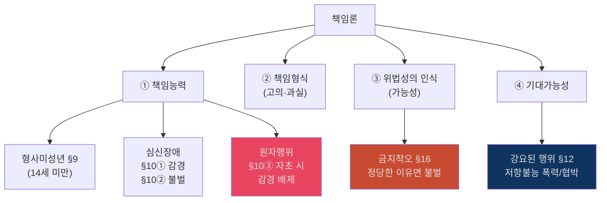

- `암기 문장`: `책임론은 능력→형식→인식→기대가능성 / §10③은 자초한 심신장애`

### 2-5 원인에 있어서 자유로운 행위 (원자행위) — ★★

#### 📊 원자행위 구조도
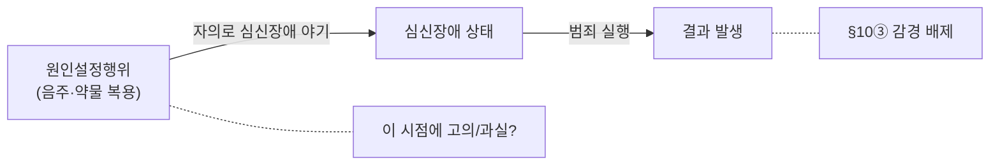

#### 📊 원자행위 학설 비교표
| 학설 | 핵심 | 착수 시점 | 동시존재 원칙 | 지위 |
|---|---|---|---|---|
| **구성요건모델** | 원인설정행위 시점이 실행의 착수 | 음주 시작 시 | **유지** | **다수설** |
| **예외모델** | §10③은 동시존재 원칙의 진정한 예외 | 실행행위 시 | **예외 인정** | 소수 |

#### 📊 고의형 vs 과실형 비교
| | 고의형 | 과실형 |
|---|---|---|
| **사례** | 살해 의도로 음주 → 만취 살인 | 음주운전 위험 예견 가능 → 만취 교통사고 |
| **판례** | — | 92도999, 95도826 |
| **결론** | 고의범 성립 | 심신장애 감경 불가 |

- `판례문구`: "위험의 발생을 예견할 수 있었는데도 자의로 심신장애를 야기한 경우도 그 적용 대상이 된다." [《형법의_기초이론_1_서보학_기말_판례_정리_김혜선.docx》 문단 23 | "위험의 발생을 예견할 수 있었는데도 자의로 심신장애를 야기한 경우도 그 적용 대상이 된다."]
- `암기 문장`: `원자행위는 자초한 무능력 / 고의형+과실형 구분 / 다수설은 구성요건모델`

### 2-6 금지착오 (§16)

#### 홍형철식 쟁점 프레임
- `쟁점의 정리`: 금지착오는 `위법성 인식의 흠결` 문제이므로 먼저 책임설 지도를 잡고, 그다음 `정당한 이유` 유무에 따라 불벌과 감경을 나눈다.
  - 근거 발췌: "정당한 사유가 있다고 오인한데서 나온 행위"; "관청 해석·전문적 판단을 신뢰한 경우가 대표"; "회피가능성"
  - 근거 위치: [《형법의_기초이론_1_서보학_기말_판례_정리_김혜선.docx》 문단 28 | "정당한 사유가 있다고 오인한데서 나온 행위"] [《형법의_기초이론_1_서보학_기말_분리정리.md》 L66-L67 | "관청 해석·전문적 판단을 신뢰한 경우가 대표" / "회피가능성"]

#### 📊 금지착오 학설 지도
| 학설 | 위법성 인식의 지위 | 인식 없으면 | 지위 |
|---|---|---|---|
| **엄격고의설** | 고의의 요소 | 고의 조각 | 소수 |
| **제한고의설** | 고의의 요소 (가능성) | 가능성 없으면 고의 조각 | 소수 |
| **엄격책임설** | 독립된 책임요소 | 고의 유지, 비난가능성↓ | 소수 |
| **제한책임설** | 책임요소 (+ 전제사실 착오 = 구성요건착오) | 비난가능성↓/탈락 | **다수설** |

#### 📊 금지착오 판단 플로우
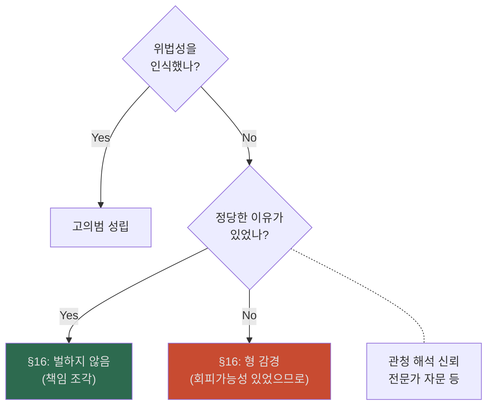

- `요건 정리`: 금지착오는 `위법성 인식이 없을 것`이 전제이고, 그 오인에 `정당한 이유`가 있으면 벌하지 않으며, 없으면 감경 문제로 간다.
  - 근거 발췌: "정당한 사유가 있다고 오인한데서 나온 행위였다면 이는 법률착오가 범의를 조각하는 경우이다"
  - 근거 위치: [《형법의_기초이론_1_서보학_기말_판례_정리_김혜선.docx》 문단 28 | "정당한 사유가 있다고 오인한데서 나온 행위였다면 이는 법률착오가 범의를 조각하는 경우이다."]
- `판례 포인트`: 정당한 이유는 관청이나 전문적 판단을 신뢰한 경우처럼 회피가능성이 없는 때에 한정된다는 흐름으로 정리한다.
  - 근거 발췌: "관청·전문적 판단 신뢰 = 정당한 이유"
  - 근거 위치: [《형법의_기초이론_1_서보학_기말_분리정리.md》 L66-67 | "관청 해석·전문적 판단을 신뢰한 경우가 대표" / "회피가능성"]

#### 📊 금지착오 수업 판례 보충
| 판례번호 | 쟁점 | 핵심 한 줄 |
|---|---|---|
| **74도2676** | 금지착오·정당한 이유 | 법률의 부지는 원칙적으로 정당한 이유가 되지 않음 |
| **81도646** | 금지착오·정당한 이유 | 관청 해석이나 전문가 자문 신뢰 시 정당한 이유 인정 가능 |
| **81도2763** | 금지착오·회피가능성 | 단순한 법률 부지만으로는 회피불가능이 인정되지 않음 |
| **89도1670** | 금지착오·회피가능성 | 자기 직업·영업 관련 법규 인식 노력 필요 → 회피가능성 긍정 |
- 근거 위치: [《형법의_기초이론_1_서보학_기출_쟁점_판례_범위체크.md》 §5-2 | "81도2763", "89도1670"]

#### ✍️ 금지착오 모답형
금지착오는 ① 위법성 인식이 없고 ② 그 오인에 정당한 이유가 있으면 제16조에 따라 벌하지 않으며 ③ 정당한 이유가 없으면 감경 문제로 간다. 정당한 이유는 관청의 유권해석이나 전문적 판단을 신뢰해 회피가능성이 없을 정도여야 하므로, 단순한 법률오해만으로는 부족하다.
- 근거 발췌: "정당한 사유가 있다고 오인한데서 나온 행위였다면"; "관청 해석·전문적 판단을 신뢰한 경우가 대표"; "회피가능성"
- 근거 위치: [《형법의_기초이론_1_서보학_기말_판례_정리_김혜선.docx》 문단 28 | "정당한 사유가 있다고 오인한데서 나온 행위였다면"] [《형법의_기초이론_1_서보학_기말_분리정리.md》 L66-L67 | "관청 해석·전문적 판단을 신뢰한 경우가 대표"] [《형법의_기초이론_1_서보학_기말_분리정리.md》 L66-L67 | "회피가능성"]

### 2-7 강요된 행위 (§12)

#### 홍형철식 쟁점 프레임
- `조문·요건`: 강요된 행위는 `① 저항불능 폭력 또는 방어불능 협박 ② 자기 또는 친족의 생명·신체 보호상황 ③ 기대가능성 없음`을 먼저 적고, 위법 명령은 복종의무 부존재 문제로 별도 처리한다.
  - 근거 발췌: "저항할 수 없는 폭력이나"; "자기 또는 친족의 생명·신체에 대한 위해"; "기대가능성 없음"; "명백한 위법 내지 불법한 명령"
  - 근거 위치: [《형법의_기초이론_1_서보학_기말_분리정리.md》 L71-L74 | "저항할 수 없는 폭력이나" / "자기 또는 친족의 생명·신체에 대한 위해" / "기대가능성 없음"] [《형법의_기초이론_1_서보학_기말_판례_정리_김혜선.docx》 문단 10 | "명백한 위법 내지 불법한 명령"]
#### 📊 강요된 행위 요건 정리
| 항목 | 내용 |
|---|---|
| **강요수단** | 저항할 수 없는 폭력 또는 방어할 방법이 없는 협박 |
| **보호법익** | 자기 또는 친족의 생명·신체 |
| **체계적 지위** | 기대가능성 없음에 따른 `책임조각사유` |
| **다른 조문과 관계** | 강요 상황이어도 경우에 따라 `§22 긴급피난` 검토 가능 |
| **판례 포인트** | 명백한 위법 명령은 복종의무가 없으므로 강요된 행위로 처리되지 않음 |

- **저항불능 폭력** 또는 **생명·신체 위해 협박** → 기대가능성 없음 → 책임조각.
- 위법 명령은 강요된 행위 될 수 없음 (복종의무 자체 부존재).
- `판례문구`: "명백한 위법 내지 불법한 명령인 때에는 이는 벌써 직무상의 지시명령이라 할 수 없으므로 이에 따라야 할 의무는 없다."
  - 근거 위치: [《형법의_기초이론_1_서보학_기말_판례_정리_김혜선.docx》 문단 10 | "명백한 위법 내지 불법한 명령인 때에는 이는 벌써 직무상의 지시명령이라 할 수 없으므로 이에 따라야 할 의무는 없다."]
- `요건 문구`: "저항할 수 없는 폭력이나 자기 또는 친족의 생명·신체에 대한 위해를 방어할 방법이 없는 협박에 의하여 강요된 행위는 벌하지 않는다"; "기대가능성 없음 → 책임조각사유"
  - 근거 위치: [《형법의_기초이론_1_서보학_기말_분리정리.md》 L71-L74 | "저항할 수 없는 폭력이나 자기 또는 친족의 생명·신체에 대한 위해를 방어할 방법이 없는 협박에 의하여 강요된 행위는 벌하지 않는다" / "기대가능성 없음" / "강요된 행위는 §12, 긴급피난은 §22"]
- `암기 문장`: `강요된 행위 = 저항불능 폭력/협박 / 기대가능성 없어 책임조각`

#### ✍️ 강요된 행위 모답형
강요된 행위는 ① 저항할 수 없는 폭력 또는 방어할 방법 없는 협박이 있고 ② 자기 또는 친족의 생명·신체 보호 상황에서 ③ 행위자에게 적법행위를 기대할 수 없을 때 책임이 조각된다. 다만 명백한 위법 명령은 처음부터 복종의무가 없으므로 강요된 행위로 처리하지 않는다.
- 근거 발췌: "저항할 수 없는 폭력이나"; "자기 또는 친족의 생명·신체에 대한 위해"; "기대가능성 없음"; "명백한 위법 내지 불법한 명령인 때에는"
- 근거 위치: [《형법의_기초이론_1_서보학_기말_분리정리.md》 L71-L74 | "저항할 수 없는 폭력이나"] [《형법의_기초이론_1_서보학_기말_분리정리.md》 L71-L74 | "자기 또는 친족의 생명·신체에 대한 위해"] [《형법의_기초이론_1_서보학_기말_분리정리.md》 L71-L74 | "기대가능성 없음"] [《형법의_기초이론_1_서보학_기말_판례_정리_김혜선.docx》 문단 10 | "명백한 위법 내지 불법한 명령인 때에는"]

### 2-8 과실범 (§14) — ★★

#### 홍형철식 쟁점 프레임
- `조문·요건`: 과실범은 `① 객관적 주의의무 위반 ② 결과예견·회피의무 위반 ③ 결과와 인과관계`를 먼저 적고, 신 과실론 구조와 신뢰의 원칙은 검토단에서 붙인다.
  - 근거 발췌: "객관적 주의의무 위반"; "결과예견의무"; "결과회피의무"; "신 과실론"
  - 근거 위치: [《형법의_기초이론_1_서보학_기말_분리정리.md》 L76-L89 | "신 과실론" / "객관적 주의의무 위반" / "결과예견의무" / "결과회피의무"]

#### 📊 과실범 체계도
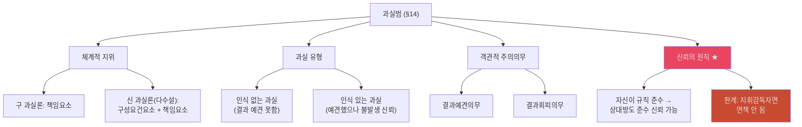

- `[개념요지]` 다수설인 신 과실론은 과실을 객관적 주의의무 위반이라는 구성요건요소이면서 동시에 주관적 주의의무 위반이라는 책임요소로 본다.
  - 근거 위치: [《형법의_기초이론_1_서보학_기말_분리정리.md》 L77-L88 | "신 과실론(다수설)"; "과실은 주의의무 위반"]

- `요건 문장`: ① 과실범은 객관적 주의의무 위반이 있을 것, ② 그 내용으로 결과예견의무와 결과회피의무 위반이 인정될 것, ③ 결과발생과 인과관계가 있을 것을 중심으로 적는다.
- `신뢰의 원칙 ★ 17, 20`: 지휘감독자면 신뢰원칙 불적용 (97도538, 2005도9229)
- `판례문구`: "의사는 자신이 주로 담당하는 환자에 대하여 다른 의사가 하는 의료행위의 내용이 적절한 것인지의 여부를 확인하고 감독하여야 할 업무상 주의의무가 있고" [《형법의_기초이론_1_서보학_기말_판례_정리_김혜선.docx》 문단 41 | "의사는 자신이 주로 담당하는 환자에 대하여 다른 의사가 하는 의료행위의 내용이 적절한 것인지의 여부를 확인하고 감독하여야 할 업무상 주의의무가 있고"]
- `원칙·예외`: ① 원칙적으로 행위자는 자신이 규칙을 지키면 상대방도 규칙을 준수할 것이라고 신뢰할 수 있다. ② 예외적으로 지휘·감독자나 주도적 지위에 있는 자에게는 그 신뢰가 제한된다. ③ 특히 의료팀처럼 확인·감독의무가 중첩되는 관계에서는 신뢰의 원칙이 쉽게 인정되지 않는다.
- `암기 문장`: `과실은 주의의무 위반 / 신뢰원칙은 상대방 규칙준수 신뢰 / 지휘감독자면 면책 안 됨`

#### 📊 홍형철 보강: 신뢰의 원칙 예외
| 항목 | 문장형 정리 |
|---|---|
| **원칙** | 행위자가 스스로 교통·업무 규칙을 지키고 있다면 타인도 규칙을 지킬 것이라고 신뢰할 수 있다. |
| **예외 ①** | 자기 자신이 규칙을 위반하고 있는 경우에는 신뢰의 원칙을 원용할 수 없다. |
| **예외 ②** | 상대방의 객관적 주의의무 위반을 이미 인식한 경우에도 더 이상 신뢰할 수 없다. |
| **예외 ③** | 애초에 상대방이 규칙을 지킬 것이라고 기대할 만한 기초가 없는 경우에도 배제된다. |

- `홍형철 정리`: ① 신뢰의 원칙은 행위자 자신이 먼저 적법해야 하고, ② 상대방 위반을 이미 알았거나, ③ 상황상 준수 기대가 불가능하면 바로 배제된다. ④ 의료에서는 수직적 분업과 수평적 분업을 나누되, 확인·감독의무가 남는 관계라면 쉽게 원용하지 않는다.
  - 근거 발췌: "자신이 규칙을 준수"; "상대방의 객관적 주의의무 위반을 이미 인식"; "상대방이 규칙을 준수할 것이라고 기대할 수 없는 경우"; "수직적 분업"; "수평적 분업"
  - 근거 위치: [《홍형철_쟁점정리_형법_25.pdf》 p.50 | "자신이 규칙을 준수"] [《홍형철_쟁점정리_형법_25.pdf》 p.50 | "상대방의 객관적 주의의무 위반을 이미 인식"] [《홍형철_쟁점정리_형법_25.pdf》 p.50 | "상대방이 규칙을 준수할 것이라고 기대할 수 없는 경우"] [《홍형철_쟁점정리_형법_25.pdf》 p.50 | "수직적 분업"] [《홍형철_쟁점정리_형법_25.pdf》 p.50 | "수평적 분업"]

### 2-9 결과적 가중범 (§15②) — ★★ 23 기출

#### 홍형철식 쟁점 프레임
- `쟁점의 정리`: 결과적 가중범은 기본범죄의 고의와 중한 결과의 예견가능성을 어떻게 결합할지의 문제이므로, `요건 ①②③④ → 판례 → 학설 비교` 순으로 읽어야 흔들리지 않는다.
  - 근거 발췌: "기본범죄 고의"; "중한 결과 발생"; "예견가능성"; "직접성의 원칙"
  - 근거 위치: [《형법의_기초이론_1_서보학_기말_분리정리.md》 L90-L93 | "기본범죄 고의" / "중한 결과 발생" / "예견가능성" / "직접성의 원칙"]

#### 📊 결과적 가중범 요건 구조도
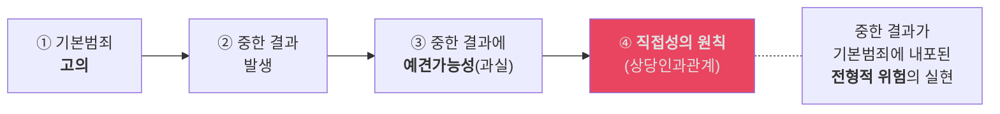

- `[개념요지]` 결과적 가중범은 기본범죄에 대한 고의 위에 중한 결과에 대한 과실이 결합하고, 그 결과가 기본범죄의 전형적 위험이 실현된 경우에만 성립한다.
  - 근거 위치: [《형법의_기초이론_1_서보학_기말_분리정리.md》 L90-L96 | "기본범죄에서 중한 결과가 발생"; "중한 결과에 대한 과실"; "전형적 위험의 실현"]

- `요건 정리`: 결과적 가중범은 `① 기본범죄의 고의 + ② 중한 결과 발생 + ③ 중한 결과에 대한 예견가능성(과실) + ④ 직접성의 원칙`으로 적는다.
  - 근거 발췌: "① 기본범죄 고의 + ② 중한 결과 발생 + ③ 중한 결과에 대한 예견가능성(과실) + ④ 기본범죄와 중한 결과 사이 직접성의 원칙(상당인과관계)"
  - 근거 위치: [《형법의_기초이론_1_서보학_기말_분리정리.md》 L92 | "① 기본범죄 고의 + ② 중한 결과 발생 + ③ 중한 결과에 대한 예견가능성(과실) + ④ 기본범죄와 중한 결과 사이 직접성의 원칙(상당인과관계)"]
- `직접성 판례 포인트`: 중한 결과가 기본범죄에 내포된 전형적 위험의 실현이어야 하고, 우연한 결과나 제3자 개입은 끊긴다.
  - 근거 발췌: "중한 결과가 기본범죄에 전형적 위험이 실현된 것이어야 함"
  - 근거 위치: [《형법의_기초이론_1_서보학_기말_분리정리.md》 L93 | "중한 결과가 기본범죄에 전형적 위험이 실현된 것이어야 함"]

#### ✍️ 과실범·결과적 가중범 모답형
과실범은 객관적 주의의무 위반을 전제로 하고, 그 내용은 결과예견의무와 결과회피의무로 나누어 파악한다. 결과적 가중범은 기본범죄에 대한 고의와 중한 결과에 대한 과실이 결합된 형태로서, 그 중한 결과가 기본범죄의 전형적 위험이 직접 실현된 경우에 한하여 인정된다. 따라서 결과가 단순히 우연히 겹친 것인지, 기본행위의 위험범위 안에서 현실화된 것인지가 답안의 핵심이다.
- 근거 발췌: "① 결과예견의무, ② 결과회피의무"; "직접성"; "유형적 위험의 실현"
- 근거 위치: [《형법의_기초이론_1_서보학_기말_분리정리.md》 L83 | "① 결과예견의무, ② 결과회피의무"] [《형법의_기초이론_1_서보학_기말_분리정리.md》 L90-L96 | "직접성"] [《형법의_기초이론_1_서보학_기말_분리정리.md》 L90-L96 | "유형적 위험의 실현"]

### 2-10 부작위범 (§18) — ★★★ 17, 20, 23

#### 홍형철식 쟁점 프레임
- `조문·요건`: 부작위범은 `① 구성요건적 상황 ② 보증인지위 ③ 작위가능성 ④ 동가치성 ⑤ 고의·과실`을 먼저 세우고, 판례는 보라매병원처럼 공동정범과 방조의 경계를 보는 데 쓴다.
  - 근거 발췌: "구성요건적 상황"; "보증인지위"; "동가치성"; "부작위는 살인죄의 구성요건적 행위를 충족"; "살인방조죄"
  - 근거 위치: [《형법의_기초이론_1_서보학_기말_분리정리.md》 L100-L105 | "구성요건적 상황" / "보증인지위" / "동가치성"] [《형법의_기초이론_1_서보학_기말_판례_정리_김혜선.docx》 문단 45 | "부작위는 살인죄의 구성요건적 행위를 충족"] [《형법의_기초이론_1_서보학_기말_판례_정리_김혜선.docx》 문단 51 | "살인방조죄"]

#### 📊 부진정 부작위범 요건 체계도
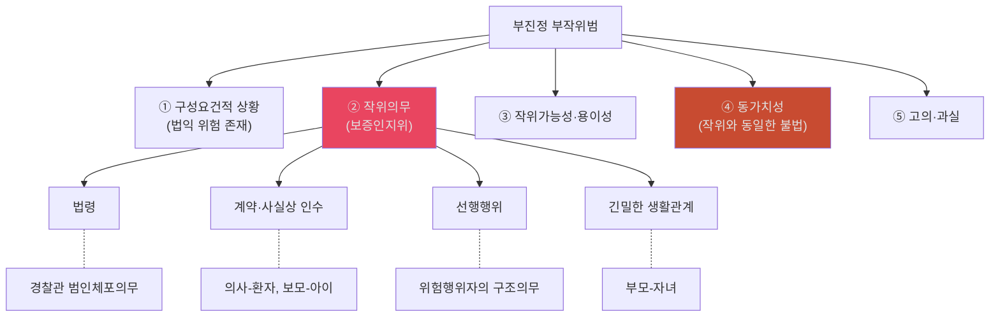

- `[개념요지]` 부진정 부작위범은 법적 작위의무를 지는 자가 보증인지위에 기초해 작위와 동가치적인 부작위로 결과를 실현한 경우에 성립한다.
  - 근거 위치: [《형법의_기초이론_1_서보학_기말_분리정리.md》 L99-L116 | "법적 작위의무"; "보증인지위"; "동가치성"; "부작위범 = 보증인지위가 핵심"]

- `요건 정리`: 부진정 부작위범은 `① 구성요건적 상황 ② 작위의무(보증인지위) ③ 작위가능성·용이성 ④ 동가치성 ⑤ 고의·과실` 순서로 적는다.
  - 근거 발췌: "구성요건적 상황"; "작위의무(보증인지위)"; "작위가능성·용이성"; "동가치성"; "고의·과실"
  - 근거 위치: [《형법의_기초이론_1_서보학_기말_분리정리.md》 L100-105 | "구성요건적 상황" / "작위의무(보증인지위)" / "작위가능성·용이성" / "동가치성" / "고의·과실"]
- `주요 판례문구`: "부작위는 살인죄의 구성요건적 행위를 충족하는 것이라고 평가하기에 충분하므로 부작위에 의한 살인죄를 구성한다."; "공동정범의 객관적 요건인 이른바 기능적 행위지배가 흠결되어 있다는 이유로 작위에 의한 살인방조죄만 성립한다."
  - 근거 위치: [《형법의_기초이론_1_서보학_기말_판례_정리_김혜선.docx》 문단 45 | "부작위는 살인죄의 구성요건적 행위를 충족하는 것이라고 평가하기에 충분하므로 부작위에 의한 살인죄를 구성한다."] [《형법의_기초이론_1_서보학_기말_판례_정리_김혜선.docx》 문단 51 | "공동정범의 객관적 요건인 이른바 기능적 행위지배가 흠결되어 있다는 이유로 작위에 의한 살인방조죄만 성립한다고 한 사례."]
- `원칙·예외`: ① 원칙적으로 부진정 부작위범은 보증인지위와 동가치성이 핵심이다. ② 예외적으로 보증인지위가 있어도 기능적 행위지배가 흠결되면 공동정범이 아니라 방조로 내려간다. ③ 작위가능성 자체가 없으면 부작위범도 성립할 수 없다.

#### 📊 부작위범 수업 판례 보충
| 판례번호 | 쟁점 | 핵심 한 줄 |
|---|---|---|
| **82도2024** | 부작위 살인 | 의도적 치료방기는 부작위에 의한 살인죄 성립 |
| **91도2951** | 보증인지위·선행행위 | 선행행위에 의한 보증인지위 인정 기준 — 위험 야기 후 구조의무 |
| **96도1081** | 보증인지위·법령 | 법령상 작위의무가 있는 자의 부작위범 성립 요건 |
| **2002도995** | 보라매병원 | 의사는 살인방조 — 기능적 행위지배 흠결로 공동정범 부정 |
- 근거 위치: [《형법의_기초이론_1_서보학_기출_쟁점_판례_범위체크.md》 §5-2 | "91도2951", "96도1081"]

### 2-11 미수론 — ★★

#### 홍형철식 쟁점 프레임
- `조문·요건`: 미수론은 먼저 `장애미수 / 중지미수 / 불능미수`를 나눈 뒤, `실행의 착수`와 `위험성`을 별도 쟁점으로 다루는 구조가 안정적이다.
  - 근거 발췌: "장애미수 (§25)"; "프랑크의 공식"; "실질적 객관설(다수설, 판례): 현실적 위험성"; "불능미수"
  - 근거 위치: [《형법의_기초이론_1_서보학_기말_분리정리.md》 L124-L136 | "실질적 객관설(다수설, 판례): 현실적 위험성" / "장애미수 (§25)" / "프랑크의 공식"] [《형법의_기초이론_1_서보학_기말_판례_정리_김혜선.docx》 문단 94-100 | "불능미수"]

#### 📊 미수 유형 종합 비교표
| 비교축 | 장애미수 (§25) | 중지미수 (§26) | 불능미수 (§27) |
|---|---|---|---|
| **의의** | 결과 미발생 (외부 장애) | **자의로** 중지/결과방지 | 수단/대상 착오로 결과 **불가능** |
| **기출** | 17 | 17 | ★ 17, 20 |
| **자의성** | 불요 | **필수** (프랑크 공식) | 불요 |
| **위험성** | 불요 | 불요 | **필수** |
| **효과** | 형의 **임의적 감경** | 형의 **감경 또는 면제** | 형의 **감경 또는 면제** |
| **핵심 쟁점** | 기수와의 구분 | 자의성 판단 | 위험성 판단 기준 |

#### 📊 실행의 착수 학설 비교
| 학설 | 기준 | 지위 |
|---|---|---|
| 형식적 객관설 | 구성요건 해당행위 자체 시작 | 소수 |
| **실질적 객관설** | 구성요건 실현의 **현실적 위험성** 포함 행위 시작 | **다수설·판례** |
| 주관설 | 범의를 확정적으로 표현한 행위 시작 | 소수 |

#### 📊 중지미수 자의성 판단 (프랑크 공식)
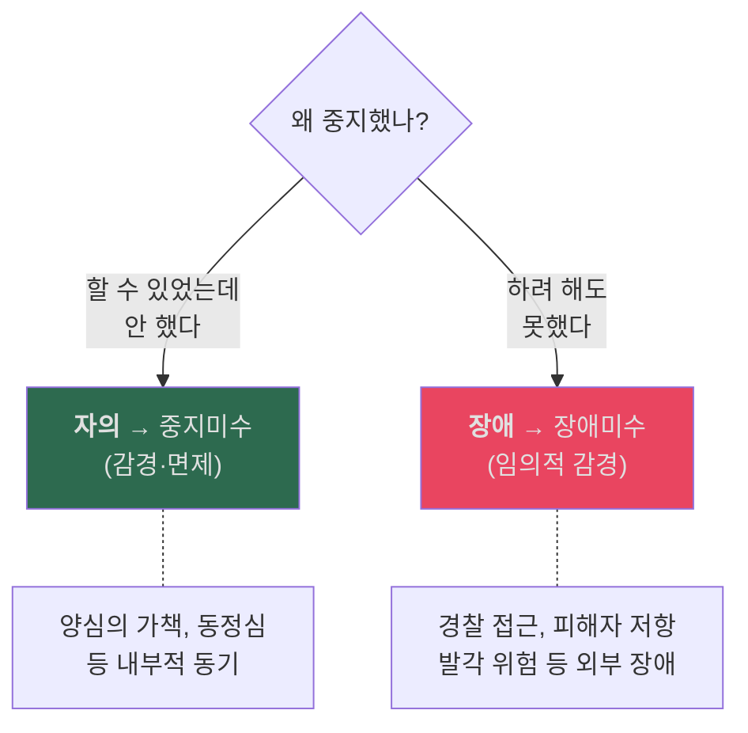

#### 📊 불능미수 위험성 판단 학설 — ★★
| 학설 | 판단 기초 | 판단 주체 | 지위 |
|---|---|---|---|
| 객관적 위험설 | 객관적 사실 전부 | 과학적 판단 | 소수 |
| **추상적 위험설** | **행위자가 인식한 사정** | **일반인의 객관적 판단** | **판례 근접** |
| 구체적 위험설 | 일반인이 인식 가능한 사정 | 일반인 판단 | 소수 |

- `판례(2018도16002)`: 준강간 불능미수 — 피해자 항거불능 아니었으나 위험성 인정.
- `판례(2005도8105)`: 위험성도 없으면 불능미수도 부정.
- `판례문구(2018도16002)`: "피고인이 행위 당시에 인식한 사정을 놓고 일반인이 객관적으로 판단하여 보았을 때 준강간의 결과가 발생할 위험성이 있었으므로 준강간죄의 불능미수가 성립한다." [《형법의_기초이론_1_서보학_기말_판례_정리_김혜선.docx》 문단 95 | "피고인이 행위 당시에 인식한 사정을 놓고 일반인이 객관적으로 판단하여 보았을 때 준강간의 결과가 발생할 위험성이 있었으므로 준강간죄의 불능미수가 성립한다."]
- `판례문구(2005도8105)`: "결과 발생이 불가능할 뿐만 아니라 위험성도 없다 할 것이어서 소송사기죄의 불능미수에 해당한다고 볼 수 없다." [《형법의_기초이론_1_서보학_기말_판례_정리_김혜선.docx》 문단 100 | "결과 발생이 불가능할 뿐만 아니라 위험성도 없다 할 것이어서 소송사기죄의 불능미수에 해당한다고 볼 수 없다."]
- `암기 문장`: `불능미수 = 수단/대상 착오로 결과불가능 / 위험성 있으면 처벌 / 판례: 행위자 인식 + 일반인 판단`

#### 📊 장애미수
| 항목 | 정리 |
|---|---|
| **의의** | 실행에 착수했지만 외부 장애 등으로 결과가 발생하지 않은 경우 |
| **중지미수와 구별** | 자의 중지가 아니라 결과 발생 실패라는 점이 핵심 |
| **답안 포인트** | 프랑크의 공식은 중지미수 자의성 판단에서 쓰고, 장애미수와 대비시킨다 |

- `[강의정리]` 미수론 내부에서는 장애미수와 중지미수, 불능미수를 구별해서 보며, 중지미수 판단에 프랑크의 공식이 나온다.
  - 근거 발췌: "장애미수 (§25)"; "프랑크의 공식"
  - 근거 위치: [《형법의_기초이론_1_서보학_기말_분리정리.md》 L129-L136 | "장애미수 (§25)"] [《형법의_기초이론_1_서보학_기말_분리정리.md》 L136 | "프랑크의 공식"]

#### 📊 미수론 수업 판례 보충 (16개)

##### 장애미수·실행의 착수
| 판례번호 | 쟁점 | 핵심 한 줄 |
|---|---|---|
| **85도464** | 실행의 착수 시기 | 절도죄에서 물색행위 개시 시점이 실행의 착수 |
| **86도1753** | 실행의 착수·절도 | 타인 주거 침입 후 물색 시작이 절도의 착수 |
| **90도607** | 실행의 착수·강도 | 폭행·협박 개시 시점이 강도의 실행 착수 |
| **86도2256** | 실행의 착수·사기 | 기망행위 개시 시 사기죄의 실행 착수 인정 |
| **86도1109** | 장애미수·기수 구별 | 결과 미발생의 원인이 외부 장애인지 판단 |

##### 중지미수·자의성
| 판례번호 | 쟁점 | 핵심 한 줄 |
|---|---|---|
| **91도2296** | 중지미수·자의성 부정 | 범행 발각 위험으로 중지한 경우 자의성 부정 |
| **2000도4298** | 중지미수·자의성 판단 | 외부 장애가 아닌 내부 동기에 의한 중지 = 자의 |
| **2019도97** | 중지미수·결과방지 | 착수 후 자의로 결과 발생을 방지한 경우 중지미수 |

##### 불능미수·위험성
| 판례번호 | 쟁점 | 핵심 한 줄 |
|---|---|---|
| **85도2002** | 불능미수·수단 착오 | 수단의 착오로 결과 발생 불가능 — 위험성 판단 |
| **92도917** | 불능미수·위험성 판단 | 행위자 인식 사정 기초 + 일반인 객관적 판단 |
| **93도1851** | 불능미수·대상 착오 | 대상의 착오로 결과 불가능 시 위험성 기준 적용 |
| **97도957** | 불능미수·위험성 긍정 | 행위자가 인식한 사정상 결과 발생 가능성 있으면 위험성 인정 |
| **99도640** | 불능미수·위험성 부정 | 객관적으로도 결과 발생 가능성이 전혀 없으면 불능미수도 부정 |

##### 미수 관련 기타
| 판례번호 | 쟁점 | 핵심 한 줄 |
|---|---|---|
| **91도436** | 예비·미수 구별 | 예비행위와 실행의 착수 사이 경계 판단 |
| **83도2967** | 예비행위 한계 | 범죄 준비단계에 머무르면 미수 아닌 예비 |
| **85도206** | 음모·예비 | 음모단계에서의 처벌 요건 |
- 근거 위치: [《형법의_기초이론_1_서보학_기출_쟁점_판례_범위체크.md》 §5-2 미수론 | "85도464" ~ "85도206"]

#### ✍️ 부작위범·미수론 모답형
부진정 부작위범은 구성요건적 상황, 보증인지위, 작위가능성, 동가치성, 고의·과실을 갖추어야 성립한다. 한편 미수론에서는 실행의 착수 시점을 실질적 객관설, 즉 현실적 위험성 기준으로 판단하고, 중지미수는 프랑크의 공식으로 자의성 여부를 가린다. 따라서 사례에서는 먼저 보증인지위의 근거를 특정하고, 이어 실행의 착수와 미수 유형을 순서대로 정리하는 방식이 안정적이다.
- 근거 발췌: "보증인지위"; "실질적 객관설(다수설, 판례): 현실적 위험성"; "프랑크의 공식"
- 근거 위치: [《형법의_기초이론_1_서보학_기말_분리정리.md》 L102-L116 | "보증인지위"] [《형법의_기초이론_1_서보학_기말_분리정리.md》 L124 | "실질적 객관설(다수설, 판례): 현실적 위험성"] [《형법의_기초이론_1_서보학_기말_분리정리.md》 L136 | "프랑크의 공식"]

### 2-12 정범·공범론 — ★★★

#### 홍형철식 쟁점 프레임
- `쟁점의 정리`: 정범·공범론은 먼저 `누가 정범이고 누가 공범인지`, 그다음 `공동정범/이탈/§33` 순으로 정리한다. 아래 단원은 `체계도 → 학설·판례 충돌 → 판례문구 → 사례 포섭` 순으로 읽는다.
  - 근거 발췌: "공모공동정범"; "기능적 행위지배"; "공모관계에서의 이탈"; "형법 제33조의 해석론"
  - 근거 위치: [《형법의_기초이론_1_서보학_기말_요약본_김혜선.docx》 문단 98-99 | "공모공동정범"] [《형법의_기초이론_1_서보학_기말_판례_정리_김혜선.docx》 문단 126 | "기능적 행위지배"] [《형법의_기초이론_1_서보학_기말_판례_정리_김혜선.docx》 문단 121-126 | "공모관계에서의 이탈"] [《형법의_기초이론_1_서보학_기말_요약본_김혜선.docx》 문단 145-147 | "형법 제33조의 해석론"]

#### 📊 정범·공범 체계도
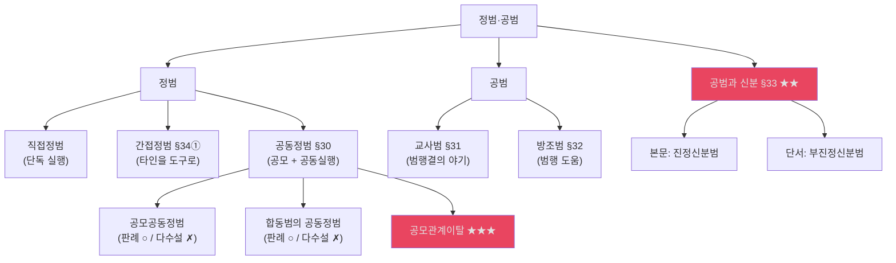

#### 📊 간접정범의 도구 유형
| 도구 유형 | 설명 | 예시 |
|---|---|---|
| 책임무능력자 | 형사미성년·심신상실자 이용 | 어린이에게 절도 시킴 |
| 강요된 자 | 폭력·협박으로 강제 이용 | "안 하면 죽인다" |
| 착오에 빠진 자 | 사실관계 오인 이용 | "약을 전해줘" (실은 독) |
| 목적 없는 고의 있는 도구 | 고의는 있으나 초과주관적 요소 없음 | 화폐위조: 행사 목적 없는 자 |

#### 📊 공동정범 관련 쟁점 비교표
| 쟁점 | 다수설 | 판례 |
|---|---|---|
| **공모공동정범** | 부정 (공동실행 미충족) | **긍정** (기능적 행위지배) |
| **합동범의 공동정범** | 현장에 있는 사람만 처벌 | **현장 밖도 가능** (공모 참여) |
| **과실범의 공동정범** | 부정 (공동의 범행결의 불가) | **긍정** (공동의 주의의무 위반) |

- `근거 위치`: 공모공동정범은 [《형법의_기초이론_1_서보학_기말_요약본_김혜선.docx》 문단 98-99 | "공모공동정범"] [《형법의_기초이론_1_서보학_기말_강의록_김혜선.docx》 문단 650-653 | "공모공동정범"] [《형법의_기초이론_1_서보학_기말_판례_정리_김혜선.docx》 문단 126 | "기능적 행위지배"] 기준입니다. 합동범은 [《형법의_기초이론_1_서보학_기말_요약본_김혜선.docx》 문단 110-112 | "합동범의 공동정범"] [《형법의_기초이론_1_서보학_기말_강의록_김혜선.docx》 문단 685-693 | "합동범의 공동정범"] 기준이고, 과실범의 공동정범은 [《형법의_기초이론_1_서보학_기말_강의록_김혜선.docx》 문단 655-663 | "과실범의 공동정범"] [《형법의_기초이론_1_서보학_기말_판례_정리_김혜선.docx》 문단 131-132 | "과실범의 경우에도 공동정범이 성립할 수 있으나"] 기준입니다.

#### 📊 간접정범·공동정범·합동범 수업 판례 보충 (15개)

##### 간접정범
| 판례번호 | 쟁점 | 핵심 한 줄 |
|---|---|---|
| **2016도17733** | 간접정범·의사지배 | 피이용자에 대한 우월적 의사지배가 인정되면 간접정범 |

##### 공동정범·공모공동정범
| 판례번호 | 쟁점 | 핵심 한 줄 |
|---|---|---|
| **2003도3945** | 공모공동정범 | 공모에 참여하고 기능적 행위지배가 있으면 현장 불참이라도 공동정범 |
| **96도3376** | 공모공동정범·기능적 행위지배 | 공모에 의한 역할분담으로 범행 전체에 기능적 행위지배 인정 |
| **92도1342** | 공동정범·공동가공의사 | 공동가공의 의사와 이에 기한 기능적 행위지배가 공동정범 요건 |
| **90도1912** | 과실범의 공동정범 | 과실범도 공동의 주의의무 위반이 있으면 공동정범 성립 가능(판례) |
| **93도2305** | 공동정범·실행행위 분담 | 실행행위의 일부만 분담해도 전체에 대해 공동정범 책임 |

##### 합동범
| 판례번호 | 쟁점 | 핵심 한 줄 |
|---|---|---|
| **97도163** | 합동범의 공동정범 | 합동범에서 현장 불참자도 공모 참여로 공동정범 성립(판례) |
| **2008도11138** | 합동범·현장성 | 합동범 성립에 현장에서의 시간적·장소적 협력 필요 |
| **97도1740** | 합동절도·공동정범 | 합동절도의 공동정범 인정 범위 |
| **96도1231** | 합동범·2인 이상 현장 | 합동범은 2인 이상이 현장에서 합동해야 성립 |

##### 공모관계이탈·승계적 공동정범
| 판례번호 | 쟁점 | 핵심 한 줄 |
|---|---|---|
| **2024도1856** | 공모관계이탈 | 이탈 인정 요건으로 적극적 저지 노력 또는 기여 철회 요구 |
| **2022도16120** | 공모관계이탈 | 구속 등 소극적 사유만으로는 이탈 부정 |
| **98도321** | 공모관계이탈·승계 | 공모에 뒤늦게 가담한 자의 책임범위 판단 |
| **92도917** | 공모관계이탈·불능미수 | 공모 이탈 후 나머지 공범의 범행에 대한 책임 유무 |
- 근거 위치: [《형법의_기초이론_1_서보학_기출_쟁점_판례_범위체크.md》 §5-2 간접정범/공동정범/합동범 | "2016도17733" ~ "92도917"]

#### 📊 공모관계이탈 판단 플로우차트 — ★★★
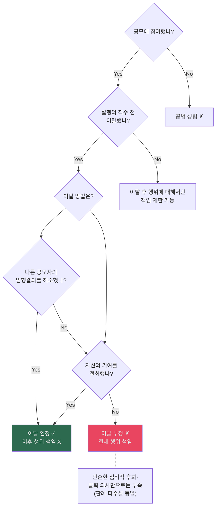

- `요건 정리`: ① 단순한 후회나 탈퇴 의사만으로는 부족하고, ② 다른 공모자의 범행결의를 해소하거나, ③ 자신의 기여를 철회하여 실행에 미친 영향력을 제거해야 한다.
  - 근거 발췌: "범행을 저지하기 위하여 적극적으로 노력하는 등 실행에 미친 영향력을 제거하지 아니하는 한 공모자가 구속되었다는 등의 사유만으로 공모관계에서 이탈하였다고 할 수 없다"
  - 근거 위치: [《형법의_기초이론_1_서보학_기말_판례_정리_김혜선.docx》 문단 122 | "범행을 저지하기 위하여 적극적으로 노력하는 등 실행에 미친 영향력을 제거하지 아니하는 한 공모자가 구속되었다는 등의 사유만으로 공모관계에서 이탈하였다고 할 수 없다."]
- `판례 포인트`: 판례와 다수설은 전체적 해결방법을 취하므로, 이탈이 인정되려면 이후 공범들의 실행행위 결과까지 책임이 끊길 정도의 적극적 단절이 필요하다.
  - 근거 발췌: "다른 공모자의 범행결의를 해소"; "기여를 철회"; "이탈은 심리적 후회 부족"
  - 근거 위치: [《형법의_기초이론_1_서보학_기말_분리정리.md》 L177-181 | "다른 공모자의 범행결의를 해소" / "기여를 철회" / "이탈은 심리적 후회 부족"]

#### 📊 [심화] 공모관계이탈의 효과 학설 대립 비교
| 쟁점 | 전체적 해결방법 (판례·다수설) | 개별적 해결방법 (소수설) |
|---|---|---|
| **이요 판단구조** | 이탈자의 공범 가벌성 자체를 조각 | 이탈자 본인의 고의·위험성만 단절 |
| **결과적 효과** | 이탈 이후 **나머지 공범들의 실행행위 결과**에 대해 이탈자 책임 면제 | 이탈자 본인은 실행미수/예비음모 형, 나머지 공범은 기수 등 개별적 판단 |
| **요건의 엄격성** | 다른 공모자의 범행결의까지 **해소(저지)**시킬 것 요구 (엄격) | 자신의 행위기여만 **철회**하면 됨 (완화) |

- `판례(2010도6924)`: 결의 해소/기여 철회 필요. 단순 후회 부족.
- `판례요지(2010도6924)`: 공모자가 주도적으로 참여해 다른 공모자의 실행에 영향을 미친 경우, 범행을 저지하기 위한 적극적 노력 등으로 실행에 미친 영향력을 제거하지 않으면 이탈이 부정된다. [《형법의_기초이론_1_서보학_기말_판례_정리_김혜선.docx》 문단 122 | "범행을 저지하기 위하여 적극적으로 노력하는 등 실행에 미친 영향력을 제거하지 아니하는 한 공모자가 구속되었다는 등의 사유만으로 공모관계에서 이탈하였다고 할 수 없다."]
- `사례 연결`: 주모자 A 착수 전 이탈 → B, C만 실행 → A 책임 범위? 판례(전체적 해결)에 따라 A가 진지하게 저지했으면 무죄, 아니면 기능적 행위지배 유지로 공동정범.
- `암기 문장`: `이탈은 심리적 후회 부족 / 결의 해소 or 기여 철회 필요 / 다수설·판례 모두 전체적 해결방법 (엄격)`

#### 📊 교사범 vs 방조범 비교
| | 교사범 (§31) | 방조범 (§32) |
|---|---|---|
| **행위** | 범행결의 **야기** | 범행 **도움** (물질적·정신적) |
| **정범의 결의** | 교사자가 새로이 만듦 | 이미 있는 결의를 도움 |
| **처벌** | 정범의 형으로 처벌 | 정범의 형보다 **감경** |
| **이탈** | 피교사자 결의 **해소**시켜야 | — |
| **기출** | 20 | — |

- `판례요지(2012도7407)`: 교사범이 공범관계에서 이탈하려면 피교사자가 실행행위에 나아가기 전에, 교사범이 형성한 범죄 실행의 결의를 해소해야 한다. [《형법의_기초이론_1_서보학_기말_판례_정리_김혜선.docx》 문단 144 | "교사범이 그 공범관계로부터 이탈하기 위해서는 피교사자가 범죄의 실행행위에 나아가기 전에 교사범에 의하여 형성된 피교사자의 범죄 실행의 결의를 해소하는 것이 필요하고"]

#### 📊 사례문제 기반 기말 포섭 체크
| 사례 | 답안 첫 줄 | 핵심 포섭 |
|---|---|---|
| **[사례] 보라매병원** | `[판례기준]` 보증인지위만으로 공동정범이 되는지부터 문제 삼지 말고 `기능적 행위지배`를 따진다 | 부작위 살인 공동정범이 아니라 `살인방조`로 정리 |
| **[사례] 독살 치사량 미달** | `[판례기준]` 장애미수/불능미수 구별은 `위험성` 판단까지 적어야 끝난다 | 결과 불가능만이 아니라 위험성 인정 여부로 결론 |
| **[사례] 주모자 A 착수 전 이탈** | `[판례기준]` 공모관계이탈은 단순 후회가 아니라 `결의 해소 또는 기여 철회`가 필요하다고 적는다 | 그 요건이 되지 않으면 이후 실행 결과까지 책임 |
| **[판례] 교사범 이탈** | 교사범은 피교사자 실행 전 `형성된 결의 해소`가 있어야 이탈이 인정된다고 쓴다 | 공모관계이탈과 같은 취지지만 교사범 고유 문구를 적는 것이 안전 |

- `사례정리 포인트`: 보라매병원 사례는 `살인방조`, 독살 실패 사례는 `불능미수`, 주모자 이탈 사례는 `공모관계이탈`과 `특수절도의 중지미수`를 직접 연결해 정리하고 있다.
  - 근거 발췌: "살인방조죄"; "장애미수로 볼 것이 아니라 불능미수"; "공모관계이탈"; "특수절도의 중지미수"
  - 근거 위치: [《형법의_기초이론_1_서보학_기말_사례_정리_김혜선.docx》 소제목 "[보라매병원]" | "살인방조죄"] [《형법의_기초이론_1_서보학_기말_사례_정리_김혜선.docx》 소제목 "[독살: 치사량 미달의 독인데, 친구가 토한 경우]" | "장애미수로 볼 것이 아니라 불능미수"] [《형법의_기초이론_1_서보학_기말_사례_정리_김혜선.docx》 소제목 "[주모자 A가 실행의 착수 전 이탈하고, B, C만 실행의 착수 한 경우]" | "공모관계이탈"; "특수절도의 중지미수"]
- `판례 연결`: 교사범 이탈은 피교사자의 실행 전 범죄결의를 해소해야 한다는 판례문구를 그대로 적어 두는 편이 안전하다.
  - 근거 발췌: "피교사자가 범죄의 실행행위에 나아가기 전에"; "범죄 실행의 결의를 해소하는 것이 필요"
  - 근거 위치: [《형법의_기초이론_1_서보학_기말_판례_정리_김혜선.docx》 문단 144 | "피교사자가 범죄의 실행행위에 나아가기 전에"; "범죄 실행의 결의를 해소하는 것이 필요"]

#### 📊 §33 공범과 신분 — 해석론 비교 — ★★
| | 다수설 | 판례 |
|---|---|---|
| **본문 적용** | **진정신분범**에만 | 구성적·가감적 **모두** |
| **단서 적용** | **부진정신분범**에만 | **가감적 신분범**에만 |
| **핵심 차이** | 진정/부진정으로 나눔 | 구성적/가감적으로 나눔 |
| **비신분자 처벌** | 다수설: 단서에 따라 통상형 | 판례: 단서에 따라 통상형 |

- `[개념요지]` 제33조는 진정신분범에서는 비신분자도 공범이 될 수 있게 하고, 부진정신분범에서는 비신분자를 중한 형으로 처벌하지 않는 구조다.
  - 근거 위치: [《형법의_기초이론_1_서보학_기말_분리정리.md》 L195-L202 | "신분 없는 자도 신분 있는 자의 범행에 가담하면 공범으로 처벌"; "형의 경중이 달라지는 경우, 중한 형으로 벌하지 않음"]

#### 📊 §33 적용 구조도
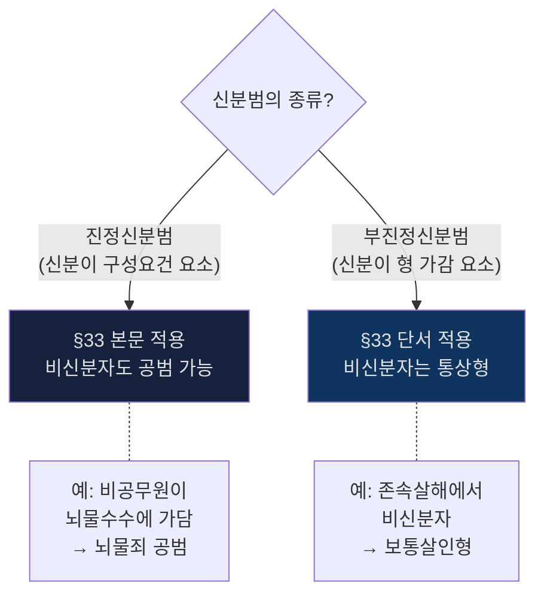

- `판례문구(93도1002)`: "가사 정범인 을에게 모해의 목적이 없었다고 하더라도, 형법 제33조 단서의 규정에 의하여 피고인을 모해위증교사죄로 처단할 수 있다." [《형법의_기초이론_1_서보학_기말_판례_정리_김혜선.docx》 문단 150 | "가사 정범인 을에게 모해의 목적이 없었다고 하더라도, 형법 제33조 단서의 규정에 의하여 피고인을 모해위증교사죄로 처단할 수 있다."]
- `암기 문장`: `§33 본문 = 신분 없어도 공범 가능 / 단서 = 중한 형 아닌 통상형 / 다수설과 판례 해석이 다름`
- `원칙·예외`: ① 원칙적으로 §33은 먼저 그 신분이 구성요건요소인지 형 가감요소인지 가른 뒤 본문과 단서를 적용한다. ② 예외적으로 비신분자가 가담해도 본문이 적용되는 경우에는 공범성 자체가 인정된다. ③ 그러나 단서가 적용되는 경우에는 비신분자를 중한 형으로 처벌하지 않고 통상형으로 처리한다.

#### 📊 교사범·공범과 신분 수업 판례 보충
| 판례번호 | 쟁점 | 핵심 한 줄 |
|---|---|---|
| **91도542** | 교사범·피교사자 범행불실행 | 피교사자가 범행을 실행하지 않으면 교사의 미수 문제 |
| **93도1873** | 공범과 신분·§33 본문 | 비신분자가 진정신분범에 가담 시 §33 본문에 의해 공범 성립 |
| **2012도7407** | 교사범 이탈 | 피교사자 실행 전 결의 해소시켜야 이탈 인정 |
| **93도1002** | §33 단서·목적범 | 정범에 목적 없어도 신분 있는 교사자에 §33 단서 적용 |
- 근거 위치: [《형법의_기초이론_1_서보학_기출_쟁점_판례_범위체크.md》 §5-2 교사범/공범과 신분 | "91도542", "93도1873"]

#### 📊 승계적 공동정범
| 항목 | 정리 |
|---|---|
| **의의** | 이미 형성된 공동의사에 뒤늦게 편승한 경우 |
| **책임범위** | 편승 이후의 행위, 즉 공동가공 이후 부분을 중심으로 본다 |
| **답안 포인트** | 처음부터 가담한 공동정범과 책임범위를 같게 적지 않도록 주의 |

- `[암기장 정리]` 승계적 공동정범은 형성된 공동의사에 편승한 경우 그 이후의 행위 부분을 문제 삼는 서브개념이다.
  - 근거 발췌: "형성된 공동의사에 편승한 경우 그 이후의 행위"
  - 근거 위치: [《형법1_중간고사_암기장.md》 L66 | "형성된 공동의사에 편승한 경우 그 이후의 행위"]
- `[홍형철 정리]` 계속범이나 포괄일죄에 뒤늦게 가담한 자는 원칙적으로 가담 이후의 행위 부분에 대해서만 공동정범 책임을 지고, 가담 전 부분까지 소급해 책임지지는 않는다.
  - 근거 발췌: "포괄적 일죄의 일부에 공동정범으로 가담한 자는"; "가담 이후의 범행에 대해서만 공동정범으로서 책임"
  - 근거 위치: [《홍형철_쟁점정리_형법_25.pdf》 p.93 | "포괄적 일죄의 일부에 공동정범으로 가담한 자는"] [《홍형철_쟁점정리_형법_25.pdf》 p.93 | "가담 이후의 범행에 대해서만 공동정범으로서 책임"]

#### ✍️ 공모관계이탈·§33 모답형
공모관계이탈이 인정되려면 단순한 후회나 소극적 이탈만으로는 부족하고, 공모결의를 해소하거나 자기 기여를 철회하여 이후 범행결과에 대한 영향력을 제거하여야 한다. 또한 신분범 공범문제는 곧바로 결론을 쓰기보다 먼저 그 신분이 구성요건요소인지 형벌가중·감경요소인지 가른 뒤 §33 본문과 단서를 적용해야 한다. 승계적 공동정범은 이미 형성된 공동의사에 편승한 경우이므로 그 이후의 행위 부분을 중심으로 책임범위를 한정하는 서브논점으로 적어 두면 안정적이다.
- 근거 발췌: "공모관계이탈"; "제33조 해석론 ★"; "형성된 공동의사에 편승한 경우 그 이후의 행위"
- 근거 위치: [《형법의_기초이론_1_서보학_기말_분리정리.md》 L174-L200 | "공모관계이탈"] [《형법의_기초이론_1_서보학_기말_분리정리.md》 L200 | "제33조 해석론 ★"] [《형법1_중간고사_암기장.md》 L66 | "형성된 공동의사에 편승한 경우 그 이후의 행위"]

---

## 3. 기말 시험 직전 판례 카드

### 📊 판례 총정리표
| # | 판례 | 영역 | 핵심 한 줄 |
|---|---|---|---|
| 1 | **84도2582** | 자구행위 | 보전 아닌 실현이면 자구행위 부정 |
| 2 | **87도2358** | 정당행위/강요 | 위법 명령에 복종의무 없음 |
| 3 | **92도999, 95도826** | 원자행위 | 과실 원자행위 포함, 심신감경 불가 |
| 4 | **74도2676, 81도646** | 금지착오 | 정당한 이유 있으면 책임 조각 |
| 5 | **97도538, 2005도9229** | 신뢰의 원칙 | 지휘감독자면 신뢰원칙 불적용 |
| 6 | **82도2024** | 부작위범 | 의도적 치료방기 = 부작위 살인 |
| 7 | **2002도995** | 보라매병원 | 의사 = 살인방조 (공동정범 아님) |
| 8 | **2018도16002** | 불능미수 | 행위자 인식 기초 + 일반인 객관 판단 |
| 9 | **2005도8105** | 불능미수 | 위험성도 없으면 불능미수도 부정 |
| 10 | **2010도6924** | 공모관계이탈 | 결의 해소/기여 철회 필요 |
| 11 | **2012도7407** | 교사범 이탈 | 피교사자 결의 해소시켜야 이탈 |
| 12 | **93도1002** | §33 단서 | 정범에 목적 없어도 신분 교사자에 적용 |
| 13 | **95도2970** | 자구행위 | 채무자 물품 강제 반출 → 상당성 초과 |
| 14 | **2017도18697** | 정당행위 | 사회상규 종합판단 (동기·수단·법익균형·긴급성·보충성) |
| 15 | **93도2899** | 정당행위 | 업무행위의 정당성 범위 |
| 16 | **81도2763** | 금지착오 | 단순 법률 부지 → 회피불가능 부정 |
| 17 | **89도1670** | 금지착오 | 직업·영업 관련 법규 인식 노력 필요 |
| 18 | **91도2951** | 부작위범 | 선행행위에 의한 보증인지위 인정 기준 |
| 19 | **96도1081** | 부작위범 | 법령상 작위의무자의 부작위범 성립 |
| 20 | **85도464** | 미수·착수 | 절도 물색행위 개시 = 실행의 착수 |
| 21 | **86도1753** | 미수·착수 | 주거침입 후 물색 시작 = 절도 착수 |
| 22 | **90도607** | 미수·착수 | 폭행·협박 개시 = 강도 착수 |
| 23 | **86도2256** | 미수·착수 | 기망행위 개시 = 사기 착수 |
| 24 | **91도2296** | 중지미수 | 발각 위험으로 중지 → 자의성 부정 |
| 25 | **2000도4298** | 중지미수 | 내부 동기 중지 = 자의성 긍정 |
| 26 | **2019도97** | 중지미수 | 자의 결과방지 → 중지미수 |
| 27 | **92도917** | 불능미수 | 행위자 인식 + 일반인 판단 기준 |
| 28 | **93도1851** | 불능미수 | 대상 착오 시 위험성 판단 |
| 29 | **97도957** | 불능미수 | 결과발생 가능성 있으면 위험성 인정 |
| 30 | **99도640** | 불능미수 | 결과발생 가능성 전무 → 불능미수도 부정 |
| 31 | **2016도17733** | 간접정범 | 우월적 의사지배 인정 → 간접정범 |
| 32 | **2003도3945** | 공모공동정범 | 공모 + 기능적 행위지배 → 현장 불참도 공동정범 |
| 33 | **96도3376** | 공모공동정범 | 역할분담에 의한 기능적 행위지배 |
| 34 | **97도163** | 합동범 | 현장 불참자도 공모 참여로 합동범 공동정범 |
| 35 | **2008도11138** | 합동범 | 시간적·장소적 협력 필요 |
| 36 | **2024도1856** | 공모관계이탈 | 적극적 저지 노력 필요 |
| 37 | **2022도16120** | 공모관계이탈 | 소극적 사유만으로 이탈 부정 |
| 38 | **91도542** | 교사범 | 피교사자 불실행 시 교사미수 문제 |
| 39 | **93도1873** | §33 본문 | 비신분자의 진정신분범 가담 → 공범 성립 |

---

## 4. 접근순서
1. `25~30강`: 위법성조각사유 + 책임론 (원자행위·금지착오·강요)
2. `10~12강, 18~21강`: 부작위범·과실·신뢰원칙·결과적 가중범
3. `31~36강`: 미수론 (장애·중지·불능·예비음모)
4. `37~46강`: 정범·공범론 (공동정범·공모관계이탈·교사·§33)
5. 답안 순서: `위법성조각→책임조각→부작위/과실→미수→정범·공범`

---

## 5. 학설 비교 종합표

### 📊 기말 주요 학설 대립 원포인트 정리
| 쟁점 | A설 | B설 | 시험 포인트 |
|---|---|---|---|
| **원자행위** | 구성요건모델 (**다수설**) | 예외모델 | 다수설은 원인설정행위 시점이 착수 |
| **금지착오** | 제한책임설 (**다수설**) | 엄격책임설 | 정당한 이유 판단이 핵심 |
| **불능미수 위험성** | 추상적 위험설 (**판례 근접**) | 객관적 위험설 | 행위자 인식 + 일반인 판단 |
| **공모공동정범** | 부정설 (**다수설**) | 긍정설 (**판례**) | 기능적 행위지배가 기준 |
| **§33 해석** | 진정/부진정 구분 (**다수설**) | 구성적/가감적 구분 (**판례**) | 시험에 자주 출제 |
| **공모관계이탈** | 전체적 해결방법 (**다수설·판례**) | 개별적 해결방법 | 결의 해소/기여 철회 기준 |

- `근거 위치(원포인트 정리)`: 원자행위는 [《형법의_기초이론_1_서보학_기말_요약본_김혜선.docx》 문단 1 | "원인에 있어서 자유로운 행위"] [《형법의_기초이론_1_서보학_기말_판례_정리_김혜선.docx》 문단 22-25 | "음주운전을 할 의사를 가지고"] 기준, 금지착오는 [《형법의_기초이론_1_서보학_기말_요약본_김혜선.docx》 문단 7 | "금지착오"] [《형법의_기초이론_1_서보학_기말_강의록_김혜선.docx》 문단 168 | "책임설에 의할 경우에 금지착오는"] [《형법의_기초이론_1_서보학_기말_강의록_김혜선.docx》 문단 182 | "책임설의 입장에 따라 해석해야"] 기준입니다. 불능미수는 [《형법의_기초이론_1_서보학_기말_판례_정리_김혜선.docx》 문단 94-100 | "불능미수"] 기준이고, 공모공동정범·§33·공모관계이탈은 [《형법의_기초이론_1_서보학_기말_요약본_김혜선.docx》 문단 98-99 | "공모공동정범"] [《형법의_기초이론_1_서보학_기말_요약본_김혜선.docx》 문단 145-147 | "형법 제33조의 해석론"] [《형법의_기초이론_1_서보학_기말_판례_정리_김혜선.docx》 문단 121-126 | "공모관계에서의 이탈"] 기준입니다.

### 📊 다수설 vs 판례 불일치 목록
| 쟁점 | 다수설 | 판례 | 답안 전략 |
|---|---|---|---|
| 공모공동정범 | **부정** | **긍정** | 판례 먼저 소개 후 다수설 비판 |
| 합동범의 공동정범 | 현장 있는 자만 | **현장 밖도 가능** | 동일 |
| 과실범의 공동정범 | **부정** | **긍정** | 동일 |

- `근거 위치(불일치 목록)`: 공모공동정범은 [《형법의_기초이론_1_서보학_기말_요약본_김혜선.docx》 문단 98-99 | "공모공동정범"] [《형법의_기초이론_1_서보학_기말_판례_정리_김혜선.docx》 문단 126 | "기능적 행위지배"] 기준, 합동범은 [《형법의_기초이론_1_서보학_기말_요약본_김혜선.docx》 문단 110-112 | "합동범의 공동정범"] [《형법의_기초이론_1_서보학_기말_강의록_김혜선.docx》 문단 691 | "합동절도의 공동정범을 인정"] 기준, 과실범의 공동정범은 [《형법의_기초이론_1_서보학_기말_강의록_김혜선.docx》 문단 659-660 | "압도적 다수설"] [《형법의_기초이론_1_서보학_기말_판례_정리_김혜선.docx》 문단 131-132 | "과실범의 경우에도 공동정범이 성립할 수 있으나"] 기준입니다.

---

## 6. 보류
- `죄수론·형벌론·보안처분(47~53강)`: 기출 비중 상대적으로 약해 보류.
- 2020 기말 우수답안(PDF): 읽기 도구 미지원으로 세부 추출 보류.

---

## 7. [사례형 쟁점 포섭] 간접정범과 일탈 특수 사례

**사례 개요**: 甲이 평소 자신을 무조건 따르는 동생 乙(14세, 형사미성년자)에게 "A의 집에 들어가서 패물을 훔쳐오라"고 시켰고, 乙이 이를 실행함. 甲의 죄책은 간접정범인가 교사범인가? (의사지배 유무)

### 📝 간접정범(§34①) vs 교사범(§31①) 구별 플로우차트
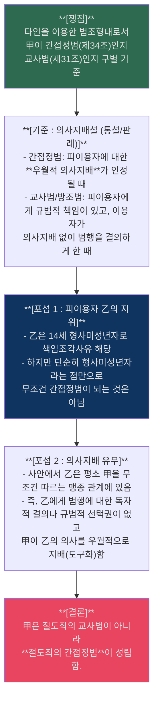
> [!NOTE] 심화 쟁점 (정범 배후의 정범)
> 만약 피이용자가 책임을 지는 완전한 정범임에도 간접정범이 성립할 수 있는가? → 다수설은 부정하나, 판례는 조직적 권력결체(조직폭력배, 국가기관) 등에서 배후의 흑막 지배자가 현장 실행행위자를 지배하는 경우 **'정범 배후의 정범(간접정범)'** 성립을 긍정함.

## 8. [보강] 기말 핵심 개념 카드

### 📊 과실범 기본축 추가 카드
| 항목 | 내용 | 답안 포인트 |
|---|---|---|
| **객관적 주의의무** | 결과예견의무 + 결과회피의무 | 두 요소를 나눠 적으면 구조가 선명해진다 |
| **신뢰의 원칙** | 타인도 규칙을 지킬 것이라는 신뢰 | 지휘·감독자나 주도적 지위는 예외 가능 |
| **다수설 구조** | 구성요건요소이면서 책임요소 | 구성요건과 책임의 양쪽에서 보게 된다 |

- `[강의록 정리]` 객관적 주의의무의 내용은 결과예견의무와 결과회피의무로 정리된다.
  - 근거 발췌: "① 결과예견의무, ② 결과회피의무"
  - 근거 위치: [《형법의_기초이론_1_서보학_기말_분리정리.md》 L83 | "① 결과예견의무, ② 결과회피의무"]

### 📊 결과적 가중범 추가 카드
| 항목 | 내용 | 답안 포인트 |
|---|---|---|
| **구조** | 기본범죄에 고의, 중한 결과에 과실 | 고의와 과실의 결합범 |
| **직접성** | 중한 결과가 기본범의 전형적 위험 실현이어야 함 | 단순 우연적 결과는 배제 |
| **사례 포섭** | 결과가 기본행위의 위험범위 안인지 먼저 본다 | 상당인과관계와 연결 |

- `[강의록 정리]` 결과적 가중범은 기본범죄의 전형적 위험이 중한 결과로 직접 실현된 경우를 중심으로 잡는다.
  - 근거 발췌: "직접성"; "유형적 위험의 실현"
  - 근거 위치: [《형법의_기초이론_1_서보학_기말_분리정리.md》 L90-L96 | "직접성"] [《형법의_기초이론_1_서보학_기말_분리정리.md》 L90-L96 | "유형적 위험의 실현"]

### 📊 부작위범 보증인지위 카드
| 근거 | 설명 | 자주 나오는 예시 |
|---|---|---|
| **법령** | 법규가 직접 작위의무 부과 | 경찰관 직무 |
| **계약·사무관리** | 보호의무를 인수한 경우 | 의사·간병관계 |
| **선행행위** | 자신의 선행행위로 위험 유발 | 위험상태 초래 후 방치 |
| **생활관계** | 밀접한 보호관계 | 부모·자녀, 노모 사례 |

- `[강의록 정리]` 보증인지위는 법령, 계약·사무관리, 선행행위, 밀접한 생활관계 등에서 발생하는 것으로 정리한다.
  - 근거 발췌: "보증인지위"
  - 근거 위치: [《형법의_기초이론_1_서보학_기말_분리정리.md》 L102-L116 | "보증인지위"]

### 📊 미수론 추가 카드
| 쟁점 | 정리 | 답안 문장 |
|---|---|---|
| **실행의 착수** | 실질적 객관설이 다수설·판례 | 현실적 위험성 중심 |
| **중지미수** | 자의로 중지했는지 판단 | 장애의 내외부를 나눠 쓴다 |
| **불능미수** | 위험성 판단이 핵심 | 행위 당시 일반인의 관점까지 함께 검토 |

- `[강의록 정리]` 실행의 착수는 실질적 객관설, 즉 현실적 위험성 기준으로 보는 것이 다수설·판례라고 정리한다.
  - 근거 발췌: "실질적 객관설(다수설, 판례): 현실적 위험성"
  - 근거 위치: [《형법의_기초이론_1_서보학_기말_분리정리.md》 L124 | "실질적 객관설(다수설, 판례): 현실적 위험성"]

### 📊 공범·§33 빠른 점검 카드
| 쟁점 | 내용 | 포섭 포인트 |
|---|---|---|
| **교사범 이탈** | 실행행위에 들어가기 전 교사결의 해소 필요 | 단순 후회만으로 부족 |
| **공모관계 이탈** | 결의 해소 또는 기여 철회가 필요 | 이후 결과에 대한 책임 차단 여부 검토 |
| **§33 해석** | 신분이 구성요건요소인지 형벌요소인지 먼저 구별 | 본문/단서 적용 순서화 |

- `[강의록 정리]` §33은 해석론 자체가 핵심 쟁점이므로, 신분의 성질을 먼저 확정한 뒤 본문과 단서를 나눠 적용해야 한다.
  - 근거 발췌: "제33조 해석론 ★"
  - 근거 위치: [《형법의_기초이론_1_서보학_기말_분리정리.md》 L200 | "제33조 해석론 ★"]
