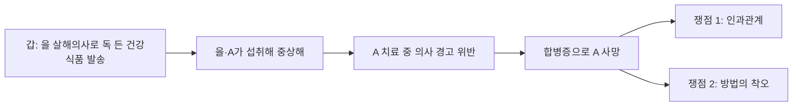

# 형법의 기초이론 1 서보학 통합노트

## 0. 소스 범위
- `강의계획서`: `형1_강의계획서.pdf`
- `수업/선배 정리자료`: `형1_서보학_중간_강의록_김혜선.docx`, `형1_서보학_기말_강의록_김혜선.docx`, `형1_서보학_중간_판례_정리_김혜선.docx`, `형1_서보학_기말_판례_정리_김혜선.docx`, `형1_서보학_기말_요약본_김혜선.docx`, `형1_서보학_기말_사례_정리_김혜선.docx`
- `기출`: `형법의_기초이론_1_서보학_2023_중간/기말고사_문제_23.jpg`, `형법의_기초이론_1_서보학_2025_중간/기말고사_문제_25.pdf`, `형1_서보학_2025_중간2등답안_25.pdf`
- `교재 목차/보강 범위`: `김기용_형법총론_목차_26.pdf`, `김성돈_형법총론_목차_25.pdf`, `메가로이어스  Lawyers for Lawyers.jpeg.png`
- 한계
  - 2023 중간·기말은 JPG 이미지라 세부 사실관계 일부는 판독이 불완전하다.
  - 따라서 2023 문항 중 일부는 질문 문구 수준까지만 확인 가능하고, 세부 논점명은 `자료 부족—보류`로 둔다.

## 1. 전체 흐름
- 강의계획서 기준 수업 배치는 `죄형법정주의와 형법의 적용범위 -> 범죄의 개념·주체·행위론·부작위범 -> 구성요건·인과관계·객관적 귀속 -> 고의·과실·결과적 가중범·구성요건착오 -> 위법성론 -> 책임론 -> 미수론 -> 공범론 -> 죄수론·형벌론` 순서다.
  - 근거 발췌: "죄형법정주의와 형법의 적용범위"; "5/25 ~ 5/31 죄수론 , 형벌론"
  - 근거 위치: [《형1_강의계획서.pdf》 p.3 | "죄형법정주의와 형법의 적용범위"] [《형1_강의계획서.pdf》 p.3 | "5/25 ~ 5/31 죄수론 , 형벌론"]
- 실제 강의록도 중간에는 `죄형법정주의·행위론·구성요건론·인과관계와 객관적 귀속·고의·미필적 고의·개괄적 고의·구성요건착오·위법성론`, 기말에는 `자구행위·정당행위·원인에 있어서 자유로운 행위·금지착오·강요된 행위·과실범론·결과적 가중범·부작위범론·미수론·정범 및 공범론`을 중심으로 정리되어 있다.
  - 근거 발췌: "죄형법정주의"; "위법성론"; "★ 원인에 있어서 자유로운 행위"; "정범 및 공범론"
  - 근거 위치: [《형1_서보학_중간_강의록_김혜선.docx》 소제목 "죄형법정주의" | "죄형법정주의"] [《형1_서보학_중간_강의록_김혜선.docx》 소제목 "위법성론" | "위법성론"] [《형1_서보학_기말_강의록_김혜선.docx》 소제목 "원인에 있어서 자유로운 행위" | "★ 원인에 있어서 자유로운 행위"] [《형1_서보학_기말_강의록_김혜선.docx》 소제목 "정범 및 공범론" | "정범 및 공범론"]

## 2. 반복 기출 표시가 붙은 핵심 쟁점
- `신뢰의 원칙`: `17, 20` 표시.
  - 근거 발췌: "신뢰의 원칙 ★ 17, 20"
  - 근거 위치: [《형1_서보학_기말_요약본_김혜선.docx》 소제목 "과실범 (제14조)" | "신뢰의 원칙 ★ 17, 20"]
- `결과적 가중범`: `23` 표시.
  - 근거 발췌: "결과적 가중범 (제15조 2항) 23"
  - 근거 위치: [《형1_서보학_기말_요약본_김혜선.docx》 소제목 "결과적 가중범 (제15조 2항)" | "결과적 가중범 (제15조 2항) 23"]
- `부작위범`: `17, 20, 23` 표시.
  - 근거 발췌: "부작위범 (제18조) 17, 20, 23"
  - 근거 위치: [《형1_서보학_기말_요약본_김혜선.docx》 소제목 "부작위범 (제18조)" | "부작위범 (제18조) 17, 20, 23"]
- `장애미수`, `중지미수`, `불능미수`: 미수론 내부에서도 반복 표시가 분명하다.
  - 근거 발췌: "장애미수(제25조) 17"; "중지미수(제26조) 17"; "불능미수(제27조) ★ 17, 20"
  - 근거 위치: [《형1_서보학_기말_요약본_김혜선.docx》 소제목 "장애미수(제25조)" | "장애미수(제25조) 17"] [《형1_서보학_기말_요약본_김혜선.docx》 소제목 "중지미수(제26조)" | "중지미수(제26조) 17"] [《형1_서보학_기말_요약본_김혜선.docx》 소제목 "불능미수(제27조)" | "불능미수(제27조) ★ 17, 20"]
- `공동정범`, `공모관계이탈`, `공모공동정범`, `합동범의 공동정범`, `교사범`, `형법 제33조 해석론`이 공범론에서 반복 표시가 가장 강하다.
  - 근거 발췌: "공동정범 (제30조) 17"; "공모관계이탈 ★ ... 17, 20, 23"; "공모공동정범 ... 20, 23"; "합동범의 공동정범 ★ ... 20, 23"; "교사범 (제31조) 20"; "형법 제33조의 해석론 ★ 20"
  - 근거 위치: [《형1_서보학_기말_요약본_김혜선.docx》 소제목 "공동정범 (제30조)" | "공동정범 (제30조) 17"] [《형1_서보학_기말_요약본_김혜선.docx》 소제목 "공동정범 (제30조)" | "공모관계이탈 ★ ... 17, 20, 23"] [《형1_서보학_기말_요약본_김혜선.docx》 소제목 "공동정범 (제30조)" | "공모공동정범 ... 20, 23"] [《형1_서보학_기말_요약본_김혜선.docx》 소제목 "합동범" | "합동범의 공동정범 ★ ... 20, 23"] [《형1_서보학_기말_요약본_김혜선.docx》 소제목 "교사범 (제31조)" | "교사범 (제31조) 20"] [《형1_서보학_기말_요약본_김혜선.docx》 소제목 "정범·공범과 신분 (제33조)" | "형법 제33조의 해석론 ★ 20"]

## 3. 연도별 기출 포인트
### 3-1. 2025 중간
- 질문 1은 답안 자료가 직접 `인과관계`와 `구성요건적 착오의 한계사례`를 논점으로 잡고, 결론도 `을에 대한 살인미수 + A에 대한 과실치사` 구조로 정리한다. 즉 제3자 피해 발생형 사례에서 인과관계와 착오 경계를 묻는 문제다.
  - 근거 발췌: "인과관계가 문제"; "구성요건적 착오의 한계사례"; "살인미수와 A에 대한 과실치사"
  - 근거 위치: [《형1_서보학_2025_중간2등답안_25.pdf》 p.1 | "인과관계가 문제"] [《형1_서보학_2025_중간2등답안_25.pdf》 p.1-2 | "구성요건적 착오의 한계사례"] [《형1_서보학_2025_중간2등답안_25.pdf》 p.2 | "살인미수와 A에 대한 과실치사"]
- 질문 2는 `개괄적 고의 사례`로 명시된다.
  - 근거 발췌: "소위 개괄적 고의 사례"; "개괄적 고의의 법적 취급"
  - 근거 위치: [《형1_서보학_2025_중간2등답안_25.pdf》 p.3 | "소위 개괄적 고의 사례"] [《형1_서보학_2025_중간2등답안_25.pdf》 p.3 | "개괄적 고의의 법적 취급"]
- 질문 3은 `계속적 침해에 대한 정당방위`와 `긴급피난`을 함께 묻는다. 따라서 2025 중간은 `인과관계·착오 -> 개괄적 고의 -> 위법성론`의 3축이 명확하다.
  - 근거 발췌: "계속적 침해에 대한 정당방위"; "긴급피난은 성립할 수 있는지"
  - 근거 위치: [《형1_서보학_2025_중간2등답안_25.pdf》 p.3 | "계속적 침해에 대한 정당방위"] [《형1_서보학_2025_중간2등답안_25.pdf》 p.3 | "긴급피난은 성립할 수 있는지"]

### 3-2. 2025 기말
- 사례 1은 `무, Z의 형사책임`, 사례 2는 `무, Z, T의 형사책임`, 사례 3은 `절도와 관련한 무의 형사책임`을 묻는다.
  - 근거 발췌: "질문1"; "절도와 관련한 무의 형사책임"
  - 근거 위치: [《형법의_기초이론_1_서보학_2025_기말고사_문제_25.pdf》 p.1 | "질문1"] [《형법의_기초이론_1_서보학_2025_기말고사_문제_25.pdf》 p.1 | "절도와 관련한 무의 형사책임"]
- 기말 요약본과 사례정리의 배치상, 이 시험은 `원자행위·부작위범·공동정범·공모관계이탈·절도 관련 미수/공범` 묶음과 강하게 연결된다. 다만 세부 문항별 논점명은 시험지 단독으로 명시되어 있지 않아 일부는 `자료 부족—보류`다.
  - 근거 발췌: "주모자 A가 실행의 착수 전 이탈"; "공모관계이탈 ★"
  - 근거 위치: [《형1_서보학_기말_사례_정리_김혜선.docx》 소제목 "[주모자 A가 실행의 착수 전 이탈하고, B, C만 실행의 착수 한 경우]" | "주모자 A가 실행의 착수 전 이탈"] [《형1_서보학_기말_요약본_김혜선.docx》 소제목 "공동정범 (제30조)" | "공모관계이탈 ★"]

### 3-3. 2023 중간
- 질문 1은 `무의 형사책임`과 변형문제로 `무의 아들이 건강식품을 꺼내 먹고 사망한 경우`를 별도로 묻는다. 즉 독물 투입, 제3자 피해, 고의·과실 경계형 문제가 확인된다.
  - 근거 발췌: "질문(1)"; "무의 아들이 건강식품"
  - 근거 위치: [《형법의_기초이론_1_서보학_2023_중간고사_문제_23.jpg》 (확인 불가—위치 식별자 부족) | "질문(1)"] [《형법의_기초이론_1_서보학_2023_중간고사_문제_23.jpg》 (확인 불가—위치 식별자 부족) | "무의 아들이 건강식품"]
- 질문 2, 질문 3도 각각 `Z의 형사책임`, `Z와 C의 형사책임`을 묻는 사례형이지만, 이미지 판독 한계로 세부 논점명까지는 확정하기 어렵다.
  - 근거 발췌: "질문(2)"; "질문(3)"
  - 근거 위치: [《형법의_기초이론_1_서보학_2023_중간고사_문제_23.jpg》 (확인 불가—위치 식별자 부족) | "질문(2)"] [《형법의_기초이론_1_서보학_2023_중간고사_문제_23.jpg》 (확인 불가—위치 식별자 부족) | "질문(3)"]

### 3-4. 2023 기말
- 질문 1은 `무의 형사책임`, 질문 2는 `피해자 A의 사망에 대한 ... 형사책임`, 질문 3은 `무의 형사책임`을 묻는다.
  - 근거 발췌: "질문(1)"; "피해자 A의 사망"
  - 근거 위치: [《형법의_기초이론_1_서보학_2023_기말고사_문제_23.jpg》 (확인 불가—위치 식별자 부족) | "질문(1)"] [《형법의_기초이론_1_서보학_2023_기말고사_문제_23.jpg》 (확인 불가—위치 식별자 부족) | "피해자 A의 사망"]
- 사례정리와 맞춰 보면 `공모관계이탈`, `부작위에 의한 살인/방조`, `원인에 있어서 자유로운 행위`와의 연결 가능성이 크다. 다만 이는 대응 추론 수준이므로 문항별 확정 논점으로 단정하지는 않는다.
  - 근거 발췌: "살인방조죄"; "원인에 있어서의 자유로운 행위"
  - 근거 위치: [《형1_서보학_기말_사례_정리_김혜선.docx》 소제목 "[보라매병원]" | "살인방조죄"] [《형1_서보학_기말_사례_정리_김혜선.docx》 소제목 "[B를 죽이려고 술 먹었는데 D를 죽인 경우]" | "원인에 있어서의 자유로운 행위"]

## 4. 사례형 연습자료에서 직접 드러난 고빈도 사례
- `보라매병원`: 부작위에 의한 살인죄 공동정범 vs 작위에 의한 살인방조죄.
  - 근거 발췌: "살인방조죄"
  - 근거 위치: [《형1_서보학_기말_사례_정리_김혜선.docx》 소제목 "[보라매병원]" | "살인방조죄"]
- `노모 사례`: 부작위에 의한 존속살인죄.
  - 근거 발췌: "부작위에 의한 존속살인죄"
  - 근거 위치: [《형1_서보학_기말_사례_정리_김혜선.docx》 소제목 "[노모]" | "부작위에 의한 존속살인죄"]
- `경찰관 사례`: 보증인지위 발생근거.
  - 근거 발췌: "보증인지위"
  - 근거 위치: [《형1_서보학_기말_사례_정리_김혜선.docx》 소제목 "[경찰관]" | "보증인지위"]
- `독살 실패 사례`: 장애미수 vs 불능미수.
  - 근거 발췌: "장애미수로 볼 것이 아니라 불능미수"
  - 근거 위치: [《형1_서보학_기말_사례_정리_김혜선.docx》 소제목 "[독살: 치사량 미달의 독인데, 친구가 토한 경우]" | "장애미수로 볼 것이 아니라 불능미수"]
- `화폐위조 사례`: 목적범에서 목적 없는 고의 있는 도구, 예비·간접정범.
  - 근거 발췌: "통화위조예비죄"; "간접정범"
  - 근거 위치: [《형1_서보학_기말_사례_정리_김혜선.docx》 소제목 "[화폐위조]" | "통화위조예비죄"] [《형1_서보학_기말_사례_정리_김혜선.docx》 소제목 "[화폐위조]" | "간접정범"]
- `안수기도 사례`: 중대한 과실.
  - 근거 발췌: "중대한 과실"
  - 근거 위치: [《형1_서보학_기말_사례_정리_김혜선.docx》 소제목 "[84세 노인과 11세 아이가 내장파열로 사망한 사건]" | "중대한 과실"]
- `비만 친구 사례`: 공모공동정범, 특수강도.
  - 근거 발췌: "특수강도죄의 공동정범"
  - 근거 위치: [《형1_서보학_기말_사례_정리_김혜선.docx》 소제목 "[비만으로 인해 주저앉은 친구]" | "특수강도죄의 공동정범"]
- `주모자 이탈 사례`: 공모관계이탈, 특수절도 중지미수/장애미수.
  - 근거 발췌: "공모관계이탈"; "특수절도의 중지미수"
  - 근거 위치: [《형1_서보학_기말_사례_정리_김혜선.docx》 소제목 "[주모자 A가 실행의 착수 전 이탈하고, B, C만 실행의 착수 한 경우]" | "공모관계이탈"] [《형1_서보학_기말_사례_정리_김혜선.docx》 소제목 "[주모자 A가 실행의 착수 전 이탈하고, B, C만 실행의 착수 한 경우]" | "특수절도의 중지미수"]
- `친구 돈 보관 사례`: 업무상횡령과 부진정신분범 공범.
  - 근거 발췌: "업무상 횡령죄"; "부진정 신분범"
  - 근거 위치: [《형1_서보학_기말_사례_정리_김혜선.docx》 소제목 "[친구의 돈을 맡아 보관하던 자]" | "업무상 횡령죄"] [《형1_서보학_기말_사례_정리_김혜선.docx》 소제목 "[친구의 돈을 맡아 보관하던 자]" | "부진정 신분범"]
- `술 먹고 다른 사람 살해 사례`: 원인에 있어서 자유로운 행위.
  - 근거 발췌: "원인에 있어서의 자유로운 행위"
  - 근거 위치: [《형1_서보학_기말_사례_정리_김혜선.docx》 소제목 "[B를 죽이려고 술 먹었는데 D를 죽인 경우]" | "원인에 있어서의 자유로운 행위"]

## 5. 판례 정리와 시험 연결
- 중간 범위 판례 묶음은 `죄형법정주의·소급효`, `구성요건론·법인의 범죄능력·고의·착오`, `위법성론`으로 정리된다.
  - 근거 발췌: "2015헌바239"; "82도2595"; "86도1406"
  - 근거 위치: [《형1_서보학_중간_판례_정리_김혜선.docx》 문단 5 | "2015헌바239"] [《형1_서보학_중간_판례_정리_김혜선.docx》 문단 86 | "82도2595"] [《형1_서보학_중간_판례_정리_김혜선.docx》 문단 142 | "86도1406"]
- 기말 범위 판례 묶음은 `자구행위·정당행위·원자행위`, `금지착오·강요된 행위·과실범`, `부작위범`, `미수론`, `간접정범·공동정범·합동범`, `교사범·공범과 신분`으로 이어진다.
  - 근거 발췌: "84도2582"; "74도2676"; "82도2024"; "85도464"; "2016도17733"; "91도542"
  - 근거 위치: [《형1_서보학_기말_판례_정리_김혜선.docx》 문단 5 | "84도2582"] [《형1_서보학_기말_판례_정리_김혜선.docx》 문단 39 | "74도2676"] [《형1_서보학_기말_판례_정리_김혜선.docx》 문단 67 | "82도2024"] [《형1_서보학_기말_판례_정리_김혜선.docx》 문단 81 | "85도464"] [《형1_서보학_기말_판례_정리_김혜선.docx》 문단 154 | "2016도17733"] [《형1_서보학_기말_판례_정리_김혜선.docx》 문단 211 | "91도542"]
- 따라서 형1 통합노트는 판례와 쟁점을 따로 외우는 과목이 아니라, `어느 장에서 어떤 사례형이 나오고, 그 장을 대표하는 판례군이 무엇인지`를 함께 잡아야 한다.
  - 근거 발췌: "죄형법정주의"; "부작위범 (제18조) 17, 20, 23"; "공모관계이탈 ★"
  - 근거 위치: [《형1_서보학_중간_강의록_김혜선.docx》 소제목 "죄형법정주의" | "죄형법정주의"] [《형1_서보학_기말_요약본_김혜선.docx》 소제목 "부작위범 (제18조)" | "부작위범 (제18조) 17, 20, 23"] [《형1_서보학_기말_요약본_김혜선.docx》 소제목 "공동정범 (제30조)" | "공모관계이탈 ★"]

## 6. 교재 목차 대비 범위 체크
### 6-1. 교재 상위 체계
- 김기용 목차는 `형법의 일반이론 / 범죄론 / 형벌론`으로, 김성돈 목차는 `형법의 의의·적용범위·범죄체계·구성요건·위법성론·책임론·미수범론·가담형태·죄수경합·형사제재·형벌론·보안처분`으로 짜여 있다.
  - 근거 발췌: "형법의 기본개념"; "보안처분"; "제 1부 형법의 의의, 한계, 적용"; "제 2편 범죄의 기본요소"
  - 근거 위치: [《김기용_형법총론_목차_26.pdf》 p.1 | "형법의 기본개념"] [《김기용_형법총론_목차_26.pdf》 p.4 | "보안처분"] [《김성돈_형법총론_목차_25.pdf》 p.8 | "제 1부 형법의 의의, 한계, 적용"] [《김성돈_형법총론_목차_25.pdf》 p.15 | "제 2편 범죄의 기본요소"]

### 6-2. 확인된 범위
- `죄형법정주의·적용범위`, `행위론·구성요건·인과관계·고의·착오`, `위법성론`, `책임론·원자행위·금지착오·강요된 행위`, `과실범·결과적 가중범·부작위범·미수론·공범론`은 모두 강의록, 요약본, 답안 자료로 확인된다.
  - 근거 발췌: "죄형법정주의와 형법의 적용범위"; "구성요건론"; "위법성론"; "책임론"; "과실범론"; "부작위범 (제18조) 17, 20, 23"
  - 근거 위치: [《형1_강의계획서.pdf》 p.3 | "죄형법정주의와 형법의 적용범위"] [《형1_서보학_중간_강의록_김혜선.docx》 소제목 "구성요건론" | "구성요건론"] [《형1_서보학_중간_강의록_김혜선.docx》 소제목 "위법성론" | "위법성론"] [《형1_서보학_기말_강의록_김혜선.docx》 소제목 "책임론" | "책임론"] [《형1_서보학_기말_강의록_김혜선.docx》 소제목 "과실범론" | "과실범론"] [《형1_서보학_기말_요약본_김혜선.docx》 소제목 "부작위범 (제18조)" | "부작위범 (제18조) 17, 20, 23"]

### 6-3. 상대적으로 흔적이 약한 부분
- 소스만으로 `실제 수업에서 넘겼다`고 단정할 수 있는 부분은 없다. 강의계획서에는 `죄수론, 형벌론`까지 배치되어 있기 때문이다.
  - 근거 발췌: "5/25 ~ 5/31 죄수론 , 형벌론"
  - 근거 위치: [《형1_강의계획서.pdf》 p.3 | "5/25 ~ 5/31 죄수론 , 형벌론"]
- 다만 현재 정리본·강의록·기출 기준으로는 `형법의 기본개념 일부`, `죄수론`, `형벌론`, `보안처분 독립단원`은 상대적으로 흔적이 약하다.
  - 근거 발췌: "형법의 지위 및 성격"; "형법의 기능"; "죄수론"; "보안처분"
  - 근거 위치: [《김기용_형법총론_목차_26.pdf》 p.1 | "형법의 지위 및 성격"] [《김기용_형법총론_목차_26.pdf》 p.1 | "형법의 기능"] [《김기용_형법총론_목차_26.pdf》 p.3 | "죄수론"] [《김기용_형법총론_목차_26.pdf》 p.4 | "보안처분"]

## 7. 메가로이어스 수강현황 기준 보강 우선순위
- 스크린샷상 현재 수강이 확인되는 회차는 `1강 100%`, `2강 100%`, `15강 76%`, `16강 100%`, `17강 13%`이고, 그 외 보이는 회차는 대부분 `0% 미수강`이다. 즉 실제 수강 흔적은 `교안 16~30`, `111~129` 일부에 몰려 있다.
  - 근거 발췌: "1강 [1-1] 교안 (16~22)"; "2강 [1-2] 교안 (23~30)"; "15강 [5-3] 교안 (111~117)"; "17강 [6-2] 교안 (122~129)"
  - 근거 위치: [《메가로이어스  Lawyers for Lawyers.jpeg.png》 (확인 불가—위치 식별자 부족) | "1강 [1-1] 교안 (16~22)"] [《메가로이어스  Lawyers for Lawyers.jpeg.png》 (확인 불가—위치 식별자 부족) | "2강 [1-2] 교안 (23~30)"] [《메가로이어스  Lawyers for Lawyers.jpeg.png》 (확인 불가—위치 식별자 부족) | "15강 [5-3] 교안 (111~117)"] [《메가로이어스  Lawyers for Lawyers.jpeg.png》 (확인 불가—위치 식별자 부족) | "17강 [6-2] 교안 (122~129)"]
- `1순위 보강: 13~18강 (교안 98~136)`. 2025 중간 답안이 직접 `인과관계`, `구성요건적 착오의 한계사례`, `개괄적 고의`를 논점으로 잡으므로 중간 대비의 최우선 보강구간이다.
  - 근거 발췌: "제3절 인과관계 96"; "제6절 과실 130"; "인과관계가 문제"; "구성요건적 착오의 한계사례"; "소위 개괄적 고의 사례"
  - 근거 위치: [《김기용_형법총론_목차_26.pdf》 p.2 | "제3절 인과관계 96"] [《김기용_형법총론_목차_26.pdf》 p.2 | "제6절 과실 130"] [《형1_서보학_2025_중간2등답안_25.pdf》 p.1-3 | "인과관계가 문제"] [《형1_서보학_2025_중간2등답안_25.pdf》 p.1-2 | "구성요건적 착오의 한계사례"] [《형1_서보학_2025_중간2등답안_25.pdf》 p.3 | "소위 개괄적 고의 사례"]
- `2순위 보강: 10~12강 (교안 79~97)`. 부작위범은 반복 표시가 가장 선명하고 사례정리도 전부 이 단원과 연결된다.
  - 근거 발췌: "제2절 부작위범 79"; "부작위범 (제18조) 17, 20, 23"; "살인방조죄"; "부작위에 의한 존속살인죄"
  - 근거 위치: [《김기용_형법총론_목차_26.pdf》 p.2 | "제2절 부작위범 79"] [《형1_서보학_기말_요약본_김혜선.docx》 소제목 "부작위범 (제18조)" | "부작위범 (제18조) 17, 20, 23"] [《형1_서보학_기말_사례_정리_김혜선.docx》 소제목 "[보라매병원]" | "살인방조죄"] [《형1_서보학_기말_사례_정리_김혜선.docx》 소제목 "[노모]" | "부작위에 의한 존속살인죄"]
- `3순위 보강: 18~24강 (교안 130~176)`. `신뢰의 원칙`, `결과적 가중범`, `정당방위/긴급피난`이 여기 몰려 있다.
  - 근거 발췌: "신뢰의 원칙 ★ 17, 20"; "결과적 가중범 (제15조 2항) 23"; "계속적 침해에 대한 정당방위"; "긴급피난은 성립할 수 있는지"
  - 근거 위치: [《형1_서보학_기말_요약본_김혜선.docx》 소제목 "과실범 (제14조)" | "신뢰의 원칙 ★ 17, 20"] [《형1_서보학_기말_요약본_김혜선.docx》 소제목 "결과적 가중범 (제15조 2항)" | "결과적 가중범 (제15조 2항) 23"] [《형1_서보학_2025_중간2등답안_25.pdf》 p.3 | "계속적 침해에 대한 정당방위"] [《형1_서보학_2025_중간2등답안_25.pdf》 p.3 | "긴급피난은 성립할 수 있는지"]
- `4순위 보강: 31~33강 (교안 259~287)`. 미수론 내부에서 반복 표시가 뚜렷하다.
  - 근거 발췌: "제2절 장애미수 256"; "제3절 중지미수 272"; "제4절 불능미수 279"; "장애미수(제25조) 17"; "불능미수(제27조) ★ 17, 20"
  - 근거 위치: [《김기용_형법총론_목차_26.pdf》 p.3 | "제2절 장애미수 256"] [《김기용_형법총론_목차_26.pdf》 p.3 | "제3절 중지미수 272"] [《김기용_형법총론_목차_26.pdf》 p.3 | "제4절 불능미수 279"] [《형1_서보학_기말_요약본_김혜선.docx》 소제목 "장애미수(제25조)" | "장애미수(제25조) 17"] [《형1_서보학_기말_요약본_김혜선.docx》 소제목 "불능미수(제27조)" | "불능미수(제27조) ★ 17, 20"]
- `5순위 보강: 37~46강 (교안 308~385)`. 공범론과 공범-신분 문제에서 반복 표시가 가장 많이 모인다.
  - 근거 발췌: "제2절 공동정범 312"; "제4절 교사범 348"; "제6절 공범과 신분 371"; "공모관계이탈 ★ ... 17, 20, 23"; "공모공동정범 ... 20, 23"; "형법 제33조의 해석론 ★ 20"
  - 근거 위치: [《김기용_형법총론_목차_26.pdf》 p.3 | "제2절 공동정범 312"] [《김기용_형법총론_목차_26.pdf》 p.3 | "제4절 교사범 348"] [《김기용_형법총론_목차_26.pdf》 p.3 | "제6절 공범과 신분 371"] [《형1_서보학_기말_요약본_김혜선.docx》 소제목 "공동정범 (제30조)" | "공모관계이탈 ★ ... 17, 20, 23"] [《형1_서보학_기말_요약본_김혜선.docx》 소제목 "공동정범 (제30조)" | "공모공동정범 ... 20, 23"] [《형1_서보학_기말_요약본_김혜선.docx》 소제목 "정범·공범과 신분 (제33조)" | "형법 제33조의 해석론 ★ 20"]

## 8. 압축 결론
- 중간 핵심은 `죄형법정주의 + 인과관계/객관적 귀속 + 고의/착오 + 정당방위/긴급피난`이다.
- 기말 핵심은 `원자행위 + 금지착오 + 과실/신뢰원칙 + 결과적 가중범 + 부작위범 + 미수 + 공범`이다.
- 반복 출제 표식이 가장 강한 것은 `부작위범`, `공모관계이탈`, `공모공동정범`, `불능미수`, `신뢰의 원칙`, `결과적 가중범`이다.
- `넘어간 부분`은 소스만으로 단정할 수 없다. 다만 현재 정리·기출 흔적이 약한 단원은 `형법의 기본개념 일부`, `죄수론`, `형벌론`, `보안처분 독립단원`이다.

## 9. 주요판례·판례태도 정리
- `인과관계`에서는 강의록이 판례를 `상당인과관계설`로 정리한다. 동시에 강의록은 `판례는 객관적 귀속 인정하지 않으므로`라고 적고 있어, 수업상 판례 축은 `상당인과관계설 중심`으로 봐야 한다.
  - 근거 발췌: "판례는 객관적 귀속 인정하지 않으므로 정면으로 나올 가능성 희박"; "상당인과관계설(판례)"
  - 근거 위치: [《형법의_기초이론_1_서보학_중간_강의록_김혜선.docx》 문단 182 | "판례는 객관적 귀속 인정하지 않으므로 정면으로 나올 가능성 희박"] [《형법의_기초이론_1_서보학_중간_강의록_김혜선.docx》 문단 214 | "상당인과관계설(판례)"]
- `미필적 고의`에서는 판례가 `용인설`이라는 점이 반복 강조된다. 다만 강의록은 그 자체로 끝내지 않고 곧바로 비판까지 붙인다.
  - 근거 발췌: "용인설(판례)"; "구성요건 단계에서 고의와 과실의 정확한 구별이 필요한 현재의 체계론에 용인설은 맞지 않는다고 비판"
  - 근거 위치: [《형법의_기초이론_1_서보학_중간_강의록_김혜선.docx》 문단 292 | "용인설(판례)"] [《형법의_기초이론_1_서보학_중간_강의록_김혜선.docx》 문단 295 | "구성요건 단계에서 고의와 과실의 정확한 구별이 필요한 현재의 체계론에 용인설은 맞지 않는다고 비판"]
- `개괄적 고의`에서는 판례가 `단일행위설`을 취하고, 강의록은 다수설로 `인과과정 착오설`을 적어 둔다. 따라서 시험에서는 `판례와 다수설이 갈리는 지점` 자체를 서술해야 한다.
  - 근거 발췌: "개괄적 고의에 의한 단일행위설(판례)"; "인과과정 착오설(다수설)"
  - 근거 위치: [《형법의_기초이론_1_서보학_중간_강의록_김혜선.docx》 문단 313 | "개괄적 고의에 의한 단일행위설(판례)"] [《형법의_기초이론_1_서보학_중간_강의록_김혜선.docx》 문단 314 | "인과과정 착오설(다수설)"]
- `공모관계이탈`은 기말 요약본이 `전체적 해결방법(다수설, 判例)`과 `개별적 해결방법`의 대립으로 정리한다. 형1 공범론에서는 이 둘을 안 쓰면 답안이 성립하지 않는다.
  - 근거 발췌: "공모관계이탈"; "전체적 해결방법(다수설, 判例)"; "개별적 해결방법"
  - 근거 위치: [《형법의_기초이론_1_서보학_기말_요약본_김혜선.docx》 문단 129 | "공모관계이탈"] [《형법의_기초이론_1_서보학_기말_요약본_김혜선.docx》 문단 132 | "전체적 해결방법(다수설, 判例)"] [《형법의_기초이론_1_서보학_기말_요약본_김혜선.docx》 문단 132 | "개별적 해결방법"]
- `공모공동정범`과 `형법 제33조`는 강의록·요약본 모두에서 `다수설과 판례가 갈리는 대표 주제`로 정리된다. 특히 제33조는 기말 요약본이 아예 `시험에 굉장히 잘 나오는 것`이라고 표시한다.
  - 근거 발췌: "원래 현장에 있는 사람만 특수절도로 처벌한다는 게 다수설"; "공모공동정범O"; "형법 제33조의 해석론★ 20… 간단하게 보자 근데 이것도 시험에 굉장히 잘 나오는 것"; "소수설(判例)"
  - 근거 위치: [《형법의_기초이론_1_서보학_중간_강의록_김혜선.docx》 문단 58 | "원래 현장에 있는 사람만 특수절도로 처벌한다는 게 다수설"] [《형법의_기초이론_1_서보학_기말_요약본_김혜선.docx》 문단 142 | "소수설(判例)은 객관적 요건을 완화하여 공모공동정범O"] [《형법의_기초이론_1_서보학_기말_요약본_김혜선.docx》 문단 208 | "형법 제33조의 해석론★ 20… 간단하게 보자 근데 이것도 시험에 굉장히 잘 나오는 것"] [《형법의_기초이론_1_서보학_기말_요약본_김혜선.docx》 문단 209 | "소수설(判例)"]

## 10. 학설·판례·검토
- `인과관계`는 강의록상 `조건설/상당인과관계설`로 끝나는 것이 아니라 `합법칙적 조건설`과 `객관적 귀속`까지 포함한 구조로 정리된다. 수업 메모는 다수설을 `이원적 방법`으로, 조건설·상당인과관계설을 `일원론적 해결방법`으로 대비한다.
  - 근거 발췌: "다수설: 결과귀속을 보통 두 단계를 거쳐 판단(이원적 방법)"; "상당인과관계설(판례)"; "조건설, 상당인과관계설은 ... 한 번에 해결"; "합법칙적 조건설은 이원론적 해결방법"
  - 근거 위치: [《형법의_기초이론_1_서보학_중간_강의록_김혜선.docx》 문단 186 | "다수설: 결과귀속을 보통 두 단계를 거쳐 판단(이원적 방법)"] [《형법의_기초이론_1_서보학_중간_강의록_김혜선.docx》 문단 214 | "상당인과관계설(판례)"] [《형법의_기초이론_1_서보학_중간_강의록_김혜선.docx》 문단 221 | "조건설, 상당인과관계설은 ... 한 번에 해결"] [《형법의_기초이론_1_서보학_중간_강의록_김혜선.docx》 문단 221 | "합법칙적 조건설은 이원론적 해결방법"]
- `고의와 착오` 파트는 `용인설`, `개괄적 고의`, `구성요건적 착오`가 한 세트다. 특히 강의록은 판례와 달리 `구체적 부합설이 타당하다`고 적고 있어, 단순 판례정리 과목이 아니라 학설 비교까지 요구된다는 점이 분명하다.
  - 근거 발췌: "용인설(판례)"; "개괄적 고의에 의한 단일행위설(판례)"; "구체적 부합설"; "판례 입장과는 달리 구체적 부합설이 타당하다"
  - 근거 위치: [《형법의_기초이론_1_서보학_중간_강의록_김혜선.docx》 문단 292 | "용인설(판례)"] [《형법의_기초이론_1_서보학_중간_강의록_김혜선.docx》 문단 313 | "개괄적 고의에 의한 단일행위설(판례)"] [《형법의_기초이론_1_서보학_중간_강의록_김혜선.docx》 문단 424 | "구체적 부합설"] [《형법의_기초이론_1_서보학_중간_강의록_김혜선.docx》 문단 440 | "판례 입장과는 달리 구체적 부합설이 타당하다"]
- `오상방위·위전착` 쪽은 결과적으로 `법효과제한적 책임설(다수설)`이 중심이다. 다만 강의록은 이 견해를 적은 뒤 즉시 `고의책임과 과실책임은 성질이 다르다`는 비판까지 붙인다.
  - 근거 발췌: "법효과제한적 책임설(다수설)"; "비판) 고의책임과 과실책임은 성질이 아예 다르므로 이론상 부적절"
  - 근거 위치: [《형법의_기초이론_1_서보학_중간_강의록_김혜선.docx》 문단 526 | "법효과제한적 책임설(다수설)"] [《형법의_기초이론_1_서보학_중간_강의록_김혜선.docx》 문단 527 | "비판) 고의책임과 과실책임은 성질이 아예 다르므로 이론상 부적절"]
- `공범론`에서는 `공모관계이탈`, `공모공동정범`, `과실범의 공동정범`, `제33조`를 분리하지 말고 한 블록으로 봐야 한다. 자료는 이 네 항목 모두에서 `다수설 vs 판례` 구도를 반복해서 표시한다.
  - 근거 발췌: "전체적 해결방법(다수설, 判例)"; "부정설(다수설)은 공동정범의 객관적 요건을 충족하지 못했으니 공모공동정범X"; "과실범의 공동정범"; "1)다수설 ... 2)소수설(判例)"
  - 근거 위치: [《형법의_기초이론_1_서보학_기말_요약본_김혜선.docx》 문단 132 | "전체적 해결방법(다수설, 判例)"] [《형법의_기초이론_1_서보학_기말_요약본_김혜선.docx》 문단 142 | "부정설(다수설)은 공동정범의 객관적 요건을 충족하지 못했으니 공모공동정범X"] [《형법의_기초이론_1_서보학_기말_요약본_김혜선.docx》 문단 147 | "과실범의 공동정범"] [《형법의_기초이론_1_서보학_기말_요약본_김혜선.docx》 문단 209 | "1)다수설 ... 2)소수설(判例)"]

## 11. 비판 메모
- `용인설`에 대한 비판은 강의록에 직접 적혀 있다. 즉 현재의 체계론에서는 고의와 과실을 구성요건 단계에서 분명히 갈라야 하므로, 감정적 태도 중심의 용인설은 그대로 받아들이기 어렵다는 문제의식이다.
  - 근거 발췌: "구성요건 단계에서 고의와 과실의 정확한 구별이 필요한 현재의 체계론에 용인설은 맞지 않는다고 비판"
  - 근거 위치: [《형법의_기초이론_1_서보학_중간_강의록_김혜선.docx》 문단 295 | "구성요건 단계에서 고의와 과실의 정확한 구별이 필요한 현재의 체계론에 용인설은 맞지 않는다고 비판"]
- `법효과제한적 책임설`에 대한 비판도 직접 제시된다. 이 자료는 고의범을 과실범처럼 처벌하는 구조 자체가 이론적으로 무리라고 본다.
  - 근거 발췌: "고의책임과 과실책임은 성질이 아예 다르므로 이론상 부적절"
  - 근거 위치: [《형법의_기초이론_1_서보학_중간_강의록_김혜선.docx》 문단 527 | "고의책임과 과실책임은 성질이 아예 다르므로 이론상 부적절"]
- 공범론에서는 자료가 판례보다 `다수설 정리`를 더 선호하는 흔적이 남아 있다. 공모공동정범, 과실범 공동정범, 제33조 모두에서 요약본이 먼저 `다수설`을 적고 판례를 별도로 병기하기 때문이다.
  - 근거 발췌: "부정설(다수설)"; "과실범의 공동정범★"; "1)다수설 ... 2)소수설(判例)"
  - 근거 위치: [《형법의_기초이론_1_서보학_기말_요약본_김혜선.docx》 문단 142 | "부정설(다수설)"] [《형법의_기초이론_1_서보학_기말_요약본_김혜선.docx》 문단 147 | "과실범의 공동정범★"] [《형법의_기초이론_1_서보학_기말_요약본_김혜선.docx》 문단 209 | "1)다수설 ... 2)소수설(判例)"]
- 다만 형1 자료는 강의록·요약본에서 사건번호보다 `쟁점별 판례 태도`를 먼저 정리하는 형식이다. 따라서 위 쟁점들 중 일부의 개별 사건번호는 이번 소스만으로는 추가 특정하지 못했고, 사건번호 중심 판례목록은 자료 부족으로 보류한다.

## 12. 중요도 구분
- `[A급] 인과관계·구성요건적 착오·개괄적 고의·미필적 고의·오상방위`. 2025 중간 우수답안과 2023 모의답안이 공통으로 이 축을 정면으로 다룬다. 형1 중간은 사실상 이 묶음을 정확히 쓸 수 있는지가 점수를 가른다.
  - 근거 발췌: "인과관계가 문제"; "구성요건적 착오의 한계사례"; "소위 개괄적 고의 사례"; "미필적고의"; "오상방위"
  - 근거 위치: [《형법의_기초이론_1_서보학_2025_중간2등답안_25.pdf》 p.1 | "인과관계가 문제"] [《형법의_기초이론_1_서보학_2025_중간2등답안_25.pdf》 p.2 | "구성요건적 착오의 한계사례"] [《형법의_기초이론_1_서보학_2025_중간2등답안_25.pdf》 p.3 | "소위 개괄적 고의 사례"] [《형법의_기초이론_1_서보학_중간_모의답안_2023_김혜선.pdf》 1-2 | "미필적고의"] [《형법의_기초이론_1_서보학_중간_모의답안_2023_김혜선.pdf》 2 | "오상방위"]
- `[B급] 정당방위·긴급피난·자구행위·공모관계이탈·형법 제33조`. 출제 빈도와 중요도가 낮다는 뜻이 아니라, A급 틀 위에 얹히는 응용군이라는 뜻이다. 특히 공범론 파트는 중간 후반~기말 연결축으로 반드시 따로 정리해야 한다.
  - 근거 발췌: "자구행위/긴급피난"; "공모관계이탈"; "형법 제33조의 해석론★"
  - 근거 위치: [《형법의_기초이론_1_서보학_중간_모의답안_2023_김혜선.pdf》 3 | "자구행위/긴급피난"] [《형법의_기초이론_1_서보학_기말_요약본_김혜선.docx》 문단 129 | "공모관계이탈"] [《형법의_기초이론_1_서보학_기말_요약본_김혜선.docx》 문단 208 | "형법 제33조의 해석론★"]
- `[C급] 형법 기본개념 일반론`. 범위에서 지워도 된다는 뜻이 아니라, 현재 직접 확보한 모의답안·우수답안에서 상대적으로 비중이 옅다는 뜻이다. 회독 순서는 뒤로 미루되, 강의록의 큰 체계는 유지해야 한다.
  - 근거 발췌: "형법의 기본개념"; "형법의 지위 및 성격"
  - 근거 위치: [《김기용_형법총론_목차_26.pdf》 p.1 | "형법의 기본개념"] [《김기용_형법총론_목차_26.pdf》 p.1 | "형법의 지위 및 성격"]

## 13. 수업노트식 상세 흐름
- `1단 묶음: 인과관계`. 형1에서는 인과관계를 쓰면서 동시에 `어느 학설을 취할지`, `판례는 무엇인지`, `객관적 귀속을 따로 볼지`를 함께 정리해야 한다. 2025 중간답안은 이 부분을 첫 문제의 맨 앞에서 정면으로 묻는다.
  - 근거 발췌: "인과관계의 판단기준이 문제"; "조건설"; "상당인과관계설"; "합법칙적 조건설"; "판례는 ... 상당한 인과관계를 인정할 수 있다고"
  - 근거 위치: [《형법의_기초이론_1_서보학_2025_중간2등답안_25.pdf》 p.1 | "인과관계의 판단기준이 문제"] [《형법의_기초이론_1_서보학_2025_중간2등답안_25.pdf》 p.1 | "조건설"] [《형법의_기초이론_1_서보학_2025_중간2등답안_25.pdf》 p.1 | "상당인과관계설"] [《형법의_기초이론_1_서보학_2025_중간2등답안_25.pdf》 p.1 | "합법칙적 조건설"] [《형법의_기초이론_1_서보학_2025_중간2등답안_25.pdf》 p.1 | "판례는 ... 상당한 인과관계를 인정할 수 있다고"]
- `2단 묶음: 구성요건적 착오와 개괄적 고의`. 수업노트식으로는 `방법의 착오 -> 법정적 부합설/구체적 부합설 -> 개괄적 고의 -> 객관적 귀속` 순으로 연결해 두는 편이 좋다. 2025 중간이 실제로 이 순서로 문제를 냈다.
  - 근거 발췌: "구성요건적 착오의 한계 사례"; "구체적 부합설"; "법정적 부합설"; "소위 개괄적 고의 사례"; "개괄적 고의에 의한 단일행위설"
  - 근거 위치: [《형법의_기초이론_1_서보학_2025_중간2등답안_25.pdf》 p.2 | "구성요건적 착오의 한계 사례"] [《형법의_기초이론_1_서보학_2025_중간2등답안_25.pdf》 p.2 | "구체적 부합설"] [《형법의_기초이론_1_서보학_2025_중간2등답안_25.pdf》 p.2 | "법정적 부합설"] [《형법의_기초이론_1_서보학_2025_중간2등답안_25.pdf》 p.3 | "소위 개괄적 고의 사례"] [《형법의_기초이론_1_서보학_2025_중간2등답안_25.pdf》 p.3 | "개괄적 고의에 의한 단일행위설"]
- `3단 묶음: 미필적 고의와 오상방위`. 2023 모의답안은 `미필적 고의`와 `오상방위`를 각각 독립문제로 다룬다. 따라서 형1에서는 고의론과 위법성론이 분리되어 보이더라도 실제 답안 훈련에서는 연속된 세트로 보는 것이 좋다.
  - 근거 발췌: "미필적고의"; "오상방위"; "용인설"; "법효과제한적책임설"
  - 근거 위치: [《형법의_기초이론_1_서보학_중간_모의답안_2023_김혜선.pdf》 1-2 | "미필적고의"] [《형법의_기초이론_1_서보학_중간_모의답안_2023_김혜선.pdf》 2 | "오상방위"] [《형법의_기초이론_1_서보학_중간_모의답안_2023_김혜선.pdf》 1-2 | "용인설"] [《형법의_기초이론_1_서보학_중간_모의답안_2023_김혜선.pdf》 2 | "법효과제한적책임설"]
- `4단 묶음: 정당방위·긴급피난·자구행위`. 사례를 보면 위법성조각사유는 추상적으로 나오지 않고 거의 항상 `몸싸움·도주방지·현장대응` 같은 사실관계 안에서 묶여 나온다. 그래서 수업노트도 논점 제목보다 `사실관계 유형` 중심 메모가 더 잘 남는다.
  - 근거 발췌: "자구행위/긴급피난"; "도망가지 못하도록 팔을 꺾었다"; "긴급피난을 검토"
  - 근거 위치: [《형법의_기초이론_1_서보학_중간_모의답안_2023_김혜선.pdf》 3 | "자구행위/긴급피난"] [《형법의_기초이론_1_서보학_중간_모의답안_2023_김혜선.pdf》 [사례3] | "도망가지 못하도록 팔을 꺾었다"] [《형법의_기초이론_1_서보학_중간_모의답안_2023_김혜선.pdf》 3 | "긴급피난을 검토"]

## 14. 모의답안·우수답안·기출 연결
- `2025 중간 2등답안`은 현재 형1 중간의 핵심을 가장 명확하게 보여 준다. 1문은 `인과관계 + 구성요건적 착오`, 2문은 `개괄적 고의`로 바로 이어진다. 이 정도면 해당 쟁점들은 사실상 A급 범위다.
  - 근거 발췌: "인과관계가 문제"; "구성요건적 착오의 한계 사례"; "소위 개괄적 고의 사례"
  - 근거 위치: [《형법의_기초이론_1_서보학_2025_중간2등답안_25.pdf》 p.1 | "인과관계가 문제"] [《형법의_기초이론_1_서보학_2025_중간2등답안_25.pdf》 p.2 | "구성요건적 착오의 한계 사례"] [《형법의_기초이론_1_서보학_2025_중간2등답안_25.pdf》 p.3 | "소위 개괄적 고의 사례"]
- `2023 중간 모의답안`은 한 회차 안에서 `인과관계론`, `미필적 고의`, `오상방위`, `자구행위/긴급피난`을 전부 묻는다. 따라서 형1 수업노트는 강의록 논점표보다 `문제 세트` 단위로 묶어 회독하는 편이 더 시험적이다.
  - 근거 발췌: "인과관계론/구성요건착오의한계사례"; "미필적고의"; "오상방위"; "자구행위/긴급피난"
  - 근거 위치: [《형법의_기초이론_1_서보학_중간_모의답안_2023_김혜선.pdf》 1-1 | "인과관계론/구성요건착오의한계사례"] [《형법의_기초이론_1_서보학_중간_모의답안_2023_김혜선.pdf》 1-2 | "미필적고의"] [《형법의_기초이론_1_서보학_중간_모의답안_2023_김혜선.pdf》 2 | "오상방위"] [《형법의_기초이론_1_서보학_중간_모의답안_2023_김혜선.pdf》 3 | "자구행위/긴급피난"]
- 이번 턴에서는 `이인규 진도별 변시사시기출 형법사례연습` 파일의 존재는 확인했지만, 현재 범위 세부 쟁점을 직접 추출해 인용하지는 못했다. 따라서 형1 노트의 시험연결은 직접 읽은 `서보학 모의답안 + 우수답안` 중심으로 유지한다.

## 15. 주요 비교 개념 표
### 15-1. 비교표
| 비교축 | A | B | C | 실전 포인트 |
| --- | --- | --- | --- | --- |
| 인과관계 판단 | 조건설 | 상당인과관계설(판례) | 합법칙적 조건설·객관적 귀속 | 답안은 판례와 검토를 분리해 적는 편이 안전하다 |
| 구성요건적 착오 | 구체적 부합설 | 법정적 부합설 | - | 방법의 착오에서 결론이 갈린다 |
| 개괄적 고의 | 단일행위설(판례) | 인과과정착오설(다수설) | 객관적 귀속설 | 수업자료는 판례와 검토를 의도적으로 갈라 적는다 |
| 미필적 고의 | 용인설(판례 근접) | 감수설 | - | 결과발생 가능성 인식만이 아니라 `용인`까지 써야 한다 |
| 공범론 | 전체적 해결방법 | 개별적 해결방법 | - | 공모관계이탈에서 전체 블록으로 정리할지, 개별 분절할지 갈린다 |

### 15-2. 비교 근거
- `조건설 / 상당인과관계설 / 합법칙적 조건설`
  - 근거 발췌: "조건설, 상당인과관계설은 ... 한 번에 해결"; "상당인과관계설(판례)"; "합법칙적 조건설은 이원론적 해결방법"
  - 근거 위치: [《형법의_기초이론_1_서보학_중간_강의록_김혜선.docx》 문단 221 | "조건설, 상당인과관계설은 ... 한 번에 해결"] [《형법의_기초이론_1_서보학_중간_강의록_김혜선.docx》 문단 214 | "상당인과관계설(판례)"] [《형법의_기초이론_1_서보학_중간_강의록_김혜선.docx》 문단 221 | "합법칙적 조건설은 이원론적 해결방법"]
- `구체적 부합설 / 법정적 부합설`
  - 근거 발췌: "구체적 부합설"; "법정적 부합설"; "판례 입장과는 달리 구체적 부합설이 타당하다"
  - 근거 위치: [《형법의_기초이론_1_서보학_중간_강의록_김혜선.docx》 문단 424 | "구체적 부합설"] [《형법의_기초이론_1_서보학_2025_중간2등답안_25.pdf》 p.2 | "법정적 부합설"] [《형법의_기초이론_1_서보학_중간_강의록_김혜선.docx》 문단 440 | "판례 입장과는 달리 구체적 부합설이 타당하다"]
- `단일행위설 / 인과과정착오설 / 객관적 귀속설`
  - 근거 발췌: "개괄적 고의에 의한 단일행위설(판례)"; "인과과정 착오설(다수설)"; "객관적 귀속설"
  - 근거 위치: [《형법의_기초이론_1_서보학_중간_강의록_김혜선.docx》 문단 313 | "개괄적 고의에 의한 단일행위설(판례)"] [《형법의_기초이론_1_서보학_중간_강의록_김혜선.docx》 문단 314 | "인과과정 착오설(다수설)"] [《형법의_기초이론_1_서보학_2025_중간2등답안_25.pdf》 p.3 | "객관적 귀속설"]
- `용인설 / 감수설`
  - 근거 발췌: "용인설은 행위자가 결과발생을 예견하고 그 예견한 결과를 내심으로 용인하고자 하는 의사가 있었을 때"; "감수설은 행위자가 결과를 예견하였으나 목표를 위해 이를 감수할 의사가 있었음이 인정되면"; "判例는 ... 용인설에 가까운 입장"
  - 근거 위치: [《형법의_기초이론_1_서보학_중간_모의답안_2023_김혜선.pdf》 p.3 | "용인설은 행위자가 결과발생을 예견하고 그 예견한 결과를 내심으로 용인하고자 하는 의사가 있었을 때"] [《형법의_기초이론_1_서보학_중간_모의답안_2023_김혜선.pdf》 p.3 | "감수설은 행위자가 결과를 예견하였으나 목표를 위해 이를 감수할 의사가 있었음이 인정되면"] [《형법의_기초이론_1_서보학_중간_모의답안_2023_김혜선.pdf》 p.3 | "判例는 ... 용인설에 가까운 입장"]
- `전체적 해결방법 / 개별적 해결방법`
  - 근거 발췌: "전체적 해결방법(다수설, 判例)"; "개별적 해결방법"
  - 근거 위치: [《형법의_기초이론_1_서보학_기말_요약본_김혜선.docx》 문단 132 | "전체적 해결방법(다수설, 判例)"] [《형법의_기초이론_1_서보학_기말_요약본_김혜선.docx》 문단 132 | "개별적 해결방법"]

## 16. 주요 판례·사례 사실관계 정리
- 형1 자료는 사건번호보다 `사례형 사실관계 + 판례태도`를 중심으로 구성되어 있다. 그래서 아래는 우수답안·모의답안에 나온 사실관계 흐름을 판례태도와 함께 정리한다.

### 16-1. `2025 중간 질문 1` 인과관계 + 구성요건적 착오
- 소스 기준 사실관계: 갑은 을을 살해하려고 `독이 든 건강식품`을 보냈고, 을과 그의 아들 A가 이를 먹어 중상해를 입었다. 이후 A는 치료 중 의사의 경고를 어기고 음식과 수분을 섭취하다가 합병증으로 사망하였다.
- 요지: A의 사망에 대한 인과관계와, 을을 살해하려 했는데 A가 사망한 경우의 `방법의 착오` 처리가 핵심이다.

- 근거 발췌: "갑은 을을 살해할 고의를 가지고 독이 든 건강식품을 을의 집에 보냈고"; "이러한 독이 든 건강식품을 먹은 을과 그의 아들 A는 중대한 상해를 입었다"; "A가 의사의 경고에도 불구하고 스스로의 과실로 음식과 수분을 함부로 섭취하면서 합병증이 발병하여 사망하였다"; "그 결과 A가 사망한 경우 이러한 착오의 법적 취급이 문제된다"
- 근거 위치: [《형법의_기초이론_1_서보학_2025_중간2등답안_25.pdf》 p.1 | "갑은 을을 살해할 고의를 가지고 독이 든 건강식품을 을의 집에 보냈고"] [《형법의_기초이론_1_서보학_2025_중간2등답안_25.pdf》 p.1 | "이러한 독이 든 건강식품을 먹은 을과 그의 아들 A는 중대한 상해를 입었다"] [《형법의_기초이론_1_서보학_2025_중간2등답안_25.pdf》 p.1 | "A가 의사의 경고에도 불구하고 스스로의 과실로 음식과 수분을 함부로 섭취하면서 합병증이 발병하여 사망하였다"] [《형법의_기초이론_1_서보학_2025_중간2등답안_25.pdf》 p.1 | "그 결과 A가 사망한 경우 이러한 착오의 법적 취급이 문제된다"]

### 16-2. `2025 중간 질문 2` 개괄적 고의
- 소스 기준 사실관계: 을은 B를 살해하려고 `흉기로 머리를 내리쳐` 상해를 입혔고, B가 정신을 잃자 죽은 줄 알고 `야산에 묻었다`. 이후 B는 질식하여 사망하였다.
- 요지: 제1행위에서 결과가 발생했다고 오인한 채 제2행위로 실제 결과를 발생시킨 `개괄적 고의` 사례다. 판례는 단일행위설을 취하지만, 답안 검토에서는 객관적 귀속설을 따로 비교한다.

- 근거 발췌: "을은 B를 살해할 고의로 흉기로 B의 머리를 내리쳐 상해를 입혔다"; "을은 B를 끌고 가 야산에 묻었고"; "이에 의하여 B가 질식하여 사망"; "이는 소위 개괄적 고의 사례에 해당한다"
- 근거 위치: [《형법의_기초이론_1_서보학_2025_중간2등답안_25.pdf》 p.3 | "을은 B를 살해할 고의로 흉기로 B의 머리를 내리쳐 상해를 입혔다"] [《형법의_기초이론_1_서보학_2025_중간2등답안_25.pdf》 p.3 | "을은 B를 끌고 가 야산에 묻었고"] [《형법의_기초이론_1_서보학_2025_중간2등답안_25.pdf》 p.3 | "이에 의하여 B가 질식하여 사망"] [《형법의_기초이론_1_서보학_2025_중간2등답안_25.pdf》 p.3 | "이는 소위 개괄적 고의 사례에 해당한다"]

### 16-3. `2023 중간 모의 1-2` 미필적 고의
- 소스 기준 사실관계: 갑은 A를 살해하려고 독이 든 건강식품을 보냈고, `식구들이 먹고 죽을 수도 있다는 가능성`을 염두에 두면서도 `죽어도 상관없다`고 생각했다. 이후 A의 아들이 그 건강식품을 먹고 사망한 사안으로 변형된다.
- 요지: 결과발생 가능성 인식만이 아니라 `용인하는 내심의 의사`가 있었는지가 핵심이며, 자료는 용인설을 기준으로 미필적 고의를 인정한다.

- 근거 발췌: "甲은 혹시 A의 식구들이 먹고 죽을 수도 있다는 가능성을 염두에 두었으나"; "나쁜 사람들의 식구들이니까 죽어도 상관없다고 생각했다"; "만약 [사례1]에서 A의 아들이 건강식품을 꺼내 먹고 사망한 경우"; "용인설"
- 근거 위치: [《형법의_기초이론_1_서보학_중간_모의답안_2023_김혜선.pdf》 p.1 | "甲은 혹시 A의 식구들이 먹고 죽을 수도 있다는 가능성을 염두에 두었으나"] [《형법의_기초이론_1_서보학_중간_모의답안_2023_김혜선.pdf》 p.1 | "나쁜 사람들의 식구들이니까 죽어도 상관없다고 생각했다"] [《형법의_기초이론_1_서보학_중간_모의답안_2023_김혜선.pdf》 p.3 | "만약 [사례1]에서 A의 아들이 건강식품을 꺼내 먹고 사망한 경우"] [《형법의_기초이론_1_서보학_중간_모의답안_2023_김혜선.pdf》 p.3 | "용인설"]

### 16-4. `2023 중간 모의 2` 오상방위
- 소스 기준 사실관계: 甲이 사법경찰관에게 긴급체포되는 장면을 본 주민이 `깡패에 의한 납치`로 오인하고, 甲을 구하려고 경찰관을 공격한 사안이다.
- 요지: 객관적 정당방위 상황은 없지만 행위자가 존재한다고 오신한 `오상방위` 사례로, 자료는 법효과제한적 책임설과 판례 태도를 함께 비교한다.

- 근거 발췌: "동네 주민 Z은 B이 깡패들에 의해 납치되는 것으로 오해"; "甲을 구하기 위해 사법경찰관을 공격하여 공무집행을 방해하였다"; "오상방위"; "법효과제한적책임설"
- 근거 위치: [《형법의_기초이론_1_서보학_중간_모의답안_2023_김혜선.pdf》 p.1 | "동네 주민 Z은 B이 깡패들에 의해 납치되는 것으로 오해"] [《형법의_기초이론_1_서보학_중간_모의답안_2023_김혜선.pdf》 p.1 | "甲을 구하기 위해 사법경찰관을 공격하여 공무집행을 방해하였다"] [《형법의_기초이론_1_서보학_중간_모의답안_2023_김혜선.pdf》 p.4 | "오상방위"] [《형법의_기초이론_1_서보학_중간_모의답안_2023_김혜선.pdf》 p.4 | "법효과제한적책임설"]

### 16-5. `2023 중간 모의 3` 자구행위·긴급피난
- 소스 기준 사실관계: 음식값을 내지 않고 도망가려는 손님 C를 식당 주인 Z이 쫓아가 붙잡고 `도망가지 못하도록 팔을 꺾은` 사안이다.
- 요지: 자료는 자구행위와 긴급피난을 함께 검토하도록 배치한다. 위법성조각사유는 조문명보다 `도주방지·현장제압` 같은 사실관계 유형으로 외워 두는 편이 낫다.

- 근거 발췌: "음식값을 지불하지 않고 몰래 식당을 나가는 모습을 발견"; "도망가지 못하도록 팔을 꺾었다"; "자구행위/긴급피난"
- 근거 위치: [《형법의_기초이론_1_서보학_중간_모의답안_2023_김혜선.pdf》 p.1 | "음식값을 지불하지 않고 몰래 식당을 나가는 모습을 발견"] [《형법의_기초이론_1_서보학_중간_모의답안_2023_김혜선.pdf》 p.1 | "도망가지 못하도록 팔을 꺾었다"] [《형법의_기초이론_1_서보학_중간_모의답안_2023_김혜선.pdf》 p.1 | "자구행위/긴급피난"]
