# 형법의 기초이론 I 서보학 중간 암기정리노트 (도표추가본)

## 0. 범위 전제
- 2025 중간 답안에서 직접 확인되는 논점은 `인과관계`, `구성요건적 착오의 한계사례`, `[[개괄적 고의]]`, `계속적 침해에 대한 [[정당방위]]`, `[[긴급피난]]`이다. [《형1_서보학_2025_중간2등답안_25.pdf》 p.1-3]
- `2017·2023 HWP 원본` 기준으로 직접 확인되는 역대 중간 논점은 2017의 `인과관계론`, `[[오상방위]]`, `[[긴급피난]](고의에 의한 자초위난)`, `[[자구행위]]`와, 2023의 `인과관계론/구성요건착오의 한계사례`, `[[미필적 고의]]`, `오상방위`, `자구행위/긴급피난`이다.
- 중간 강의록의 직접 소제목 범위는 `[[죄형법정주의]]`, `행위론`, `구성요건론`, `인과관계와 [[객관적 귀속]]`, `고의`, `미필적 고의와 인식 있는 과실`, `[[개괄적 고의]]`, `구성요건착오`, `위법성론`, `[[정당방위]]`, `[[긴급피난]]`까지다.
- `홍형철 보강자료`: `홍형철_쟁점정리_형법_25.pdf`
- `중요도 범례`: `★★★` 메인쟁점·반복출제 / `★★` 요건·비교·포섭축 / `★` 보조쟁점·개념정리

## 0-1. 형법 쟁점정리식 읽는 순서

### 📊 형1 중간 독법
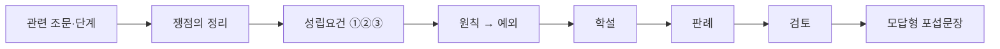

1. 형법은 민사식 요건사실론으로 바로 밀기보다, 먼저 **어느 조문·어느 단계 문제인지**와 **쟁점명**을 잡고 읽는다.
2. 중간 범위의 `인과관계·[[객관적 귀속]]`, `고의`, `구성요건적 착오`, `[[오상방위]]`는 기본적으로 `쟁점의 정리 → 학설 → 판례 → 검토` 순으로 읽는다.
3. `[[정당방위]]`, `[[긴급피난]]`, `[[자구행위]]`처럼 조문요건이 뚜렷한 파트만 `요건 ①②③ → 원칙·예외 → 판례 → 검토` 순으로 본다.
4. 판례는 결론만 외우지 말고 **판례문구 한 줄**까지 붙여서 읽는다.
5. 마지막에는 반드시 **모답형 포섭문장**으로 닫아야 시험장에서 바로 꺼내 쓸 수 있다.

- `홍형철 구조`: 홍형철 쟁점정리는 사례형에 바로 쓰는 쟁점을 `쟁점의 정리 - 학설 - 판례 - 검토` 순서로 정리하고, 연결사안은 답안 목차까지 함께 잡는 방식을 취한다.
  - 근거 발췌: "‘쟁점의 정리 - 학설 - 판례 - 검토’ 순서대로 정리"; "답안작성에 필요한 목차와 그에 따른 세부쟁점 내용을 한 번에 정리"
  - 근거 위치: [《홍형철_쟁점정리_형법_ocr_extract.md》 L54-L60 | "‘쟁점의 정리 - 학설 - 판례 - 검토’ 순서대로 정리"] [《홍형철_쟁점정리_형법_ocr_extract.md》 L57-L60 | "답안작성에 필요한 목차와 그에 따른 세부쟁점 내용을 한 번에 정리"]

## 0-2. 홍형철식 쟁점 블록 운영법

| 논점 유형 | 기본 틀 | 이 노트에서의 적용 단원 |
|---|---|---|
| **쟁점형 논점** | `쟁점의 정리 → 학설 → 판례 → 검토 → 모답형` | `4-3 인과관계·객관적 귀속`, `4-4 고의`, `4-6 구성요건적 착오`, `4-9 오상방위` |
| **조문형 논점** | `조문·요건 ①②③ → 원칙·예외 → 판례 → 검토 → 모답형` | `4-7 정당방위`, `4-8 긴급피난`, `4-10 자구행위` |
| **사례연결형 논점** | `쟁점별 소제목 → 각 쟁점 안에서 같은 순서 → 결론` | `2025 중간 사례체크`, `정당방위·긴급피난 비교`, `오상방위·우연방위 모답형` |

- `운영 기준`: 쟁점형은 홍형철식 4단을 그대로 따르고, 조문형은 요건을 맨 앞에 두되 그 뒤를 `학설·판례·검토` 순으로 닫는 혼합형이 가장 안정적이다.
  - 근거 발췌: "쟁점의 정리"; "견해의 대립"; "판례의 태도"; "검토"; "답안작성에 필요한 목차"
  - 근거 위치: [《홍형철_쟁점정리_형법_ocr_extract.md》 L372-L388 | "쟁점의 정리" / "견해의 대립" / "판례의 태도" / "검토"] [《홍형철_쟁점정리_형법_ocr_extract.md》 L1487-L1520 | "답안작성에 필요한 목차"]

### 📊 역대 중간 기출 논점 반복 패턴
| 논점 | 2017 | 2023 | 2025 | 출제 빈도 | 중요도 |
|---|:---:|:---:|:---:|:---:|:---:|
| **인과관계·객관적 귀속** | ✅ | ✅ | ✅ | 3/3 | ★★★ |
| **구성요건적 착오(한계사례)** | | ✅ | ✅ | 2/3 | ★★★ |
| **오상방위** | ✅ | ✅ | | 2/3 | ★★ |
| **자구행위** | ✅ | ✅ | | 2/3 | ★★ |
| **긴급피난(자초위난)** | ✅ | ✅ | ✅ | 3/3 | ★★★ |
| **정당방위(현재성·상당성)** | | | ✅ | 1/3 | ★★ |
| **개괄적 고의** | | | ✅ | 1/3 | ★ |
| **미필적 고의** | | ✅ | | 1/3 | ★★ |

### 📊 중간 답안 구조 패턴
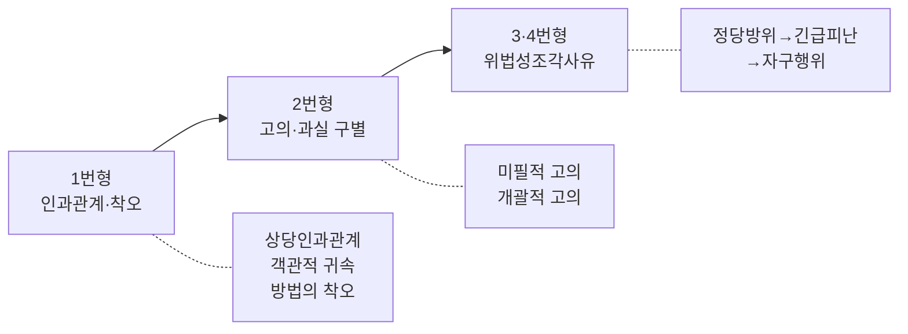

---

## 1. 봐야할 강의
### 최소
- `13~17강 (교안 98~129)`: `인과관계 → 고의 → 구성요건적 착오` 축. 15~17강만 일부 수강, 13~14강이 비어 있음.
- `22~25강 (교안 158~192)`: `위법성론 일반 → [[정당방위]] → [[긴급피난]] → [[자구행위]]` 축. 자구행위까지 봐야 안전.
- `10~12강 (교안 79~97)`: `부작위범 → 인과관계 초입`. 인과관계 문제 풀려면 같이 봐야 함.

### 권장
- `18~21강 (교안 130~157)`: `과실·결과적 가중범` (18~20강 이미 완강, 21강만 미수강)
- `3~9강 (교안 31~79)`: `[[죄형법정주의]] 후반·적용범위·행위론·구성요건론 도입`

---

## 2. 중간에서 직접 묻는 쟁점 지도

### 📊 사례형 답안 작성 플로우차트
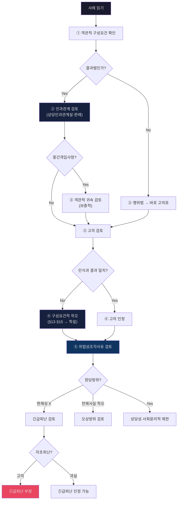

---

## 3. 역대 중간 기출 쟁점 총정리

### 3-1 2025 중간
- `질문1`: `독물투입 → 제3자 복용·사망 → 중간개입사정이 있는 결과귀속 → 구성요건적 착오 한계사례`. 결론: `을에 대한 살인미수와 A에 대한 과실치사의 상상적 경합`. [《형1_서보학_2025_중간2등답안_25.pdf》 p.1-2]
- `질문2`: `제1행위 상해·살해의도 + 제2행위 매장 + 질식사` = `소위 [[개괄적 고의]] 사례`. [《형1_서보학_2025_중간2등답안_25.pdf》 p.3]
- `질문3`: `계속된 성적 침해 + [[정당방위]] 현재성 + [[긴급피난]] 보충성·균형성`. [《형1_서보학_2025_중간2등답안_25.pdf》 p.3-4]

### 3-2 2023 중간
- `1-1`: `제3자 사망형 인과관계` + `법정적 부합설에 따른 고의 전용`. [《형1_서보학_중간_모의답안_2023_김혜선.pdf》 p.1-2]
- `1-2`: `[[미필적 고의]]` — 용인설 적용. [《형1_서보학_중간_모의답안_2023_김혜선.pdf》 p.3]
- `2번`: `[[오상방위]]` → 법효과제한적책임설. [《형1_서보학_중간_모의답안_2023_김혜선.pdf》 p.4]
- `3번`: `[[자구행위]]` + `[[긴급피난]](고의 자초위난 부정)`. [《형1_서보학_중간_모의답안_2023_김혜선.pdf》 p.5-6]

### 3-3 2017 중간
- `1번`: `상해 후 치료과정 피해자 과실 개입 → [[상당인과관계]] 인정`. [《형1_서보학_중간_모의답안_2017_김혜선.pdf》 p.1-2]
- `2번`: `[[오상방위]]` → 법효과제한적책임설 → 과실치상. [《형1_서보학_중간_모의답안_2017_김혜선.pdf》 p.2]
- `3번`: `[[긴급피난]](고의 자초위난)` — 정당방위에 대한 [[정당방위]] X → 긴급피난으로 → 고의 자초위난 부정. [《형1_서보학_중간_모의답안_2017_김혜선.pdf》 p.2-3]
- `4번`: `[[자구행위]]` — 택시비 청구권 보전. [《형1_서보학_중간_모의답안_2017_김혜선.pdf》 p.3]

### 📊 역대 기출 사례 유형 분류
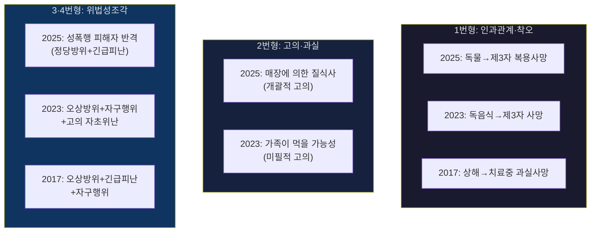

### 3-4 가용 소스 기준 반복축
- 서보학 중간은 해마다 `인과관계-고의/착오-위법성조각사유`를 묶어 내는 경향이 강하다.
- `독물투입과 제3자 결과발생`, `인과관계와 결과귀속`, `구성요건적 착오의 한계사례`, `[[미필적 고의]]`, `[[오상방위]]`, `[[개괄적 고의]]`, `계속적 침해와 [[정당방위]]`, `정당방위가 막힐 때 [[긴급피난]]`, `고의에 의한 자초위난`, `[[자구행위]]`가 핵심 반복축.

---

## 4. 암기 정리노트

### 4-1 죄형법정주의 — ★★

#### 📊 죄형법정주의 파생원칙 체계도
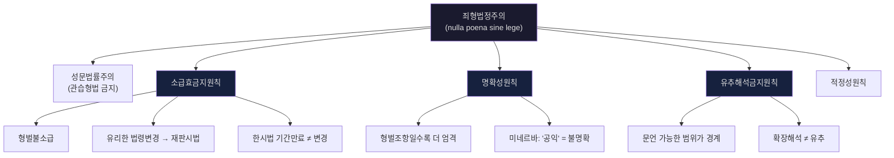

- `[개념요지]` 죄형법정주의는 형벌법규를 해석의 대상으로 삼되, 문언의 한계를 넘어 피고인에게 불리하게 넓혀 만들지는 못한다는 원칙이다.
  - 근거 위치: [《형법의_기초이론_1_서보학_중간_분리정리.md》 L49-L55 | "형벌법규는 해석하되 넓혀서 만들지는 않는다"; "문언 해석의 한계를 넘어서는 것"]
- `[개념 정리]` 죄형법정주의의 실전 핵심은 `문언 한계`다. 형벌법규는 해석할 수 있지만, 문언을 넘어 불리하게 확대하면 곧바로 유추금지 문제로 넘어간다.
  - 근거 발췌: "형벌법규는 해석하되 넓혀서 만들지는 않는다"; "문언 해석의 한계를 넘어서는 것"
  - 근거 위치: [《형법의_기초이론_1_서보학_중간_분리정리.md》 L49-L55 | "형벌법규는 해석하되 넓혀서 만들지는 않는다"] [《형법의_기초이론_1_서보학_중간_분리정리.md》 L49-L55 | "문언 해석의 한계를 넘어서는 것"]

- `핵심 한 줄`: "형벌법규는 해석하되 넓혀서 만들지는 않는다"
- `소급효금지`: 노역장유치도 형벌불소급 적용. 유리한 변경은 재판시법, 한시법 기간 만료는 법령변경 아님.
- `명확성`: 미네르바([[2008헌바157]]) — `공익`은 너무 추상적 → 명확성원칙 위반.
- `유추적용금지`: `영상정보를 훼손당한 자`를 `직접 훼손한 자`에게 확장 불가. URL만으로 음란물 `소지` 불가.
- `암기 문장`: `불리한 소급 X / 추상적 공익 X / 문언 넘어 유추 X / URL만으로 소지 X`

#### 📊 보안처분과 소급효금지
| 견해/판례 | 내용 | 정리 |
|---|---|---|
| **긍정설** | 보안처분도 형사제재이므로 소급효금지 적용 | 통설 |
| **부정설** | 장래의 재범위험성에 대한 조치이므로 형벌과 다름 | 소수 |
| **개별판단설** | 자유형적 성격이 강한 보안처분만 적용 | **판례 평가** |

- `보강 포인트`: 보안처분은 하나로 단정하지 않고 `성질별`로 나눠 봐야 한다.
  - 근거 발췌: "긍정설(통설)"; "부정설"; "개별판단설"
  - 근거 위치: [《형법의_기초이론_1_서보학_중간_정리본_김혜선.pdf》 p.1 | "긍정설(통설)"] [《형법의_기초이론_1_서보학_중간_정리본_김혜선.pdf》 p.1 | "부정설"] [《형법의_기초이론_1_서보학_중간_정리본_김혜선.pdf》 p.1 | "개별판단설"]
- `판례 정리`: 사회봉사명령에는 소급효금지의원칙을 적용하지만 보호관찰에는 적용하지 않고, 전자발찌는 비형벌적 보안처분으로 본다.
  - 근거 발췌: "사회봉사명령에 대해서는 소급효금지의원칙을 적용"; "보호관찰에 대해서는 적용하지 않고"; "전자발찌는 비형벌적 보안처분"
  - 근거 위치: [《형법의_기초이론_1_서보학_중간_정리본_김혜선.pdf》 p.1 | "사회봉사명령에 대해서는 소급효금지의원칙을 적용"] [《형법의_기초이론_1_서보학_중간_정리본_김혜선.pdf》 p.1 | "보호관찰에 대해서는 적용하지 않고"] [《형법의_기초이론_1_서보학_중간_정리본_김혜선.pdf》 p.1 | "전자발찌는 비형벌적 보안처분"]
- `검토`: 정리본은 우리 판례를 `개별판단설`로 정리하고 있다.
  - 근거 발췌: "우리 판례는 개별판단설의 입장을 취하고 있다고 볼 것이다"; "개별판단설이 타당하다"
  - 근거 위치: [《형법의_기초이론_1_서보학_중간_정리본_김혜선.pdf》 p.1 | "우리 판례는 개별판단설의 입장을 취하고 있다고 볼 것이다"] [《형법의_기초이론_1_서보학_중간_정리본_김혜선.pdf》 p.1 | "개별판단설이 타당하다"]

#### 📊 형사판례변경과 소급효
| 입장 | 내용 | 정리 |
|---|---|---|
| **소급효긍정설** | 판례는 법원성이 없으므로 소급효금지 비적용 | 학설 |
| **소급효부정설** | 확립판례를 불이익하게 바꾸는 것은 신뢰보호 위반 | 학설 |
| **판례** | 판례변경도 소급적용 가능, 다만 금지착오 문제는 별도 | **현재 판례** |

- `판례 태도`: 재판은 입법자의 진정한 의사를 찾아가는 과정이므로, 판례변경은 성문법 개정과 달리 소급적용이 가능하다고 본다.
  - 근거 발췌: "재판은 입법자의 진정한 의사를 찾아 나가는 과정"; "판례변경은 성문법 개정과는 다르고 소급적용이 가능"
  - 근거 위치: [《형법의_기초이론_1_서보학_중간_정리본_김혜선.pdf》 p.1 | "재판은 입법자의 진정한 의사를 찾아 나가는 과정"] [《형법의_기초이론_1_서보학_중간_정리본_김혜선.pdf》 p.1 | "판례변경은 성문법 개정과는 다르고 소급적용이 가능"]
- `보충 포인트`: 형사처벌의 근거는 판례가 아니라 법률이고, 판례변경으로 인한 문제는 원칙적으로 `금지착오의 정당한 이유` 쪽에서 조절한다.
  - 근거 발췌: "오인의 정당한 이유가 있다면 처벌을 감경하거나 면할 수"; "형사처벌의 근거가 되는 것은 판례가 아니라 법률"
  - 근거 위치: [《형법의_기초이론_1_서보학_중간_정리본_김혜선.pdf》 p.2 | "오인의 정당한 이유가 있다면 처벌을 감경하거나 면할 수"] [《형법의_기초이론_1_서보학_중간_정리본_김혜선.pdf》 p.2 | "형사처벌의 근거가 되는 것은 판례가 아니라 법률"]
- `관련 예시`: 정리본은 `[[83도2330]]`, `[[92도917]]`, `[[98도321]]`을 판례변경·확장 문제와 함께 묶어 둔다.
  - 근거 위치: [《형법의_기초이론_1_서보학_중간_정리본_김혜선.pdf》 p.2 | "[[83도2330]]"] [《형법의_기초이론_1_서보학_중간_정리본_김혜선.pdf》 p.2 | "[[92도917]]"] [《형법의_기초이론_1_서보학_중간_정리본_김혜선.pdf》 p.2 | "[[98도321]]"]

### 4-2 행위론·구성요건론

#### 📊 행위론 학설 비교표
| 학설 | 행위의 정의 | 설명 가능 | 설명 불가 | 지위 |
|---|---|---|---|---|
| **인과적 행위론** | 의사에 의한 신체적 거동 | 작위·고의범 | **부작위범** | 소수 |
| **목적적 행위론** | 목적적 활동 | 고의범 | **과실범** | 소수 |
| **사회적 행위론** | 사회적으로 중요한 행태 | 작위·부작위·고의·과실 모두 | (비판: 내용 모호) | **통설** |

#### 📊 구성요건 구조도
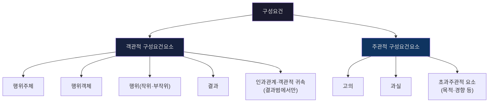

- `행위론 한 줄`: 사회적 행위론(통설)이 네 가지 행위를 가장 넓게 설명.
- `구성요건론 한 줄`: 결과범에서만 인과관계·객관적 귀속이 문제됨.
- `암기 문장`: `행위론은 설명력 / 구성요건은 객관·주관 구분 / 결과범이면 인과관계 들어감`

#### 📊 법인 범죄능력·양벌규정 포인트
| 쟁점 | 판례/헌재 | 결론 |
|---|---|---|
| **법인 범죄능력** | `82도2595` | 법인의 범죄능력 부정 |
| **양벌규정과 책임원칙** | `2005헌가10` | 귀책사유 없는 영업주 처벌 가능성 열어두면 위헌 |

- `판례`: 정리본은 `[[82도2595]]`를 들어 판례가 법인의 범죄능력을 부정설로 본다고 정리한다.
  - 근거 발췌: "법인의 범죄능력을 부인하는 부정설의 입장"; "처벌은 자연인(대표이사)에게로"
  - 근거 위치: [《형법의_기초이론_1_서보학_중간_정리본_김혜선.pdf》 p.2 | "법인의 범죄능력을 부인하는 부정설의 입장"] [《형법의_기초이론_1_서보학_중간_정리본_김혜선.pdf》 p.2 | "처벌은 자연인(대표이사)에게로"]
- `헌재`: `[[2005헌가10]]`은 양벌규정에서도 책임원칙이 적용된다는 점을 분명히 한다.
  - 근거 발췌: "양벌규정에서 법인에게도 책임원칙 적용"; "귀책사유 없는 영업주에 대해 처벌가능성을 열어뒀다는 점에서 책임원칙에 반한다"
  - 근거 위치: [《형법의_기초이론_1_서보학_중간_정리본_김혜선.pdf》 p.2 | "양벌규정에서 법인에게도 책임원칙 적용"] [《형법의_기초이론_1_서보학_중간_정리본_김혜선.pdf》 p.2 | "귀책사유 없는 영업주에 대해 처벌가능성을 열어뒀다는 점에서 책임원칙에 반한다"]

### 4-3 인과관계와 객관적 귀속 — ★★★

#### 홍형철식 쟁점 프레임
- `쟁점의 정리`: 결과범에서는 먼저 인과관계가 문제되고, 다수설 보충으로 객관적 귀속이 별도 제한문제로 따라붙는다. 아래 단원은 `학설 비교 → 판례문구 → 검토 → 모답형` 순으로 읽는다.
  - 근거 발췌: "상당인과관계설"; "법적으로 허용되지 않는 위험의 창출"; "견해의 대립"; "판례의 태도"; "검토"
  - 근거 위치: [《형법의_기초이론_1_서보학_중간_강의록_김혜선.docx》 문단 184 | "상당인과관계설"] [《형법의_기초이론_1_서보학_중간_강의록_김혜선.docx》 문단 202 | "법적으로 허용되지 않는 위험의 창출"] [《홍형철_쟁점정리_형법_ocr_extract.md》 L372-L388 | "견해의 대립" / "판례의 태도" / "검토"]

#### 📊 인과관계 학설 비교표
| 학설 | 핵심 기준 | 인과관계 범위 | 귀속 판단 | 지위 | 해결방법 |
|---|---|---|---|---|---|
| **조건설** | 없었더라면 결과 없었을 것 | 매우 넓음 | 인과관계 안에서 함께 | 소수 | 일원론 |
| **상당인과관계설** | 통찰력 있는 사람 기준 상당성 | 적절히 제한 | 인과관계 안에서 함께 | **판례** | 일원론 |
| **합법칙적 조건설** | 자연과학적 법칙에 합치 | 넓게 인정 | **객관적 귀속론으로 별도** | **다수설** | 이원론 |

#### 📊 일원론 vs 이원론 비교 다이어그램
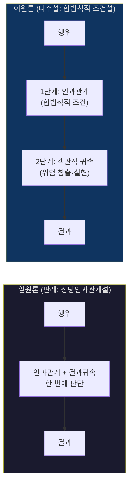

#### 📊 [기출 심화] 제3자 개입 사례의 학설별 해결 (2025 중간 1문)
| 사실관계 | 상당인과관계설 (판례/일원론) | 합법칙적 조건설 (다수설/이원론) |
|---|---|---|
| A가 B 살해 목적으로 독약 투입 → 제3자 C가 독약을 먹고 사망 | **상당인과관계 부정** (통상 예견하기 어려운 이례적 개입) | ① 인과관계 인정 (조건 합치) ② **객관적 귀속 부정** (위험실현 X) |
| **최종 결론** | B에 대한 살인미수 + C에 대한 과실치사 (상상적 경합) | B에 대한 살인미수 + C에 대한 과실치사 (상상적 경합) |

#### 📊 객관적 귀속의 3축 — ★★★
| 단계 | 내용 | 부정되는 경우 |
|---|---|---|
| ① 허용되지 않는 위험의 **창출** | 행위가 법적으로 허용되지 않는 위험을 만들어야 함 | 허용된 위험 범위 내 행위 |
| ② 창출된 위험의 **실현** | 결과가 그 위험의 구체적 실현이어야 함 | 우연한 인과경로, 제3자 독자적 개입 |
| ③ 적법한 대체행위·**의무위반관련성** | 적법하게 행동해도 같은 결과가 발생했을 경우 | 90도2856: 정상 차선으로도 사고 불가피 |

- `교수님 포인트`: "상당인과관계로 정리해두고 사례 잘 숙지하면 됨", "판례는 [[객관적 귀속]] 인정하지 않으므로 정면으로 나올 가능성 희박"
- `답안 순서`: `판례=[[상당인과관계]]` → `보충적으로 [[객관적 귀속]]`
- `근거 위치`: 상당인과관계설·[[합법칙적 조건설]]·일원론/이원론·[[객관적 귀속]] 기준은 [《형법의_기초이론_1_서보학_중간_강의록_김혜선.docx》 문단 178 | "합법칙적 조건설"] [《형법의_기초이론_1_서보학_중간_강의록_김혜선.docx》 문단 184 | "상당인과관계설"] [《형법의_기초이론_1_서보학_중간_강의록_김혜선.docx》 문단 191 | "일원론적 해결방법" / "이원론적 해결방법"] [《형법의_기초이론_1_서보학_중간_강의록_김혜선.docx》 문단 202 | "법적으로 허용되지 않는 위험의 창출"] [《형법의_기초이론_1_서보학_중간_강의록_김혜선.docx》 문단 209-210 | "적법한 대체행위" / "결과발생은 일어난다면"]
- `교수님 저서 보강1`: 다수설은 결과귀속을 `인과관계 → [[객관적 귀속]]`의 2단계로 보고, 객관적 귀속 기준을 `기술되지 아니한 구성요건요소`로 파악한다. [《서보학_형법총론_18.pdf》 p.101 | "다수설은 결과귀속을 보통 두 단계를 거쳐 판단한다" / "객관적 귀속이론의 여러 기준들은 기술되지 아니한 구성요건요소에 해당한다"]
- `교수님 저서 보강2`: 객관적 귀속은 인과관계에 평가를 덧붙이는 `확장론`이 아니라, 법적 의미의 결과귀속을 제한하는 `제한론`으로 정리된다. [《서보학_형법총론_18.pdf》 p.115 | "객관적 귀속이론은 인과관계의 확장론이 아니라 제한론이다"]
- `교수님 저서 보강3`: 허용된 위험은 사회적으로 유용한 활동에 수반되는 위험이 일반적으로 허용되는 경우이고, 이 범위 안의 불행한 결과는 원칙적으로 객관적 귀속이 부정된다. [《서보학_형법총론_18.pdf》 p.116 | "허용된 위험을 수반하는 많은 행동양식들이 공공이익이라는 상위의 근거로부터 일반적으로 허용되는 경우" / "객관적 귀속은 부정된다"]
- `[교수님 저서 보강]` 객관적 귀속은 자연적 인과관계가 있다는 이유만으로 결과를 모두 책임범위에 넣지 않고, 그 결과를 법적으로 귀속시켜도 되는지를 가리는 `제한 판단`이다.
  - 근거 발췌: "결과귀속을 보통 두 단계를 거쳐 판단한다"; "객관적 귀속이론은 인과관계의 확장론이 아니라 제한론이다"
  - 근거 위치: [《서보학_형법총론_18.pdf》 p.101 | "결과귀속을 보통 두 단계를 거쳐 판단한다"] [《서보학_형법총론_18.pdf》 p.115 | "객관적 귀속이론은 인과관계의 확장론이 아니라 제한론이다"]
- `암기 문장`: `인과관계는 넓게, 객관적 귀속은 좁게, 적법한 대체행위면 귀속 끊김`

#### 📊 합법적 대체행위이론
| 항목 | 내용 |
|---|---|
| **핵심** | 적법하게 행동했더라도 같은 결과가 발생하면 결과귀속 부정 |
| **연결 이론** | 의무위반관련성론 |
| **판례** | **90도2856** |
| **반대 입장** | 위험증대이론 |

- `강의록 정리`: 적법한 대체행위와 의무위반관련성론은 `결과발생은 일어난다면` 그 결과를 행위자 책임으로 귀속시킬 수 없다는 입장. [《형법의_기초이론_1_서보학_중간_강의록_김혜선.docx》 문단 209-210 | "결과발생은 일어난다면 발생한 결과를 행위자의 책임으로 귀속시킬 수 없음"]
- `판례문구([[90도2856]])`: "정상 차선으로 달렸다 하더라도 사고는 피할 수 없다" → 중앙선 위 주행만으로는 사고의 직접 원인 아님. [《형법의_기초이론_1_서보학_중간_판례_정리_김혜선.docx》 문단 79 | "정상 차선으로 달렸다 하더라도 사고는 피할 수 없다"]
- `반대이론 메모`: 위험증대이론은 위험을 높였다는 이유만으로 처벌하므로 `침해범을 위험범으로 전환`시키고 `In dubio pro reo`에 반한다는 비판이 정리돼 있음. [《형법의_기초이론_1_서보학_중간_강의록_김혜선.docx》 문단 211 | "침해범을 위험범으로 전환시키는 것" / "In dubio pro reo"]
- `암기 문장`: `합법적으로 했어도 결과 같으면 귀속 X / [[90도2856]]`

#### 📊 홍형철 보강: 객관적 귀속 판단 구조
| 단계 | 문장형 정리 | 원칙·예외 |
|---|---|---|
| **① 개입사정** | 결과가 선행행위가 아니라 후행 제3자 행위에 객관적으로 귀속되면 선행행위에는 미수만 성립할 수 있다. | 다만 그 개입사정이 통상 예견 가능한 정도라면 상당인과관계와 객관적 귀속이 쉽게 끊기지 않는다. |
| **② 적법한 대체행위** | 주의의무를 지켰더라도 같은 결과가 발생했을 개연성이 남으면 결과귀속을 부정한다. | 반대로 적법한 행위였다면 결과가 방지되었음이 입증되면 귀속을 긍정한다. |
| **③ 규범의 보호목적** | 문제된 결과가 그 규범이 보호하려는 범위 안에서 발생한 경우에만 객관적 귀속을 긍정한다. | 반사적 이익 침해에 그치면 귀속이 부정된다. |

- `홍형철 정리`: ① 결과가 후행 독립행위에 귀속되면 선행행위는 미수로 남고, ② 통상 예견 가능한 개입사정이면 인과관계는 유지될 수 있으며, ③ 객관적 귀속은 결국 허용되지 않는 위험이 규범의 보호범위 안에서 실현되었는지를 묻는 제한판단이다.
  - 근거 발췌: "결과는 선행행위가 아니라 나중에 개입한 타행위에 객관적으로 귀속되고, 선행행위에 대해서는 미수범만이 성립"; "그와 같은 사실이 통상 예견할 수 있는 것에 지나지 않는다면"; "당해 규범의 보호범위 안에서 발생한 경우에만 [[객관적 귀속]]"; "반사적 이익에 불과할 경우에는 객관적 귀속이 부정"
  - 근거 위치: [《홍형철_쟁점정리_형법_25.pdf》 p.38 | "결과는 선행행위가 아니라 나중에 개입한 타행위에 객관적으로 귀속되고, 선행행위에 대해서는 미수범만이 성립"] [《홍형철_쟁점정리_형법_25.pdf》 p.38 | "그와 같은 사실이 통상 예견할 수 있는 것에 지나지 않는다면"] [《홍형철_쟁점정리_형법_25.pdf》 p.41 | "당해 규범의 보호범위 안에서 발생한 경우에만 [[객관적 귀속]]"] [《홍형철_쟁점정리_형법_25.pdf》 p.41 | "반사적 이익에 불과할 경우에는 객관적 귀속이 부정"]
- `원칙·예외 문장`: ① 원칙적으로 객관적 귀속은 위험창출과 그 위험의 실현을 묻는 제한판단이고, ② 예외적으로 후행 개입사정이 독자적이면 선행행위는 미수로 남으며, ③ 다시 예외적으로 그 개입사정이 통상 예견 가능한 정도라면 귀속이 단절되지 않을 수 있다.
- `학설 문장`: ① 위험증대설은 적법한 대체행위로도 결과발생 가능성이 남더라도 위험이 증가했다면 귀속을 긍정하고, ② 무죄추정설은 적법행위였다면 결과회피 가능성이 입증된 경우에만 귀속을 긍정하며, ③ 홍형철 정리는 판례가 결론상 무죄추정설에 가깝다고 본다.
  - 근거 발췌: "위험증대설"; "무죄추정설"; "판례는 결론적으로 무죄추정설과 유사"; "주의의무를 준수하였더라면 결과발생이 방지되었을 것임이 입증된 경우에 한하여"
  - 근거 위치: [《홍형철_쟁점정리_형법_25.pdf》 p.39-40 | "위험증대설"] [《홍형철_쟁점정리_형법_25.pdf》 p.39-40 | "무죄추정설"] [《홍형철_쟁점정리_형법_25.pdf》 p.39-40 | "판례는 결론적으로 무죄추정설과 유사"] [《홍형철_쟁점정리_형법_25.pdf》 p.39-40 | "주의의무를 준수하였더라면 결과발생이 방지되었을 것임이 입증된 경우에 한하여"]
- `판례문구([[90도694]])`: "피고인들이 수술 전에 피해자에 대한 간기능검사를 하였더라면 피해자가 사망하지 않았을 것임의 입증"이 있어야 업무상과실치사책임을 물을 수 있다는 구조다.
  - 근거 위치: [《홍형철_쟁점정리_형법_25.pdf》 p.40 | "피고인들이 수술 전에 피해자에 대한 간기능검사를 하였더라면 피해자가 사망하지 않았을 것임의 입증"]

#### ✍️ 인과관계·객관적 귀속 모답형
결과범 사안에서는 먼저 ① 행위가 결과발생의 조건인지와 판례상 상당인과관계가 있는지를 보고, ② 다수설 보충으로 허용되지 않는 위험의 창출·실현이 있는지, ③ 적법한 대체행위나 의무위반관련성 문제로 결과귀속이 끊기는지를 적는다. 따라서 제3자의 독자개입이나 적법한 대체행위가 인정되면 객관적 귀속은 부정되고, 90도2856처럼 적법하게 행동했더라도 같은 결과가 발생했을 사안은 결과를 행위자 책임으로 귀속시키지 않는다.
- 근거 발췌: "상당인과관계설"; "법적으로 허용되지 않는 위험의 창출"; "결과발생은 일어난다면 발생한 결과를 행위자의 책임으로 귀속시킬 수 없음"; "정상 차선으로 달렸다 하더라도 사고는 피할 수 없다"
- 근거 위치: [《형법의_기초이론_1_서보학_중간_강의록_김혜선.docx》 문단 184 | "상당인과관계설"] [《형법의_기초이론_1_서보학_중간_강의록_김혜선.docx》 문단 202 | "법적으로 허용되지 않는 위험의 창출"] [《형법의_기초이론_1_서보학_중간_강의록_김혜선.docx》 문단 209-210 | "결과발생은 일어난다면 발생한 결과를 행위자의 책임으로 귀속시킬 수 없음"] [《형법의_기초이론_1_서보학_중간_판례_정리_김혜선.docx》 문단 79 | "정상 차선으로 달렸다 하더라도 사고는 피할 수 없다"]

### 4-4 고의, 미필적 고의, 인식 있는 과실 — ★★★

#### 홍형철식 쟁점 프레임
- `쟁점의 정리`: 고의는 체계적 지위와 본질을 먼저 잡고, 미필적 고의는 `가능성 인식`이 아니라 `용인·감수`까지 있는지가 핵심이다. 아래 단원은 `개념 정리 → 구별 기준 → 판례 포인트 → 모답형` 순으로 읽는다.
  - 근거 발췌: "고의와 위법성인식을 구별"; "고의는 객관적구성요건요소에 대한 인식과 의지만을 의미"; "가능성을 인식하고 또한 그것을 감수·용인하는 의사"; "용인하지 않은 경우는 인식 있는 과실"
  - 근거 위치: [《형법의_기초이론_1_서보학_중간_강의록_김혜선.docx》 문단 221 | "고의와 위법성인식을 구별"] [《형법의_기초이론_1_서보학_중간_강의록_김혜선.docx》 문단 222 | "고의는 객관적구성요건요소에 대한 인식과 의지만을 의미"] [《형1_서보학_중간_강의록_김혜선.docx》 문단 238-253 | "가능성을 인식하고 또한 그것을 감수·용인하는 의사" / "용인하지 않은 경우는 인식 있는 과실"]

#### 📊 고의의 체계적 지위·본질
| 항목 | 내용 |
|---|---|
| **체계적 지위** | 현재 통설적 정리는 `구성요건요소`로 파악 |
| **위법성인식과 관계** | 위법성인식은 고의에 포함되지 않고 `책임영역`에 남음 |
| **이중적 기능** | 하나의 고의가 `구성요건요소`이면서 동시에 `고의책임의 징표`로 기능 |
| **본질** | 객관적 구성요건요소에 대한 `인식과 의지` |

- `강의록 정리1`: "고의와 위법성인식을 구별"하고, 고의는 구성요건으로 넘어오고 위법성인식은 책임영역에 남는다고 정리됨. [《형법의_기초이론_1_서보학_중간_강의록_김혜선.docx》 문단 221 | "고의와 위법성인식을 구별"]
- `강의록 정리2`: "고의는 객관적구성요건요소에 대한 인식과 의지만을 의미". [《형법의_기초이론_1_서보학_중간_강의록_김혜선.docx》 문단 222 | "고의는 객관적구성요건요소에 대한 인식과 의지만을 의미"]
- `강의록 정리3`: "하나의 고의가 이중지위에서 이중기능"을 갖는다고 정리됨. [《형법의_기초이론_1_서보학_중간_강의록_김혜선.docx》 문단 223 | "하나의 고의가 이중지위에서 이중기능을 갖는 것"]
- `답안 포인트`: 구성요건 단계에서는 `객관적 구성요건요소에 대한 인식·의지`를 쓰고, 위법성인식 문제는 책임 단계의 `금지착오`로 넘기면 됨.
- `암기 문장`: `고의의 본질은 구성요건사실의 인식과 의지 / 위법성인식은 고의 밖, 책임 안`

#### 📊 고의·과실 스펙트럼
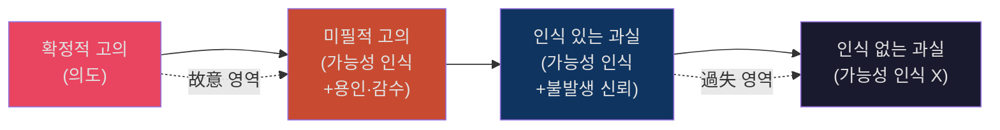

#### 📊 미필적 고의 vs 인식 있는 과실 판단표 — ★★★
| 구분 | 미필적 고의 | 인식 있는 과실 |
|---|---|---|
| **인식** | 결과 발생 **가능성 인식** ✅ | 결과 발생 **가능성 인식** ✅ |
| **의사** | 결과를 **용인·감수** | 결과가 **불발생하리라 신뢰** |
| **내심** | "죽어도 상관없다" | "설마 안 일어나겠지" |
| **판례 예** | 94도1949 (택시 운전자) | 삼풍백화점 ("오늘까진 괜찮겠지") |
| **학설** | 용인설(판례), 감수설 | — |
| **처벌** | **고의범** 처벌 | **과실범** 처벌 (형량↓) |

- `[개념 정리]` 미필적 고의는 결과발생 가능성을 인식하는 데서 그치지 않고 그 결과를 `용인·감수`하는 의사가 있어야 하며, 그 의사가 없고 `설마 안 일어나겠지`라고 믿으면 인식 있는 과실이다.
  - 근거 발췌: "가능성을 인식하고 또한 그것을 감수·용인하는 의사"; "용인한 경우는 [[미필적 고의]]"; "용인하지 않은 경우는 인식 있는 과실"
  - 근거 위치: [《형1_서보학_중간_강의록_김혜선.docx》 문단 238-240 | "가능성을 인식하고 또한 그것을 감수·용인하는 의사"] [《형1_서보학_중간_강의록_김혜선.docx》 문단 246-253 | "용인한 경우는 [[미필적 고의]]" / "용인하지 않은 경우는 인식 있는 과실"]
- `암기 문장`: `가능성 인식만으론 부족 / 받아들이면 [[미필적 고의]] / 설마면 인식 있는 과실`

#### ✍️ 고의·미필적 고의 모답형
고의는 ① 객관적 구성요건요소에 대한 인식과 의지를 뜻하고 ② 위법성인식은 고의에 포함되지 않고 책임영역에 남는다. 그중 미필적 고의는 결과발생 가능성의 인식만으로는 부족하고 그 결과를 용인·감수해야 하며, 용인이 없고 불발생을 신뢰하면 인식 있는 과실이다. 따라서 답안에서는 `구성요건 단계의 고의`와 `책임 단계의 위법성인식`을 분리해 쓰는 것이 안전하다.
- 근거 발췌: "고의와 위법성인식을 구별"; "고의는 객관적구성요건요소에 대한 인식과 의지만을 의미"; "가능성을 인식하고 또한 그것을 감수·용인하는 의사"; "용인하지 않은 경우는 인식 있는 과실"
- 근거 위치: [《형법의_기초이론_1_서보학_중간_강의록_김혜선.docx》 문단 221 | "고의와 위법성인식을 구별"] [《형법의_기초이론_1_서보학_중간_강의록_김혜선.docx》 문단 222 | "고의는 객관적구성요건요소에 대한 인식과 의지만을 의미"] [《형1_서보학_중간_강의록_김혜선.docx》 문단 238-240 | "가능성을 인식하고 또한 그것을 감수·용인하는 의사"] [《형1_서보학_중간_강의록_김혜선.docx》 문단 246-253 | "용인하지 않은 경우는 인식 있는 과실"]

### 4-5 개괄적 고의와 개괄적 과실

#### 📊 개괄적 고의 사례 구조도
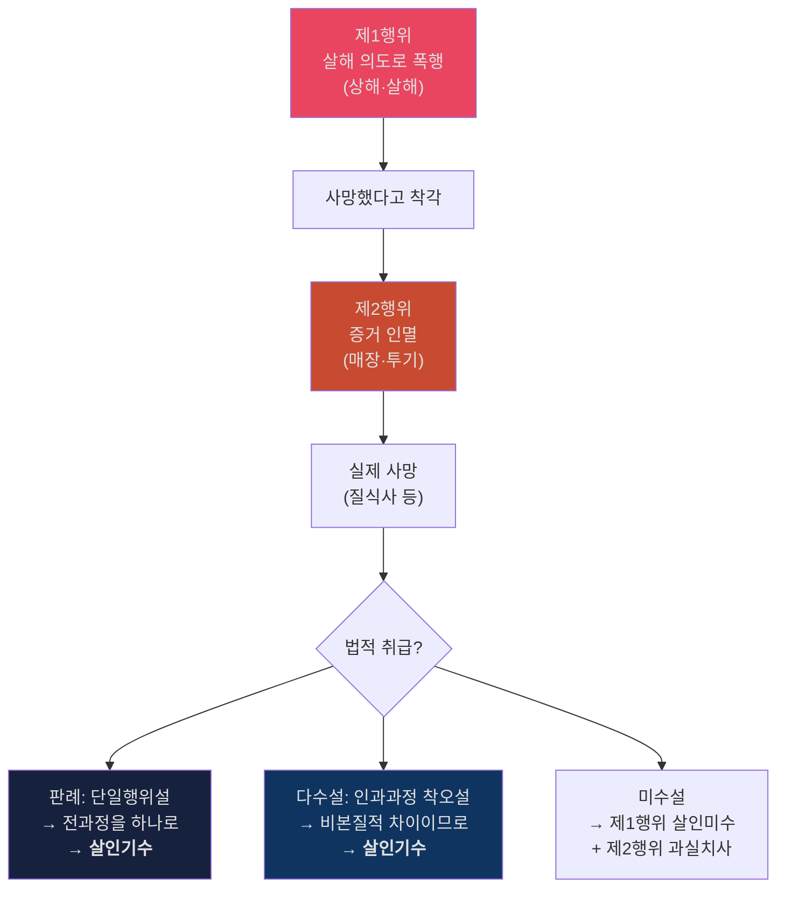

#### 📊 [기출 심화] 방법의 착오와 개괄적 고의 연결 플로우차트 (25년 기출 2문)
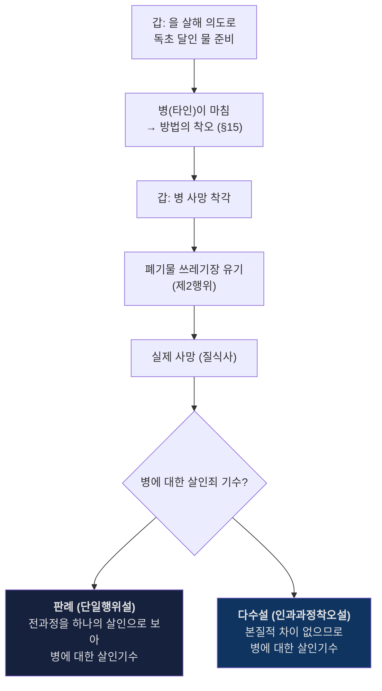

#### 📊 개괄적 고의 학설 비교표
| 학설 | 핵심 주장 | 결론 | 지위 |
|---|---|---|---|
| **단일행위설** | 제1+제2행위를 개괄적으로 하나의 행위로 봄 | 살인기수 | **판례** |
| **인과과정 착오설** | 인과과정의 차이가 비본질적이면 고의 유지 | 살인기수 | **다수설** |
| **미수설** | 제1행위와 제2행위를 분리 | 살인미수 + 과실치사 | 소수 |
| **객관적 귀속설** | 제2행위 결과도 제1행위의 위험 실현 | 살인기수 | 소수 |

#### 📊 개괄적 과실 — 판례 vs 학설
| | 판례 (94도2361) | 학설 |
|---|---|---|
| **결론** | 포괄하여 단일의 상해치사죄 | 상해죄 + 과실치사죄 (경합범) |
| **이유** | 전체를 하나로 봄 | 중한 결과가 기본범죄의 전형적 위험이 아니라 추가적 과실 |

- `암기 문장`: `개괄적 고의는 판례 단일행위 / 다수설은 인과과정 착오 / 개괄적 과실은 학설 부정`

### 4-6 구성요건적 착오 — ★★★

#### 홍형철식 쟁점 프레임
- `쟁점의 정리`: 구성요건적 착오는 먼저 `§13·§15`로 해결되는지 보고, 그 조문으로 해결되지 않는 한계사례에서만 학설과 판례를 본다. 아래 단원은 `분류 → 조문 적용 → 학설 비교 → 모답형` 순으로 읽는다.
  - 근거 발췌: "§13, §15로 먼저 해결"; "한계사례"; "방법의 착오가 핵심 쟁점"
  - 근거 위치: [《형법의_기초이론_1_서보학_중간_분리정리.md》 L100-L106 | "§13, §15로 먼저 해결" / "한계사례"] [《형법의_기초이론_1_서보학_중간_분리정리.md》 L95-L99 | "방법의 착오가 핵심 쟁점"]

#### 📊 착오 분류 체계도
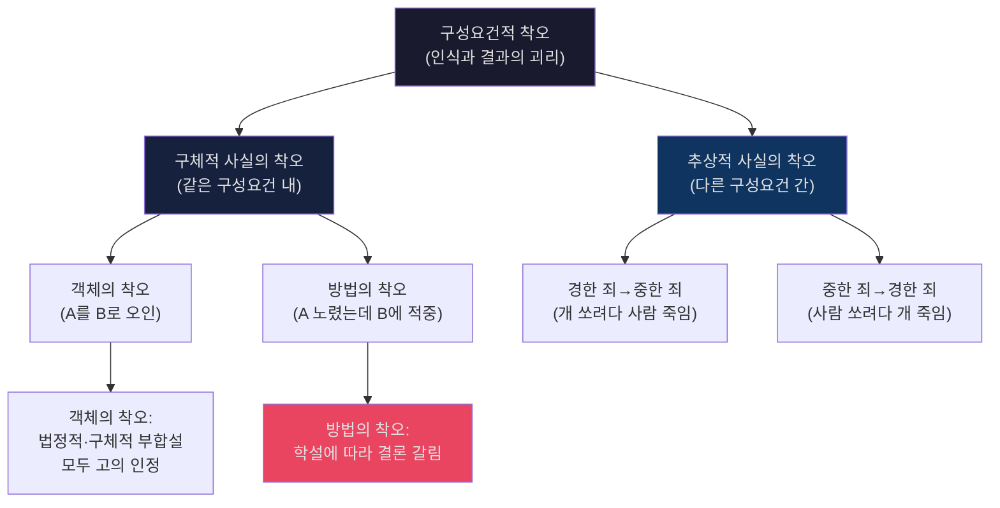

#### 📊 구체적 사실의 착오 — 학설별 결론 비교
| 사례 | 구체적 부합설 | 법정적 부합설 (판례) |
|---|---|---|
| **객체의 착오**: A를 B로 오인하여 B 살해 | 살인기수 (고의 인정) | 살인기수 (고의 인정) |
| **방법의 착오**: A 노렸는데 빗나가 B 사망 | A 살인미수 + B 과실치사 (경합) | **B에 대한 살인기수** (고의 전용) |

> **시험 전략**: 객체의 착오는 학설 간 결론 같으므로 간략히 → **방법의 착오가 핵심 쟁점**

#### 📊 §13·§15 적용 흐름
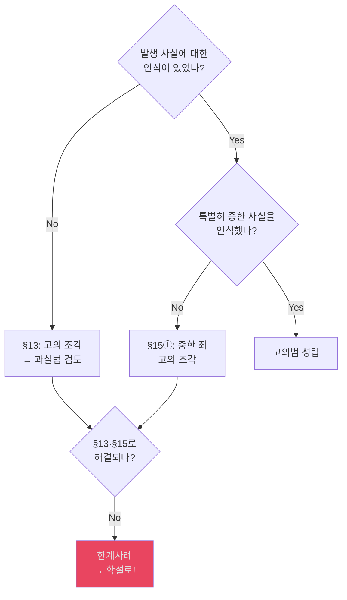

- `원칙`: §13, §15로 먼저 해결 → 안 되는 `한계사례`에서만 학설.
- `답안 전략`: 판례=법정적 부합설부터 쓴 뒤 사안 포섭. 추상적 부합설은 "몰라도 됨".
- `암기 문장`: `13조·15조 먼저 / 한계사례는 판례 법정적 부합설 / 답안엔 판례부터`

#### ✍️ 구성요건적 착오 모답형
구성요건적 착오는 먼저 ① 제13조와 제15조로 해결되는지를 보고, ② 그 조문으로 해결되지 않는 한계사례에서만 학설을 검토한다. 객체의 착오는 학설 간 결론이 같아 고의를 인정하는 방향으로 간략히 처리하고, 방법의 착오는 판례인 법정적 부합설에 따라 피격자에 대한 고의를 인정하는 구조로 쓴다. 따라서 답안에서는 `13·15조 먼저, 한계사례는 판례 법정적 부합설`의 순서를 고정해 두는 것이 좋다.
- 근거 발췌: "[[객체의 착오]]"; "[[방법의 착오]]"; "법정적 부합설"; "13조·15조 먼저"
- 근거 위치: [《형법의_기초이론_1_서보학_중간_분리정리.md》 L70-L88 | "[[객체의 착오]]"] [《형법의_기초이론_1_서보학_중간_분리정리.md》 L70-L88 | "[[방법의 착오]]"] [《형법의_기초이론_1_서보학_중간_분리정리.md》 L70-L88 | "법정적 부합설"] [《형법의_기초이론_1_서보학_중간_분리정리.md》 L89 | "13조·15조 먼저"]

### 4-7 정당방위 — ★★★

#### 홍형철식 쟁점 프레임
- `조문·요건`: 정당방위는 `① 현재의 부당한 침해 ② 방위행위 ③ 상당한 이유`를 먼저 적고, 그 다음 현재성·상당성에 관한 판례문구와 검토를 붙이는 조문형 쟁점이다.
  - 근거 발췌: "현재의 부당한 침해 + 방위하기 위한 행위 + 상당한 이유"; "정당방위는 정당방위상황 ... 방위행위"; "공격이 직접 임박한 것"
  - 근거 위치: [《형법1_중간고사_암기장.md》 L31 | "현재의 부당한 침해 + 방위하기 위한 행위 + 상당한 이유"] [《형법의_기초이론_1_서보학_중간_분리정리.md》 L110 | "정당방위는 정당방위상황 ... 방위행위"] [《형법의_기초이론_1_서보학_중간_분리정리.md》 L112-L113 | "공격이 직접 임박한 것"]

#### 📊 정당방위 요건 체계도
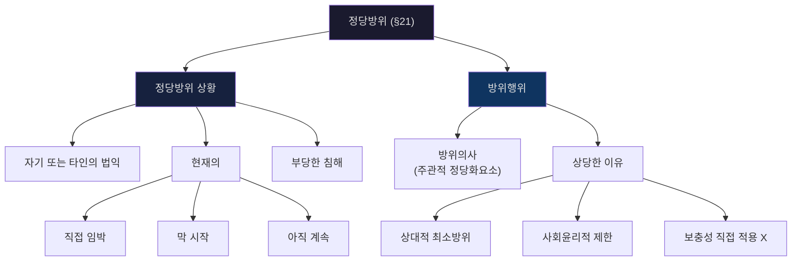

- `요건 정리`: ① 자기 또는 타인의 법익에 대한 현재의 부당한 침해가 있을 것, ② 이를 방위하기 위한 행위일 것, ③ 상당한 이유가 있을 것을 순서대로 적는다.
  - 근거 발췌: "현재의 부당한 침해 + 방위하기 위한 행위 + 상당한 이유"; "정당방위는 정당방위상황 ... 방위행위로 구성"
  - 근거 위치: [《형법1_중간고사_암기장.md》 L31 | "현재의 부당한 침해 + 방위하기 위한 행위 + 상당한 이유"] [《형법의_기초이론_1_서보학_중간_분리정리.md》 L110 | "정당방위는 정당방위상황 ... 방위행위로 구성"]
- `현재성 판례문구`: "공격이 직접 임박한 것, 방금 막 시작된 것 또는 아직도 계속되는 것"; "침해상황이 종료되기 전까지를 의미"
  - 근거 위치: [《형법의_기초이론_1_서보학_중간_분리정리.md》 L112-113 | "공격이 직접 임박한 것, 방금 막 시작된 것 또는 아직도 계속되는 것" / "침해상황이 종료되기 전까지를 의미"]
- `상당성·타인법익 판례문구`: "보충성원칙 적용 X"; "사회통념상 용인될 수 없다"; "타인의 법익에 대한 현재의 부당한 침해를 방위하기 위한 행위의 경우에도 ... [[정당방위]]"
  - 근거 위치: [《형법의_기초이론_1_서보학_중간_분리정리.md》 L116-119 | "보충성원칙 적용 X" / "사회통념상 용인될 수 없다" / "타인의 법익에 대한 현재의 부당한 침해를 방위하기 위한 행위의 경우에도 ... [[정당방위]]"]
- `교수님 저서 보강`: 서보학 교과서는 정당방위를 `현재의 위법(부당)한 침해를 방위하기 위한 상당한 이유 있는 행위`로 정의하고, 구조도 `정당방위상황 + 방위행위`로 잡는다.
  - 근거 발췌: "자기 또는 타인의 법익에 대한 현재의 위법(부당)한 침해를 방위하기 위한 상당한 이유 있는 행위"; "정당방위는 정당방위상황 ... 방위행위"
  - 근거 위치: [《서보학_형법총론_18.pdf》 p.196 | "자기 또는 타인의 법익에 대한 현재의 위법(부당)한 침해를 방위하기 위한 상당한 이유 있는 행위"] [《서보학_형법총론_18.pdf》 p.196 | "정당방위는 정당방위상황 ... 방위행위"]
- `교수님 저서 보강`: 정당방위의 근거는 `개인원칙 + 사회원칙`의 병존으로 설명되고, 그래서 `재산적 가치` 보호나 `제3자를 위한 방위`도 원칙적으로 배제되지 않는다는 점까지 연결된다.
  - 근거 발췌: "정당방위를 위법성조각사유가 되게 하는 자연법적 근거에는 개인원칙과 사회원칙"; "정당방위는 결국 위법은 물론 적법한 것으로 인식된다"; "재산적 가치를 보호하기 위해 살해할 수도 있다"
  - 근거 위치: [《서보학_형법총론_18.pdf》 p.196 | "개인원칙과 사회원칙"] [《서보학_형법총론_18.pdf》 p.197 | "정당방위는 결국 위법은 물론 적법한 것으로 인식된다"] [《서보학_형법총론_18.pdf》 p.197 | "재산적 가치를 보호하기 위해 살해할 수도 있다"]
- `원칙·예외`: ① 원칙적으로 정당방위는 현재의 부당한 침해에 대한 상당한 방위행위이면 되고 보충성은 직접 요구되지 않으며 타인 법익을 위한 방위도 가능하다. ② 예외적으로 사회통념상 용인될 수 없는 극단적 공격은 상당성을 잃어 정당방위가 부정된다. ③ 이 경우에는 다시 [[긴급피난]] 구조로 내려가 보충성과 법익균형을 따져본다.

#### 📊 정당방위 핵심 판례 매핑
| 판례 | 쟁점 | 결론 |
|---|---|---|
| **2020도6874** | 현재성 — 형식적 기수 시점 vs 침해상황 종료 | 침해상황 종료 전까지 현재성 인정 |
| **2016도2794** | 제압 후 추가폭행 | 공격의사 지배적 → 정당방위 부정 |
| **92도2540** (김보은) | 계속적 성폭행 + 수면 중 살해 | 정당방위·과잉방위 부정 |
| **68도370** | 싸움 중 흉기 사용 | 예상 초과 공격 → 정당방위 허용 |
| **89도358** | 강제추행범 혀 절단 | 정당방위 인정 |
| **84도683, 2001도1089** | 법익 극단적 불균형 | 사회윤리적 제한 → 부정 |
| **2013도2168** | 타인 법익 구조 | 긴급구조(타인 위한 정당방위) 인정 |

- `근거 위치`: 각 행의 직접 근거는 [《형법의_기초이론_1_서보학_중간_판례_정리_김혜선.docx》 문단 114 | "[[2020도6874]]"] [《형법의_기초이론_1_서보학_중간_판례_정리_김혜선.docx》 문단 118 | "[[2016도2794]]"] [《형법의_기초이론_1_서보학_중간_판례_정리_김혜선.docx》 문단 125 | "[[92도2540]]"] [《형법의_기초이론_1_서보학_중간_판례_정리_김혜선.docx》 문단 129 | "[[68도370]]"] [《형법의_기초이론_1_서보학_중간_판례_정리_김혜선.docx》 문단 132 | "[[89도358]]"] [《형법의_기초이론_1_서보학_중간_판례_정리_김혜선.docx》 문단 135 | "[[84도683]]"] [《형법의_기초이론_1_서보학_중간_판례_정리_김혜선.docx》 문단 137 | "[[2001도1089]]"] [《형법의_기초이론_1_서보학_중간_판례_정리_김혜선.docx》 문단 139 | "[[2013도2168]]"]
- `암기 문장`: `정당방위는 부정 대 정 / 현재성 먼저 / 보충성 직접 X / 상당성과 사회윤리적 제한에서 한 번 더 걸러라`

#### 📊 긴급구조
| 항목 | 정리 |
|---|---|
| **의의** | 자기 법익뿐 아니라 타인 법익을 위한 정당방위 |
| **답안 포인트** | 방위주체가 피해자 본인일 필요는 없다는 점을 먼저 적는다 |

- `[강의록 정리]` 긴급구조는 자기 법익뿐 아니라 타인의 법익을 위한 정당방위도 가능하다는 의미로 정리한다.
  - 근거 발췌: "자기 법익뿐 아니라 타인의 법익을 위한 정당방위도 가능하다"
  - 근거 위치: [《형법의_기초이론_1_서보학_중간_분리정리.md》 L119 | "자기 법익뿐 아니라 타인의 법익을 위한 정당방위도 가능하다"]

### 4-8 긴급피난 — ★★★

#### 홍형철식 쟁점 프레임
- `조문·요건`: 긴급피난은 `① 현재의 위난 ② 피난행위 ③ 보충성·균형성`을 먼저 적고, 계속적 위험·싸움·자초위난처럼 예외형 사례를 뒤에서 붙이는 구조가 안전하다.
  - 근거 발췌: "현재의 위난"; "최후의 수단"; "과실에 의한 자초위난은 정당화적으로 인정"; "고의 자초위난은 인정X"
  - 근거 위치: [《형법의_기초이론_1_서보학_중간_분리정리.md》 L124-L129 | "현재의 위난" / "최후의 수단"] [《형법의_기초이론_1_서보학_중간_강의록_김혜선.docx》 문단 552-553 | "과실에 의한 자초위난은 정당화적으로 인정" / "고의 자초위난은 인정X"]

#### 📊 긴급피난 요건 체계도
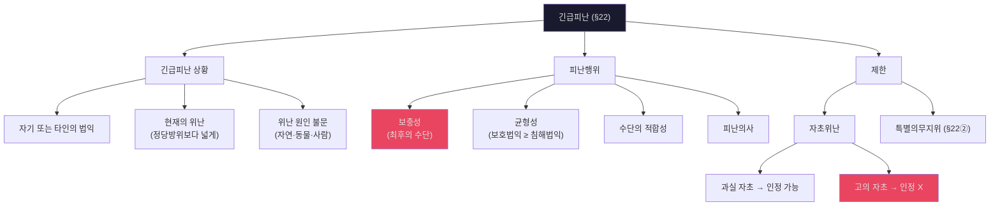

- `요건 정리`: ① 보호될 법익과 침해될 법익이 서로 대립할 것, ② 보호될 법익이 현재의 위난에 놓여 있을 것, ③ 피난행위가 보충성·균형성·수단적합성을 갖출 것을 순서대로 적는다.
  - 근거 발췌: "긴급피난의 기본구조"; "① 보호될 법익과 침해된 법익이 서로 대립"; "④ 이익교량의 결과 보호된 법익이 우월"
  - 근거 위치: [《형법의_기초이론_1_서보학_중간_분리정리.md》 L126 | "긴급피난의 기본구조" / "① 보호될 법익과 침해된 법익이 서로 대립" / "④ 이익교량의 결과 보호된 법익이 우월"]
- `주요 문구`: "현재의 위난이 위법부당한 위난일 것을 요구하지 않음"; "현재의 위난: 좀 넓게 해석"; "최후의 수단으로서 피난행위가 허용된다"
  - 근거 위치: [《형법의_기초이론_1_서보학_중간_분리정리.md》 L124-129 | "현재의 위난이 위법부당한 위난일 것을 요구하지 않음" / "현재의 위난: 좀 넓게 해석" / "최후의 수단으로서 피난행위가 허용된다"]
- `자초위난 문구`: "과실에 의한 자초위난은 원칙적으로 인정"; "고의 자초위난은 인정X"
  - 근거 위치: [《형법의_기초이론_1_서보학_중간_분리정리.md》 L132-133 | "과실에 의한 자초위난은 원칙적으로 인정" / "고의 자초위난은 인정X"]
- `교수님 저서 보강`: 서보학 교과서는 긴급피난을 `현재의 위난을 피하기 위한 상당한 이유 있는 행위`로 잡고, 정당방위와 달리 `위난의 원인이 정·부정`을 묻지 않는 점에서 구별한다.
  - 근거 발췌: "자기 또는 타인의 법익에 대한 현재의 위난을 피하기 위한 상당한 이유 있는 행위"; "위난의 원인이 정·부정임을 불문하기 때문에"
  - 근거 위치: [《서보학_형법총론_18.pdf》 p.208 | "자기 또는 타인의 법익에 대한 현재의 위난을 피하기 위한 상당한 이유 있는 행위"] [《서보학_형법총론_18.pdf》 p.208 | "위난의 원인이 정·부정임을 불문하기 때문에"]
- `교수님 저서 보강`: 기본구조도 `긴급피난상황(현재의 위난) + 피난행위`로 정리하고, 구체 판단은 `대립하는 두 법익`, `현재성`, `최후수단성`, `이익교량` 4가지 점검으로 압축한다.
  - 근거 발췌: "긴급피난은 긴급피난상황 ... 피난행위"; "① 보호될 법익과 침해된 법익이 서로 대립"; "② 보호될 법익이 현재의 위난에 놓여"; "③ 피난행위는 다른 타인의 법익"; "④ 이익교량의 결과 보호된 법익이 우월"
  - 근거 위치: [《서보학_형법총론_18.pdf》 p.211 | "긴급피난은 긴급피난상황 ... 피난행위"] [《서보학_형법총론_18.pdf》 p.211 | "① 보호될 법익과 침해된 법익이 서로 대립"] [《서보학_형법총론_18.pdf》 p.211 | "② 보호될 법익이 현재의 위난에 놓여"] [《서보학_형법총론_18.pdf》 p.211 | "④ 이익교량의 결과 보호된 법익이 우월"]
- `원칙·예외`: ① 원칙적으로 긴급피난은 최후의 수단이어야 하므로 보충성과 이익교량이 필수다. ② 예외적으로 과실에 의한 자초위난은 구체적 사정에 따라 허용될 수 있다. ③ 그러나 고의 자초위난은 다시 긴급피난으로 구조될 수 없다.

#### 📊 홍형철 보강: 계속적 위험·싸움·자초위난
| 쟁점 | 문장형 정리 | 원칙·예외 |
|---|---|---|
| **계속적 위험** | 이미 장기간 가해가 누적된 상황이라도 정당방위의 현재성은 엄격하게 보고, 안 되면 긴급피난으로 넘어간다. | 다만 김보은형 사안도 방어적 긴급피난의 현재성은 문제될 수 있으나, 법익균형과 보충성이 별도로 막을 수 있다. |
| **싸움** | 단순히 쌍방이 다투었다고 언제나 정당방위가 배제되는 것은 아니다. | ① 예상 밖의 과도한 공격, ② 애초에 싸울 의사 없이 방어만 한 경우, ③ 종료 후 새로 개시된 공격은 예외적으로 정당방위가 가능하다. |
| **자초위난** | 고의·의도적으로 위난상황을 유발한 자는 긴급피난으로 구조받기 어렵다. | 반면 과실 또는 책임 있는 도발 수준이면 여전히 비례성과 상당성 아래 긴급피난이 허용될 수 있다. |

- `홍형철 정리`: ① 계속적 가정폭력 같은 사안은 [[정당방위]] 현재성이 엄격하므로 긴급피난까지 병렬 검토해야 하고, ② 싸움은 일률 부정이 아니라 예외사유를 따져야 하며, ③ 자초위난도 고의인지 과실인지로 나누어야 한다.
  - 근거 발췌: "계속적 위험"; "정당방위의 현재성"; "방어적 [[긴급피난]]"; "싸움과 [[정당방위]]"; "과도한 공격"; "고의 자초위난"; "과실 자초위난"
  - 근거 위치: [《홍형철_쟁점정리_형법_25.pdf》 p.61-63 | "계속적 위험"] [《홍형철_쟁점정리_형법_25.pdf》 p.61-63 | "방어적 [[긴급피난]]"] [《홍형철_쟁점정리_형법_25.pdf》 p.64 | "싸움과 [[정당방위]]"] [《홍형철_쟁점정리_형법_25.pdf》 p.64 | "과도한 공격"] [《홍형철_쟁점정리_형법_25.pdf》 p.65 | "고의 자초위난"] [《홍형철_쟁점정리_형법_25.pdf》 p.65 | "과실 자초위난"]
- `판례문구`: "싸움 중이라고 하여 당연히 정당방위가 부정되는 것은 아니고", "예상 외의 공격이 있거나 싸움이 끝난 뒤 새로 공격이 개시된 경우"는 별도 평가가 가능하다는 축으로 정리한다.
  - 근거 위치: [《홍형철_쟁점정리_형법_25.pdf》 p.64 | "[[68도370]]"] [《홍형철_쟁점정리_형법_25.pdf》 p.64 | "[[89도623]]"] [《홍형철_쟁점정리_형법_25.pdf》 p.64 | "[[4290형상18]]"]

#### 📊 2025 중간 사례형 포섭 체크
| 사례 | 검토 순서 | 바로 쓰는 결론 |
|---|---|---|
| **[사례] 독물 투입 후 제3자 사망** | `[판례기준] 상당인과관계 → 보충적으로 객관적 귀속 → 구성요건적 착오 한계사례` | `을에 대한 살인미수 + 제3자에 대한 과실치사` |
| **[사례] 제1행위 후 사망 오인·매장** | `[판례/다수설 비교] 개괄적 고의 → 판례 단일행위설 / 다수설 인과과정착오설` | 전과정을 하나의 살인으로 보아 `살인기수`까지 연결 |
| **[사례] 계속적 침해 반격사안** | `[판례기준] 정당방위 현재성·상당성 → 정당방위가 막히면 긴급피난 보충성·균형성` | 위법성조각사유를 병렬이 아니라 `순차`로 적는다 |

- `답안자료 포인트`: 2025 중간 답안은 첫 문제에서 `인과관계`와 `구성요건적 착오의 한계사례`, 둘째 문제에서 `소위 [[개괄적 고의]] 사례`, 셋째 문제에서 `계속적 침해에 대한 [[정당방위]]`와 `[[긴급피난]]`을 직접 논점명으로 잡는다.
  - 근거 발췌: "인과관계가 문제"; "구성요건적 착오의 한계사례"; "소위 [[개괄적 고의]] 사례"; "계속적 침해에 대한 [[정당방위]]"; "긴급피난은 성립할 수 있는지"
  - 근거 위치: [《형법의_기초이론_1_서보학_2025_중간2등답안_25.pdf》 p.1-3 | "인과관계가 문제"; "구성요건적 착오의 한계사례"; "소위 [[개괄적 고의]] 사례"; "계속적 침해에 대한 [[정당방위]]"; "긴급피난은 성립할 수 있는지"]

#### 📊 정당방위 vs 긴급피난 vs 자구행위 종합 비교표 — ★★★
| 비교축 | 정당방위 (§21) | 긴급피난 (§22) | 자구행위 (§23) |
|---|---|---|---|
| **관계** | 부정 vs 정 (不正 對 正) | 정 vs 정 (正 對 正) | 부정 vs 정 |
| **대상** | 현재의 **부당한** 침해 | 현재의 **위난** (원인 불문) | **청구권 보전** 곤란 |
| **현재성** | 직접 임박~계속 중 | 좀 더 **넓게** 해석 | 시간적 여유 있음 |
| **보충성** | 직접 적용 **X** | **필수** (최후의 수단) | 법정 절차 불능 |
| **균형성** | 극단적 불균형만 제한 | 보호법익 **우월** 필요 | 상당성 |
| **자초** | 도발에 의한 침해도 가능 | 과실 ○ / 고의 **X** | — |
| **법적 효과** | 위법성 조각 | 위법성 조각 (또는 책임조각) | 위법성 조각 |
| **과잉 시** | §21② 과잉방위 | §22③ 과잉피난 | §23② 과잉자구 |

- `[판례]` 정당방위의 현재성은 공격이 직접 임박했거나 막 시작되었거나 아직 계속되는 때, 곧 침해상황이 종료되기 전까지 인정된다.
  - 근거 발췌: "공격이 직접 임박한 것, 방금 막 시작된 것 또는 아직도 계속되는 것"; "침해상황이 종료되기 전까지를 의미"
  - 근거 위치: [《형법의_기초이론_1_서보학_중간_강의록_김혜선.docx》 문단 478-481 | "공격이 직접 임박한 것, 방금 막 시작된 것 또는 아직도 계속되는 것"] [《형법의_기초이론_1_서보학_중간_판례_정리_김혜선.docx》 문단 114-117 | "침해상황이 종료되기 전까지를 의미"]
- `[기준]` 긴급피난은 과실에 의한 자초위난은 원칙적으로 가능하지만, 고의 자초위난은 인정되지 않는다.
  - 근거 발췌: "과실에 의한 자초위난은 원칙적으로 인정"; "고의 자초위난은 인정X"
  - 근거 위치: [《형법의_기초이론_1_서보학_중간_강의록_김혜선.docx》 문단 552-553 | "과실에 의한 자초위난은 원칙적으로 인정" / "고의 자초위난은 인정X"]
- `[판례]` 자구행위는 택시비·음식값 같은 청구권 보전을 위해 상대를 붙잡아 경찰에 인도한 사안에서 인정된다.
  - 근거 발췌: "택시비에 대한 청구권"; "자구행위가 인정된다"; "음식값에 대한 청구권"; "자구행위로 위법성이 조각된다"
  - 근거 위치: [《형법의_기초이론_1_서보학_중간_모의답안_2017_김혜선.pdf》 p.3 | "택시비에 대한 청구권" / "자구행위가 인정된다"] [《형법의_기초이론_1_서보학_중간_모의답안_2023_김혜선.pdf》 p.5-6 | "음식값에 대한 청구권" / "자구행위로 위법성이 조각된다"]

#### ✍️ 정당방위·긴급피난 모답형
정당방위는 현재의 부당한 침해에 대하여 자기 또는 타인의 법익을 방위하기 위한 상당한 행위로서 위법성이 조각된다. 반면 긴급피난은 현재의 위난을 피하기 위한 행위로서 정당방위보다 보충성과 법익균형이 더 엄격하게 요구된다. 따라서 상대방의 반격 가능성이 문제 되는 경우 정당방위에 대한 정당방위는 부정되고, [[긴급피난]] 구조로 넘어가 검토하는 것이 기본이다.
- 근거 발췌: "정당방위에 대한 정당방위는 인정되지 않으므로"; "현재의 위난"; "최후의 수단"
- 근거 위치: [《형법의_기초이론_1_서보학_중간_분리정리.md》 L41 | "정당방위에 대한 정당방위는 인정되지 않으므로"] [《형법의_기초이론_1_서보학_중간_분리정리.md》 L124-L129 | "현재의 위난"] [《형법의_기초이론_1_서보학_중간_분리정리.md》 L124-L129 | "최후의 수단"]

#### 📊 위법성조각사유 상호 연결 다이어그램
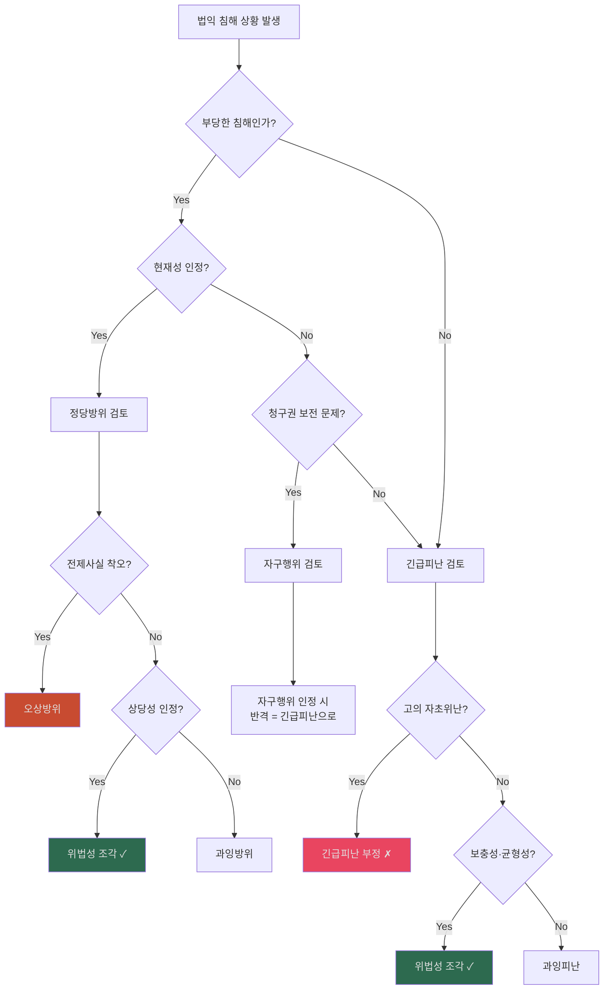

- `법적 성질`: 이분설이 타당 — 우월적 이익이면 [[위법성조각]], 동가치 법익이면 책임조각.
- `김보은`: [[정당방위]] 현재성 어렵더라도 **방어적 [[긴급피난]]** 현재성은 가능.
- `암기 문장`: `긴급피난은 정 대 정 / 보충성·균형성 필수 / 정당방위보다 훨씬 엄격 / 김보은은 방어적 [[긴급피난]] 포인트`

### 4-9 오상방위와 우연방위

#### 홍형철식 쟁점 프레임
- `쟁점의 정리`: 오상방위는 객관적 방위상황이 없는데 있다고 오인한 경우의 처리 문제이고, 우연방위는 객관적 방위상황은 있으나 방위의사가 없는 경우의 처리 문제다. 아래 단원은 `학설 스펙트럼 → 교수님 답안축 → 모답형` 순으로 읽는다.
  - 근거 발췌: "법효과제한적 책임설"; "방위의사 없이 객관적으로 [[정당방위]] 상황에 개입한 경우"
  - 근거 위치: [《홍형철_쟁점정리_형법_25.pdf》 p.74-75 | "법효과제한적 책임설"] [《형법1_중간고사_암기장.md》 L34-L35 | "방위의사 없이 객관적으로 [[정당방위]] 상황에 개입한 경우"]

#### 📊 오상방위 학설 비교표 (위법성조각상황의 객관적 전제사실 착오)
| 학설 | 핵심 | 고의 | 결론 | 비고 |
|---|---|---|---|---|
| **엄격고의설** | 위법성 인식을 고의의 요소로 봄 | 고의 **조각** | 고의범 부정 | 소수 |
| **제한고의설 / 소극적 구성요건표지이론** | 위법성조각사유를 소극적 구성요건표지로 파악 | 고의 **조각** | 고의범 부정 | 암기장 학설축 |
| **구성요건착오 유추적용설** | §13을 유추적용 | 고의 **조각** | 과실범만 검토 | 다수설 축 |
| **법효과제한적책임설** | 고의설의 법적 효과만 제한 | 고의 **부정** (→ 과실범) | 과실범으로 처벌 | **교수님 답안** |
| **엄격책임설** | 위법성 인식 착오 = 금지착오 | 고의 **유지** | §16 적용 (감면) | 소수 |

#### 📊 우연방위 학설 비교표 (주관적 정당화요소 흠결)
| 학설 | 핵심 논거 | 결론 |
|---|---|---|
| **기수범설 (주관설)** | 방위의사가 없으므로 행위반가치가 전혀 상쇄되지 않음 | **기수범** 성립 |
| **무죄설 (객관설)** | 객관적으로 정당화상황이 존재하므로 결과반가치가 상쇄됨 | **무죄** 성립 |
| **불능미수범설 (다수설)** | 행위반가치는 존재하나 결과반가치는 상쇄됨 (위험성만 존재) | **불능미수** 유추적용 |

- `사례분석`: 방위의사(주관) 없이 원수 A를 쐈는데 마침 A가 나를 쏘려던 참(객관)이었던 경우 → **[[우연방위]]**
- `[학설 보강]` 암기장 기준 [[오상방위]] 학설 스펙트럼은 `고의설 → 소극적 구성요건표지이론 → 엄격책임설 → 유추적용설 → 법효과제한적책임설`까지 잡힌다. 그래서 표는 넓게 외우되, 시험장 답안은 `유추적용설`과 `법효과제한적책임설` 중심으로 정리하면 된다.
  - 근거 발췌: "고의설 / 소극적 구성요건표지이론(고의조각) / 엄격책임설"; "유추적용설(과실범 처벌) / 법효과제한적 책임설"; "엄격고의설"; "제한고의설"
  - 근거 위치: [《형법1_중간고사_암기장.md》 L38-L40 | "고의설 / 소극적 구성요건표지이론(고의조각) / 엄격책임설"] [《형법1_중간고사_암기장.md》 L39-L40 | "유추적용설(과실범 처벌) / 법효과제한적 책임설"] [《형법의_기초이론_1_서보학_기말_분리정리.md》 L62-L64 | "엄격고의설"] [《형법의_기초이론_1_서보학_기말_분리정리.md》 L63-L64 | "제한고의설"]
- `교수님 답안`: 오상방위는 2017, 2023 모두 **법효과제한적책임설** 채택.
- 근거 발췌: "법효과제한적책임설이 타당하다"; "공무집행방해의 고의가 인정되지 않으므로"; "과실치상죄의 죄책"
- 근거 위치: [《형1_서보학_중간_모의답안_2023_김혜선.pdf》 p.4 | "법효과제한적책임설이 타당하다"] [《형1_서보학_중간_모의답안_2023_김혜선.pdf》 p.4 | "공무집행방해의 고의가 인정되지 않으므로"] [《형1_서보학_중간_모의답안_2017_김혜선.pdf》 p.2 | "과실치상죄의 죄책"]
- `암기 문장`: `실제 침해는 없는데 방위상황으로 잘못 봤으면 [[오상방위]] / 방위상황은 있는데 방의의사 없으면 [[우연방위]](불능미수 다수설)`

#### 📊 홍형철 보강: 위법성조각사유 전제사실 착오의 공범 처리
| 논점 | 문장형 정리 |
|---|---|
| **기본 입장** | 홍형철 정리는 위전착의 결론을 `법효과제한적 책임설`로 정리한다. |
| **악의의 가담자** | 정범이 오상방위에 빠졌는데 가담자는 객관적 상황을 알면서 이용한 경우, 간접정범과 교사범 개념이 모두 가능해 보일 수 있다. |
| **최종 정리** | 그러나 정범개념 우위에 따라 시험장에서는 `간접정범으로 일원화`하는 정리가 안정적이다. |

- `홍형철 정리`: ① 위법성조각사유 전제사실 착오에서는 법효과제한적 책임설이 타당하고, ② 악의의 가담자는 간접정범과 교사범이 모두 논의될 수 있으나, ③ 정범개념 우위에 따라 간접정범으로 처리하는 것이 정리상 안전하다.
  - 근거 발췌: "법효과제한적 책임설"; "간접정범과 교사범 개념상 모두 가능"; "정범개념우위"; "간접정범"
  - 근거 위치: [《홍형철_쟁점정리_형법_25.pdf》 p.74-75 | "법효과제한적 책임설"] [《홍형철_쟁점정리_형법_25.pdf》 p.75 | "간접정범과 교사범 개념상 모두 가능"] [《홍형철_쟁점정리_형법_25.pdf》 p.75 | "정범개념우위"] [《홍형철_쟁점정리_형법_25.pdf》 p.75 | "간접정범"]

#### 📊 우연방위
| 항목 | 정리 |
|---|---|
| **의의** | 방위의사 없이 객관적으로 정당방위 상황에 개입한 경우 |
| **구별 포인트** | 오상방위는 객관적 방위상황이 없고, 우연방위는 객관적 방위상황은 존재 |

- `[암기장 정리]` 우연방위는 방위의사 없이 객관적으로 [[정당방위]] 상황에 개입한 경우로 잡는다.
  - 근거 발췌: "방위의사 없이 객관적으로 [[정당방위]] 상황에 개입한 경우"
  - 근거 위치: [《형법1_중간고사_암기장.md》 L34-L35 | "방위의사 없이 객관적으로 [[정당방위]] 상황에 개입한 경우"]

#### ✍️ 오상방위·우연방위 모답형
객관적 방위상황이 없음에도 이를 오인하고 방위행위를 한 경우에는 오상방위가 문제되고, 이 경우의 처리는 위법성조각사유의 전제사실 착오로 보아 학설대립이 생긴다. 교수님 답안축은 법효과제한적책임설을 중심으로 정리한다. 반대로 객관적으로는 [[정당방위]] 상황이 존재하지만 행위자에게 방위의사가 없는 경우는 우연방위로서 오상방위와 구별된다.
- 근거 발췌: "법효과제한적책임설이 타당하다"; "방위의사 없이 객관적으로 [[정당방위]] 상황에 개입한 경우"
- 근거 위치: [《형법의_기초이론_1_서보학_중간_분리정리.md》 L140 | "법효과제한적책임설이 타당하다"] [《형법1_중간고사_암기장.md》 L34-L35 | "방위의사 없이 객관적으로 [[정당방위]] 상황에 개입한 경우"]

### 4-10 자구행위 — ★★

#### 홍형철식 쟁점 프레임
- `조문·요건`: 자구행위는 `① 법정 절차로 보전 불가 ② 청구권 실행 곤란의 긴급상황 ③ 상당한 행위`를 먼저 적고, 이후 `보전 vs 실현` 구별과 판례문구를 붙여야 답안이 안정된다.
  - 근거 발췌: "청구권을 보전할 수 없는 경우"; "그 청구권의 실행이 불가능해지거나 현저히 곤란해지는 상황"; "청구권을 실현하기 위한 것이 아니라 보전하기 위한 행위"
  - 근거 위치: [《형법의_기초이론_1_서보학_중간_분리정리.md》 L146-L148 | "청구권을 보전할 수 없는 경우" / "그 청구권의 실행이 불가능해지거나 현저히 곤란해지는 상황"] [《형법의_기초이론_1_서보학_중간_분리정리.md》 L148 | "청구권을 실현하기 위한 것이 아니라 보전하기 위한 행위"]

#### 📊 자구행위 3단계 요건
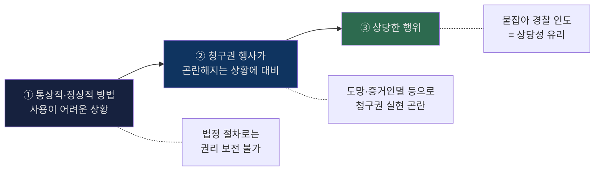

- `요건 정리`: ① 법률에서 정한 절차로는 청구권을 보전할 수 없을 것, ② 청구권의 실행이 불가능하거나 현저히 곤란해질 긴급상황일 것, ③ 이를 피하기 위한 상당한 행위일 것을 순서대로 적는다.
  - 근거 발췌: "청구권을 보전할 수 없는 경우"; "그 청구권의 실행이 불가능해지거나 현저히 곤란해지는 상황을 피하기 위하여"; "상당한 이유가 있는 때에는 벌하지 아니한다"
  - 근거 위치: [《형법의_기초이론_1_서보학_중간_분리정리.md》 L146-147 | "청구권을 보전할 수 없는 경우" / "그 청구권의 실행이 불가능해지거나 현저히 곤란해지는 상황을 피하기 위하여"] [《형법의_기초이론_1_서보학_중간_분리정리.md》 L146-147 | "상당한 이유가 있는 때에는 벌하지 아니한다"]
- `3단계 구조`: "1) 청구권을 보전하는 통상적인? 정상적인? 방법의 사용이 어려운 상황"; "2) 청구권의 행사가 곤란해지는 상황에 대비하여"; "3) 상당한 행위를 하였을 것이 요구된다"
  - 근거 위치: [《형법의_기초이론_1_서보학_중간_분리정리.md》 L147-148 | "1) 청구권을 보전하는 통상적인? 정상적인? 방법의 사용이 어려운 상황" / "2) 청구권의 행사가 곤란해지는 상황에 대비하여" / "3) 상당한 행위를 하였을 것이 요구된다"]
- `기출 판례문구`: "택시비에 대한 청구권"; "자구행위가 인정된다"; "음식값에 대한 청구권"; "자구행위로 위법성이 조각된다"
  - 근거 위치: [《형법의_기초이론_1_서보학_중간_분리정리.md》 L148-150 | "택시비에 대한 청구권" / "자구행위가 인정된다" / "음식값에 대한 청구권" / "자구행위로 위법성이 조각된다"]

#### 📊 보전 vs 실현 구분표
| | 보전 (자구행위 ○) | 실현 (자구행위 ✗) |
|---|---|---|
| **행위** | 붙잡아 경찰에 인도 | 직접 강제로 채권 추심 |
| **성격** | 권리 **확보·보전** | 권리 **강제 실현** |
| **판례** | 2017·2023 中 택시비·음식값 사례 | 84도2582 야간 침입 물건 반출 |

- `긴급피난과의 연결`: 자구행위로 정당화되면 → 반격은 `[[정당방위]]` 아니라 `[[긴급피난]]`. 고의 자초위난이면 긴급피난도 부정.
- `암기 문장`: `자구행위는 청구권 보전 / 실현이 아니라 보전 / 붙잡아 경찰 인도면 상당성 판단이 유리`
- `원칙·예외`: ① 원칙적으로 자구행위는 권리의 실현이 아니라 보전을 위한 예외적 긴급조치다. ② 예외적으로 통상의 법정 절차로도 충분한 경우에는 자구행위가 부정된다. ③ 적법한 자구행위가 인정되면 상대방 반격은 다시 [[긴급피난]] 구조에서 본다.

#### ✍️ 자구행위 모답형
자구행위는 청구권을 실현하기 위한 것이 아니라 보전하기 위한 예외적 행위이므로, 법정 절차로는 권리보전이 곤란한 긴급상황인지가 먼저 문제된다. 따라서 시간적 여유가 있거나 통상의 국가구제수단으로 충분한 경우에는 자구행위가 부정되고, 정당화된 경우 상대방의 반격은 다시 [[긴급피난]] 구조로 파악된다.
- 근거 발췌: "청구권을 실현하기 위한 것이 아니라 보전하기 위한 행위"; "청구권을 보전"
- 근거 위치: [《형법의_기초이론_1_서보학_중간_분리정리.md》 L148 | "청구권을 실현하기 위한 것이 아니라 보전하기 위한 행위"] [《형법의_기초이론_1_서보학_중간_분리정리.md》 L146-L148 | "청구권을 보전"]

### 4-11 책임능력과 원인에 있어서 자유로운 행위 (§10③)

#### 📊 원자행 실행의 착수시기 학설 대립
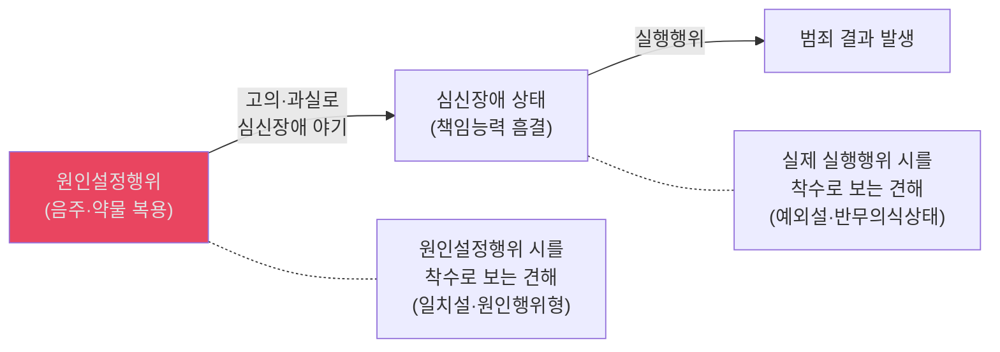
- 형법 제10조 제3항은 원자행에 대해 심신장애로 인한 책임조각·감경을 적용하지 아니하고 **완전한 책임**을 지운다.

### 4-12 결과적 가중범의 공동정범 [보류·중간범위 미확인]

#### 홍형철식 참고 틀
- `참고 메모`: 이 블록은 중간범위 직접 소스는 없지만, 홍형철 쟁점정리는 `쟁점의 정리 → 견해의 대립 → 판례의 태도 → 검토 → 성립요건` 순서로 정리한다. 따라서 별도 소스가 확보되면 그 순서로 독립 블록을 다시 세우는 것이 맞다.
  - 근거 발췌: "쟁점의 정리"; "견해의 대립"; "판례의 태도"; "검토"; "결과적 가중범 공동정범의 성립요건"
  - 근거 위치: [《홍형철_쟁점정리_형법_ocr_extract.md》 L1348-L1368 | "쟁점의 정리" / "견해의 대립" / "판례의 태도" / "검토" / "결과적 가중범 공동정범의 성립요건"]

- `정리 기준`: 현 단계에서는 중간 메인 암기대상에서 제외한다. 별도 강의자료나 판례근거가 확보되기 전까지 독립 쟁점처럼 답안에 세우지 않는 편이 안전하다.
- `현재 상태`: 현재 확보한 중간 강의록·판례정리·원교재 확인 범위에서는 이 쟁점을 직접 확인할 수 없습니다.
- `처리`: 소스에서 확인할 수 없습니다. 자료 부족—보류.
- `메모`: 별도 강의자료나 판례근거가 확보되기 전까지, 이 블록은 중간 범위 미확인 쟁점으로 남겨 두고 `판례가 적극 긍정`한다는 식의 단정은 넣지 않는 편이 안전합니다.
- `[홍형철 보강메모]` 다만 홍형철 쟁점정리는 ① 기본범죄에 공동가공의 의사가 있고 ② 중한 결과에 대한 예견가능성이 있으며 ③ 결과발생에 이르는 기본행위를 공동으로 했으면 결과적 가중범의 공동정범을 긍정하는 정리와 판례 축을 제시한다. 다만 이 노트에서는 `중간범위 직접 소스`가 아니라 `홍형철 보강자료`라는 점을 명시한 채 참고메모로만 둔다.
  - 근거 발췌: "기본범죄에 공동으로 가담"; "중한 결과의 발생을 예견할 수 있었고"; "행위를 공동으로 할 의사"; "결과적 가중범의 공동정범을 긍정"
  - 근거 위치: [《홍형철_쟁점정리_형법_25.pdf》 p.57-58 | "기본범죄에 공동으로 가담"] [《홍형철_쟁점정리_형법_25.pdf》 p.57-58 | "중한 결과의 발생을 예견할 수 있었고"] [《홍형철_쟁점정리_형법_25.pdf》 p.57-58 | "행위를 공동으로 할 의사"] [《홍형철_쟁점정리_형법_25.pdf》 p.57-58 | "결과적 가중범의 공동정범을 긍정"]

---

## 5. 시험 직전 판례 카드

### 📊 판례 총정리표
| # | 판례 | 영역 | 핵심 한 줄 |
|---|---|---|---|
| 1 | **2015헌바239** | 죄형법정주의 | 노역장유치도 형벌불소급 적용 |
| 2 | **2020도16420** | 죄형법정주의 | 유리한 법령변경 → 재판시법 / 한시법 기간만료 ≠ 변경 |
| 3 | **2008헌바157** | 명확성 | '공익'은 불명확 → 위반 |
| 4 | **2019도9044** | 유추금지 | 문언 한계 넘는 확장 금지 |
| 5 | **90도2856** | 인과관계 | 적법 대체행위에서도 결과 같으면 귀속 끊김 |
| 6 | **94도1949** | 미필적 고의 | 용인의사 있으면 미필적 고의 |
| 7 | **88도650** | 개괄적 고의 | 전과정 하나로 → 살인기수 (판례) |
| 8 | **94도2361** | 개괄적 과실 | 상해치사 단일범 (판례), 학설은 부정 |
| 9 | **4293형상494** | 착오 | 존속 모르면 보통살인 |
| 10 | **2020도6874** | 정당방위 현재성 | 침해상황 종료 전까지 |
| 11 | **2016도2794** | 정당방위 | 제압 후 추가폭행 → 공격의사 지배 |
| 12 | **92도2540** | 김보은 | 정당방위 부정 → 방어적 긴급피난 |
| 13 | **68도370** | 정당방위 | 싸움 중 흉기 → 예외 인정 |
| 14 | **89도358** | 정당방위 | 혀 절단 = 정당방위 |
| 15 | **2013도2168** | 긴급구조 | 타인 법익 위한 정당방위 인정 |

---

## 6. 접근순서
1. `13~17강` → `인과관계 → [[미필적 고의]] → [[개괄적 고의]] → 구성요건착오` 복구
2. `22~25강` → `[[정당방위]] → [[긴급피난]] → [[자구행위]]` (2017·2023 위법성 블록 연속 출제)
3. `10~12강, 18~21강` → `부작위·과실` 보완
4. 답안 연습: `객관적 구성요건 → 인과관계/귀속 → 고의/착오 → 위법성` 순 고정
5. [[정당방위]]·[[긴급피난]]·[[자구행위]] 비교표 반드시 암기

---

## 7. 보류
- `25강`은 `[[긴급피난]]`과 `[[자구행위]]`를 함께 포함하므로, 실제 중간범위가 25강 어디까지인지 확정 불가. 다만 2017·2023 원본에서 자구행위 실제 출제 확인 → 자구행위까지 보는 것이 안전.

## 8. [보강] 중간 핵심 개념 카드

### 📊 정당방위·긴급피난 경계 카드
| 쟁점 | 정당방위 | 긴급피난 |
|---|---|---|
| **상대방 구조** | 불법한 침해자 대 방위자 | 위험원과 피난자 구조 |
| **현재성** | 직접 임박 또는 계속 중인 침해 | 보다 넓은 의미의 현재 위험 |
| **보충성** | 원칙적으로 직접 요구되지 않음 | 최후수단성 요구 |
| **답안 포인트** | 침해의 부당성과 방위행위의 상당성 | 위험의 현재성과 법익균형, 보충성 |

- `[강의록 정리]` 정당방위에 대한 정당방위는 인정되지 않으므로, 상대방의 반격 가능성은 [[긴급피난]] 구조로 검토하는 것이 기본축이다.
  - 근거 발췌: "정당방위에 대한 정당방위는 인정되지 않으므로"
  - 근거 위치: [《형법의_기초이론_1_서보학_중간_분리정리.md》 L41 | "정당방위에 대한 정당방위는 인정되지 않으므로"]
- `[강의록 정리]` 긴급피난은 공격적 긴급피난과 방어적 긴급피난을 나눠 보고, 김보은 사건은 방어적 [[긴급피난]] 포섭 포인트로 잡는다.
  - 근거 발췌: "공격적 [[긴급피난]]"; "방어적 긴급피난"; "김보은"
  - 근거 위치: [《형법의_기초이론_1_서보학_중간_분리정리.md》 L114-L131 | "김보은"] [《형법의_기초이론_1_서보학_중간_분리정리.md》 L131 | "공격적 [[긴급피난]]"] [《형법의_기초이론_1_서보학_중간_분리정리.md》 L131 | "방어적 긴급피난"]

### 📊 위전착·오상방위 빠른 점검
| 항목 | 내용 |
|---|---|
| **문제상황** | 위법성조각상황의 객관적 전제사실을 잘못 인식 |
| **주요 대립** | 구성요건착오 유추적용설 vs 법효과제한적책임설 |
| **답안축** | 오상방위와 위전착을 같은 구조로 잡되, 고의와 과실 처리만 명확히 쓴다 |

- `[강의자료 정리]` 시험답안 축은 법효과제한적책임설을 중심으로 정리하는 것이 안전하다고 본다.
  - 근거 발췌: "법효과제한적책임설이 타당하다"
  - 근거 위치: [《형법의_기초이론_1_서보학_중간_분리정리.md》 L140 | "법효과제한적책임설이 타당하다"]

### 📊 자구행위 보강 카드
| 항목 | 내용 | 포섭 포인트 |
|---|---|---|
| **본질** | 청구권의 `실현`이 아니라 `보전` | 시간을 다투는 보전 상황인지 먼저 본다 |
| **허용근거** | 법정 절차로는 권리보전이 어려운 긴급상황 | 즉시 집행 불가가 전제 |
| **반격 구조** | 자구행위가 정당화되면 상대방 반격은 긴급피난으로 연결 | 정당방위와 기계적으로 섞지 않는다 |

- `[강의록 정리]` 자구행위는 청구권을 실현하기 위한 것이 아니라 보전하기 위한 행위라는 점을 먼저 적어야 한다.
  - 근거 발췌: "청구권을 실현하기 위한 것이 아니라 보전하기 위한 행위"
  - 근거 위치: [《형법의_기초이론_1_서보학_중간_분리정리.md》 L148 | "청구권을 실현하기 위한 것이 아니라 보전하기 위한 행위"]
