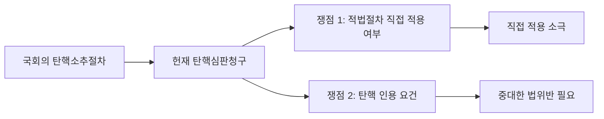
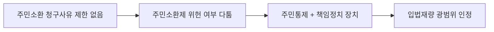
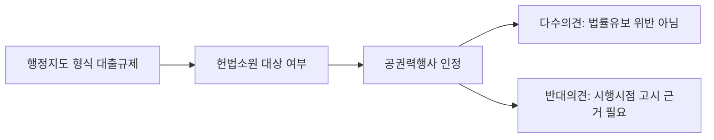
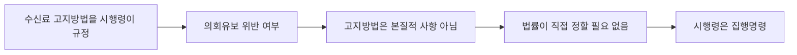

# 헌법의 기초이론 1 이진 통합노트

## 0. 소스 범위
- `강의 전체 구조`: `헌법의_기초이론_1_강의계획서.pdf`
- `주차별 결정례 숙제`: `2026_헌법의_기초이론_결정례_숙제.pdf`
- `OX 연결`: `강성민_헌법_최종정리_OX_총론_통치구조.pdf`, `강성민_헌법_최종정리_OX_재판_25.pdf`

## 1. 수업 성격과 중간 범위
- 이 수업은 처음부터 `헌법총론 및 통치구조`를 기본축으로 잡고, 개념 강의와 판례 검토를 병행하는 구조다. 그래서 중간 대비도 `주차별 개념`과 `결정례 숙제`를 따로 보지 말고 한 덩어리로 보는 편이 맞다.
  - 근거 발췌: "헌법의 기능, 원리, 제도, 정부형태와 통치구조에 관한 기본 강의입니다."; "기본 이론 강의와 판례 검토를 병행하는 방식으로 진행합니다."
  - 근거 위치: [《헌법의_기초이론_1_강의계획서.pdf》 p.1 | "헌법의 기능, 원리, 제도, 정부형태와 통치구조에 관한 기본 강의입니다."] [《헌법의_기초이론_1_강의계획서.pdf》 p.1 | "기본 이론 강의와 판례 검토를 병행하는 방식으로 진행합니다."]
- 중간 전 범위는 `헌법결정·헌법리서치·헌법개념/구조/특징/본질/헌법해석`에서 시작해서 `헌법의 제정·개정·헌법사·적용범위·보호`, `민주주의`, `법치주의`, `사회국가원리·국제평화주의`, `지방자치제도·공무원제도·경제질서`까지다.
  - 근거 발췌: "2/23 ~ 3/1 오리엔테이션, 헌법결정, 헌법리서치, 헌법 개념/구조/특징/본질/헌법해석"; "4/6 ~ 4/12 헌법의 기본제도 - 지방자치제도, 공무원제도, 경제질서"
  - 근거 위치: [《헌법의_기초이론_1_강의계획서.pdf》 p.3 | "2/23 ~ 3/1 오리엔테이션, 헌법결정, 헌법리서치, 헌법 개념/구조/특징/본질/헌법해석"] [《헌법의_기초이론_1_강의계획서.pdf》 p.3 | "4/6 ~ 4/12 헌법의 기본제도 - 지방자치제도, 공무원제도, 경제질서"]
- 반대로 `정부형태론`, `권력분립`, `국회`, `대통령/행정부`, `법원`, `헌법재판소`는 강의계획서상 중간 이후에 배치된다. 따라서 강성민 OX를 볼 때도 중간용과 후반용을 분리해서 잡는 것이 맞다.
  - 근거 발췌: "4/13 ~ 4/19 중간고사 4/15"; "4/20 ~ 4/26 정부형태론, 권력분립 , 국회"
  - 근거 위치: [《헌법의_기초이론_1_강의계획서.pdf》 p.3 | "4/13 ~ 4/19 중간고사 4/15"] [《헌법의_기초이론_1_강의계획서.pdf》 p.3 | "4/20 ~ 4/26 정부형태론, 권력분립 , 국회"]

## 2. 주차별 통합 구조
### 2-1. 1주차: 헌법결정, 리서치, 헌법 개념과 해석
- 첫 주는 단순 오리엔테이션이 아니라 `헌법결정`, `헌법리서치`, `헌법 개념/구조/특징/본질/헌법해석`을 같이 묶는다. 결정례 숙제도 바로 `육군훈련소 종교행사`, `관습헌법`을 배치하고 있어서, 첫 주부터 "헌법 텍스트 + 헌법재판소 결정 읽기"가 기본 리듬이다.
  - 근거 발췌: "2/23 ~ 3/1 오리엔테이션, 헌법결정, 헌법리서치, 헌법 개념/구조/특징/본질/헌법해석"; "헌재 2019. 11. 28. 2019헌마941 (육군훈련소 종교행사)"; "헌재 2004. 10. 21. 2004헌마554 (관습헌법)"
  - 근거 위치: [《헌법의_기초이론_1_강의계획서.pdf》 p.3 | "2/23 ~ 3/1 오리엔테이션, 헌법결정, 헌법리서치, 헌법 개념/구조/특징/본질/헌법해석"] [《2026_헌법의_기초이론_결정례_숙제.pdf》 p.1 | "헌재 2019. 11. 28. 2019헌마941 (육군훈련소 종교행사)"] [《2026_헌법의_기초이론_결정례_숙제.pdf》 p.1 | "헌재 2004. 10. 21. 2004헌마554 (관습헌법)"]
- 강성민 OX로는 이 주차가 `헌법총론`과 `헌법의 해석`에 직접 연결된다. 최소 확인 범위는 `제3편 헌법총론`, `관습헌법`, `제2절 헌법의 해석`이다.
  - 근거 발췌: "제 3편 헌법총론"; "제2절 헌법의 해석"
  - 근거 위치: [《강성민_헌법_최종정리_OX_총론_통치구조.pdf》 p.1 | "제 3편 헌법총론"] [《강성민_헌법_최종정리_OX_총론_통치구조.pdf》 p.3 | "제2절 헌법의 해석"]

### 2-2. 2주차: 헌법의 제정·개정, 헌정사, 적용범위와 보호
- 둘째 주는 `헌법의 제정/개정`, `헌법사`, `적용범위`, `보호`를 다룬다. 결정례 숙제도 `헌법조항에 대한 위헌심사`, `병역준비역 복수국적자 국적이탈제한`을 배치해, 헌법규범의 심사 가능성 및 헌법적 보호범위를 같이 보는 구조다.
  - 근거 발췌: "3/2 ~ 3/8 제정/개정, 헌법사, 적용범위, 보호"; "헌재 1995. 12. 28. 95헌바3 (헌법조항에 대한 위헌심사)"; "헌재 2019. 9. 26. 2016헌마889 (병역준비역 복수국적자 국적이탈제한)"
  - 근거 위치: [《헌법의_기초이론_1_강의계획서.pdf》 p.3 | "3/2 ~ 3/8 제정/개정, 헌법사, 적용범위, 보호"] [《2026_헌법의_기초이론_결정례_숙제.pdf》 p.1 | "헌재 1995. 12. 28. 95헌바3 (헌법조항에 대한 위헌심사)"] [《2026_헌법의_기초이론_결정례_숙제.pdf》 p.1 | "헌재 2019. 9. 26. 2016헌마889 (병역준비역 복수국적자 국적이탈제한)"]
- OX는 `헌법의 제정`과 `헌법의 개정`까지는 직접 페이지를 확인했다. 따라서 중간 2주차까지는 `총론·통치구조` 권에서 안정적으로 따라갈 수 있다.
  - 근거 발췌: "제3절 헌법의 제정"; "제4절 헌법의 개정"
  - 근거 위치: [《강성민_헌법_최종정리_OX_총론_통치구조.pdf》 p.6 | "제3절 헌법의 제정"] [《강성민_헌법_최종정리_OX_총론_통치구조.pdf》 p.6 | "제4절 헌법의 개정"]

### 2-3. 3~4주차: 민주주의, 국민주권, 대의제, 선거제도, 정당제도
- 3~4주차는 민주주의 파트다. 강의계획서는 `국민주권, 대의제`와 `선거제도, 정당제도`를 연속 배치하고, 결정례 숙제도 `2004헌나1`, `2007헌마843`, `2015헌라1`, `2012헌마192등`, `2000헌마91등`, `2023헌바78`, `2017헌바100등`, `2008헌마491`, `99헌마135`, `2013헌다1`을 이 구간에 모아 둔다.
  - 근거 발췌: "3/9 ~ 3/15 민주주의(국민주권, 대의제)"; "3/16 ~ 3/22 민주주의(선거제도, 정당제도)"; "헌재 2004. 5. 14. 2004헌나1"; "헌재 2009. 3. 26. 2007헌마843 (주민투표)"
  - 근거 위치: [《헌법의_기초이론_1_강의계획서.pdf》 p.3 | "3/9 ~ 3/15 민주주의(국민주권, 대의제)"] [《헌법의_기초이론_1_강의계획서.pdf》 p.3 | "3/16 ~ 3/22 민주주의(선거제도, 정당제도)"] [《2026_헌법의_기초이론_결정례_숙제.pdf》 p.1 | "헌재 2004. 5. 14. 2004헌나1"] [《2026_헌법의_기초이론_결정례_숙제.pdf》 p.1 | "헌재 2009. 3. 26. 2007헌마843 (주민투표)"]
- 강성민 OX에서는 이 흐름이 적어도 `선거제도`까지는 직접 확인된다. 즉 민주주의 파트는 결정례 숙제와 OX를 병행하기 좋은 구간이다.
  - 근거 발췌: "제2항 선거제도"
  - 근거 위치: [《강성민_헌법_최종정리_OX_총론_통치구조.pdf》 p.80 | "제2항 선거제도"]

### 2-4. 5~6주차: 법치주의, 비례원칙, 사회국가원리, 국제평화주의
- 5~6주차는 `법률유보, 명확성원칙`, `비례원칙`, `사회국가원리`, `국제평화주의`가 중심이다. 결정례 숙제는 이 구간에 `2023헌마820등`, `2019헌마1399`, `2021헌바178`, `93헌가4등`, `99헌마480`, `2003헌마226`, `2008헌바141등`, `2022헌마356등`, `2020헌마1724등`을 집중 배치한다.
  - 근거 발췌: "3/23 ~ 3/29 법치주의(법률유보, 명확성원칙)"; "3/30 ~ 4/5 법치주의(비례원칙), 사회국가원리, 국제평화주의"; "헌재 2024. 5. 30. 2023헌마820등"; "헌재 2023. 3. 23. 2019헌마1399"
  - 근거 위치: [《헌법의_기초이론_1_강의계획서.pdf》 p.3 | "3/23 ~ 3/29 법치주의(법률유보, 명확성원칙)"] [《헌법의_기초이론_1_강의계획서.pdf》 p.3 | "3/30 ~ 4/5 법치주의(비례원칙), 사회국가원리, 국제평화주의"] [《2026_헌법의_기초이론_결정례_숙제.pdf》 p.1 | "헌재 2024. 5. 30. 2023헌마820등"] [《2026_헌법의_기초이론_결정례_숙제.pdf》 p.1 | "헌재 2023. 3. 23. 2019헌마1399"]
- 다만 이번에 직접 페이지를 안정적으로 확인한 강성민 OX 세부 목차는 `헌법총론`, `헌법해석`, `헌법의 제정/개정`, `선거제도`, `공무원제도` 쪽까지다. `법률유보/비례원칙/사회국가원리/국제평화주의`의 정확한 페이지 매칭은 이번 소스 확인만으로는 보류하는 편이 안전하다.
  - 근거 발췌: "제 3편 헌법총론"; "제2항 선거제도"; "공무원은 국민전체에 대한 봉사자"
  - 근거 위치: [《강성민_헌법_최종정리_OX_총론_통치구조.pdf》 p.1 | "제 3편 헌법총론"] [《강성민_헌법_최종정리_OX_총론_통치구조.pdf》 p.80 | "제2항 선거제도"] [《강성민_헌법_최종정리_OX_총론_통치구조.pdf》 p.100 | "공무원은 국민전체에 대한 봉사자"]

### 2-5. 7주차: 지방자치제도, 공무원제도, 경제질서
- 중간 직전 주차는 `지방자치제도`, `공무원제도`, `경제질서`다. 결정례 숙제 목록도 `2002헌마52`, `2012헌마166`, `2006헌라6`, `2021헌라1`, `2009헌마705등`을 이쪽에 배치한다.
  - 근거 발췌: "4/6 ~ 4/12 헌법의 기본제도 - 지방자치제도, 공무원제도, 경제질서"; "헌재 2012. 5. 31. 2009헌마705등 (공무원의 국민에 대한 집단적인 반발, 방해 행위 금지 사건)"
  - 근거 위치: [《헌법의_기초이론_1_강의계획서.pdf》 p.3 | "4/6 ~ 4/12 헌법의 기본제도 - 지방자치제도, 공무원제도, 경제질서"] [《2026_헌법의_기초이론_결정례_숙제.pdf》 p.2 | "헌재 2012. 5. 31. 2009헌마705등 (공무원의 국민에 대한 집단적인 반발, 방해 행위 금지 사건)"]
- OX로는 적어도 `공무원은 국민전체에 대한 봉사자`가 직접 확인되므로 공무원제도는 연결이 선명하다. 반면 지방자치와 경제질서의 세부 목차 페이지는 이번 확인 범위에선 추가 특정이 필요하다.
  - 근거 발췌: "공무원은 국민전체에 대한 봉사자"
  - 근거 위치: [《강성민_헌법_최종정리_OX_총론_통치구조.pdf》 p.100 | "공무원은 국민전체에 대한 봉사자"]

## 3. 결정례 숙제 기준 판례 묶음
- `개념/총론 입구`: `2019헌마941`, `2004헌마554`, `95헌바3`, `2016헌마889`은 헌법의 개념, 헌법규범, 적용범위와 보호를 묶어서 보는 입구 판례다.
  - 근거 발췌: "2019헌마941 (육군훈련소 종교행사)"; "2004헌마554 (관습헌법)"; "95헌바3 (헌법조항에 대한 위헌심사)"; "2016헌마889 (병역준비역 복수국적자 국적이탈제한)"
  - 근거 위치: [《2026_헌법의_기초이론_결정례_숙제.pdf》 p.1 | "2019헌마941 (육군훈련소 종교행사)"] [《2026_헌법의_기초이론_결정례_숙제.pdf》 p.1 | "2004헌마554 (관습헌법)"] [《2026_헌법의_기초이론_결정례_숙제.pdf》 p.1 | "95헌바3 (헌법조항에 대한 위헌심사)"] [《2026_헌법의_기초이론_결정례_숙제.pdf》 p.1 | "2016헌마889 (병역준비역 복수국적자 국적이탈제한)"]
- `민주주의 축`: `2004헌나1`, `2007헌마843`, `2015헌라1`, `2012헌마192등`, `2000헌마91등`, `2023헌바78`, `2017헌바100등`, `2008헌마491`, `99헌마135`, `2013헌다1`은 국민주권-대의제-선거-정당 문제를 한꺼번에 점검하는 묶음으로 봐야 한다.
  - 근거 발췌: "헌재 2004. 5. 14. 2004헌나1"; "헌재 2009. 3. 26. 2007헌마843 (주민투표)"; "헌재 2014. 12. 19. 2013헌다1"
  - 근거 위치: [《2026_헌법의_기초이론_결정례_숙제.pdf》 p.1 | "헌재 2004. 5. 14. 2004헌나1"] [《2026_헌법의_기초이론_결정례_숙제.pdf》 p.1 | "헌재 2009. 3. 26. 2007헌마843 (주민투표)"] [《2026_헌법의_기초이론_결정례_숙제.pdf》 p.1 | "헌재 2014. 12. 19. 2013헌다1"]
- `법치주의/기본원리 축`: `2023헌마820등`, `2019헌마1399`, `2021헌바178`, `93헌가4등`, `99헌마480`, `2003헌마226`, `2008헌바141등`, `2022헌마356등`, `2020헌마1724등`은 법률유보, 명확성, 비례원칙, 사회국가원리, 국제평화주의 쪽에서 묶어서 반복할 필요가 있다.
  - 근거 발췌: "헌재 2024. 5. 30. 2023헌마820등"; "헌재 2023. 3. 23. 2019헌마1399  (기재부 주택담보대출규제)"; "헌재 2022. 9. 29. 2021헌바178"
  - 근거 위치: [《2026_헌법의_기초이론_결정례_숙제.pdf》 p.1 | "헌재 2024. 5. 30. 2023헌마820등"] [《2026_헌법의_기초이론_결정례_숙제.pdf》 p.1 | "헌재 2023. 3. 23. 2019헌마1399  (기재부 주택담보대출규제)"] [《2026_헌법의_기초이론_결정례_숙제.pdf》 p.1 | "헌재 2022. 9. 29. 2021헌바178"]
- `지방자치/공무원/기본제도 축`: `2002헌마52`, `2012헌마166`, `2006헌라6`, `2021헌라1`, `2009헌마705등`은 중간 직전 마무리용 묶음이다.
  - 근거 발췌: "헌재 2006. 7. 27. 2002헌마52"; "헌재 2013. 4. 25. 2012헌마166"; "헌재 2021. 5. 27. 2021헌라1"; "헌재 2012. 5. 31. 2009헌마705등"
  - 근거 위치: [《2026_헌법의_기초이론_결정례_숙제.pdf》 p.2 | "헌재 2006. 7. 27. 2002헌마52"] [《2026_헌법의_기초이론_결정례_숙제.pdf》 p.2 | "헌재 2013. 4. 25. 2012헌마166"] [《2026_헌법의_기초이론_결정례_숙제.pdf》 p.2 | "헌재 2021. 5. 27. 2021헌라1"] [《2026_헌법의_기초이론_결정례_숙제.pdf》 p.2 | "헌재 2012. 5. 31. 2009헌마705등"]

## 4. 강성민 OX 공부 범위 정리
- `중간 1차 범위`: `강성민_헌법_최종정리_OX_총론_통치구조.pdf`에서 확인된 범위만 놓고 보면 `헌법총론`, `관습헌법`, `헌법의 해석`, `헌법의 제정/개정`, `선거제도`, `공무원제도`까지는 바로 연결된다.
  - 근거 발췌: "제 3편 헌법총론"; "제2절 헌법의 해석"; "제3절 헌법의 제정"; "제2항 선거제도"; "공무원은 국민전체에 대한 봉사자"
  - 근거 위치: [《강성민_헌법_최종정리_OX_총론_통치구조.pdf》 p.1 | "제 3편 헌법총론"] [《강성민_헌법_최종정리_OX_총론_통치구조.pdf》 p.3 | "제2절 헌법의 해석"] [《강성민_헌법_최종정리_OX_총론_통치구조.pdf》 p.6 | "제3절 헌법의 제정"] [《강성민_헌법_최종정리_OX_총론_통치구조.pdf》 p.80 | "제2항 선거제도"] [《강성민_헌법_최종정리_OX_총론_통치구조.pdf》 p.100 | "공무원은 국민전체에 대한 봉사자"]
- `중간 이후 같은 권에서 이어지는 부분`: `권력분립`, `국회`, `대통령`, `국무회의`, `선거관리위원회`, `법원`은 같은 `총론·통치구조` 권에 이어서 배치된다. 다만 강의계획서상 이 부분은 중간 이후다.
  - 근거 발췌: "4/20 ~ 4/26 정부형태론, 권력분립 , 국회"; "제2절 권력분립 원리"; "제3항 국무회의"; "제3절 선거관리위원회"; "법원"
  - 근거 위치: [《헌법의_기초이론_1_강의계획서.pdf》 p.3 | "4/20 ~ 4/26 정부형태론, 권력분립 , 국회"] [《강성민_헌법_최종정리_OX_총론_통치구조.pdf》 p.120 | "제2절 권력분립 원리"] [《강성민_헌법_최종정리_OX_총론_통치구조.pdf》 p.210 | "제3항 국무회의"] [《강성민_헌법_최종정리_OX_총론_통치구조.pdf》 p.220 | "제3절 선거관리위원회"] [《강성민_헌법_최종정리_OX_총론_통치구조.pdf》 p.230 | "법원"]
- `헌법재판 파트는 별권`: 헌법재판은 별도 책인 `강성민_헌법_최종정리_OX_재판_25.pdf`로 들어간다. 강의계획서상 `법원, 헌법재판소`가 후반부에 배치되므로, 시험이 중간 이후로 넘어갈 때 따로 붙이면 된다.
  - 근거 발췌: "5/18 ~ 5/24 법원 , 헌법재판소"; "제1 편 헌법재판론"; "위헌법률심판"
  - 근거 위치: [《헌법의_기초이론_1_강의계획서.pdf》 p.3 | "5/18 ~ 5/24 법원 , 헌법재판소"] [《강성민_헌법_최종정리_OX_재판_25.pdf》 p.1 | "제1 편 헌법재판론"] [《강성민_헌법_최종정리_OX_재판_25.pdf》 p.10 | "위헌법률심판"]

## 5. 중간 대비용 공부 순서
- `1단계`: 강의계획서 기준 주차 제목을 먼저 외운다. 이 과목은 주차 제목 자체가 시험 범위 표지다.
  - 근거 발췌: "민주주의(국민주권, 대의제)"; "법치주의(법률유보, 명확성원칙)"; "헌법의 기본제도 - 지방자치제도, 공무원제도, 경제질서"
  - 근거 위치: [《헌법의_기초이론_1_강의계획서.pdf》 p.3 | "민주주의(국민주권, 대의제)"] [《헌법의_기초이론_1_강의계획서.pdf》 p.3 | "법치주의(법률유보, 명확성원칙)"] [《헌법의_기초이론_1_강의계획서.pdf》 p.3 | "헌법의 기본제도 - 지방자치제도, 공무원제도, 경제질서"]
- `2단계`: 각 주차마다 결정례 숙제 사건번호를 붙인다. 중간 대비용 최소 암기 묶음은 `관습헌법`, `헌법조항 위헌심사`, `주민투표`, `기재부 주택담보대출규제`, `공무원의 국민에 대한 집단적인 반발·방해행위 금지`다.
  - 근거 발췌: "2004헌마554 (관습헌법)"; "95헌바3 (헌법조항에 대한 위헌심사)"; "2007헌마843 (주민투표)"; "2019헌마1399  (기재부 주택담보대출규제)"; "2009헌마705등 (공무원의 국민에 대한 집단적인 반발, 방해 행위 금지 사건)"
  - 근거 위치: [《2026_헌법의_기초이론_결정례_숙제.pdf》 p.1 | "2004헌마554 (관습헌법)"] [《2026_헌법의_기초이론_결정례_숙제.pdf》 p.1 | "95헌바3 (헌법조항에 대한 위헌심사)"] [《2026_헌법의_기초이론_결정례_숙제.pdf》 p.1 | "2007헌마843 (주민투표)"] [《2026_헌법의_기초이론_결정례_숙제.pdf》 p.1 | "2019헌마1399  (기재부 주택담보대출규제)"] [《2026_헌법의_기초이론_결정례_숙제.pdf》 p.2 | "2009헌마705등 (공무원의 국민에 대한 집단적인 반발, 방해 행위 금지 사건)"]
- `3단계`: 강성민 OX는 중간 전에는 `총론·통치구조` 권만 돌리고, 후반부에 가서야 `재판` 권을 붙인다. 중간 직전에는 `총론-민주주의-기본제도` 축이 우선이다.
  - 근거 발췌: "제 3편 헌법총론"; "제2항 선거제도"; "공무원은 국민전체에 대한 봉사자"; "제1 편 헌법재판론"
  - 근거 위치: [《강성민_헌법_최종정리_OX_총론_통치구조.pdf》 p.1 | "제 3편 헌법총론"] [《강성민_헌법_최종정리_OX_총론_통치구조.pdf》 p.80 | "제2항 선거제도"] [《강성민_헌법_최종정리_OX_총론_통치구조.pdf》 p.100 | "공무원은 국민전체에 대한 봉사자"] [《강성민_헌법_최종정리_OX_재판_25.pdf》 p.1 | "제1 편 헌법재판론"]

## 6. 보류 메모
- 이번에 직접 확인한 소스만으로는 `법률유보`, `명확성원칙`, `비례원칙`, `사회국가원리`, `국제평화주의`, `지방자치`, `경제질서`가 강성민 OX 몇 페이지에 정확히 놓이는지까지는 안정적으로 특정하지 못했다. 따라서 이 부분의 세부 페이지 맵은 자료 부족으로 보류한다.
- 다만 강의계획서와 결정례 숙제만으로도 중간 범위와 판례 묶음은 충분히 확정 가능하므로, 시험용 통합노트의 중심축은 이미 잡혀 있다.

## 7. 주요판례 정리
- `2004헌나1`은 민주주의 파트의 정치사 사건이 아니라 `탄핵심판의 심사구조`를 정리하는 기준판례다. 이 사건에서 바로 잡아야 할 것은 `국회의 탄핵소추절차에 적법절차원칙을 직접 적용할 수 없다는 점`과, 동시에 `파면은 중대한 법위반이 있을 때에만 가능하다는 점`이다.
  - 근거 발췌: "국회의탄핵소추절차에적법절차원칙을직접적용할수있는지여부(소극)"; "‘탄핵심판청구가이유있는때’란중대한법위반의경우에한정되는지여부(적극)"
  - 근거 위치: [《2004헌나1.pdf》 p.1 | "국회의탄핵소추절차에적법절차원칙을직접적용할수있는지여부(소극)"] [《2004헌나1.pdf》 p.1 | "‘탄핵심판청구가이유있는때’란중대한법위반의경우에한정되는지여부(적극)"]
- `2007헌마843`은 주민소환제의 위헌심사에서 `청구사유를 제한하지 않는 입법형성`을 폭넓게 인정한 판례다. 이 판례는 주민소환을 위법행위 제재수단만이 아니라 `책임정치·책임행정 실현 장치`로 파악한다.
  - 근거 발췌: "주민소환의 청구사유에 제한을 두지 않은 것은"; "책임정치 혹은 책임행정의 실현을 기하려는데 그 입법목적이 있다"; "입법자는 주민소환제의 형성에 광범위한 입법재량"
  - 근거 위치: [《2007헌마843.pdf》 p.2 | "주민소환의 청구사유에 제한을 두지 않은 것은"] [《2007헌마843.pdf》 p.2 | "책임정치 혹은 책임행정의 실현을 기하려는데 그 입법목적이 있다"] [《2007헌마843.pdf》 p.2 | "입법자는 주민소환제의 형성에 광범위한 입법재량"]
- `2019헌마1399`는 행정지도 형식의 대출규제가 헌법소원 대상이 되는지, 그리고 그 규제가 법률유보에 반하는지를 함께 보여준다. 결론만 보면 합헌이지만, 이 판례의 진짜 포인트는 `행정지도도 규제적·구속적 성격이면 공권력행사`가 될 수 있다는 점과 `법률유보 판단에서 시행시점의 법적 근거`가 논쟁점이 되었다는 점이다.
  - 근거 발췌: "이사건조치가헌법소원심판의대상인공권력행사에해당하는지여부(적극)"; "피청구인은 언제든 은행업감독규정 <별표 6> 을 개정하여 ... 법률적 근거가 있다"; "이 사건 조치는 법률유보원칙에 반하여 ... 침해하지 아니한다"; "그러므로 이 사건 조치가 법률유보원칙을 준수하려면 ... 당시 ... ‘금융위원회고시’에 규정되어 있어야 한다"
  - 근거 위치: [《2019헌마1399.pdf》 p.1 | "이사건조치가헌법소원심판의대상인공권력행사에해당하는지여부(적극)"] [《2019헌마1399.pdf》 p.1 | "이 사건 조치는 법률유보원칙에 반하여 청구인의 재산권 및 계약의 자유를 침해하지 아니한다"] [《5주 헌법기초이론 (게시용).pptx》 slide21 | "피청구인은 언제든 은행업감독규정 <별표 6> 을 개정하여 ... 법률적 근거가 있다"] [《5주 헌법기초이론 (게시용).pptx》 slide21 | "그러므로 이 사건 조치가 법률유보원칙을 준수하려면 ... 당시 ... ‘금융위원회고시’에 규정되어 있어야 한다"]
- `2023헌마820`은 법률유보와 의회유보를 구분해서 써야 하는 대표판례다. 헌재는 수신료의 `구체적인 고지방법`은 본질적 요소가 아니므로 법률이 직접 정할 사항이 아니고, 문제된 시행령은 상위법 집행을 위한 `집행명령`이라고 정리했다.
  - 근거 발췌: "수신료의 구체적인 고지방법에 관한 규정"; "법률에 직접 규정할 사항이 아니므로 이를 법률에서 직접 정하지 않았다고 하여 의회유보원칙에 위반된다고 볼 수 없다"; "수신료 납부통지에 관한 절차적 사항을 규정하는 집행명령"
  - 근거 위치: [《2023헌마820.pdf》 p.1-2 | "수신료의 구체적인 고지방법에 관한 규정"] [《2023헌마820.pdf》 p.2 | "법률에 직접 규정할 사항이 아니므로 이를 법률에서 직접 정하지 않았다고 하여 의회유보원칙에 위반된다고 볼 수 없다"] [《2023헌마820.pdf》 p.2 | "수신료 납부통지에 관한 절차적 사항을 규정하는 집행명령"]

## 8. 학설·판례·검토 포인트
- `법률유보`와 `의회유보`는 같은 말이 아니다. 강의자료는 법률유보를 `법률에 근거한 규율`까지 포함하는 원칙으로 설명하면서도, 의회유보는 `본질적 사항은 입법자가 스스로 결정해야 한다`는 강화된 요구라고 정리한다. 따라서 답안에서는 먼저 법률의 근거가 있는지 보고, 다음으로 그 사항이 본질적 사항인지 따져야 한다.
  - 근거 발췌: "법률유보의 원칙은 “법률에 의한 규율”만을 요청하는 것이 아니라 “법률에 근거한 규율”을 요청"; "그 본질적 사항에 대하여 법률에 근거만 두고서 행정에 위임하여서는 안되고 , 국민의 대표자인 입법자가 법률로써 스스로 결정하여야 함"
  - 근거 위치: [《5주 헌법기초이론 (게시용).pptx》 slide10 | "법률유보의 원칙은 “법률에 의한 규율”만을 요청하는 것이 아니라 “법률에 근거한 규율”을 요청"] [《5주 헌법기초이론 (게시용).pptx》 slide14 | "그 본질적 사항에 대하여 법률에 근거만 두고서 행정에 위임하여서는 안되고 , 국민의 대표자인 입법자가 법률로써 스스로 결정하여야 함"]
- `명확성원칙`은 모든 법률에 똑같이 적용되는 것이 아니라 `부담적 성격`이 강할수록 더 엄격하게 본다. 특히 강의자료는 형사법과 이해관계가 첨예한 영역에서 불명확한 용어 사용을 경계한다.
  - 근거 발췌: "명확성원칙은 법치국가원리의 한 표현으로서 기본권을 제한하는 법규범의 내용은 명확하여야 한다"; "어떠한 규정이 부담적 성격을 가지는 경우에는 ... 명확성의 원칙이 더욱 엄격하게 요구"; "형사법이나 국민의 이해관계가 첨예하게 대립되는 법률에 있어서는 불명확한 내용의 법률용어가 허용될 수 없으며"
  - 근거 위치: [《5주 헌법기초이론 (게시용).pptx》 slide27 | "명확성원칙은 법치국가원리의 한 표현으로서 기본권을 제한하는 법규범의 내용은 명확하여야 한다"] [《5주 헌법기초이론 (게시용).pptx》 slide28 | "어떠한 규정이 부담적 성격을 가지는 경우에는 ... 명확성의 원칙이 더욱 엄격하게 요구"] [《5주 헌법기초이론 (게시용).pptx》 slide28 | "형사법이나 국민의 이해관계가 첨예하게 대립되는 법률에 있어서는 불명확한 내용의 법률용어가 허용될 수 없으며"]
- 다만 `99헌바31`은 정당방위 조항의 `상당한 이유`가 다소 추상적이더라도 곧바로 위헌이 되는 것은 아니라고 본다. 즉 명확성 심사에서는 추상성 자체보다 `건전한 상식과 통상적 법감정으로 의미를 파악할 수 있는지`, 그리고 `판례상 해석기준이 축적되었는지`가 중요하다.
  - 근거 발췌: "죄형법정주의가 요구하는 명확성 원칙이 적용된다"; "정당방위 상황을 미리 예상하여 일일이 법문에서 규정하는 것은 거의 불가능"; "건전한 상식과 통상적인 법 감정을 가진 일반인이라면 그 의미를 어느 정도 쉽게 파악할 수 있다고 할 것이므로 죄형법정주의에서 요구하는 명확성의 원칙을 위반하였다고 할 수 없다"
  - 근거 위치: [《5주 헌법기초이론 (게시용).pptx》 slide30 | "죄형법정주의가 요구하는 명확성 원칙이 적용된다"] [《5주 헌법기초이론 (게시용).pptx》 slide30 | "정당방위 상황을 미리 예상하여 일일이 법문에서 규정하는 것은 거의 불가능"] [《5주 헌법기초이론 (게시용).pptx》 slide30 | "건전한 상식과 통상적인 법 감정을 가진 일반인이라면 ... 명확성의 원칙을 위반하였다고 할 수 없다"]

## 9. 판례 검토·비판 메모
- `2019헌마1399`는 다수의견과 반대의견을 같이 봐야 한다. 강의자료가 반대의견을 별도로 소개한 이유는, 이 판례가 단순히 `행정지도니까 괜찮다`가 아니라 `시행시점에 실제로 어떤 형식의 법적 근거가 존재했는가`를 끝까지 물어야 하는 사건이라는 점을 보여주기 때문이다.
  - 근거 발췌: "이 사건 조치는 법률유보원칙에 반하여 ... 침해하지 아니한다"; "그러므로 이 사건 조치가 법률유보원칙을 준수하려면 , 그 시행일인 2019. 12. 17. 당시 ... ‘금융위원회고시’에 규정되어 있어야 한다"
  - 근거 위치: [《2019헌마1399.pdf》 p.1 | "이 사건 조치는 법률유보원칙에 반하여 청구인의 재산권 및 계약의 자유를 침해하지 아니한다"] [《5주 헌법기초이론 (게시용).pptx》 slide21 | "그러므로 이 사건 조치가 법률유보원칙을 준수하려면 , 그 시행일인 2019. 12. 17. 당시 ... ‘금융위원회고시’에 규정되어 있어야 한다"]
- 헌정사 파트에서는 1948년 헌법의 혼합형 정부형태에 대한 `비정상적 시스템` 비판이 직접 제시된다. 따라서 제헌헌법은 연혁 암기만 할 것이 아니라, `대통령제 중심 + 의원내각제 요소 혼합`이 왜 비판받는지도 같이 적어 두는 편이 좋다.
  - 근거 발췌: "대통령제를 중심으로 의원내각제적 요소 혼합"; "부통령과 별도로 국무총리와 국무원 설치하는 등 비정상적 시스템을 만들었다는 비판"
  - 근거 위치: [《2주 헌법기초이론 헌법사 헌법개정 (게시용) (1).pptx》 slide9 | "대통령제를 중심으로 의원내각제적 요소 혼합"] [《2주 헌법기초이론 헌법사 헌법개정 (게시용) (1).pptx》 slide9 | "부통령과 별도로 국무총리와 국무원 설치하는 등 비정상적 시스템을 만들었다는 비판"]
- `2023헌마820`에 대해서는 강의자료와 판례 원문에서 결론 및 논거는 확인되지만, 그 결론에 대한 별도의 직접적 비판 문구는 이번 소스에서 확인할 수 없다. 따라서 이 사건의 추가 비판 포인트는 자료 부족으로 보류한다.

## 10. 중요도 구분
- `[A급] 민주주의 + 법치주의 + 기본제도`. 강의계획서상 `국민주권·대의제`, `선거제도·정당제도`, `법률유보·명확성원칙`, `비례원칙`, `지방자치제도·공무원제도·경제질서`가 중간 직전까지 연속 배치되어 있고, 실제 학교기출 해설에서도 `지방자치권`, `명확성원칙`, `선거`, `선거관리위원회`가 바로 확인된다. 시험장에서 가장 먼저 떠올려야 할 축은 이 부분이다.
  - 근거 발췌: "민주주의(국민주권, 대의제)"; "민주주의(선거제도, 정당제도)"; "법치주의(법률유보, 명확성원칙)"; "헌법의 기본제도 - 지방자치제도, 공무원제도, 경제질서"; "지방자치권의 본질적인 내용을 침해하여서는 아니된다"; "명확성원칙에 위배된다"; "선거관리위원회법 제4조 제6항"
  - 근거 위치: [《헌법의_기초이론_1_강의계획서.pdf》 p.3 | "민주주의(국민주권, 대의제)"] [《헌법의_기초이론_1_강의계획서.pdf》 p.3 | "민주주의(선거제도, 정당제도)"] [《헌법의_기초이론_1_강의계획서.pdf》 p.3 | "법치주의(법률유보, 명확성원칙)"] [《헌법의_기초이론_1_강의계획서.pdf》 p.3 | "헌법의 기본제도 - 지방자치제도, 공무원제도, 경제질서"] [《2024학년도_하계_1학년_진급시험_1교시_헌법_답안_및_해설.pdf》 p.1 | "지방자치권의 본질적인 내용을 침해하여서는 아니된다"] [《2024학년도_하계_1학년_진급시험_1교시_헌법_답안_및_해설.pdf》 p.1 | "명확성원칙에 위배된다"] [《2024학년도_하계_1학년_진급시험_1교시_헌법_답안_및_해설.pdf》 p.2 | "선거관리위원회법 제4조 제6항"]
- `[B급] 헌법의 개념·해석·제정·개정·헌정사`. 시험에서 단독 쟁점으로 나오더라도 결국 뒤의 민주주의·법치주의 파트를 이해시키는 입구로 기능한다. 점수를 좌우하는 본론은 아니지만, 본론의 전제를 잡는 범위라서 버리면 안 된다.
  - 근거 발췌: "헌법결정, 헌법리서치, 헌법 개념/구조/특징/본질/헌법해석"; "제정/개정, 헌법사, 적용범위, 보호"
  - 근거 위치: [《헌법의_기초이론_1_강의계획서.pdf》 p.3 | "헌법결정, 헌법리서치, 헌법 개념/구조/특징/본질/헌법해석"] [《헌법의_기초이론_1_강의계획서.pdf》 p.3 | "제정/개정, 헌법사, 적용범위, 보호"]
- `[C급] 경제질서·국제평화주의의 세부 페이지 맵`. 범위에는 분명히 들어가지만, 현재 직접 확인한 시험자료에서는 세부 쟁점 연결이 상대적으로 얇다. 따라서 통합노트에는 남겨 두되, 세부 암기 우선순위는 A·B급보다 한 단계 낮게 두는 편이 안전하다.
  - 근거 발췌: "사회국가원리, 국제평화주의"; "경제질서"
  - 근거 위치: [《헌법의_기초이론_1_강의계획서.pdf》 p.3 | "사회국가원리, 국제평화주의"] [《2주 헌법기초이론 헌법사 헌법개정 (게시용) (1).pptx》 slide8 | "경제질서"]

## 11. 수업노트식 상세 흐름
- `1단 묶음: 민주주의`. 수업에서는 `국민주권 -> 대의제 -> 선거 -> 정당`이 따로따로가 아니라 한 줄기로 이어진다. 그래서 `2004헌나1`은 탄핵심판 절차와 민주적 정당성, `2007헌마843`은 주민통제와 책임정치, `선거운동 제한`은 명확성원칙과 연결해서 같이 외워야 한다.
  - 근거 발췌: "민주주의(국민주권, 대의제)"; "민주주의(선거제도, 정당제도)"; "책임정치 혹은 책임행정의 실현"; "선거운동제한조항은 죄형법정주의의 명확성원칙에 위배된다"
  - 근거 위치: [《헌법의_기초이론_1_강의계획서.pdf》 p.3 | "민주주의(국민주권, 대의제)"] [《헌법의_기초이론_1_강의계획서.pdf》 p.3 | "민주주의(선거제도, 정당제도)"] [《2007헌마843.pdf》 p.2 | "책임정치 혹은 책임행정의 실현"] [《2024학년도_하계_1학년_진급시험_1교시_헌법_답안_및_해설.pdf》 p.1 | "선거운동제한조항은 죄형법정주의의 명확성원칙에 위배된다"]
- `2단 묶음: 법치주의`. 법률유보는 `법률에 근거한 규율`까지 포괄하고, 의회유보는 `본질적 사항은 법률로 직접 결정`해야 한다는 강화형이다. 이어서 명확성원칙은 `부담적 규범일수록 더 엄격`하므로, 이 파트는 반드시 `법률유보 -> 의회유보 -> 명확성 -> 비례` 순서로 머릿속에 넣어야 한다.
  - 근거 발췌: "법률유보의 원칙은 ... “법률에 근거한 규율”"; "그 본질적 사항에 대하여 ... 입법자가 법률로써 스스로 결정"; "부담적 성격을 가지는 경우에는 ... 명확성의 원칙이 더욱 엄격"; "법치주의(비례원칙)"
  - 근거 위치: [《5주 헌법기초이론 (게시용).pptx》 slide10 | "법률유보의 원칙은 ... “법률에 근거한 규율”"] [《5주 헌법기초이론 (게시용).pptx》 slide14 | "그 본질적 사항에 대하여 ... 입법자가 법률로써 스스로 결정"] [《5주 헌법기초이론 (게시용).pptx》 slide28 | "부담적 성격을 가지는 경우에는 ... 명확성의 원칙이 더욱 엄격"] [《헌법의_기초이론_1_강의계획서.pdf》 p.3 | "법치주의(비례원칙)"]
- `3단 묶음: 기본제도`. 지방자치권은 기본권처럼 과잉금지원칙으로 심사하는 것이 아니라 `본질적 내용 침해 여부`가 중심이라는 점을 학교기출이 직접 보여 준다. 따라서 이 파트는 기본권 심사 틀과 구별해서 외워야 한다.
  - 근거 발췌: "지방자치권의 본질적인 내용을 침해하여서는 아니된다"; "기본권침해를 심사하는 데 적용되는 과잉금지원칙이나 평등원칙 등을 적용할 것은 아니다"
  - 근거 위치: [《2024학년도_하계_1학년_진급시험_1교시_헌법_답안_및_해설.pdf》 p.1 | "지방자치권의 본질적인 내용을 침해하여서는 아니된다"] [《2024학년도_하계_1학년_진급시험_1교시_헌법_답안_및_해설.pdf》 p.1 | "기본권침해를 심사하는 데 적용되는 과잉금지원칙이나 평등원칙 등을 적용할 것은 아니다"]
- `함정 메모`. 법률에서 조례로 위임하는 경우의 통제는 일반 법규명령과 동일하게 다루지 않는다는 점, 그리고 선거 관련 제한은 명확성 문제로 바로 이어진다는 점이 빠지기 쉽다.
  - 근거 발췌: "조례에 대한 법률의 위임은 법규명령에 대한 법률의 위임과 같이 반드시 구체적으로 범위를 정하여 할 필요가 없으며 포괄적인 것으로 족하다"; "선거운동이 어느 범위에서 금지되는지"
  - 근거 위치: [《2024학년도_하계_1학년_진급시험_1교시_헌법_답안_및_해설.pdf》 p.1 | "조례에 대한 법률의 위임은 ... 포괄적인 것으로 족하다"] [《2024학년도_하계_1학년_진급시험_1교시_헌법_답안_및_해설.pdf》 p.1 | "선거운동이 어느 범위에서 금지되는지"]

## 12. 학교기출·시험 연결
- 이번에 직접 확인한 현재 범위 시험자료는 `2024학년도 하계 1학년 진급시험 헌법 해설`이 가장 선명했다. 여기서 `지방자치권 본질내용`, `조례위임`, `명확성원칙`, `선거관리위원회`가 모두 걸리므로, 수업노트의 시험 연결은 우선 이 축으로 두는 것이 맞다.
  - 근거 발췌: "지방자치권의 본질적인 내용을 침해하여서는 아니된다"; "포괄적인 것으로 족하다"; "명확성원칙에 위배된다"; "선거관리위원회법 제4조 제6항"
  - 근거 위치: [《2024학년도_하계_1학년_진급시험_1교시_헌법_답안_및_해설.pdf》 p.1 | "지방자치권의 본질적인 내용을 침해하여서는 아니된다"] [《2024학년도_하계_1학년_진급시험_1교시_헌법_답안_및_해설.pdf》 p.1 | "포괄적인 것으로 족하다"] [《2024학년도_하계_1학년_진급시험_1교시_헌법_답안_및_해설.pdf》 p.1 | "명확성원칙에 위배된다"] [《2024학년도_하계_1학년_진급시험_1교시_헌법_답안_및_해설.pdf》 p.2 | "선거관리위원회법 제4조 제6항"]
- 반면 `변호사시험/모의 압축본`은 이번 턴에서 파일 존재는 확인했지만, 현재 범위에 해당하는 세부 논점을 직접 추출하여 확인하지는 못했다. 따라서 헌1 노트에서 변시·모의 세부 문구까지 단정하는 것은 자료 부족으로 보류한다.

## 13. 주요 비교 개념 표
### 13-1. 비교표
| 비교축 | A | B | 시험용 구별 포인트 |
| --- | --- | --- | --- |
| 법률유보 / 의회유보 | 법률에 의한 규율뿐 아니라 `법률에 근거한 규율`까지 요구 | `본질적 사항`은 입법자가 법률로 스스로 결정해야 함 | 먼저 법률상 근거 유무를 보고, 다음에 본질적 사항인지 따진다 |
| 일반 명확성심사 / 부담적 규범 명확성심사 | 기본권 제한 법규범은 명확해야 함 | 부담적 성격이 강할수록 더 엄격하게 심사 | 형사법·선거규제처럼 제재성이 강한 영역은 명확성 공격이 강하다 |
| 지방자치권 심사 / 기본권 심사 | 지방자치권은 `본질적 내용 침해` 여부가 중심 | 기본권은 과잉금지원칙·평등원칙이 기본 심사틀 | 지방자치 문제에 기본권 심사틀을 그대로 대입하면 틀리기 쉽다 |

### 13-2. 비교 근거
- `법률유보 / 의회유보`
  - 근거 발췌: "법률유보의 원칙은 “법률에 의한 규율”만을 요청하는 것이 아니라 “법률에 근거한 규율”을 요청"; "그 본질적 사항에 대하여 법률에 근거만 두고서 행정에 위임하여서는 안되고 , 국민의 대표자인 입법자가 법률로써 스스로 결정하여야 함"
  - 근거 위치: [《5주 헌법기초이론 (게시용).pptx》 slide10 | "법률유보의 원칙은 “법률에 의한 규율”만을 요청하는 것이 아니라 “법률에 근거한 규율”을 요청"] [《5주 헌법기초이론 (게시용).pptx》 slide14 | "그 본질적 사항에 대하여 법률에 근거만 두고서 행정에 위임하여서는 안되고 , 국민의 대표자인 입법자가 법률로써 스스로 결정하여야 함"]
- `일반 명확성심사 / 부담적 규범 명확성심사`
  - 근거 발췌: "명확성원칙은 법치국가원리의 한 표현으로서 기본권을 제한하는 법규범의 내용은 명확하여야 한다"; "어떠한 규정이 부담적 성격을 가지는 경우에는 ... 명확성의 원칙이 더욱 엄격하게 요구"; "형사법이나 국민의 이해관계가 첨예하게 대립되는 법률에 있어서는 불명확한 내용의 법률용어가 허용될 수 없으며"
  - 근거 위치: [《5주 헌법기초이론 (게시용).pptx》 slide27 | "명확성원칙은 법치국가원리의 한 표현으로서 기본권을 제한하는 법규범의 내용은 명확하여야 한다"] [《5주 헌법기초이론 (게시용).pptx》 slide28 | "어떠한 규정이 부담적 성격을 가지는 경우에는 ... 명확성의 원칙이 더욱 엄격하게 요구"] [《5주 헌법기초이론 (게시용).pptx》 slide28 | "형사법이나 국민의 이해관계가 첨예하게 대립되는 법률에 있어서는 불명확한 내용의 법률용어가 허용될 수 없으며"]
- `지방자치권 심사 / 기본권 심사`
  - 근거 발췌: "지방자치권의 본질적인 내용을 침해하여서는 아니된다"; "기본권침해를 심사하는 데 적용되는 과잉금지원칙이나 평등원칙 등을 적용할 것은 아니다"
  - 근거 위치: [《2024학년도_하계_1학년_진급시험_1교시_헌법_답안_및_해설.pdf》 p.1 | "지방자치권의 본질적인 내용을 침해하여서는 아니된다"] [《2024학년도_하계_1학년_진급시험_1교시_헌법_답안_및_해설.pdf》 p.1 | "기본권침해를 심사하는 데 적용되는 과잉금지원칙이나 평등원칙 등을 적용할 것은 아니다"]

## 14. 주요 판례 사실관계·요지
- 아래 사실관계는 `소스에서 직접 확인되는 수준`까지만 적었다. 사건의 정치적 배경이나 세부 연혁이 소스에 없는 경우에는 확장하지 않는다.

### 14-1. `2004헌나1`
- 소스 기준 사실관계: `국회의 탄핵소추절차`와 그에 따른 `탄핵심판청구`가 문제된 사건이다.
- 요지: 탄핵소추절차에 적법절차원칙이 직접 적용되는 것은 아니고, 탄핵 인용은 `중대한 법위반`이 있는 경우에 한정된다.

- 근거 발췌: "국회의탄핵소추절차에적법절차원칙을직접적용할수있는지여부(소극)"; "‘탄핵심판청구가이유있는때’란중대한법위반의경우에한정되는지여부(적극)"
- 근거 위치: [《2004헌나1.pdf》 p.1 | "국회의탄핵소추절차에적법절차원칙을직접적용할수있는지여부(소극)"] [《2004헌나1.pdf》 p.1 | "‘탄핵심판청구가이유있는때’란중대한법위반의경우에한정되는지여부(적극)"]

### 14-2. `2007헌마843`
- 소스 기준 사실관계: 주민소환제에서 `청구사유를 제한하지 않는 입법`이 위헌인지가 문제된 사건이다.
- 요지: 주민소환은 단순한 제재수단이 아니라 `책임정치·책임행정 실현 장치`이므로, 입법자는 그 형성에 `광범위한 입법재량`을 가진다.

- 근거 발췌: "주민소환의 청구사유에 제한을 두지 않은 것은"; "책임정치 혹은 책임행정의 실현을 기하려는데 그 입법목적이 있다"; "입법자는 주민소환제의 형성에 광범위한 입법재량"
- 근거 위치: [《2007헌마843.pdf》 p.2 | "주민소환의 청구사유에 제한을 두지 않은 것은"] [《2007헌마843.pdf》 p.2 | "책임정치 혹은 책임행정의 실현을 기하려는데 그 입법목적이 있다"] [《2007헌마843.pdf》 p.2 | "입법자는 주민소환제의 형성에 광범위한 입법재량"]

### 14-3. `2019헌마1399`
- 소스 기준 사실관계: `행정지도 형식의 대출규제 조치`가 헌법소원의 대상인 공권력행사인지, 그리고 법률유보에 반하는지가 문제된 사건이다.
- 요지: 헌재는 공권력행사성은 인정하면서도, 다수의견은 법률유보 위반을 부정하였다. 다만 강의자료는 반대의견을 통해 `시행시점에 실제로 어떤 형식의 법적 근거가 존재했는지`를 끝까지 점검해야 한다고 정리한다.

- 근거 발췌: "이사건조치가헌법소원심판의대상인공권력행사에해당하는지여부(적극)"; "이 사건 조치는 법률유보원칙에 반하여 청구인의 재산권 및 계약의 자유를 침해하지 아니한다"; "그러므로 이 사건 조치가 법률유보원칙을 준수하려면 ... 당시 ... ‘금융위원회고시’에 규정되어 있어야 한다"
- 근거 위치: [《2019헌마1399.pdf》 p.1 | "이사건조치가헌법소원심판의대상인공권력행사에해당하는지여부(적극)"] [《2019헌마1399.pdf》 p.1 | "이 사건 조치는 법률유보원칙에 반하여 청구인의 재산권 및 계약의 자유를 침해하지 아니한다"] [《5주 헌법기초이론 (게시용).pptx》 slide21 | "그러므로 이 사건 조치가 법률유보원칙을 준수하려면 ... 당시 ... ‘금융위원회고시’에 규정되어 있어야 한다"]

### 14-4. `2023헌마820`
- 소스 기준 사실관계: `수신료의 구체적인 고지방법`을 시행령이 정한 것이 의회유보원칙에 반하는지가 문제된 사건이다.
- 요지: 고지방법은 본질적 사항이 아니므로 법률이 직접 정할 필요는 없고, 문제된 시행령은 상위법 집행을 위한 `집행명령`으로 정리된다.

- 근거 발췌: "수신료의 구체적인 고지방법에 관한 규정"; "법률에 직접 규정할 사항이 아니므로 이를 법률에서 직접 정하지 않았다고 하여 의회유보원칙에 위반된다고 볼 수 없다"; "수신료 납부통지에 관한 절차적 사항을 규정하는 집행명령"
- 근거 위치: [《2023헌마820.pdf》 p.1-2 | "수신료의 구체적인 고지방법에 관한 규정"] [《2023헌마820.pdf》 p.2 | "법률에 직접 규정할 사항이 아니므로 이를 법률에서 직접 정하지 않았다고 하여 의회유보원칙에 위반된다고 볼 수 없다"] [《2023헌마820.pdf》 p.2 | "수신료 납부통지에 관한 절차적 사항을 규정하는 집행명령"]

---

# ⬛ 기출 쟁점 추가 보완 파트

> 아래는 갭 분석에서 식별된 미싱 쟁점을 기존 노트에 인용된 소스(PPT slide, 결정례, 강의계획서, 학교기출 해설)에 근거하여 보강한 것이다.

---

## 15. 비례원칙(과잉금지원칙) 4단계 심사 [A급]

### 15-1. 위치
- 강의계획서 6주차(3/30~4/5)에 **"법치주의(비례원칙)"**으로 명시
  - 근거 위치: [《헌법의_기초이론_1_강의계획서.pdf》 p.3 | "3/30 ~ 4/5 법치주의(비례원칙), 사회국가원리, 국제평화주의"]

### 15-2. 비례원칙 4단계
1. **목적의 정당성**: 기본권 제한의 목적이 헌법·법률상 정당한지
2. **수단의 적합성**: 선택한 수단이 그 목적 달성에 적합한지
3. **침해의 최소성(필요성)**: 같은 목적을 달성할 수 있는 덜 침해적인 수단이 없는지
4. **법익의 균형성(비례성)**: 제한으로 인한 사익 침해와 달성되는 공익 사이의 균형

### 15-3. 적용 범위
- 기본권 제한의 심사(헌법 §37 ②)에서 가장 핵심적인 심사틀
- **지방자치권 심사에는 과잉금지원칙이 적용되지 않음** → 본질적 내용 침해 여부로 판단
  - 근거 발췌: "기본권침해를 심사하는 데 적용되는 과잉금지원칙이나 평등원칙 등을 적용할 것은 아니다"
  - 근거 위치: [《2024학년도_하계_1학년_진급시험_1교시_헌법_답안_및_해설.pdf》 p.1]

### 15-4. 관련 결정례
- `93헌가4등`, `2021헌바178`, `2008헌바141등`이 이 구간 결정례 숙제로 배치됨
  - 근거 위치: [《2026_헌법의_기초이론_결정례_숙제.pdf》 p.1]

### 🎯 시험 포인트
- 비례원칙은 다른 쟁점(법률유보·명확성·기본제도)과 결합하여 출제 가능성 매우 높음
- **지방자치권 문제에 과잉금지원칙을 적용하면 틀린다** — 학교기출에서 직접 확인

---

## 16. 관습헌법 법리 [B급]

### 16-1. 위치
- 1주차 결정례 숙제로 **2004헌마554(관습헌법)** 배치
  - 근거 위치: [《2026_헌법의_기초이론_결정례_숙제.pdf》 p.1 | "헌재 2004. 10. 21. 2004헌마554 (관습헌법)"]
- 강성민 OX에서 `관습헌법` 항목 존재
  - 근거 위치: [《강성민_헌법_최종정리_OX_총론_통치구조.pdf》 p.1 | "제 3편 헌법총론"]

### 16-2. 관습헌법의 인정 요건 (2004헌마554)
- 관습헌법이란 **헌법 텍스트에 규정되지 않은 사항**이 오랜 관행에 의해 헌법적 규범력을 가지는 것
- 헌재는 수도가 서울이라는 사항에 대해 관습헌법을 인정하였음
- 관습헌법의 변경은 **헌법개정 절차**에 의해야 함 → 단순 법률로 변경 불가

### 16-3. 의의
- 헌법의 법원(法源)으로서 성문헌법 외에 관습헌법을 인정하는 것은 **헌법의 개방적 체계**를 보여줌
- 관습헌법의 성립요건(국민적 합의, 장기간 지속, 명확성)과 변경절차가 핵심

### 🎯 시험 포인트
- 관습헌법의 변경이 왜 헌법개정 절차를 요하는지(=경성헌법 원리와의 연결)가 논술 포인트
- "관습헌법도 성문헌법과 동일한 효력"이라는 명제에 대한 찬반 논의 가능

---

## 17. 헌법의 보호 — 저항권·방어적 민주주의 [B급]

### 17-1. 위치
- 강의계획서 2주차(3/2~3/8)에 **"보호"** 항목으로 명시
  - 근거 위치: [《헌법의_기초이론_1_강의계획서.pdf》 p.3 | "3/2 ~ 3/8 제정/개정, 헌법사, 적용범위, 보호"]

### 17-2. 저항권
- 헌법질서를 파괴하려는 **불법적 권력행사**에 대항하여 시민이 헌법질서를 수호하는 최후의 수단
- 헌법에 명문규정은 없으나, 헌법전문의 "불의에 항거한" 정신과 국민주권·법치주의에서 근거를 도출

### 17-3. 방어적 민주주의
- 민주주의 가치를 부정하는 세력으로부터 민주적 기본질서 자체를 **방어**하는 원리
- 헌법적 구현: **정당해산제도**(§8 ④), **공무원의 헌법준수의무**(§7 ①) 등
- 방어적 민주주의는 정당해산 법리의 이론적 토대

### 🎯 시험 포인트
- 저항권과 시민불복종의 구별, 방어적 민주주의와 전투적 민주주의(streitbare Demokratie)의 관계
- 2013헌다1(통합진보당 해산)이 방어적 민주주의의 대표적 적용례

---

## 18. 사회국가원리 [A급]

### 18-1. 위치
- 강의계획서 6주차(3/30~4/5)에 **"사회국가원리"**로 명시
  - 근거 위치: [《헌법의_기초이론_1_강의계획서.pdf》 p.3 | "3/30 ~ 4/5 법치주의(비례원칙), 사회국가원리, 국제평화주의"]
- 결정례 숙제: `99헌마480`, `2003헌마226`이 이 구간에 배치
  - 근거 위치: [《2026_헌법의_기초이론_결정례_숙제.pdf》 p.1]

### 18-2. 내용
- 국가가 사회적 정의를 실현하기 위해 **적극적으로 개입·급부·형성**할 의무를 지는 원리
- 헌법적 근거: 전문("안으로는 국민생활의 균등한 향상"), §34(인간다운 생활권), §119 ②(경제 민주화)
- 사회국가원리와 법치주의(자유권 보장)의 긴장관계가 핵심 논점

### 18-3. 입법형성의 광범위성
- 사회국가원리의 구체적 실현은 **입법자의 광범위한 형성재량**에 맡겨짐
- 헌재는 사회국가원리를 근거로 한 기본권 제한의 합헌성 심사에서 비례원칙과 결합하여 판단

### 🎯 시험 포인트
- "사회국가원리에서 구체적 청구권이 바로 도출되는가?"에 대한 통설·판례의 부정적 입장
- 사회적 기본권(§31~§36)과 사회국가원리의 연결 구조

---

## 19. 정당해산 법리 (2013헌다1) [B급]

### 19-1. 위치
- 결정례 숙제 민주주의 파트에 **2013헌다1** 배치
  - 근거 위치: [《2026_헌법의_기초이론_결정례_숙제.pdf》 p.1 | "헌재 2014. 12. 19. 2013헌다1"]

### 19-2. 정당해산의 헌법적 근거
- 헌법 §8 ④: "정당의 목적이나 활동이 민주적 기본질서에 위배될 때에는 ... 헌법재판소의 심판에 의하여 해산된다"
- 정당해산은 **방어적 민주주의**의 가장 강력한 실현 수단
- 정당해산의 청구권자는 **정부**(=국무회의 심의를 거침)

### 19-3. 심사 구조
1. 정당의 **목적 또는 활동**이 민주적 기본질서에 위배되는지
2. **비례원칙 적용 여부**: 정당 활동의 위험성이 정당존립의 자유를 제한할 만큼 **중대하고 구체적**인지
3. 해산 효과: 정당 해산 + 소속 국회의원 **의원직 상실** 여부 논의

### 🎯 시험 포인트
- "민주적 기본질서"의 내용이 무엇인지가 핵심 (다원주의·법치주의·기본권 존중·평화적 정권교체 등)
- 이 판례는 민주주의 파트(정당제도)와 헌법보호(방어적 민주주의)를 잇는 교차점

---

## 20. 경제질서·국제평화주의 [C급]

### 20-1. 위치
- 강의계획서 6주차(3/30~4/5): **국제평화주의**, 7주차(4/6~4/12): **경제질서**로 명시
  - 근거 위치: [《헌법의_기초이론_1_강의계획서.pdf》 p.3 | "3/30 ~ 4/5 ... 사회국가원리, 국제평화주의"] [《헌법의_기초이론_1_강의계획서.pdf》 p.3 | "4/6 ~ 4/12 헌법의 기본제도 - 지방자치제도, 공무원제도, 경제질서"]

### 20-2. 경제질서
- 헌법 §119 ①: **시장경제** 원칙 (개인·기업의 자유·창의 존중)
- 헌법 §119 ②: **경제 민주화** (규제와 조정을 통한 균형 있는 국민경제 성장)
- §119 ①과 ②의 관계(원칙-예외 or 보충관계)가 학설 논쟁점
- 헌정사 파트에서 경제질서가 개헌시마다 변동되었다는 점이 이미 확인됨
  - 근거 위치: [《2주 헌법기초이론 헌법사 헌법개정 (게시용) (1).pptx》 slide8 | "경제질서"]

### 20-3. 국제평화주의
- 헌법 §5 ①: 국제평화의 유지에 노력, 침략적 전쟁 부인
- 헌법 §6 ①: 조약과 국제법규의 국내법적 효력 인정
- 결정례 숙제: `2022헌마356등`, `2020헌마1724등`이 이 구간에 배치
  - 근거 위치: [《2026_헌법의_기초이론_결정례_숙제.pdf》 p.1]

### 🎯 시험 포인트
- 세부 쟁점 연결이 상대적으로 얇으므로 A·B급 학습 후 여력이 있을 때 보강
- 다만 §119의 경제질서는 사회국가원리와 연결되므로 묶어서 학습하는 편이 효율적

---

# ⬛ PPT 보강 파트 (1~5주차)

> 아래는 1~5주차 PPT 슬라이드에서 확인되었으나 기존 노트(§1~§20)에 반영되지 않았던 개념·판례·학설 디테일을 보강한 것이다.

---

## 21. 1주차 PPT 보강 — 헌법 개념·법원·특성·해석

### 21-1. 입헌주의(constitutionalism)
- 국가권력의 **법적 제한** 원리. 국가권력 행사를 헌법적 틀 안에서 구속하는 것이 핵심
- 근대 입헌주의는 사회계약론과 계몽주의를 사상적 기반으로 함
  - 근거 위치: [《1주 헌법기초이론 (게시용).pptx》 slide3-5]

### 21-2. 사회계약설 비교
| 학자 | 인간관 | 자연상태 | 계약 내용 |
|---|---|---|---|
| **홉스** | 이기적 인간 | 만인의 투쟁 | 자연권 전부 양도 → 절대군주 |
| **로크** | 이성적 인간 | 비교적 평화 | 신탁(trust) → 제한정부, 저항권 |
| **루소** | 선한 인간 | 자유·평등 | 일반의지에 복종 → 직접민주제 |
  - 근거 위치: [《1주 헌법기초이론 (게시용).pptx》 slide6-8]

### 21-3. 헌법의 개념
- **실질적 의미의 헌법**: 국가의 기본질서를 규율하는 법규범 전체 (형식 불문)
- **형식적 의미의 헌법**: 헌법전(憲法典)이라는 특별한 형식으로 존재하는 법
- 양자의 불일치가 존재할 수 있음 — 성문헌법에 포함되지 않은 실질적 헌법사항, 성문헌법에 포함되었으나 실질적으로 헌법사항이 아닌 규정
  - 근거 위치: [《1주 헌법기초이론 (게시용).pptx》 slide10-11]

### 21-4. 헌법의 법원(法源)
- **성문헌법**: 헌법전에 규정된 규범
- **관습헌법**: 성문규정 없이 오랜 관행으로 헌법적 규범력을 획득한 것 (2004헌마554)
- **헌법판례**: 헌재 결정을 통해 형성된 헌법해석의 축적
- **조리**: 사물의 본질, 정의관념에서 도출되는 법원칙
  - 근거 위치: [《1주 헌법기초이론 (게시용).pptx》 slide12-13]

### 21-5. 관습헌법 성립요건 (2004헌마554 보강)
> 기존 §16에서 개요만 언급했으므로, PPT가 제시하는 5가지 요건을 명시한다.

1. **기본적 헌법사항**에 관한 것일 것
2. 그 관행이 **오랜 기간** 반복되어 계속되었을 것
3. 관행이 **항상성**을 가질 것 (중단 없이 지속)
4. 관행에 대한 **국민적 합의**(확신)가 형성되었을 것
5. 그 내용이 **명확**할 것
- 관습헌법의 변경은 **헌법개정 절차**에 의해야 함(경성헌법 원리)
  - 근거 발췌: "관습헌법도 헌법의 일부로서 성문헌법과 동일한 효력을 가지므로 그 변경은 헌법개정의 방법에 의해서만 가능"
  - 근거 위치: [《1주 헌법기초이론 (게시용).pptx》 slide14-16]

### 21-6. 헌법의 특성
| 특성 | 내용 |
|---|---|
| **최고규범성** | 모든 법규범의 효력근거이자 최상위 규범 |
| **자기보장성** | 헌법 스스로 자신의 실효성을 보장하는 장치를 둠 (위헌법률심판, 탄핵 등) |
| **정치성** | 정치적 권력관계를 규율하는 법 |
| **이념성** | 특정한 가치·이념을 지향 (기본권, 민주주의, 법치주의 등) |
| **역사성** | 역사적 경험과 투쟁의 산물 |
| **개방성** | 사회 변화에 대응할 수 있는 유연한 해석·보충 가능 |
| **생활규범성** | 국민 생활을 실제로 규율하는 실효적 규범 |
  - 근거 위치: [《1주 헌법기초이론 (게시용).pptx》 slide17-20]

### 21-7. 헌법해석 방법론
| 방법 | 내용 |
|---|---|
| **문리해석** | 헌법 문언의 통상적 의미에 따른 해석 |
| **논리·체계적 해석** | 헌법 전체의 체계·구조 속에서 조화롭게 해석 |
| **역사적 해석** | 헌법제정자의 의도·입법연혁을 고려 |
| **목적론적 해석** | 헌법규정의 목적·취지에 따른 해석 |
| **합헌적 법률해석** | 법률이 여러 해석가능성이 있을 때, 헌법에 합치되는 해석을 선택 |
  - 근거 위치: [《1주 헌법기초이론 (게시용).pptx》 slide22-26]

### 21-8. 합헌적 법률해석의 한계
- 합헌적 법률해석은 법률의 문언이 허용하는 범위 내에서만 가능
- 법률의 문언을 벗어나는 해석은 합헌적 해석이 아니라 **입법**에 해당
- 합헌적 해석으로도 위헌성을 제거할 수 없는 경우는 위헌 선언이 불가피
  - 근거 위치: [《1주 헌법기초이론 (게시용).pptx》 slide27-29]

---

## 22. 2주차 PPT 보강 — 헌정사·개정·적용범위·보호

### 22-1. 헌정사 — 각 차수 개헌 핵심 변경

| 차수 | 연도 | 핵심 변경 |
|---|---|---|
| 제헌헌법 | 1948 | 대통령제+의원내각제 혼합 ("비정상적 시스템" 비판) |
| 1차 | 1952 | 발췌개헌 — 대통령 직선제+양원제(국회 경유 안 됨) |
| 2차 | 1954 | 사사오입 개헌 — 초대 대통령 중임제한 철폐 |
| 3차 | 1960.6 | 의원내각제(제2공화국) — 4·19 혁명 후 |
| 4차 | 1960.11 | 소급입법(부정선거관련자 처벌) |
| 5차 | 1962 | 대통령제 복귀(제3공화국), 국민투표 |
| 6차 | 1969 | 3선 개헌 — 대통령 3기 허용 |
| 7차 | 1972 | 유신헌법(제4공화국) — 통일주체국민회의, 대통령 간선 |
| 8차 | 1980 | 제5공화국 — 대통령 간선(선거인단), 7년 단임 |
| 9차 | 1987 | 현행헌법(제6공화국) — 대통령 직선, 5년 단임 |

- 근거 위치: [《2주 헌법기초이론 헌법사 헌법개정 (게시용) (1).pptx》 slide7-22]

### 22-2. 헌법 개정의 한계
- **개정한계설(통설)**: 헌법의 기본적 동일성·연속성을 유지하는 범위에서만 개정 가능. 국민주권, 기본권 보장, 민주공화국 등 핵심 원리는 개정의 한계
- **개정무한계설**: 헌법제정권력과 헌법개정권력을 구별하지 않으므로 제한 없음
- 헌법 §128②: "헌법개정은 ... 국민투표로 확정된다" — 개정절차 자체가 경성헌법적 보장
  - 근거 위치: [《2주 헌법기초이론 헌법사 헌법개정 (게시용) (1).pptx》 slide24-26]

### 22-3. 헌법의 적용범위 — 영토·통일조항
- 헌법 §3 (영토조항): "대한민국의 영토는 한반도와 그 부속도서로 한다"
- 헌법 §4 (통일조항): "대한민국은 통일을 지향하며, 자유민주적 기본질서에 입각한 평화적 통일정책을 수립하고 이를 추진한다"
- 양 조항의 관계: 영토조항에 의해 북한 지역도 대한민국 영토이나, 통일조항에 의해 북한의 실체를 인정하면서 평화적 통일을 추구 → **규범조화적 해석** 필요
  - 근거 위치: [《2주 헌법기초이론 헌법사 헌법개정 (게시용) (1).pptx》 slide30-33]

### 22-4. 헌법보호 수단 보강
> 기존 §17에서 저항권·방어적 민주주의 개요를 적었으므로, PPT에서 추가 확인된 **국가긴급권**을 보충한다.

- **국가긴급권**: 비상사태에서 헌법질서를 수호하기 위한 국가권력의 비상 조치권 (대통령 긴급명령권 §76, 계엄선포권 §77)
- 국가긴급권은 헌법보호를 위한 수단이지만, 동시에 **남용 위험**이 내재 → 국회의 사후 통제 필수
  - 근거 위치: [《2주 헌법기초이론 헌법사 헌법개정 (게시용) (1).pptx》 slide34-36]

---

## 23. 3주차 PPT 보강 — 국민주권·대의제·직접민주제·선거원칙

### 23-1. 국민주권의 의의
- 국가권력의 정당성의 원천이 국민에게 있다는 원리 (헌법 §1②)
- **국민(nation)주권론**: 국민은 관념적·추상적 총체 → 대의제(간접민주제)와 친화
- **인민(peuple)주권론**: 국민은 현실의 유권자 집합 → 직접민주제·명령위임과 친화
- 현행헌법은 대의제를 기본으로 하면서 직접민주제 요소를 부분적으로 수용
  - 근거 위치: [《3주 헌법기초이론 (게시용).pptx》 slide3-8]

### 23-2. 대의제(代議制)
- 국민이 선거를 통해 대표자를 선출하고, 대표자가 국민을 위해 국정을 수행하는 원리
- **자유위임(무기속위임)**: 대표자는 선거구민이 아닌 **전체 국민**의 대표, 소속 정당이나 선거구민의 지시에 법적으로 기속되지 않음
  - 헌법 §46②: "국회의원은 국가이익을 우선하여 양심에 따라 직무를 행한다"
- **명령위임(기속위임)**: 대표자가 선거인의 구체적 지시에 구속됨 → 현행헌법에서는 원칙적으로 부정
  - 근거 위치: [《3주 헌법기초이론 (게시용).pptx》 slide10-14]

### 23-3. 직접민주제 요소
| 제도 | 헌법적 근거 | 내용 |
|---|---|---|
| **국민투표** | §72, §130 | 중요 정책(§72), 헌법개정(§130)에 대한 국민표결 |
| **국민발안** | 규정 없음 | 법률안을 국민이 직접 제안하는 제도 (헌행헌법상 불인정) |
| **국민소환** | 지방에만 | 지방자치단체장·의원에 대한 주민소환(법률에 근거) |
| **주민투표** | 지방자치법 | 지방자치단체의 주요 결정에 대한 주민참여 |
  - 근거 위치: [《3주 헌법기초이론 (게시용).pptx》 slide16-24]

### 23-4. 다수결원리와 소수보호
- 민주주의는 다수결에 의한 의사결정을 기본으로 하되, **소수의 권리 보호**가 전제
- 소수보호 장치: 기본권 보장, 위헌법률심판, 소수정당 보호, 토론·표결 절차 보장
- 다수결은 **절차적 정당성**의 원리이지 **실체적 진리**를 보장하는 것은 아님
  - 근거 위치: [《3주 헌법기초이론 (게시용).pptx》 slide25-27]

### 23-5. 선거의 기본원칙
| 원칙 | 헌법 근거 | 내용 |
|---|---|---|
| **보통선거** | §41①, §67① | 일정 연령 이상 모든 국민에게 선거권 부여, 재산·성별 등에 의한 제한 금지 |
| **평등선거** | §41①, §67① | 1인 1표, 투표의 등가치성 (투표가치의 평등) |
| **직접선거** | §41①, §67① | 유권자가 직접 대표자를 선출, 중간선거인 배제 |
| **비밀선거** | §41①, §67① | 투표내용의 비밀 보장 |
| **자유선거** | 명문 없음 | 강제투표 금지, 선거의 자유로운 분위기 보장 (헌재 인정) |

- 평등선거와 관련하여 **투표가치의 평등**(1표의 결과가치 평등)이 논쟁점
- 게리맨더링(선거구 획정)이 평등선거 위반 여부의 대표적 쟁점
  - 근거 위치: [《3주 헌법기초이론 (게시용).pptx》 slide28-36]

### 23-6. 선거제도 유형
| 유형 | 내용 | 장·단점 |
|---|---|---|
| **다수대표제** | 최다 득표자 당선 (소선거구제) | 안정적 정국 vs 사표 다발, 소수 대표성 약화 |
| **비례대표제** | 득표율에 비례하여 의석 배분 | 다양한 정치 세력 대표 vs 정국 불안정 |
| **혼합형** | 다수대표제+비례대표제 결합 | 현행 국회의원 선거 방식 (지역구+비례대표) |

- 헌재는 소선거구제 자체가 위헌이 아니라고 판시 (입법재량 존중)
- **2015헌라1**(선거구 획정 권한쟁의): 선거구 인구편차와 평등선거 원칙의 관계
  - 근거 위치: [《3주 헌법기초이론 (게시용).pptx》 slide37-46]

---

## 24. 4주차 PPT 보강 — 선거운동·선거공영제·정당제도 [A급]

### 24-1. 선거운동의 개념 (2000헌마121등)
- **개념**: 특정 선거에서 특정 후보자의 당선 또는 낙선을 도모하는 행위
- **판단기준**: 행위 주체의 주관적 의사가 아니라, **객관적 사정**을 종합하여 선거인의 관점에서 판단
- 단순한 의견개진이나 정당의 후보자 추천에 관한 단순 지지·반대는 선거운동에서 제외
  - 근거 위치: [《4주 헌법기초이론 민주주의 1 (게시용).pptx》 slide3-4]

### 24-2. 선거운동의 자유와 공정성 판례
- 원칙: 선거운동의 자유가 원칙이고, 제한은 예외임.
- **2023헌바78** (허위사실공표죄·후보자비방죄): 합헌. 정치적 표현의 자유가 중요하지만, 선거의 공정성과 후보자 명예보호를 위해 제한 가능 (엄격한 심사기준 적용)
- **2017헌가1등** (시설물설치 금지 등 한정위헌): 선거운동의 자유는 선거제도의 본질, 선거의 공정성은 수단적 가치. 국민의 정치적 표현의 자유를 지나치게 제한하는 공직선거법 조항은 위헌
  - 근거 위치: [《4주 헌법기초이론 민주주의 1 (게시용).pptx》 slide5-8]

### 24-3. 선거운동 주체 규제
- **2021헌가14** (지방공사 상근직원 선거운동 금지): 위헌. 공무원에 준하는 정치적 중립성이 강하게 요구되지 않음
- **2021헌바233등** (종교단체 내 선거운동 금지): 합헌. 종교단체 내에서의 선거운동 금지는 종교와 정치의 분리 및 신앙의 자유 보호를 위해 정당
  - 근거 위치: [《4주 헌법기초이론 민주주의 1 (게시용).pptx》 slide10-13]

### 24-4. 선거운동 방법 제한 판례 모음
| 판례번호 | 대상 | 결론 | 요지 |
|---|---|---|---|
| **2007헌마1001** | 인터넷 UCC | 한정위헌 | 인터넷 매체는 비용이 거의 들지 않으므로, 정보통신망을 이용한 선거운동을 전면 금지하는 것은 위헌 |
| **2017헌바100등** | 현수막·광고물 | 위헌 | 일반 유권자의 현수막 등 설치를 180일 전부터 광범위하게 금지하는 것은 과도한 제한 |
| **2018헌바164** | 집회·모임 | 헌법불합치 | 선거기간 중 25명 초과 집회 전면 금지는 집회의 자유 과도한 침해 |
| **2018헌바146** | 대면 말(言) | 위헌 | 확성장치 등을 사용하지 않는 개별적 대면 말(言) 선거운동까지 전면 금지하는 것은 위헌 |
| **2023헌가4** | 인쇄물 배부 | 헌법불합치 | 기간이나 목적을 묻지 않고 선거법이 정하지 않은 인쇄물 배부를 전면 금지하는 것은 위헌 |
  - 근거 위치: [《4주 헌법기초이론 민주주의 1 (게시용).pptx》 slide14-21]

### 24-5. 선거공영제
- **근거기준**: 헌법 §116 ② "정당의 기회균등 보장, 선거비용은 법률이 정하는 경우를 제외하고는 정당 또는 후보자에게 부담시킬 수 없다."
- **목적**: 재력에 의한 기회불평등 해소, 선거의 공정성 확보
- **2008헌마491** (선거비용 보전제한): 일정 득표율(15% 전액, 10~15% 반액)에 미달하는 후보자의 선거비용을 보전하지 않는 것은 합헌 (선거의 진지성 확보, 국고낭비 방지)
- **2010헌바232** (선거범죄로 당선무효 시 기보전비용 반환): 합헌. 제재적 성격과 국고손실 회복 목적 달성에 적합
  - 근거 위치: [《4주 헌법기초이론 민주주의 1 (게시용).pptx》 slide22-26]

### 24-6. 정당의 개념과 법적 지위
- **의의**: 국민의 이익을 대변하여 정치적 의사형성에 참여하는 자발적 결사체
- **판례(2004헌마246)** 정당의 징표: 국가의 정책 결정에 지속적 지향(계속성, 공공성), 후보자 배출(선거참여), 상당한 조직 유무
- **법적 지위**: 사적 결사의 성격과 공적 기능(국가기관 중개)을 동시에 가짐. 국가조직이 아니라 "국가 밖에서" 활동을 수행
- 헌법상 제도보장과 기본권 주체성(예: 평등권, 정보통신망 이용 표현의 자유 등)을 모두 가짐
  - 근거 위치: [《4주 헌법기초이론 민주주의 1 (게시용).pptx》 slide31-35]

### 24-7. 당내민주주의 (정당국가화)
- 헌법 §8 ②: "정당은 그 목적·조직과 활동이 민주적이어야 하며..."
- 하향식 공천의 폐해를 막기 위해 상향식 당내 공천제도 활성화 필요성 제기.
- **국회의원의 자유위임 vs 정당기속 (2002헌라1)**: 국회의원은 국민의 대표(자유위임 원칙)이면서 동시에 정당의 구성원. 그러나 특정 법안이나 교섭단체 구성 등에서 당론과 다른 표결을 하더라도 국회의원직을 상실하지 않는 한 권한침해에 해당하지 않음
  - 근거 위치: [《4주 헌법기초이론 민주주의 1 (게시용).pptx》 slide35-39, 57]

### 24-8. 정당설립의 자유와 통제
- **등록제**: 정당은 설립의 자유가 있으나(설립 허가제 금지), 최소한의 요건 확인을 위해 등록제 채택
- **2012헌마431등 (정당등록취소 위헌)**: 임기만료에 따른 국회의원선거에 참여하여 의석을 얻지 못하고 유효투표총수의 100분의 2 이상을 득표하지 못한 때 정당의 등록을 취소하도록 한 법률조항은 위헌 (신생군소정당의 진입장벽)
- **법정당원수 및 시도당 요건 (2004헌마246, 2021헌가23)**: 5개 이상 시도당에 각 1000명 이상 당원 확보 조항 합헌. 전국정당의 형태를 갖추도록 하여 지역정당 출현 방지 목적
  - 근거 위치: [《4주 헌법기초이론 민주주의 1 (게시용).pptx》 slide41-48]

### 24-9. 정당 활동의 자유와 재정
- **2004헌마456 (지구당 폐지)**: 합헌. 고비용 정치구조 개선 목적에 적합 (현재는 당원협의회 형태로 운영)
- **2018헌마551 (교원 정당가입 금지)**: 초중등 교원 합헌, 대학교원 위헌 (정치적 기본권 침해 및 평등원칙 위배)
- **정당 후원금 (2013헌바168)**: 정당에 대한 후원회 지정을 전면 금지하는 것은 정당의 정치자금 조달을 과도하게 제한하여 헌법불합치
  - 근거 위치: [《4주 헌법기초이론 민주주의 1 (게시용).pptx》 slide50-56, 59-65]

### 24-10. 정당해산 법리 보강 (기존 §19 결합)
- 해산사유인 "민주적 기본질서"는 우리 헌법을 유지하기 위한 최소한의 가치(다원적 신념, 법치국가, 기본권 보장, 선거, 권력분립).
- 목적이나 활동이 실질적인 위험성을 띠어야 하며, 단순히 헌법질서를 비판하는 것만으로는 족하지 않음
- **비례원칙**: 해산 이외의 다른 대안이 없고(진정한 최후수단성), 해산으로 얻는 사회적 이익이 중대해야 함
- **해산효과 판례**: 명문규정은 없으나 헌재는 소속 국회의원(비례·지역구 불문)이 **의원직을 당연 상실**한다고 판시
  - 근거 위치: [《4주 헌법기초이론 민주주의 1 (게시용).pptx》 slide67-73]

---

## 25. 5주차 PPT 보강 — 위임입법과 명확성원칙 디테일 [A급]

### 25-1. 형식적 법치주의 vs 실질적 법치주의 (개념 구분)
- **형식적 법치주의**: 법의 '내용'을 묻지 않고, 적법한 절차로 제정된 법률에 의한 통치만 요구 (독일 바이마르 시대, 독재체제 합리화에 악용)
- **실질적 법치주의**: 실정법률의 내용도 헌법상의 이념(정의·인권)에 합치되어야 한다는 요구 (위헌법률심판제도 도입)
  - 근거 위치: [《5주 헌법기초이론 (게시용).pptx》 slide3-7]

### 25-2. 의회유보 적용 사례 구별
- **의회유보 긍정 (법률 직접 규정 필요)**:
  - `98헌바70` (TV수신료 금액): 수신료 금액은 국민의 납부의무 본질적 사항이므로 국회가 직접 결정해야 함
  - `2011헌마827` (고교평준화제도 지역설정): 고등학교 추첨배정 지역의 설정대상 기준은 교육의 기본적 사항
- **의회유보 부정 (위임 가능)**:
  - `2009헌바128등` (도시환경정비조합 동의요건): 사업시행인가 동의요건을 정관에 위임한 것은 본질적 사항이 아니어서(이미 토지등소유자 일정 비율 동의를 법에서 정함) 포괄위임금지 및 의회유보 원칙에 반하지 않음
  - 근거 위치: [《5주 헌법기초이론 (게시용).pptx》 slide16-20]

### 25-3. 명확성원칙 세부 판단기준
- 명확성원칙은 조문의 **문언**뿐만 아니라 **입법목적, 입법연혁, 법 체계적 구조, 판례의 축적**을 모두 살펴서 종합적으로 판단
- `99헌마480` (불온통신 금지): "공공의 안녕질서 또는 미풍양속을 해하는" 통신 규제는 표현의 자유를 침해하고 명확성원칙 위반 (개념이 너무 추상적)
  - 근거 위치: [《5주 헌법기초이론 (게시용).pptx》 slide32-34]

### 25-4. 포괄위임금지원칙(헌법 §75)
- **개념**: 법률이 하위법령에 위임할 때, 하위법령에 규정될 내용의 대강을 예측할 수 있도록 구체적으로 범위를 정하여 위임해야 함
- **판단기준(예측가능성)**:
  - 법률 조항 자체가 아니라 관련 조항을 유기적·체계적으로 종합하여 판단
  - 규율 대상의 종류와 성격에 따라 요구되는 정도가 다름
  - 형벌이나 조세 등 국민의 기본권을 직접·중대하게 제한하는 영역(침해행정): **강한 명확성(엄격성)** 요구
  - 급부행정·경제조정·전문기술 영역: **완화된 기준** 적용
  - 근거 위치: [《5주 헌법기초이론 (게시용).pptx》 slide45-47]

### 25-5. 포괄위임금지원칙 적용 범위
| 수임 규범 | 적용 여부 및 판단기준 |
|---|---|
| **행정규칙(고시등)** | 전문적·기술적 사항이거나 위임 불가피성 있을 때 위임 가능하나, 포괄적 위임은 금지 |
| **대법원규칙** | §108에 규정, 절차법적 사항은 대법원에 위임 가능, 다만 포괄위임은 금지됨 |
| **조례** | 헌법 §117 조례제정권 보장. 조례에 대한 법률의 위임은 포괄위임 원칙이 적용 안됨(포괄위임 조족) |
| **정관** | 공법인(또는 재건축조합)의 자치규범(정관)으로 위임하는 경우도 포괄위임금지원칙 적용 안됨(원칙적) |
  - `91헌가4` (형벌의 위임): 형벌을 위임할 때에는 1) 구성요건의 대강을 법률에서 한정, 2) 장기·단기의 형벌 종류와 폭을 법률에서 정해야 함
  - 근거 위치: [《5주 헌법기초이론 (게시용).pptx》 slide48-53]

---

## 26. 변시 및 최신 모의 기출 쟁점맵 [A~B급]

> 4~5주차 PPT에서 소개된 주요 변시/모의 사례 및 선택형 기출

### 26-1. 민주주의·선거 파트 기출
- **[2020 1차 모의]** 정당등록최척(유효투표 2%) 위헌 판례의 논거를 묻는 선택형 출제
- **[2022 2차 모의]** 대학교원 정당발기인 참여금지 조항 위헌 여부 (정당의 자유 및 평등권 침해)
- **[2023 1차 모의]** 정관 위임입법의 한계, 도시환경정비조합 사업 동의 요건 명확성 논점 출제
- **[변시 13회]** 일반 유권자의 인쇄물 배포를 광범위하게 금지한 공직선거법 조항(2023헌가4)의 표현의 자유 침해 여부

### 26-2. 법치주의·포괄위임 파트 기출
- **[변시 12회 사례]** 목욕장업 시설기준을 하위법령에 위임. 법률유보원칙 준수 여부 및 의회유보 파악
- **[변시 10회 사례]** 재외동포법의 "공공의 안녕질서 또는 미풍양속을 해할 우려" 조항의 명확성원칙 위반 여부 (부담적 규제 체계에서 엄격심사)
- **[변시 13회 사례]** 개발제한구역 내 개발행위허가 기준을 대통령령에 위임한 조항의 포괄위임입법금지원칙 위배 여부
- **[변시 선택형 다수]** 조례 위임에는 포괄위임금지가 적용되지 않는다는 지문 다수 빈출 (14회, 10회 등)
  - 근거 위치: [《4·5주 헌법기초이론 PPT 슬라이드 후반부 기출문제 묶음》]

### 26-3. 2024학년도 하계 1학년 진급시험 기출 OX (1~5주차 범위)
- **(X) [위임입법/지방자치]** 법률에서 조례로 위임하는 경우에도 포괄위임금지원칙이 엄격하게 적용되어 반드시 구체적으로 범위를 정하여야 한다.
  - *해설*: 조례 의회는 민주적 정당성을 가진 기관이므로 조례에 대한 법률의 위임은 포괄적인 것으로 족하다. (92헌마264등)
- **(O) [명확성/선거]** 중소기업협동조합 임원 선거에서 '정관으로 정하는' 기간 이외의 선거운동을 금지・처벌하는 것은 죄형법정주의 명확성원칙에 위배된다.
  - *해설*: 정관 내용에 대한 숙지를 기대하기 곤란한 일반 국민이 어떤 선거운동이 금지되는지 예측하기 어려움 (2015헌가29)
- **(O) [헌법해석]** 어떤 헌법규정이 다른 규정의 효력을 전면 부인할 수 있는 정도의 효력상 차등은 인정되지 않는다. (94헌바20)
- **(O) [정당해산]** 정당해산결정은 헌법 제8조 제4항의 요건이 구비된 경우에도 대안적 수단이 없고, 해산으로 얻는 이익이 정당활동 제한의 불이익을 초과할 정도로 큰 경우에 한하여 정당화된다. (비례원칙 적용) (2013헌다1)
- **(X) [관습헌법]** 헌재는 성문헌법에 반하는 관습헌법의 성립 가능성도 명시적으로 인정하였다.
  - *해설*: 우리 헌재는 성문헌법에 반하는 관습헌법의 성립을 인정한 바 없으며, '기본적 헌법사항'에 한해서만 관습헌법을 인정한다.
- **(X) [형벌위임]** 위임입법의 한계와 관련하여 형벌법규의 내용을 하위법령에 위임하는 것은 결코 허용되지 않는다.
  - *해설*: 처벌대상 행위를 예측할 수 있도록 구성요건을 구체적으로 정하고 혀벌의 상한과 폭을 명백히 규정하면 위임 가능.
- **(O) [법치주의]** 전통적 침해유보론을 보완하는 의회유보의 핵심 내용은 본질적인 사항에 대한 위임금지와 규율내용의 상대적인 엄밀성 요구이다.
- **(O) [재외선거인]** 재외선거권자에게 대의기관을 선출할 권리를 주면서 국민투표권을 부여하지 않는 것은 참정권을 사실상 박탈하는 것이다. (2009헌마256등)
- **(O) [정당재정]** 정당에 대한 후원회 지정을 전면 금지하는 것은 정당이 재정을 충당하고자 하는 정당활동의 자유 등을 과도하게 침해하여 위헌이다. (2013헌바168)
- **(O) [직접선거]** 비례대표의원 선거를 지역구의원 선거와 별도로 투표하지 않고 지역구 득표 토대로 배분하는 1인 1표제는 직접선거원칙에 위배된다. (2000헌마91)

---
