# 헌법의 기초이론 1 이진 통합노트 (도표추가본)

## 0. 소스 범위
- `강의 전체 구조`: `헌법의_기초이론_1_강의계획서.pdf`
- `주차별 결정례 숙제`: `2026_헌법의_기초이론_결정례_숙제.pdf`
- `단권화 보강`: `강성민_헌법단권화노트_25.pdf`
- `OX 연결`: `강성민_헌법_최종정리_OX_총론_통치구조.pdf`, `강성민_헌법_최종정리_OX_재판_25.pdf`
- `PPT 1~6주차`: 이진 수업 PPT, `6주 헌법기초이론 (게시용).pptx`
- `수업전사문`: `5.기타/_inbox/녹음/output/헌1_3-1_transcript.txt`, `헌1_3-2_transcript.txt`
- `OX 전사문`: `5.기타/_inbox/ox_temp.txt`
- `중요도 범례`: `★★★` 메인쟁점·반복출제 / `★★` 요건·비교·판례축 / `★` 개념보조·혼동포인트

## 0-1. 한국 대륙법식 읽는 순서

### 📊 헌1 독법

1. 헌1은 **조문 원문 또는 핵심 문언**을 먼저 본다.
2. 그다음 **개념 정의**와 **심사기준**을 짧게 붙여 본다.
3. 숫자기준이나 비교기준이 있으면 별도로 묶어 외운다.
4. 판례는 긴 사실관계보다 **무슨 기준으로 합헌/위헌을 가른 것인지** 위주로 읽는다.
5. 마지막에 **맞는 선지 문장**으로 닫아 객관식 회독이 가능하게 읽는다.

## 1. 수업 성격과 중간 범위

### 📊 중간 범위 체계도
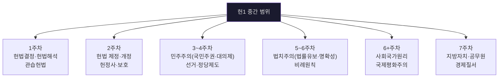

### 📊 주차별 결정례 숙제 매핑
- 출처 위치: [《헌법의_기초이론_1_강의계획서.pdf》 p.3 | "3/9 ~ 3/15 민주주의(국민주권, 대의제)"] [《2026_헌법의_기초이론_결정례_숙제.pdf》 p.1 | "헌재 2004. 10. 21. [[2004헌마554]] (관습헌법)"] [《2026_헌법의_기초이론_결정례_숙제.pdf》 p.2 | "헌재 2012. 5. 31. 2009헌마705등"]
| 주차 | 주제 | 주요 결정례 |
|---|---|---|
| 1주차 | 헌법해석·관습헌법 | 2019헌마941 (육군훈련소), **2004헌마554 (관습헌법)** |
| 2주차 | 제정·개정·보호 | 95헌바3 (헌법조항 위헌심사), 2016헌마889 (복수국적) |
| 3주차 | 민주주의·국민주권 | **2004헌나1 (탄핵)**, 2007헌마843 (주민투표) |
| 4주차 | 선거·정당제도 | 2012헌마192 (선거구), **2013헌다1 (정당해산)**, 2008헌마491 |
| 5주차 | 법치주의·비례원칙 | 2023헌마820, 2019헌마1399, 2021헌바178, 93헌가4 |
| 6주차 | 사회국가·국제평화 | 2008헌바141, 2022헌마356, 2020헌마1724 |
| 7주차 | 지방자치·경제질서 | — |

### 📊 탄핵소추절차와 적법절차
| 항목 | 정리 |
|---|---|
| **핵심** | 국회의 탄핵소추절차에 적법절차원칙이 직접 적용되는 것은 아님 |
| **의미** | 국가기관 상호 간 권한관계라는 점이 반영된 특수영역 |
| **객관식 포인트** | 일반 형사절차와 같은 수준의 직접 적용으로 쓰면 틀리기 쉬움 |

- `[결정례 요지]` 탄핵소추절차에 적법절차원칙을 직접 적용할 수 있는지가 별도 쟁점이 되고, 직접 적용을 부정하는 방향으로 정리된다.
  - 근거 발췌: "국회의탄핵소추절차에적법절차원칙을직접적용할수있는지여부"
  - 근거 위치: [《2004헌나1.pdf》 p.1 | "국회의탄핵소추절차에적법절차원칙을직접적용할수있는지여부"]

---

## 2. 주차별 핵심 쟁점

### 2-1. 헌법 개념·해석·관습헌법 — ★★
- 출처 위치: [《2026_헌법의_기초이론_결정례_숙제.pdf》 p.1 | "헌재 2004. 10. 21. [[2004헌마554]] (관습헌법)"] [《강성민_헌법_최종정리_OX_총론_통치구조.pdf》 p.1 | "제 3편 헌법총론"] [《강성민_헌법_최종정리_OX_총론_통치구조.pdf》 p.3 | "제2절 헌법의 해석"] [《강성민_헌법단권화노트_25.pdf》 p.192-194 | "관습헌법"] [《강성민_헌법단권화노트_25.pdf》 p.194 | "합헌적 법률해석"]

#### 📊 헌법 해석 방법론
| 해석방법 | 내용 | 특징 |
|---|---|---|
| **문리적 해석** | 헌법 문언의 통상적 의미 | 출발점, 한계도 여기서 설정 |
| **역사적 해석** | 제정·개정 당시 입법자 의사 | 원의주의 |
| **체계적 해석** | 헌법 전체 체계·조문 간 관계 | 모순 회피 |
| **목적론적 해석** | 헌법 규범의 규범적 목적 | 가장 많이 활용 |

#### 📊 합헌적 법률해석
| 항목 | 정리 |
|---|---|
| **의의** | 여러 해석 가능성 중 헌법합치적 의미를 선택하는 해석 |
| **한계** | 법률 문언이 허용하는 범위 내에서만 가능 |
| **객관식 함정** | 헌재만 할 수 있다거나, 문언을 넘어 새 규범을 만드는 것처럼 쓰면 틀림 |

- `[OX 정리]` 합헌적 법률해석은 법률의 문언이 허용하는 범위 내에서만 가능하다.
  - 근거 발췌: "합헌적 법률해석은 법률의 문언이 허용하는 범위 내에서만 가능"
  - 근거 위치: [《헌법의_기초이론_1_이진_강성민_OX_공부범위_정리.md》 L466 | "합헌적 법률해석은 법률의 문언이 허용하는 범위 내에서만 가능"]

#### 📊 단권화 보강: 합헌적 법률해석의 성격과 한계
| 항목 | 정리 | 시험 포인트 |
|---|---|---|
| **법적 성격** | 합헌적 법률해석은 `헌법해석기법`이 아니라 `법률해석기법`이다 | `합헌적 헌법해석`처럼 쓰면 틀리기 쉽다 |
| **전제** | 법률이 위헌으로도, 합헌으로도 읽힐 수 있어야 한다 | 위헌성이 분명하면 합헌적 해석 불가 |
| **① 문의적 한계** | 문언을 넘어 전혀 다른 규범을 만들 수 없다 | 문언을 벗어나면 실질적 입법 |
| **② 법목적 한계** | 입법자의 명백한 의사와 목적을 헛되게 할 수 없다 | 입법취지를 정반대로 바꾸면 X |
| **③ 헌법수용적 한계** | 합헌적 법률해석이 사실상 합헌적 헌법해석으로 전도되면 안 된다 | 권력분립 침해와 연결 |

- `단권화 정리`: ① 합헌적 법률해석은 어디까지나 `법률`을 헌법질서에 맞게 읽는 기법이고, ② 문언·입법목적·권력분립의 한계를 넘으면 허용되지 않으며, ③ 이미 위헌성이 분명한 규정은 합헌적으로 구해낼 수 없다.
  - 근거 발췌: "헌법에 합치되는 해석"; "법률의 위헌성이 분명한 경우에는 할 수 없음"; "문의적 한계"; "입법자의 명백한 의지와 입법의 목적"; "합헌적 법률해석이 합법적 헌법해석으로 전도되어서는 안됨"
  - 근거 위치: [《강성민_헌법단권화노트_25.pdf》 p.194 | "헌법에 합치되는 해석"] [《강성민_헌법단권화노트_25.pdf》 p.194 | "법률의 위헌성이 분명한 경우에는 할 수 없음"] [《강성민_헌법단권화노트_25.pdf》 p.194 | "문의적 한계"] [《강성민_헌법단권화노트_25.pdf》 p.194 | "입법자의 명백한 의지와 입법의 목적"] [《강성민_헌법단권화노트_25.pdf》 p.194 | "합헌적 법률해석이 합법적 헌법해석으로 전도되어서는 안됨"]

#### 📊 관습헌법 (2004헌마554) 5가지 성립요건 — ★★★
| 요건 | 내용 |
|---|---|
| ① **관행의 존재** | 일정한 사항에 관한 관행·선례가 존재 |
| ② **반복·계속** | 관행이 상당기간 반복·계속 |
| ③ **항상성** | 관행의 내용이 일관되고 명확 |
| ④ **국민적 합의** | 국민의 법적 확신 (opinio juris) |
| ⑤ **헌법적 중요성** | 헌법적 수준의 규범력 인정 |

> 수도가 서울이라는 관습헌법 → 수도이전특별법 위헌

- `요건 정리`: 기본적 헌법사항에 관한 관행이 오랜 기간 반복·계속되고, 항상성과 명확성을 갖추며, 국민적 합의가 형성되어 있어야 한다.
  - 근거 발췌: "기본적 헌법사항"; "오랜 기간"; "항상성"; "국민적 합의"; "명확"
  - 근거 위치: [《헌법의_기초이론_1_이진_강성민_OX_공부범위_정리.md》 L434-438 | "기본적 헌법사항"] [《헌법의_기초이론_1_이진_강성민_OX_공부범위_정리.md》 L434-438 | "오랜 기간"] [《헌법의_기초이론_1_이진_강성민_OX_공부범위_정리.md》 L434-438 | "항상성"] [《헌법의_기초이론_1_이진_강성민_OX_공부범위_정리.md》 L434-438 | "국민적 합의"] [《헌법의_기초이론_1_이진_강성민_OX_공부범위_정리.md》 L434-438 | "명확"]
- `주요 결정문구`: "관습헌법도 헌법의 일부로서 성문헌법과 동일한 효력을 가지므로 그 변경은 헌법개정의 방법에 의해서만 가능"
  - 근거 위치: [《헌법의_기초이론_1_이진_강성민_OX_공부범위_정리.md》 L439-440 | "관습헌법도 헌법의 일부로서 성문헌법과 동일한 효력을 가지므로 그 변경은 헌법개정의 방법에 의해서만 가능"]
- `단권화 정리`: ① 관습헌법도 성문헌법과 동등한 효력을 가지므로 단순 법률로 개정·폐지할 수 없고, ② 원칙적으로 헌법개정으로만 폐지되며, ③ 다만 그것을 지탱하던 국민적 합의성이 상실되면 법적 효력을 잃을 수 있다.
  - 근거 발췌: "성문헌법과 동등한 효력을 가진다고 보아야"; "헌법개정의 방법에 의하여만"; "국민적 합의성을 상실함에 의하여 법적 효력을 상실"
  - 근거 위치: [《강성민_헌법단권화노트_25.pdf》 p.192 | "성문헌법과 동등한 효력을 가진다고 보아야"] [《강성민_헌법단권화노트_25.pdf》 p.193 | "헌법개정의 방법에 의하여만"] [《강성민_헌법단권화노트_25.pdf》 p.193 | "국민적 합의성을 상실함에 의하여 법적 효력을 상실"]

---

### 2-2. 헌법의 제정·개정·보호 및 영토·통일조항 — ★★

#### 📊 영토조항(§3)과 평화통일조항(§4)의 규범적 조화
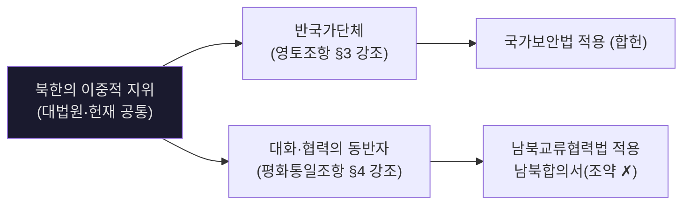

- `[결정례 요지]` 북한은 평화통일을 위한 대화·협력의 동반자이면서도 현 단계에서는 반국가단체라는 성격을 함께 가지므로, 영토조항과 평화통일조항은 규범조화적으로 읽는다.
  - 근거 위치: [《2주 헌법기초이론 헌법사 헌법개정 (게시용) (1).pptx》 slide60 | "대화와 협력의 동반자임과 동시에"] [《2주 헌법기초이론 헌법사 헌법개정 (게시용) (1).pptx》 slide60 | "반국가단체라는 성격도 함께 갖고 있음"]

#### 📊 헌법 개정 절차
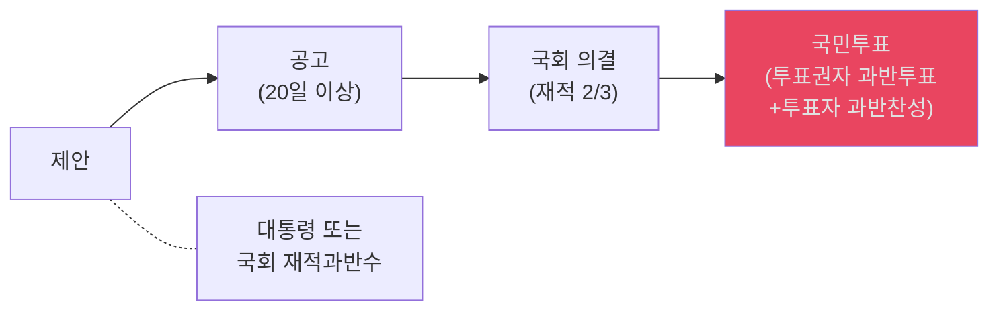

#### 📊 헌정사 개헌별 핵심 차이표 — ★★★
- 출처 위치: [《2주 헌법기초이론 헌법사 헌법개정 (게시용) (1).pptx》 slide3 | "대한민국임시정부 헌법"] [《2주 헌법기초이론 헌법사 헌법개정 (게시용) (1).pptx》 slide7 | "국회 단원제, 대통령 국회간선제"] [《2주 헌법기초이론 헌법사 헌법개정 (게시용) (1).pptx》 slide11 | "정·부통령 직선제"] [《2주 헌법기초이론 헌법사 헌법개정 (게시용) (1).pptx》 slide12 | "초대 대통령 중임제한 철폐"] [《2주 헌법기초이론 헌법사 헌법개정 (게시용) (1).pptx》 slide13 | "전형적 의원내각제"] [《2주 헌법기초이론 헌법사 헌법개정 (게시용) (1).pptx》 slide15 | "헌법개정에 국민투표제도 최초도입"] [《2주 헌법기초이론 헌법사 헌법개정 (게시용) (1).pptx》 slide17 | "통일주체국민회의"] [《2주 헌법기초이론 헌법사 헌법개정 (게시용) (1).pptx》 slide18 | "행복추구권"] [《2주 헌법기초이론 헌법사 헌법개정 (게시용) (1).pptx》 slide19 | "대통령직선제"] [《강성민_헌법_최종정리_OX_총론_통치구조.pdf》 p.10-27 | "1948년 제헌헌법은"] [《강성민_헌법_최종정리_OX_총론_통치구조.pdf》 p.10-27 | "1952년 개정헌법"] [《강성민_헌법_최종정리_OX_총론_통치구조.pdf》 p.10-27 | "1972년 헌법"] [《강성민_헌법_최종정리_OX_총론_통치구조.pdf》 p.10-27 | "1980년 헌법"] [《강성민_헌법_최종정리_OX_총론_통치구조.pdf》 p.10-27 | "1987년 개정헌법"]
| 차수·정권 | 통치구조·선출 | 특징적 조항·기관 | 객관식 포인트 |
|---|---|---|---|
| **임시정부 헌법 / 임정기** | 민주공화제·국민주권의 선구형 | 평등원칙, 권력분립, 자유권·참정권, 사법권 독립 | 현행헌법 전문의 `법통` 포인트 |
| **제헌헌법 / 이승만·제1공화국 출범** | 대통령 **국회간선**, 국회 **단원제** | 헌법위원회, 탄핵재판소, 국정감사, 사회적 경제질서, 영토조항 | 대통령선거인단 간선제 아님, 제정시 국민투표도 아님 |
| **제1차 개헌(발췌개헌) / 이승만 정권** | 정·부통령 **직선제**, 양원제 | 국무원 불신임제, 국무총리 제청권 | `국민투표제·경제체제 전환`은 이 시기 아님 |
| **제2차 개헌(사사오입) / 이승만 정권** | 대통령 중심 강화 | 초대 대통령 중임제한 철폐, 국무총리제 폐지, 군법회의 근거, 중요정책 국민투표 | `사사오입 개헌`, 의결정족수 번복 문제 |
| **제3차 개헌 / 제2공화국·장면 내각기** | 전형적 **의원내각제**, 양원제 | 헌법재판소 최초, 중앙선관위 헌법기관화, 정당 헌법규율, 공무원 정치적 중립 | 대법원장·대법관 선거제까지 같이 묶어 암기 |
| **제4차 개헌 / 제2공화국·장면 내각기** | 부칙 중심의 보완 개헌 | 3·15 부정선거 및 반민주행위 처벌을 위한 특별입법 근거 | 본문보다 `부칙` 포인트가 중요 |
| **제5차 개헌 / 박정희 군정·제3공화국 출범** | 대통령 **직선제**, 4년 중임제 | 인간의 존엄과 가치, 감사원 신설, 대법원 위헌심사, 헌법개정 국민투표 최초, **무소속 입후보 금지**(정당공천제) | 국무총리 임명에 국회동의 필요 없음 |
| **제6차 개헌(3선개헌) / 박정희 정권** | 대통령제 유지 | 3선 허용 | `4년 중임` 틀은 유지, 핵심은 3선 허용 |
| **제7차 개헌(유신헌법) / 박정희 유신체제** | 통일주체국민회의 간선, 대통령 **6년** | 국회의원 1/3 선출, 국회해산권, 긴급조치권, 국정감사 폐지, 허가·검열 금지 삭제 | 국회의원 1/2 아님, 대통령 임기 5년 아님 |
| **제8차 개헌 / 전두환·제5공화국** | 대통령 **선거인단 간선**, 7년 단임 | 국정조사권, 행복추구권, 무죄추정, 사생활의 비밀, 환경권, 소비자보호 | 직선제 아님, 헌법소원도 아직 아님 |
| **제9차 개헌(현행헌법) / 전두환 말기·노태우 직선제 체제** | 대통령 **직선제**, 5년 단임 | 헌법재판소 부활, 헌법소원, 국정감사 부활, 최저임금제, 범죄피해자구조청구권, 군 정치적 중립 | 환경권 최초는 1987이 아니라 1980 |

- `객관식 한 줄`: 제헌은 `국회간선·단원제`, 제8차는 `선거인단 간선·7년 단임`, 제9차는 `직선제·헌법재판소·헌법소원·국정감사 부활`로 한 묶음으로 외우면 헌정사 함정 선지가 많이 정리된다.
  - 근거 위치: [《2주 헌법기초이론 헌법사 헌법개정 (게시용) (1).pptx》 slide7 | "국회 단원제, 대통령 국회간선제"] [《2주 헌법기초이론 헌법사 헌법개정 (게시용) (1).pptx》 slide18 | "행복추구권"] [《2주 헌법기초이론 헌법사 헌법개정 (게시용) (1).pptx》 slide19 | "대통령직선제"] [《강성민_헌법_최종정리_OX_총론_통치구조.pdf》 p.24-27 | "1980년 헌법"] [《강성민_헌법_최종정리_OX_총론_통치구조.pdf》 p.24-27 | "1987년 개정헌법"]

#### 📊 특징적 조항·기관의 최초·부활 포인트
- 출처 위치: [《2주 헌법기초이론 헌법사 헌법개정 (게시용) (1).pptx》 slide7 | "헌법위원회"] [《2주 헌법기초이론 헌법사 헌법개정 (게시용) (1).pptx》 slide13 | "헌법재판소 설치"] [《2주 헌법기초이론 헌법사 헌법개정 (게시용) (1).pptx》 slide15 | "감사원 신설"] [《2주 헌법기초이론 헌법사 헌법개정 (게시용) (1).pptx》 slide17 | "국정감사 폐지"] [《2주 헌법기초이론 헌법사 헌법개정 (게시용) (1).pptx》 slide18 | "국정조사권 신설"] [《2주 헌법기초이론 헌법사 헌법개정 (게시용) (1).pptx》 slide19 | "국정감사 부활"] [《강성민_헌법_최종정리_OX_총론_통치구조.pdf》 p.16-26 | "헌법재판소를"] [《강성민_헌법_최종정리_OX_총론_통치구조.pdf》 p.16-26 | "헌법위원회"] [《강성민_헌법_최종정리_OX_총론_통치구조.pdf》 p.16-26 | "국정감사권"] [《강성민_헌법_최종정리_OX_총론_통치구조.pdf》 p.16-26 | "국정조사권"] [《강성민_헌법_최종정리_OX_총론_통치구조.pdf》 p.16-26 | "행복추구권"] [《강성민_헌법_최종정리_OX_총론_통치구조.pdf》 p.16-26 | "최저임금"]
| 항목 | 시점 | 포인트 |
|---|---|---|
| **위헌심사기관** | 제헌 헌법위원회 → 제3차 헌법재판소 → 제5차 대법원 → 제7·8차 헌법위원회 → 제9차 헌법재판소 | 기관 변천을 차수와 함께 외우면 헌정사 선지 대부분이 정리된다 |
| **대통령 선출 방식** | 제헌 국회간선 → 제1차 직선 → 제3차 의원내각제형 간선 → 제5차 직선 → 제7차 통일주체국민회의 간선 → 제8차 선거인단 간선 → 제9차 직선 | `제헌·제8차`를 직선제로 쓰는 선지가 자주 나온다 |
| **국정감사·국정조사** | 제헌 국정감사 → 제7차 폐지 → 제8차 국정조사 명문화 → 제9차 국정감사 부활 | `국정조사 최초`는 제8차, `국정감사 부활`은 제9차 |
| **헌법개정 국민투표** | 제5차 최초 도입 | 제헌헌법·제1차 발췌개헌과 구별해야 한다 |
| **인간의 존엄과 가치** | 제5차 최초 명문화 | `행복추구권`보다 한 단계 앞선다 |
| **행복추구권·환경권** | 제8차 최초 | 제9차 최초라고 섞이면 오답 |
| **최저임금제·범죄피해자 구조청구권** | 제9차 최초 | 제8차와 구별하는 대표 조항 |
| **중앙선관위·정당 헌법규율** | 제3차 개헌 | 의원내각제와 함께 묶어 기억하는 게 효율적 |
| **지방의회 구성 유예** | 제7차 부칙에서 유예, 제8차 부칙에서도 재유예 | 지방자치 파트와 연결되는 연혁 포인트 |

#### 📊 헌정사 객관식 함정 포인트
- 출처 위치: [《강성민_헌법_최종정리_OX_총론_통치구조.pdf》 p.10 | "1948년 제헌헌법은 국민투표에 부치지 않고"] [《강성민_헌법_최종정리_OX_총론_통치구조.pdf》 p.14-15 | "1954년"] [《강성민_헌법_최종정리_OX_총론_통치구조.pdf》 p.14-15 | "국무총리"] [《강성민_헌법_최종정리_OX_총론_통치구조.pdf》 p.21-23 | "3선 개헌"] [《강성민_헌법_최종정리_OX_총론_통치구조.pdf》 p.21-23 | "통일주체국민회의"] [《강성민_헌법_최종정리_OX_총론_통치구조.pdf》 p.24-26 | "행복추구권"] [《강성민_헌법_최종정리_OX_총론_통치구조.pdf》 p.24-26 | "최저임금"] [《2022학년도_동계_1학년_진급시험_1교시_헌법_문제지.pdf》 p.2 | "1952년 개정헌법(제1차 개헌)의 주요 개정내용"] [《2023학년도_동계_1학년_진급시험_1교시_헌법_문제지.pdf》 p.3 | "대한민국 헌법의 역사에 관한 설명"] [《2024학년도_동계_1학년_진급시험_1교시_헌법_문제지.pdf》 p.2 | "1987년 제8차 개정헌법"]
| 자주 나오는 오답 선지 | 정리 |
|---|---|
| **제헌헌법은 대통령선거인단에 의한 간선제였다** | `X` 제헌헌법은 대통령 국회간선제다 |
| **1952 1차 개헌에서 국민투표제와 자유경제체제 전환이 들어왔다** | `X` 그 포인트는 1954 2차 개헌 쪽이다 |
| **1962 5차 개헌에서 국무총리 임명에 국회동의가 필요했다** | `X` 국회동의 없는 임명 구조다 |
| **1962 5차 개헌에서 무소속 후보의 입후보가 금지되었다** | `O` 정당공천제 도입으로 무소속 입후보 금지 |
| **1972 유신헌법은 통일주체국민회의가 국회의원 1/2을 선출했다** | `X` 1/3이다 |
| **1972 유신헌법의 대통령 임기는 5년이었다** | `X` 6년이다 |
| **1980 8차 개헌은 대통령 직선제다** | `X` 선거인단 간선제다 |
| **1980 8차 개헌에서 헌법소원이 도입되었다** | `X` 헌법소원은 1987 현행헌법 포인트다 |
| **1987 9차 개헌에서 환경권이 처음 규정되었다** | `X` 환경권은 1980, 1987은 최저임금제와 범죄피해자구조청구권이 핵심이다 |
| **대통령 중임변경 효력 제한 조항은 1987 제8차 개정헌법부터다** | `X` 현행헌법은 1987 제9차 개정헌법이다 |

- `객관식 회독 포인트`: 헌정사는 `통치구조`, `위헌심사기관`, `국정감사/조사`, `최초 규정 조항` 네 축으로 끊어서 보면 함정 선지가 가장 빨리 걸러진다.
- `정권축 회독 포인트`: `제헌~제2차 = 이승만`, `제3·4차 = 제2공화국·장면`, `제5~7차 = 박정희`, `제8차 = 전두환`, `제9차 = 6월항쟁 이후 직선제 체제`로 끊어 보면 순서가 훨씬 덜 헷갈린다.

#### 📊 단권화 보강: 헌정사 세부 최초·유일 포인트
| 차수 | 추가 포인트 | 회독 문장 |
|---|---|---|
| **제헌** | 헌법위원회·탄핵재판소, 심계원 회계감사, 감찰위원회 직무감찰, 지방자치 도입 | `제헌 = 국회간선·단원제·헌법위원회·탄핵재판소·심계원` |
| **제3차(1960)** | 본질적 내용 침해금지 최초, 언론·출판·집회·결사의 허가·검열 금지 신설, 중앙선관위 헌법기관화 | `제3차 = 의원내각제 + 헌재 최초 + 본질내용침해금지 최초` |
| **제5차(1962)** | 대통령 개헌제안권이 없던 유일한 시기, 필수적 국민투표 최초 도입, 국회동의 없는 국무총리 임명, **무소속 입후보 금지**(정당공천제) | `제5차 = 인간의 존엄 + 감사원 + 필수적 국민투표 최초 + 대통령 개헌제안권 X + 무소속 금지` |
| **제7차(1972)** | 지방의회 구성 통일 시까지 유예, 국회의원 1/3 선출, 본질적 내용 침해금지 삭제 | `제7차 = 유신·1/3·6년·본질내용삭제·지방의회 유예` |
| **제8차(1980)** | 대통령 선거인단 간선, 헌법소원 아직 없음, 국정조사권 신설, 행복추구권·환경권 규정 | `제8차 = 선거인단·7년 단임·국정조사·행복추구권·환경권` |
| **제9차(1987)** | 직선제, 헌법재판소·헌법소원, 국정감사 부활, 적법절차·최저임금·범죄피해자 구조청구권 | `제9차 = 직선제·헌재·헌법소원·국정감사 부활` |

- `단권화 정리`: 헌정사는 `최초`, `유일`, `부활`, `삭제`라는 표지어로 읽으면 기억이 남는다. 특히 `제3차 본질내용침해금지 최초`, `제5차 대통령 개헌제안권 없음`, `제7차 본질내용침해금지 삭제`, `제8차 헌법소원 없음`, `제9차 헌법소원 도입`은 함정 선지로 자주 갈린다.
  - 근거 발췌: "본질적 내용 침해금지 최초 규정"; "대통령의 헌법개정에 대한 제안권이 없던 유일한 시기"; "본질적 내용침해금지조항 삭제"; "헌법소원 신설"
  - 근거 위치: [《강성민_헌법단권화노트_25.pdf》 p.205 | "본질적 내용 침해금지 최초 규정"] [《강성민_헌법단권화노트_25.pdf》 p.206 | "대통령의 헌법개정에 대한 제안권이 없던 유일한 시기"] [《강성민_헌법단권화노트_25.pdf》 p.207 | "본질적 내용침해금지조항 삭제"] [《강성민_헌법단권화노트_25.pdf》 p.209 | "헌법소원 신설"]

#### 📊 헌법 보호 수단 체계
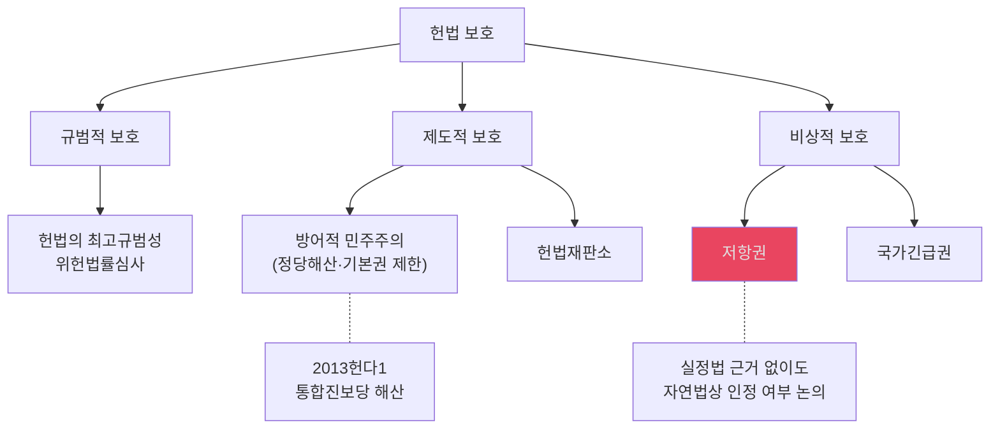

#### 📊 저항권 요건
| 요건 | 내용 |
|---|---|
| ① **헌법질서 파괴** | 헌법의 존립 자체를 위협하는 중대한 침해 |
| ② **다른 구제수단 없음** | 합법적 구제수단이 더 이상 없을 것 (보충성) |
| ③ **헌법질서 회복 목적** | 새로운 질서 창설이 아니라 기존 질서 회복 |
| ④ **최후의 수단** | 비폭력적 수단 우선 |

- `정의`: 저항권은 헌법질서를 파괴하려는 불법적 권력행사에 대항하여 시민이 헌법질서를 수호하는 최후의 수단으로 정리된다.
  - 근거 발췌: "헌법질서를 파괴하려는 불법적 권력행사에 대항하여 시민이 헌법질서를 수호하는 최후의 수단"; "불의에 항거한"
  - 근거 위치: [《헌법의_기초이론_1_이진_강성민_OX_공부범위_정리.md》 L313-314 | "헌법질서를 파괴하려는 불법적 권력행사에 대항하여 시민이 헌법질서를 수호하는 최후의 수단"] [《헌법의_기초이론_1_이진_강성민_OX_공부범위_정리.md》 L313-314 | "불의에 항거한"]

---

### 2-3. 민주주의·국민주권·대의제 — ★★★

#### 📊 민주주의 원리 체계도
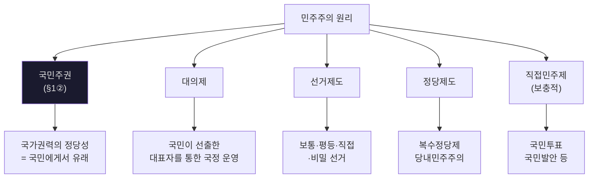

#### 📊 선거 원칙 (§41, §67) — ★★★
| 원칙 | 내용 | 위반 예 |
|---|---|---|
| **보통선거** | 일정 연령 이상 모든 국민에게 선거권 | 재산·학력 등에 의한 제한 |
| **평등선거** | 1인 1표, 투표가치 동등 | 선거구 인구편차 과다 |
| **직접선거** | 유권자가 직접 대표자 선출 | 간접선거(선거인단) |
| **비밀선거** | 투표 내용 비공개 | 기표소 CCTV |

- `[개념 정리]` 직접선거는 중간선거인의 개입 없이 선거인이 대표자를 직접 선출하는 원칙이고, 비례대표 `1인1표제` 문제도 이 직접성 침해로 정리하면 된다.
  - 근거 발췌: "직접선거의 원칙 : 중간선거인의 개입 없이"; "직접선거의 원칙에 반한다고 하지 않을 수 없다"
  - 근거 위치: [《3주 헌법기초이론 (게시용)-1 (1).pptx》 slide44 | "직접선거의 원칙 : 중간선거인의 개입 없이"] [《3주 헌법기초이론 (게시용)-1 (1).pptx》 slide47 | "직접선거의 원칙에 반한다고 하지 않을 수 없다"]
- `[결정례 요지]` 비례대표후보자명부에 대한 별도 투표 없이 지역구후보자 투표를 정당투표로 의제하는 1인1표제는 직접선거원칙에 위배된다.
  - 근거 위치: [《3주 헌법기초이론 (게시용)-1 (1).pptx》 slide44 | "1인 1표제은 직접선거원칙에 위배"] [《3주 헌법기초이론 (게시용)-1 (1).pptx》 slide47 | "직접선거의 원칙에 반한다고 하지 않을 수 없다"]
- `[선지 판단]` 직접선거는 중간선거인의 개입 없이 선거인이 대표자를 직접 선출하는 원칙이다.
  - 근거 발췌: "중간선거인의 개입 없이"
  - 근거 위치: [《3주 헌법기초이론 (게시용)-1 (1).pptx》 slide44 | "중간선거인의 개입 없이"]
- `[선지 판단]` 비례대표 1인1표제처럼 지역구 투표를 정당투표로 의제하는 방식은 직접선거원칙 위반으로 정리한다.
  - 근거 발췌: "직접선거원칙에 위배"
  - 근거 위치: [《3주 헌법기초이론 (게시용)-1 (1).pptx》 slide44 | "직접선거원칙에 위배"]
- `암기 문장`: ① 원칙적으로 선거는 보통·평등·직접·비밀 원칙에 따라 이루어지고, ② 평등선거는 투표가치의 완전한 수학적 일치를 뜻하지는 않아 선거구 획정에서 일정 조정이 허용되며, ③ 직접선거는 중간선거인의 개입뿐 아니라 `정당투표 의제`처럼 투표와 의석배분 사이의 직접성을 끊는 방식도 문제 된다.
  - 근거 발췌: "직접선거의 원칙 : 중간선거인의 개입 없이"; "상하 33 1/3% (상한과 하한의 비율 2:1)"; "지역구후보자에 대한 투표를 정당에 대한 투표로 의제"
  - 근거 위치: [《3주 헌법기초이론 (게시용)-1 (1).pptx》 slide44 | "직접선거의 원칙 : 중간선거인의 개입 없이"] [《3주 헌법기초이론 (게시용)-1 (1).pptx》 slide41 | "상하 33 1/3% (상한과 하한의 비율 2:1)"] [《3주 헌법기초이론 (게시용)-1 (1).pptx》 slide44 | "지역구후보자에 대한 투표를 정당에 대한 투표로 의제"]

#### 📊 선거운동 자유의 원칙·예외 — ★★★
| 항목 | 정리 | 회독 포인트 |
|---|---|---|
| **원칙** | 선거운동의 자유는 정치적 표현의 자유의 한 태양이자 선거권 행사의 전제다 | 선거운동 제한은 기본적으로 엄격심사 |
| **정당화 사유** | 선거의 공정성, 기회균등, 평온 보장을 위해 주체·기간·방법 제한 가능 | 제한 자체는 가능하지만 과도하면 위헌 |
| **심사 강도** | 선거운동은 국민주권 행사의 일환이므로 제한입법에 엄격한 심사기준 적용 | `선거운동 = 그냥 일반행위`라고 쓰면 약하다 |

- `개념 정리`: ① 선거운동의 자유는 정치적 표현의 자유이자 선거권의 중요한 내용이고, ② 따라서 공정성 확보를 위한 제한은 가능하지만, ③ 민주사회를 움직이는 핵심 표현영역이므로 제한입법에는 엄격한 심사기준이 적용된다.
  - 근거 발췌: "정치적 표현의 자유의 한 태양"; "선거권의 중요한 내용"; "엄격한 심사기준"
  - 근거 위치: [《4주 헌법기초이론 (게시용) (1).pptx》 slide10 | "정치적 표현의 자유의 한 태양"] [《4주 헌법기초이론 (게시용) (1).pptx》 slide10 | "선거권의 중요한 내용"] [《4주 헌법기초이론 (게시용) (1).pptx》 slide10 | "엄격한 심사기준"]

#### 📊 4주 PPT 반영: 선거운동 제한 최신결정례 압축표 — ★★★
| 쟁점 | 사건 | 결론 | 핵심 이유 |
|---|---|---|---|
| **지방공사 상근직원 선거운동 금지** | `2024.1.25. 2021헌가14` | **위헌** | 일반 사기업 직원보다 폐해가 크다고 보기 어렵고, `지위를 이용하여` 제한하는 완화된 대안 가능 |
| **종교단체 내 직무상 지위 이용 선거운동 제한** | `2024.1.25. 2021헌바233등` | **합헌·각하** | 정교분리와 선거 공정성 확보, 왜곡된 정치적 의사 형성 방지 |
| **인터넷 UCC 등 180일 전부터 금지** | `2011.12.29. 2007헌마1001등` | **한정위헌** | 인터넷은 `개방성·상호작용성·저비용성`을 가져 공정성 확보 목적에도 기여 |
| **시설물·광고물·표시물 장기 금지** | `2022.7.21. 2017헌바100등` | **헌법불합치 취지** | 저비용 수단까지 장기간 일률 금지하여 침해최소성 위반 |
| **확성장치 사용 금지** | `2022.7.21. 2017헌바100등` | **합헌** | 소음 규제를 통한 국민의 건강하고 쾌적한 환경 보장이 인정됨 |
| **선거기간 중 표시물 사용 전면금지** | `2022.7.21. 2017헌가4` | **헌법불합치** | 일반 유권자의 저비용 정치적 표현을 과도하게 봉쇄 |
| **선거기간 중 집회·모임 전면금지** | `2022.7.21. 2018헌바164`, `2018헌바357등` | **위헌** | 선거기간에 오히려 정치적 의사표현을 더 강하게 제한 |
| **선거운동기간 전 개별 대면 말 선거운동 금지** | `2022.2.24. 2018헌바146` | **위헌** | 돈이 들지 않는 개별 대면 말 선거운동까지 금지한 것은 과도 |
| **인쇄물 살포 장기 금지** | `2023.3.23. 2023헌가4` | **헌법불합치** | 인쇄물은 저비용이고, 비용규제·비방금지 등 완화된 대안 존재 |

- `원칙→예외 문장`: ① 원칙적으로 선거운동의 자유는 강하게 보호되지만, ② 예외적으로 선거의 공정성·기회균등을 위해 주체·기간·방법 제한이 가능하고, ③ 다시 예외적으로도 저비용·저위험 수단까지 전면적·장기적으로 묶으면 과잉금지원칙 위반으로 위헌 또는 헌법불합치가 된다.
  - 근거 발췌: "정치적 표현의 자유는 ... 우월한 효력을 가짐"; "기회의 균형성, 투명성, 저비용성"; "목적 달성에 필요한 범위를 넘어"; "소음을 규제하여"; "정치적 표현의 자유를 과도하게 제한"
  - 근거 위치: [《4주 헌법기초이론 (게시용) (1).pptx》 slide15 | "정치적 표현의 자유는 ... 우월한 효력을 가짐"] [《4주 헌법기초이론 (게시용) (1).pptx》 slide14 | "기회의 균형성, 투명성, 저비용성"] [《4주 헌법기초이론 (게시용) (1).pptx》 slide17 | "목적 달성에 필요한 범위를 넘어"] [《4주 헌법기초이론 (게시용) (1).pptx》 slide18 | "소음을 규제하여"] [《4주 헌법기초이론 (게시용) (1).pptx》 slide20 | "정치적 표현의 자유를 과도하게 제한"]

#### 📊 정당 '등록취소' vs '위헌해산' 비교표
| 구별 | 등록취소 (정당법) | 위헌정당해산 (§8④) |
|---|---|---|
| **심사 주체** | 중앙선거관리위원회 | **헌법재판소** |
| **요건** | 요건 흠결, 일정 기간 선거 미참여 등 | 목적·활동이 민주적 기본질서 위배 |
| **비례원칙 적용** | 엄격하게 적용 | 헌법 명문엔 없으나 **헌재가 직접 적용** |
| **주요 판례** | 국회의원 선거 득표율 미달 등록취소 → **위헌** | 통합진보당 해산 (2013헌다1) → 합헌 |

#### 📊 정당해산 (2013헌다1) 요건 — ★★
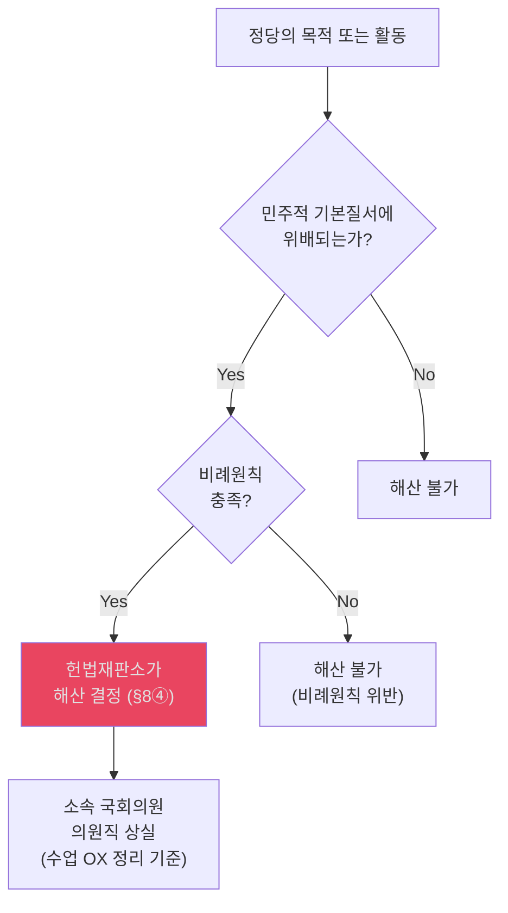

- `요건 정리`: ① 정당의 목적이나 활동이 민주적 기본질서에 위배될 것, ② 그 위험성이 정당존립의 자유를 제한할 만큼 중대하고 구체적일 것, ③ 대안적 수단이 없고 해산의 이익이 불이익을 초과할 정도여야 한다.
  - 근거 발췌: "정당의 목적이나 활동이 민주적 기본질서에 위배될 때에는"; "정당 활동의 위험성이 정당존립의 자유를 제한할 만큼 중대하고 구체적"; "대안적 수단이 없고, 해산으로 얻는 이익이 정당활동 제한의 불이익을 초과할 정도로 큰 경우"
  - 근거 위치: [《헌법의_기초이론_1_이진_강성민_OX_공부범위_정리.md》 L357-364 | "정당의 목적이나 활동이 민주적 기본질서에 위배될 때에는"] [《헌법의_기초이론_1_이진_강성민_OX_공부범위_정리.md》 L357-364 | "정당 활동의 위험성이 정당존립의 자유를 제한할 만큼 중대하고 구체적"] [《헌법의_기초이론_1_이진_강성민_OX_공부범위_정리.md》 L357-364 | "대안적 수단이 없고, 해산으로 얻는 이익이 정당활동 제한의 불이익을 초과할 정도로 큰 경우"]
- `주요 결정문구`: "정당의 목적이나 활동이 민주적 기본질서에 위배될 때에는 ... 헌법재판소의 심판에 의하여 해산된다"
  - 근거 위치: [《헌법의_기초이론_1_이진_강성민_OX_공부범위_정리.md》 L357-358 | "정당의 목적이나 활동이 민주적 기본질서에 위배될 때에는 ... 헌법재판소의 심판에 의하여 해산된다"]
- `[수업 OX 정리 기준]` 2013헌다1은 정당해산심판에서도 비례원칙을 헌법적 정당화 요건으로 보고, 대안적 수단이 없을 정도의 중대성이 있을 때만 해산을 정당화하는 것으로 정리된다. 의원직 상실 문제는 수업 OX 정리상 `상실 인정` 방향으로 회독한다.
  - 근거 위치: [《5.기타/_inbox/ox_temp.txt》 L3264-L3273 | "비례원칙"] [《5.기타/_inbox/ox_temp.txt》 L3264-L3273 | "정당해산결정이 충족해야 할 일종의 헌법적 정당화 사유"] [《5.기타/_inbox/ox_temp.txt》 L3274-L3283 | "대안적 수단이 없고"] [《5.기타/_inbox/ox_temp.txt》 L3274-L3283 | "정당해산결정의 정당화"] [《5.기타/_inbox/ox_temp.txt》 L3299-L3301 | "정당해산결정의 실효성을 위해"; "국회의원과 지방의회의원은 그 자격을 상실한다고 결정"]
- `암기 문장`: ① 원칙적으로 정당존립의 자유는 폭넓게 보장되지만, ② 예외적으로 그 목적이나 활동이 민주적 기본질서에 대한 구체적 위험을 만들고 비례원칙까지 충족할 때에만 해산되며, ③ 효과로서 의원직 상실 문제는 수업 OX 정리 기준에 맞춰 함께 회독한다.
  - 근거 발췌: "정당의 목적이나 활동이 민주적 기본질서에 위배될 때에는"; "정당 활동의 위험성이 정당존립의 자유를 제한할 만큼 중대하고 구체적"; "비례원칙"; "국회의원과 지방의회의원은 그 자격을 상실한다고 결정"
  - 근거 위치: [《헌법의_기초이론_1_이진_강성민_OX_공부범위_정리.md》 L357-364 | "정당의 목적이나 활동이 민주적 기본질서에 위배될 때에는"] [《헌법의_기초이론_1_이진_강성민_OX_공부범위_정리.md》 L357-364 | "정당 활동의 위험성이 정당존립의 자유를 제한할 만큼 중대하고 구체적"] [《5.기타/_inbox/ox_temp.txt》 L3264-L3273 | "비례원칙"] [《5.기타/_inbox/ox_temp.txt》 L3299-L3301 | "국회의원과 지방의회의원은 그 자격을 상실한다고 결정"]

---

### 2-4. 법치주의·법률유보·명확성 — ★★★
- 출처 위치: [《5주 헌법기초이론 (게시용).pptx》 slide10 | "법률유보의 원칙은 ... “법률에 근거한 규율”"] [《5주 헌법기초이론 (게시용).pptx》 slide14 | "그 본질적 사항에 대하여 ... 입법자가 법률로써 스스로 결정"] [《[[2023헌마820]].pdf》 p.2 | "법률에 직접 규정할 사항이 아니므로 이를 법률에서 직접 정하지 않았다고 하여 의회유보원칙에 위반된다고 볼 수 없다"] [《강성민_헌법단권화노트_25.pdf》 p.24-26 | "기본권의 제한 및 한계"] [《강성민_헌법단권화노트_25.pdf》 p.25-26 | "법률유보원칙"]

#### 📚 6주차 재작성: 조문 원문부터 보는 법치주의·행정입법
- `헌법 제37조 제2항`: "국민의 모든 자유와 권리는 국가안전보장·질서유지 또는 공공복리를 위하여 필요한 경우에 한하여 법률로써 제한할 수 있으며, ... 본질적인 내용을 침해할 수 없다."
- `헌법 제75조`: "대통령은 법률에서 구체적으로 범위를 정하여 위임받은 사항과 법률을 집행하기 위하여 필요한 사항에 관하여 대통령령을 발할 수 있다."
- `헌법 제119조 제1항`: "대한민국의 경제질서는 개인과 기업의 경제상의 자유와 창의를 존중함을 기본으로 한다."
- `헌법 제119조 제2항`: "국가는 균형있는 국민경제의 성장 및 안정과 적정한 소득의 분배를 유지하고, ... 경제의 민주화를 위하여 경제에 관한 규제와 조정을 할 수 있다."

#### 📊 기본권 제한 심사 3단계 — ★★★
| 단계 | 물어볼 것 | 회독 문장 |
|---|---|---|
| **① 보호영역** | 이 자유가 애초에 해당 기본권의 보호범위 안에 들어오는가 | 보호영역 바깥이면 끝 |
| **② 제한 존재** | 국가작용이 그 기본권을 실제로 제한하는가 | 제한이 없으면 침해도 없음 |
| **③ 헌법적 한계 준수** | 제한이 §37② 등 헌법적 한계를 지켰는가 | 한계를 넘으면 위헌 |

- `단권화 정리`: 기본권 문제는 ① 보호영역 확정, ② 제한 존재 확인, ③ 헌법적 한계 일탈 여부의 3단계로 보면 된다.
  - 근거 발췌: "1단계 기본권의 보호영역에 포함되는지 여부"; "2단계 기본권에 대한 제한이 존재하는지 여부"; "3단계 기본권에 대한 제한이 헌법적 한계를 벗어나"
  - 근거 위치: [《강성민_헌법단권화노트_25.pdf》 p.24 | "1단계 기본권의 보호영역에 포함되는지 여부"] [《강성민_헌법단권화노트_25.pdf》 p.24 | "2단계 기본권에 대한 제한이 존재하는지 여부"] [《강성민_헌법단권화노트_25.pdf》 p.24 | "3단계 기본권에 대한 제한이 헌법적 한계를 벗어나"]

#### 📊 6주차 PPT 반영: 신뢰보호원칙 판단표
| 단계 | 물어볼 것 | 6주차 PPT 문구 |
|---|---|---|
| **① 신뢰의 기초** | 국가가 법률 제정·유지 등으로 신뢰의 기초를 만들었는가 | 국가가 법률의 제정과 같은 작용을 통해 신뢰의 기초를 형성 |
| **② 신뢰에 따른 행위** | 개인이 그 신뢰를 바탕으로 행동했는가 | 개인이 이러한 국가작용에 대한 신뢰에 따라 일정한 행위 |
| **③ 형량** | 신뢰이익과 공익을 비교형량하면 어느 쪽이 우월한가 | 신뢰이익의 보호가치, 침해 정도, 공익목적을 종합 형량 |

- `6주차 요지`: 신뢰보호원칙은 모든 기대를 보호하는 것이 아니라, `합리적이고 정당한 신뢰`가 있는 경우에만 문제 된다. 부진정소급입법에서는 원칙적으로 허용되더라도 신뢰보호 심사를 별도로 거친다는 점을 같이 적어야 한다.
  - 근거 발췌: "국민이 어떤 법률이나 제도가 그대로 존속될 것이라는 합리적인 신뢰"; "신뢰의 기초"; "일정한 행위"; "공익을 서로 형량"
  - 근거 위치: [《6주 헌법기초이론 (게시용).pptx》 slide3 | "국민이 어떤 법률이나 제도가 그대로 존속될 것이라는 합리적인 신뢰"] [《6주 헌법기초이론 (게시용).pptx》 slide10 | "신뢰의 기초"] [《6주 헌법기초이론 (게시용).pptx》 slide10 | "일정한 행위"] [《6주 헌법기초이론 (게시용).pptx》 slide10 | "공익을 서로 형량"]

#### 📊 법치주의 내용 체계도
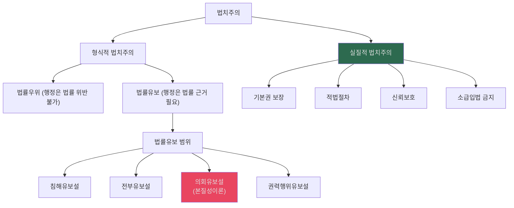

- `5주차 요지`: 법치주의는 일차적으로 `미리 제정되고 명확한 법에 의한 통치`라는 형식적 개념이지만, 오늘날에는 민주주의와 결합하여 기본권 보장·적법절차·신뢰보호까지 포함하는 실질적 법치주의로 읽는다.
  - 근거 발췌: "법치주의는 일차적으로 형식적인 개념임"; "민주주의(국민주권)와의 결합"; "법률유보원칙"; "통제장치이기도 함"
  - 근거 위치: [《5주 헌법기초이론 (게시용).pptx》 slide3 | "법치주의는 일차적으로 형식적인 개념임"] [《5주 헌법기초이론 (게시용).pptx》 slide5 | "민주주의(국민주권)와의 결합"] [《5주 헌법기초이론 (게시용).pptx》 slide5 | "법률유보원칙"] [《5주 헌법기초이론 (게시용).pptx》 slide5 | "통제장치이기도 함"]

#### 📊 헌법유보·법률유보 유형 정리
| 유형 | 뜻 | 예시 |
|---|---|---|
| **일반적 헌법유보** | 헌법이 기본권 일반의 제약을 직접 규정 | 우리 헌법에는 없음 |
| **개별적 헌법유보** | 헌법이 특정 기본권 제약을 직접 규정 | §8④, §21④, §23②, §29② |
| **일반적 법률유보** | 기본권 일반을 법률로 제한 가능 | §37② |
| **개별적 법률유보** | 특정 기본권만 법률로 제한 가능 | §12, §13, §23③, §33③ 등 |
| **형성적 법률유보** | 법률이 내용·행사절차를 비로소 구체화 | 재산권, 선거권, 공무담임권, 청원권 |

- `단권화 정리`: ① 우리 헌법에는 `일반적 헌법유보`는 없고, ② 기본권 일반 제한은 §37②의 `일반적 법률유보`로 본다. ③ `형성적 법률유보`는 기본권을 제한하는 것이 아니라 법률에 의해 비로소 그 내용과 절차가 구체화되는 경우다.
  - 근거 발췌: "일반적 헌법유보"; "우리 헌법에는 없음"; "일반적 법률유보"; "형성적 법률유보"; "법률에 의해 기본권이 실현되고 보장되어야"
  - 근거 위치: [《강성민_헌법단권화노트_25.pdf》 p.24 | "일반적 헌법유보"] [《강성민_헌법단권화노트_25.pdf》 p.24 | "우리 헌법에는 없음"] [《강성민_헌법단권화노트_25.pdf》 p.24 | "일반적 법률유보"] [《강성민_헌법단권화노트_25.pdf》 p.24 | "형성적 법률유보"] [《강성민_헌법단권화노트_25.pdf》 p.24 | "법률에 의해 기본권이 실현되고 보장되어야"]

#### 📊 법률유보 vs 의회유보 비교 — ★★★
| | 법률유보 | 의회유보 |
|---|---|---|
| **의미** | 행정작용에 법률의 근거 필요 | **본질적 사항**은 반드시 국회가 직접 입법 |
| **포괄위임 가능** | 가능 (범위 내) | **불가** (본질적 사항은 직접 규율) |
| **심사강도** | 법률 근거의 유무 | 법률 자체의 **내용적 충실성** |
| **핵심 이론** | — | **본질성이론 (Wesentlichkeitstheorie)** |

- `[개념 정리]` 법률유보는 `국가작용에 법적 근거가 있는가`의 문제이고, 의회유보는 그중 본질적 사항을 `입법자가 스스로 정했는가`를 묻는 강화된 통제다.
  - 근거 발췌: "법률에 근거한 규율"; "입법자가 법률로써 스스로 결정"
  - 근거 위치: [《5주 헌법기초이론 (게시용).pptx》 slide10 | "법률에 근거한 규율"] [《5주 헌법기초이론 (게시용).pptx》 slide14 | "입법자가 법률로써 스스로 결정"]
- `[결정례 요지]` 법률유보는 단지 법률에 의한 규율만이 아니라 법률에 근거한 규율까지 요구한다.
  - 근거 위치: [《5주 헌법기초이론 (게시용).pptx》 slide10 | "법률에 의한 규율"] [《5주 헌법기초이론 (게시용).pptx》 slide10 | "법률에 근거한 규율"]
- `[결정례 요지]` 수신료의 구체적 고지방법은 본질적 사항이 아니어서 법률이 직접 정할 필요가 없고, 시행령 규정은 집행명령으로 본다.
  - 근거 위치: [《5주 헌법기초이론 (게시용).pptx》 slide14 | "본질적 사항"] [《5주 헌법기초이론 (게시용).pptx》 slide14 | "입법자가 법률로써 스스로 결정"] [《[[2023헌마820]].pdf》 p.2 | "법률에 직접 규정할 사항이 아니므로"] [《[[2023헌마820]].pdf》 p.2 | "수신료 납부통지에 관한 절차적 사항을 규정하는 집행명령"]
- `암기 문장`: ① 원칙적으로 법률유보는 국가작용에 법률의 근거가 있는지를 묻고, ② 예외가 아니라 강화형 통제로서 의회유보는 본질적 사항을 입법자가 스스로 정했는지를 추가로 묻으며, ③ 본질적 사항이 아니면 시행령 등 집행명령에 위임할 수 있다.
  - 근거 발췌: "법률에 근거한 규율"; "입법자가 법률로써 스스로 결정"; "법률에 직접 규정할 사항이 아니므로"
  - 근거 위치: [《5주 헌법기초이론 (게시용).pptx》 slide10 | "법률에 근거한 규율"] [《5주 헌법기초이론 (게시용).pptx》 slide14 | "입법자가 법률로써 스스로 결정"] [《[[2023헌마820]].pdf》 p.2 | "법률에 직접 규정할 사항이 아니므로"]

#### 📊 위임명령 vs 집행명령
| 구분 | 위임명령 | 집행명령 |
|---|---|---|
| **근거** | 법률의 위임 필요 | 일반적 직권에 의한 상위법 집행 |
| **통제 포인트** | 법률의 수권 범위 내인지 | 상위법 집행과 무관한 독자내용 금지 |
| **시험 포인트** | 법률의 구체적·개별적 위임 문제 | 위임 유무보다 집행한계 일탈 문제 |

- `PPT 정리`: 위임명령은 법률의 위임 범위를 벗어나면 법률유보원칙에 위반되고, 집행명령은 구체적 위임 유무가 아니라 상위법 집행과 무관한 독자내용을 정했는지가 핵심이다.
  - 근거 발췌: "위임명령은 법률에 위반되어서는 안 됨"; "집행명령의 경우 법률의 구체적·개별적 위임 여부 등이 문제되지 않고"; "상위법의 집행과 무관한 독자적인 내용을 정할 수 없다는 한계"
  - 근거 위치: [《5주 헌법기초이론 (게시용).pptx》 slide11 | "위임명령은 법률에 위반되어서는 안 됨"] [《5주 헌법기초이론 (게시용).pptx》 slide11 | "집행명령의 경우 법률의 구체적·개별적 위임 여부 등이 문제되지 않고"] [《5주 헌법기초이론 (게시용).pptx》 slide11 | "상위법의 집행과 무관한 독자적인 내용을 정할 수 없다는 한계"]

#### 📊 의회유보 사례 3개로 정리
| 사건 | 결론 | 포인트 |
|---|---|---|
| **98헌바70** | 헌법불합치 | 수신료 금액 결정은 본질적 사항 |
| **2006헌바70** | 합헌 | 개정법이 금액·납부의무자·징수절차를 직접 규정 |
| **2023헌마820등** | 각하·기각 | 분리징수의 `고지방법`은 본질적 사항이 아니고 집행명령 가능 |

- `원칙→예외 문장`: ① 원칙적으로 본질적 사항은 국회가 직접 정해야 하지만, ② 예외적으로 본질적 요소가 이미 법률에 규정되어 있다면 세부적 집행방법은 하위규범에 맡길 수 있다.
  - 근거 발췌: "본질적인 중요한 사항이므로 국회가 스스로 행하여야"; "본질적인 요소들은 방송법에 모두 규정"; "수신료의 구체적인 고지방법"; "본질적인 요소로서 법률에 직접 규정할 사항이 아니므로"
  - 근거 위치: [《5주 헌법기초이론 (게시용).pptx》 slide16 | "본질적인 중요한 사항이므로 국회가 스스로 행하여야"] [《5주 헌법기초이론 (게시용).pptx》 slide17 | "본질적인 요소들은 방송법에 모두 규정"] [《5주 헌법기초이론 (게시용).pptx》 slide18 | "수신료의 구체적인 고지방법"] [《5주 헌법기초이론 (게시용).pptx》 slide18 | "본질적인 요소로서 법률에 직접 규정할 사항이 아니므로"]

#### 📊 명확성원칙 심사기준 — ★★★
| 적용영역 | 심사강도 | 이유 |
|---|---|---|
| **형벌·과태료** | 엄격 | 죄형법정주의 + 기본권 제한 |
| **부담적 규범** | 강화 | 국민에 대한 불이익 부과 |
| **수익적 규범** | 완화 | 이익 부여 → 상대적 유연 |
| **전문적·기술적 영역** | 완화 | 불가피한 포괄위임 허용 |

- `[결정례 요지]` 명확성원칙은 수범자에게 예측가능한 행동지침을 주고, 집행자의 자의적 해석과 집행을 막기 위한 법치국가원리의 표현이다.
  - 근거 위치: [《5주 헌법기초이론 (게시용).pptx》 slide27 | "예측가능성"] [《5주 헌법기초이론 (게시용).pptx》 slide27 | "자의적인 법해석 및 집행을 예방"]
- `[결정례 요지]` 부담적 규범, 특히 형사법이나 이해관계가 첨예한 영역에서는 명확성 요구가 더욱 엄격하다.
  - 근거 위치: [《5주 헌법기초이론 (게시용).pptx》 slide28 | "부담적 성격"] [《5주 헌법기초이론 (게시용).pptx》 slide28 | "형사법이나 국민의 이해관계가 첨예하게 대립되는 법률"]
- `단권화 정리`: 우리 헌법에서는 제37조 제2항의 일반적 법률유보가 있기 때문에 `기본권의 내재적 한계`를 따로 인정할 실익이 크지 않다고 보는 정리가 타당하다.
  - 근거 발췌: "일반적 법률유보조항이 없는 독일에서"; "현행 헌법상 기본권의 내재적 한계를 인정할 실익은 없다고 봄이 타당함"
  - 근거 위치: [《강성민_헌법단권화노트_25.pdf》 p.25 | "일반적 법률유보조항이 없는 독일에서"] [《강성민_헌법단권화노트_25.pdf》 p.25 | "현행 헌법상 기본권의 내재적 한계를 인정할 실익은 없다고 봄이 타당함"]

---

### 2-5. 비례원칙과 평등원칙 — ★★★
- 출처 위치: [《헌법의_기초이론_1_통합노트.md》 §5.1 | "비례원칙(과잉금지원칙): 목적의 정당성, 수단의 적합성, 침해의 최소성, 법익의 균형성"] [《4주 헌법기초이론 (게시용) (1).pptx》 slide21 | "입법목적의 정당성 및 수단의 적합성이 인정된다"] [《4주 헌법기초이론 (게시용) (1).pptx》 slide21 | "침해의 최소성에 반한다"] [《4주 헌법기초이론 (게시용) (1).pptx》 slide21 | "법익의 균형성에도 위배된다"] [《4주 헌법기초이론 (게시용) (1).pptx》 slide55 | "목적의 정당성 및 수단의 적합성이 인정된다"] [《4주 헌법기초이론 (게시용) (1).pptx》 slide55 | "침해의 최소성 원칙에 반하지 않는다"] [《4주 헌법기초이론 (게시용) (1).pptx》 slide55 | "법익의 균형성 또한 인정된다"] [《4주 헌법기초이론 (게시용) (1).pptx》 slide55 | "평등원칙에 위배되지 않는다"] [《2024학년도_하계_1학년_진급시험_1교시_헌법_답안_및_해설.pdf》 p.1 | "기본권침해를 심사하는 데 적용되는 과잉금지원칙이나 평등원칙 등을 적용할 것은 아니다"]

#### 📊 평등권 심사기준표 (자의금지심사 vs 엄격심사) — ★★★
| 심사 척도 | 자의금지 원칙 (완화된 심사) | 비례성 원칙 (엄격한 심사) |
|---|---|---|
| **적용 기준** | 원칙적 심사척도 (입법형성권이 있는 영역) | ① 헌법에서 특별히 **평등을 요구**하는 경우 ② 차별로 인해 **관련 기본권에 중대한 제한** 초래 시 |
| **핵심 질문** | 차별에 **합리적 이유**가 있는가? | 차별목적 정당성 + 수단이 목적에 비례(과잉금지)하는가? |
| **판례 예시** | 제대군인 가산점 위헌 (완화심사로도 위헌) | 혼인빙자간음죄 (엄격심사 위헌) |

#### 📊 비례원칙 4단계 심사 — ★★★
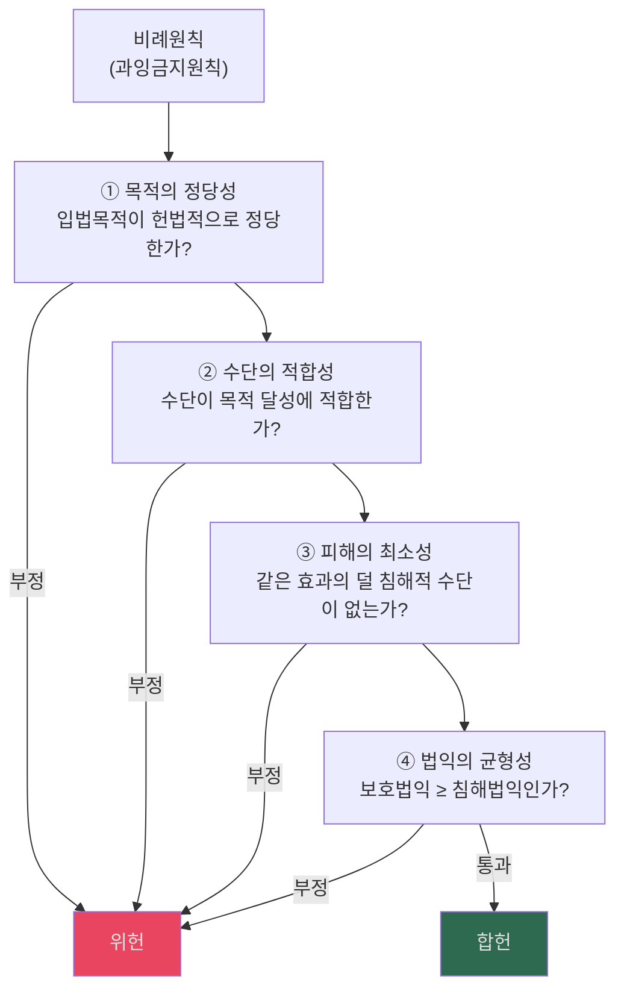

| 단계 | 핵심 질문 | 탈락 시 |
|---|---|---|
| **① 목적의 정당성** | 이 법의 목적이 헌법에 부합하나? | 위헌 |
| **② 수단의 적합성** | 이 수단으로 목적 달성이 가능한가? | 위헌 |
| **③ 피해의 최소성** | 더 덜 침해적인 방법은 없나? | 위헌 |
| **④ 법익의 균형성** | 얻는 공익 ≥ 잃는 사익인가? | 위헌 |

- `핵심 문구`: "비례원칙(과잉금지원칙): 목적의 정당성, 수단의 적합성, 침해의 최소성, 법익의 균형성"
- `6주차 PPT 보강`: 6주차는 비례원칙을 `모든 국가작용에 공통 적용되는 일반 법원칙`으로 설명하면서도, 기본권 제한 장면에서는 헌법 제37조 제2항의 과잉금지원칙으로 구체화된다고 정리한다. 그리고 4단계 중 어느 하나라도 탈락하면 위헌이고, 전 단계를 모두 통과해야 합헌이다.
  - 근거 발췌: "모든 국가작용에 공통적으로 적용되는 일반적인 법원칙"; "4단계 하위원칙을 모두 충족해야"; "기본권 제한은 과잉금지원칙을 준수하여야 함"
  - 근거 위치: [《6주 헌법기초이론 (게시용).pptx》 slide28 | "모든 국가작용에 공통적으로 적용되는 일반적인 법원칙"] [《6주 헌법기초이론 (게시용).pptx》 slide30 | "4단계 하위원칙을 모두 충족해야"] [《6주 헌법기초이론 (게시용).pptx》 slide41 | "기본권 제한은 과잉금지원칙을 준수하여야 함"]

#### 📊 6주차 PPT 반영: 비례원칙은 이렇게 외운다
| 단계 | 한 줄 정리 | 자주 연결되는 선지 |
|---|---|---|
| **목적의 정당성** | 제한 목적이 `국가안전보장·질서유지·공공복리`에 들어가는가 | 목적 자체가 사회질서·공공복리에 해당하지 않으면 탈락 |
| **수단의 적합성** | 수단이 목적 달성에 `기여`하기만 하면 족함 | 최적수단까지 요구하지는 않음 |
| **침해의 최소성** | 같은 효과의 덜 침해적 대안이 있는가 | 형사처벌 대신 행정제재 가능성, 필요적 규정 vs 임의규정 |
| **법익의 균형성** | 공익이 사익보다 커야 함 | 공익의 중요성·긴급성과 기본권 침해 강도를 함께 봄 |

- `주의`: 비례원칙은 `한 단계라도 실패하면 위헌`이라는 구조로 외우는 것이 OX에 가장 강하다. 특히 6주차 PPT는 `수단의 적합성은 최적수단까지 요구하지 않는다`, `침해의 최소성은 동등한 효과의 완화된 대안이 있을 때만 문제 된다`는 점을 따로 강조한다.
  - 근거 발췌: "입법목적을 최적으로 실현하는 수단일 것이 요구되지는 않는다"; "동등한 효과를 가진 보다 완화된 대안"; "공익과 제한되는 사익"
  - 근거 위치: [《6주 헌법기초이론 (게시용).pptx》 slide33 | "입법목적을 최적으로 실현하는 수단일 것이 요구되지는 않는다"] [《6주 헌법기초이론 (게시용).pptx》 slide37 | "동등한 효과를 가진 보다 완화된 대안"] [《6주 헌법기초이론 (게시용).pptx》 slide39 | "달성하고자 하는 공익과 제한되는 사익"]
  - 근거 위치: [《헌법의_기초이론_1_통합노트.md》 L112 | "비례원칙(과잉금지원칙): 목적의 정당성, 수단의 적합성, 침해의 최소성, 법익의 균형성"]
- `[개념 정리]` 비례원칙은 4단계가 누적적으로 적용되는 심사틀이어서, 어느 한 단계에서라도 정당화에 실패하면 위헌으로 정리한다.
  - 근거 발췌: "목적의 정당성, 수단의 적합성, 침해의 최소성, 법익의 균형성"; "침해의 최소성에 반한다"; "법익의 균형성에도 위배된다"
  - 근거 위치: [《헌법의_기초이론_1_통합노트.md》 L112 | "목적의 정당성, 수단의 적합성, 침해의 최소성, 법익의 균형성"] [《4주 헌법기초이론 (게시용) (1).pptx》 slide21 | "침해의 최소성에 반한다"] [《4주 헌법기초이론 (게시용) (1).pptx》 slide21 | "법익의 균형성에도 위배된다"]
- `[원PPT 보강]` 원PPT도 과잉금지원칙을 `목적의 정당성 → 수단의 적합성 → 침해의 최소성 → 법익의 균형성`의 실제 심사틀로 반복 적용한다. 회독할 때는 4단계를 추상적으로만 외우지 말고, 개별 판례가 이 4단계를 어떻게 통과하거나 탈락하는지 같이 붙여서 보는 편이 안정적이다.
  - 근거 위치: [《4주 헌법기초이론 (게시용) (1).pptx》 slide21 | "입법목적의 정당성 및 수단의 적합성이 인정된다"] [《4주 헌법기초이론 (게시용) (1).pptx》 slide21 | "침해의 최소성에 반한다"] [《4주 헌법기초이론 (게시용) (1).pptx》 slide21 | "법익의 균형성에도 위배된다"] [《4주 헌법기초이론 (게시용) (1).pptx》 slide55 | "목적의 정당성 및 수단의 적합성이 인정된다"] [《4주 헌법기초이론 (게시용) (1).pptx》 slide55 | "침해의 최소성 원칙에 반하지 않는다"] [《4주 헌법기초이론 (게시용) (1).pptx》 slide55 | "법익의 균형성 또한 인정된다"] [《2024학년도_하계_1학년_진급시험_1교시_헌법_답안_및_해설.pdf》 p.1 | "기본권침해를 심사하는 데 적용되는 과잉금지원칙이나 평등원칙 등을 적용할 것은 아니다"]
- `암기 문장`: ① 비례원칙은 목적의 정당성, 수단의 적합성, 침해의 최소성, 법익의 균형성을 순차적으로 심사하고, ② 어느 한 단계에서라도 정당화에 실패하면 위헌이며, ③ 다만 지방자치권 제한처럼 기본권 심사 틀과 바로 겹치지 않는 영역은 본질적 내용 침해 여부를 중심으로 따로 본다.
  - 근거 발췌: "목적의 정당성, 수단의 적합성, 침해의 최소성, 법익의 균형성"; "법익의 균형성에도 위배된다"; "본질적인 내용을 침해"; "과잉금지원칙이나 평등원칙 등을 적용할 것은 아니다"
  - 근거 위치: [《헌법의_기초이론_1_통합노트.md》 L112 | "목적의 정당성, 수단의 적합성, 침해의 최소성, 법익의 균형성"] [《4주 헌법기초이론 (게시용) (1).pptx》 slide21 | "법익의 균형성에도 위배된다"] [《헌법의_기초이론_1_이진_강성민_OX_공부범위_정리.md》 L153-L154 | "본질적인 내용을 침해"] [《헌법의_기초이론_1_이진_강성민_OX_공부범위_정리.md》 L153-L154 | "과잉금지원칙이나 평등원칙 등을 적용할 것은 아니다"]

#### 📊 선거관련 비율·직접선거 기준표 — ★★
| 쟁점 | 날짜·번호 | 원파일 기준 | 회독 기준 |
|---|---|---|---|
| **국회의원 지역선거구 인구편차** | `2014.10.30. 2012헌마190등` | 종전 `상하 50%(3:1)` 허용 기준을 더 이상 유지하지 않고, `상하 33⅓%(2:1)`을 넘는 완화는 바람직하지 않다고 본다 | 국회의원 지역선거구는 `2:1` 기준으로 회독 |
| **지방의회의원 지역선거구 인구편차** | `2018.6.28. 2014헌마189 / 2014헌마166` | 시도의회의원과 자치구·시·군의원 모두 평균 인구수 기준 `상하 50%(3:1)`을 잡고, 도농간 격차·행정구역·지세·교통 같은 2차 요소를 함께 고려한다 | 지방의회의원은 `3:1 + 2차 요소`로 회독 |
| **선거구획정 판단요소** | `2018.6.28.` | 인구비례가 1차 기준이지만, 지방의회의원 단계에서는 행정구역·지역대표성 등 2차 요소를 바로 배제하지 않는다 | 단순 인구수만으로 곧바로 위헌/합헌 결론 X |
| **비례대표 직접선거** | `2001.7.19. 2000헌마91등` | 비례대표후보자명부에 대한 별도 투표 없이 지역구 후보자 투표를 정당투표로 의제하면 직접선거 원칙에 반한다 | 비례대표 `1인1표제`는 직접선거 원칙 위반 |

- `[결정례 요지]` 국회의원 지역선거구 인구편차는 `2:1`, 지방의회의원 선거구는 `3:1 + 2차 요소`로 회독한다. 국회의원 사건은 회독 약칭을 `2012헌마190등`으로 통일한다.
  - 근거 위치: [《3주 헌법기초이론 (게시용)-1 (1).pptx》 slide41 | "국회의원 지역선거구 인구편차의 허용기준을 ... 2:1"] [《3주 헌법기초이론 (게시용)-1 (1).pptx》 slide41 | "지방의회의 경우 ... 3:1"] [《3주 헌법기초이론 (게시용)-1 (1).pptx》 slide41 | "도농간 격차, 행정구역, 지세, 교통 등 2차적 요소"] [《5.기타/_inbox/ox_temp.txt》 L3952-L3959 | "2014.10.30. [[2012헌마190]]"] [《5.기타/_inbox/ox_temp.txt》 L3952-L3959 | "지방의회선거의 경우 ... 3 : 1"]
- `공식 확인`: 헌법재판소 분야별 주요판례는 대표사건을 `[[2012헌마190]]`으로, 병합표시는 `[[2012헌마190]]·192·211·262·325, [[2013헌마781]], [[2014헌마53]](병합)`으로 적고 있다. 이 노트는 회독 편의상 `2012헌마190등`으로 통일한다.
  - 공식 링크: [헌법재판소 분야별 주요판례](https://www.ccourt.go.kr/site/kor/ex/bbs/View.do?bcIdx=941689&cbIdx=1106)
- `[결정례 요지]` 2000헌마91등은 지역구후보자 투표를 해당 정당 비례대표후보자 투표로 의제하는 `1인1표제`가 비례대표 선출에서 직접선거원칙에 반한다고 본다.
  - 근거 위치: [《3주 헌법기초이론 (게시용)-1 (1).pptx》 slide44 | "지역구후보자에 대한 투표를 정당에 대한 투표로 의제"] [《3주 헌법기초이론 (게시용)-1 (1).pptx》 slide44 | "직접선거원칙에 위배"] [《5.기타/_inbox/ox_temp.txt》 L3964-L3972 | "선거결과가 선거권자의 투표에 의하여 직접 결정"] [《5.기타/_inbox/ox_temp.txt》 L3964-L3972 | "1인표제는 직접선거의 원칙에 위배된다"] [《5.기타/_inbox/ox_temp.txt》 L4001-L4002 | "(2001.7.19. [[2000헌마91]])"]

- `주의 메모`: 기존 로컬 OX 메모 중에는 국회의원선거까지 `3:1`로 적은 부분이 있었지만, 본표는 원PPT `3주 헌법기초이론 (게시용)-1 (1).pptx` slide41-47 기준으로 다시 정리한 것이다. 회독 기준표는 이 표를 따른다.
  - 근거 위치: [《3주 헌법기초이론 (게시용)-1 (1).pptx》 slide41 | "국회의원 지역선거구 인구편차의 허용기준을 ... 상하 33 1/3% (상한과 하한의 비율 2:1)"] [《3주 헌법기초이론 (게시용)-1 (1).pptx》 slide41 | "지방의회의 경우 ... 상하 50% (상한과 하한의 비율 3:1)"] [《3주 헌법기초이론 (게시용)-1 (1).pptx》 slide41 | "도농간 격차, 행정구역, 지세, 교통 등 2차적 요소들을 고려"] [《3주 헌법기초이론 (게시용)-1 (1).pptx》 slide42 | "인구편차 상하 33⅓%를 넘어서지 않는 것으로 봄이 타당하다"] [《3주 헌법기초이론 (게시용)-1 (1).pptx》 slide44 | "직접선거의 원칙 : 중간선거인의 개입 없이"] [《3주 헌법기초이론 (게시용)-1 (1).pptx》 slide44 | "지역구후보자에 대한 투표를 정당에 대한 투표로 의제하여 비례대표의석을 배분하는 것 (1인1표제)은 직접선거원칙에 위배"] [《3주 헌법기초이론 (게시용)-1 (1).pptx》 slide47 | "비례대표후보자명부에 대한 별도의 투표 없이"] [《3주 헌법기초이론 (게시용)-1 (1).pptx》 slide47 | "직접선거의 원칙에 반한다고 하지 않을 수 없다"]

---

### 2-6. 사회국가원리·국제평화주의

#### 📊 사회국가원리
| 항목 | 내용 |
|---|---|
| **근거** | 헌법 전문, §34 (인간다운 생활권), §119② (경제민주화) |
| **내용** | 사회적 약자 보호, 실질적 평등 실현, 사회보장·사회복지 |
| **한계** | 재산권 본질 침해 불가, 국가재정 한계, 과잉금지원칙 준수 |
| **판례** | 최저임금, 건강보험, 기초생활보장 등 |

#### 📊 국제평화주의
| 항목 | 내용 | 조문 |
|---|---|---|
| **침략전쟁 부인** | 국제평화 유지를 위한 침략전쟁 부인 | §5① |
| **국제법 존중** | 일반적으로 승인된 국제법규는 국내법과 동일한 효력 | §6① |
| **조약** | 체결·비준된 조약은 국내법과 동일한 효력 | §6② |
| **외국인 지위** | 국제법과 조약에 의한 보장 | §6② |

#### 📊 사회국가원리·경제질서 보강
| 포인트 | 내용 |
|---|---|
| **헌법상 근거** | 사회국가원리는 헌법전문과 경제질서 부분에서 직접 드러난다 |
| **정의** | 경제·사회·문화의 모든 영역에서 정의로운 사회질서 형성을 위해 국가가 관여·조정하는 국가를 뜻한다 |
| **경제질서의 성격** | 사유재산과 자유경쟁을 존중하되 국가적 규제와 조정을 허용하는 `사회적 시장경제질서`다 |
| **§119의 지위** | 경제질서에 관한 `일반조항`으로서 국가 경제정책의 헌법적 기준이 된다 |
| **직접 권리도출 한계** | §119 경제조항만으로 구체적 기본권이나 청구권이 바로 도출되는 것은 아니다 |

- `OX 전사문 보강`: 사회국가원리와 경제질서는 따로 외우기보다 `자유시장경제 + 사회적 조정`의 결합 구조로 묶어 적어야 한다.
  - 근거 발췌: "우리 헌법은 ‘사회국가원리’를 헌법전문과 경제질서 부분에서 명문으로 직접 규정"; "사회적 시장경제질서"; "제119조는 헌법상 경제질서에 관한 일반조항"; "제119조 경제조항으로부터 직접 기본권이 도출되는 것은 아니다"
  - 근거 위치: [《ox_temp.txt》 L2296-2308 | "우리 헌법은 ‘사회국가원리’를 헌법전문과 경제질서 부분에서 명문으로 직접 규정"] [《ox_temp.txt》 L2296-2308 | "사회적 시장경제질서"] [《ox_temp.txt》 L2321-2355 | "제119조는 헌법상 경제질서에 관한 일반조항"] [《ox_temp.txt》 L2321-2355 | "제119조 경제조항으로부터 직접 기본권이 도출되는 것은 아니다"]

#### 📊 6주차 PPT 반영: 사회국가원리 재작성
| 축 | 6주차 정리 | 시험용 한 줄 |
|---|---|---|
| **의의** | 사회적·경제적 약자가 인간답게 살 수 있도록 국가가 물질적 급부와 배려를 하는 국가 | 자유만이 아니라 `실질적 자유·실질적 평등`의 조건을 마련하는 국가 |
| **내용** | 사회적 재분배, 기회균등, 사회보장, 사회질서에 대한 국가개입 | 자유시장에 대한 `조정·개입`을 승인 |
| **한계** | 법치국가적 한계, 보충성원리, 재정적 한계, 입법형성권 존중 | 무한정 급부국가가 아니라 `보충성 + 가능성유보`가 있다 |

- `6주차 요지`: 6주차 PPT는 사회국가원리를 `실질적 자유와 평등의 조건을 마련하기 위한 적극적 국가활동`으로 설명하면서도, 동시에 `법치주의가 방법적 한계`를 설정한다고 정리한다. 그래서 객관식에서는 `사회국가원리 = 무제한 국가개입`이라고 이해하면 바로 틀린다.
  - 근거 발췌: "사회적·경제적 약자가 인간답게 살아갈 수 있도록"; "사회질서에 대한 국가의 개입을 승인"; "보충성의 원리"; "재정적·경제적 한계"
  - 근거 위치: [《6주 헌법기초이론 (게시용).pptx》 slide53 | "사회적·경제적 약자가 인간답게 살아갈 수 있도록"] [《6주 헌법기초이론 (게시용).pptx》 slide53 | "사회질서에 대한 국가의 개입을 승인"] [《6주 헌법기초이론 (게시용).pptx》 slide61 | "보충성의 원리"] [《6주 헌법기초이론 (게시용).pptx》 slide61 | "재정적·경제적 한계"]

---

### 2-7. 지방자치·경제질서

#### 📊 지방자치 핵심 원리
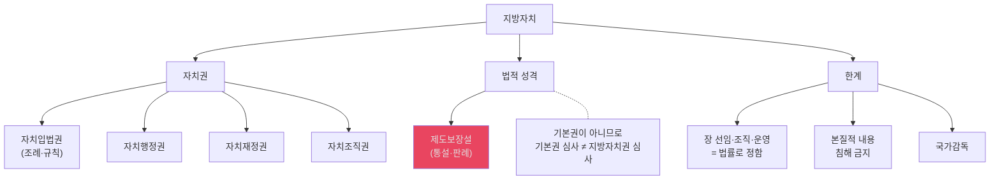

#### 📊 경제질서
| 항목 | 내용 | 조문 |
|---|---|---|
| **기본 원리** | 개인과 기업의 경제상의 자유와 창의를 존중하는 시장경제 질서 | §119① |
| **헌법적 성격** | 자유시장경제를 기초로 하되 규제·조정을 허용하는 사회적 시장경제질서 | §119①② |
| **조항의 지위** | §119는 경제질서에 관한 일반조항 | §119 |
| **직접 권리도출** | §119만으로 구체적 기본권이 바로 도출되지는 않음 | — |
| **재산권 제한** | 공공복리에 적합하게 행사하도록 제한 가능 | §23②③ |

#### 📊 지방자치·공무원제도 보강
| 항목 | 내용 |
|---|---|
| **지방자치의 헌법적 성격** | 국민주권에서 출발하는 `제도적 보장`이고, 본질적 내용 침해는 허용되지 않는다 |
| **법률사항** | 지방자치단체의 장 선임방법, 조직과 운영, 종류는 법률이 정한다 |
| **공무원의 범위** | 헌법 §7①의 공무원은 선출직·정무직까지 포함한 광의의 공무원이고, §7②의 공무원은 신분보장되는 경력직 공무원이다 |
| **지방자치단체장** | 선거로 취임하지만 정치적 중립성이 요구되는 공무원에 해당한다 |

- `OX 전사문 보강`: 지방자치는 기본권처럼 과잉금지원칙으로 재단하는 문제가 아니라 `제도보장 + 본질적 내용 보호` 문제이고, 공무원제도는 `공익실현의무`와 `정치적 중립성`을 함께 봐야 한다.
  - 근거 발췌: "지방자치제도의 헌법적 보장은"; "지방자치제도는 제도적 보장의 하나"; "지방자치단체의 장의 선임방법 ... 법률로 정한다"; "공무원은 국민전체에 대한 봉사자"; "헌법 제7조 제1항에서 규정한 공무원은 ... 광의의 공무원"; "지방자치단체장은 선거로 취임하는 공무원"
  - 근거 위치: [《ox_temp.txt》 L4655-4668 | "지방자치제도의 헌법적 보장은"] [《ox_temp.txt》 L4655-4668 | "지방자치제도는 제도적 보장의 하나"] [《ox_temp.txt》 L4677-4682 | "지방자치단체의 장의 선임방법 ... 법률로 정한다"] [《ox_temp.txt》 L4510-4521 | "공무원은 국민전체에 대한 봉사자"] [《ox_temp.txt》 L4510-4521 | "헌법 제7조 제1항에서 규정한 공무원은 ... 광의의 공무원"] [《ox_temp.txt》 L4510-4521 | "지방자치단체장은 선거로 취임하는 공무원"]

---

## 3. PPT 보강 핵심 (1~5주차)

### 📊 PPT 보강 내용 요약표
| 주차 | PPT 보강 내용 (§21~§25) | 핵심 쟁점 |
|---|---|---|
| **1주차** (§21) | 입헌주의, 사회계약설, 법원, 해석론 | 헌법 해석 방법 4가지 |
| **2주차** (§22) | 헌정사, 개정한계, 영토·통일, 국가긴급권 | 개정한계설 vs 무한계설 |
| **3주차** (§23) | 국민주권, 대의제, 선거원칙, 선거제도 | 보통·평등·직접·비밀 |
| **4주차** (§24) | 선거운동, 정당제도, 당내민주주의 | 30개 이상 판례 포함 |
| **5주차** (§25) | 위임입법, 포괄위임금지, 명확성 디테일 | 포괄위임금지 vs 의회유보 |

#### 📊 헌법 개정 한계 학설
| 학설 | 내용 | 비고 |
|---|---|---|
| **개정한계설 (다수설)** | 헌법의 근본규범(인간존엄, 민주주의 등)은 개정 불가 | 자연법적 한계 |
| **개정무한계설** | 헌법 제·개정권자는 어떤 내용이든 개정 가능 | 법실증주의 |

- 출처 위치: [《헌법의_기초이론_1_이진_강성민_OX_공부범위_정리.md》 L492-L496 | "### 22-2. 헌법 개정의 한계"] [《헌법의_기초이론_1_이진_강성민_OX_공부범위_정리.md》 L492-L496 | "개정한계설(통설)"] [《헌법의_기초이론_1_이진_강성민_OX_공부범위_정리.md》 L492-L496 | "개정무한계설"] [《2주 헌법기초이론 헌법사 헌법개정 (게시용) (1).pptx》 slide24-26]
- `PPT 보강`: 원PPT는 `긍정론/부정론`만이 아니라, `절차적 한계`와 `내용적 한계`를 분리해 정리하고, 내재적 한계의 예시로 `인간의 존엄성 보장과 자유민주적 기본질서의 핵심적 내용`을 든다.
  - 근거 발췌: "절차적 한계"; "내용적 한계"; "인간의 존엄성 보장과 자유민주적 기본질서의 핵심적 내용"
  - 근거 위치: [《2주 헌법기초이론 헌법사 헌법개정 (게시용) (1).pptx》 slide32 | "한계 긍정론"] [《2주 헌법기초이론 헌법사 헌법개정 (게시용) (1).pptx》 slide33 | "한계 부정론"] [《2주 헌법기초이론 헌법사 헌법개정 (게시용) (1).pptx》 slide34 | "절차적 한계"] [《2주 헌법기초이론 헌법사 헌법개정 (게시용) (1).pptx》 slide34 | "내용적 한계"] [《2주 헌법기초이론 헌법사 헌법개정 (게시용) (1).pptx》 slide34 | "인간의 존엄성 보장과 자유민주적 기본질서의 핵심적 내용"]
- `PPT 보강`: 헌법 제128조 제2항은 `개정한계조항`이라기보다 `인적 효력의 범위 제한`으로 본다는 점도 원PPT에서 따로 강조된다.
  - 근거 발췌: "헌법개정 한계조항이 아님"; "인적 효력의 범위 제한에 불과"
  - 근거 위치: [《2주 헌법기초이론 헌법사 헌법개정 (게시용) (1).pptx》 slide35 | "헌법개정 한계조항이 아님"] [《2주 헌법기초이론 헌법사 헌법개정 (게시용) (1).pptx》 slide35 | "인적 효력의 범위 제한에 불과"]

#### 📊 포괄위임금지원칙 (§75)
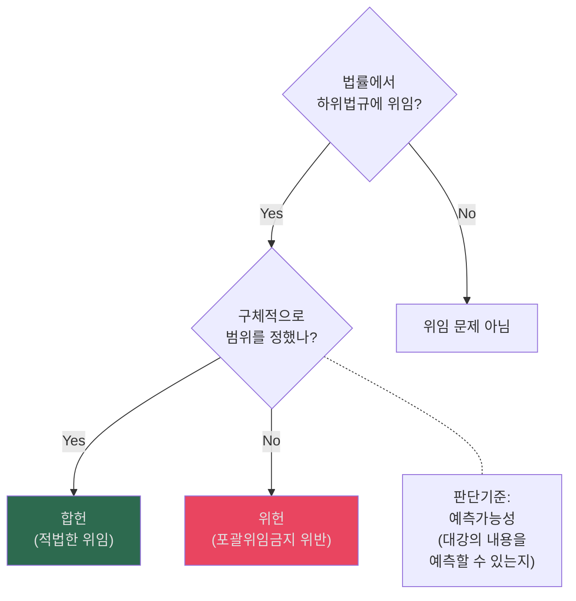

### 📊 포괄위임금지와 조례위임
| 항목 | 정리 |
|---|---|
| **원칙** | 법규명령 위임에서는 구체성·명확성 요구 |
| **조례위임** | 조례 위임에는 포괄위임금지가 그대로 적용되지 않는다는 선지가 자주 나옴 |
| **객관식 포인트** | 법규명령 위임과 조례 위임을 같은 잣대로 쓰면 오답 위험 |

- `[OX 정리]` 조례 위임에는 포괄위임금지가 적용되지 않는다는 선지가 반복된다.
  - 근거 발췌: "조례 위임에는 포괄위임금지가 적용되지 않는다는"
  - 근거 위치: [《헌법의_기초이론_1_이진_강성민_OX_공부범위_정리.md》 L695 | "조례 위임에는 포괄위임금지가 적용되지 않는다는"]

---

## 4. 학교기출 OX (§26 보강)

### 📊 학교기출 OX 주요 문항 패턴
| 유형 | 예시 | 정답 방향 |
|---|---|---|
| 헌법 해석 | "합헌적 법률해석은 헌법재판소만 할 수 있다" | ✗ (법원도 가능) |
| 관습헌법 | "관습헌법도 성문헌법과 동일한 효력" | ○ |
| 개정한계 | "헌법개정에는 한계가 없다" | ✗ (다수설: 한계 있음) |
| 법률유보 | "모든 국가작용에 법률의 근거가 필요하다" | ✗ (전부유보설 소수) |
| 비례원칙 | "4단계를 모두 통과해야 합헌" | ○ |

---

## 5. 종합 비교표

### 📊 헌1 주요 원리 비교
| 원리 | 핵심 내용 | 조문 | 판례 |
|---|---|---|---|
| **국민주권** | 모든 권력은 국민으로부터 | §1② | 2004헌나1 (탄핵) |
| **대의제** | 선출된 대표자에 의한 국정 | §40, §46 | — |
| **법치주의** | 법에 의한 통치 + 기본권 보장 | 전체 | 다수 |
| **비례원칙** | 과잉금지 4단계 | — (원리) | 다수 |
| **사회국가** | 실질적 평등·사회보장 | §34, §119② | 기초생활 |
| **지방자치** | 주민자치·단체자치 | §117, §118 | 제도보장 |
| **정당제도** | 복수정당·당내민주주의 | §8 | 2013헌다1 |

### 📊 기본원리 상호관계 다이어그램
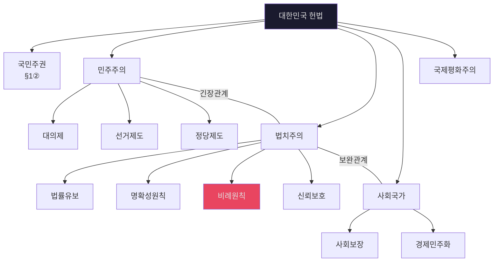

---

## 6. 전체 흐름 다이어그램

### 📊 헌1 중간 학습 순서
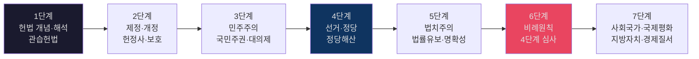

---

## 7. [사례형 IRAC] 헌법소송 빈출 쟁점

### 📝 위헌정당해산심판 요건과 절차 (통합진보당 해산 사건)
- 출처 위치: [《헌법의_기초이론_1_통합노트.md》 §3.5 | "정당의 목적이나 활동이 민주적 기본질서에 위배되어 강제해산"] [《헌법의_기초이론_1_통합노트.md》 §6.4 | "정당해산심판에서 민사소송법 명문 준용 조항이 없어도 절차창설이 가능하며, 해당 정당의 해산 여부는 비례원칙(최후수단성 등)을 고려해 엄격히 판단해야 한다"]
- `PPT 보강`: 원PPT는 `민주적 기본질서`를 다원적 세계관, 폭력·자의적 지배의 배제, 자유·평등과 민주적 의사결정의 질서로 좁게 이해해야 한다고 정리하고, `실질적 해악을 끼칠 수 있는 구체적 위험성`이 있어야 위배가 된다고 적는다.
  - 근거 발췌: "다원적 세계관에 입각"; "모든 폭력적․자의적 지배를 배제"; "실질적인 해악을 끼칠 수 있는 구체적 위험성"
  - 근거 위치: [《4주 헌법기초이론 (게시용) (1).pptx》 slide70 | "다원적 세계관에 입각"] [《4주 헌법기초이론 (게시용) (1).pptx》 slide70 | "모든 폭력적․자의적 지배를 배제"] [《4주 헌법기초이론 (게시용) (1).pptx》 slide70 | "실질적인 해악을 끼칠 수 있는 구체적 위험성"]
- `PPT 보강`: 비례원칙 부분도 원PPT는 `다른 대안적 수단이 없고`, `해산으로 얻는 사회적 이익이 정당활동 자유 제한과 민주주의에 대한 사회적 불이익을 초과할 정도`여야만 정당화된다고 정리한다.
  - 근거 발췌: "다른 대안적 수단이 없고"; "사회적 이익이 정당해산결정으로 인해 초래되는 정당활동 자유 제한"; "초과할 수 있을 정도로 큰 경우"
  - 근거 위치: [《4주 헌법기초이론 (게시용) (1).pptx》 slide71 | "다른 대안적 수단이 없고"] [《4주 헌법기초이론 (게시용) (1).pptx》 slide71 | "사회적 이익이 정당해산결정으로 인해 초래되는 정당활동 자유 제한"] [《4주 헌법기초이론 (게시용) (1).pptx》 slide71 | "초과할 수 있을 정도로 큰 경우"]
- `PPT 보강`: 효력 단계에서는 `창설적 효력`, `정당 등록 말소는 사후적 행정조치`, `잔여재산 국고귀속`, `대체정당 창설금지`까지 한 세트로 묶어 두는 것이 원PPT 구조와 맞다.
  - 근거 발췌: "창설적 효력"; "정당 등록 말소 및 공고는 사후적 행정조치에 불과"; "잔여재산은 국고에 귀속"; "대체정당의 창설이 금지된다"
  - 근거 위치: [《4주 헌법기초이론 (게시용) (1).pptx》 slide72 | "창설적 효력"] [《4주 헌법기초이론 (게시용) (1).pptx》 slide72 | "정당 등록 말소 및 공고는 사후적 행정조치에 불과"] [《4주 헌법기초이론 (게시용) (1).pptx》 slide72 | "잔여재산은 국고에 귀속"] [《4주 헌법기초이론 (게시용) (1).pptx》 slide72 | "대체정당의 창설이 금지된다"]
**사례 개요**: A정당 소속 국회의원들이 국가 변란을 기획하는 모임을 가졌고, 당의 강령이 자유민주적 기본질서에 위배된다는 혐의로 정부가 헌법재판소에 정당해산심판을 청구함.

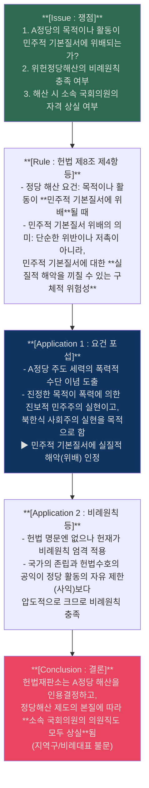

### 📝 평등원칙 위헌심사기준 적용 사례
**사례 개요**: 국가가 국가유공자 등에게 공무원 채용시험에서 가산점을 부여하는 법률(제대군인 가산점, 국가유공자 가산점 등)이 일반 국민(또는 여성/장애인)의 공무담임권 및 평등권을 침해하는가?

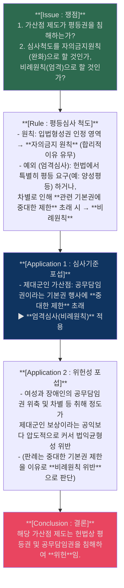

## 8. [보강] 객관식 개념 카드

### 📊 선거 원칙 객관식 포인트
| 원칙 | 빠른 정의 | 함정 포인트 |
|---|---|---|
| **보통선거** | 일정 연령 이상 모든 국민에게 선거권 부여 | 재산·신분 기준 제한과 구별 |
| **평등선거** | 1인 1표, 표의 가치가 실질적으로 균등 | 인구편차 문제와 연결 |
| **직접선거** | 중간선거인 개입 없이 직접 대표자 선출 | `1인1표제`와 섞어서 출제 |
| **비밀선거** | 투표내용 비공개 보장 | 공개투표·감시 장치와 연결 |

- `[PPT 정리]` 직접선거는 중간선거인의 개입이 없는 직접 선택을 뜻하고, 1인1표제가 직접선거를 침해하는지 따로 묻는 선지가 자주 나온다.
  - 근거 발췌: "중간선거인의 개입 없이"; "직접선거원칙에 위배"
  - 근거 위치: [《3주 헌법기초이론 (게시용)-1 (1).pptx》 slide44 | "중간선거인의 개입 없이"] [《3주 헌법기초이론 (게시용)-1 (1).pptx》 slide44 | "직접선거원칙에 위배"]

### 📊 법률유보 vs 의회유보 추가 암기카드
| 항목 | 법률유보 | 의회유보 |
|---|---|---|
| **핵심 질문** | 국가작용에 법률상 근거가 있는가 | 본질적 사항을 입법자가 직접 결정했는가 |
| **심사 포인트** | 근거유보 | 내용유보 |
| **객관식 함정** | 둘을 같은 말로 섞어서 출제 | 본질적 사항 위임 여부를 묻는 선지 |

- `[OX 정리]` 법률유보는 국가작용의 법률상 근거 문제이고, 의회유보는 본질적 사항을 입법자가 스스로 정했는지의 문제다.
  - 근거 발췌: "법률에 근거한 규율"; "입법자가 법률로써 스스로 결정"
  - 근거 위치: [《헌법의_기초이론_1_이진_강성민_OX_공부범위_정리.md》 L150-L151 | "법률에 근거한 규율"] [《헌법의_기초이론_1_이진_강성민_OX_공부범위_정리.md》 L150-L151 | "입법자가 법률로써 스스로 결정"]

### 📊 명확성원칙 추가 카드
| 항목 | 정리 |
|---|---|
| **원칙의 성격** | 법치국가원리의 한 표현 |
| **심사 강도** | 부담적 규정일수록 엄격 |
| **판단 방식** | 문언만이 아니라 목적·연혁·체계·판례를 종합 |

- `[OX 정리]` 명확성원칙은 법치국가원리의 한 표현이고, 부담적 성격이 강할수록 더 엄격하게 심사한다.
  - 근거 발췌: "법치국가원리의 한 표현"; "더욱 엄격"
  - 근거 위치: [《헌법의_기초이론_1_이진_강성민_OX_공부범위_정리.md》 L119-L120 | "법치국가원리의 한 표현"] [《헌법의_기초이론_1_이진_강성민_OX_공부범위_정리.md》 L119-L120 | "더욱 엄격"]

### 📊 비례원칙·지방자치권 포인트
| 쟁점 | 정리 | 객관식 포인트 |
|---|---|---|
| **비례원칙** | 목적의 정당성, 수단의 적합성, 침해의 최소성, 법익균형성 | 4단계 순서를 바꾸는 선지 주의 |
| **지방자치권 제한** | 본질적 내용 침해 여부를 중심으로 봄 | 과잉금지원칙·평등원칙을 바로 적용한다고 쓰면 틀리기 쉬움 |

- `[OX 정리]` 지방자치권 제한 문제는 본질적 내용 침해 여부를 중심으로 보고, 과잉금지원칙이나 평등원칙을 곧바로 적용할 것은 아니라는 정리가 나온다.
  - 근거 발췌: "본질적인 내용을 침해"; "과잉금지원칙이나 평등원칙 등을 적용할 것은 아니다"
  - 근거 위치: [《헌법의_기초이론_1_이진_강성민_OX_공부범위_정리.md》 L153-L154 | "본질적인 내용을 침해"] [《헌법의_기초이론_1_이진_강성민_OX_공부범위_정리.md》 L153-L154 | "과잉금지원칙이나 평등원칙 등을 적용할 것은 아니다"]

---

## 📊 헌법 주요 숫자 종합표

> 통치구조 전반의 임기·정족수·기간을 한곳에 모음. 객관식 함정선지 대비용.

### (1) 임기

| 직위 | 임기 | 연임·중임 | 조문 | 함정 포인트 |
|------|------|-----------|------|-------------|
| **대통령** | **5년** | 중임 불가 | §70 | "4년" "6년" "7년 단임(제8차)" 혼동 |
| **국회의원** | **4년** | 제한 없음 | §42 | — |
| **국회의장** | **2년** | — | 국회법 §9① | 총선 후 선출된 의장 기준. 보궐 당선 의장 = 전임자 잔임기간 |
| **대법원장** | **6년** | 연임 불가 | §105② | "중임"이 아니라 "연임" 불가 |
| **대법관** | **6년** | 연임 가능 | §105③ | 대법원장과 달리 연임 가능 |
| **헌재소장** | **6년** | 중임 불가 | §112① | — |
| **헌재재판관** | **6년** | 연임 가능 | §112① | 헌재소장과 달리 연임 가능 |
| **감사원장** | **4년** | **1차** 중임 | §98② | "연임"이 아니라 "중임", "1차"만 |
| **감사위원** | **4년** | **1차** 중임 | §98③ | 원장과 동일 |
| **중앙선관위원** | **6년** | — | §114③ | — |
| **구·시·군 선관위원** | **3년** | **1회** 연임 | 선관위법 | 중앙(6년)과 구별 |

### (2) 정족수 — 국회

| 사항 | 발의·요구 | 의결 | 함정 포인트 |
|------|-----------|------|-------------|
| **의사정족수** | — | 재적 **1/3** 이상 출석 | "과반수 출석"이 아님 |
| **일반 의결** | — | 재적과반 출석 + 출석과반 찬성 | 가장 기본 |
| **헌법개정안 의결** | 대통령 또는 재적과반 제안 | 재적 **2/3** 이상 찬성 | §130① |
| **국회의장 선출** | — | 재적과반 **무기명투표** | "출석과반" (X) → 재적과반 |
| **탄핵소추 (일반)** | 재적 **1/3** 발의 | 재적 **과반수** 찬성 | — |
| **탄핵소추 (대통령)** | 재적 **과반수** 발의 | 재적 **2/3** 찬성 | 발의도 과반수 (일반: 1/3) |
| **국회의원 제명** | — | 재적 **2/3** 찬성 | — |
| **법률안 재의결** | — | 재적과반 출석 + 출석 **2/3** 찬성 | §53⑤. "재적 2/3"이 아님 |
| **계엄 해제 요구** | — | 재적 **과반수** 찬성 | §77⑤ |
| **신속처리안건 지정 (의장)** | 재적 **과반수** 서명 | 재적 **3/5** 찬성(무기명) | 서명 + 투표 2단계 |
| **신속처리안건 지정 (위원장)** | 소관위 재적위원 **과반수** 서명 | 소관위 재적위원 **3/5** 찬성(무기명) | 위원회 단위 |
| **무제한토론 요구** | 재적 **1/3** 서명 | — | — |
| **무제한토론 종결** | — | 재적 **3/5** 찬성 | — |
| **의원 석방 요구** | 재적 **1/4** 연서 | — | §44② |

### (3) 정족수 — 대통령·헌재·기타

| 사항 | 정족수 | 함정 포인트 |
|------|--------|-------------|
| **대통령 당선** | 최고득표자. 동수 시 → 국회에서 재적과반 출석 + **다수표** | §67② |
| **국무회의 의결** | 구성원 **과반수** 출석 + 출석 **과반수** 찬성 | 헌법상 명문 규정 없음(관행) |
| **감사원 의결** | 재적 감사위원 **과반수** 찬성 | "2/3" (X) |
| **헌재 위헌 결정** | 재판관 **6인** 이상 찬성 | §113① |
| **헌재 탄핵 결정** | 재판관 **6인** 이상 찬성 | — |
| **헌재 정당해산 결정** | 재판관 **6인** 이상 찬성 | — |
| **헌재 권한쟁의 인용** | 재판관 **6인** 이상 찬성 | — |

### (4) 주요 기간

| 사항 | 기간 | 조문 | 함정 포인트 |
|------|------|------|-------------|
| **대통령 후임선거 (임기만료)** | 임기만료 **70~40일** 전 | §68① | — |
| **대통령 후임선거 (궐위)** | **60일** 이내 | §68② | — |
| **법률안 공포** | 이송 후 **15일** 이내 | §53① | — |
| **법률안 재의 요구** | 이송 후 **15일** 이내 | §53② | 공포 기간과 동일 |
| **법률안 재의결 후 공포** | **5일** 이내 | §53⑥ | 일반 공포(15일)와 구별 |
| **헌법개정안 공고** | **20일** 이상 | §129② | — |
| **헌법개정 국민투표** | 공고 후 **30일 이후 60일 이내** | — | — |
| **국회 임시회 집회기간** | **30일** 이내 | §47② | — |
| **국회 정기회 집회기간** | **100일** 이내 | §47① | — |
| **임시회 집회 요구** | 재적 **1/4** 이상 | §47① | — |
| **긴급명령·긴급재정경제처분 국회 승인** | 지체 없이 국회에 보고 → 승인 | §76 | — |
| **계엄선포 국회 통고** | **즉시** | §77④ | — |
| **헌재 심판 청구 기간 (헌법소원)** | 사유 안 날로부터 **90일**, 있은 날로부터 **1년** | 헌재법 §69① | — |

- `회독 포인트`: **6인**은 헌재 모든 결정에 동일. **2/3**은 헌법개정·탄핵(대통령)·제명·재의결. **3/5**은 신속처리안건·무제한토론 종결. **1/3**은 의사정족수·탄핵발의(일반)·무제한토론 요구. **1/4**은 석방요구·임시회 요구.
