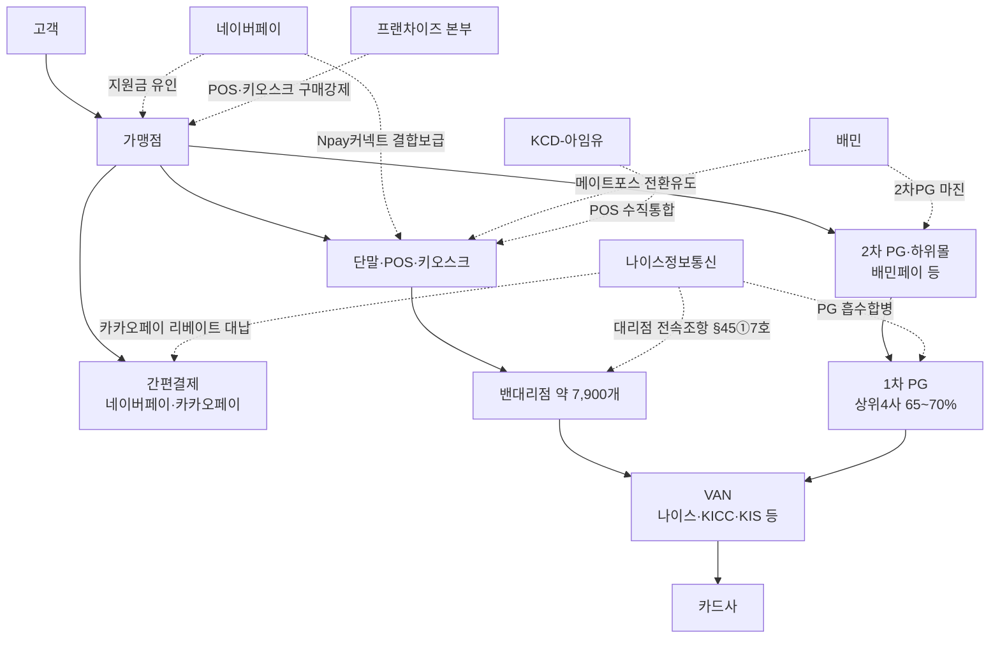

# [I] 결제스택 중간단계 통합 전수조사 — 공정거래법 조·호 매핑 (BC·토스 외)

> 작성: 2026-07-02 | 조사: Sonnet 에이전트 6개(검색 5+종합 1, #45-D bounded) / 업무분배·검토: Fable
> **범위**: 금융위·금감원·여전법·전금법 이슈 **배제** — 오직 공정거래법(§5·§45 등). BC카드(직승인·거래중계)·토스(무상단말·끼워팔기)는 기존 조사 완료분 — 본 파일은 **그 외 사업자** 전수.
> 관련 파일: 포섭매트릭스(`모의공정거래_I_공정거래법포섭매트릭스_2026-06-29.md`) · 시장구조도(`모의공정거래_I_시장구조도_BC카드VAN_2026-06-29.md`) · 원시데이터(워크플로 출력 `wosb2dnzg.output`, 사실 22건 전문)

---

## 1. 결제스택 계층 구조와 통합 현황

현행 체인: **고객 → (밴)대리점 → PG → VAN → 카드사** (+ 접점 계층: 단말·POS·키오스크, 간편결제)

| 계층 | 독립 사업자 | 통합·잠식 주체와 방식 |
|---|---|---|
| 카드사 | 회원 카드사·은행 | (BC그룹 — 기존 조사) |
| VAN | KIS·KSNET·다우데이타·코밴 등 | **나이스정보통신**(VAN 1위, PG 흡수합병)·**NHN KCP**(PG+VAN 겸영)·KICC(대형가맹점 직영화) |
| PG(1차) | 등록 PG 154개사 중 중소 PG | **상위 4사(KG이니시스·NHN KCP·토스페이먼츠·나이스페이먼츠) 약 65~70% 과점** |
| PG(2차)·하위몰 | 다수 소규모 2차 PG | **배민페이**(플랫폼+2차 PG, 도매-소매 요율차 마진) / 티몬·위메프(플랫폼 PG 겸영 → 정산유용) / 미등록 PG(7~9% 고율) |
| (밴)대리점 | 전국 약 7,900개 | **VAN 13개사**가 전속조항·과중 위약금으로 이전 봉쇄(2024.3.31 공정위 시정) / KICC 이원화(대형 직영·소형 위탁) |
| 단말·POS·키오스크 | OKPOS·포스뱅크 등 | **네이버페이**(Npay 커넥트: 전 결제방식+지도·예약·리뷰 결합, 2025.11 정식출시)·**KCD-아임유**(POS 인수 수직통합)·배민(메이트포스 전환 유도)·페이히어(무료 POS 앱)·프랜차이즈 본부(구매강제) |
| 간편결제 | 삼성월렛 등 | 네이버페이(오프라인 확장) / **카카오페이 = 대조군**(단말 미진출 선언, VAN·POS 8개사 QR오더 얼라이언스 협력 — 2025.11.4) |

## 2. 행위별 공정거래법 조·호 매핑 (강도순)

> 강도: 강 > 중 > 약 > 검토만. 네이버 파기환송(2023두32709 — 자사우대·결합 자체는 위법 아님, 효과입증 필수) 반영해 보수적으로 산정.

| #   | 주체                                      | 문제행위                                                                            | 1순위 조항                    | 보충                                                         | 강도    | 핵심 논거·한계                                                                                                                 |
| --- | --------------------------------------- | ------------------------------------------------------------------------------- | ------------------------- | ---------------------------------------------------------- | ----- | ------------------------------------------------------------------------------------------------------------------------ |
| 1   | **VAN 13개사**(나이스·KICC·KIS·스마트로·KSNET 등) | 대리점 계약서에 **경쟁 VAN 거래금지 전속조항·과중 위약금**(해지 시 지원금 전액반환+잔여기간 수수료) → 대리점 이전 봉쇄        | **§45①7호 구속조건부거래(배타조건부)** | §45①6호 거래상지위 남용·8호 사업활동방해                                  | **강** | 공정위가 사실관계 확인(2024.3.31, 7,900개 대리점). ⚠️단 실제 처분은 **약관규제법상 불공정약관 시정** — §45 처분 아님. 동일 사실관계의 공정거래법 포섭 여지가 '강'인 것(Fable 재분류) |
| 2   | **나이스정보통신**(VAN 1위)                     | **카카오페이 가맹점 모집대행비를 밴대리점에 대납**(건당 4~7만원, 연 수십억) → 대형 간편결제를 자사 승인망에 유지(우회 리베이트)   | **§45①7호 배타조건부거래**        | §45①4호 부당고객유인·9호 부당지원(검토만)                                 | **중** | 퀄컴(2013두14726) 조건부 리베이트=배타조건부 법리 정합. 단 현재 형사수사(2023.7 압수수색→11 송치) 단계, 경쟁 VAN 봉쇄효과 정량입증 부재                                |
| 3   | 네이버페이                                   | **Npay 커넥트**: 결제 전 방식+지도·스마트플레이스(예약·주문·적립·리뷰) 결합 단말 보급                          | §45①5호 거래강제(끼워팔기)         | §5①4호·§45①7호                                               | 약     | 기존 POS 교체 없이 병행설치 가능 = 배타성 낮음. 파기환송 법리상 결합 자체는 적법, 구속조건·효과입증 없으면 곤란                                                      |
| 4   | 네이버페이                                   | 하나은행 제휴 **단말 도입 지원금**(계좌등록 시 3만원)                                               | §45①4호 부당고객유인             | §5①4호(검토만)                                                 | 약     | 소액·통상 판촉 범위 — 부당성(정상 거래관행 이탈) 입증 곤란                                                                                      |
| 5   | 배민(우아한형제들)                              | **배민페이 2차 PG 구조**: 자체 PG 등록+외부 1차 PG 의존, 카드사 대비 최대 6배 수수료(1.52~3% vs 0.5~2.07%) | §45①6호 거래상지위 남용           | §5①1호(검토만)                                                 | 약     | 플랫폼 필수 결제수단의 우월적 지위 vs 다단계 원가(1차 PG 전달수수료) 항변 — 대체 결제수단 선택 가능성 확인 필요                                                     |
| 6   | 배민(배민오더)                                | 타 POS 매장에 **메이트포스 전환 유도**(연동 불가 시)                                              | §45①5호 거래강제               | §45①8호(검토만)                                                | 검토만   | '제안' 수준 — 강제성·연동거부의 인위성 사실관계 미확보                                                                                         |
| 7   | 네이버페이                                   | 영세판매자 수수료 **전액 환급**(상생금융, 2026.4)                                               | §45①3호 부당염매               | §5①1호(검토만)                                                 | 검토만   | 한시·정책목적·소비자후생 — 배제의도 입증 곤란(포스코 기준)                                                                                       |
| 8   | 네이버페이                                   | 스마트스토어 **규모별 차등 수수료**(2~3.3%)                                                   | §45①2호 차별취급               | —                                                          | 검토만   | 원가·리스크 반영한 합리적 차별 — 파기환송 법리상 단독 성립 곤란                                                                                    |
| 9   | 1차 PG 업계                                | 2차 PG에 도매요율 → 하위몰 소매요율 **재판매 마진 적층**                                            | §45①10호(기타)               | 지배력 있는 1차 PG의 요율 구속 시 **§46 재판매가격유지**(Fable 교정: §45①7호 아님) | 검토만   | 일반 유통관행 — 구속 사실관계 확인돼야 상승                                                                                                |
| 10  | 티몬·위메프                                  | 플랫폼 PG 겸영 + 정산금 유용                                                              | §45①6호(불이익제공)             | §45①1호(검토만)                                                | 검토만   | 본질은 형사·전자상거래법 — 공정거래법 매핑 실익 낮음. 단 '플랫폼 PG 겸영 구조 리스크'는 심결서 배경사실로 유용                                                       |
| 11  | 프랜차이즈 본부(예: 핫시즈너)                       | 가맹점에 **POS·키오스크·DID 지정업체 구매강제**(위반 시 공급제한·해지·위약벌)                               | §45①5호 거래강제               | §45①7호                                                     | 검토만※  | 공정위 시정 기성립이나 **가맹사업법 적용** 사건 — 공정거래법 §45 법리상 전형적 포섭 대상(참고용)                                                              |
| 12  | KCD-아임유 / KG이니시스 계열화 / 나이스 VAN+PG 합병    | POS·결제·데이터 **수직 계열화**                                                           | (§9 기업결합 — 본 매핑 범위 외)     | 결합 후 통행세 발생 시 §45①9호나                                      | 검토만   | 결합 자체는 §9 심사 영역. 사후 남용 정황 미확인                                                                                            |
| 13  | 카카오페이                                   | 단말 미진출 선언+QR오더 얼라이언스(VAN·POS 8사 협력)                                             | **해당없음**                  | —                                                          | —     | **대조군**: 봉쇄 아닌 협력 확장 — 피심인측 "우리도 협력 가능했다" 반박 소재이자, 심결위측 "봉쇄 없는 대안 존재" 입증 소재(양쪽 활용 가능)                                    |

## 3. Fable 검토 노트 (Sonnet 초안 교정 2건 + 종합평가)

1. **약관법-공정거래법 구분(교정)**: #1 VAN 13개사 건의 Sonnet 초안은 "공정위 시정 기성립 = §45①7호 강"으로 처리했으나, 2024.3.31 처분은 **약관규제법상 불공정약관 시정**이다. '강'의 근거는 처분 전례가 아니라 **공정위가 확인한 사실관계의 확정성 + §45①7호 포섭 적합성**으로 정정. 모의 심결서에서는 "약관 시정에 그친 사안을 §45(불공정거래행위)로 정면 의율"하는 구성이 오히려 변별 포인트.
2. **§46 정정(교정)**: 1차 PG의 재판매 요율 구속 가정 시 정조준 조항은 §45①7호가 아니라 **§46(재판매가격유지행위)** — 용역 대가의 재판매가격 구속.
3. **종합평가**: BC·토스 제외 시 가장 단단한 두 건은 **①VAN 대리점 전속조항(§45①7호, 사실관계 공정위 확인)**과 **②나이스-카카오페이 우회 리베이트(§45①7호, 퀄컴 법리 정합)**. 나머지 네이버페이·배민 등 플랫폼 통합형은 네이버 파기환송 이후 효과입증 장벽으로 약~검토만. **모의사건 각색 재료로는 #1+#2를 DC카드 행위목록에 추가(대리점 전속조항+타사 리베이트 대납)하면 하방(대리점) 봉쇄까지 3면 봉쇄가 완성**된다.

## 4. 구조도

> SVG(계층×통합주체 스팬 매트릭스)는 채팅 인라인 렌더(제목: payment_stack_integration_matrix). BC·토스 포함 전체 협공 구도는 기존 시장구조도 파일 참조.

## 5. 검증 상태·한계

| 항목 | 검증 |
|---|---|
| 공정거래법 §5·§45·§46 조문 | ✓ 1차(law_api, 시행 2026-05-12) |
| 네이버(2023두32709)·퀄컴(2013두14726)·포스코(2002두8626) | ✓ 1차(law_api) |
| VAN 13개사 약관 시정(2024.3.31) | ○ 다출처(경향 등) — 공정위 보도자료 원문 확인 권장 |
| 나이스-카카오페이 리베이트 대납(2023 수사) | ○ 다출처 — 형사 결과(기소·판결) 미확인 |
| Npay 커넥트(2025.9 베타→11 출시)·하나은행 지원금 | ○ 다출처 |
| 배민페이 2차 PG·6배 수수료(2023.4) | △ 준다출처(2020·2023 보도) |
| PG 상위4사 65~70% 과점 | △ 산정기준(거래액/매출액) 불명 |
| 핫시즈너 시정(가맹사업법)·KCD-아임유·페이히어 | △ 단일출처 |

**한계**: ①수집사실 다수가 '전략·제휴·구조' 수준 — 점유율 변동·배제효과 등 **정량 효과입증 자료 부재**(강도 보수 산정의 이유). ②간편결제·PG 각 시장의 시장지배적사업자 지위 자체가 미입증 — §5 적용은 전부 지배력 입증 선행 필요. ③미등록 PG 고율수수료는 사업자 특정 불가로 매핑 제외.
