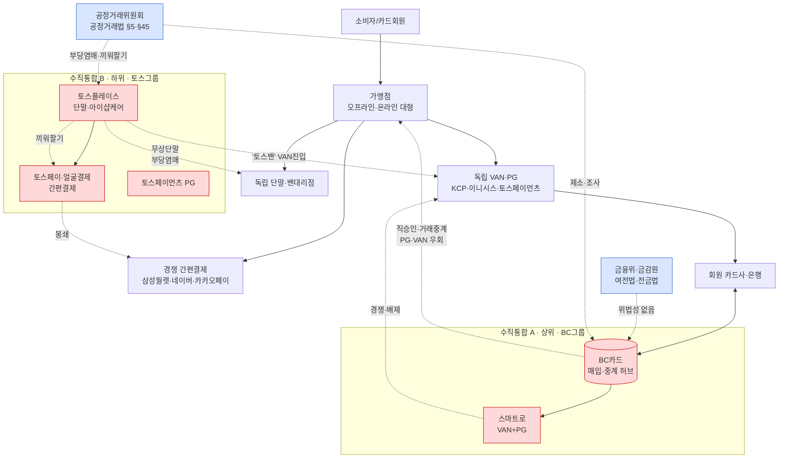

# [I] 시장구조도 — 한국 결제 생태계 (카드·VAN·PG·단말·간편결제 수직통합 봉쇄)

> 작성: 2026-06-29 (2026-06-29 토스형 단말·간편결제 노드 반영 갱신) | 본체: `모의공정거래_I확장_BC카드VAN_리베이트_포섭_2026-06-29.md`
> 용도: 모의공정거래 후보 [I] 심결서·발표용 시장구조 도식. 행위자(노드)·관계(엣지)·봉쇄지점·이중규제축.
> ★ 갱신 요지: 결제 스택 **상위(카드사·VAN·PG)** 는 BC카드 그룹이, **하위(단말·간편결제)** 는 토스 그룹이 각각 수직통합·봉쇄 → **독립 VAN·PG·밴대리점을 위아래서 협공**. DC카드 심결서는 이 둘을 하나의 피심인으로 통합.

---

## 1. 행위자(노드)

| 계층 | 노드 | 비고 |
|---|---|---|
| 수요 | 소비자(카드회원) | |
| 가맹점 | 일반·중소 / 온라인 대형(쿠팡·배민·네이버) | |
| **간편결제(접점)** | 자사(토스페이·얼굴결제) / **경쟁**(삼성월렛·네이버페이·카카오페이) | 오프라인 결제 접점 |
| **오프라인 결제단말** | 자사(토스플레이스·토스프론트) / **독립 단말·밴대리점** | 아이샵케어=토스플레이스 단말유통 자회사 |
| 결제중계 | 독립 VAN·PG(KCP·이니시스·토스페이먼츠·한국정보통신 등) / 자사(스마트로·토스페이먼츠) | |
| 카드사 | 회원 카드사·은행 / **BC카드**(매입·중계 허브) | |
| **수직통합 A(상위)** | **BC카드 그룹**: BC카드+스마트로(VAN+PG) | KT 자회사 |
| **수직통합 B(하위)** | **토스 그룹(비바리퍼블리카)**: 토스페이먼츠(PG)+토스플레이스(단말)+토스페이·얼굴결제(간편결제)+토스뱅크 | |
| 규제 | 금융위·금감원 / 공정거래위원회 | 여전법·전금법 vs 공정거래법 |

## 2. 관계(엣지)

**상위 봉쇄 (BC카드 그룹)**
- BC카드 → 스마트로(자회사, VAN+PG 수직통합)
- BC카드 ⇢ 온라인 대형가맹점: 직승인·거래중계 → **PG·VAN 우회**(봉쇄)
- 스마트로/BC ⇢ 독립 PG·VAN: 경쟁·배제

**하위 봉쇄 (토스 그룹) — 신규**
- 토스플레이스(+아이샵케어) ⇢ 독립 단말·밴대리점: **무상·저가 단말 보급(부당염매)** → 배제
- 토스플레이스(단말) → 토스페이·얼굴결제: **끼워팔기**(단말을 지렛대로 자사 간편결제 탑재·유도)
- 토스페이·얼굴결제 ⇢ 경쟁 간편결제(삼성월렛·네이버페이·카카오페이): 봉쇄
- 토스 → VAN 진입('토스밴' 상표→법인분할): 기존 VAN·대리점 배제

**규제**
- 금융위·금감원 ⇢ 통합그룹(전금법·여전법: "직승인 위법성 없음" 입장)
- 공정위 ⇢ 통합그룹(공정거래법 §5·§45 / PG협회·한신협 반발)

## 3. 도식 (mermaid)

## 4. 범례·읽는 법

- **빨강(수직통합 지배 주체)**: 상위=BC카드+스마트로(카드사·VAN·PG), 하위=토스 그룹(단말·PG·간편결제).
- **파랑(규제기관)**: 금융위·금감원(여전법·전금법) ↔ 공정위(공정거래법).
- **점선(봉쇄 행위)**: ①직승인·거래중계 우회(상위) ②무상단말 부당염매(하위) ③끼워팔기(단말→자사 간편결제) ④경쟁 간편결제·VAN 배제.

**협공(pincer) 구조**: 스택 **상위**(카드사·VAN·PG)는 BC카드가 직승인·거래중계로, **하위**(단말·간편결제)는 토스가 무상단말·끼워팔기로 각각 봉쇄 → **독립 VAN·PG·밴대리점이 위아래서 협공**당함. DC카드 심결서(가상)는 이 두 패턴을 **하나의 수직통합 피심인**으로 통합(행위 1·4·5).

**이중 규제축(적용법 경계)**: **금융위(전금법·여전법) "직승인·거래중계 위법성 없음" ↔ 공정위(공정거래법) 제소·조사** — 규제기관·적용법 정면 충돌([E] 망사용료형 일반법-특별법 경계 난점). 무상단말·리베이트는 여전법 저촉 주장(한신협)도 병존하나 심결서는 공정거래법만 다룸.

**공정거래법 조항 매핑(하위 봉쇄)**: 무상단말=§45①3호 부당염매·4호 부당고객유인 / 끼워팔기=§45①5호 거래강제 / 계열 단말유통=§45①9호 부당지원·§5①3호 사업활동방해.

> SVG 시각 도식은 채팅에 인라인 렌더됨(제목: korea_card_van_pg_market_structure_bccard).
