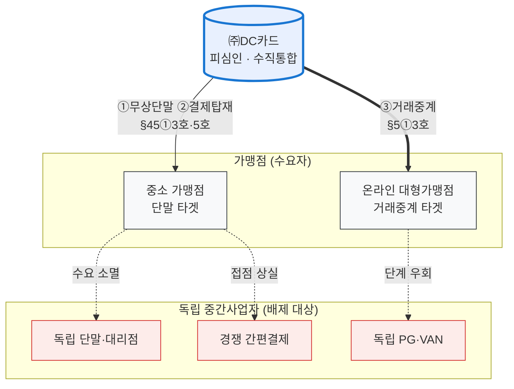

# [행위 시나리오] (주)DC카드 — 결제스택 이중 협공(pincer) 봉쇄

> 작성: 2026-07-02 | 형식: 코리안리 핸드오프 시나리오 스타일(사실관계도+행위+법조+항변) | 적용법: **공정거래법만**
> 소재: **BC카드(직승인·거래중계, 2024.11~ 실제 분쟁) + 토스(무상단말·끼워팔기, 2022~2025 실제 분쟁)** 를 **하나의 피심인·하나의 전략**으로 결합한 가상 시나리오. 개별 사실 출처·검증은 `모의공정거래_I확장_BC카드VAN_리베이트_포섭_2026-06-29.md`·`모의공정거래_I_공정거래법포섭매트릭스_2026-06-29.md` 참조.
> 연동: DC카드 심결서(`모의공정거래_심결서초안_DC카드_직불네트워크_2026-06-29.md`)의 행위 1(거래중계)·4(무상단말)·5(끼워팔기)를 **단일 시나리오 서사**로 재구성한 발표용 버전.

---

## 1. 시나리오 개요 — "아래에서 접점을 사고, 위에서 길목을 끊는다"

피심인 (주)DC카드는 **카드사(매입·중계 허브) + 자회사 VAN·PG + 결제단말(디씨플레이스) + 간편결제(디씨페이·얼굴결제)** 를 한 지배구조에 결합한 수직통합 사업자다. 피심인의 전략은 독립 중간사업자(PG·VAN·밴대리점·경쟁 간편결제)를 **아래(가맹점 접점)와 위(승인·정산 길목)에서 동시에** 제거하는 것으로, 세 단계가 하나의 폐쇄 루프를 이룬다.

| 단계 | 행위 | 실제 모티프 |
|---|---|---|
| **① 하방 침투** | 결제단말기 무상·저가 살포로 가맹점 접점 장악 | 토스플레이스·아이샵케어(20~30만원 단말 무료, 월 30건+ 시 비용지원) |
| **② 접점 전환** | 확보한 단말에 자사 간편결제·얼굴결제 탑재·유도(끼워팔기) | 토스 페이스페이 포석("향후 10년 먹거리") |
| **③ 상방 우회** | 단말·접점으로 확보한 대형가맹점에 직승인 거래중계 제공 → 독립 PG·VAN 단계 제거 | BC카드 거래중계서비스(쿠팡·배민·네이버 직승인) |

**루프의 완성**: ①이 ②의 배포망이 되고, ②로 잠근 가맹점이 ③의 고객이 되며, ③으로 절감한 중계마진이 다시 ①의 무상살포 재원이 된다. 개별 행위는 각각 "판촉"·"편의기능"·"효율화"로 항변 가능하지만, **전체로 보면 독립 중간사업자의 수익원(단말→간편결제→승인중계)을 순차 제거하는 단일한 봉쇄 설계**다.

## 2. 사실관계도

> **재원 순환 고리**(③ 거래중계 마진 → ① 무상단말 재원 — §1 '루프의 완성' 참조)는 도식에서 의도적으로 생략 — 역방향 엣지가 mermaid TB 배치를 뒤집기 때문(채팅 SVG 버전에는 포함).
> 도식 규칙: **TB(세로) 고정 — PDF(A4 세로) 변환 안전**. 주체 컬러 = `E:\design_md\DESIGN_Fact_PPT.md` 토큰(피심인=Blue, 배제 대상=Red, 중립=Gray). **mmdc 렌더 검증 완료(2026-07-03)**.

## 3. 행위 사실 (단계별)

**① 하방 침투 — 단말 무상살포**
피심인은 자회사 (주)디씨플레이스와 단말 유통 계열사를 통해 시가 20~30만원 상당의 결제단말기를 가맹점에 무상·저가로 보급하고, 설치비도 면제했다. 밴대리점이 정가로 단말을 구매하더라도 도입 가맹점의 월 결제건수가 30건을 넘으면 피심인이 단말 비용을 사후 보전해 주는 방식으로, 사실상 원가 이하 공급을 전 유통망에 확산시켰다. 독립 단말·밴대리점은 유상 판매로는 대응이 불가능해 신규 설치 수요를 상실했다.

**② 접점 전환 — 자사 간편결제 끼워팔기**
피심인 내부문서상 무상살포의 목적은 단말 사업 자체의 수익이 아니라 **자사 간편결제(디씨페이)·얼굴결제의 오프라인 확산 포석**이었다. 보급 단말에는 자사 결제수단이 기본 탑재·우선 노출되었고, 가맹점은 무상 단말의 대가로 자사 결제 수용을 사실상 요구받았다. 경쟁 간편결제는 오프라인 접점에서 밀려났다.

**③ 상방 우회 — 직승인 거래중계**
피심인은 단말·접점 장악으로 확보한 협상력을 바탕으로 온라인 대형가맹점에 "PG·VAN을 거치지 않는 직승인 거래중계서비스"를 제공했다. 가맹점-카드사 간 거래데이터 송수신을 피심인이 직접 중계하여 **독립 PG·VAN을 거래단계에서 제거**하고, 수수료율이 높은 우량 가맹점부터 선별 전환(cream-skimming)했다. 독립 PG·VAN은 저수익 가맹점만 남은 채 수익기반이 잠식되었다.

## 4. 위법성 판단

**가. 적용법조 (단계별 + 전체)**

| 단계 | 1순위 | 보충 |
|---|---|---|
| ① 무상살포 | **§45①3호(부당염매 — 경쟁자 배제)** | §45①4호(부당고객유인) |
| ② 끼워팔기 | **§45①5호(거래강제)** | §5①5호 |
| ③ 거래중계 | **§5①3호(사업활동 부당방해)** | §5①5호·§45①1호(거래거절)·8호 |
| **전체(일련의 행위)** | **§5①3호·5호 — 시장지배적지위 남용** | 개별 행위의 위법성과 별개로, 3단계를 하나의 배제 전략으로 포괄 의율 |

**나. 요건 검토 — '일련의 행위' 구성이 핵심**
- 부당성은 ①독점 유지·강화 의도와 ②객관적 경쟁제한효과 우려로 판단한다([[대판 2007.11.22, 2002두8626]] 포스코). 본 시나리오의 변별점은 **개별 행위가 아니라 3단계의 연결 자체가 의도·효과의 증거**라는 점이다: 단말 무상살포는 그 자체로는 판촉이지만, 내부문서상 목적(간편결제 확산 포석)과 후속 단계(거래중계 전환)에 비추면 **배제 설계의 1단계**로 평가된다.
- 무상살포의 부당염매 판단에는 원가 이하·지속성·배제의도 입증이 필요하나, ②·③단계와의 연결(무상 손실을 하류 독점 마진으로 회수하는 구조)이 입증되면 "합리적 사업자라면 단독으로는 하지 않을 손실 감수"로서 배제의도가 추단된다.
- 거래중계의 봉쇄효과는 리베이트·전환 전후 **독립 PG·VAN의 거래량·점유율의 선명한 하락**으로 일응 증명한다(대판 2019.1.31, 2013두14726 퀄컴 — 배타조건부 리베이트 입증구조. 동 판결이 RF칩 부분을 효과 입증부족으로 파기한 점을 반면교사로, 시계열 실증을 반드시 첨부).

**다. 피심인의 항변과 재반박**

| 항변 | 재반박 |
|---|---|
| ① 무상 단말은 통상적 판촉·투자 | 단발 판촉이 아닌 **표적적·지속적** 살포 + 내부문서상 목적이 단말 수익이 아닌 접점 장악 — 손실 회수 경로(②③)가 설계돼 있음 |
| ② 자사 결제 탑재는 편의기능, 동등대우 의무 없음(네이버 파기환송 원용 예상) | 본 건은 알고리즘 자사우대가 아니라 **무상 공급을 대가로 한 수용 강제**(거래강제) — 대판 2025.10.16, 2023두32709 의 사안과 행위유형이 다름을 정면 구별. 다만 강제성(대체 결제 배제 조건) 입증이 관건임을 자인하고 증거로 승부 |
| ③ 거래중계는 이중수수료 제거 = 효율화·소비자 후생 | 효율성 항변 심사: 우량 가맹점 선별(cream-skimming)·경쟁사 고사는 효율성으로 정당화되지 않으며, 효율 증대분이 경쟁제한 폐해를 상회함을 피심인이 소명해야 |
| ④ 각 행위는 별개 사업부의 독립 결정 | 단일 지배구조·재원 순환(③의 마진→①의 재원)·내부 전략문서로 **단일 전략성** 입증 |

## 5. 입증 핵심 (효과기반 심사 대비)

1. **내부문서**: 무상살포의 목적("간편결제 확산 포석")·3단계 연계 전략 기술 — 의도 입증의 축.
2. **시계열**: 무상살포·거래중계 개시 전후 독립 단말/PG/VAN의 신규설치·거래량·이익률 하락 + 경쟁 간편결제의 오프라인 점유율 변화.
3. **재원 순환**: 단말 부문 손실과 중계·간편결제 부문 마진의 내부 보전 구조(회계 자료).
4. **대조군**: 경쟁사(카카오페이형)는 단말 미진출·VAN/POS 협력(QR오더 얼라이언스)으로도 오프라인 확장에 성공 — "봉쇄 없는 대안이 존재했다"는 반사실(counterfactual) 입증.

## 6. 검증 상태

- 조문(§5·§45)·판례(2002두8626 포스코, 2013두14726 퀄컴, 2023두32709 네이버) — law_api 1차 검증 완료(기존 세션).
- 사실 모티프: BC 거래중계(다출처, 2024.11~2025.3)·토스 무상단말(다출처, 2022.10~2025.7)·카카오페이 대조군(2025.11.4) — 개별 검증표는 확장 파일 참조.
- ⚠️ 가상 결합 주의: 실제로는 BC(상방)와 토스(하방)가 **별개 사업자**의 행위 — 단일 피심인 결합은 가상 각색이며, 발표 시 "실제 시장에서 두 패턴이 각각 관찰됨"을 밝히는 것이 사실관계 신뢰도에 유리.
