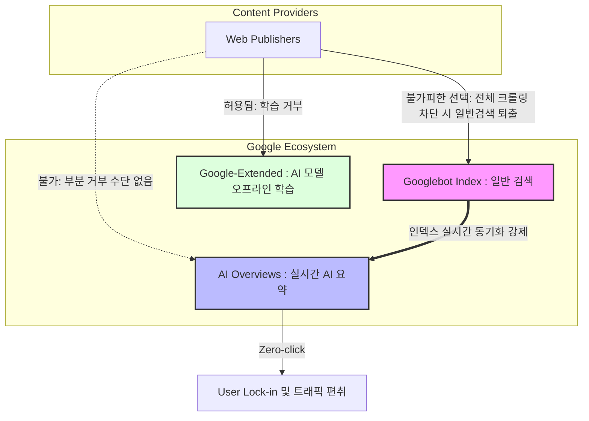
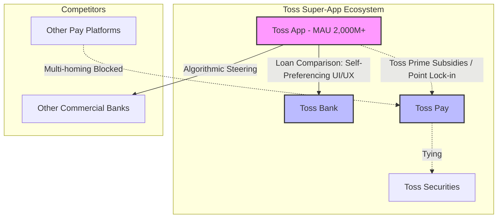

# 공정거래위원회 심결서 (초안 보완) - 자사우대(Self-Preferencing) 중점 사건

본 문서는 **구글 AI 콘텐츠 사건(사례 A)**과 **토스(Toss) 금융 생태계 사건**에 대해 '자사우대'를 핵심 쟁점으로 삼아 공정거래위원회 의결서 형태로 재구성한 보완 자료입니다. 각 사안의 결합 구조와 경제학적 이슈, 관련 판례(대법원 네이버 쇼핑 판결, 해외 선례)를 심층 적용하였습니다.

---

## [사건 1] 구글 엘엘씨(Google LLC)의 시장지배적지위 남용행위 건

### 1. 사실관계 및 결합 형태 (기술적 강제 구조)

피심인 구글은 전 세계 검색 시장 점유율 90%를 상회하는 압도적 지배력을 바탕으로, 일반 검색 서비스에 자사의 생성형 AI 서비스(AI Overviews 등)를 결합하여 제공하고 있습니다. 
이 사건의 핵심은 **'AI 모델 학습 옵트아웃'과 'AI 검색 결과(Overviews) 표출 차단'의 교묘한 분리**에 있습니다. 구글은 AI 모델(Gemini) 학습을 거부할 수 있는 `Google-Extended` 옵트아웃 기능을 제공했으나, 이는 정작 검색결과 상단에서 트래픽을 흡수하는 **'AI Overviews' 표출을 막지 못합니다**. 

AI Overviews는 별도 학습 코퍼스가 아닌 일반 검색 인덱스(`Googlebot`)를 실시간으로 참조하여 생성되기 때문입니다. 퍼블리셔가 AI Overviews에 자사 콘텐츠가 요약·표출되는 것을 막으려면, 일반 크롤러인 `Googlebot` 자체를 차단하거나 검색 노출에 치명적인 `nosnippet` 태그를 적용해야 합니다. 이는 곧 **일반 검색 시장에서의 생존(트래픽)을 사실상 전면 포기**해야 함을 의미하며, 구글은 이러한 기술적 종속성을 지렛대로 퍼블리셔에게 AI 콘텐츠 무단 활용이라는 '전부 아니면 전무(All-or-nothing)' 조건을 강제하였습니다.

### 2. 경제학적 쟁점 및 정량적 분석 (Economic Issues & Quantitative Analysis)

**가. 품질 하락 기반 시장 획정 (SSNDQ 테스트)**
일반 검색 서비스와 같은 '영(0)의 가격(Zero-price)' 시장에서는 전통적인 SSNIP(작지만 의미 있는 가격 인상) 테스트 대신 **SSNDQ(작지만 의미 있고 일시적이지 않은 품질 하락, Small but Significant Non-transitory Decrease in Quality)** 테스트를 적용하여 관련 시장을 획정합니다.
*   **공식 적용:** 
    \[ \frac{\Delta Q}{Q} = \epsilon_q \times \frac{\Delta Quality}{Quality} \]
    구글이 AI Overviews를 통해 퍼블리셔로의 아웃바운드 링크를 제한하는 것은 정보 생태계의 다양성(Diversity)이라는 '품질'의 하락($-\Delta Quality$)을 의미합니다. 그러나 구글의 압도적 시장지배력(수요의 품질탄력성 $|\epsilon_q| \approx 0$)으로 인해 수요 이탈($\Delta Q$)이 발생하지 않으므로, 일반 검색 시장이 구글을 중심으로 강력히 획정됩니다.

**나. 한계수입 증분과 트래픽 편취 (Traffic Foreclosure)**
구글이 제로 클릭(Zero-click) 환경을 조성할 때 얻는 한계 이익($MB_{Google}$)과 퍼블리셔가 잃는 한계 수익($MC_{Pub}$)의 불균형이 발생합니다.
*   **봉쇄 효과(Foreclosure Effect) 공식:**
    퍼블리셔의 트래픽 손실량을 $\Delta V_{pub}$, 구글 생태계 잔류로 인한 구글의 추가 광고 수익률을 $r_g$라 할 때, 
    \[ \text{구글의 독점지대 증분} = \Delta V_{pub} \times r_g \]
    이 과정에서 경쟁 AI 챗봇이 접근할 수 있는 학습 데이터의 기회비용($OC_{data}$)이 기하급수적으로 상승하여, 신규 AI 사업자의 시장 진입을 원천 봉쇄(Barrier to Entry)하는 동태적 혁신 저해 효과를 낳습니다.

### 3. 위법성 판단 및 관련 판례 적용

**가. 관련 판례 적용**
*   **한국 네이버 쇼핑 대법원 판결 (대판 2025.10.16, 2023두32709 파기환송):**
    대법원은 "알고리즘 조정을 통한 자사 서비스 우대 자체가 당연 위법은 아니며, 실증적이고 구체적인 경쟁제한 효과가 입증되어야 한다"고 판시했습니다. 따라서 본 사건에서 공정위는 구글의 행위가 단순히 퍼블리셔의 수익을 감소시킨 것을 넘어, **'검색 및 AI 시장에서의 품질 저하, 혁신 지연, 그리고 경쟁 AI의 진입 봉쇄'**라는 객관적 효과를 입증해야 합니다.
*   **해외 판례 - EU Google Shopping 확정 판결 (CJEU C-48/22 P, 2024.9):**
    유럽사법재판소는 지배적 검색 사업자가 자사의 비교쇼핑 서비스를 경쟁 서비스보다 우대하여 배치한 행위를 독립적인 남용행위로 인정했습니다. 이는 구글 AI가 자사의 답변을 최상단에 고정하고 원문 링크를 후순위로 미루는 본 사안의 '자사우대' 위법성을 강력히 뒷받침합니다.

**나. 소결**
피심인 구글의 행위는 공정거래법 제5조(시장지배적지위의 남용금지) 제1항 제3호(부당하게 경쟁사업자를 배제하는 행위)에 해당하여 위법합니다.

---

## [사건 2] 주식회사 비바리퍼블리카(Toss)의 불공정거래행위 건

### 1. 사실관계 및 결합 형태 (슈퍼앱 전략)

피심인 비바리퍼블리카(토스)는 송금·결제 앱인 토스를 기반으로 대출비교, 은행(토스뱅크), 증권(토스증권) 기능을 하나의 앱(One-App)에 통합하여 제공합니다. 특히 대출비교 플랫폼 서비스에서 타행 상품보다 자사 계열사인 토스뱅크 대출 상품의 노출 빈도나 UI/UX 편의성을 은밀하게 우대(Self-preferencing)하고, '토스프라임'이라는 구독 멤버십을 통해 토스페이 사용 시 경제적 보상을 집중시켜 멀티호밍(Multi-homing)을 차단하고 있습니다.

### 2. 경제학적 쟁점 및 정량적 분석 (Economic Issues & Quantitative Analysis)

**가. 충성 리베이트와 동등효율성경쟁자(AEC) 테스트**
토스가 '토스프라임' 등을 통해 자사 결제망(토스페이) 및 증권 이용 시 부여하는 통합 포인트 혜택은 미국 Visa 사건의 **볼륨 기반 리베이트(Volume-based Rebate)**나 절벽 가격(Cliff Pricing)과 경제학적으로 동일하게 작동합니다. 경쟁사가 토스의 고객을 빼앗기 위해 제시해야 하는 유효 가격(Effective Price, $P_{effective}$)은 다음과 같이 계산됩니다.
*   **AEC(As-Efficient Competitor) 계산식:**
    소비자의 전체 금융 수요를 $D$, 타 플랫폼이 가져갈 수 있는 경합 수요(Contestable Share)를 $D_c$, 토스가 전체 수요에 대해 제공하는 단위당 혜택(리베이트)을 $R$, 기준 가격을 $P_0$라 할 때, 경쟁 플랫폼의 유효 가격은 다음과 같습니다.
    \[ P_{effective} = P_0 - \frac{R \times D}{D_c} \]
    토스 생태계의 락인(Lock-in) 효과로 인해 경합 수요 $D_c$가 매우 작아질수록, 타 금융사(네이버페이, 시중은행 등)가 제시해야 하는 $P_{effective}$는 크게 하락하여 결국 서비스 한계비용(MC)보다 낮아지게 됩니다($P_{effective} < MC$). 즉, 토스와 **동등하게 효율적인 경쟁자(As-Efficient Competitor)조차 시장에서 수익을 낼 수 없어 축출**되는 약탈적 구조가 수학적으로 증명됩니다.

**나. 양면 시장에서의 네트워크 효과 및 포위 전략 (Platform Envelopment)**
토스 앱은 소비자와 금융상품 공급자가 만나는 간접 네트워크 효과(Indirect Network Effects)가 작동하는 양면 시장(Two-sided Market)입니다.
*   **소비자 효용 함수:** $U_c = \alpha + \beta \times N_m - P_c$ ($N_m$: 제휴 가맹점/금융사 수)
*   **공급자(가맹점/금융사) 효용 함수:** $U_m = \gamma + \delta \times N_c - P_m$ ($N_c$: 소비자 수, MAU 2,000만)
토스는 막대한 $N_c$를 무기로 가맹점 및 제휴 금융사에게 높은 $P_m$(수수료 인상 또는 토스플레이스 독점 계약 등 배타적 조건)을 강제할 수 있습니다. 이는 무료 송금 시장의 트래픽을 지렛대 삼아 대출·증권·오프라인 POS 시장까지 수직적 결합을 달성하는 전형적인 **플랫폼 포위(Envelopment)** 전략에 해당합니다.

### 3. 위법성 판단 및 관련 판례 적용

**가. 관련 판례 적용 및 국내 소송 쟁점**
*   **토스플레이스 배타조건부 계약 소송 (서울남부지법 2025.8 가처분):**
    최근 자회사 토스플레이스는 POS 단말기 제조사(SCSpro)와 계약을 맺으며 **'네이버페이 등 경쟁사와 유사 사업 협력 금지'라는 배타조건부 조항**을 삽입해 소송전(가처분)을 치렀습니다. 법원은 가처분 단계에서 해당 조항이 공정거래법을 명백히 위반했다고 단정하기 어렵다며 토스의 손을 들어주었으나, 이는 토스가 하드웨어(POS) 인프라 단계에서부터 타 페이 플랫폼의 진입을 원천 봉쇄하려는 **배타적 락인(Lock-in) 의도**를 가졌음을 보여주는 결정적 사실관계입니다.
*   **한국 네이버 쇼핑 대법원 판결 (대판 2025.10.16)의 엄격한 잣대 적용:**
    토스의 대출비교 알고리즘이 토스뱅크에 유리하게 설계되었다 하더라도, 네이버 판례에 따르면 이 자체가 위법은 아닙니다. 공정위는 토스의 행위가 타 은행들의 대출 시장 진입을 실질적으로 배제하였고, 궁극적으로 **금융 소비자의 대출 금리 상승이나 선택권 제한**이라는 경쟁제한적 결과를 낳았음을 경제분석으로 입증해야만 제재가 가능합니다.
*   **해외 판례 1 - 미국 DOJ v. Apple 슈퍼앱 방해 소송 (2024.3):**
    미국 법무부는 애플이 아이폰의 독점력을 유지하기 위해, 소비자가 여러 서비스를 한곳에서 이용할 수 있는 **'슈퍼앱(Super App)'의 등장을 고의로 차단·방해**했다며 반독점 소송을 제기했습니다. 이는 특정 플랫폼이 생태계(OS 또는 슈퍼앱 자체)를 장악한 뒤 경쟁 서비스의 접근 API나 결제를 통제하는 행위가 중대한 반독점 위반임을 시사합니다. 토스는 스스로가 '슈퍼앱'이 되어 폐쇄적 금융 생태계를 구축하고 있으므로, 타 금융사의 접근을 제한하거나 자사 서비스만을 우대할 경우 이와 유사한 배제적 남용(Exclusionary Abuse) 혐의를 받을 수 있습니다.
*   **해외 판례 2 - 미국 DOJ v. Visa (2024) 및 EU Apple App Store 사건 (2025):**
    Visa가 가맹점에게 배타적 거래를 유도한 방식이나, Apple이 자사 앱스토어 생태계 내에서 결제를 강제(안티스티어링)하여 €5억의 과징금을 맞은 사건과 유사합니다. 토스가 토스플레이스(POS) 등 B2B 하드웨어에서 타사 결제 모듈을 배제하려 하거나, 생태계 내부로 금융 활동을 강제하는 행위는 해외 경쟁당국이 가장 주시하는 폐쇄형 생태계(Closed-loop) 남용 행위와 궤를 같이 합니다.

**나. 소결**
피심인 비바리퍼블리카의 이러한 알고리즘 우대 및 결합판매 행위는 공정거래법상 제45조 제1항 제4호(자기의 거래상의 지위를 부당하게 이용하여 상대방과 거래하는 행위) 및 제5조 자사우대 심사지침에 위배될 소지가 큽니다. 단, 대법원 판례의 기준에 부합하기 위한 철저한 시장 경쟁제한 효과 실증이 의결의 전제 조건이 됩니다.
