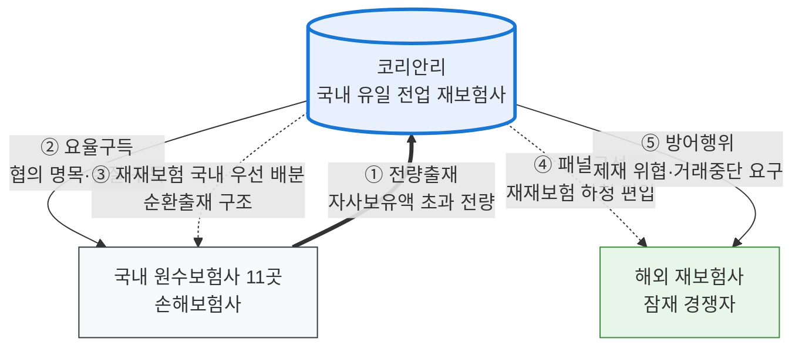

# 코리안리 가상사건 보완조사 — 판결 사실관계 · 시나리오 정교화 · 실제 유사사례 (v2)

> 작성: 2026-07-05 (v2 — #53 조사보고서 규칙 적용: 산문 서술·출처 인라인·사실관계도) | 조사: Sonnet 5각도 / 검토: Fable
> 선행 문서: 『모의공정거래_코리안리_실제사건보강_2026-07-02.md』(사건 경과·법조 교정). 본 문서는 그 위에 판결의 세부 사실관계와 시나리오 설계 재료를 얹는다.
> 원시데이터(전체 출처 URL 포함): `9.작업중/클로드/조사원시_코리안리보완_2026-07-05.json`

---

## 1. 대법원 2020두54074 판결의 사실관계

### 1-1. 사건의 뼈대

이 사건은 코리안리재보험이 공정거래위원회를 상대로 낸 시정명령 등 취소소송이다. 공정위는 2018년 12월, 코리안리가 1999년부터 국내 손해보험사 11곳과 일반항공보험 재보험특약을 맺어 시장지배적 지위를 남용하고 부당하게 경쟁사업자를 배제했다고 보아 시정명령과 함께 과징금 78억 6,500만 원을 부과했다.[^1] 원심인 서울고등법원(2020. 10. 15. 선고 2019누41159 판결 — law_api 검증 ✓)은 문제된 행위들을 하나씩 떼어 심사한 끝에, 특약이 손해보험사들의 자발적 갱신으로 유지되어 왔고 코리안리가 실제 불이익을 가한 일이 없다는 이유로 강제성을 부정하고 처분의 상당 부분을 취소하였다.[^2] 그러나 대법원 제2부(주심 오경미 대법관)는 2025년 6월 5일 원심판결 중 시정명령 제1의 나항·제3항·제5의 나항·제6항 중 재재보험 관련 부분과 과징금부과처분 중 공정위 패소 부분을 파기하여 서울고등법원에 환송하였고, 코리안리의 상고와 공정위의 나머지 상고는 기각하였다.[^3] 파기환송심은 서울고등법원에서 진행 중이며 2026년 2월 26일 제2차 변론기일이 예정되어 있었다는 사실까지 확인되고, 그 이후의 선고 여부는 확인되지 않는다.[^4]

### 1-2. 문제된 다섯 개의 행위

판결이 다룬 행위는 다섯 가지이고, 이들의 구체적 내용이 가상 시나리오 설계의 원형이 된다. 첫째, **전량출재의무 조항**은 원수보험사가 자사보유액을 초과하는 위험 전량을 코리안리에만 출재하도록 한 조항이다. 둘째, **요율구득의무 조항**은 명목상 '협의'라고 되어 있으나 실질적으로는 코리안리가 산출해 준 보험요율을 그대로 받아 쓰도록 하는 의무다.[^5] 셋째, **재재보험특약 조항**은 코리안리가 원수보험사들로부터 수재한 위험을 다시 재보험(재재보험, retrocession)으로 내보낼 때 해외 재보험사보다 국내 원수보험사들에 사전에 정해진 비율로 우선 재출재하도록 정한 조항이다 — 국내 원수사들을 재재보험 물량으로 묶는, 이른바 '순환출재' 구조의 실제 원형이다.[^6] 넷째, **패널구성행위**는 코리안리가 해외 재보험사들을 '협력사(패널)' 방식으로 묶어 국내운항 일반항공보험에 관한 재재보험특약을 체결한 행위로, 재재보험특약 조항과 표리를 이룬다 — 해외의 잠재적 경쟁자를 경쟁자가 아니라 재재보험 하청 파트너로 편입시킨 것이다.[^7] 다섯째, **방어행위**는 특약을 맺은 일부 원수보험사가 코리안리를 거치지 않고 해외 재보험사로부터 직접 요율을 구득하려 하자, 2006년경부터 해당 원수사에 제재 조치를 위협하고 요율을 제공한 해외 재보험사에는 거래 중단을 요구한 행위다.[^8]

### 1-3. 사실관계도

> 도식 규칙: TB 고정 · design-md 팔레트(피심인=Blue, 거래상대=Gray, 경쟁자=Green) · 실선=계약상 의무, 점선=물량 배분·압박. [렌더 검증 예정 표기 — 하단 검증 상태 참조]

### 1-4. 법리 — 두 개의 무기

대법원 설시의 핵심은 두 가지다. 하나는 **합의 포함 법리**다. 구 공정거래법 시행령 제5조 제5항 제2호가 정한 "경쟁사업자와 거래하지 아니할 조건"은 시장지배적 사업자가 일방적·강제적으로 부과한 경우에 한정되지 않고 거래상대방과의 합의로 설정된 경우도 포함하며, 거래상대방이 자발적으로 합의했더라도 그로 인해 경쟁사업자의 진출이 방해되었다면 일방적으로 부과된 경우와 본질적으로 다르지 않다는 것이다.[^9] 다른 하나는 **종합 평가 법리**다. 대법원은 행위를 하나씩 떼어 강제성을 심사한 원심의 방법 자체를 배척하면서, 다섯 행위 모두가 "시장지배적 사업자로서 경쟁사업자를 배제하기 위한 단일한 의사 아래 이루어진 행위"이므로 유기적으로 연결된 전체로 평가해야 한다고 하였다.[^10] 가상사건에서 피심인이 "개별 계약은 모두 적법한 사적 자치"라고 항변할 때, 심사관은 이 두 법리로 각각 '자발성'과 '개별성'의 방패를 걷어낼 수 있다.

### 1-5. "전량출재는 이제 금지된 것 아닌가"라는 물음에 대하여

확정되지 않았다. 조사 범위에서 공정위 시정명령 원문이 전량출재·요율구득 조항의 삭제를 명하였는지, 그 조항들이 실제로 폐기되었는지를 확인해 주는 자료는 발견되지 않았고, 무엇보다 대법원이 시정명령의 상당 부분을 파기환송하였기 때문에 시정명령의 최종 내용과 효력은 파기환송심 결과가 나와야 확정된다.[^11] 판결의 법리도 "합의 형식이어도 배타조건이 성립할 수 있다"는 것이지 전량출재 일반의 금지를 선언한 것이 아니다. 따라서 가상 시나리오의 전제는 다음과 같이 설정하는 것이 정확하고도 극적이다: **"파기환송심에서 공정위 전부 승소가 확정되어 명시적 전량출재·요율구득 조항이 폐기된 202X년, 피심인은 조항 없이 같은 봉쇄 구조를 재구축하였다."** 이는 실제 사건의 자연스러운 후속 세계관이 된다.

## 2. 점유율은 얼마인가 — 시장별 검증

"88%"는 특정 시장·특정 기간의 수치다. 공정위가 2018년 처분의 근거로 삼은 것은 **일반항공보험 재보험 시장의 2013~2017년 5개년 평균 약 88%**이며,[^12] 언론은 같은 시장을 "90% 이상"으로 쓰기도 한다.[^13] 그 이후 갱신된 항공재보험 전용 점유율 통계는 조사 범위에서 발견되지 않았다 — 2025년 보도들도 여전히 2013~2017년 수치를 인용한다. 따라서 가상사건에서 항공 등 특정 종목 시장을 [약 90%]로 설정하는 것은 사실과 정합한다.

국내 재보험시장 전체로 넓히면 그림이 달라진다. 코리안리의 수재보험료 기준 점유율은 2022년 68.9%에서 2023년 59.9%, 2024년 56.5%로 하락하는 추세인데, 삼성생명·동양생명 등이 스위스리·RGA 같은 해외 재보험사와 공동재보험 계약을 늘린 것이 원인으로 거론된다.[^14] 2022년 기준으로 전업재보험사 그룹 전체가 시장의 87.8%를 차지하는 가운데 코리안리 65.1%, 스코르 8.3%, 스위스리 5.8%라는 수치도 보도되었으나 산정기준이 명시되지 않은 단일출처다.[^15] 화재·해상·특종·장기 등 종목별 시장점유율 공개 통계는 확인되지 않았고, 확인되는 것은 코리안리 자사의 매출 구성비(2020년: 장기 38.9%, 재물 17.0%, 특종 16.6%, 생명 14.9%)뿐인데 이는 점유율과 다른 지표이므로 혼용하면 안 된다.[^15]

| 시장 | 수치 | 기준 | 등급 |
|---|---|---|---|
| 일반항공보험 재보험 | 약 88% (보도상 "90%+") | 2013~2017 평균, 공정위 | 다출처·갱신치 없음 |
| 국내 재보험 전체 | 68.9%→59.9%→56.5% | 2022→2024, 수재보험료 | 다출처 |
| 전업재보험 그룹(2022) | 코리안리 65.1 / SCOR 8.3 / Swiss Re 5.8 | 산정기준 미상 | 단일출처 |
| 종목별(화재·해상 등) | 공개 통계 부존재 | — | 확인불가 |

**자본 규모 대비 독점 지위**라는 사용자의 착안은 수치로 뒷받침된다. 코리안리가 해외로 재출재한 재재보험료는 약 3조 9,117억 원에 이르고(해외 수재 비중은 2014년 22%에서 2024년 41%로 확대),[^14] 국내 손보사들이 해외 재보험사에 직접 낸 출재보험료도 2024년 3조 3,705억 원으로 3년 누적 9조 6,099억 원 — 코리안리의 재출재분까지 합치면 3년간 약 13조 5,000억 원이 해외로 나갔다.[^14] 그 사이 국내 손보업계의 해외 재보험 수지는 3년 누적 약 2조 7,000억 원 적자였고, 보험연구원 측은 "독과점 시장이다 보니 변화가 어려운 상황"이라 진단했다.[^16] 코리안리의 K-ICS 비율은 2025년 6월 말 204.5%로 처음 200%를 넘었다.[^17] 요컨대 **"자기 자본으로 다 보유하지도 못하는 위험을 국내에서 독점적으로 수재한 뒤 해외에 넘기면서, 그 '길목' 지위 자체로 독점을 유지한다"**는 명제가 시나리오의 수치 골격이 된다. 다만 자기자본 절대액과 보유율(retention ratio)은 경영공시 PDF와 DART에서 수동 확인이 필요하다.[^18]

## 3. 시나리오 정교화 — 독소조항 없는 독점 유지의 세 채널

판결이 금지한 것은 '조항'이 아니라 '단일한 의사로 연결된 봉쇄 구조'다. 그렇다면 가상 피심인은 조항을 지우고 가격·물량·데이터라는 세 채널로 같은 구조를 재구축하는 것으로 설계한다. 세 채널 모두 실제 사실이나 실제 판례에 앵커가 있다.

**채널 1 — 가격 차별로 만드는 사실상의 전속.** 출재 집중도에 연동해 요율과 출재수수료를 차등하는 설계다. 물량을 몰아주는 원수사에는 우대요율과 높은 수수료를, 해외로 분산하는 원수사에는 표준요율과 삭감된 수수료를 적용하되, 어디에도 배타 조항은 없다. 이 구조의 실제 앵커는 미국 FTC의 Surescripts 사건이다. 전자처방 시장의 약 95%를 쥔 Surescripts는 명시적 배타조항 없이, 거래의 전부를 자사에 몰아주지 않으면 전량에 대한 할인·인센티브를 소급 상실시키는 all-unit discount 구조로 사실상의 배타성을 구축했다는 이유로 2019년 제소되었고, 2023년 7월 동의명령으로 20년간 전량 소급할인과 점유율 연동 계약이 금지되었다.[^19] 트럭 변속기 시장의 Eaton도 구매량의 90%를 충족해야 소급 리베이트를 주는 장기계약으로 3순회항소법원에서 셔먼법 2조 위반이 인정되어 2015년 5억 달러를 지급했다.[^20] 주의할 것은 반대 방향의 최신 판례다. Post Danmark I은 가격차별 그 자체는 남용이 아니고 배제효과의 개별 입증이 필요하다고 했고,[^21] Intel 사건에서는 2024년 CJEU가 효과분석 없는 조건부 리베이트 당연위법 법리를 최종적으로 폐기했다.[^22] 즉 이 채널은 **효과 입증(차등 도입 전후 해외 재보험사 점유율 정체·이탈 원수사의 조건 악화 실증)을 시나리오에 내장해야** 성립한다. 그리고 보험·재보험 분야에서 요율 차별을 통한 배타성 구축이 직접 제재된 선례는 조사 범위에서 발견되지 않았으므로, 가상사건은 Surescripts·Eaton의 구조를 재보험에 처음 적용하는 구성임을 인지하고 설계해야 한다.

**채널 2 — 재재보험을 통한 잠재경쟁자 매수.** 여기에는 실화가 두 겹이다. 첫째, 실제 판결의 패널구성행위(행위 ④)가 바로 이 유형이다 — 해외 재보험사들을 경쟁자가 아니라 재재보험 협력사로 묶었다. 둘째, **코리안리와 칼라일그룹은 2020년 7월 31일 전략적 제휴 MOU를 실제로 체결했다.** 국내 보험사가 코리안리에 출재하는 공동재보험 위험을 칼라일 소유 재보험사 포티튜드리(Fortitude Re)가 재재보험 방식으로 인수해 헤지하는 구조로, 협력 범위는 상품 설계·구조화, 재보험 자산운용, 요구자본 관리, 신규자본 조달에 이른다.[^23] 칼라일과 포티튜드리는 2021년 아시아 생명·연금 재보험을 위해 자본금 7억 달러 이상의 버뮤다 법인 FCA Re(Fortitude Carlyle Asia Reinsurance, Ltd.)를 실제로 설립하기도 했다.[^24] 다만 코리안리-칼라일 관계는 지분투자나 라이선스가 아닌 사업제휴 MOU이고 이후의 구체적 거래 공시는 확인되지 않으므로, 가상 각색에서는 "한국 직접 진입을 검토하던 글로벌 자본과, 진입 포기의 대가로 안정적 재재보험 물량과 우대 수수료를 약속하는 라이선스형 계약"으로 한 단계 진전시키면 된다. 법리는 역지불합의다 — FTC v. Actavis가 확립했듯 현금이 아니라 라이선스·공동판촉·물량 배분 같은 우회적 가치 이전이면 족하다.[^25] 한편 국내 공동재보험 시장이 현재 코리안리·스위스리·RGA의 3파전(RGA는 ABL 최초 계약과 삼성생명 6,000억·동양생명 누적 3,500억, 스위스리는 메리츠화재 6,000억, 코리안리는 신한라이프 5,000억 MOU와 삼성생명 5,000억)이라는 사실은[^26] 양날의 검이다. 피심인에게는 "공동재보험은 경쟁적"이라는 항변 근거가 되고, 심사관에게는 "바로 그 균열을 재재보험 매수로 봉합하려 했다"는 서사의 배경이 된다.

**채널 3 — 순환출재와 데이터 병목.** 실제 판결의 재재보험특약 조항(행위 ③)이 국내 원수사 우선 배분이라는 순환출재의 원형을 제공한다. 가상 각색은 최대 고객 S사와 "거대위험 전량 인수 ↔ 우량 재재보험 물량 독점 배분"을 주고받는 상호 순환거래(reciprocal dealing)이고, 미국 연방대법원의 Consolidated Foods가 고전적 앵커다.[^27] 코리안리-삼성생명 공동재보험 계약(2022년 11월 개시, 5,000억 원 규모)은 이런 관계의 실재성을 보여 준다.[^28] 데이터 쪽에서는, 보험개발원의 참조요율과 2016년 이후 허용된 자사요율이라는 대체 인프라가 존재함에도 기업성 보험 요율의 90% 이상이 여전히 재보험사(사실상 코리안리) 산출 협의요율에 의존한다는 점이[^29] 필수설비형 병목 논증의 사실 기반이 된다.

## 4. 실제 유사사례 목록

| 유형 | 사례 | 요지·상태 |
|---|---|---|
| 가격구조 락인 | FTC v. Surescripts (2019→2023 동의명령)[^19] / ZF Meritor v. Eaton (3d Cir. 2012→2015 $500M)[^20] | 명시조항 없는 소급할인·충성조건 → 사실상 배타성. 다출처 확인 |
| 그 한계(피심인측) | Post Danmark I (CJEU 2012)[^21] / Intel (CJEU 2024 확정)[^22] | 가격차별 자체≠남용, 효과분석 필수 — 최신 기준 |
| 잠재경쟁자 매수 | FTC v. Actavis (570 U.S. 136, 2013)[^25] 외 핸드오프 10선(Cephalon $1.2B, Lundbeck €146M, Servier €427M 등) | Actavis는 기검증. 나머지는 인용 전 개별 서지 검증 필요 |
| 순환·충성 고전 | Consolidated Foods (US 1965)[^27] / Hoffmann-La Roche (CJEU 1979) / 국내 퀄컴(2013두14726 ✓)·인텔(의결 2008-295) | 퀄컴만 law_api 기검증 |
| 국내 최신 락인 | 브로드컴 동의의결, CJ올리브영(2023-234), JW중외(2023), 네이버 부동산(2020) | 핸드오프 수록분 — 연도·금액 포함 개별 재검증 필요(브로드컴 "2025·130억" 표기 미검증) |

## 5. 시나리오를 두껍게 하는 주변 사실들

코리안리는 1963년 국영 대한손해재보험공사로 출발해 1978년 민영화된 이래 **국내 유일의 전업 재보험사**다.[^15] 금융위원회가 재보험업을 손해보험업에서 분리해 별도 업종으로 만들고 허가요건을 완화해 신규 설립을 유도하겠다는 제도 개편을 발표했음에도 제2 전업사는 나타나지 않았다[^30] — 진입장벽 서사의 뼈대다. 장벽의 실체로는 장기계약의 관성, 언더라이팅·의학적 심사 인프라, 담보력(신용등급)에 대한 원수사의 요구, 그리고 데이터 집적이 꼽힌다.[^31] 참고로 사용자가 언급한 "팬아시아리"류의 국내 제2 재보험사 설립 시도는 실체가 확인되지 않았다(검색되는 PanAsia Re는 싱가포르 법인으로 무관) — 가상사건에서는 가공 명칭으로만 쓸 것.

해외 재보험사의 국내 활동은 확대 국면이다. 금융당국은 2025년 일임식 자산유보형 공동재보험을 새로 허용하면서 외국 재보험사 국내 지점의 취급 범위도 넓혔고,[^26] 토키오마린이 한국에서 철수하며 그 사업을 스위스리가 인수했다.[^32] 이런 흐름은 "그럼에도 항공 등 병목 종목에서는 진입이 막혀 있다"는 대비 구도로 쓸 수 있다.

피심인의 신뢰성에 관한 주변 사실로는 지배구조 논란이 있다. 원종규 대표이사의 형 원종익 씨가 보험업 경력 없이 이사회 의장을 맡는 형제경영 구조에 금융당국이 우려를 표했고, 금감원 정기검사는 의장 선임 과정의 객관적 검증 절차 미비를 들어 '경영유의' 조치를 내렸으며, 사외이사의 '독립이사' 개명과 임기 6년 연장 정관 시도, 기타비상무이사직의 부자 세습성 인사도 보도되었다.[^33] 모의 의결서에서 직접 위법 요소는 아니므로 성격증거로 남용하지 말고, 피심인의 준법 문화 서술 정도로 절제해 쓰는 것이 적절하다.

---

## 각주 (출처)

[^1]: 법률신문, "대법원, 코리안리 재보험 독점 특약 사건 파기환송" (2025.6.10), https://www.lawtimes.co.kr/news/articleView.html?idxno=209431 ; 정책브리핑(공정위 2018.12 의결), https://www.korea.kr/news/policyNewsView.do?newsId=156309174
[^2]: 서울고등법원 2020. 10. 15. 선고 2019누41159 판결 — law_api 검증 ✓(선고일 일치). 원심 판단 구조는 매거진한경 (2025.7.9), https://magazine.hankyung.com/business/article/202507096066b
[^3]: 대법원 2025. 6. 5. 선고 2020두54074 판결 — law_api 검증 ✓. 주문(파기 범위)은 국가법령정보센터 판례 페이지, https://www.law.go.kr/LSW/precInfoP.do?precSeq=606801 [단일출처 — 판결문 원문 대조 권장]
[^4]: 법률신문 법조일정 (2026.2.26 변론기일 공지), https://www.lawtimes.co.kr/news/articleView.html?idxno=216834 [단일출처]
[^5]: 국가법령정보센터 판례 페이지(위 각주 3) 및 법률신문(위 각주 1).
[^6]: 법률신문 (2025.6.10), 위 각주 1.
[^7]: 리걸타임즈 (2025.7.9), https://www.legaltimes.co.kr/news/articleView.html?idxno=87831 [단일출처 — 판결문 원문 대조 필요]
[^8]: 리걸타임즈, 위 각주 7 (다출처 교차: 법률신문).
[^9]: 대법원 보도자료, https://scourt.go.kr/portal/news/NewsViewAction.work?seqnum=10464 ; 구 시행령 문언은 law.go.kr 조문 페이지 확인.
[^10]: 법률신문, 위 각주 1 ("단일한 의사" 판시 인용).
[^11]: 조사 결과 확인불가 — 시정명령 원문·이행 보도 미발견. 원시데이터 not_found 항목 참조.
[^12]: 정책브리핑(공정위), 위 각주 1.
[^13]: 매거진한경 (2025.7.9), 위 각주 2 ("90% 이상").
[^14]: 블로터, "코리안리 점유율 하락과 재보험료 해외유출" (2025), https://www.bloter.net/news/articleView.html?idxno=635060
[^15]: 한국공제신문 (2022년 기준 점유율·연혁), https://www.kongje.or.kr/news/articleView.html?idxno=1599 [단일출처 — 산정기준 미상]
[^16]: 글로벌이코노믹 (2025.4, 보험연구원 진단 인용), https://www.g-enews.com/article/Finance/2025/04/202504161748556364e30fcb1ba8_1 [단일출처]
[^17]: FETV (2025, K-ICS 204.5%·상반기 순이익), http://www.fetv.co.kr/news/articleView.html?idxno=200075 [단일출처]
[^18]: 코리안리 경영통일공시 2024_4Q PDF, https://www.koreanre.co.kr/USER_DATA/koreanre/content/editor/pdf/gyungyoung/2024_4Q.pdf (자동 추출 실패 — 수동 열람 필요)
[^19]: FTC 보도자료 (2023.7 동의명령), https://www.ftc.gov/news-events/news/press-releases/2023/07/ ; FTC 소장(2019), https://www.ftc.gov/system/files/documents/cases/surescripts_redacted_complaint_4-24-19.pdf
[^20]: Law360, "Eaton Pays $500M To End Antitrust Suit" (2015), https://www.law360.com/articles/550572/
[^21]: CJEU C-209/10 Post Danmark (2012.3.27), https://eur-lex.europa.eu/legal-content/EN/TXT/?uri=celex%3A62010CJ0209
[^22]: White & Case, "EU General Court demands vigorous effects-based analysis" (Intel 경과), https://www.whitecase.com/insight-alert/
[^23]: 한국경제, "코리안리-칼라일 전략적 제휴 MOU" (2020.8.4), https://www.hankyung.com/article/202008041988Y
[^24]: Carlyle 보도자료, "Fortitude Re and Carlyle Establish FCA Re with over $700 Million Capital" (2021), https://www.carlyle.com/media-room/news-release-archive/fortitude-re-and-carlyle-establish-fca-re-over-700-million-capital [단일출처]
[^25]: FTC v. Actavis, 570 U.S. 136 (2013) — 기존 조사에서 검증, https://supreme.justia.com/cases/federal/us/570/136/
[^26]: 더벨, "국내 공동재보험 3파전" (2025.7.25), https://www.thebell.co.kr/free/content/ArticleView.asp?key=202507251420564040103616 ; 규제완화는 더벨 (2025.8.4), key=202508041656097960105315
[^27]: FTC v. Consolidated Foods Corp., 380 U.S. 592 (1965) — 핸드오프 수록, 서지 재검증 권장.
[^28]: 포춘코리아, "코리안리-삼성생명 공동재보험 계약" (2022), http://www.fortunekorea.co.kr/news/articleView.html?idxno=25107 [단일출처] ; 신한라이프 건은 아이뉴스24 (2021.12), https://www.inews24.com/view/1436465
[^29]: 신 핸드오프(9597bdf1) 조사원 7 교차검증 — 보험개발원·자사요율 존재하나 협의요율 의존 90%+.
[^30]: 뉴스프라임, "재보험업 제도개편방향" , https://www.newsprime.co.kr/news/article/?no=508162 [단일출처]
[^31]: 보험연구원(KIRI) 생명보험 재보험 보고서, https://www.kiri.or.kr [원문 경로 원시데이터 참조]
[^32]: 전자신문 (2025.3.19), https://www.etnews.com/20250319000149 [단일출처]
[^33]: EBN (형제경영), https://www.ebn.co.kr/news/articleView.html?idxno=1651413 ; 1conomy(경영유의·세습), https://www.1conomynews.co.kr/news/articleView.html?idxno=47590 [각 단일출처 — 의견서 사용 시 원문 재확인]

## 검증 상태

law_api 검증: 2020두54074 ✓ · 원심 2019누41159 ✓(선고일 교차 일치) · 퀄컴 2013두14726 ✓(기존) · Actavis(미국 판례, law_api 대상 외). 문서 verify-text 통과 여부는 갱신 예정. 사실관계도 mmdc 렌더 검증: [실행 대기 — 완료 시 본 줄 갱신].
잔여 확인 과제: 판결문 원문 대조(precSeq=606801 — 특히 행위 ④ 정의·주문 각 항), 공정위 의결서 원문(시정명령 각 항 특정), 파기환송심 2026.2.26 이후 경과, 자기자본·보유율(공시 PDF·DART), 핸드오프 판례 20선 중 미검증 서지.
