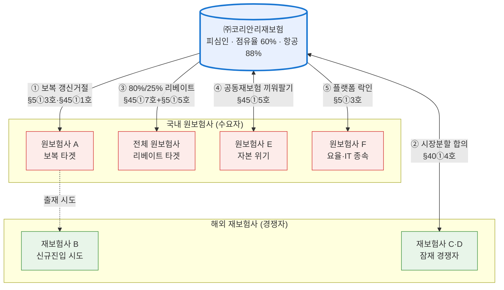

# 코리안리 모의공정위 시나리오 — 실제 사건 보강·검증·법조 교정

> 작성: 2026-07-02 | 조사: Sonnet 5각도 / 검토·교정: Fable | 대상: 안티그래비티 핸드오프 산출물(`~/.gemini/antigravity/brain/b7460e4d.../handoff_document.md` 및 resolution_full_version.md 등 4종)
> **결론 먼저**: ① 모의 시나리오의 전제가 된 **실제 코리안리 사건이 대법원 2025.6.5 파기환송(2020두54074)으로 공정위 사실상 승소** — 시나리오의 법리적 토대가 실제 판례로 격상됨. ② 모의 의결서의 **적용법조 2건이 오류**(교정 필수). ③ 해외사례 부록 **2건 부정확**(스페인 부분취소·일본 연도).

---

## 1. ★ 실제 사건 — 공정위 v. 코리안리 (일반항공보험 재보험)

| 단계 | 내용 | 검증 |
|---|---|---|
| 공정위 의결 | **2018.12** 시정명령+과징금 **약 76억원**(78억 6,500만원 보도. 2016년 관련매출액 393억의 2%에 위반기간 18년 등 가중). 위반기간 **1999.4.1~2018.11.28**. 항공보험 재보험 점유율 **약 88%**(사실상 독점) | 다출처(korea.kr 정책브리핑 등). 의결번호는 미확인 — 공정위 의결서 원문 확인 필요 |
| 행위사실(실제) | ① 국내 손보사들이 **코리안리 산출 요율로만** 원수보험 인수 + 재보험 물량 전부 출재 강제(전속거래) ② 1999년부터 '일반항공보험 재보험특약'의 **협의요율(요율구득의무)** 조항 ③ 해외재보험사·중개사에 불이익 제시로 대체거래선 확보 방해 ④ **잠재적 경쟁사를 재재보험 출재거래선으로 포섭해 직접거래 차단** | 다출처 |
| 서울고법 | 코리안리 **일부 승소** — 전량출재의무·재재보험특약·해외패널구성·협의요율이 "배타조건부거래에 해당하지 않는다"며 처분 일부 취소 (사건번호·선고일 미확인) | 단일출처(법률신문) |
| **대법원** | **2020두54074, 2025.6.5 선고(특별2부, 주심 오경미) — 원심 파기환송.** 공식 사건명: "시정명령등취소청구의소[**시장지배적 사업자의 배타조건부 거래행위의 성립 여부**가 문제된 사건]". 판시 취지: "**협의요율이 당사자 간 자발적 합의라 하더라도 시장지배적 사업자가 설정한 구조라면 배타조건부거래(남용행위)에 해당할 수 있다**" — 공정위 처분 적법 취지로 사실상 공정위 승소, 서울고법 재심리 중 | **✓ law_api 1차 검증**(사건번호·선고일·사건명) + 다출처 |

**시사점**: ⑴ 모의 의결서가 "과거 명시적 전량 출재 특약 폐지 이후"라고 쓴 전제가 실제 사건과 정합. ⑵ **실제 행위 ④(잠재경쟁사 재재보험 포섭)는 모의 시나리오 2(시장분할 이면합의)와 사실상 동일** — 가상이 아니라 공정위가 실제 인정한 행위유형. ⑶ 2025.6.5 대법 판시는 시나리오 3(충성리베이트)의 "형식적 자발성 항변 배척" 논거로 **국내 최신 직접 선례**. 모의 발표에서 퀄컴(2013두14726)보다 앞세울 카드. ⑷ 주심 오경미 대법관은 네이버 자사우대 파기환송(2023두32709)의 주심과 동일인 — "효과 입증 없으면 파기(네이버) vs 구조 설정이면 인정(코리안리)"의 대비가 최신 판례 지형.

## 2. 모의 의결서 적용법조 교정 (Fable 검토 — 필수 반영)

| 위치 | 현재(오류) | 교정 | 근거 |
|---|---|---|---|
| 행위 가(보복 거래거절) | "법 제5조 제1항 **제1호** (부당하게 거래를 거절하는 행위)" | **§5①3호**(다른 사업자의 사업활동 부당방해 — 시행령상 거래거절형) 또는 **§45①1호**(부당한 거래거절) | §5①1호는 "**가격**을 부당하게 결정·유지·변경하는 행위"임(법제처 검증 원문). 거래거절이 아님 |
| 행위 다(충성리베이트) | "법 제45조 제1항 **제2호** (차별적 취급 **및 배타조건부 거래**행위)" | 차별취급=§45①2호는 유지 가능하나, **배타조건부거래는 §45①7호**(구속조건부거래) — 병기 교정 | §45①2호는 차별취급만. 배타조건부거래는 7호 구속조건부거래의 세부유형(시행령 별표2). 퀄컴(2013두14726) 공식 사건명도 "배타조건부 리베이트" |
| 행위 다 보충 | §5①5호(경쟁사업자 배제) | 유지 + **2020두54074 판시 인용 추가** | 재보험 협의요율·구속 구조에 직접 판시 |
| 행위 나(시장분할) | §40①4호(거래지역·상대방 제한) | 유지. 단 §40은 '합의' 입증 필요 — 이메일·회의록 증거 설정은 적절 | 조문 정합(법제처 검증) |
| 행위 라(끼워팔기) | §45①5호(거래강제) | 유지 | 정합 |
| 행위 마(플랫폼 락인) | §5①3호(사업활동방해) | 유지 | 정합 |

## 3. 시나리오별 실제 근거 매핑

| 시나리오 | 실제 뒷받침 | 현실성 |
|---|---|---|
| 1. 보복(우량물량 갱신거절) | 실제 행위 ③(해외사·중개사 불이익 제시로 대체거래선 방해)과 동형 | **높음** |
| 2. 시장분할(재재보험 이면합의) | **실제 행위 ④(잠재경쟁사 재재보험 포섭) — 공정위 인정 사실** + Actavis 570 U.S. 136(2013, rule of reason) | **매우 높음**(실화 기반) |
| 3. 충성리베이트(80%/25%) | **2020두54074 판시**(자발적 합의여도 구조 설정이면 배타조건부) + 퀄컴 + Intel(EU) | **높음** — 단 80%/25% 수치는 가공, 효과입증 설계 필요 |
| 4. K-ICS 볼모 끼워팔기 | IFRS17·K-ICS **2023.1.1 도입**(다출처) / 공동재보험 제도 금융위 도입·가이드라인 / **코리안리-신한라이프 2021.12.27 국내 최초 공동재보험**(최대 5,000억 MOU 중 2,300억 준비금) / 중소형사 자본압박(2024 자본성증권 발행 약 8.7조) | **높음**(제도·거래 실재. '출재 강제 조건'만 가공) |
| 5. 요율 플랫폼 락인 | 코리안리 AI 요율은 **언더라이터 보조 프로토타입 수준**(2026.3 보도) — "K-Rate API 무상배포·고의 에러"는 현실 기반 약함. 보험개발원 참조요율과의 관계도 미확인 | **낮음** — 발표 시 "가상의 장래 시나리오"임을 명시 권장. 협의요율(실제)로 대체 구성 가능 |

## 4. 시장 데이터 (모의 의결서 수치 대조)

| 항목 | 실제 | 의결서 기재 | 판정 |
|---|---|---|---|
| 국내 재보험 점유율 | 수재보험료 기준 **2022 68.9% → 2023 59.9% → 2024 56.5%**(단일출처) / 수재보험수익(일반+장기, 17개사) 기준 **2024 75.1%**(KIS — 원문 미대조·확인불가) | "약 60% 안팎", "5년 평균 62%" | **대체로 정합**(산정기준 차이 병기 권장) |
| 항공재보험 점유율 | **약 88%**(공정위, 2013~2017 평균) | — | 시나리오 1·3의 시장획정을 '항공 등 특정 종목'으로 좁히면 지배력 입증 용이 |
| 국내우선출재제도 | **1993.4~1997.4 3단계 폐지**(단일출처·나무위키) | "1997년 폐지" | 정합(최종 폐지 연도) |
| 글로벌 순위 | A.M. Best FY2020 **10위**(수재보험료 $77.8억) → 2023 **13위** | — | 참고 |
| 코리안리 재출재(retro) | 2022~2024 합계 약 3.9조원 | — | 시나리오 2의 현실 기반 |

## 5. 해외사례 부록 교정 (Fable 검토)

| 사례 | 부록 기재 | 교정·보완 |
|---|---|---|
| 스페인 decenal 카르텔 | "2009, Swiss Re·Munich Re·Scor 처벌, €1.2억(약 1,700억)" | 원처분 정확(CNC 2009.11.12, S/0037/08, 총 **€1억2,070만**: Asefa 2,770만·Swiss Re 2,260만·Mapfre 2,160만·SCOR 1,850만·Munich Re 1,580만·Caser 1,420만). **단 2015년경 스페인 대법원이 Mapfre·Munich Re는 증거부족 취소, Swiss Re·SCOR 등은 책임 유지하되 과징금 재산정** — "전원 확정 처벌" 서술은 부정확. 인용 시 "책임 일부 확정·일부 취소" 명시 |
| Marsh(2004) | "글로벌 브로커 리베이트 배제" | 정확 보완: Spitzer 제소(2004) → **2005.1 합의기금 $8.5억**(2001~2004 고객 보상). Aon $1.9억·Willis $5,000만·Gallagher $2,700만 별도 합의. Marsh의 2003년 contingent commission 수입 $8.45억 |
| 일본 손보 카르텔 | "일본 4대 손보사 기업보험 카르텔 (2023)" | **2024.10.31** 공정취인위원회 배제조치명령+과징금(부당한 거래제한) — 도쿄해상일동·미쓰이스미토모·손보재팬·아이오이닛세이동화 4사+공립(대리점), 공동보험 보험료 사전조정 9건, 과징금 총 **약 20억 7,164만엔**(2차출처 — JFTC 별표 원문 미대조). **연도 2023→2024 교정** |
| Pay-for-Delay | "미국 FTC·대법원" | 정확 특정: **FTC v. Actavis, 570 U.S. 136 (2013.6.17)** — 역지불합의는 당연위법도 당연적법도 아닌 **합리의 원칙** 심사(파기환송). 시나리오 2 인용 시 "rule of reason이므로 효과 입증 필요"까지 병기해야 정확 |

## 5-B. 사건관계도 (의결서 참고용 — 교정 법조 반영)

> 법조는 §2 교정표 기준(①·③은 교정 조항, ②는 2018 공정위 실제 인정 유형, ③은 2020두54074 판시 정합, ⑤는 현실성 낮음·협의요율 대체 검토). SVG 버전은 채팅 인라인 렌더(제목: koreanre_case_relationship_diagram).
> 도식 규칙: **TB(세로) 고정 — PDF(A4 세로) 변환 안전**. 주체 컬러 = `E:\design_md\DESIGN_Fact_PPT.md`(피심인=Blue, 피해 원보험사=Red, 경쟁자=Green). **mmdc 렌더 검증 완료(2026-07-03)** — 원보험사 4개는 subgraph 내 가로 4열로 렌더됨(외부 엣지 시 direction 무시, A4 수용 범위).

## 6. 검증 상태·재확인 체크리스트

**law_api 1차 검증**: 2020두54074(2025.6.5, 사건명 확인) ✓ / §5·§40·§45 조문 전문 ✓(기존 세션) / 2013두14726·2023두32709·2002두8626 ✓(기존 세션)

- [ ] 공정위 2018.12 의결서 **의결번호**·원문(공정위 사건검색) — 과징금 76억 vs 78.65억 확정
- [ ] 서울고법(파기환송 전) 사건번호·선고일 — 대법 판결문 원문에서 확인 가능
- [ ] 파기환송심(서울고법) 진행 상황(2026.7 현재)
- [ ] KIS 점유율 75.1%(수재보험수익 기준) 원문 대조 — 56.5%(수재보험료)와 산정기준 차이 규명
- [ ] JFTC 2024.10.31 보도자료 별표(과징금 세부) 원문 대조
- [ ] 스페인 대법원 2015 판결번호·재산정 후 최종 과징금
- [ ] 시나리오 5(플랫폼 락인)를 유지할지, 실제 협의요율 구조(2020두54074 사실관계)로 대체할지 팀 결정
