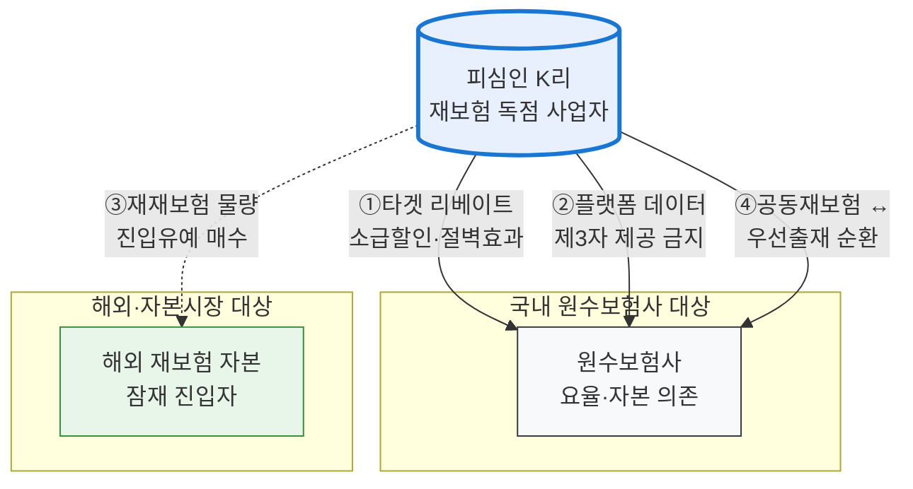

# 코리안리 가상사건 — 심사보고서 골격(IRAC 4시나리오) × 시장구조 통합본

> 작성: 2026-07-06 | 입력: 사용자 제공 ①IRAC 4시나리오 법리분석 ②심층 시장보고서(이하 '심층보고서') + 기존 검증 자료(보완조사 v2 2026-07-05, 실제사건보강 2026-07-02)
> 성격: 심사보고서 작성 직전 단계의 **법리 골격 + 사실 층 통합**. 사용자 제공 소스는 [보고서]로, 기검증 사실은 각주 검증표기로 구분. 내부 충돌 2건은 §5에 명시.
> 원시·선행: `9.작업중/클로드/조사원시_코리안리보완_2026-07-05.json`(이관 대기 — 진행기록 참조)

---

## 1. 총론 — 사건의 서사 구조

이 가상사건의 서사는 3막이다. 제1막은 실제 역사다: 국내우선출재제도(1963~1997)가 만든 독점이 제도 폐지 후에도 특약(전량출재·요율구득)·재재보험특약·패널·방어행위라는 다섯 개의 기둥으로 유지되다가, 2018년 공정위 제재와 2025년 대법원 파기환송(2020두54074 — "자발적 합의여도 시장지배적 사업자가 설정한 구조라면 배타조건부 거래", "단일한 의사 아래 이루어진 유기적 일체")으로 법적으로 해체되었다. 제2막은 가상의 현재다: 파기환송심 확정으로 독소조항이 폐기된 202X년, 피심인은 **조항 없이 같은 봉쇄 구조를 네 개의 우회 경로로 재구축**한다. 제3막이 심사보고서의 무대다 — 아래 네 시나리오를 "단일한 의사"의 법리로 다시 묶는 것.

이 구성이 강한 이유는 실제 판결이 이미 제2막의 원형을 인정했기 때문이다. 재재보험특약(국내 원수사 우선 배분)은 시나리오 4(순환거래)의, 패널구성(해외사를 협력사로 편입)은 시나리오 3(위장 제휴)의, 방어행위는 시나리오 1·2의 강제 메커니즘의 실화 판본이다.

## 2. IRAC 4시나리오 — 법리 골격 (사용자 분석 채택 + Fable 보강)

### 시나리오 1 — 타겟 달성형 충성도 리베이트 (사실상의 배타조건부 거래)

사용자 분석대로, 출재비율 80~90% 달성 시 **전체 거래액에 소급 적용되는 리베이트**는 명시적 전량출재 조항 없이도 배타조건부 거래를 구성한다. 규범의 축은 퀄컴 사건(대법원 2019. 1. 31. 선고 2013두14726 — law_api 검증 ✓, 공식 사건명 자체가 "배타조건부 리베이트 제공행위의 부당성 판단기준")이고, 2025년 코리안리 판결의 "합의 포함" 법리가 자발성 항변을 봉쇄한다. 포섭의 핵심은 **전환비용의 구조**다: 원수사가 물량의 일부만 해외로 돌려도 잔여 전체의 리베이트를 상실하므로, 해외 재보험사는 자기 몫의 요율 인하만으로는 경쟁할 수 없고 상실분 전체를 보전해야 한다(절벽 효과).

**Fable 보강 — 반드시 내장할 방어선 두 가지.** ①**효과입증**: Intel 사건에서 CJEU가 2024년 효과분석 없는 리베이트 당연위법 접근을 최종 폐기했고, 국내 퀄컴 판결도 RF칩 부분은 효과입증 부족으로 파기했다. 심사보고서에는 리베이트 도입 전후 해외 재보험사 점유율 정체·이탈 시도 원수사의 조건 악화 실증(가상 데이터)을 반드시 설계할 것. ②**AEC 관점 서술**: "동등하게 효율적인 해외 재보험사도 진입 불가능한 요율 구조"임을 수치 예시로 제시(미 DOJ v. Visa의 '전환의 세금' 산식 차용 가능). 실제 유사 제재로는 FTC v. Surescripts(2023 동의명령 — 명시조항 없는 all-unit discount, 20년 행위금지)와 ZF Meritor v. Eaton(3d Cir. 2012, 2015년 $5억 합의)이 있다.[기검증 — 보완조사 v2 각주 19·20]

### 시나리오 2 — 인프라 종속을 이용한 멀티호밍 차단 (구속조건부 거래)

요율 산출 플랫폼을 무상·저가로 제공하는 대가로 산출 데이터의 제3자(경쟁 재보험사) 제공을 금지하는 구조다. 사용자 분석이 든 네이버 부동산 CP 사건(2020 — 매물정보의 경쟁사 제공 금지 조항)과 구글 앱마켓 사례가 규범 축이며, '지식재산권 보호' 명분과 '멀티호밍 차단' 실질의 대비가 포섭의 핵이다.

**Fable 보강.** 이 시나리오의 사실적 설득력은 심층보고서의 협의요율 의존 수치가 만든다: 2016년 요율자율화 이후에도 **판단요율 사용은 사실상 0%에 수렴하고, 재산종합보험의 95.8%(2024 상반기 96.5% 초과 예상)·건설공사 90%·조립 95%·선박 99%가 협의요율에 의존**하며, 보험개발원 참조순보험요율은 할인·할증 폭이 ±5~10%로 제한되어 대형 계약의 프라이싱에 무용하다는 것[보고서 — 대외 인용 전 원출처 확인]. 즉 플랫폼은 '편의 제공'이 아니라 **이미 존재하는 데이터 병목의 계약적 고착화**다. 필수설비 법리(데이터 접근)와 연결하되, 네이버 자사우대 파기환송(2023두32709)의 "동등대우 의무 없음" 법리와 구별하는 논증 — 본 건은 자사우대가 아니라 **타사 거래 금지 조건**이므로 구별 실익 명확 — 을 한 단락 넣을 것.

### 시나리오 3 — 위장된 제휴를 통한 잠재경쟁자 역지불합의

재재보험 물량·우대 수수료를 대가로 해외 자본의 1차 시장 진입을 포기시키는 구조. 규범 축은 FTC v. Actavis(570 U.S. 136 — 기검증)의 rule of reason과 "우회적 가치 이전"의 포괄성(라이선스·공동판촉·No-AG — Cephalon $1.2B, J&J/Novartis 공동판촉형)이다.

**Fable 보강.** 실화 앵커가 이중으로 존재한다. ①실제 판결의 패널구성행위 — 해외사를 경쟁자가 아닌 재재보험 협력사로 편입한 행위가 이미 "단일한 의사"의 일부로 인정됨. ②**코리안리-칼라일 2020.7.31 전략적 제휴 MOU**(공동재보험 위험을 칼라일 소유 Fortitude Re가 재재보험 인수)와 FCA Re(버뮤다, 자본금 $7억+)의 실존[기검증 — 보완조사 v2 각주 23·24]. 심층보고서는 여기에 **아폴로 글로벌 매니지먼트-신한라이프 업무협약**이라는 추가 실화를 제공한다[보고서 — 확인 필요]. 가상 각색: "피심인이 국내 진입을 검토하던 글로벌 재보험 자본과 '진입 유예 ↔ 우대 재재보험 물량' 구조의 장기 계약 체결". 시장분할(§40①4호)과 시지남용(§5①4호 신규진입 방해)의 경합 구성.

### 시나리오 4 — 이종시장 지배력 레버리지 순환거래 (끼워팔기·거래강제)

K-ICS 자본위기에 처한 원수사에 대규모 공동재보험 인수를 제공하는 대가로 일반·항공 재보험 물량의 우선출재를 요구하는 구조. 규범 축은 FTC v. Consolidated Foods(1965, reciprocal dealing)와 퀄컴의 이종시장 연계다.

**Fable 보강.** 이 시나리오는 심층보고서가 밝힌 공동재보험 시장의 성격 덕분에 가장 시의성 있다: 공동재보험은 위험보험료만이 아니라 저축·부가보험료까지 출재해 **금리위험·해지위험을 통째로 이전**하는 자본성 거래이고, K-ICS·IFRS17 도입(2023)으로 "증자 없는 요구자본 절감"의 유일한 처방으로 부상했다[보고서]. 즉 주산물(자본 솔루션) 시장에서의 힘은 **원수사의 생존**을 쥔 힘이다. 실화 기반: 코리안리-신한라이프 2,300억·삼성생명 5,000억(합계 7,300억 규모)[기검증+보고서]. 경쟁 실황(코리안리·Swiss Re·RGA 3파전 — RGA-삼성생명 6,000억, Swiss Re-메리츠 6,000억)[기검증]은 피심인의 "공동재보험은 경쟁적" 항변 재료이므로, 심사관 서사는 "경쟁이 시작되자 피심인이 순환거래로 최대 물량(S사)을 봉쇄했다"로 구성한다. 강학상 끼워팔기(§45①5호)·거래상지위 남용(§45①6호)·시지남용(§5①3호) 경합.

### 시나리오 구조도

> 도식 규칙: TB·design-md 팔레트. 네 화살표를 "단일한 의사"로 괄호 치는 것이 심사보고서 위법성 판단의 결론부. [렌더 검증 대기]

## 3. 시장구조 사실 층 (심층보고서 편입 — 시나리오별 배치)

**시장 세분화와 지배력의 비대칭**(시나리오 1·2의 시장획정 재료). 재보험 시장은 단일하지 않다. 기업성 보험(재산종합·건설·조립·선박)에서는 협의요율 의존이 90~99%에 이르러 코리안리의 통제가 "철옹성"으로 유지되는 반면[보고서], 일반항공 등 초거대 위험에서는 공정위 제재로 패널이 해체되며 뮌헨리·스위스리·스코르가 원수사와 직접 협상하는 개방이 시작되었고, 자동차·실손 등 가계성 장기는 코리안리 스스로 디마케팅으로 철수 중이다[보고서]. 전체 점유율 하락(68.9%→56.5%)은 이 셋의 합성이므로, **피심인이 "점유율 하락=지배력 상실"을 주장하면 시장획정을 종목별로 좁혀 반박**한다 — 기업성 요율 병목 시장에서는 의존도가 오히려 90%대다.

**자본 한계와 '중개상' 비판**(시나리오 3·4의 동기 재료). 코리안리는 수재 물량의 상당분(과거 일반손보 최대 79%[보고서])을 해외로 재출재하며, 3년간 해외 유출 재보험료 약 13.5~14조 원·업계 누적 적자 2.7조 원의 길목에 서 있다[기검증+보고서]. 자체 연간 순이익(약 3,000억 원 안팎[보고서])으로는 조 단위 배상한도(무안 여객기 참사 1.5조 원[보고서 — 확인 필요])를 홀로 감당할 수 없다. 즉 **피심인의 힘은 자본이 아니라 길목**이며, 이것이 "자본 규모 대비 독점 지위"라는 사용자 명제의 서사 완성형이다.

**진입장벽의 3중 구조**(위법성 판단의 '봉쇄효과' 재료). 심층보고서는 최저자본금 인하(300억→100억, 2020.6[보고서 — 확인 필요]) 후 5년간 제2 전업사가 없는 이유를 셋으로 해부한다: ①반세기 로컬 실손해 통계의 독점(복제 불가능한 해자 — 신규자는 역선택 물량만 인수), ②캡티브 딜레마(원수사 출자 재보험사엔 경쟁 원수사가 영업기밀 유출 우려로 출재 기피 — 코리안리의 '중립적 전업사' 지위가 독점의 숨은 기반), ③국제 신용등급(코리안리 Moody's A1·S&P A[보고서] vs 신규자의 등급 부재 → K-ICS상 위험경감 인정 불가). 이 3중 장벽은 가상 시나리오의 행위들이 "이미 높은 구조적 장벽 위에 인위적 장벽을 얹는 것"임을 보여 주는 배경이 된다.

**경쟁 구도의 3주체**(피심인 항변과 그 재반박 재료). ①글로벌 PEF·재보험사(칼라일-Fortitude·아폴로, 스코르 8.3%·스위스리 5.8%[연도 충돌 — §5]), ②국내 원수사의 우회 진출 — 삼성화재의 싱가포르 삼성리(2011 설립, 2023 순익 197억, 2025 영업수익 3,493억[보고서])와 로이즈 캐노피우스 지분 40% 확보[보고서 — 확인 필요]: **캡티브 딜레마를 해외 플랫폼으로 우회한 실증 사례이자, 시나리오 4에서 S사가 '대안이 있었다'는 반사실의 근거**, ③코리안리 자신의 글로벌 전환(12개 거점·해외 매출 40%+·유럽 비중 28.1%·2024 최대실적 순익 3,187억[보고서]) — 심사관에게는 "국내 봉쇄로 지킨 현금흐름이 해외 확장의 밑천"이라는 서사, 피심인에게는 "국내 시장은 이미 경쟁적이며 우리는 세계에서 경쟁한다"는 항변이 된다. 심사보고서는 이 양면성을 정면으로 다뤄야 설득력이 산다.

## 4. 심사보고서 목차 제안 (다음 단계)

Ⅰ. 기초사실(연혁·시장 세분화·3중 진입장벽) → Ⅱ. 시장획정·지배력(종목별 획정, 88~90% 병목 시장) → Ⅲ. 행위사실(4시나리오 — 각 IRAC) → Ⅳ. 위법성(합의 포함 법리 + 단일한 의사 종합평가 + 효과입증) → Ⅴ. 피심인 항변 배척(자발성/점유율 하락/공동재보험 경쟁/글로벌 경쟁 — §3의 재반박 재료) → Ⅵ. 시정조치·과징금.

## 5. 내부 충돌·검증 대기 (은폐 금지 — #53-6)

첫째, **FCA Re의 설립 주체**: 심층보고서는 "칼라일이 포티튜드리를 통해 **신한라이프와 공동으로** FCA Re를 설립"이라 서술하나, 기검증 사실(Carlyle 공식 보도자료)은 **Fortitude Re와 칼라일**의 설립이며 신한라이프는 등장하지 않는다. 아폴로-신한라이프 MOU와의 혼선 가능성이 있으므로 **대외 인용 전 반드시 확인**. 둘째, **스코르 8.3%·스위스리 5.8%의 기준연도**: 심층보고서는 2023년, 기존 조사(한국공제신문)는 2022년 기준으로 표기 — 동일 수치의 연도 불일치이므로 원통계 확인 필요. 셋째, 심층보고서의 미검증 수치군(2024 순익 3,187억·해외매출 40%+·캐노피우스 40%·최저자본금 100억·협의요율 세부율·무안 1.5조)은 사용자 제공 소스로서 가상사건 설계에는 사용하되, 심사보고서 각주에는 [원출처 확인] 표시를 유지한다.

## 검증 상태

법리 축 기검증: 2020두54074 ✓·2019누41159 ✓·2013두14726 ✓·2023두32709 ✓·Actavis(연방대법원)·Surescripts/Eaton(다출처). 사용자 제공 두 텍스트는 #1 소스로 편입하되 위 §5 항목은 표기 유지. 도식 렌더·verify-text: 진행기록 마커 참조.
