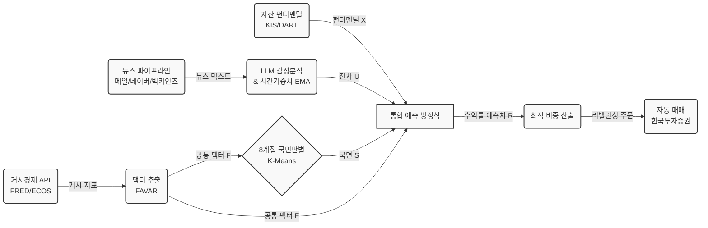

# 매크로 퀀트 시스템: API 아키텍처 및 데이터 파이프라인 설계

본 문서는 앞서 도출한 **'통합 매크로 퀀트 예측 모형'**을 실제 파이썬(Python) 기반 시스템으로 구현하기 위해 필요한 API 리스트, 각 API의 역할, 그리고 API만으로는 해결되지 않는 '공백 영역(Blind Spots)'과 그 해결책을 분석한 문서입니다.

---

## 1. 필수 API 리스트 및 역할 분담

통합 방정식의 각 변수를 채우기 위해서는 성격이 다른 여러 데이터 소스가 필요합니다.

### 1) 거시경제 팩터 ($F_t$) 및 국면($S_t$) 데이터
*   **FRED API (미국 연방준비은행):**
    *   **역할:** 글로벌/미국 거시 데이터(미국 국채 금리, CPI, 실업률, 장단기 금리차 등) 수집. 팩터 모델의 뼈대가 됨.
    *   **특징:** 무료, 파이썬 라이브러리(`fredapi`) 지원 완벽, 10만 개 이상의 데이터.
*   **한국은행 ECOS API:**
    *   **역할:** 한국 특화 거시 데이터(한국 기준금리, 수출입 동향, 외환보유액, 통화량 등) 수집. 한국형 국면 모델의 핵심.
    *   **특징:** 무료, 일/월/분기별 한국 경제 지표 총망라.
*   **yfinance (Yahoo Finance API 대체 라이브러리):**
    *   **역할:** 원/달러 환율(일별), 주요 원자재 가격(WTI, 금), VIX(변동성 지수), 글로벌 인덱스(S&P500) 데이터 수집.

### 2) 자산 펀더멘털 ($X_{i,t}$) 및 거래 실행 (Execution)
*   **한국투자증권 (KIS) Open API:**
    *   **역할:** 국내외 주식/ETF/채권의 실시간 가격, 과거 봉차트 데이터, 종목별 재무 비율(PER, PBR) 수집 및 **실제 매수/매도 주문 자동화**.
    *   **선정 이유:** 타 증권사(키움증권 등)는 32비트 윈도우 환경과 복잡한 접속 프로그램이 필수적이나, 한국투자증권은 REST API 방식을 제공하여 파이썬 64비트 및 클라우드(리눅스) 환경에서도 쉽게 봇을 돌릴 수 있음.
*   **Open DART API (금융감독원):**
    *   **역할:** 상장사의 분기/반기 재무제표 원본 데이터 크롤링 (딥 펀더멘털 분석 시).

---

## 2. API의 한계점과 공백 영역 (Blind Spots) 분석

API를 모두 연결하더라도, 헤지펀드 수준의 알파(초과 수익)를 내기 위해서는 기성 API가 주지 못하는 '빈틈'을 메워야 합니다.

### 공백 1: 비정형 데이터와 시장 심리 (Sentiment) 및 뉴스 수집 방안
*   **문제점:** 증권사 API와 경제 지표 API는 모두 '숫자(정형 데이터)'만 제공합니다. 파월 연준 의장의 발언 뉘앙스나 지정학적 위기(전쟁 등)에 대한 뉴스의 온도는 API 숫자로 바로 나타나지 않습니다.
*   **해결책 (LLM 연동):** 경제 뉴스나 연준 회의록 텍스트를 수집하여 **Claude/Gemini API**에 던져 매파/비둘기파 강도를 스코어링하고, 이를 나우캐스팅 잔차($\hat{u}^{now}_t$)로 씁니다.
*   **뉴스 수집(크롤링/API) 실무 방법론:**
    1.  **빅카인즈 (한국언론진흥재단 API):** 국내 주요 언론사 기사를 통합 검색할 수 있는 공공 API. 무료이며 형태소 분석 결과도 제공하여 한글 매크로 뉴스 분석의 표준입니다. (활용: 한국 거시경제 심리 지수 추출)
    2.  **블룸버그 (Bloomberg) / 연합인포맥스:** 글로벌/국내 매크로 뉴스의 끝판왕이지만, 봇 차단(Anti-bot) 기술이 매우 강력하여 Selenium 등 직접 웹 크롤링 시도 시 IP가 차단될 위험이 큽니다.
    3.  **가장 현실적인 대안 (RSS 피드 및 뉴스레터 파싱):** 블룸버그나 주요 언론사의 공개 RSS 피드를 파이썬 `feedparser` 라이브러리로 수집하는 방법입니다. 또는 퀀트용 이메일 계정을 파서 블룸버그/인포맥스 무료 뉴스레터를 구독한 뒤, 파이썬 `imaplib` 모듈로 이메일 본문 텍스트만 긁어오는(파싱) 방식이 봇 차단을 피하는 가장 스마트하고 안전한 크롤링 기법입니다.
    4.  **대중적 대안 (일반 뉴스 API):** `NewsAPI.org` (해외 중심)나 `네이버 뉴스 Open API` (하루 25,000건 무료)를 연동해 "금리", "환율", "수출" 등 특정 키워드의 기사 제목과 요약을 안정적으로 수신합니다.

### 공백 2: 실시간 나우캐스팅(Nowcasting)을 위한 고빈도 데이터
*   **문제점:** FRED나 ECOS의 거시 데이터는 짧아야 한 달(월간), 길면 분기(3개월) 단위로 늦게 발표됩니다(Lag 현상). 이는 시장의 실시간 변화를 잡기엔 너무 느립니다. 
*   **해결책 (대안 데이터 크롤링):**
    *   수천만 원짜리 신용카드 매출 데이터 API를 살 수 없으므로, **구글 트렌드(pytrends)나 네이버 데이터랩 API**를 활용해 소비자들의 특정 키워드(예: "자동차 할부", "실업급여") 검색량 변화를 실시간 소비 지표의 프록시(대체재)로 사용합니다.
    *   관세청 수출입 무역통계(10일 단위 발표) 등 최대한 발표 주기가 짧은 공공 데이터를 별도 크롤링하여 나우캐스팅 모델의 인풋으로 씁니다.

### 공백 3: 시스템 안정성과 연속성 (인프라 공백)
*   **문제점:** 로컬 PC에서 파이썬 스크립트를 돌리면, PC가 꺼지거나 인터넷이 끊길 때 매매가 정지됩니다.
*   **해결책 (Cloud & Task Scheduler):**
    *   AWS EC2나 Google Cloud Compute Engine 같은 클라우드 서버에 시스템을 올려 24시간 가동합니다.
    *   데이터 수집(장 마감 후) -> 팩터 추출 및 국면 판단(새벽) -> 매매 로직 실행(장 시작 전/후) 파이프라인을 `crontab`이나 `Airflow`로 스케줄링해야 합니다.

---

## 3. 뉴스 데이터 파이프라인 고도화 (Advanced NLP Pipeline)

비정형 뉴스 텍스트를 안정적으로 수집하고 노이즈를 줄여 완벽한 계량 지표($\hat{u}^{now}_t$)로 만들기 위해 현업 퀀트 엔지니어들이 사용하는 필수 기법입니다. 사용자가 제시한 두 가지 아이디어는 시스템의 안정성과 예측력을 결정짓는 핵심입니다.

### 1) 다중 파이프라인 (Redundancy & Fallback)
*   **개념:** 단일 소스(예: 네이버 뉴스 API)에만 의존하면, 해당 API 서버가 점검 중이거나 일일 할당량이 초과되었을 때 전체 트레이딩 시스템이 멈춰버리는 단일 장애점(SPOF) 문제가 발생합니다.
*   **구현 로직 (계층적 수집):**
    *   **Tier 1 (우선순위):** 이메일 파싱 (블룸버그/인포맥스 등 고품질 소스, 차단 위험 최하)
    *   **Tier 2 (보조):** 네이버 뉴스 API (실시간성 및 국내 속보)
    *   **Tier 3 (최후 보루):** 빅카인즈 API 또는 대체 RSS 크롤링
    *   파이썬 스크립트에 `try-except` 예외 처리 구문을 적용하여, Tier 1에서 데이터를 가져오는 데 실패하면 자동으로 Tier 2로 넘어가도록 설계합니다. 이렇게 하면 결측치(Missing Value) 없이 365일 무중단으로 심리 지수를 생성할 수 있습니다.

### 2) 시간 가중치 및 지수 평활법 (Time-Decay Sentiment Scoring)
*   **개념:** 금융 시장에서 '뉴스의 가치'는 시간에 따라 기하급수적으로 부패(Decay)합니다. 2주 전 파월 의장이 금리 인하를 시사한 뉴스보다 어제 터진 중동 전쟁 발발 뉴스가 오늘 주가에 훨씬 큰 영향을 미칩니다. 단순히 지난 한 달 치 뉴스의 심리 점수를 산술 평균($\frac{1}{n}$) 내면, 시장의 트렌드 변화에 너무 늦게 반응하는 '후행 지표'가 되어버립니다.
*   **구현 기법 (EMA 적용):** 
    *   이를 방지하기 위해 퀀트 모델에서는 **지수이동평균(Exponential Moving Average, EMA)** 또는 **시간 가중 롤링 윈도우(Time-Weighted Rolling Window)** 기법을 사용합니다.
    *   오늘 뽑은 뉴스 감성 스코어에는 1.0의 가중치를, 1일 전에는 0.9, 2일 전에는 0.81... 처럼 최신 뉴스일수록 기하급수적으로 더 강한 가중치($\lambda$)를 부여합니다.
    *   이렇게 처리하면 LLM이 추출한 나우캐스팅 잔차($\hat{u}^{now}_t$)가 과거의 낡은 노이즈에 끌려다니지 않고, **시장의 급격한 방향 전환(추세 변화)**을 실시간으로 예민하게 잡아낼 수 있습니다.

---

## 4. 전체 파이프라인 구조도 및 데이터 플로우 (Architecture & Data Flow)

우리가 논의한 모든 수학적, 엔지니어링적 요소를 결합한 통합 매크로 퀀트 시스템의 조감도입니다.

### 실행 사이클 (Data Flow)
1. **[Data Ingestion]** 매일 자정, API 서버들이 매크로와 가격 데이터를 당겨오고, **다중 파이프라인(Fallback)**이 뉴스를 안전하게 크롤링합니다.
2. **[Processing]** LLM이 뉴스를 읽고 감성 점수를 매긴 뒤 **시간 가중치(EMA)**를 적용하여 나우캐스팅 잔차($\hat{u}^{now}_t$)를 생성합니다. 거시 지표는 **충격 분해(Shock Decomposition)**를 거쳐 핵심 팩터($F_t$)로 압축됩니다.
3. **[Modeling]** 알고리즘이 현재 시장의 **'8계절(국면, $S_t$)'**을 재평가하고, 모든 변수 데이터를 예측 방정식에 대입하여 자산별 미래 기대 수익률을 계산합니다.
4. **[Execution]** 산출된 국면별 최적 자산 비중에 맞추어 한국투자증권 API를 통해 **실시간 자동 매매 주문**을 전송합니다.
