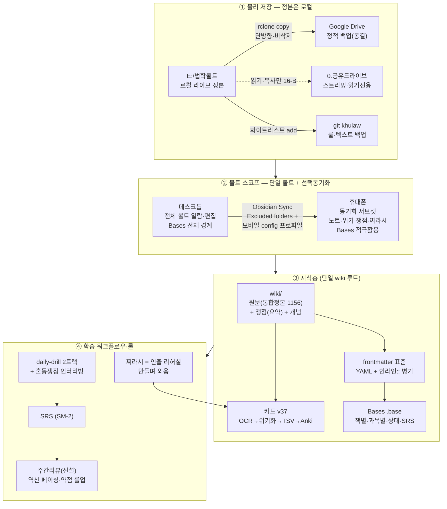

# 지금 필요한 구조 — 재설계 v2 + 구조도

> 검토만. 실행은 사용자 승인 후. 모든 이주는 비파괴(복사·검증 후 동결, 삭제금지 #16).

---

## 0. 리서치로 바뀐 핵심 정정 2가지

### 정정 ① "전체볼트 + 싱크 서브볼트(중첩 2볼트)"는 **개발팀 비권장** → **단일 볼트 + 선택동기화 + 기기별 config**가 정답
- Obsidian 개발팀: nested vault "지원 안 함, 깨질 수 있음". 영구손실은 없으나 **깨진 링크가 유령 노트 자동생성**·설정 이중관리.
- 결정적: 링크/백링크/그래프/Bases는 **연 볼트 경계 안에서만** 동작. 서브볼트가 바깥을 [[링크]]하면 휴대폰에서 깨짐.
- **권장(공식 메커니즘)**: 단일 볼트 + **Override config folder**로 데스크톱/모바일 설정 분리 + **Excluded folders 선택동기화**. → 데스크톱은 전체 경계에서 링크·Bases 끊김 없이, 휴대폰은 서브셋만. 사용자가 원한 "데스크톱 전체 열람 / 휴대폰 서브셋+Bases"를 **중첩 없이** 그대로 달성.
- Bases 주의: `.base`는 위치 무관 **볼트 전체**를 기본 스코프로 봄 → 폴더 한정하려면 `file.inFolder("...")` 필터 명시.

### 정정 ② Drive→백업 전환은 "복사→검증→동결" 순서면 무손상. **유일한 손실 경로 = 동기화 미완료 상태에서 로컬 폴더 삭제·전환**
- `rclone copy`(비삭제) 사용, `rclone sync`/bisync 금지(삭제 전파). 백업 전 앱 종료.
- 공유드라이브는 미러 불가·스트리밍 전용이라 **이주에서 구조적으로 보호**(#16-B 자동 충족).

---

## 1. 구조도 (4층)



---

## 2. 층별 설계

### ① 물리 저장
- **정본 = `E:\법학볼트\`(로컬)**. Drive 밖. 자동화 잦은쓰기·placeholder 손실·자원 churn 해소.
- **Google Drive = 정적 백업**(기존 사본 동결 + `rclone copy` 단방향 주기 백업). 백업 목적에 sync/bisync 금지.
- **공유드라이브 = Drive 잔류·읽기전용**(#16-B). 로컬 볼트에 미포함, 별도 접근.
- **VAULT_ROOT config 디커플**(이미 인프라 생성): 251개 하드코딩 경로를 단일 소스로 → 이주 시 1줄.

### ② 볼트 스코프 (단일 볼트)
- 볼트 루트 = `E:\법학볼트\`. 데스크톱은 전체 열람·편집.
- 휴대폰 = **Obsidian Sync 선택동기화**: 제외=outputs/·.agent/·원본 PDF·hwp·이미지. 포함=노트·wiki·찌라시·카드(.md). + **모바일 config 프로파일**.
- 동시편집 회피, 고유 파일명(중첩 안 쓰므로 위험 낮음).

### ③ 지식층 — 위키 이중화 해소
- **단일 `wiki/` 루트로 통합**(현 `sync/위키`+`sync/wiki` 혼재 → 하나로). 하위: `원문/`(통합정본 1,156논점, 인출 소스) · `쟁점/`(요약 압축, 시험직전) · 개념 아티클.
- **frontmatter 표준**: YAML(과목/쟁점/조문/판례/회독/중요도/상태/source/type) + 인라인 `주제::` 병기(카드 grep 보존). Bases는 YAML만 읽으므로 필수.
- **Bases**: 책별·과목별·상태·SRS-due 보드(`file.inFolder` 필터로 스코프 고정).
- **카드 v37**: 기존 파이프라인 유지(인과적 고가치 자산).

### ④ 학습 워크플로우·룰
- **카드+SRS = 기억엔진**(보호, 링크/위키로 잠식 금지).
- **찌라시 = 인출 리허설**(백지 재구성→압축→카드 환류). 단순 요약본 아님.
- **주간리뷰 신설**: 토요일, 주간 drill/SRS/사례 집계 → 역산 페이싱(마지막 3~4주 복습선점, 배점×난이도) → 미완 롤포워드 → 다음주 과목별 3토픽.
- **인터리빙**: 회독0 블록 → 회독1+ 혼동 쟁점 인터리빙.

---

## 3. 룰·스킬 보완 (학습 구조)

**신설**
- `weekly-review` 스킬 — 주간 집계·역산·롤포워드(최고 ROI 갭).
- `fix-renamed-links` 헬퍼 — log_file_op 연동·dry-run·공유드라이브 제외.
- CLAUDE.md **#48 OFM 작성 규약** — frontmatter YAML 병기·상태값·백링크·콜아웃 어휘.

**보완**
- `exam-compress`(찌라시) → "인출 리허설" 동선으로 재정의.
- `daily-drill` → 혼동 쟁점 인터리빙 명시.
- 진단표 → 누적 데이터 적재 시작(현재 빈 weak.json).
- 위키 경로 룰갱신 — `wiki/원문/_index.md` 정본 진입점 등재(HIGH divergence fix).

**거버넌스**
- CLAUDE.md 다이어트(상세는 skills/references).
- 절대룰 #16/#16-B/#16-C → **PreToolUse 훅** 결정론 강제.
- Bases 활성화·orphan/broken 탐지 플러그인·rename 링크갱신 설정 = 사용자 앱 작업.

---

## 4. 안전 이주 순서 (실행은 승인 후)
```
[ ] 0. 볼트 mirror/stream 확인
[ ] 1. Obsidian·편집도구 전종료
[ ] 2. Drive "동기화 완료(0건)" 확인 ← 손실방지 핵심 게이트
[ ] 3. 볼트를 E:\법학볼트\로 '복사'(이동 아님, 원본보존)
[ ] 4. E: 사본 열어 내용·개수·플러그인 검증 (이 시점 둘 다 존재=롤백가능)
[ ] 5. (검증 후에만) VAULT_ROOT를 E:로 변경 + 파일럿 스크립트 검증
[ ] 6. Drive 볼트폴더 동기화 해제·정적 동결 / 이후 rclone copy 백업
[ ] 7. 휴대폰 Obsidian Sync 선택동기화 + 모바일 config
※ 공유드라이브는 어느 단계도 건드리지 않음(미러 불가로 자동 보호)
```

---

## 5. 미결정 (사용자)
1. 볼트 방식: **단일+선택동기화(권고)** vs 중첩 2볼트(원안).
2. 위키 단일 루트 통합 시점(이동 수반 → 승인·로그).
3. 이주 시점(방학 권고, 시험기간 금지).
4. 절대룰 훅 강제 도입.
5. 회독: 진도_board 단일정본 유지(권고) vs Bases.

## 출처
- nested vault: forum.obsidian.md/t/nested-vaults-usage-and-risks/6360, /alternative-solution.../74201; obsidian.md/help/bases/syntax, /sync/settings
- Drive 백업전환: support.google.com/drive/answer/13401938·16631477; help.obsidian.md/sync/vault-types; rclone.org/commands/rclone_copy
- 학습: Dunlosky 2013·Karpicke 2011·Deng 2015·Brunmair 2019·crib sheet 2024 (검토의견서 참조)
