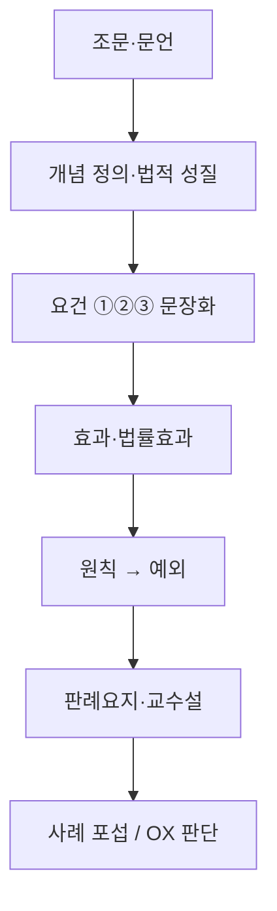

# 한국 대륙법식 노트 구조 가이드

## 1. 조사 메모
- 아주대학교 법학전문대학원 교과과정에는 `민법1·헌법1·형법1`을 이수한 뒤 `법문서의 작성`을 수강하도록 짜여 있고, 2학년 과정에 `요건사실론`이 별도 배치되어 있다.  
  [출처](https://lawschool.ajou.ac.kr/lawschool/curriculum/list-grad02.do)
- 위 자료를 기준으로 보면, 한국식 시험 노트는 단순 요약보다 `조문 → 요건 → 효과 → 항변/예외 → 판례 → 포섭` 순서로 배열될 때 실제 답안 작성과 객관식 판단에 더 바로 연결된다고 보는 것이 자연스럽다.
- 한국법제연구원도 `법학방법론(독일, 영미, 한국)의 전개`를 별도 주제로 다루고 있다.  
  [출처](https://www.klri.re.kr/kor/issueData/P/1045/view.do)
- 따라서 이 워크스페이스의 노트는 한국 대륙법식 배열을 기준으로, `문언 중심`, `요건 중심`, `원칙·예외 중심`, `판례 포섭 중심`으로 재정렬한다.

## 2. 공통 배열 원칙

### 📊 공통 독법

### 공통 정리 규칙
1. **조문부터 본다.** 번호만 적지 말고 핵심 문언이나 취지를 같이 적는다.
2. **개념은 정의형 문장으로 적는다.** 표만 두고 정의를 빼지 않는다.
3. **요건은 ①②③ 문장으로 적는다.** 단어 나열보다 문장형이 암기에 유리하다.
4. **효과를 따로 적는다.** 성립 여부만 적고 효과를 빼면 사례형에서 막힌다.
5. **원칙·예외를 반드시 분리한다.** 가능하면 도표나 다이어그램으로, 불가하면 문장으로라도 같이 적는다.
6. **판례는 어느 요건에서 결론이 갈렸는지 보이게 적는다.** 긴 사실관계보다 판단기준 한 줄이 우선이다.
7. **마지막에 실제 사용형 문장으로 닫는다.** 민법은 청구구조, 헌법은 선지판단, 형법은 포섭문장으로 끝낸다.

## 3. 과목별 독법

### 민법
1. `누가 누구에게 무엇을 청구하는가`를 먼저 잡는다.
2. 청구권 기초 조문과 법률효과를 본다.
3. 성립요건 ①②③을 확인한다.
4. 항변과 재항변, 원칙과 예외를 붙인다.
5. 관련 판례와 원고/피고 공방 구조를 본다.
6. 마지막에 모답형 문장으로 다시 읽는다.

### 헌법
1. 관련 헌법조문 원문 또는 핵심 문언을 먼저 본다.
2. 개념 정의를 짧게 정리한다.
3. 심사기준, 판단단계, 숫자기준을 붙인다.
4. 원칙과 예외, 비교기준을 나눈다.
5. 결정례 한 줄과 맞는 선지 문장으로 닫는다.

### 형법
1. 관련 조문과 체계적 지위를 먼저 본다.
2. 구성요건, 위법성, 책임 중 어디 문제인지 구분한다.
3. 성립요건 ①②③을 문장형으로 본다.
4. 원칙과 예외, 학설과 판례를 나눠 본다.
5. 사례 포섭문장이나 답안형 문장으로 마무리한다.

## 4. 이번 노트 반영 방식
- 각 과목 상단에 `한국 대륙법식 읽는 순서`를 추가한다.
- 민법은 `청구권기초 → 요건사실 → 항변` 축을 먼저 보이게 한다.
- 헌법은 `조문 → 개념 → 심사기준 → 결정례 → OX` 축을 먼저 보이게 한다.
- 형법은 `조문 → 체계적 지위 → 원칙·예외 → 판례 → 포섭` 축을 먼저 보이게 한다.
