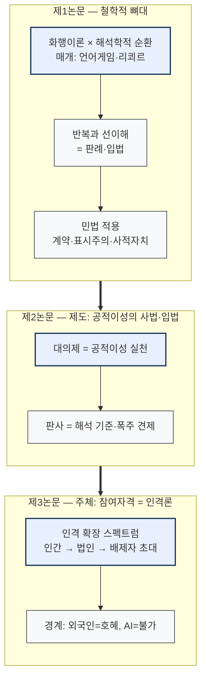

# 논문 설계 — 3부작 뼈대 구조·목차·타당성 (화행이론×해석학적 순환×공적이성×인격론)

> 작성: 2026-07-03 | 입력: 사용자 구조안(3부) + DBpia AI 보고서(8장) + 로컬 원문 29편(`sync/9.작업중/클로드/markdown/`) + 기존 자료조사(`논문초안_법철학민법_자료조사_2026-07-03.md`)
> 결론 먼저: **한 논문 불가 판단에 동의 — 3부작 분할 권고.** 제1논문(철학적 뼈대×민법)이 문헌 밀도·완성 가능성 최고 → 먼저 집필. 구조도·목차·재고 매핑·타당성·추가 필요 문헌 순.

---

## 1. 뼈대 구조도 (검증: mmdc 렌더 2026-07-03)

> 도식 규칙: TB 고정·subgraph 세로 적층(단일 열, A4 안전)·design-md 팔레트. 연결 논리: **뼈대(어떻게 법이 말해지고 해석되는가) → 제도(누가 공적으로 말하는가) → 주체(누가 말할 자격을 갖는가)**.

## 2. 3부작 분할과 각 논문의 한 줄 주제

| 논문 | 사용자 구조 | 한 줄 주제 | 착수 순서 |
|---|---|---|---|
| **제1논문** | 1.1~1.5 | 언어게임·리쾨르를 매개로 화행이론과 해석학적 순환을 접속하고, 민법 법률행위(계약·표시주의·사적자치)를 그 위에서 재구성 | **1순위** |
| 제2논문 | 2.1~2.3 | 순환의 '기준점'을 제도화한 것이 공적이성 — 대의제(입법)와 판사(해석·견제)의 역할 분배 | 2순위 |
| 제3논문 | 3.1~3.6 | 공적이성 게임의 참여자격으로서의 인격 — 확장의 역사(법인·배제자 초대)와 경계(외국인=호혜, AI=불가) | 3순위(공백 최다) |

분할 근거: ①각 부가 독립된 연구질문·문헌군 보유 ②제1논문의 이론틀이 제2·3의 방법론이 됨(순차 인용 구조) ③한 편에 다 넣으면 8장×10쪽 뎁스 불가.

## 3. 제1논문 목차 (묶을 목차)

**가제**: "화행과 순환 — 언어게임과 리쾨르를 매개로 한 법률행위론의 해석학적 재구성"

| 장 | 내용 (사용자 구조 매핑) | 주 문헌 |
|---|---|---|
| I. 서론 | 문제제기: 의사표시는 '말'이고 법은 그 말의 반복적 해석이다 | — |
| II. 화행이론과 해석학적 순환의 접속 (1.1) | 오스틴·설 화행 ↔ 가다머 순환의 이론적 매개: ①비트겐슈타인 **언어게임·규칙 따르기**(반복 속 의미) ②**리쾨르**(텍스트의 자율화·거리두기·전유 — 발화가 텍스트로 고정되어 해석에 열림) ③국내 선행: 손제연 '화행적 수인(uptake)과 해석적 수렴' | 손제연(2025)★로컬, 박서현(2009)★로컬, 이관표(2023), [공백: 리쾨르×법·언어게임×법 — §6] |
| III. 순환의 기준점 (1.2 '판단기준이 되는 누군가') | 선이해의 담지자 — 누구의 지평이 융합의 축인가: 법관·입법자·공동체. 제2논문 예고 | 양천수(2016)★로컬, 강희원(2019) |
| IV. 게임의 반복 — 판례와 선이해 (1.3·1.4) | 판례=언어게임의 반복적 플레이(선결례의 안정화)·입법=선이해의 갱신. 대법원 해석기준 서열론·법해석론 흐름 | 이재승(2009), 이계일(2015)★로컬, 공두현(2019)★로컬, 임형준(2025) |
| V. 민법에의 적용 (1.5) | ①의사표시=선언화행(제도적 사실 창설) ②의사주의·표시주의 논쟁의 화행론적 재해석(발화수반력의 귀속 문제) ③계약=약속의 자기구속 ④사적자치=사인의 자기입법(제1↔제3논문 가교) | 김기영(2021), 안춘수(2003)·송덕수(1991)[비KCI 고시지 — 배경용], 박희호(2025), 계약에 대한 법철학적 일고찰★로컬 |
| VI. 결론 | 순환의 기준점(제도)과 참여자격(인격)으로의 전망 — 후속 2편 예고 | — |

★로컬 = `markdown/` 폴더에 원문 확보됨.

## 4. 제2·3논문 개요 목차 (스케치)

**제2논문** "순환의 제도화 — 공적이성으로서의 대의제와 해석자로서의 법관"
- I. 서론 → II. 해석학적 성찰의 기준이 되는 판사(2.1: 이계정 2022 — 가다머로 입법자 의사 구속 부정, 김도균 2021 '법적 공적이성') → III. 공적이성으로서의 대의제(2.2: 김명식·김동하·심우민, Matczak 입법의도 3화행) → IV. 폭주 방지와 견제(2.3: 사법적극주의 — 윤진수 2020 성공보수, 공두현 2019, 민선홍 2025 헌법논증) → V. 결론

**제3논문** "공적이성 게임의 참여자격 — 인격의 확장과 경계"
- I. 서론 → II. 인간의 기준=입법권 참여(3.1: 칸트 자기입법 — 임미원) → III. 법의 변천사·확장(3.2·3.4: 아렌트 '권리를 가질 권리'★로컬, 노예·아동·장애인의 투쟁과 제한적 초대 — 김휘택 2025 '말할 수 없도록 고안된 존재', 랭턴 illocutionary disablement) → IV. 결사=법인격(3.3: 법인본질론) → V. 외국인=호혜적 대상(3.5: 만민법 시리즈 — 손철성·박정원·인지훈) → VI. AI — 공적이성 주체 불가(3.6) → VII. 결론

## 5. 로컬 재고 매핑 (markdown/ 29편 → 구조 배치)

| 구조 | 로컬 원문(★=확보) |
|---|---|
| 1.1 접속 | 법의 해석적 수렴 이론★, 하이데거의 해석학적 순환에 대하여★, 해석학적 순환의 인식론적 구조와 존재론적 구조★, 수행문에서 상징권력으로(부르디외)★, 읽기와 법해석★, 행위로서의 법해석과 집합적 행위의 합리성★ |
| 1.3·1.4 판례 | 법해석기준의 서열론★, 대법원 법해석론의 흐름★, 대법원 법해석론의 공통 전제와 대립 지점(2022두 판례평석)★, 법률해석의 목표(김영환)★, 법해석학의 철학적 기초★(2부) |
| 1.5 민법 | 계약에 대한 법철학적 일고찰★ |
| 2 공적이성 | 공적 이성과 헌법 논증(민선홍)★, 롤즈의 공적 이성과 심의민주주의(김명식)★, 공적 이성 한계와 중첩적 합의(김은희)★, 정치적 자유주의의 철학적 기초(박정순)★ |
| 3 인격론 | 아렌트 '권리를 가질 권리'★, 기호화된 소외·소수자★, 칸트의 법(Recht) 관념★, 국제 정의의 정치적 구성(만민법)★, 랑시에르 민주주의★ |
| 미확인 | KCI_FI00148 1285(임미원 아감벤 추정)·FI001549041·FI002119611·FI002513315·FI002921411·FI003093508(송석랑 추정)·FI003274235 — **파일 열어 서지 확인 필요** |

## 6. 타당성 평가 (Fable 검토)

1. **제1논문 — 타당성 높음(권고)**: 로컬 원문 밀도 최고(II~V장 전 구간 커버). ⚠️경합 리스크 2건 관리 필요: ①**손제연(2025) '해석적 수렴 이론'이 화행적 수인×해석 결합을 이미 선점** → 본 논문의 차별화는 (a)언어게임·리쾨르라는 **매개 이론화** (b)**민법 도메인**(계약·표시주의·사적자치) 적용. ②김기영(2021)이 의사표시=선언화행 선점 → V장은 김기영 위에서 **의사주의·표시주의 논쟁의 화행론적 재해석**과 **사적자치=자기입법 가교**로 확장.
2. **제2논문 — 중상**: 김도균(2021)·민선홍(2025)·이계정(2022) 등 최신 자원 풍부. '대의제 폭주 방지' 프레임은 헌법학의 사법심사 정당성 논쟁과 접속 필요(문헌 추가 여지).
3. **제3논문 — 독창성 최고·리스크 최고**: 법사(노예·아동)+법인론+이주(만민법)+AI를 관통 — 스팬이 가장 넓고 공백 최다(§7). 권고: 3.1~3.6을 **"공적이성 초대의 문턱(threshold)"이라는 단일 렌즈**로 묶어 각 절이 문턱의 이동 사례가 되도록 — 백과사전식 나열 방지.
4. **DBpia AI 보고서 인용 주의**: 기존 핸드오프에서 저자 오기·실재불가 문헌이 확인된 전례 — DBpia 보고서의 서지도 **인용 전 개별 검증 필수**. 기검증 겹침: 김기영·양천수·김명식·김은희·박정순·손철성 등(기존 자료조사 파일 참조). 신규 인용(이계일·공두현·손제연·김도균·이계정·이행남·박희호·김동하·황소희·김휘택·도미야마·Matczak·Picazo)은 로컬 원문 있으면 그것으로 검증 갈음, 없으면 KCI 대조 필요.
5. **분량**: 제1논문 기준 II장(이론 접속)이 과체중 위험 — 언어게임·리쾨르 중 하나를 주 매개로, 다른 하나는 보조로 (리쾨르 주매개 권고: '텍스트의 자율화'가 화행→해석 이행을 직접 설명).
6. **공백 조사 반영(2026-07-04)**: ①리쾨르×법 국내 논문 부재 확인 → **II장의 리쾨르 매개가 그 자체로 신규 기여**(준용 자원 5편 확보, §7-1) ②언어게임×법은 권경휘 계보(2007·2013·2024)+안성조(2013)가 선행 — II·IV장은 이를 딛고 '판례=게임의 반복'으로 확장 ③제3논문 3.6은 "AI의 공적이성 주체성" 정면 논문 부재가 확인되어 독창성 확보(자원: 정태창 '자아 없는 자율성'·김건우 2023).

## 7. 공백 조사 결과 (2026-07-04 완료, Sonnet 4각도 — 원시데이터 `w8fnf5pcs.output`)

### 7-1. 리쾨르 × 법 — ★국내 정면 논문 부재 확인 (제1논문 II장의 기여 공간)
7회 검색에도 리쾨르 『법의 영역에서(Le Juste)』·법해석학을 표제로 다룬 KCI 논문 없음. **준용 자원 5편**(전부 실재확인·KCI):
- 이양수, 「리쾨르와 비판적 프로네시스」, 철학탐구 제37집 (2015) — **규범을 구체적 상황에 적용할 때의 갈등 해소** = 법의 규범-사안 문제에 직접 원용
- 유기환, 「『이방인』의 살인사건과 리쾨르의 삼중의 미메시스」, 프랑스어문교육 제35호 (2010) — **재판에서 동일 사실이 당사자별로 다르게 형상화**되는 과정 = 법정 서사 분석의 실례
- 양명수, 「폴 리쾨르의 해석학과 신학 — 텍스트 이론을 중심으로」, 신학사상 127호 (2004) — **텍스트의 자율화**("이해는 해석의 열매") = 법텍스트가 입법자 의도를 넘어 말한다는 명제의 이론 기초
- 김애령, 「서사 정체성의 구성적 타자성」, 해석학연구 제36호 (2015) — 서사적 동일화의 폭력 위험 = 판결 서사 비판
- 전종윤, 「리쾨르의 정치적 역설」, 현대유럽철학연구 제46호 (2017) — 권력의 합리성과 악의 역설(제2논문 자원)

### 7-2. 비트겐슈타인 언어게임 × 법 — 권경휘 계보 존재 (딛고 설 선행연구)
- **권경휘, 「비트겐슈타인의 규칙-따르기 고찰과 법이론」, 법철학연구 제10권 1호 (2007)** [부분확인 — 후속 논문 참고문헌 교차확인, 초록 미열람] — 국내 최초기 핵심
- 권경휘, 「법해석론에 있어서 언어철학의 잘못된 적용에 대한 비판 — 후기 비트겐슈타인의 관점에서」, 법철학연구 (2013) [부분확인]
- **안성조, 「삶의 형식과 법의 지배」, 법철학연구 제16권 1호 (2013)** [실재확인] — 삶의 형식의 일치가 규범 판단 일치·법치의 전제조건, 하트 중심부 사례 설명
- 권경휘, 「법적 규칙에 대한 하트의 이해방식」, 법철학연구 제27권 1호 (2024), 30-84 [실재확인]
- 박만엽, 「'규칙따르기 역설'에 대한 크립키 논증의 비판적 분석」, 논리연구 제9권 1호 (2006) [실재확인, 철학 분야 기초]
- 공두현(2024 행위로서의 법해석★로컬)이 권경휘(2007)·『철학적 탐구』를 기초로 활용 — 로컬 원문과 연결
- 미발견: 크립키 역설을 법적용에 전면 적용한 법학 논문 — 잔여 공백

### 7-3. 법인격·인격 확장사 (제3논문 III·IV장)
- **김건우, 「법인격론의 최근 연구 동향」, 법철학연구 제24권 3호 (2021)** [실재확인] — Naffine·Kurki 등 서구 법인격론(동물·AI·태아로의 확장) 소개 = III·IV장 이론 지도
- **송호영, 「법인격의 형성과 발전 — 새로운 법인격 개념의 정립은 필요한가?」, 재산법연구 제38권 2호 (2021), 23-56** [실재확인] — **사비니 의제설 vs 기르케 실재설 재조명 + AI 법인격 회의론**(인간중심 옹호) = 3.3 결사=법인격의 축
- 임미원, 「아렌트의 '권리를 가질 권리' 개념의 기초적 고찰」, 법철학연구 제22권 1호 (2019) [실재확인, ★로컬 원문과 매치] — 3.4 배제자 초대의 이론 축
- 김종세, 「아동인권과 아동학대」, 법학연구 제31집 (2008) [실재확인] — 아동=권리주체 전제
- 미발견: 노예·여성·아동·장애인을 아우르는 권리주체성 확장사 **종합** 논문 — 개별사 문헌을 모아 본 논문이 종합하는 구도로 전환(=기여)

### 7-4. AI 인격 (제3논문 VI장 — 3.6 'AI=공적이성 주체 불가' 논증 자원)
- **김건우, 「인공지능 법인격 논쟁 다시 보기 — 철학적 분석」, 법철학연구 제26권 3호 (2023), 205-246** [실재확인] — 긍정·부정론 양쪽의 '인격↔법인격 필연 연결' 전제 비판
- **정태창, 「자아 없는 자율성 — 인공 지능의 도덕적 지위에 대한 고찰」, 사회와 철학 제40호 (2020)** [실재확인] — **자기이익 없는 자율성은 도덕적 지위 근거 불가** = 3.6 핵심 논거
- 신현탁, 「인공지능(AI)의 법인격 — 전자인격 개념에 관한 소고」, 인권과 정의 통권 478호 (2018) [실재확인] — EU 전자인격 검토·동등 지위 부정
- 이해원, 「인공지능과 법인격 — 불법행위책임의 관점에서」, 법조 제70권 4호 (2021) [실재확인] — 3측면 모두 부정, 책임은 제조자·이용자 귀속
- 김건우, 「법적 주체로서 자율적 인공지능 로봇 I」, 성균관법학 제30권 2호 (2018) [실재확인] — 부정론·의제론·유추론 3관점 유형화
- 한희원, 「AI의 법인격 주체성의 논리적 기틀에 대한 기초 연구」, 중앙법학 제20집 3호 (2018) [실재확인] / 박욱주, 「인공 에이전트의 정보적 존재자성과 도덕적 책임주체성」, 법철학연구 제23권 1호 (2020) [언급]
- ★미발견: **AI의 민주적 담론·공적이성 주체성을 정면으로 다룬 논문 부재** — 3.6이 "공적이성 참여자격" 프레임으로 이 공백을 메우는 것이 제3논문의 독창적 기여

## 8. 다음 단계

1. §7 조사 결과 병합(진행 중) → 제1논문 참고문헌 목록 확정.
2. `markdown/KCI_FI*.md` 7편 서지 확인·매핑.
3. 제1논문 II장(이론 접속) 초고 집필 착수 — 리쾨르 주매개 구도.
4. DBpia 보고서 신규 서지 중 로컬 미확보분 KCI 검증(특히 Matczak 2017·Picazo 2022 해외 문헌).
