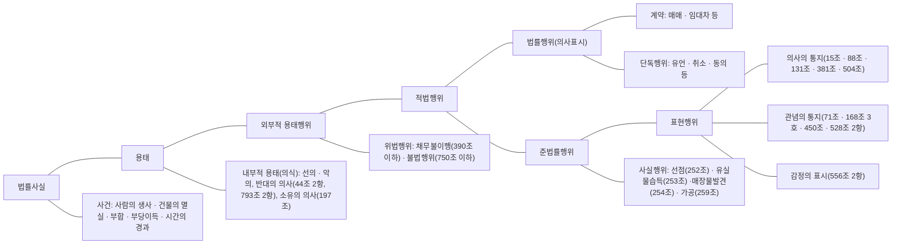

# 김준호 민법강의 민법총칙 (김준호) — p.151-180 [llamaparse 미교정]

<!-- p.151 -->

음과 같은 특수성이 인정된다. ① 예컨대 금전을 도난당한 경우처럼 타인의 수중에 들어간 금전에 대해서는, 금전 자체를 특정 짓기가 어려우므로(다른 금전과 뒤섞여 혼화(混和)(258조)가 생기는 점에서도 그렇다), 그 금전에 대한 물권적 청구(도난당한 금전의 반환청구)는 인정되지 않는다. 채권으로서의 부당이득 반환청구나 불법행위로 인한 손해배상청구를 할 수 있을 뿐이다. ② 금전은 사용대차나 임대차의 목적이 될 수 없고, 소비대차의 목적(598조)이 될 수 있을 뿐이다. ③ 금전채권에는 목적물의 특정이란 것이 없어 이행불능이 생기지 않고, 이행지체만이 생길 뿐이다. 민법은 금전채무의 이행지체에 따른 손해배상에 관하여 금전의 특성을 반영하여 특칙을 두고 있다(397조). ④ 도품이나 유실물이 금전인 경우에는 선의취득을 제한하는 특례(피해자 또는 유실자가 도난 또는 유실한 날부터 2년 내에는 반환을 청구할 수 있다는 것)가 적용되지 않는다(250조).

### Ⅳ. 주물과 종물

**사례** 甲은 백화점 건물을 소유하고 있는데, 이를 A에 대한 채무의 담보로 1986. 1. 28. A 앞으로 저당권을 설정하였다. 한편 甲의 채권자 己은 1987. 1. 26. 위 백화점 건물의 지하 2층에 있는 전화 교환설비에 대해 압류를 하였다(이 설비는 볼트와 전선 등으로 위 건물에 고정되어 있기는 하나 쉽게 분리할 수 있는 상태에 있다). 그 후 A의 저당권에 기한 경매신청으로 백화점 건물을 B가 경락을 받아 소유권을 취득하였는데, 己은 전화 교환설비에 대해 강제집행을 신청하였다. 己의 신청은 인용될 수 있는가? <mark>해설</mark> p. 152

> 

> **제100조 (주물, 종물)** ① 물건의 소유자가 그 물건의 상용을 위하여 자기 소유인 다른 물건을 이에 부속시킨 경우에는 그 부속물은 종물이다. ② 종물은 주물의 처분에 따른다.

#### 1. 의 의

민법(특히 물권법)은 명확성과 거래의 안전을 위해 단일물을 원칙으로 한다. 그런데, 각각 독립된 두 개의 물건 사이에 한편이 다른 편의 효용을 돕는 경우가 있다. 배와 노, 자물쇠와 열쇠, 말과 안장, 주택과 창고 등의 관계가 그러하다. 여기서 전자를 주물主物이라 하고, 후자를 종물從物이라고 한다. 본조 제1항은 종물의 요건에 관해 규정하고, 제2항은 그 효과로서 종물은 주물의 처분에 따르는 것으로 하여 그 경제적 효용을 높이려고 한다. 따라서 주물만을 처분하기로 한 경우에는 이를 주장하는 자가 그 사실을 입증하여야 한다.

#### 2. 종물의 요건

본조 소정의 종물로 인정되려면 다음의 네 가지 요건을 갖추어야 한다. (ㄱ) 종물은 주물의 '상용常用'(통상적 사용)에 이바지하는 것이어야 한다. 일시적 용도에 쓰이는 물건은 종물이 아니고, 주물의 효용과는 직접 관계가 없는 물건, 예컨대 TV · 책상 · 식기 등은 가옥의 종물이 아

<!-- p.152 -->

니다. 농지에 부속된 양수시설, 횟집건물에 붙여서 지은 수족관건물, 주유소에 있는 주유기는 각각 그 종물에 해당한다(대판 1967. 3. 7, 66누176; 대판 1993. 2. 12,92도3234; 대판 1995. 6. 29, 94다6345). (ㄴ) 종물은 주물에 ‘부속’된 것이어야 한다. 이것은 주물과 종물이 어느 정도 밀접한 장소적 관계에 있는 것을 말한다. 한편 주물의 소유자가 부속시켰음을 요하지 않는다. 예컨대 임차인이 주택에 부속시킨 물건도 소유자가 이를 매수하면 주택의 종물이 된다. (ㄷ) 종물은 주물로부터 ‘독립된 물건’이어야 한다. 주물의 일부이거나 구성부분을 이루는 것은 종물이 아니다. 종물은 부동산이나 동산을 가리지 않는다. 예컨대 주택에 딸린 광은 주택에 대한 종물로서 부동산이다. (ㄹ) 주물과 종물은 모두 ‘동일한 소유자’에게 속하는 것이어야 한다(대판 2008. 5. 8, 2007다36933, 36940). 종물은 주물의 처분에 따르게 되는데, 양자의 소유자가 다른 경우에는 종물에 대해 이유 없이 소유권을 잃게 되기 때문이다. 다만, 주물과 종물에 대해 선의취득(249조조)의 요건을 갖추어 소유권을 취득하는 것은 별개이다.

> 〈참 고〉 민법은 「종물」과 구별되는 것으로 「합성물」과 「부속물」의 개념을 인정하고 이에 관해 규정한다. (ㄱ) 부동산에 다른 동산이 부합하거나(256조조), 또는 동산 간에 부합이 이루어져 분리할 수 없거나 그 분리에 과다한 비용을 요할 경우에는(257조조), 그 물건을 한 개의 물건으로 처리하여 부동산의 소유자 또는 주된 동산의 소유자가 부합한 물건의 소유권을 취득하는데, 이때의 그 물건 전체를 ‘합성물’이라고 한다. 여기서는 그 부합물이 독립된 별개의 물건이 되지 못하고 그 구성부분을 이루는 점에서, 또 소유자가 서로 다른 물건이 어느 누구의 소유로 귀속되는 점에서 종물과는 다르다. (ㄴ) 건물의 임차인이 사용의 편익을 위해 임대인의 동의를 받아 임차물에 부속시킨 물건이 있거나 또는 임대인으로부터 매수한 부속물에 대하여는, 임차인은 임대차 종료시에 임대인에게 그 부속물의 매수를 청구할 수 있는데(646조조), 이때의 ‘부속물’은 건물의 구성부분이 아니라 독립된 물건이어야 하지만, 이것은 임대차에 수반하여 발생하는 효과라는 점에서 종물의 취지와는 다르다.

# 3. 종물의 효과

(1) 「종물은 주물의 처분에 따른다」(100조2항). (ㄱ) 이 ‘처분’에는 소유권의 양도나 물권의 설정과 같은 물권적 처분뿐만 아니라(특히 민법 제358조는 저당권의 효력은 저당부동산의 종물에 미치는 것으로 규정한다), 매매 · 임대차와 같은 채권적 처분도 포함한다. 그리고 처분행위 외에 법률의 규정에 의해 권리변동이 있는 경우에도 위 원칙이 적용된다. 그러나 점유를 요건으로 하는 권리, 예컨대 취득시효에 의한 소유권 취득(245조이하) · 유치권(320조조) · 질권(329조조)의 경우에는, 그 권리의 성질상 주물 외에 종물에 대해서도 점유가 필요하며, 주물만을 점유한 경우에는 종물에 대해서는 위와 같은 권리가 인정되지 않는다. (ㄴ) 법률행위에 의한 물권의 변동과 관련하여 주물에 대해 공시방법을 갖춘 경우에는(등기 또는 인도;186조 · 188조) 종물에 대해 따로 공시방법을 갖추지 않더라도 본조에 의해 당연히 종물에 대한 물권변동의 효력이 생기는가? 본조는 물건의 경제적 효용이라는 관점과 당사자의 의사를 고려하여 종물을 주물의 처분에 따르게 하자는 데 그 취지가 있는 것이고, 물권변동에서 필요한 공시방법은 이와는 별개의 것이다. 요컨대 민법 제100조 2항을 제187조 소정의 ‘법률의 규정에 의한 부동산물권변동’으로 이해하여서는 안 된다. 판례

<!-- p.153 -->

도, 지상권이 있는 건물을 매도한 경우에, 그 매매의 대상에는 제100조 2항의 유추적용에 의해 건물 외에 지상권도 포함되지만, 매수인이 지상권을 취득하기 위해서는 건물에 대한 소유권이전등기 외에 지상권에 대해서도 이전등기를 하여야 한다고 한다($\text{대판(전원합의체) 1985. \atop 4. 9, 84다카1131, 1132}$). (ㄷ) 채권자가 종물에 대해서만 강제집행을 하는 것은 허용되지 않는다($\text{공장 및 광업재단 저 \atop 당법 8조 2항 참조}$). 주물과 함께 강제집행을 하여 경락인(매수인)으로 하여금 일괄 매수케 하는 것이 물건의 효용상 바람직하며, 또 그렇게 하더라도 채권자에게 특별히 불리할 것이 없기 때문이다.

**(2)** 본조는 강행규정이 아니다. 따라서 당사자는 특약으로 주물을 처분할 때에 종물을 제외할 수 있고, 종물만을 따로 처분할 수도 있다($\text{대판 2012. 1. 26, \atop 2009다76546}$). 다만 저당권의 경우에는 이러한 취지를 등기하여야만 제3자에게 대항할 수 있다($\text{358조 단서, 부동산 \atop 등기법 75조 1항}$).

### 4. 주된 권리와 종된 권리에의 유추적용

본조가 규정하는 주물과 종물은 물건 상호간의 관계에 관한 것이지만, 이러한 결합관계는 주된 권리와 종된 권리 간에도 유추적용된다($\text{통 \atop 설}$). 이 경우 어떤 권리를 다른 권리에 대하여 종된 권리라고 할 수 있으려면 종물과 마찬가지로 다른 권리의 경제적 효용에 이바지하는 관계에 있어야 한다($\text{대판 2014. 6. 12, \atop 2012다92159, 92166}$). 예컨대 원본채권이 양도되면 이자채권도 함께 양도되고, 건물이 양도되면 그 건물을 위한 대지의 임차권이나 지상권도 함께 양도한 것으로 된다($\text{대판 1996. \atop 4. 26, 95 \atop 다 \atop 52864}$).

> <mark>사례의 해설</mark> 저당권의 효력은 그 설정 당시는 물론이고 설정 후의 저당부동산의 종물에 미친다($\text{358조 \atop 본문}$). 사례에서 ‘전화 교환설비’가 백화점 건물의 종물로 인정된다면, 압류에 앞서 저당권이 설정되고 그 저당권에 기해 경락을 받은 것이므로 B는 저당권의 효력이 미치는 전화 교환설비에 대해서도 소유권을 취득하고, 따라서 乙의 강제집행에 대해 제3자 이의의 소를 제기할 수 있다($\text{민사 \atop 집행 \atop 법 \atop 48조}$). 결국 위 설비가 종물로 인정될 것인지가 문제되는데, 그 시설 상태로 보아 독립된 동산으로 인정되기는 하나 그 용도에 비추어 백화점 건물의 효용상 필요한 시설로서, 즉 위 건물의 통상적 사용에 이바지하는 종물로 볼 수 있다($\text{대판 1993. 8. \atop 13, 92다43142}$). <mark>사례</mark> p. 150

## V. 원물과 과실

제101조 〔천연과실, 법정과실〕 ① 물건의 용법에 따라 수취하는 산출물은 천연과실이다. ② 물건의 사용대가로 받는 금전 기타의 물건은 법정과실이다.

제102조 〔과실의 취득〕 ① 천연과실은 원물로부터 분리될 때에 이를 수취할 권리자에게 속한다. ② 법정과실은 수취할 권리의 존속기간 일수의 비율로 취득한다.

### 1. 의의

(ㄱ) 물건에서 생기는 수익을 ‘과실果實’이라 하고, 과실을 생기게 하는 물건을 ‘원물元物’이라고

<!-- p.154 -->

한다. 민법은 과실의 범위로 천연과실과 법정과실 두 가지를 인정하면서 이에 관해 정의하고 ($^{101}_{조}$), 과실이 생길 때까지 사이에 수익권자의 변동이 생긴 경우에 그 과실의 분배에 관해 정한다($^{102}_{조}$). (ㄴ) 천연과실이든 법정과실이든 물건이어야 하고, 또 물건인 원물에서 생긴 것이어야 한다. 따라서 권리에 대한 과실이나(예: 주식배당금 · 특허권의 사용료 등), 임금과 같은 노동의 대가, 원물의 사용대가로서 노무를 제공받는 것 등은 민법상의 과실이 아니다($\frac{통}{설}$).

## 2. 천연과실天然果實

### (1) 정 의

천연과실이란 물건의 용법에 따라 수취하는 산출물을 말한다($^{101조}_{1항}$). (ㄱ) “물건의 용법에 의하여”라 함은 원물의 경제적 용도에 따른다는 의미이다. 그래서 승마용 말의 새끼, 역우役牛의 우유, 감상용 화분의 열매 등은 각각 그 물건의 용도와는 무관한 것이므로 과실이 아닌 것으로 된다. 그런데 천연과실의 개념은 과실을 분리할 때에 그것을 누구의 소유로 할 것인지를 정하자는 데 있으므로, 위 경우에도 천연과실의 분배에 관한 민법의 규정($^{102조}_{1항}$)을 유추적용할 것이다. (ㄴ) ‘산출물’은 과수의 열매 · 곡물 · 우유 · 양모 · 가축의 새끼 등과 같이 자연적으로 생산되는 물건에 한하지 않고, 광물 · 석재 · 토사 등과 같이 인공적으로 수취되는 것이더라도 원물이 곧바로 소모되지 않고 경제적 견지에서 원물의 수익이라고 인정될 수 있는 것도 포함한다.

### (2) 천연과실의 귀속

a) 천연과실은 원물에서 분리될 때에 이를 수취할 권리를 가진 자에게 속한다($^{102조}_{1항}$). 동조는, 천연과실은 원물에서 분리될 때에 독립된 물건으로 되는 것과, 이 경우 그 과실이 누구에게 귀속하는지에 관한 소유권의 귀속을 정한다.

누가 과실 수취권을 갖는지는 민법의 개별 규정과 계약에 의해 정해지는데, 구체적으로는 다음과 같다. (ㄱ) 다음과 같은 사람은 과실 수취권을 갖는다. ① 원물의 소유자($^{211}_{조}$), ② (과실 수취권을 가지는 권원이 있는 것으로 믿은) 선의의 점유자($^{201}_{조}$), ③ 지상권자($^{279}_{조}$), ④ 전세권자($^{303}_{조}$), ⑤ 매매목적물을 인도하지 않은 매도인($^{587}_{조}$)(다만, 매수인이 대금을 완납한 후에는 매수인이 과실 수취권을 갖는다($^{대판 1993. 11.}_{9, 93다28928}$)), ⑥ 친권자($^{923}_{조}$), ⑦ 유증에서 수증자($^{1079조: 유증의 이행을 청구할 수 있는 때부}_{터, 가령 단순 유증의 경우에는 유언자가 사망한 때}$), ⑧ 목적물을 점유하여 사용 수익권을 갖는 양도담보 설정자(가령, 돼지를 양도담보로 제공하였는데 새끼를 낳은 경우, 그 새끼의 소유권은 설정자에게 속하고, 양도담보의 효력은 이에 미치지 않는다($^{대판 1996. 9.}_{10, 96다25463}$))와 소유권유보 매수인.

(ㄴ) 다음의 경우는 과실 수취권을 갖지 못한다. ① 민법은, ‘유치권자는 유치물의 과실을 수취한다’고 규정하는데($^{323조}_{1항}$), 유치권자가 과실의 소유권을 취득한다면 그것은 자기 재산으로써 채권의 만족을 얻게 된다는 모순을 가져온다(또 과실이 채권액보다 많은 경우에 그 과실을 유치권자에게 귀속시킬 이유도 없다). 위 의미는, 과실의 소유권을 취득한다는 것이 아니라, 그 과실에 대해서도 유치권을 취득한다는 뜻이고, 이 경우 그 과실에 대해서는 경매를 통해 다른 채권보다 먼저 우선변제권을 가질 뿐이다. ② 유치권에 관한 위 규정은 동산질권에도 준용되므로($^{343}_{조}$),

<!-- p.155 -->

질권자는 질물의 과실에 대해 소유권을 취득하는 것이 아니라 질권을 취득할 뿐이다. ③ 저당 부동산에 대한 압류가 있은 후에 저당권설정자가 그 부동산으로부터 수취하였거나 수취할 수 있는 과실에 저당권의 효력이 미치지만($\frac{359\text{조}}{\text{단}}$), 이것은 앞의 유치권 · 질권의 경우와 마찬가지로 저당권자가 과실의 소유권을 취득한다는 것이 아니라, 저당권의 효력이 그 과실에까지 미쳐 경매의 대상이 확대되는 것에 지나지 않는 것이다. ④ 사용대차에서 사용차주는 물건을 사용할 뿐만 아니라 수익할 권리도 갖지만($\frac{609\text{조}}{\text{단}}$), 연혁상 차주에게 예외적으로 수익의 권리도 있을 수 있는 것을 포괄하기 위해 그렇게 정한 것이다. 따라서 계약에서 따로 과실의 수취에 관해 정하지 않은 한 사용차주가 당연히 과실 수취권을 갖는 것으로 볼 수는 없다(예컨대 임신한 소를 밭갈이를 위해 사용대차 하였는데 그 소가 송아지를 낳은 경우에 차주가 그 송아지를 소유할 수 있는가?). 이 점은, 차주는 계약이나 그 목적물의 성질에 의해 정해진 용법에 따라 사용 · 수익하여야 한다는 규정($\frac{610\text{조}}{1\text{항}}$)에서도 도출할 수 있다($\frac{\text{양창수, 저스티스}}{\text{제83호, 38면 이하}}$). ⑤ 임대차에서 임차인은 목적물을 사용 · 수익할 권리를 갖지만($\frac{618\text{조}}{\text{단}}$), 민법 제610조 1항은 임대차에도 준용되므로($\frac{654\text{조}}{\text{단}}$), 차임의 내용과 계약의 취지를 종합하여 임차인의 과실 취득 여부를 가려야 한다. ⑥ 그 밖에 후견인, (위임에서) 수임인, (임치에서) 수치인 등은 과실 수취권이 없으며, 지역권자도 같다.

b) 하나의 원물에 관하여 수인의 과실수취권자가 경합하는 경우, 그 성질상 선의의 점유자가 우선하고($\frac{201\text{조}}{1\text{항}}$), 소유자와 용익권자가 경합하면 소유권을 제한하는 용익권의 성질에 비추어 용익권자가 우선한다($\frac{\text{지원림,}}{168\text{면}}$).1)

### (3) 미분리의 천연과실

미분리의 천연과실은 명인방법에 의한 공시를 갖추면 독립된 물건으로 취급되므로, 이 경우에는 그 처분행위가 있을 때 별개의 소유권의 객체가 되고, 민법 제102조 1항은 적용되지 않는다.

## 3. 법정과실法定果實

### (1) 정 의

(ㄱ) 법정과실이란 ‘물건의 사용대가로 받는 금전이나 그 밖의 물건’으로서($\frac{101\text{조}}{2\text{항}}$), 건물의 사용대가인 차임, 토지의 사용대가인 지료, 금전의 사용대가인 이자 등이 이에 속한다. (ㄴ) 한편 ‘사용대가’는 타인에게 물건을 사용케 하고 사용 후에 원물 자체 또는 그 물건과 동종 · 동질 · 동량의 것을 반환하여야 할 법률관계가 있는 경우에 인정된다. 따라서 물건의 매매대금과 같이 소유권이전의 대가인 것은 법정과실이 아니다. 마찬가지로, ‘국립공원의 입장료’는 수

<!-- p.156 -->

익자 부담의 원칙에 따라 국립공원의 유지 · 관리비용의 일부를 입장객에게 부담시키는 것에 지나지 않고, 토지의 사용대가가 아닌 점에서 민법상의 과실은 아니다($\text{대판 2001. 12. 28,}\atop\text{2000다27749}$).

### (2) 법정과실의 귀속

(ㄱ) 법정과실은 수취할 권리가 존속하는 기간의 일수에 비례하여 취득한다($\text{102조}\atop\text{2항}$). 법정과실의 계산이 주 · 월 · 연으로 정해진 경우에도 그 권리의 존속기간의 ‘일수’에 비례하여 분배된다. 예컨대 임대가옥의 소유자, 소비대차의 채권자가 변경되었을 경우에는, 차임 · 이자는 그 권리(소유권 · 원본채권)의 존속기간에 따라 일수 계산으로 분배된다. (ㄴ) 본조는 강행규정이 아니므로, 당사자가 이와 다른 특약을 맺은 때에는 그에 따른다.

### 4. 사용이익

물건을 현실적으로 사용하여 얻는 이익을 ‘사용이익’이라고 한다. 예컨대 타인의 토지를 무단으로 점유하여 사용하거나, 임차기간이 만료된 후에도 계속 건물을 사용하는 경우 등이 이에 속한다. 이것은 당사자 사이에 사용대가를 지급하여야 할 법률관계가 존재하지 않는 경우에 특히 그 의미가 있다. 이러한 사용이익은 무형의 재산상 이익으로서 물건으로서의 과실의 개념에 맞는 것은 아니지만, 그 실질이 과실과 다르지 않은 점에서 통설과 판례($\text{대판 1996. 1.}\atop\text{26, 95다44290}$)는 과실에 준해 취급한다. 따라서 과실에 관한 민법의 규정($\text{102조}\atop\text{201조}$)도 유추적용될 수 있다.

<!-- p.157 -->

**본 장의 개요** 1. 권리의 발생 · 변경 · 소멸을 총칭하여 ‘권리의 변동’이라 하는데, 이것은 두 가지에 의해 생긴다. 하나는 당사자가 그것을 원한 경우이다. 이것은 ‘의사표시’에 의해 실현되는데, 하나의 의사표시로 완결되는 것이 「단독행위」이고, 두 개의 의사표시의 합치로 완결되는 것이 「계약」이다. 단독행위와 계약을 통틀어 「법률행위」라고 부른다. 사적자치는 법률행위를 수단으로 하여 실현된다. 다른 하나는 당사자의 의사와는 무관하게 법률(민법)이 일정한 이유에 근거하여 권리의 변동이 생기는 것으로 정하는 경우이다.

2. 가령 A가 그 소유 토지에 대해 B와 매매계약을 체결하였다고 하자. 민법 총칙편 제5장 법률행위는 다음과 같은 것을 규정한다.

(1) 계약이 성립하면 효력이 생겨 당사자 사이에 권리와 의무가 생긴다. 즉 매도인은 매수인에게 매매의 목적이 된 권리를 이전할 의무를 지고, 매수인은 매도인에게 그 대금을 지급할 의무를 진다($\frac{568}{조}$). 그런데 계약이 성립하더라도 그 효과를 부여하는 것이 적절치 않은 경우, 민법은 이를 ‘무효’로 하거나 ‘취소’할 수 있는 것으로 한다. 취소의 경우는, 취소하기까지는 유효한 것으로 되지만 취소권자가 취소하게 되면 처음부터 계약이 무효가 되는 점에서 무효의 경우와 다르다. 그런데 계약이 무효가 된다는 것은, 계약에 따른 효과가 생기지 않는다는 것, 따라서 채권과 채무도 생기지 않는다는 것을 뜻한다. 채무가 없으므로 이행할 것도 없고, 이미 이행한 경우에는 그것은 법률상 원인 없이 수익을 한 것이 되어 부당이득으로 규율된다.

여기서 계약의 효력에 장애사유가 되는 것, 즉 무효 또는 취소 사유가 무엇인지에 관해 규정한다(이러한 장애사유가 없을 때에만 계약의 효력이 발생하기 때문이다). (ㄱ) 「계약의 내용」이 법질서, 즉 강행법규나 사회질서를 위반하는 경우에는 그 계약을 무효로 한다($\frac{103조~}{104조}$). (ㄴ) 계약은 「의사표시」를 요소로 한다. 사적자치로서의 계약이 당사자 각자에게 (채권과 채무를 인정함으로써) 구속력을 갖는 것은, 의사표시에서 의사와 표시가 일치하고, 외부의 간섭을 받지 않고 자유롭게 의사결정을 한 것을 전제로 하는 것이다. 따라서 의사와 표시가 일치하지 않거나(진의 아닌 의사표시 · 허위표시 · 착오), 또는 사기나 강박을 당해 의사표시를 한 경우에는, 그 의사표시를 무효로 하거나 취소할 수 있는 것으로 한다($\frac{107조~}{110조}$). 의사표시가 무효가 되면 그것을 요소로 하는 계약도 무효가 된다. (ㄷ) 이에 따라 무효가 되는 것과 취소할 수 있는 것의 목록이 정해지게 되는데, 이들은 각각 「무효와 취소」라는 점에서 공통점을 갖는다. 그래서 민법은 이들에 공통된 내용을 규정한다($\frac{137조~}{146조}$).

(2) 계약은 당사자가 직접 체결하고 그에 따라 각자 그 효과를 받는 것이 보통이다. 그런데 경우에 따라서는 계약에 정통한 사람에게 대리권(代理權)을 주어 그 대리인으로 하여금 계약을 체결토록 하고 본인이 그 효과를 받는 수도 있다(임의대리). 한편 제한능력자의 경우에는 법률로 일정한 자에게 대리권을 주고, 그 대리행위를 통해 궁극적으로는 본인의 능력을 보충하는 기능을 한다(법정대리). 계약은 사적자치의 대표적인 것인데, 대리제도는 사적자치를 확장하거나 보충하는, 사적자치와 직결되는 제도이다. 특히 임의대리에서는 전문가를 대리인으로 내세움으로써 본인이 원하는 효과를 극대화시킬 수 있는 이점이 있어 실제로 많이 활용되고 있다.

이처럼 대리에서는 대리인이 대리권을 갖는 것이 핵심이고, 그것은 본인의 의사 또는 법률에 근거하는 것이어서, 대리인이 맺은 계약의 효과가 본인에게 귀속되는 것이 정당한 것으로 된다.

<!-- p.158 -->

($\frac{114}{조}$). 따라서 대리인에게 대리권이 없는 ‘무권대리’의 경우에는 본인에게 그 효과가 귀속되지 않는 것이 원칙이다. 민법은 이러한 무권대리를 둘로 나누어 규율한다. 하나는 대리권의 외관을 갖추고 있고 또 그것에 본인이 일정한 원인을 준 경우에는 본인에게 그 효과가 생기는 것으로 하는데, ‘표현대리’가 그것이다($\frac{125조 \cdot 126}{조 \cdot 129조}$). 다른 하나는, 표현대리가 성립하지 않는 그 밖의 (협의의) 무권대리에서도 본인이 그 효과를 원하는 경우에는 본인의 의사(추인)에 따라 그 효과를 받을 수 있도록 하고 있다($\frac{130조}{이하}$).

(3) 민법은 계약이 성립하는 것과 효력이 생기는 것을 구별한다. 계약이 성립하면 (무효나 취소 사유가 없으면) 대개는 효력이 생기고, 이때 비로소 권리(채권)와 의무(채무)가 발생하는 것으로 하고 있다. 그런데 계약이 성립하였더라도 당사자의 의사에 따라 그 효력을 장래의 일정한 사실에 따르게 할 수 있다. 즉 효력이 발생하거나 소멸하는 것으로 할 수 있는데, 여기서 장래의 일정한 사실에 있어 그 발생이 불확실한 것이 「조건」이고, 확실한 것이 「기한」이다($\frac{147조 \sim}{154조}$). 위 예에서 A와 B가 매매계약을 맺으면서 그 토지에 건축 허가가 나는 것을 계약의 조건으로 하였다면, 그 허가가 난 경우에 비로소 매매계약은 효력이 있게 되고, 이에 기초하여 채권과 채무가 발생한다. 그러한 조건이 성취되지 않으면 채권과 채무도 생기지 않는다. 계약에 조건이나 기한을 붙일 것인지는 당사자의 의사 내지 합의에 따르는 것이어서, 이것도 사적자치에 속하는 것이다.

3. 당사자의 의사와는 무관하게 법률이 일정한 사유에 기초하여 권리의 변동을 인정하는 것들이 있다. 물권편에서 정하는 소유권의 취득 사유들, 즉 취득시효 · 선의취득 · 선점 · 유실물습득 · 매장물발견 · 첨부($\frac{245조 \sim}{261조}$), 상속편에서 정하는 상속($\frac{997조}{이하}$) 등이 그러하다. 그런데 민법 총칙 편에서는 「소멸시효」를 규정한다($\frac{162조}{이하}$). 즉 채권은 10년간 행사하지 않으면 소멸시효가 완성되는 것으로, 즉 소멸하는 것으로 하고 있다. 이것은 10년간 계속 권리행사를 하지 않은 경우의 이면에는 채무자가 변제를 하였기 때문에 그랬을 것이라는 점이 그 바탕을 이루고 있다. 요컨대 권리자의 근거 없는 청구로부터 변제를 한 채무자의 입증 곤란을 구제하기 위해 마련된 제도이다.

# 제1 절 서 설

## I. 권리변동 일반

### 1. 권리변동의 의미

지금까지는 권리의 주체와 객체에 대해 설명하였다. 이제는 권리가 어떻게 발생하고 변경되며 소멸하는지에 관한 ‘권리의 변동’에 대해 다루게 된다.

〈예〉 (ㄱ) A 소유 토지를 B가 매수하고 소유권이전등기를 하였다. (ㄴ) A 소유 건물이 화재로 소

<!-- p.159 -->

실되고, A가 B의 운전 과실로 상해를 입었으며, A가 사망하여 상속이 개시되었다.

위 예에서 (ㄱ)의 경우에는, B는 매매계약에 의해 토지에 대한 소유권이전채권을 취득하며, 등기를 함으로써 소유권이라는 물권을 취득한다. A는 토지에 대한 물권을 상실하고, B는 채권과 물권을 취득하게 된다. 이러한 권리의 발생과 소멸은 A와 B가 원한 바에 따라 이루어진 것(사적자치), 다시 말해 그들의 의사표시에 따라 발생한 것이다. (ㄴ)의 경우에는, 건물이 화재로 소실됨에 따라 소유권을 상실하고, A는 B에 대해 불법행위를 이유로 손해배상채권을 취득하며, A가 사망함에 따라 상속인이 피상속인의 권리와 의무를 승계한다. 즉 이 경우에도 권리가 발생하고 소멸하는데, 이것은 당사자의 의사와는 무관하게 법률이 그러한 효과를 부여한 것이다. 위 (ㄱ)과 (ㄴ)에서처럼 권리의 발생 · 변경 · 소멸을 다루는 것이 권리의 변동이다.

## 2. 권리변동의 모습

권리의 발생 · 변경 · 소멸을 권리주체의 관점에서 파악하면 권리의 취득 · 변경 · 상실이 된다.

### (1) 권리의 취득

a) 원시취득原始取得 타인의 권리에 기초하지 않고 원시적으로 취득하는 것이다. 다시 말해 전에 없었던 권리가 새로 발생하는 것이다. 건물의 신축 · 취득시효($\frac{245\text{조}}{\text{이하}}$) · 선의취득($\frac{249}{\text{조}}$) · 선점($\frac{252}{\text{조}}$) · 유실물습득($\frac{253}{\text{조}}$) · 매장물발견($\frac{254}{\text{조}}$) · 첨부($\frac{256\text{조}}{\text{이하}}$) 등이 이에 속한다. 매매계약을 맺어 채권을 취득하거나,1) 사람의 출생으로 인격권이나 가족권을 취득하는 것도 원시취득이다. 승계취득에서는 종전 권리에 있던 흠도 승계되지만, 원시취득에서는 그런 일은 생기지 않는다.

b) 승계취득 (ㄱ) 타인의 권리를 취득하는 것으로서, 취득자는 타인이 가지고 있었던 권리 이상의 것을 취득하지 못한다. 즉 타인이 무권리자이면 권리를 취득할 수 없고(이전적 승계든 설정적 승계든 권리를 취득하지 못한다), 그 권리에 제한이나 하자가 있으면 이를 그대로 승계한다(다만 선의취득($\frac{249}{\text{조}}$)은 이에 대한 예외가 되고, 그래서 이것은 원시취득으로 분류된다). (ㄴ) 승계취득은 다시 다음과 같이 나뉜다. ① 이전적 승계와 설정적 승계: ‘이전적 승계’란 구 권리자에게 속해 있던 권리가 그 동일성을 유지하면서 신 권리자에게 이전되는 것으로서, 매매 · 상속에 의한 취득이 이에 속한다. 이에 대해 ‘설정적 승계’란 어느 누구의 소유권에 기초해 (제한물권인) 지상권 · 전세권 · 저당권을 설정하는 경우처럼, 구 권리자는 그의 권리를 계속 보유하면서 신 권리자는 그 소유권이 가지는 권능(사용 · 수익 · 처분) 중 일부를 취득하는 것을 말한다(지상권과 전세권은 사용 · 수익을, 저당권은 처분의 권능을 가진다). 설정적 승계가 있으면 구 권리자의 권리는 신 권리자가 취득한 권리에 의해 제한을 받게 된다.2) ② 특정승계와 포괄승

\*1) 유의할 것은, 채권계약에 의한 채권의 취득은 원시취득이지만, 채권계약의 이행으로서 물권의 이전은 승계취득에 속한다.

\*2) 이전적 승계 중에서 ‘법률행위(계약)에 의한 권리의 이전’을 민법은 「양도」라고 한다. 동산물권의 양도(188조~190조), 채권의 양도(449조)가 그러하다. 그리고 설정적 승계, 즉 소유권에 기초하여 ‘법률행위(계약)에 의해 제한물권이 성립하는 것’을 민법은 「설정」이라고 한다(281조 · 297조 · 304조 · 330조 · 357조 등).

<!-- p.160 -->

계: ‘특정승계’란 매매의 경우처럼 개개의 권리가 각각의 취득 원인에 의해 취득되는 것을 말한다. 이에 대해 ‘포괄승계’란 하나의 취득 원인에 의해 다수의 권리 외에 의무까지 포괄적으로 취득하는 것으로서, 상속(1조1005) · 포괄유증(이하1078조) · 회사의 합병 등에 의한 취득이 그러하다.

## (2) 권리의 변경

권리의 변경이란 권리가 그 동일성을 잃지 않으면서 그 주체 · 내용 · 작용에 변경이 생기는 것을 말한다. (ㄱ) 주체의 변경은 권리의 승계에서 생긴다. 공유물의 분할의 경우에는 권리주체의 수적 변경이 있게 된다. (ㄴ) 내용의 변경에는 질적 변경과 양적 변경이 있다. 물건의 인도를 목적으로 하는 채권이 채무불이행으로 인해 금전 손해배상채권으로 변하는 것, 물상대위(370조342조)는 전자에 해당한다. 이에 대해 첨부(이하256조)에 의해 소유권의 객체가 증가하거나, 소유권에 제한물권이 설정되어 소유권의 권능이 제한되는 것은 후자에 속한다. (ㄷ) 작용의 변경은 저당권의 순위가 변경되거나, 임차권의 대항력(2항621조)이나 채권양도의 통지(조450)에 의해 권리를 제3자에게도 대항할 수 있는 경우가 이에 해당한다(85년이영준,).

## (3) 권리의 상실

권리의 상실에는 절대적 상실과 상대적 상실이 있다. 전자는 권리가 절대적으로 소멸하는 것으로서, 목적물의 멸실에 의한 권리의 소멸, 소멸시효 · 변제 등에 의한 채권의 소멸이 이에 해당한다. 후자는 구 권리자에게 속해 있던 권리가 신 권리자에게 이전되는 것, 즉 권리의 이전적 승계를 구 권리자의 관점에서 권리소멸로 파악한 것이다.

# 3. 권리변동의 원인

## (1) 법률요건

### 가) 법률요건과 법률효과

대체로 민법의 규정은 일정한 ‘요건’이 충족되면 일정한 ‘효과’가 발생하는 것으로 정하는 방식을 취한다. 예컨대 매매계약은 매도인의 재산권이전과 매수인의 대금 지급의 합의를 요건으로 하여(조563), 재산권이전의무와 대금 지급의무라는 효과가 생기는 것으로 정한다(1항568조). 또 불법행위의 요건이 충족되면 그 효과로서 피해자가 손해배상채권을 취득하는 것으로 정하는 것이 그러하다(조750). 이러한 효과가 「법률효과」인데, 권리의 관점에서 보면 ‘권리의 변동’으로 나타난다. 그리고 그러한 법률효과 또는 권리의 변동을 가져오는 요건(원인)을 「법률요건」이라고 한다. 이것은 원래 형법학에서 범죄구성요건의 관념에서 시작된 것인데, 민법학에서 이를 도입한 것이다.

### 나) 법률요건으로서의 법률행위와 법률의 규정

권리의 변동을 가져오는 법률요건은 그 발생원인에 따라 둘로 나누어진다. 하나는 당사자의 「의사표시 또는 법률행위」이다(앞의 <예>에서 (ㄱ)이 이에 해당함). 민법의 기본 토대를 이루는 사적자치는 의사표시를 수단으로 하여 실현되고, 그 완성된 단위가 법률행위이다. 다른 하

<!-- p.161 -->

나는 법률행위 외의 그 밖의 모든 경우로서 민법이 권리의 변동이 생기는 것으로 정한 것인데(앞의 〈예〉에서 (ㄴ)이 이에 해당함), 이를 총칭하여 보통 「법률의 규정」이라고 부른다. 예컨대, 소멸시효 · 취득시효 · 사무관리 · 부당이득 · 불법행위 · 상속 등이 이에 해당하며, 민법에서 정한 바에 따라 일정한 요건이 충족되면 당사자의 의사와는 무관하게 권리를 취득하거나 잃게 된다.

## (2) 법률사실

### 가) 법률요건과 법률사실

법률효과가 발생하는 데 필요충분조건을 다 갖춘 것이 법률요건이다. 그리고 이러한 법률요건을 구성하는 개개의 사실을 「법률사실」이라고 한다. 이 개념을 사용하는 것은, ‘법률요건의 공통분모’를 발견하여 이를 일반화하려는 의도에서이다.

〈예〉 매매의 경우를 예로 들면 다음과 같이 정리된다. 청약 또는 승낙의 ‘의사표시’(법률사실) → 청약과 승낙의 합치에 의한 매매계약의 성립(법률요건) → 매매의 효과(법률효과 · 권리의 변동)

### 나) 법률사실의 분류1)

### A) 사람의 정신작용에 기한 법률사실

이를 「용태(容態)」(Verhalten)라고 하는데, 이것은 의사가 외부에 표현되는 「외부적 용태」(행위)

<!-- p.162 -->

와, 외부에 나타나지 않는 「내부적 용태」(의식) 둘로 나뉜다. 법은 사람의 행위를 규율하는 규범이므로, 의식에 대해서는 법률상의 의미가 부여되지 않는 것이 원칙이지만, 예외적으로 법률사실로 인정되는 경우가 있다.

a) 외부적 용태(행위) 행위는 법률이 가치 있는 것으로서 허용하는 「적법행위」와, 법률이 허용할 수 없는 것으로 평가하여 행위자에게 일정한 책임을 지우는 「위법행위」 둘로 나뉜다.

aa) 적법행위 : 이것은 의사표시를 요소로 하느냐에 따라 「법률행위」와 「준법률행위」 둘로 나뉜다.

(α) 법률행위(의사표시): 법률행위는 하나의 의사표시로 성립하는 「단독행위」와, 두 개의 의사표시의 합치에 의해 성립하는 「계약」으로 나누어진다. 따라서 법률행위의 법률사실은 ‘의사표시’로 귀결된다. 이것은 당사자가 의욕한 대로 법률효과가 생기는 점에 그 본질이 있고, 사적자치는 이를 수단으로 하여 실현된다.

(β) 준법률행위 : (ㄱ) 준법률행위는 적법행위에서 법률행위를 제외한 그 밖의 모든 법률요건을 포괄하는 추상적 개념이다. 이것은 법률행위가 아닌 점에서는 공통된 면이 있지만, 그 유형이 워낙 다양하여 그에 관한 일반규정을 두기 어렵고, 그래서 민법도 각 유형별로 따로 규정하는 방식을 취한다. 그리고 법률행위가 아니기 때문에, 준법률행위에서의 효과는 당사자의 의사와는 상관없이 법률에 의해 개별적으로 정해지는 점에서 그 특색이 있다. 그런데도 준법률행위의 체계 내지 개념을 세우는 의미는, 준법률행위 중에서 의사적 요소를 가지는 것을 추출하여 민법 제107조 이하의 의사표시에 관한 규정을 유추적용할 수 있는지를 정하자는 데 있다. (ㄴ) 준법률행위는 「표현행위」와 「비표현행위」(사실행위)로 구분된다. 전자는 의사의 통지 · 관념의 통지 · 감정의 표시로 나뉜다. ① 의사의 통지: 자기의 의사를 타인에게 통지하는 행위로서, 각종의 최고(촉구)가 이에 속한다(예: 15조 1항 · 88조 · 131조 · 174조, 381조 1항 · 540조 · 552조 등). 여기서는 행위자가 최고를 하면서 어떤 법률효과의 발생을 의욕하였는지를 묻지 않고서 민법이 직접 일정한 법률효과(예: 소멸시효의 중단)를 정한다. ② 관념의 통지: 법률관계의 당사자 일방이 상대방에게 과거나 현재의 사실을 알리는 것을 말한다. ‘사실의 통지’라고도 한다(예: 71조 · 168조 3호 · 450조, 488조 · 528조 2항 등). ③ 감정의 표시: 일정한 감정을 표시하는 행위이다(예: 556조 2항 · 841조 등). ④ 사실행위: 그 행위에 의해 표시되는 의식의 내용이 무엇인지 묻지 않고서, 행위가 행하여져 있다는 것 또는 그 행위에 의하여 생긴 결과만이 민법상 의미 있는 것으로 인정되는 행위를 말한다. 사실행위에는, 외부적 결과의 발생만 있으면 일정한 효과를 주는 순수사실행위(예: 254조, 259조)와, 그 밖에 어떤 의식 과정이 따를 것을 요구하는 혼합사실행위(예: 192조 1항 · 252조, 253조 · 734조)가 있다. 이들 사실행위는 행위자의 의식 내용에 따라서 어떤 의미를 부여하는 것이 아니므로 법률상으로는 후술하는 ‘사건’과 같이 다루어진다.

bb) 위법행위: 채무불이행(390조)과 불법행위(750조) 두 가지가 있다.

b) 내부적 용태(의식) 그 의식의 내용에 따라 「관념적 용태」와 「의사적 용태」 둘로 나뉜다. 전자는 그 의식이 일정한 사실에 관한 관념 또는 인식으로서, 선의 · 악의 등이 이에 속한다. 후자는 그 의식이 일정한 의사를 가지는 것으로서, 소유의 의사(197조) · 제3자의 변제에서 채무자의 의사(469조) · 사무관리에서 본인의 의사(734조) 등이 이에 속한다.

### B) 사람의 정신작용에 기하지 않는 법률사실

이를 「사건」이라고 하는데, 사람의 출생과 사망 · 실종 · 시간의 경과 · 물건의 자연적인 발생과 소멸 등과 같이 사람의 정신작용과는 관계없는 사실로서, 민법에 의해 직접 그 효과가 생긴다.

<!-- p.163 -->

## Ⅱ. 권리변동에 관한 민법의 규율

**1.** 권리의 변동을 가져오는 법률요건으로는 「법률행위」와 「법률의 규정」이 있고, 후자에 속하는 중요한 것으로는 소멸시효 · 취득시효 · 선의취득 · 선점 · 유실물습득 · 매장물발견 · 첨부 · 사무관리 · 부당이득 · 불법행위 · 상속 등이 있다. 이 중 취득시효에서 첨부까지는 소유권의 취득원인으로서 물권편($\text{245조 이하}\atop\text{하 참조}$)에서, 사무관리 · 부당이득 · 불법행위는 채권편($\text{734조 이하}\cdot\text{741}\atop\text{조 이하}\cdot\text{750조}$)에서, 상속은 상속편($\text{997조 이하}\atop\text{하 참조}$)에서 각각 규율한다.

**2.** 권리의 변동을 가져오는 법률요건으로서 민법 총칙편에서 규율하는 것은 「법률행위」와 법률의 규정 중에서 「소멸시효」 두 가지이다. (ㄱ) (단독행위와 계약을 포괄하는) 법률행위에서는 다음의 것을 규정한다. 1) 법률행위가 유효하려면 무효나 취소 사유가 없어야 하는데, 그래서 어느 것이 무효가 되고, 취소할 수 있는 것은 무엇인지, 그리고 무효와 취소의 내용에 관해 정한다. 2) 법률행위의 대리(법정대리와 임의대리)에 관해 정한다. 3) 법률행위의 효력의 발생이나 소멸을 당사자의 의사에 의해 장래의 일정한 사실에 따르게 하는 조건과 기한에 관해 규정한다. (ㄴ) 가령 채권자가 채권을 10년간 계속 행사하지 않는 경우에는 그 채권은 시효로 소멸하는데(소멸시효), 이것은 그러한 경우에는 채권자가 변제를 받았을 개연성이 크다는 것에 기초하는 것이다. 즉 채권자의 근거 없는 청구로부터 변제의 입증 곤란에 빠진 채무자를 보호하기 위해 민법이 마련한 제도이다.

제2절 법률행위 法律行為

# 제1관 서 설

## Ⅰ. 법률행위 일반

### 1. 법률행위의 의의

**(1)** (ㄱ) 법률행위는 의사표시를 요소로 하고, 이것은 표의자가 한 의사대로 법률효과가 생기는 것을 본체로 한다. ① 먼저 법률행위의 대표적인 것인 (매매)계약을 보도록 하자. 가령 A가 그 소유 토지를 1억원에 B에게 팔기로 청약을 한 것에 대해 B가 승낙을 하여 매매계약이 성립한 경우, A는 매도인으로서 권리와 의무를, B는 매수인으로서 권리와 의무를 갖게 되는데, 이러한 것은 A와 B가 각자 원한 것, 즉 그의 의사에 기초한 것이고, 이에 따라 그 효력이 생긴 것이다(그래서 각자가 계약의 구속을 받는 것도 정당화된다). ② 단체는 법률에

<!-- p.164 -->

의해 법인격을 부여받아 권리의 주체로 성립할 수 있지만, 단체의 설립은 설립자의 의사에 의해 시작되는 것이고 강제되는 것이 아니다. 즉 단체 설립의 의사표시(정관의 작성이 이에 해당한다)에 기해 법인격 취득의 효력이 생긴다. ③ 또 유언자가 재산에 대해 유언을 한 때에는 그 의사대로 유증의 효력이 생긴다. (ㄴ) 이처럼 당사자가 원한 의사대로 효력을 생기게 하는 완성된 단위, 즉 ‘계약 · 합동행위 · 단독행위’를 통틀어 법률행위라고 부르고, 의사표시는 그 요소가 되는 것이다. 사적자치는 바로 법률행위를 수단으로 하여 실현된다.

**(2) 법률행위가 아닌 그 밖의 것은 의사대로 효력이 생기지 않는다.** 가령 A가 채무자 B에게 빌려준 돈을 받기 위해 청구를 하더라도 변제가 이루어지는 효력은 생기지 않는다. 그러한 청구는 의사표시가 아니라 의사의 통지에 지나지 않으며, 민법은 이 경우 당사자의 의사와는 관계없이 권리를 행사하였다는 점에 착안하여 소멸시효를 중단시키는 효력을 인정한다($168조 \atop 1호$).

## 2. 사적자치와 법률행위

사적자치는 개인이 법질서의 한계 내에서 자기의 의사대로 법률관계를 자유로이 형성할 수 있다는 민법상 원칙으로서, 이것은 개인의 의사표시를 요소로 하는 법률행위를 수단으로 하여 실현된다. 여기서 「법률행위 자유의 원칙」이 나온다. 법률행위의 자유에는 ‘계약의 자유 · 단체 설립의 자유 · 유언의 자유’가 있다.

a) 계약의 자유 이것은 통상 채권계약의 자유를 의미한다. 물권에서는 물권법정주의를 채택하고 있는 점에서($185조 \atop \text{참조}$), 가족법상의 계약에서는 일정한 요건이 법률상 정해져 있는 점에서 그러하다. 민법은 15가지 채권계약을 정하고 있는데($554조 \sim \atop 733조$), 당사자는 그와 다른 내용으로 정할 수도 있고, 또 15가지 계약에 해당하지 않는 그 밖의 계약도 약정할 수 있다. 즉 채권편의 계약에 관한 규정은 대부분 임의규정이다.

b) 단체 설립의 자유 단체에는 법인과 조합이 있는데, 민법은 조합을 채권계약의 하나로 다룬다($703조 \text{ 이} \atop \text{하 참조}$). 법인에서 설립의 자유는 민법상 주무관청의 허가를 받아야 하는 제한이 있지만($32조 \atop \text{참조}$), 설립행위는 곧 법률행위이며(따라서 법인의 설립도 당사자의 의사에서 비롯된다), 구성원들 사이의 법률관계는 원칙적으로 그들의 자유로운 의사결정(정관 작성)에 의해 규율된다.

c) 유언의 자유 상속법 분야에서는 유언의 자유가 인정된다. 예컨대 父가 유증하면서 자녀들을 차별한 경우에도 그것은 정당한 것으로 인정된다. 법률의 규정에 의해 상속이 개시되는 것은 그러한 유언이 없는 때이다. 다만 유언은 사후행위로서 일정한 방식에 의하지 않으면 효력이 없고($1060조 \atop \text{참조}$), 또 유언자는 법정상속인의 일정한 상속분에 대해서는 자유로이 처분할 수 없는 유류분의 제한을 받는다($1112조 \atop \text{이하}$).

# Ⅱ. 법률행위의 요건

## 1. 법률행위의 성립과 효력의 의미

(1) 법률행위가 그 효과를 발생하려면 먼저 법률행위로서 「성립」하여야 하고, 성립된 법률

<!-- p.165 -->

행위가 「효력」이 있어야 한다. 예컨대 매매는 청약과 승낙의 의사표시로 성립하지만, 그것이 사회질서를 위반하는 경우에는 무효가 된다($\frac{103\text{조}}{\text{조}}$). 이처럼 법률행위의 유효 · 무효는 법률행위가 성립한 것을 전제로 한다. 따라서 민법에서 정하는, 법률행위가 무효인 경우에 일부무효($\frac{137}{\text{조}}$) · 무효행위의 전환($\frac{138}{\text{조}}$) · 무효행위의 추인($\frac{139}{\text{조}}$) 등의 규정은 법률행위의 불성립의 경우에는 적용될 여지가 없다.

(2) 법률행위의 성립요건은 법률행위의 효과를 주장하는 자가 입증하여야 한다. 한편 법률행위가 성립하게 되면 그 효력이 생기는 것이 보통이므로, 그 효력요건의 부존재는 법률행위의 무효를 주장하는 자가 입증하여야 한다. 이 점에 성립요건과 효력요건을 구별하는 실익도 있다.

## 2. 법률행위의 성립요건

a) 일반 성립요건 법률행위가 성립하기 위한 일반적 요건으로서, ① 당사자 · ② 목적 · ③ 의사표시(계약의 경우에는 의사표시의 합치)의 세 가지가 필요하다($\frac{\text{통}}{\text{설}}$).

b) 특별 성립요건 개별적인 법률행위에서 법률이 그 성립에 대해 특별히 추가하는 요건으로서, 예컨대 질권설정계약에서 물건의 인도($\frac{330}{\text{조}}$), 대물변제에서 물건의 인도($\frac{466}{\text{조}}$), 혼인에서 신고($\frac{812}{\text{조}}$) 등이 그러하다.

## 3. 법률행위의 효력요건

a) 일반 효력요건 (ㄱ) 당사자의 행위능력 · 의사능력: 당사자가 제한능력자인 경우에는 법률행위를 취소할 수 있고, 의사무능력자이거나 권리능력이 없는 때에는 법률행위는 무효가 된다($\frac{\text{통}}{\text{설}}$). (ㄴ) 법률행위 내용의 확정성 · 가능성 · 적법성 · 사회적 타당성: 법률행위의 내용(목적)이 확정될 수 있어야 하고, 실현 가능하여야 하며, 강행법규를 위반하지 않아야 하고, 또 사회질서를 위반하지 않아야 한다($\frac{103\text{조}}{104\text{조}}$). 이 네 가지 중 하나라도 갖추지 못한 경우에는 그 법률행위는 절대적으로 무효이다. (ㄷ) 의사와 표시의 일치 · 하자 없는 의사표시: 법률행위는 의사표시를 요소로 하는데, 의사표시가 그 효과를 발생하기 위해서는 의사와 표시가 일치하여야 한다. 민법은 의사와 표시가 일치하지 않는 경우를 규율한다. 즉 비진의표시를 상대방이 알거나 알 수 있었던 경우($\frac{107\text{조 } 1}{\text{항 단서}}$)와 허위표시($\frac{108}{\text{조}}$)는 무효이고, 착오($\frac{109}{\text{조}}$)는 표의자가 의사표시를 취소할 수 있다. / 한편 의사표시는 표의자의 자유로운 의사결정에 따른 것이어야 한다. 따라서 타인의 부당한 간섭, 즉 사기나 강박에 의해 의사표시를 한 때에는 표의자가 이를 취소할 수 있다($\frac{110}{\text{조}}$).

b) 특별 효력요건 일정한 법률행위에 특유한 효력요건으로서, 예컨대 대리행위에서 대리권의 존재($\frac{114\text{조}}{136\text{조}}\sim$), 조건부 · 기한부 법률행위에서 조건의 성취 또는 기한의 도래($\frac{147\text{조}}{154\text{조}}\sim$), 유언에서 유언자의 사망과 수증자의 생존($\frac{1073\text{조}}{1089\text{조}}$)이 그러하다.

<!-- p.166 -->

# Ⅲ. 법률행위의 종류

## 1. 재산행위와 신분행위

법률행위에 의해 발생되는 효과가 재산상의 법률관계에 관한 것인지 또는 신분상의 법률관계에 관한 것인지에 따른 분류이다. 매매 · 임대차 · 소유권 양도 · 채권양도 등은 재산행위이고, 혼인 · 입양 · 약혼 · 인지 · 유언 등은 신분행위이다. 상속법상의 행위는 가족관계와는 간접적으로 관련되는 데 지나지 않지만 일반적으로 신분행위로 파악된다. 신분행위는 재산행위와는 달리 의사주의와 요식주의를 취한다. 민법 총칙편의 법률행위에 관한 규정은 주로 재산행위에 적용되고 신분행위에 대해서는 따로 가족법에서 특칙을 두고 있어 양자를 구별하는 실익이 있다.

## 2. 출연행위와 비출연행위

(1) 재산행위에는 「출연행위出捐行爲」와 「비출연행위」 두 가지가 있다. 전자는 자기의 재산을 감소시키고 타인의 재산을 증가시키는 행위이고(매매 · 임대차 등), 후자는 타인의 재산을 증가시키지 않고 행위자만이 재산이 감소되거나 또는 직접 재산의 증감을 일어나지 않게 하는 행위이다(소유권의 포기 · 대리권의 수여 등). 민법은 출연出捐을 ‘출재出財’라고도 부른다($\binom{425\text{조}}{426\text{조}}$).

(2) 출연(출재)행위는 다음과 같이 나누어진다. (ㄱ) 유상행위와 무상행위: 자기의 출연과 대가적으로 상대방의 출연이 있는 것이 유상행위有償行爲이고(매매 · 임대차 등), 그러한 대가관계가 없는 것이 무상행위無償行爲이다(증여 · 사용대차). 유상행위에는 매매에 관한 규정이 준용되고($\binom{567}{\text{조}}$), 담보책임은 원칙적으로 유상행위에 인정되는 것인데($\binom{559\text{조}}{\text{참조}}$), 채권편 계약 부문에서 이를 규율한다. (ㄴ) 유인행위와 무인행위: 출연을 하는 데에는 일정한 목적이나 원인이 있다. 예컨대 증여나 채무변제의 목적으로 금전을 교부하는 것이 그러하다. 여기서 이러한 원인의 유무가 출연행위에 영향을 주는 것이 유인행위有因行爲이고, 영향을 받지 않고 독립된 것이 무인행위無因行爲이다. 무인행위의 전형적인 것은 어음행위이다. 민법상 출연행위는 유인행위인 것이 원칙이지만, 물권행위가 채권행위로부터 유인인지 무인인지는 학설이 나뉘어 있다.

## 3. 단독행위와 계약 · 합동행위

a) 단독행위 (발생 · 종류 · 성질) (ㄱ) 하나의 의사표시만으로 성립하는 법률행위가 단독행위이다. 따라서 어느 일방의 의사표시만으로 법률관계가 형성되거나 또는 상대방에게 그 효력이 미치는 점에서, 그렇게 하더라도 무방한 경우에만 허용되고, 구체적으로는 당사자 간의 약정이나 법률의 규정에 의해 누가 단독행위를 할 수 있는 권리(형성권)를 갖는지가 정해진다($\binom{\text{예: } 140\text{조} \cdot 506\text{조}}{543\text{조} \cdot 1060\text{조 등}}$). 법률관계의 성립에 따라 권리와 의무가 생기는 것은 계약에 의하는 것이 원칙이므로, 계약인지 단독행위인지가 불분명한 때에는 계약으로 보는 것이 원칙이다. (ㄴ) 단독행위는 상대방에 대한 통지를 요건으로 하는지에 따라 「상대방 있는 단독행위」와 「상대방 없는 단독행위」로 나뉜다. ‘동의 · 채무면제 · 상계 · 추인 · 취소 · 해제 · 해지’ 등은 전자에 속하고,

<!-- p.167 -->

‘유언 · 재단법인의 설립행위 · 권리의 포기 · 상속의 승인 및 포기’ 등은 후자에 속한다. 상대방 없는 단독행위는 그 의사표시를 수령할 상대방이 없는 경우이지만, 유언처럼 상대방이 있는 경우에도 상속인과의 분쟁 방지를 위해 상대방에 대한 의사표시를 필요로 하지 않는 것으로 정책적으로 정할 수도 있다(제1073조). 물론 유증을 받을 자는 이를 승인하거나 포기할 수 있는 자유가 있다(제1074조). 한편 상대방 없는 단독행위에서는 그 의사표시의 진정성을 확보하기 위해 대부분이 요식행위로 되어 있다. (ㄷ) 단독행위에는 원칙적으로 조건이나 기한을 붙이지 못한다 ($\binom{\text{예: 493}}{\text{조 1항}}$). 일방적으로 법률관계가 형성되는 단독행위의 효력 발생을 장래의 사실인 조건이나 기한에 의존케 하면 상대방의 지위가 너무 불안해질 수 있기 때문이다. 다만 예외가 없지 않다($\binom{\text{예: 1073}}{\text{조 2항}}$).

b) 계 약 두 개의 대립되는 의사표시의 합치에 의해 성립하는 법률행위로서, 의사표시가 둘이라는 점에서 단독행위와 다르고, 복수의 의사표시가 상호 대립하는 점에서 합동행위와 구별된다. 계약에는 채권계약 · 물권계약 · 준물권계약(채권양도) · 가족법상의 계약이 있으나, 좁은 의미의 계약은 계약에서 채권과 채무가 발생하는 채권계약만을 말한다. 민법(제3편 제2장)은 15개의 전형적인 채권계약을 예시하고 있는데($\binom{554\text{조}\sim733}{\text{조 참조}}$), 사적자치의 중심을 이루는 분야이기도 하다.

c) 합동행위 사단법인 설립행위는 둘 이상의 의사표시가 필요한 점에서 계약과 유사하지만, 그 의사표시가 계약에서처럼 상호 대립적인 것이 아니라 (사단의 설립이라고 하는) 공동 목적을 위해 평행적 · 구심적이고 기본적으로 상대방 없는 법률행위라는 점에서 특색이 있다. 또 계약에서 당사자는 채권과 채무로 나뉘어 서로 대립하는 구도이지만, 합동행위에서는 다수의 당사자에게 동일한 법률효과가 생기는 점(동일한 사원권의 취득)에서 계약과 구별된다. 특히 어느 한 사람의 의사표시에 무효나 취소의 사유가 있는 경우, 계약에서는 계약 전체가 무효로 되지만, 합동행위에서는 나머지 의사표시만으로 그 효과가 생기게 되는 점에서도 차이가 있다. / 합동행위라는 개념을 따로 인정하는 것에 대해서는, 사단이라는 단체법적 효과의 발생을 목적으로 하는 특수한 계약으로 보는 견해도 있는데($\binom{\text{김증한}\cdot\text{김학동, 175면}\sim}{176\text{면; 이영준, 155면}}$), 그 자세한 내용은 이미 설명하였다(p.97 참조).

> 〈결 의〉 결의決議란 사단법인에서 사원총회와 같은 단체의 기관이 그 단체의 의사를 결정하는 것을 말한다($\binom{68\text{조}}{\text{참조}}$). 내용을 같이하는 다수의 의사표시의 합치에 의해 성립하는 점에서 합동행위와 같은 측면이 있다. 그러나 합동행위에서 당사자들의 의사표시는 반드시 결합하여야 하는 동시에 각 의사표시는 그 독립성을 잃지 않는 데 반해, 결의에서는 다수결의 원칙이 행하여지고, 그 결과 여러 의사표시는 독립성을 잃고 다수결에 의해 정해진 하나의 의사표시만이 있는 것으로 되는 점에서 합동행위와는 다르다.

# 4. 요식행위와 불요식행위

법률행위의 자유는 방식의 자유를 포함하기 때문에 불요식행위不要式行爲가 원칙이다. 다만,

<!-- p.168 -->

법률은 행위자로 하여금 신중하게 행위를 하게 하거나 또는 법률관계를 명확하게 하기 위하여 일정한 방식(서면 · 신고 등)을 요구하는 경우가 있는데, 법인의 설립행위($\frac{40\text{조}}{43\text{조}}$) · 보증($\frac{428\text{조}}{\text{의 } 2}$) · 혼인($\frac{812}{\text{조}}$) · 인지($\frac{859}{\text{조}}$) · 입양($\frac{878}{\text{조}}$) · 유언($\frac{1060\text{조}}{\text{이하}}$) 등이 그러하다. 이러한 요식행위에서는 그 방식을 갖춘 때에만 법률행위가 성립하는 점에서 불요식행위와 구별된다.

## 5. 생전행위와 사후행위

행위자의 사망으로 효력이 생기는 법률행위를 사후행위(사인행위死因行爲)라 하고, 유언($\frac{1073}{\text{조}}$)과 사인증여($\frac{562}{\text{조}}$)가 이에 속한다. 이에 대해 보통의 법률행위를 생전행위라고 한다. 사후행위는 행위자가 사망함으로써 효력이 발생하는 것이므로, 그 행위의 존재나 내용을 명확하게 해 둘 필요가 있고, 그래서 일정한 방식을 요구하는 것이 보통이다. 즉 유언은 민법이 정한 일정한 방식을 따르지 않으면 효력이 없다($\frac{1060}{\text{조}}$). 유의할 것은, 사인증여는 사후행위이지만 유언과는 달리 계약이며, 유언에서처럼 일정한 방식을 갖추어야 효력이 생기는 것은 아니다($\frac{562\text{조}}{\text{참조}}$).

## 6. 채권행위와 물권행위 · 준물권행위

a) 채권행위 채권과 채무를 발생시키는 법률행위이다(증여 · 매매 등). 채권행위에서는 채무자가 일정한 급부를 이행하여야 할 의무를 지는 점에서, 「의무부담행위」라고도 한다. 채권행위에서는 이처럼 이행이 남아 있는 점에서, 이행의 문제가 남아 있지 않은 물권행위 · 준물권행위와 구별된다.

b) 물권행위 · 준물권행위 (ㄱ) 물권행위는 물권의 변동을 가져오는 법률행위로서, 이행의 문제를 남기지 않는 점에 그 특색이 있다(부동산매매에서 매도인이 대금을 다 받고 등기서류를 교부한 때에는 당사자 간에는 소유권이 이전되는 것으로 합의한 것이 되고, 더 이상 이행할 것이 없다). 다만 민법은 이것 외에 일정한 공시(부동산은 등기, 동산은 인도)를 갖추어야 물권변동이 발생하는 것으로 하는 성립요건주의를 취한다($\frac{186\text{조}}{188\text{조}}$). (ㄴ) 준물권행위는 물권 외의 권리의 변동을 가져오는 법률행위로서, 채권양도 · 지식재산권의 양도 · 채무면제 · 채무인수 등이 이에 속한다. (ㄷ) 물권행위와 준물권행위를 채권행위에 대하여 「처분행위」라고 한다.

채권행위와 비교하여 처분행위는 다음과 같은 특색을 가진다. (ㄱ) 처분행위는 기존의 권리에 대한 ‘이전 · 부담 · 소멸’을 가져오는 행위이다. 소유권의 이전과 채권의 양도(권리의 이전), 제한물권의 설정(권리의 부담), 물권의 포기 · 채권의 포기(채무면제) · 채무인수(권리의 소멸) 등이 처분행위에 속한다. (ㄴ) 물권행위와 준물권행위는 처분행위에 속하는 것이지만, 건물을 철거하는 것처럼 사실행위도 처분행위에 속한다(따라서 건물 철거의 상대방은 건물에 대한 처분권한이 있는 자여야 한다). (ㄷ) 처분행위에 의해 직접 권리의 변경이 생기는 것이므로(다만 물권변동에서는 따로 공시방법을 요구하지만), 처분행위가 유효하려면 행위자에게 처분권한이 있어야 한다. 처분권한이 없이 한 처분행위는 무효이다. 이에 대해 채권행위(의무부담행위)에서는 이행기까지 이행을 하면 되므로, 타인의 권리도 매매의 대상으로 삼을 수 있고, 그것은 유효하다($\frac{569}{\text{조}}$). (ㄹ) 물권자 또는 채권자가 처분권한을 갖는 것이 원칙이다. 다만 법률에 의해 처분권한이 없게 되는 경

<!-- p.169 -->

우가 있다(예: 파산 · 압류 · 가압류 · 가처분 등이 있는 경우). (ㅁ) 처분권한이 없이 한 처분행위는 무효이지만, 예외적으로 유효한 것으로 되는 경우가 있다. 무권리자가 한 처분행위를 권리자가 추인하거나, 동산의 경우 선의취득이 적용되거나($249조 \sim$), 민법에서 개별적으로 정하는 제3자 보호규정($\frac{107조\ 2항 \cdot 108조\ 2항 \cdot 109조\ 2항}{항 \cdot 110조\ 3항 \cdot 548조\ 1항\ 단서}$)이 적용되는 경우가 그러하다. (ㅂ) 무권리자의 처분행위에 대한 사후적 추인에 대응하여 소유자가 제3자에게 그 물건을 제3자의 소유물로 처분할 수 있는 권한을 유효하게 수여할 수도 있는데, 이를 ‘처분수권’이라고 한다. 처분권이 수여된 경우와 대리권이 수여된 경우와의 차이는, 후자는 대리인이 본인의 이름으로 행위를 하는 데 반해, 전자는 처분권을 수여받은 자가 그의 이름으로 행위를 한다는 점이다. 유의할 것은, 가령 A가 부동산소유권의 처분수권을 B에게 준 경우, B가 부동산을 C에게 처분하더라도 제186조에 따라 C 앞으로 등기가 되기까지는 소유자는 여전히 A가 되고, 소유권에 기한 물권적 청구권도 가진다는 점이다.1)

# 7. 신탁행위와 비신탁행위

**a) 신탁법상의 신탁행위** 신탁법에서 규율하는 신탁행위를 뜻한다. 신탁법(1961년 제정 후 2011년 전부 개정)은 「신탁」에 관해, “신탁을 설정하는 자(위탁자)와 신탁을 인수하는 자(수탁자) 간의 신임관계에 기하여 위탁자가 수탁자에게 특정의 재산(영업이나 저작재산권의 일부를 포함한다)을 이전하거나 담보권의 설정 또는 그 밖의 처분을 하고, 수탁자로 하여금 일정한 자(수익자)의 이익 또는 특정의 목적을 위하여 그 재산의 관리 · 처분 · 운용 · 개발 그 밖에 신탁 목적의 달성을 위하여 필요한 행위를 하게 하는 법률관계를 말한다”고 정의하고 있다($\text{신탁법}_{2조}$). 이러한 신탁은 위탁자와 수탁자 간의 계약, 위탁자의 유언 또는 위탁자의 선언에 의해 설정할 수 있다($\text{신탁법}_{3조}$). 등기 또는 등록할 수 있는 재산권에 관하여는 신탁의 등기 또는 등록을 하여야 제3자에게 대항할 수 있고($\text{신탁법}_{4조}$), 신탁 전의 원인으로 발생한 권리가 아니면 신탁재산에 대하여는 강제집행 등을 할 수 없다($\text{신탁법}_{22조}$). 그리고 채무자가 채권자를 해치는 것을 알면서 신탁을 설정한 경우, 채권자는 수탁자가 선의일지라도 수탁자나 수익자에게 민법 제406조 1항의 취소와 원상회복을 청구할 수 있다($\text{신탁법}_{8조}$).

**b) 민법학상의 신탁행위** (ㄱ) 신탁행위에 관한 일반이론은 본래 「양도담보」와 「추심을 위한 채권양도」가 허위표시가 아니라는 것을 이론상 해명하기 위해 로마법상의 신탁(Fiducia)의 제도를 원용하면서 19세기 초 독일에서 형성된 것인데, 일본 법학을 통해 우리가 이를 받아들인 것이다. 신탁행위의 특징은 일정한 ‘경제상의 목적’을 위해 ‘권리 이전’의 형식을 취하는 점에 있고, 이것은 사적자치라는 관점에서 그 유효성이 인정되어 왔다. (ㄴ) 신탁행위에서는 실질(경제상의 목적)과 외형(권리의 이전)이 일치하지 않아 제3자와의 관계에서 그 법률관계가 단순

<!-- p.170 -->

하지는 않은데, 종래의 판례는 기본적으로 신탁자와 수탁자 간에는 신탁계약의 취지에 따라 신탁자가 그 권리를 보유하고, 제3자에 대해서는 수탁자가 권리를 가지는 것으로 이론구성을 하였다. 양도담보에 관해서도 이러한 법적 구성을 취하여 왔다. 한편 종래의 판례는, 종중재산의 명의신탁에서 비롯된 ‘명의신탁’에 관해서도 80여 년에 걸쳐 이를 신탁행위의 법리를 통해 이론구성을 하여 왔는데, 명의신탁의 폐해를 규제하기 위해 「부동산 실권리자명의 등기에 관한 법률」(1995. 3. 30.법 4944호)이 제정되면서, 이제는 동법의 규율을 받게 되었다. 다만, 종중재산의 명의신탁 등에 대해서는 특례를 두고 있어(동법8조), 이에 관해서는 종래의 신탁행위이론이 통용될 수 있다. 이들 문제는 물권법에서 다룬다.

## 8. 독립행위와 보조행위

독립행위는 직접 법률관계의 변동을 일어나게 하는 법률행위로서, 보통의 법률행위가 이에 속한다. 보조행위는 다른 법률행위의 효과를 보충하거나 확정하는 법률행위로서, 동의 · 추인 · 수권행위 등이 이에 속한다.

## 9. 주된 행위와 종된 행위

법률행위가 유효하게 성립하기 위하여 다른 법률행위의 존재를 전제로 하는 법률행위를 「종된 행위」라 하고, 그 전제가 되는 행위를 「주된 행위」라고 한다. 예컨대 보증계약이나 저당권설정계약은 금전소비대차계약의 종된 계약이고, 부부재산계약은 혼인의 종된 계약이다. 종된 행위는 주된 행위와 법률상 운명을 같이하는 점에 특색이 있다.

# Ⅳ. 법률행위에 관한 민법 규정의 적용범위

(ㄱ) 법률행위에 관한 민법의 규정(총칙 · 의사표시 · 대리 · 무효와 취소 · 조건과 기한: 103조~154조)은 단독행위이든 계약이든, 상대방 있는 의사표시이든 상대방 없는 의사표시이든 불문하고 적용된다. 다만 이것은 재산상의 법률행위에 적용되는 것이고, 당사자의 의사를 절대적으로 존중하여야 하는 신분상의 법률행위에는 원칙적으로 적용되지 않는다(통설). (ㄴ) 준법률행위 중에서 의사적 요소가 강한 ‘의사의 통지’와 ‘관념의 통지’에 대해서는 일정한 범위에서 법률행위에 관한 규정을 유추적용할 수 있다(통설). 행위능력 · 대리 · 의사표시의 효력 발생과 송달 · 의사표시의 해석 등이 그러한데, 다만 의사의 흠결에 관한 규정(107조~110조)은 개별적으로 판단하여야 한다. 조건과 기한의 유추적용도 소극적으로 해석할 것이다. (ㄷ) 소송행위와 행정행위는 해당 분야에서 독자적인 목적을 가지고 형성된 것이므로, 사인 간의 법률관계를 전제로 하는 법률행위에 관한 민법의 규정은 이들 행위에는 원칙적으로 유추적용될 수 없다.

<!-- p.171 -->

# 제2관 법률행위의 해석

**사례** (1) A가 B회사를 인수하면서 B의 주거래은행의 중재 하에 B회사의 사장 C에게 인수 후 6년간 사장으로서의 예우(임금, 승용차 및 기사의 제공)를 해 주기로 기재된 약정서에 대해, A는 이를 거절하였으나, 위 은행의 설득에 따라 A는 약정서 말미에 ‘최대 노력하겠습니다.’라는 문구를 삽입하고 서명하였다. C는 이 약정에 근거하여 A에게 임금 등의 지급을 청구할 수 있는가?

(2) 주정을 판매하는 도매상 B는 자기의 상품목록을 같은 도매상을 하는 A에게 보냈다. 그 후 A는 B에게 주정을 팔 생각으로 ‘주정 100kg 송부’라고 전보를 쳤다. 전보를 받은 B는 A에게 주정을 보냈다. B는 주정에 대한 계약의 성립을 이유로 A에게 그 대금을 청구할 수 있는가?

(3) A는 B회사의 경리 직원으로 근무하였는데 공금을 횡령하였다는 혐의로 조사를 받게 되자, A의 오빠 C가 B에게 횡령금의 일부를 변제해 주기로 하면서 선처를 받기로 B와 약정을 맺었다. 그런데 그 후 B는 A를 정식으로 고소하여 A의 형이 확정되었다. B는 위 약정에 따라 C에게 약정금의 지급을 청구할 수 있는가?

(4) A는 국가 소유인 甲토지를 점유하고 있었고, B도 국가 소유인 乙토지를 점유하고 있었는데, 이 양 토지는 서로 인접하여 있고 지번과 면적도 비슷하다. 그런데 A는 甲토지를 국가로부터 불하받는 과정에서 착오로 인접한 乙토지에 대해 불하 신청을 하여 국가로부터 乙토지를 불하받게 되었다. A는 乙토지의 소유자가 되는가?

(5) A가 국가 소유 대지 위에 건물을 신축하여 국가에 기부채납하는 대신 위 대지와 건물을 일정 기간 무상 사용하기로 약정을 맺었다. 그 후 기부채납한 건물에 대해 A 앞으로 1억원 상당의 부가가치세가 부과되었는데, A나 국가나 기부채납이 부가가치세 과세대상인 것은 알지 못하였다. A가 이 세금을 납부한 경우 국가에 부당이득반환을 청구할 수 있는가? <mark>해설</mark> p. 177

## I. 서 설

### 1. 의 의

(1) 법률행위는 의사표시를 요소로 한다. 개인은 표시를 수단으로 하여 자신의 의사를 표명함으로써 그에 따른 효과를 누리게 된다. 그런데 이러한 의사의 표시가 언제나 명확한 것은 아니어서, 이를 분명히 할 필요가 생기게 되는데, 이것이 ‘법률행위의 해석’이다(이와 구별하여야 할 것으로, 법률의 표준적 의미를 밝히는 ‘법률의 해석’이 있다).

법률행위의 해석은 다음의 것에 대한 판단을 내리는 데 그 전제가 되는 것이다. 즉 계약의 성립에 필요한 합의가 있는 것인지, 의사와 표시는 일치하는 것인지, 계약은 효력이 있는 것인지, 계약의 내용에 따라 채권과 채무가 생길 수 있는 것인지 등이 그러하다. 그 밖에 계약인지 아니면 호의관계인지를 가리거나, (아래에서 기술하는 바와 같이) 계약의 당사자를 확정하는 경우에도 법률행위 해석의 방법이 동원되고 있다.

(2) 의사표시에서 의사와 표시가 일치하지 않거나 그 밖에 문제가 있는 경우, 민법은 그 법률행위를 무효로 하거나 취소할 수 있는 것으로 규정하고 있다. 그러나 이러한 무효나 취소의

<!-- p.172 -->

규정은 법률행위의 해석 작업이 선행된 후에 적용된다는 점이다. 가령 의사와 표시가 외형상 불일치하더라도 법률행위의 해석을 통해 일치하는 것으로 확정되면 착오(109조)의 문제는 발생하지 않는다. 그래서 착오에 의한 취소의 경우에는, ‘법률행위의 해석은 취소에 앞선다’는 명제가 있기도 하다.

한편 법률행위의 해석 작업을 통해 그 내용을 확정지었다고 하더라도, 그것은 당사자의 진정한 의사로 접근하는 것을 목표로 할 뿐이므로, 그것이 당사자의 실제 의사와 일치하지 않는 수도 있을 수 있다. 이 경우 의사와의 불일치를 이유로 그 효과를 부정하려면, 당사자가 자신의 진정한 의사가 법률행위 해석의 결과와는 다른 것임을 주장, 입증하여야 한다. 그 입증이 되었을 때 비로소 무효나 취소에 관한 민법의 규정이 적용되는 것이다.

(3) 법률행위의 해석은 표시 등을 통해 당사자의 의사를 확정하는 것으로서, 이것은 사실에 대한 법적 가치판단이며, 사실문제가 아니라 법률문제에 속하는 것이다. 따라서 그 해석을 잘못한 경우에는 상고이유가 된다(민사소송법 423조 참조).

(4) 계약은 이를 체결한 당사자 간에 성립하고 효력이 생기는 것이 보통이다. 그런데 ‘타인의 명의’로 계약을 체결하는 수가 있는데, 이 경우에는 먼저 누가 계약의 당사자가 되는지를 확정하는 것이 필요하다. 대법원은 이에 대해 법률행위 해석의 방법을 적용하고 있다. 즉, 「행위자와 상대방의 의사가 일치한 경우에는 그 일치한 의사대로 행위자 또는 명의인이 당사자가 되고, 그 의사가 일치하지 않는 경우에는 계약 체결 전후의 제반 사정을 토대로 상대방이 합리적인 사람이라면 행위자와 명의자 중 누구를 계약 당사자로 이해할 것인지에 따라 당사자를 결정하여야 한다」고 한다(대판 2001. 5. 29, 2000다3897; 대판 2012. 10. 11, 2011다12842; 대판 2013. 10. 11, 2013다52622)(구체적인 내용은 p.721 ‘타인의 명의로 계약을 체결한 경우의 법률관계’ 부분 참조).

## 2. 해석의 대상과 목표

법률행위는 당사자의 의사대로 법률효과를 주는 것을 본질로 하기 때문에, 법률행위 해석의 ‘목표’는 당사자의 「의사」를 확정하는 데 있다. 그러면 법률행위 해석의 ‘대상’은 무엇인가? 표시되지 않은 당사자의 내심의 의사는 논리적으로 해석의 대상으로 삼을 수 없다. 결국 그 대상은 표시행위(=의사의 표현이라고 볼 수 있는 모든 것)일 수밖에 없고, 그 해석을 통해 당사자의 의사로 접근하는 것이 법률행위 해석의 목표라고 할 것이다.

## 3. 해석의 주체

법률행위의 해석은 궁극적으로는 법원, 즉 법관이 한다. 매매계약사항에 이의가 있을 때에는 매도인의 해석에 따른다고 약정을 하였더라도, 그것이 법원의 법률행위 해석권을 구속하지는 못한다(대판 1974. 9. 24, 74다1057).

<!-- p.173 -->

# Ⅱ. 법률행위 해석의 방법

## 1. 세 가지 방법과 순서

(1) 법률행위 해석의 ‘방법’으로 「자연적 해석」·「규범적 해석」·「보충적 해석」 세 가지가 있다(다만 보충적 해석을 인정할 것인지에 관하여는 학설이 나뉜다). 그 해석의 ‘순서’는, ① 우선 자연적 해석, 즉 어떤 일정한 표시에 관하여 당사자가 사실상 일치하여 이해한 경우에는 그 의미대로 효력을 인정하는 해석을 하고, ② 그 일치 여부가 확정되지 않는 때에는 표시행위의 객관적·규범적 의미를 밝히는 규범적 해석을 하며, ③ 그 해석의 결과 법률행위에 흠결이 발견되면 마지막으로 이를 보충하는 보충적 해석을 한다.

(2) 한편 법률행위는 상대방이 있는지 또 그가 특정되었는지에 따라, ① 상대방 없는 단독행위(예: 유언·재단법인의 설립행위), ② 상대방 있는 법률행위(예: 상대방 있는 단독행위·계약), ③ 불특정 다수인에 대한 법률행위(예: 약관에 의한 계약 체결)로 나뉜다. 이들 경우에도 상술한 해석의 방법이 적용되는데, 특히 규범적 해석에서는 다음의 점이 고려되어야 한다. 즉 ②의 경우에는, 상대방은 표의자의 표시를 기초로 하여 표의자의 의사를 이해하게 되므로 표의자 또는 상대방만을 중심으로 한 해석을 하여서는 안 되고, 쌍방 모두에게 적용될 수 있는 객관적·규범적 의미를 밝히는 해석이 이루어져야 한다. 한편 ③의 경우에는, 특정의 상대방뿐만 아니라 그 후의 거래 참여자 내지 제3자의 이익도 고려해야 한다. 따라서 여기서는 평균적인 거래 참여자의 이해가능성이 해석의 기준이 된다. 「약관의 규제에 관한 법률」에서 약관은 고객에 따라 다르게 해석되어서는 안 된다고 하는 ‘통일적 해석의 원칙’을 취한 것은 이것에 기초한 것이다(동법 제5조 1항).

## 2. 자연적 해석

### (1) 의 의

표시는 표의자의 의사를 외부에 표현하는 수단이므로, 설사 표시가 잘못되었다고 하더라도 그 표시의 의미에 대해 당사자 간에 의사의 합치가 있다고 한다면, 표시 본래의 목적은 달성된 것이어서 그 의사에 따른 효과가 생겨야 한다. 이것이 로마법 이래로 인정되어 온 Falsa demonstratio non nocet의 원칙이다. 우리말로는 ‘잘못된 표시는 해가 되지 않는다’ 또는 ‘오표시무해誤表示無害의 원칙’으로 불리운다. 이것은 의사의 전달이라는 표시의 성질에 관한 것으로서, 독일에서는 학설·판례상 부동의 원칙으로 인정되고 있다.1)

<!-- p.174 -->

** (2) 판 례 **

A가 국가 소유인 甲토지를 불하받는 과정에서 서로 간의 착오로 인접한 국가 소유의 乙토지로 잘못 표기하여 매매계약이 체결된 사안에서, “계약의 해석에 있어서는 형식적인 문구에만 얽매여서는 안 되고 쌍방 당사자의 진정한 의사가 무엇인가를 탐구하여야 하는 것이므로, 부동산의 매매계약에 있어 쌍방 당사자가 모두 특정의 甲토지를 계약의 목적물로 삼았으나 그 목적물의 지번 등에 관하여 착오를 일으켜 계약을 체결한 경우, 즉 계약서에 그 목적물을 甲토지가 아닌 乙토지로 표시하였다 하여도, 위 甲토지에 관하여 이를 매매의 목적물로 한다는 쌍방 당사자의 의사합치가 있은 이상, 위 매매계약은 甲토지에 관하여 성립한 것으로 보아야 한다”고 하였다(그러므로 乙토지에 이루어진 소유권이전등기는 무효가 된다)(대판 1993. 10. 26, 93다2629, 2636).

# 3. 규범적 해석

자연적 해석에 의해 법률행위의 내용을 확정할 수 없는 경우에는 규범적 해석을 하여야 한다. 이것은 표시행위의 객관적 · 규범적 의미를 탐구하는 것인데, 어떻게 규범적 해석을 하여야 할지는 구체적인 경우에 따라 다르며, 여러 해석의 수단을 동원하여 각 경우에 따라 합리적으로 결정하여야 한다.1)2)

〈자연적 해석 · 규범적 해석과 착오의 관계〉 A는 그 소유 자동차를 1,100만원에 팔려고 하였는데 매매계약서에는 1,000만원으로 잘못 기재하였고, B는 계약서의 기재대로 계약을 맺은 경우. (ㄱ) B가 A의 진의를 안 경우: 자연적 해석의 결과, 비록 표시는 1,000만원으로 되어 있지만 그것은 A의 의사대로 1,100만원을 표시한 것으로 된다. 따라서 1,100만원으로 A와 B 간에 자동차의 매매가 성립한 것으로 되고, 착오는 없는 것이 된다. (ㄴ) B가 A의 진의를 알지 못한 경우: 규범적 해석의 결과, 1,000만원으로 자동차 매매계약이 성립한 것으로 된다. 그러나 그것이 A의 의사와는 일치하지 않는 것이므로, A는 착오를 이유로 자신의 의사표시를 취소할 수 있고, 취소를 하면 매매계약은 무효가 된다(109조 1항 참조). 다만 이 경우 A는 자신이 1,100만원에 팔 의사였는데 잘못하여 1,000만원으로 기재한 사실을 입증하여야만 규범적 해석의 결과를 깨뜨리고 착오를 주장할 수 있다.

1) 계약의 경우에 규범적 해석에 의해서도 합치를 인정할 수 없는 때에는 계약은 (숨은) 불합의가 되어 성립하지 못하고, 따라서 (계약의 성립을 전제로 하는) 착오에 의한 취소도 생길 여지가 없다.

2) 판례: (ㄱ) 채권자 A가 채무자 B로부터 36만원을 수령하면서 실제는 더 받을 금전이 있는데도 36만원이라도 우선 받기 위해 영수증에 “총완결”이라고 써 준 사안에서, 그것으로 모든 결제가 끝난 것으로 해석하는 것이 영수증 작성자의 의사에 부합한다(대판 1969. 7. 8, 69다563). (ㄴ) 음식점 경영을 위하여 임대차계약을 체결하면서 종업원이나 고객의 부주의로 인한 경우는 물론 그 밖의 모든 경우의 화재에 대하여도 임차인이 그 손해를 부담하기로 특약을 맺은 사안에서, 위 “모든 경우의 화재”에는 불가항력의 경우도 포함하는 뜻으로 해석함이 상당하다(대판 1979. 5. 22, 79다508). (ㄷ) 어떠한 의무를 부담하는 내용의 기재가 있는 문면에 ‘최대한 노력하겠습니다’, ‘최대한 협조한다’ 또는 ‘노력한다’고 기재되어 있는 경우, 그러한 의무를 법률상 부담하겠다는 의사였다면 굳이 그러한 문구를 사용할 필요가 없고, 또 그러한 문구를 삽입한 것을 의미 없는 것으로 볼 것은 아니기 때문에, 위 의미는 그러한 의무를 법적으로는 부담할 수 없지만 사정이 허락하는 그 이행을 사실상 하겠다는 취지로 해석함이 타당하다(다만, 여러 사정을 종합적으로 고려하여 당사자가 그러한 의무를 법률상 부담할 의사였다고 볼 만한 특별한 사정이 인정되는 경우에는 그러한 문구에도 불구하고 법적으로 구속력 있는 의무로 볼 수 있다)(대판 1994. 3. 25, 93다32668; 대판 1996. 10. 25, 96다16049; 대판 2021. 1. 14, 2018다223054).

<!-- p.175 -->

## 4. 보충적 해석

### (1) 의 의

법률행위 특히 계약에서 당사자가 약정하지 않은 사항에 관하여 분쟁이 생기는 경우가 있다. 이러한 분쟁은 대부분 임의규정(105조)을 적용하여 해결할 수 있다. 예컨대 당사자가 매매계약 당시 목적물의 하자에 대한 담보책임에 관해 아무런 약정을 하지 않았는데 후에 흠이 밝혀진 경우, 그로 인한 분쟁은 민법상 매도인의 담보책임에 관한 규정(580조~582조)에 의해 해결될 수 있다. 문제는 그 약정상의 흠결을 보충할 임의규정이 없는 경우이다. 이에 관해 독일의 학설과 판례는 법률행위의 보충적 해석의 이론을 발전시켜 왔는데, 그 요지는 당사자가 법률행위의 흠결을 알았다면 정하였을 내용, 즉 당사자의 ‘가정적 의사’를 통해 보충할 수 있다는 것이다.1)

### (2) 성 질

a) 해석설과 법적용설 (ㄱ) 보충적 해석의 성질에 대해서는 견해가 크게 둘로 나뉜다. 하나는 법률행위의 해석으로 보는 것으로서, 독일의 통설적 견해이고 판례이며, 국내에서도 통설적 견해에 속한다(해석설). 이에 대해 다른 하나는 흠결 여부의 확정은 해석이지만 이를 보충하는 것은 객관적인 기준에 의해서만 이루어질 수 있다는 것으로서 법의 적용으로 보는 견해이다(법적용설). 독일에서 소수설이며, 국내에서도 소수설에 속한다.2) (ㄴ) 양설은 다음 두 가지 점에서 이론적으로 차이를 가져올 수 있다.3) ① 임의규정과의 관계인데, 해석설을 관철하게 되면 법률행위의 흠결을 메울 임의규정이 있는 경우에도 보충적 해석이 우선한다고 볼 수밖에 없다. 그러나 해석설은 임의규정이 있는 경우에는 보충적 해석은 허용되지 않는 것으로 설명한다. ② 착오와의 관계인데, 보충적 해석을 법률행위의 해석으로 보는 한에서는 그 해석의 결과가 당사자의 의사와 불일치하는 때에는 착오에 의한 취소가 가능하다고 볼 것이지만, 해석설은 보충적 해석의 경우에는 당사자의 가정적 의사를 확정하는 것으로서 의사와 표시의 불일치가 없는 것이므로 착오는 문제되지 않는 것으로 설명한다.

b) 판 례 대법원은 보충적 해석을 인정한다. 1) 국가와 기부채납자가 국유지인 대지 위에 건물을 신축하여 기부채납하고 그 대지와 건물에 대한 사용수익권을 받기로 약정하였는데, 그 기부채납이 (1억원 상당의) 부가가치세 부과대상인 것을 모른 채 계약을 체결한 사안에

\*1) 예컨대, 서로 다른 곳에서 개업하고 있는 의사 A와 B가 서로의 병원 시설을 교환하기로 계약을 맺었는데, 후에 B가 그 교환계약이 무효라고 주장하면서 종전의 개업하던 곳으로 다시 돌아가겠다는 의사를 나타내자, A가 위 교환계약의 유효 확인을 청구하면서 B가 종전의 개업지나 그 부근에서 개업하는 것을 금지하는 내용의 부작위청구를 한 사안에서, 독일 연방대법원은 「A와 B는 교환계약 당시 상대방이 곧 종전의 개업지로 돌아오리라는 가능성을 염두에 두지 않아서 그에 대해 아무런 약정을 하지 않은 것인데, 계약 당사자의 일방이 곧바로 종전의 개업지로 돌아간다면 이는 전체 계약의 목적을 위협하는 것이므로 위 계약에는 흠결이 존재하고, 보충적 해석에 의하면 당사자들이 교환계약 이행완료 후 2~3년 내에 상대방이 종전 개업지로 돌아올 것을 예상하였다면 그 기간 동안의 복귀 금지에 합의하였을 것」이라고 하여, A의 청구를 인용한 것이 대표적인 사례로 꼽힌다(BGHZ 16, 71)(윤진수, “법률행위의 보충적 해석에 관한 독일의 학설과 판례”, 판례월보 제238호, 14면).

<!-- p.176 -->

서, “계약 당사자 쌍방이 계약의 전제나 기초가 되는 사항에 관하여 같은 내용으로 착오를 하고 이로 인하여 그에 관한 구체적 약정을 하지 아니하였다면, 당사자가 그러한 착오가 없을 때에 약정하였을 것으로 보이는 내용으로 당사자의 의사를 보충하여 계약을 해석할 수 있다. 여기서 보충되는 당사자의 의사란 당사자의 실제 의사 내지 주관적 의사가 아니라, 계약의 목적, 거래 관행, 적용법규, 신의칙 등에 비추어 객관적으로 추인되는 정당한 이익조정 의사를 말한다”고 하면서, 부가가치세법상 위 사안에서 국가가 부가가치세를 부담하기로 약정하였을 것으로 단정할 수는 없다고 판결하였다(그래서 기부채납자가 부가가치세를 납부하고 국가를 상대로 부당이득 반환청구를 한 것을 배척하였다($\text{대판 2006. 11. 23,}\atop\text{2005다13288}$)). 2) 보충적 해석을 수용하는 대법원의 입장은 그 후의 판결에서도 유지되고 있다($\text{대판 2023. 8. 18,}\atop\text{2019다200126}$).

c) 사 견 (ㄱ) 위 양설은 결과에서는 큰 차이가 없다. 또 해석설이 당사자의 가정적 의사를 탐구한다고 하더라도 그 기준으로는 계약의 목적 등 객관적 자료가 제시되는 점에서도 법적용설과 뚜렷한 차이는 없다. 그러나 사견은 논리의 일관성과 법률행위 해석의 성질상 법적용설이 타당하다고 본다. 참고로 독일 판례가 인정하는 사안에서도(p.174 각주 1)), A와 B는 병원 시설의 교환계약을 맺었는데, 한편 그것과는 별도로 서로 인접한 장소에서 경업을 할 수 있는지에 관해서는 따로 약정할 수 있는 것이고, 위 교환계약의 해석으로부터 당연히 경업금지의 약정도 하였을 것으로 볼 수는 없는 것이다. 다시 말해 A의 청구에 대해서는 그에 관한 구체적인 약정이 없다는 이유로 기각되어질 사유도 충분히 있는 것이다. (ㄴ) 보충적 해석은 당사자의 ‘가정적 의사’를 확정하는 데 목표를 둔다. 그러나 이것이 당사자의 실제 의사는 아니므로(정확하게는 당사자에게는 그러한 의사가 애초 없었으므로), 이를 법률행위 해석의 방법으로 인정하게 되면 당사자의 의사가 아닌 것을 당사자의 의사로 의제하게 되는 점에서 사적자치에 반하는 문제가 있다. 가정적 의사가 문제되는 경우에는 특별히 법률로 정하고 있는 점에서도 그러하다(예: 법률행위의 일부무효($\text{137}\atop\text{조}$), 무효행위의 전환($\text{138}\atop\text{조}$)). (ㄷ) 위 판례의 사안의 경우에는, 부가가치세를 누가 부담할 것인지에 관해서는 아무런 약정이나 의사가 없었으므로, 착오를 이유로 기부채납(증여)을 취소하고 부가가치세의 부담자를 포함하여 새로 기부채납을 맺는 것이 당사자의 의사에 충실한 것이 된다. 따라서 위 판결이 보충적 해석을 통해 해결하려 한 것은 문제가 있다고 본다.

〈처분문서의 해석, 그리고 예문해석〉 (ㄱ) 처분문서란 증명의 대상이 되는 법률행위, 의사표시 등 처분행위가 문서 자체로써 이루어진 것을 말한다. 어음 등의 유가증권, 해약통지서, 계약서, 각서 등이 이에 해당한다. 이러한 처분문서는 사문서의 경우 그것이 진정한 것임이 증명된 때에는($\text{민사소송}\atop\text{법 357조}$), 그 기재 내용대로 법률행위나 의사표시 등이 있었음이 인정된다. 그러므로 이를 부정하려면 그 문서에 표시된 의사표시의 존재와 내용을 부정할 만한 분명하고도 수긍할 수 있는 특별한 사정이 있어야 한다(예: 기재내용과는 다른 약정의 존재 등)($\text{대판 2000. 10. 13, 2000다38602;}\atop\text{대판 2003. 4. 11, 2001다12430}$). 처분문서는 이처럼 일단 진실에 부합하는 것으로 추정되지만, 그 추정의 범위는 문서에 기재된 법률행위와 그 내용에 한하고 그 행위의 해석이나 의사의 흠결 등에는 미치지 않는다($\text{호문혁, 민사}\atop\text{소송법(제5판),}$ 474면). 그러므로 당사자 사이에 계약의 해석을 둘러싸고 이견이 있어 문제되는 경우에는 전술한

<!-- p.177 -->

해석의 방법과 후술할 해석의 표준에 따라 합리적으로 해석하면 되고(대판 2002. 5. 24, 2000다72572; 대판 2003. 4. 8, 2001다38593; 대판 2005. 5. 27, 2004다60065), 처분문서라고 하여 그 해석이 다른 것은 아니다. (ㄴ) 「약관의 규제에 관한 법률」(1986년 법 제3922호)이 제정되기 전에는 실무에서 (주로) 약관에 대해 예문해석을 한 적이 있다. 즉 약관 중에 고객에게 심히 불리한 내용이 있는 경우, 그러한 조항들은 이른바 ‘예문(例文)’(단순히 예로서 든 문언)에 지나지 않으며 당사자는 그에 구속당할 의사가 없는 것으로 보아 그러한 문언을 무시하는 해석, 소위 예문해석을 한 바 있다(가령 대판 1972. 8. 22, 72다983; 대판 1990. 7. 10, 89다카12152). 그러나 약관규제법이 제정된 이후에는 동법에서 정한 해석원칙($\frac{6\text{조}}{1}$)과 불공정조항의 무효규정($\frac{6\text{조}}{\text{이하}}$)에 따라 해결하고 있고, 예문해석의 방법은 동원되고 있지 않으며 그럴 필요도 없다.

# Ⅲ. 법률행위 해석의 표준

## 1. 서 설

법률행위의 해석은 (자연적 해석이든 규범적 해석이든) 일정한 표준, 즉 문언의 내용과 법률행위가 이루어진 동기 및 경위, 당사자가 법률행위에 의하여 달성하려고 하는 목적과 진정한 의사, 거래의 관행 등을 종합적으로 고찰하여 사회 일반의 상식과 거래의 통념에 따라 합리적으로 해석하여야 한다(대판 1992. 5. 26, 91다35571).

## 2. 해석의 표준

a) 당사자가 의도한 목적 당사자가 법률행위에 의하여 달성하려고 하는 목적과 계약 당시의 사정이 고려되어야 한다(대판 1965. 9. 28, 65다1519, 1520).

b) 거래 관행 (관습) 법률행위의 내용은 대체로 행위의 장소나 그 분야의 거래 관행 내지는 관습을 토대로 이루어지는 것이 보통인 점에서, 이를 해석의 표준으로 삼을 수 있다. 민법 제106조는 ‘사실인 관습’이라는 제목으로, 「법령 중 선량한 풍속 기타 사회질서와 관계없는 규정과 다른 관습이 있는 경우에 당사자의 의사가 명확하지 않은 때에는 그 관습에 의한다」고 규정한다. 즉 임의규정과 다른 관습이 있는 경우에, 당사자의 의사가 명확하지 않은 때에는, 관습을 해석의 표준으로 인정한 것이다. (ㄱ) 그 요건으로서, ① 관습은 사적자치가 인정되는 분야, 즉 임의규정이 적용되는 영역에 관한 것이어야 한다. 강행규정을 위반하는 관습은 효력이 인정되지 않는다(대판 1983. 6. 14, 80다3231). ② 당사자의 의사가 명확하지 않아야 한다. 즉 당사자가 관습을 배제하는 의사표시를 하거나, 어느 관습에 의하겠다는 뜻을 명백히 한 경우에는, 그 관습은 이미 의사에 의해 배제되거나 법률행위의 내용이 된 것이므로 따로 고려할 필요가 없다. ③ 당사자가 관습의 존재를 알고 있을 필요는 없으며, 관습은 원칙적으로 표의자와 상대방에게 공통된 것이어야 한다. (ㄴ) 입증책임에서, 사실인 관습은 일반생활에서의 일종의 경험칙에 속하는 것이고, 경험칙은 일종의 법칙이므로, 당사자의 주장이나 입증에 구애됨이 없이 법관 스스로 직권에 의하여 이를 판단할 수 있다(대판 1976. 7. 13, 76다983). 그러나 법원이 이를 알 수 없을 때에는 당사자가 주장 · 입증하여야 할 경우가 생길 수 있다(대판 1983. 6. 14, 80다3231). (ㄷ) 그 밖에 관습법($\frac{1}{1}$)과

<!-- p.178 -->

사실인 관습과의 관계도 문제가 된다. 통설은 법의 적용순위라는 관점에 착안하여 양자는 모순이 있다고 한다. 즉 제1조에 의하면 법의 적용순위는 ① 강행법규 → ② 임의법규 → ③ 관습법의 순위가 되는데, 제106조에 의하면 ① 강행법규 → ② 사실인 관습 → ③ 임의법규 → ④ 관습법의 순위가 되어, 관습법이 사실인 관습의 하위에 있게 되는 모순이 생긴다고 한다. 그러나 사실인 관습에 대해 임의규정에 앞서 당사자의 의사를 보충할 수 있는 효력을 부여한 것은 다름 아닌 민법 제106조라는 ‘법률의 규정’이다. 그러므로 이것이 관습법에 앞서 적용되는 데 아무런 문제가 없다. 요컨대 당사자의 의사가 명확하지 않은 경우에는 사실인 관습에 의해 의사표시를 해석하고, 그럼에도 공백이 있으면 임의규정을 적용하고, 임의규정이 없으면 관습법이 적용되는 것으로 보면 충분하다.

c) 신의성실의 원칙 권리행사와 의무이행의 기준을 정한 신의성실의 원칙(2조 1항)은 법률행위의 해석을 통해 권리와 의무가 정해지는 것인 만큼 이것도 고려되어야 한다. 다만 신의칙은 전술한 당사자의 목적 · 거래 관행 등과 동일한 평면에서 독립된 해석의 기준이 되는 것이 아니라, 그러한 기준들을 참조하여 의사표시를 해석하는 데 있어서 고려되는 명제라고 할 것이다(김증한 · 김학동, 291면).

d) 임의규정任意規定 「법률행위의 당사자가 법령 중 선량한 풍속 기타 사회질서와 관계없는 규정과 다른 의사를 표시한 때에는 그 의사에 의한다」(105조). (ㄱ) 본조는 당사자가 임의규정과 다른 의사를 표시한 때에는 그 의사에 의한다고 하여, 사적자치의 원칙을 간접적으로 정하고 있다. 그런데 본조를 반대해석하면, 즉 당사자가 임의규정과 다른 의사를 표시하지 않은 경우에는 임의규정이 적용되게 된다. (ㄴ) 약정에 포함되어야 할 것인데 당사자가 빠뜨린 경우, 그런데 이에 관해 임의규정이 있는 때에는, 그 규정이 적용된다. 그런데 통설은 이러한 임의규정을 법률행위 해석의 표준으로 삼는다. 그러나 임의규정이 적용되는 것에 대해서는 당사자의 의사가 없었던 경우이므로, 법률행위 해석의 전제에서 그 표준이 된다고 볼 것이 아니라, 당사자의 의사를 보충하는 것으로서 법률(임의규정)이 적용되는 것으로 보면 된다. 예컨대 매매계약을 맺을 경우에는 매도인의 담보책임에 관한 내용도 포함되어야 하는데, 당사자가 이를 빠뜨린 경우에는 민법상의 담보책임 규정(570조 이하)이 적용된다고 보면 족하다. 그리고 임의규정이 적용되는 경우에는 (보충적 해석을 인정하는 입장에서도) 보충적 해석이 개입될 여지는 없다. (ㄷ) 임의규정은 해석규정과 보충규정의 두 가지로 나뉜다. 전자는 의사표시가 있지만 그 의미가 불분명한 경우에 이것을 일정한 의미로 해석하는 것으로서 “추정한다”라고 표현한다($\binom{\text{예: 398조 4항 · 424조 · 579}}{\text{조 1항 · 585조 · 711조 2항}}$). 이에 대해 후자는 의사표시의 내용에 빠진 점이 있는 경우에 이를 보충하는 것으로서 ‘다른 의사표시가 없으면’ 또는 ‘다른 약정이 없는 한’ 등으로 표현한다($\binom{\text{예: 394}}{\text{조 379}}$ · $\binom{\text{조 · 565}}{\text{조 1항}}$). 그러나 위와 같은 표현형식이 언제나 명확하게 구별되는 것은 아니며, 임의규정을 법률의 적용으로 이해하는 한에서는 더욱 구별할 실익은 없다.

<mark>사례의 해설</mark> (1) ‘최대 노력하겠다’는 것이 법률관계인지 아니면 (법적인 권리와 의무가 없는) 호의관계에 불과한 것인지 해석상 문제가 되는 경우이다. 판례는, A가 그러한 제의를 거절한 점, 그

<!-- p.179 -->

러한 약정에 따를 생각이었다면 굳이 그러한 문구를 삽입할 이유가 없는 점, 그 문구의 객관적인 의미 등을 종합하여 호의관계로 보고, A는 임금 등에 대해 지급의무가 없다고 하였다($\text{대판 1994. 3. 8. \atop 25, 93다32668}$).

(2) 계약의 성립 여부가 문제되는 경우이다. 그런데 A가 ‘주정 100kg 송부’까지만 전보를 친 경우에는, 주정을 송부해 달라는 것으로도 아니면 송부하겠다는 것으로도 볼 수 있어, 어느 의미인지 규범적(객관적) 해석을 통해서도 확정짓기가 어렵다. 따라서 주정에 대한 매매의 합의가 있다고 보기 어려우므로 계약은 성립하지 않는다($\text{RGZ 104, \atop 265}$).

(3) C의 변제의 약정이 A의 선처를 조건으로 하는 것인지, 다시 말해 B의 정식 고소나 A의 처벌이라는 사실의 발생만으로 그 약정 자체의 효력이 당연히 소멸된다는 의미의 해제조건이 쌍방의 합의에 따라 위 약정에 붙어있는지가 문제되는 경우이다. 이에 대해 판례는, C가 약정을 예정대로 이행하면 A가 선처를 받을 수 있도록 B가 협조한다는 취지에 불과할 뿐, 그 선처를 변제약정의 (해제)조건으로까지 보지는 않았다($\text{대판 2003. 5. 13, \atop 2003다10797}$).

(4) A는 그가 오랜 기간 점유해 오던 甲토지를 국가로부터 불하拂下받는 과정에서 착오로 인접한 乙토지로 잘못 불하 신청을 하여 乙토지를 국가로부터 불하받게 된 것이다. 이 경우 자연적 해석상 A나 국가나 甲토지를 매매의 대상으로 삼으려는 의사가 있었다고 보는 것이 타당하므로(乙토지로 표시한 것은 A나 국가에게는 甲토지로 표시한 것과 같다), 결국 매매의 대상이 아닌 乙토지에 대해서는 A는 소유권을 취득할 수 없다($\text{대판 1993. 10. 26, \atop 93다2629, 2636}$).

(5) A나 국가나 기부채납이 부가가치세 과세대상인 것은 모르고, 그래서 이에 대해서는 누가 이를 부담할지에 대해 약정조차 맺지 않았다. 그러므로 여기에 보충적 해석의 방법을 동원하는 것은 당사자의 의사가 아닌 것을 의사로 강제하게 되는 점에서 사적자치에 반하는 문제가 있어 허용할 것이 아니다. 그런데 판례는 이 사안에서 보충적 해석의 방법을 동원하면서, 다만 그 경우에도 국가가 부가가치세를 부담하기로 약정하였을 것으로 보기는 어렵다고 하여 A의 청구를 배척하였다($\text{대판 2006. 11. 23, \atop 2005다13288}$). 그러나 이 경우는 그것이 (당사자 쌍방에 공통된 동기의 착오로서) 계약의 중요한 내용을 이루므로 착오를 이유로 계약을 취소한 후, 부가가치세를 누가 부담할지를 포함하여 새로 계약을 맺도록 하는 것이 당사자의 의사에 부합한다. 이 점에서 보충적 해석을 통해 결론을 내린 것은 타당하지 않다고 본다. A가 취소를 주장하지 않고 세금을 납부한 경우에는, 누가 그 세금을 부담할지에 대해서는 아무런 약정 즉 의사표시가 없었으므로, 보충적 해석이 아닌 부가가치세법의 규정에 따라 정해져야 한다. <mark>사례</mark> p. 170

# 제3관 법률행위의 내용 (목적)

## I. 서 설

1. 법률행위의 내용은 당사자가 법률행위에 의해 발생시키려고 하는 법률효과를 말하며, 법률행위의 목적이라고도 한다. 예컨대 매매의 경우에는 매도인의 재산권 이전과 매수인의 대금 지급이 매매라는 법률행위의 내용 또는 목적이 된다($\text{곽윤직·김재 \atop 형, 262면}$).

<!-- p.180 -->

**2.** (1) 사적자치를 실현하는 법률행위에서는 원칙적으로 내용형성의 자유가 인정되지만, 그것은 법질서의 범위 내에서 이루어져야 한다는 한계가 있다. 그 밖에 법률행위에 의해 당사자 간에 권리와 의무가 발생하는 점에서, 그 내용은 권리를 행사하고 의무를 이행할 수 있는 실현가능성이 있어야 한다. 즉, (ㄱ) 법률행위의 해석에 의해서도 그 내용을 확정할 수 없거나, (ㄴ) 그 해석을 통해 그 내용이 확정된 경우에도, ① 그 내용의 실현이 (원시적으로) 불가능하거나, ② 그 내용이 강행법규를 위반하거나, ③ 선량한 풍속 기타 사회질서를 위반하는 경우에는, 그 법률행위는 ‘무효’가 된다.

(2) 법률행위의 내용이 상술한 유효요건을 갖추지 못한 경우에는 그 법률행위는 처음부터 무효이며, 또 이 무효는 ‘절대적’인 것이어서 ‘선의의 제3자’에게도 대항할 수 있다(다만 강행규정 자체에서 제3자를 보호하는 규정을 두고 있는 경우에는 그에 따른다(부동산실명법 4조 3항 참조)).

# Ⅱ. 유효요건

법률행위의 내용이 효력을 가지려면 「확정성」 · 「실현가능성」 · 「적법성」 · 「사회적 타당성」 네 가지 요건을 갖추어야 한다.

## 1. 내용의 확정성

### (1) 의 미

법률행위의 내용은 법률행위 당시에 확정되어 있거나, 장래 구체적으로 확정할 수 있는 방법과 기준이 있어야 한다. 그리고 이것은 법률행위의 해석을 통해 가려진다.

### (2) 확정성이 없는 경우의 효과

a) 법률행위의 해석을 통해서도 그 내용을 확정할 수 없는 경우, 그 법률행위는 무효가 된다고 보는 것이 통설이다. 이에 대해 법률행위의 불성립으로 보는 견해도 있다.1)

b) (ㄱ) 법률행위의 불성립으로 보는 것과 무효로 보는 것은, 입증책임의 주체와 무효에 관한 민법 규정의 적용 여부에서 차이를 보이지만, 어느 것이나 법률행위에 따른 효과가 생기지 않는 점에서는 같다. (ㄴ) 그런데 특히 계약의 경우에는, 계약의 성립을 이루는 본질적인 부분, 예컨대 목적물과 대금은 매매계약의 성립요소인데($\frac{563}{\text{조}}$), 이 부분이 계약의 해석을 통해서도 확정할 수 없는 경우에는, 계약은 성립하였지만 무효가 되는 것으로 보기보다는 처음부터 계약은 성립하지 않는 것으로 다루는 것이 타당하다. 판례도 같은 취지이다($\text{대판 1997. 1. 24, 96다26176}$). 다만 이행지나 이행기 등과 같이 계약의 비본질적인 부분에 대해 약정은 있지만 그 내용을 확정할 수 없는 경우에는, 이 부분은 무효이고, 이에 대해서는 일부무효($\frac{137}{\text{조}}$)의 법리를 적용하여야 할 것으로 본다.2)
