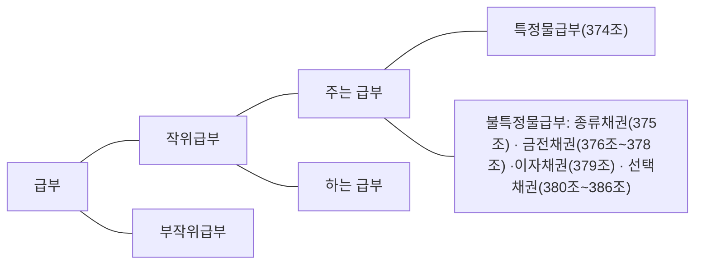

# 김준호 민법강의 채권총론 (김준호) — p.1-30 [llamaparse 미교정]

<!-- p.1 -->

Book cover of Civil Law Lecture by Kim Joon-ho

제32판

# 민법강의

이론 · 사례 · 판례

김준호

<!-- p.2 -->

# 제 2 편

# 채 권 법

<table>
  <tbody>
    <tr>
        <td>제1장 서 설</td>
        <td>제6장 수인의 채권자와 채무자</td>
    </tr>
    <tr>
        <td>제2장 채권의 발생</td>
        <td>제1절 총 설</td>
    </tr>
    <tr>
        <td>제3장 채권의 목적</td>
        <td>제2절 분할채권관계</td>
    </tr>
    <tr>
        <td>제4장 채권의 효력</td>
        <td>제3절 불가분채권관계</td>
    </tr>
    <tr>
        <td>제1절 채권의 기본적 효력</td>
        <td>제4절 연대채무</td>
    </tr>
    <tr>
        <td>제2절 채무의 이행(채권의 소멸)</td>
        <td>제5절 보증채무</td>
    </tr>
    <tr>
        <td>제3절 채무의 불이행과 그 구제</td>
        <td>제7장 개별적 채권관계</td>
    </tr>
    <tr>
        <td>제4절 책임재산의 보전</td>
        <td>제1절 계약 총칙</td>
    </tr>
    <tr>
        <td>제5절 제3자에 의한 채권침해 (채권의 대외적 효력)</td>
        <td>제2절 계약 각칙</td>
    </tr>
    <tr>
        <td> </td>
        <td>제3절 사무관리</td>
    </tr>
    <tr>
        <td>제5장 채권양도와 채무인수</td>
        <td>제4절 부당이득</td>
    </tr>
    <tr>
        <td> </td>
        <td>제5절 불법행위</td>
    </tr>
  </tbody>
</table>

<!-- p.3 -->

<!-- p.4 -->

# 제1장 서 설

**본 장의 개요** 민법 제3편 채권(채권법)은 모두 5개 장, 즉 「① 총칙, ② 계약, ③ 사무관리, ④ 부당이득, ⑤ 불법행위」로 구성되어 있다. 이 중 ②에서 ⑤는 채권이 발생하는 원인별로 나눈 것인데, 계약은 당사자의 의사에 따라 채권과 채무가 생기는 것이고, 사무관리 · 부당이득 · 불법행위는 당사자의 의사와는 무관하게 법률(민법)이 일정한 이유에서 채권과 채무의 발생을 인정하는 것들이다. 이처럼 채권이 발생하는 원인에서는 다르지만 어느 것이든 채권을 공통으로 하는 것이므로, 채권을 중심으로 그 일반규정을 두고 있는 것이 ① 총칙 부분이다. 여기서는 「채권의 목적, 채권의 효력, 수인의 채권자와 채무자, 채권의 양도, 채무의 인수, 채권의 소멸」 등을 규정한다.

가령 A가 그 소유 건물에 대해 B와 매매계약을 체결하였다고 하자. 계약 부분에서는 매도인이 지는 의무와 매수인이 지는 의무, 그리고 담보책임, 채무불이행책임으로서 해제 등을 규정한다. 이에 대해 A가 위 건물을 C에게 매도함에 따라 B에게 부담하는 채무불이행책임으로서 손해배상, B에게 갖는 대금채권의 양도 등은 채권총칙 부분에서 규율한다. 요컨대 총칙과 각칙은 분리 · 독립되어 있는 것이 아니라, 총칙은 각칙의 일부를 이루고 있다는 점이다.

이러한 채권과 채무는 채권자와 채무자 두 사람 사이의 권리와 의무의 관계이다. 채권은 채권자가 채무자에게 급부의 이행을 청구하는 것을 그 본체로 하고, 채무의 이행은 장래에 채무자에 의해 이루어진다는 점에서 불확실성이 내포되어 있다. 물건에 대해 어느 권리자가 배타적으로 지배를 하는 물권과는 이런 점에서 다르다. 그러나 채권과 채무도 당사자 간에는 구속력을 가지므로, 채무자가 채무를 이행하지 않으면 채권자는 그 이행을 구할 수 있고 강제집행을 구할 수 있는 강제력이 채권에 부여되어 있다.

## 제1절 채권법 일반

### Ⅰ. 채권법의 의의

**1.** 당사자 간의 채권 · 채무관계를 규율하는 법규를 총칭하여 「채권법」이라고 한다. 물권법과 더불어 민법 중 재산법에 속하는 것인데, 물권이 ‘물건에 대한 권리’인 데 비해, 채권과 채무는 ‘사람에 대한 권리와 의무’로 되어 있다.

특정의 두 당사자 간에 권리와 의무, 즉 채권과 채무가 발생하는 원인으로는 크게 두 가지가 있다. 하나는 당사자의 합의, 즉 계약에 의해 발생하는 것이고(예컨대 매매계약이 성립하면 매도인은 권리이전의무를, 매수인은 대금 지급의무를 진다), 다른 하나는 법률(민법)에서 일정한 경우에 채권과 채무가 발생하는 것으로 정하는 것들이다(사무관리 · 부당이득 · 불법행위). 이러한 경우 채무자가 채권자에게 그의 채무를 제대로 이행하면 채권은 만족을 얻어 소멸하게 되고

<!-- p.5 -->

별 문제가 없지만, 채무자가 그의 채무를 이행하지 않을 때에는 채권자가 채무자에게 그 이행을 ‘청구’할 수 있도록 하고, 이 청구에 법적 효력을 부여하는 법규가 바로 채권법이다. 물권은 특정인이 특정의 물건에 대해 직접 지배를 하여 만족을 얻는 지배권인 데 비해, 채권은 특정인(채권자)이 다른 특정인(채무자)에게 그의 채무를 이행할 것을 청구하는 모습으로 권리행사가 이루어지는 점에서 차이가 있다.

**2.** 근대 자본주의사회는 재화에 대한 사적 소유와 그의 자유로운 교환을 토대로 하여 형성되었는데, 이를 위한 법적 제도가 「소유권」과 「계약」이며, 전자를 규율하는 것이 물권법이고, 후자를 규율하는 것이 채권법이다. 물권법은 물권의 내용뿐만 아니라 그 변동을 규율하는데, 그 변동은 주로 계약을 통해 이루어진다(예: 주택의 매매계약에 의한 주택소유권의 이전). 이 점에서 채권관계는 물권관계에 도달하기 위한 수단이 된다고 할 수 있다. 반면 채권의 담보를 위해 담보물권이 설정되는 경우처럼, 물권이 채권에 이바지하는 경우도 있다. 이렇듯 물권과 채권은 밀접한 상호 연관성을 가진다.

# Ⅱ. 채권법의 구성

**1.** 형식적 의미에서 채권법은 「민법 제3편 채권」(766조373조~)을 말하는데, 이것은 「총칙 · 계약 · 사무관리 · 부당이득 · 불법행위」의 5개 장, 394개 조로 구성되어 있다. (ㄱ) 채권은 여러 원인에 의해 발생하는데, 민법은 그 발생원인으로 ‘계약 · 사무관리 · 부당이득 · 불법행위’ 네 가지를 규정한다. 계약은 당사자의 합의에 의해 채권이 발생하는 경우이고, 나머지 세 가지는 당사자의 의사와는 무관하게 민법이 일정한 이유에서 채권이 발생하는 것으로 정한 것이다. 예컨대, 매매계약에 따라 매도인은 매수인에게 그 권리를 이전하고 매수인은 그 대금을 지급하여야 하는 채무의 발생(계약), 타인의 사무를 의무 없이 관리함에 따라 생기는 법정채권관계의 발생(사무관리), 법률상 원인 없이 이익을 얻은 경우의 부당이득 반환채무의 발생(부당이득), 타인이 갖는 권리나 법익을 침해한 경우의 손해배상채무의 발생(불법행위) 등이 그러하다. 이러한 네 가지 채권의 발생원인을 개별적으로 규율하는 분야를 「채권각칙」이라 한다. (ㄴ) 채권의 발생원인에는 네 가지가 있고 이들은 각각 특유한 내용을 갖지만, 「채권」이라는 점에서는 공통점이 있다. 그래서 민법은 제3편 채권에서 ‘총칙’을 앞에 두어 채권을 중심으로 일반적인 내용을 정하고 있다. 즉, 「채권의 목적, 채권의 효력, 수인의 채권자와 채무자, 채권의 양도, 채무의 인수, 채권의 소멸, 지시채권, 무기명채권」에 대해 규정하는데(526조373조~), 이 부분이 「채권총칙」이다. 물권법에서 총칙의 규정이 7개 조문에 그치는 것에 비하면(191조185조~) 채권총칙의 규정은 상당히 많은 편이다.

**2.** 물권법이 물권총칙과 물권각칙으로 나누어지듯이, 채권법도 채권총칙과 채권각칙으로 나뉘어 있다. 총칙은 각칙의 공통분모를 추려서 그 앞에 규정하고 각칙에서는 그 밖의 내용을

<!-- p.6 -->

정하고 있는 점에서, 채권법 전체의 내용을 알기 위해서는 총칙과 각칙의 내용을 종합적으로 이해하여야만 한다. 예컨대 매매의 경우, 채권각칙에서는 매도인의 권리이전의무와 매수인의 대금 지급의무 및 담보책임을 정하지만, 매도인이 그 목적물을 인도할 때까지의 주의의무와 매수인의 금전채무의 이행방법에 관해서는 채권총칙에서 특정물인도 채무자의 선관의무(374조)와 금전채권(376조)의 이름으로 따로 규율하는 것이 그러하다. 이처럼 채권법의 규정을 총칙과 각칙으로 나누어 정하는 것은 규정의 중복을 피할 수 있는 점에서 장점이 있지만, 법률문제가 하나의 주제에 집중되어 있지 않고 여러 곳에 분해되어 산재해 있는 점에서 이를 하나로 모아 그 전체를 파악하기가 쉽지 않다는 단점이 있다.

## Ⅲ. 채권법의 법원과 적용범위

### 1. 채권법의 법원法源

채권관계를 규율하는 법원으로 대표적인 것은 「민법 제3편 채권」이다. 그 밖에도 법원이 되는 특별법은 많이 있는데, 주요한 것은 다음과 같다. (ㄱ) 민법에 대한 특별법으로 상법(1962년 법1000호), 어음법(1962년 법1001호), 수표법(1962년 법1002호)이 있다. (ㄴ) 민법의 부속특별법으로서 주택임대차보호법(1981년 법3379호), 상가건물 임대차보호법(2001년 법6542호), 약관의 규제에 관한 법률(1986년 법3922호), 신탁법(2011년 법10924호), 신원보증법(2002년 법6592호), 공탁법(2007년 법8319호), 자동차손해배상 보장법(2008년 법9065호), 국가배상법(1967년 법1899호), 환경정책기본법(2011년 법10893호), 제조물책임법(2000년 법6109호), 이자제한법(2007년 법8322호) 등이 있다. (ㄷ) 민법상 고용계약은 제한된 범위를 대상으로 하고, 근로계약에 대해서는 근로기준법(2007년 법8372호)이 우선적으로 적용된다.

### 2. 채권법의 적용범위

「민법 제3편 채권」에 관한 규정은 민법 총칙편 · 물권편 · 친족편 및 상속편의 규정에 의해 발생하는 채권관계에 대해서도 일반적으로 적용된다. 학설이 드는 것으로, 무권대리인의 상대방에 대한 손해배상책임(135조1항)에 관해서는 제750조와 제393조가 적용되고, 공유자의 공유물의 관리비용 기타 의무(266조)에 대해서는 제390조 이하가 적용되며, 친족법상의 부양의무자의 부양의무 불이행에 대해서는 강제이행(389조)에 관한 규정이 적용될 수 있다고 한다(김형배,6면). 그리고 민법 외의 특별법에 의해 발생하는 채권관계에 대하여도 그 법률에 다른 정함이 없으면 채권편의 규정이 적용된다(예: 자동차손해배상 보장법4조, 제조물책임법 8조 참조).

## Ⅳ. 채권법의 특질

물권법과 더불어 재산관계를 규율하는 채권법은 물권법과 비교하여 다음과 같은 특질이 있다.

<!-- p.7 -->

## 1. 임의법규

채권관계는 두 당사자 사이의 관계이고 따라서 당사자의 의사에 맡기더라도 제3자의 이익을 해칠 위험이 적기 때문에, 채권법의 규정은 원칙적으로 「임의법규」로서의 성질을 가지며 (그것이 가장 현저하게 나타나는 것은 계약에 관한 규정이다), 그 규정의 대부분이 강행법규인 물권법과 대조를 이룬다. 그러나 채권법에서도 강행법규가 있음은 물론이다. 즉 법정채권인 사무관리 · 부당이득 · 불법행위에서는 당사자의 의사에 의하지 않고 법률상 당연히 그 효과가 부여되는 점에서 그 규정은 강행법규로서의 성질을 가진다. 또 직접 제3자에게 영향을 미치는 규정도 대부분 강행법규이다(예: 채권의 양도, 채무의 인수, 증권적 채권에 관한 규정). 그 밖에 임대차에서도 강행규정으로 정하고 있는 것이 있다($\frac{652}{조}$).1)

## 2. 보편성

물권법이나 가족법이 지방적 색채나 민족적 특색을 갖는 데 비해, 채권법은 거래법으로서 국제적 · 보편적인 성질을 가진다. ‘국제물품매매계약에 관한 국제연합협약’(The United Nations Convention on Contracts for the International Sale of Goods: CISG로 약칭)을 UN에서 제정하여 2014년 9월 현재 미국 · 중국 · 독일 · 프랑스 · 캐나다 · 일본 등 83개국이 이 협약에 가입하고 있는 사실이 단적으로 그러하다. 한편 순수 민간단체인 국제사법통일연구소(International Institute of the Unification of Private Law: UNIDROIT로 약칭)가 1994년에 전문과 119개 조문으로 된 ‘국제상사계약의 원칙’(Principles of International Commercial Contracts: PICC로 약칭)을 발표하여, 대륙법과 영미법에 통하는 보편성을 가진 계약법의 모델을 정한 것을 보더라도 그러하다(이것은 당사자들의 선택에 의해 당해 계약의 규범으로 삼을 수 있다).2)

## 3. 신의칙의 규율

채권은 채권자가 채무자에게 특정의 행위를 청구하는 것을 내용으로 하고, 그 특정의 행위는 장래의 행위인 경우가 많다. 그러므로 채권은 당사자 사이의 신뢰관계를 전제로 하는 권리라고 말할 수 있다. 따라서 물권의 배타적 지위를 보장하는 물권법에 비해 채권법에서는 신의성실信義誠實의 원칙에 의하여 규율되는 바가 많다.

<!-- p.8 -->

# 제2절 채권과 채무

## I. 채권 일반

### 1. 채권의 정의

채권은 「특정인이 다른 특정인에게 특정의 행위를 청구할 수 있는 권리」이다. (ㄱ) 채권은 「채무자의 행위」를 목적으로 한다. 예컨대 주택 임대차에서, 채권(임차권)의 목적은 임차인이 주택을 사용할 수 있도록 임대인(채무자)이 주택을 임차인에게 인도하고 사용 · 수익에 필요한 상태를 유지해 주는 행위이다($\text{조 참조}^{618\text{조} \cdot 623\text{조}}$). 이때의 주택은 그 인도행위의 대상 내지 ‘목적물’에 지나지 않는다. (ㄴ) 채권은 채무자인 「특정인」에 대한 권리이다. 채권은 모든 사람에게 그 권리를 주장할 수 있는 절대권인 물권과는 달리 상대권으로서의 성질을 가지며, 다음과 같은 특질이 있다. ① 채권은 채권자가 채무자에 대해서만 주장할 수 있는 것, 다시 말해 두 사람 사이에서만 효력이 있는 것이므로, 예컨대 甲 소유 주택을 A가 매수하기로 甲과 계약을 체결하였다고 하더라도 A가 가지는 채권(소유권이전채권)은 甲에게만 주장할 수 있고 다른 모든 사람에 대해서까지 주장할 수 있는 것이 아니다. 따라서 위 주택에 대해 B는 甲과 매매계약을 체결할 수 있고, 이 매매계약 또한 유효한 것이 된다. 즉, 채권에는 배타성이 없고, 같은 내용을 가진 채권이 둘 이상 병존할 수 있으며, 이들 사이에는 우열이 없다(채권자평등의 원칙).1) ② 채권은 재산권으로서 원칙적으로 양도성이 있다. 그런데 채권은 상대권으로서 특정의 채무자에 대한 관계를 전제로 하는데, 특히 당사자의 상호 신뢰가 강하게 요청되는 채권의 경우에는 그 양도가 제한되는 수가 있다($\text{예: } \text{449조 2항} \cdot \text{610조 2항} \cdot \text{629조} \atop \text{조 1항} \cdot \text{657조 1항 참조}$). (ㄷ) 채권은 채무자의 행위를 「청구할 수 있는 권리」이다. 특정의 물건을 직접 지배하여 만족을 얻는 물권과는 달리, 채권은 채권자가 채무자에게 그 채무를 이행할 것을 청구하는 모습으로 행사된다. “청구할 수 있다”는 것은, 청구를 하여도 좋다는 것과, 채무자가 급부를 한 경우에 이를 정당하게 보유하고 수령할 수 있다는 것, 청구를 하였음에도 채무자가 그 이행을 하지 않는 때에는 그 청구의 내용을 (판결 등을 통한 국가기관의 힘을 빌려) 강제적으로 실현할 수 있다는 것을 의미한다.

### 2. 채권과 채권관계 · 청구권

#### (1) 채권과 채권관계

채권자와 채무자 사이에 전개되는 법률관계 모두를 총칭하여 「채권관계」라고 한다. 예컨대 건물에 대해 매매계약이 체결되면, 매도인은 매수인에게 매매의 목적이 된 권리를 이전할 채

<!-- p.9 -->

무를 지고, 매수인은 대금을 지급할 채무를 지며, 이 쌍방의 의무는 동시에 이행하여야 한다($\binom{568\text{조}}{2\text{항}}$). 또 매도한 건물에 하자가 있는 때에는 매도인은 매수인에게 하자담보책임을 진다($\binom{570\text{조}}{\text{이하}}$). 이러한 것들이 매매에서 당사자 간에 채권관계의 내용을 이룬다. 이에 대해 「채권」(또는 채무)은 그러한 채권관계 중 채권을 중심으로 파악한 개념이다(예: 매도인의 대금채권이나 매수인의 권리이전채권, 하자담보책임으로서 매수인이 가지는 여러 채권들).

## (2) 채권과 청구권

(ㄱ) 채권이 채권관계의 요소이듯이, 청구권도 채권의 요소를 이룬다. 특히 청구권은 채권의 본체를 이루는 것이므로, 청구권의 행사에 따라 급부가 행하여지면 채권도 동시에 소멸된다. 또 채권과 분리하여 청구권만을 양도할 수는 없다. 다만 채권적 청구권에서는 청구권이 채권의 본체를 이루기 때문에, 청구권의 양도는 채권의 양도를 동반한다($\binom{\text{민법주해(VIII), 54}}{\text{면~55면(호문혁)}}$). (ㄴ) 채권과 청구권은 다음의 점에서 차이가 있다. ① 청구권이 채권 그 자체는 아니다. 채권에는 청구권 외에 급부보유력 · 소구력 · 집행력 · 채권자대위권 · 채권자취소권 · 항변권 · 해제권 등의 권능이 포함된다. ② 이행기가 도래하지 않은 채권에서는 채권은 있어도 청구권은 발생하지 않는다. (ㄷ) 청구권은 채권 외에도 물권 · 친족권 · 상속권 등의 다른 권리에 기초하여 발생하기도 한다(예: 물권적 청구권 · 동거청구권 · 부양청구권 · 상속회복청구권 · 상속재산분할청구권 등). 이러한 청구권은 그 기초가 되는 권리로부터 발생하는 것으로서, 청구의 형태를 띠고는 있지만, 기본적으로 그 내용과 효력은 그 기초가 된 권리의 성질에 의존하고 그 관계 규정에 의해 따로 규율된다.

## 3. 채권의 강제력

채권은 채권자가 채무자에게 급부를 청구하는 권리이다. 채권자의 청구에 대해 채무자가 채무를 이행하지 않는 때에는, 국가의 강제력을 빌려 그 이행의 실현을 강제할 수 있는 권리가 채권에 있다. 즉 채무자가 급부를 하지 않는 경우, 채권자는 국가(법원)에 급부판결 내지 이행판결을 구하는 소를 제기할 수 있다(소권). 이 판결에 대해서도 채무자가 이행을 하지 않는 때에는, 국가에 채무자의 재산을 강제 매각하여 그 매각대금에서 채권의 변제에 충당시켜 줄 것을 청구할 수 있다(집행청구권). 채권에는 이처럼 국가에 대한 소권과 집행청구권이 인정되는데, 이러한 강제력이 없는 채권도 있다(불완전채무로서 ‘자연채무’와 ‘책임 없는 채무’가 그것인데, 이에 대해서는 p.409 ‘Ⅱ. 강제력이 없는 채권’에서 설명한다).

# Ⅱ. 채 무

채무란 채무자가 채권자에게 일정한 행위(급부)를 하여야 할 의무를 말한다. 채무에는 주된 의무인 「급부의무」와, 이를 제대로 이행하기 위해 필요한 「부수적 주의의무」가 있다. 그 밖에 문제가 되는 것으로 「보호의무」가 있다.

<!-- p.10 -->

## 1. 급부의무給付義務

(1) 채무자의 급부의무의 내용은 계약이나 법률의 규정에 의해 정해진다. 즉 계약에 의해 채권 · 채무가 발생한 때에는 그 계약에 의해서, 그 내용이 명확하지 않은 때에는 보충적으로 관습 · 임의규정 등에 의해 정해진다($\frac{106}{조}$). 한편 그러한 급부의무의 내용은 계약의 유형을 결정하기도 한다(예컨대 어느 당사자는 권리이전의무를 지고 상대방은 대금 지급의무를 부담하는 것은 ‘매매’가 된다($\frac{563}{조}$)). 이에 대해 사무관리 · 부당이득 · 불법행위와 같은 법정채권에서의 급부의무는 민법에서 규정한 바에 따라 정해진다($\frac{734조 이하 \cdot 741조}{이하 \cdot 750조 이하}$).

(2) 급부의무에는 「주된 급부의무」와 「종된 급부의무」가 있다. 예컨대 복잡한 구조를 가지고 있는 기계의 매매계약에서, 채무자가 그 기계의 소유권과 점유를 이전하는 것은 주된 급부의무에 속하고, 기계의 설명서 · 보증서 등을 교부하는 것은 종된 급부의무에 해당한다. 주된 급부의무는 쌍무계약에서 서로 대가관계에 서게 되며($\frac{536조}{537조}$), 그 불이행시에는 손해배상청구권 뿐만 아니라 해제권이 발생할 수 있는 데 비해, 종된 급부의무의 불이행의 경우에는 이행청구와 손해배상청구는 인정되지만 원칙적으로 해제권은 발생하지 않는다.

## 2. 부수적 주의의무

급부의무를 제대로 실현하기 위해 신의칙상 요구되는 부수적인 의무로서, 어떠한 것이 이에 해당하는지는 급부의무에 따라 개별적으로 판단할 수밖에 없다. 예컨대 여관의 숙박계약에서 손님의 안전을 배려할 의무, 자동차정비 중 다른 곳에 오일이 새는 것을 발견한 때 이를 알려 줄 의무, 매도인이 매매 목적물의 사용법을 알려 줄 의무 등이 이에 해당할 수 있다.

부수적 주의의무를 위반한 결과로서 손해가 발생한 때에는 (채무불이행으로 인한) 손해배상청구는 인정되지만 해제권은 인정되지 않는다. 한편 이 의무는 급부의무에 부수하여 그 실현을 돕는 데 지나지 않는 점에서, (급부의무의 경우와는 달리) 이 의무의 이행만을 청구할 수 없는 것이 원칙이다. 다만 부수의무 자체가 어느 정도 고유한 목적을 가지는 때에는 그것만의 이행청구도 가능할 수 있다. 예컨대 위임에서 수임인의 보고의무($\frac{683}{조}$)가 그러하다(김형배, 35면; 장경학, 8면).

## 3. 보호의무

(1) (ㄱ) 통설적 견해는 채무의 범주에 위 의무 외에 보호의무(Schutzpflicht)도 포함시키고 있다. 그 논거로는, 급부의무를 중심으로 결합된 채권자와 채무자는 서로 일정한 결합관계를 갖게 되고, 이로 인하여 상대방의 신체와 재산에 대해 영향을 줄 수 있기 때문에, 채권자와 채무자는 서로 상대방의 생명 · 신체 · 소유권 기타 재산적 이익을 침해하지 않도록 배려하여야 할 보호의무를 진다고 한다. (ㄴ) 1) 보호의무를 채무의 범주에 포함시키게 되면 그 위반시 채무불이행책임을 물을 수 있게 된다(통설은 보호의무 위반의 경우에는 불법행위책임도 물을 수 있다고 한다). 통설대로 채무불이행책임을 물을 수 있게 하면, 피용자의 과실에 대해 이를 이행보조자의 과실($\frac{391}{조}$)로 취급하여 사용자에 해당하는 채무자가 그 책임을 전적으로 부담한다는 데에 그 실익이 있을 수 있다(불법행위책임을 묻는 경우에는 사용자의 면책가능성이 있다($\frac{756}{조}$)). 2) 채권법

<!-- p.11 -->

상 보호의무를 중심으로 논의되는 분야는 두 가지이다. 하나는 보호의무의 위반을 이유로 불완전이행, 즉 채무불이행책임을 묻는 것이고, 다른 하나는 민법에서 정한 계약체결상 과실책임의 범위($\frac{535조}{}$ )를 확대하여, 즉 계약체결과정에서 상대방의 신체 · 재산에 손해를 준 경우에 계약 유사의 책임을 인정하면서 보호의무 위반을 이유로 채무불이행책임을 묻는 것이다.

**(2)** 사견은 다음과 같은 이유에서 보호의무를 채무의 범주에 포함시키는 것은 부당하고, 이것은 불법행위책임으로 해결하는 것이 타당하다고 본다. 우선 보호의무의 개념은 독일 민법학에서 형성된 것인데, 독일 민법은 우리와는 달리 불법행위가 성립하는 경우를 개별적으로 정하고 있어($\frac{\text{독민 823조 · 826조와 우리}}{\text{민법 750조 비교 참조}}$), 불법행위책임을 묻기가 곤란한 법규상의 흠결을 보충하기 위해 의도적으로 채무불이행책임을 확대하여 왔고, 이를 위해 채무의 외연을 넓혀 보호의무를 이에 포함시킨 것인데, 이것은 그 발생의 배경에서 우리와는 다르고, 둘째 보호의무의 내용은 채무자의 급부의무와는 너무도 거리가 먼, 오히려 불법행위로부터 보호될 법익에 속하는 것이어서, 이를 채무의 범주에 포함시키게 되면 채무자가 부담하는 의무의 범위가 지나치게 확대되고 나아가 불법행위책임과의 경계가 모호해진다는 문제가 있기 때문이다.

〈책 무責務 / 결과채무와 수단채무〉 ($\alpha$) 채무와 구별되는 개념으로 「책무」(간접의무)가 있다. 책무가 채무와 다른 것은, 권리자에게 이행청구권 · 소구력 · 강제력 · 그 위반에 따른 손해배상청구권이 인정되지 않는 점에 있다. 다만 일정한 사항을 준수하지 않는 경우에 법률상 일정한 불이익을 입는 점에서 이를 책무 또는 간접의무라고 부른다. 그 예로서 민법 제528조 2항을 들 수 있다. 즉 승낙기간을 정한 계약의 청약에 대해 승낙의 통지를 하였고 그것이 보통 그 기간 내에 도달할 수 있는 발송이었음에도 어떤 사정으로 승낙기간 후에 도달한 경우에는, 승낙의 통지를 발송한 자는 계약이 성립된 것으로 믿고 계약의 이행을 위한 준비를 할 것이기 때문에, 민법은 그러한 신뢰를 보호하기 위해 청약자가 지체 없이 상대방에게 연착 통지를 하게 하고, 이를 위반한 때에는 승낙의 통지가 연착되지 않은 것으로 취급하여 계약이 성립한 것으로 보는 것이 그러하다($\frac{528조}{3항}$). 즉 청약자가 연착통지를 하지 않은 때에는 계약이 성립한 것으로 되는 불이익을 입지만, 상대방이 청약자에게 연착 통지를 해 줄 것을 청구하거나 그 위반시 손해배상을 청구할 수는 없는 점에서 채무와는 다르다. 그 밖에 민법 제559조 1항 소정의 증여자의 하자고지의무, 민법 제612조 소정의 사용대차에서 대주의 하자고지의무 등도 책무(간접의무)에 해당한다.

($\beta$) ($\neg$) 판례는 채무를 「결과채무」와 「수단채무」로 구분한다($\frac{\text{대판 1988. 12. 12.}}{\text{13, 85다카1491}}$). 결과채무는 일정한 결과의 발생에 목적을 두는 채무로서, 예컨대 매매에서 매도인의 재산권이전과 매수인의 대금지급, 임대차에서 임차인의 목적물의 반환, 도급에서 일의 완성 등이 이에 속한다. 이에 대해 수단채무는 결과 발생에 목적을 두는 것이 아니라 그에 이르기 위해 필요한 주의를 다하는 데 목적을 두는 채무로서, 예컨대 의사가 환자에게 부담하는 진료채무가 이에 속한다. 즉 이 경우는 질병의 치유와 같은 결과를 반드시 달성해야 할 결과채무가 아니라, 환자의 치유를 위하여 선량한 관리자의 주의의무를 가지고 현재의 의료수준에 비추어 필요하고 적절한 진료조치를 다하면 족한 것이 된다. ($\llcorner$) 결과채무와 수단채무는 다음의 점에서 차이가 있다. 첫째, 결과채무에서는 일정한 결과가 생겨야 채무가 소멸되지만(매매의 경우, 매도인은 매매의 목적이 된 권리를 이전할 의무를 지므로, 매수인에게 권리가 이전된 때에 비로소 매도인의 의무는 소멸된다. 따라서 매도인이 등기서류를 매수인에게 교부하였더라도 매수인 명의로 소유권이전등기가 되지 않으면 매도인의 의무는 소멸되지 않는다), 수단채무에서는 예컨대 환자의 질병이 치유되지 않았더라도

<!-- p.12 -->

의사가 의료상의 주의의무를 다했다면 채무는 소멸된다(나아가 치료비 등도 청구할 수 있고, 채무불이행책임도 부담하지 않는다). 둘째, 채무불이행에 대한 채권자의 입증책임에서, 결과채무에서는 결과의 불발생을 입증하는 것으로 족하지만, 수단채무에서는 예컨대 의사가 의료상의 주의의무를 위반하였다는 사실을 (환자 측에서) 입증하여야 한다.

<!-- p.13 -->

**본장의 개요** 1. 채권과 채무는 두 가지에 의해 발생한다. 하나는 채권을 갖고 채무를 부담하기를 원하는 당사자의 의사이다. 다른 하나는 (당사자의 의사와는 상관없이) 법률에서 일정한 경우에 채권과 채무가 발생하는 것으로 정하는 경우이다.

2. 당사자의 의사에 의해 채권과 채무가 발생하는 것의 전형은 ‘계약’이다. 일방적인 단독행위로써 채권의 취득을 강요하거나 채무를 지울 수는 없다. 당사자의 의사의 합치인 계약을 통해 당사자에게 채권과 채무가 발생하고 그 구속력이 생기는 것은, 그것을 당사자 스스로가 원한 점에서 정당한 것으로 된다. 가령 A가 그 소유 토지를 1억원에 B에게 팔기로 매매계약을 맺은 경우, A는 토지를 B에게 인도하고 그 소유권을 이전해 줄 채무를 부담하고, B는 A에게 금전 1억원을 지급하여야 할 채무를 지게 되는데, 이러한 채무는 누가 강요한 것이 아니라 A나 B가 스스로 원한 것이어서 정당한 것이 된다(계약의 자유).

3. 민법 채권 편에서는 (당사자의 의사와는 관계없이 법률로써) 채권과 채무가 발생하는 것으로 ‘사무관리 · 부당이득 · 불법행위’ 세 가지를 정하고 있다. (ㄱ) 의무 없이 타인을 위하여 사무를 관리하는 경우(사무관리), 관리자와 본인 사이에 일정한 권리와 의무가 있는 것으로 정한다($\frac{734조~}{740조}$). 가령 사무관리를 통해 얻은 것이 있으면 관리자는 이를 본인에게 인도하여야 하고, 비용을 지출한 것이 있으면 그 상환을 구할 수 있다. (ㄴ) 이익을 얻는 데 있어 그것이 법률상 원인 없이 이루어진 때에는 그 손실을 입은 자에게 그 이익을 반환하여야 하는데(즉 부당이득 반환채권(채무)이 발생한다), 이것이 부당이득 제도이다($\frac{741조~}{749조}$). 가령 위 예에서 A가 B와의 계약을 (제한능력 · 착오 · 사기 등을 이유로) 취소한 경우, 계약의 유효를 전제로 하여 받은 것은 부당이득이 되어, A는 B에게 1억원을 반환하여야 하고, B는 A에게 토지를 인도하고 소유권을 넘겨야 한다. (ㄷ) 고의 또는 과실로 타인의 권리나 법익을 침해하여 손해를 입힌 경우에는 이를 금전으로 배상하여 가해행위가 있기 전의 상태로 회복시켜 주어야 하는데(즉 손해배상채권(채무)이 발생한다), 이것이 불법행위 제도이다($\frac{750조~}{766조}$).

# I . 법률행위에 의한 채권의 발생

법률행위에 의해 채권과 채무가 생기는 것으로서 「계약」이 있다. 가령 매매에서는 물건을 팔려는 매도인과 물건을 사려는 매수인의 의사의 합치에 의해 매매계약이 성립하고, 그에 따라 매도인은 권리이전채무를, 매수인은 대금 지급채무를 부담하게 되는데($\frac{568조}{1항}$), 이처럼 채권과 채무라는 계약의 구속력이 생기는 것은 당사자 자신이 자유로운 의사결정을 통해 그것을 스스로 원한 것이라는 데 있다. 계약에서 채권과 채무가 생기는 정당성의 기초는 여기에 있다.

민법은 계약에 대해, ‘증여 · 매매 · 교환 · 소비대차 · 사용대차 · 임대차 · 고용 · 도급 · 여행계약 · 현상광고 · 위임 · 임치 · 조합 · 종신정기금 · 화해’의 15가지 전형계약을 정하고 있는데,

<!-- p.14 -->

계약에 관한 이들 규정은 임의규정으로서, 당사자 간에 특별한 약정이 없는 경우에 대비하여 표준적인 내용을 정한 것에 지나지 않는다. 당사자는 그 외의 계약도 약정할 수 있고, 전형계약에 대해서도 민법에서 정한 내용과는 다른 내용으로 약정할 수 있으며, 그에 따른 구속을 받는다.

## Ⅱ. 법률의 규정에 의한 채권의 발생

당사자의 의사와는 관계없이 법률(민법)이 일정한 이유에서 채권과 채무의 발생을 정하는 것이 있는데, ‘사무관리 · 부당이득 · 불법행위’가 그것이다. (ㄱ) 「사무관리」는 ‘의무 없이 타인을 위하여 그의 사무를 관리하는 것’을 말한다(734조 1항). 타인의 유실물을 습득하여 소유자에게 반환하거나, 집을 잃은 아이를 돌보아 주는 것, 타인의 채무를 대신 변제하는 것 등이 그러하다. 민법은 의무 없이 타인을 위하여 그의 사무를 관리하는 것을 사회생활에서의 상호부조의 실현이라는 관점에서 적법행위로 평가하여, 관리자와 본인 사이에 일정한 채권과 채무가 발생하는 것으로 정한다. (ㄴ) ‘법률상 원인 없이 타인의 재산이나 노무로 이익을 얻고 그로 인하여 타인에게 손해를 입히면’ 「부당이득」이 성립한다(741조). 이 경우 수익자는 부당이득 반환채무를 진다. 가령 매매계약이 무효 · 취소 · 해제된 경우에는 매매계약을 전제로 이전된 급부(매도인의 권리 이전에 따라 매수인이 받은 것, 매수인의 대금 지급에 따라 매도인이 받은 것)를 계약 이전의 상태로 회복시켜야 하고(급부부당이득), 권원 없이 타인의 재화를 침해하여 이익을 얻은 때(침해부당이득)에는 본래 그 이익을 취득할 자에게 이를 돌려주어야 한다. 부당이득이 성립하면 수익자는 손실자에게 그가 얻은 이익을 반환하여야 한다. 즉 법률의 규정에 의해 부당이득 반환채무가 발생한다. (ㄷ) ‘고의나 과실로 인한 위법행위로 타인에게 손해를 입히는 것’이 「불법행위」이다(750조). 어느 누구도 타인이 갖고 있는 권리나 법익을 침해하여 그에게 손해를 입히는 것이 정당화될 수는 없는 것이므로, 민법은 이 경우 가해자는 피해자에게 그 손해를 배상하여야 하는 것으로 정한다. 즉 불법행위가 성립하면 손해배상채권(채무)이 발생한다.

<!-- p.15 -->

# 제3장 채권의 목적

**본장의 개요** 1. 채권은 채권자가 채무자에게 일정한 급부를 청구하는 것을 내용으로 한다. 바꾸어 말해 채무는 채무자가 채권자에게 일정한 급부를 이행하는 것을 내용으로 한다. 그러므로 채권의 목적은 채무자가 일정한 급부를 하는 것, 즉 ‘채무자의 행위’로 귀결된다. 물권에서는 권리자가 어느 물건에 대해 직접 지배를 하지만, 채권에서는 채권자는 채무자의 급부행위를 통해 만족을 얻게 되는 점에서 다르다. 이러한 채무자의 급부행위가 채무이고, 채권의 목적이기도 하다. 가령 A가 그의 토지에 대해 B와 매매계약을 맺었다고 하자. A는 B에게 토지의 소유권을 이전하기 위해 소유권이전등기절차에 협력하여야 하고, 토지를 인도하여야 한다. 반면 B는 A에게 대금을 지급하여야 한다. 이처럼 소유권이전등기절차에 협력하는 행위, 토지를 인도하는 행위, 돈을 주는 행위 등이 채권의 목적이 된다.

2. 채권은 계약이나 법률의 규정(사무관리 · 부당이득 · 불법행위)에 의해 생긴다. 그런데 특히 계약에서는 계약자유의 원칙이 적용되므로 다양한 내용의 계약을 맺을 수 있고, 그에 따라 채권의 목적도 다양해질 수밖에 없다.

채권의 목적으로 정해진 것을 채무자가 이행하지 않게 되면 ‘채무불이행’이 된다. 채권자는 이 경우 채무자를 상대로 소를 제기하여 확정판결 등을 통해 강제이행(집행)을 구하게 되는데, 채권의 목적이 다름에 따라 강제이행의 방법도 다르게 된다($\substack{389\text{조}\\\text{참조}}$). 그리고 채무불이행에 따라 채무자는 일정한 책임도 지게 되는데, 손해배상($\substack{390\\\text{조}}$)과 계약의 경우 해제나 해지를 당하는 것($\substack{543\text{조}\\\text{이하}}$)이 그러하다.

3. 채권의 목적은 다음과 같이 나눌 수 있다. (ㄱ) 크게는 ‘작위$\text{作爲}$’를 내용으로 하는 것과 ‘부작위$\text{不作爲}$’를 내용으로 하는 것으로 나눌 수 있다. 가령 A와 B가 계약을 맺으면서 B가 경업을 하지 않기로 약정하는 것은 부작위급부의 예이다. (ㄴ) 작위급부는 ‘주는 급부’와 ‘하는 급부’로 나뉜다. 전자는 물건의 인도나 금전의 지급을 내용으로 하는 것이고, 후자는 가령 도급에서 물건의 완성이나 위임에서 사무의 처리와 같이 그 밖의 작위급부를 내용으로 하는 것이다. (ㄷ) 주는 급부에는 그 목적이 특정 내지 확정되었는지에 따라 ‘특정물급부’와 ‘불특정물급부’가 있다. 전자는 무엇보다 목적물이 멸실된 경우에 채무자가 그 물건 자체의 인도의무를 면하는 점에서 의미를 갖는다. 계약의 목적은 그 하나의 물건으로 특정된 것인데 그것이 멸실되었기 때문이다. 이에 대해 후자는 채무자가 무엇을 이행하여야 하는지 정해지지 않았기 때문에 채권의 목적을 특정(확정)하는 것이 필요하다. 채권의 목적을 종류로 정하거나, 여러 개 중에서 선택하기로 하는 것, 일정액의 돈을 주거나, 이자를 주기로 하였는데 이율을 약정하지 않은 경우 등이 이에 속한다. 그래서 민법은 그 특정에 관해 규정한다($\substack{375\text{조}\sim\\386\text{조}}$).

<!-- p.16 -->

# 제1절 총 설

## I. 채권의 목적의 의의

1. 민법은 급부와 반대급부의 내용에 따라 15개의 전형계약을 나누고 있다($\frac{554\text{조} \cdot 563\text{조} \cdot 596\text{조}}{598\text{조} \cdot 609\text{조} \cdot 618\text{조}} \cdot$ $\frac{655\text{조} \cdot 664\text{조} \cdot 674\text{조의2} \cdot 675\text{조} \cdot 680\text{조}}{693\text{조} \cdot 703\text{조} \cdot 725\text{조} \cdot 731\text{조}}$). 가령 매매에서 매도인은 매수인에게 매매의 목적이 된 권리를 이전해야 하고 매수인은 매도인에게 그 대금을 지급해야 한다($\frac{563\text{조}}{568\text{조}}$). 임대차에서 임대인은 목적물을 임차인에게 인도하고 그 사용 · 수익에 필요한 상태를 유지해 주어야 하며 임차인은 임대인에게 차임을 지급해야 한다($\frac{618\text{조}}{623\text{조}}$). 고용에서 노무자는 사용자에게 노무를 제공하여야 하고 사용자는 노무자에게 보수를 지급하여야 하는 것($\frac{655\text{조}}{}$ 등)이 그러하다. 이처럼 각 계약에서 채권과 채무의 내용을 이루는 것을 「채권의 목적」이라고 한다.1) 이것은 채무자의 ‘(이행)행위’를 통해 실현되는데, 이를 강학상 ‘급부’給付라 하고,2) 급부의무가 다름 아닌 ‘채무’이다.

2. 이 장에서 채권의 목적을 다루는 취지는, 채권의 목적을 ‘확정’하고자 하는 데 있다. 이를 통해 채권과 채무의 내용이 분명해지고, 이를 토대로 채무의 이행과 불이행, 그리고 채무불이행에 대한 구제로서 강제이행, 손해배상, 계약해제 등도 다루어질 수 있게 된다.

3. 민법은 채권편 총칙 “채권의 목적”에서 특정물채권($374\text{조}$), 종류채권($375\text{조}$), 금전채권($\frac{376\text{조}}{378\text{조}} \sim$), 이자채권($379\text{조}$), 선택채권($\frac{380\text{조}}{386\text{조}} \sim$) 다섯 가지를 규정하는데, 이것들은 주는 급부인 ‘물건의 인도’나 ‘금전의 지급’을 채권의 목적으로 하는 경우에 있어서 그 확정을 위해 보충규정으로 마련된 것들이다. 그러므로 채권의 목적이 물건의 인도가 아닌 것, 가령 고용에서처럼 노무자의 급부의무인 ‘하는 급부’에 대해서는 통용되지 않는다.

## II. 채권의 목적의 요건

1. 채권은 「법률행위」(계약)와 「법률의 규정」(사무관리 · 부당이득 · 불법행위)에 의해 발생한다. 그런데 후자 즉 법정채권은 법률의 규정에 의해 직접 발생하는 것이므로, 그 규정에서 정한 요건을 충족하면 되는 것이고 따로 유효요건이 문제되지 않는다. 이에 대해 계약에 의한 약정채권에서는 그 유효요건이 문제될 수 있다. 법률행위의 일반적 유효요건은 그 법률행위(계약)에 의해 생기는 채권의 목적에 관하여도 통용되기 때문이다. 급부가 금전적 가치가 있는지 여

<!-- p.17 -->

부(373조)도 약정채권에 관해서만 적용된다.

**2.** 법률행위(주로 계약)에서 채권과 채무가 생기는 것이므로, 채권의 목적은 그 채권을 발생시킨 법률행위가 유효한 것을 전제로 한다. 법률행위의 내용을 확정할 수 없거나, 그 급부가 애초부터 그 실현이 불가능하거나(원시적 불능), 법률행위의 내용이 강행법규나 사회질서에 반하는 경우에는, 그 법률행위는 무효가 되므로 채권과 채무도 생기지 않는다.

**3.** (ㄱ) 민법 제373조는 「금전으로 가액을 산정할 수 없는 것이라도 채권의 목적으로 할 수 있다」고 규정한다. 본조는 금전적 가치가 없는 급부에 대해서도 채무로서의 법적 구속이 발생할 수 있다는 것을 소극적으로 정한 데 지나지 않는다. 예컨대 누구를 위해 기도를 해 주기로 약속한 경우에는, 그 기도행위가 채무로서 법적 구속을 받을 수도 있다는 것을 정한 것이다. 그러나 금전으로 가액을 산정할 수 없는 것 모두가 채무가 되어 법적 구속을 받는다는 의미는 아니다. 채권관계가 아닌 단순한 호의관계나 도의관계인 경우가 있기 때문이다. 어느 쪽인지는 당사자의 의사와 거래의 관행 등을 고려하여 구체적 · 개별적으로 결정하여야 할 것이다. (ㄴ) 금전으로 가액을 산정할 수 없는 급부를 목적으로 하는 채권(예: 피아노를 한밤중에는 치지 않기로 약속한 부작위채권)도 그 효력에서는 보통의 채권과 다름이 없다. 즉 채권자는 급부의 실현을 소구訴求할 수 있을 뿐만 아니라 강제이행을 청구할 수 있고, 그 불이행으로 인한 손해배상을 청구할 수도 있다.

# Ⅲ. 채권의 목적(급부)의 분류

<채권의 목적(급부)의 분류 / 민법에서 채권의 목적으로 정하는 내용>

## 1. 강학상 분류

**a) 작위급부와 부작위급부** 급부給付의 내용이 작위作爲냐 부작위不作爲냐에 의한 구별이다. 보통은 작위이지만, 부작위도 채권의 목적이 될 수 있다(항 참조389조 3). 부작위에는 「단순 부작위」(예: 피아노를 치지 않는 것)와, 채권자가 일정한 행위를 하는 것을 방해하지 않는 「인용忍容」(예:624조)이 있다. 작위급부와 부작위급부는 채무불이행이 있는 때에 그 강제이행의 방법을 달리한다(참조389조).

<!-- p.18 -->

특히 부작위급부는 성질상 일신에 전속하는 경우가 많고(제3자가 이행할 수 없는 것이 원칙이다), 소멸시효는 위반행위가 있은 때부터 진행된다($\frac{166\text{조}}{2\text{항}}$).

b) **주는 급부와 하는 급부** 이것은 작위급부를 그 내용에 따라 나눈 것으로서, 작위가 물건의 인도나 금전의 지급인 때에는 「주는 급부」라 하고, 그 밖의 작위를 내용으로 하는 것을 「하는 급부」라고 한다. (ㄱ) 급부가 ‘물건의 인도’인 경우에는 물건의 인도라는 결과에 중점을 두고(이 점에서 결과채무에 속한다), 채무자 자신의 인도행위는 그 결과를 달성하기 위한 수단에 지나지 않는다. (ㄴ) 이에 반해 ‘하는 급부’에서는 채무자 자신이 급부를 하는 데 중점을 둔다. 다만 그 정도에 관해서는 두 가지로 나뉜다. ① 도급은 일의 완성이라는 결과에 목적을 두는 점에서($\frac{664}{\text{조}}$), 일을 완성하는 한 그 방법이나 과정은 문제삼지 않는다. 즉 제3자를 통해 일을 완성하여도 무방하므로 하도급이 허용되고, 또 강제이행의 방법으로 대체집행이 인정된다. 이러한 것을 ‘대체적 작위급부’라고 한다. ② 고용이나 위임에서는 채권자는 특정인의 자질을 보고 그와 계약을 맺는 것이므로, 고용에서 노무자의 노무 급부의무 또는 위임에서 수임인의 위임사무처리의무 등은 채무자 자신이 이행하여야 하고, 제3자로 하여금 대신 이행케 할 수 없다($\frac{657\text{조}}{682\text{조}}$). 이러한 것을 ‘부대체적 작위급부’라고 한다. (ㄷ) 하는 급부는 주는 급부와는 강제이행의 방법을 달리하며($\frac{389}{\text{조}}$), 또 그 급부가 계속적인 것인 때에는(예: 고용 · 위임 · 임대차 등) 당사자 간의 대인적 신뢰관계가 긴밀하여 채권의 양도와 채무의 인수가 제한되고, 신의칙이나 사정변경의 원칙이 적용될 소지가 많은 점에서도 주는 급부와는 차이가 있다.

c) **특정물급부와 불특정물급부** 주는 급부에서 인도의 목적물이 특정되었는지 여부에 의한 구별이다. 불특정물급부에는 인도할 물건이 ‘종류’에 의해 정해지는 것(종류채권)과 ‘금전’인 경우(금전채권)가 있는데, 후자는 오히려 일정액의 가치라는 관념이 더 강하다. 양자는 특정의 필요성과 방법($\frac{374\text{조}}{375\text{조}}$), 이행의 방법($\frac{462}{\text{조}}$), 이행의 장소($\frac{467}{\text{조}}$), 쌍무계약에서 위험부담의 적용 여부($\frac{537}{\text{조}}$) 등에서 구별의 실익이 있다. 그리고 무엇보다 물건이 멸실된 경우에 그 물건 자체의 인도의무를 면하는지 여부에서 다르고(그 인도의무를 면하는 것은 특정물급부에서만 생긴다), 불특정물급부에서는 강제이행의 실현을 위해 그 특정 내지 확정을 필요로 한다.

d) **가분급부와 불가분급부** 급부의 본질 또는 가치를 손상하지 않고서 급부를 분할적으로 실현할 수 있는지 여부에 의한 구별이다. 급부의 가분(可分) · 불가분은 급부의 성질이나 당사자의 의사표시에 의해 정해진다($\frac{409}{\text{조}}$). 이 구별은 채권자 또는 채무자가 다수 있는 경우에 특히 그 실익이 있다($\frac{408\text{조} \cdot 409}{\text{조 참조}}$).

e) **일시적 급부와 계속적 급부 · 회귀적 급부** 급부가 계속적 · 반복적으로 행하여지는지 여부에 따라 일시적 급부와 계속적 급부로 나누어진다(예: 매매에 의한 물건의 인도와 대금의 지급은 일시적 급부이고, 임대차 · 고용에 따른 목적물의 사용의 제공 · 노무의 제공 등은 계속적 급부에 속한다. 그러나 할부판매에서 대금을 수회에 나누어 급부하는 경우에도 이것은 대금의 지급시기를 정한 것에 불과하고 기간에 따라 급부의 양이 많아지는 것이 아니므로 일시적 급부에 속한다). 한편 회귀적 급부는 이 양자를 합한 것으로서, 일정한 시간적 간격을 두고 일정한 급부를 반복하여야 하는 급부이다(예: 신문 구독계약에 따라 매일 신문을 배달하는 것). 채무불이행이 있어 계약을 파기하고자 할 때, 일시적 급부의 경우에는 소급효가 있는 해제가 적용되는 데 비해 ($\frac{548}{\text{조}}$), 계속적 급부 · 회귀적 급부에서는 장래에 대해 그 효력을 잃는 해지가 적용되는 점($\frac{550}{\text{조}}$)에서 구별의 실익이 있고, 또 계속적 급부나 회귀적 급부의 경우에는 신의칙이나 사정변경의 원

<!-- p.19 -->

칙이 적용될 소지가 많은 점에서 일시적 급부와는 차이가 있다.

## 2. 민법상 분류

민법은 ‘채권의 목적’이라 하여, 급부의 종류로서 특정물채권(374조) · 종류채권(375조) · 금전채권(376조~378조) · 이자채권(379조) · 선택채권(380조~386조) 다섯 가지에 관하여 규정한다. 이들 급부는 각종 계약으로부터 발생할 뿐만 아니라, 법정채권인 사무관리 · 부당이득 · 불법행위에 의해서도 발생하는 것이므로, 그 공통된 규정을 둔 것이다. 즉 특정물채권에서는 채권의 목적이 특정물의 인도인 경우에 그 물건을 인도할 때까지 채무자의 주의의무의 기준을 정하고, 종류채권에서는 채권의 목적이 종류로만 지정된 경우에 그 특정(확정)의 방법을, 금전채권에서는 금전이 가지는 성질에 비추어 그 이행에 관한 방법을, 이자채권에서는 이자의 확정방법을, 선택채권에서는 채권의 목적이 수개의 급부 중에서 어느 하나를 선택하여 확정하여야 할 경우에 그 방법을 각각 정하고 있다. 이것들은 주로 채권의 목적(급부)의 ‘특정 내지 확정’에 관해 정한 것이며, 전술한 채권의 목적의 요건으로서 「확정성」을 위해 임의규정으로 마련된 것이다. 그리고 이것은 주로 ‘주는 급부’를 염두에 둔 것이다(민법주해(VIII), 58; 면(송덕수) 참조). 민법이 규정하는 위 다섯 가지 급부에 관해서는 다음 제2절에서 따로 설명한다.

# 제2절 「주는 급부」에 대한 민법의 규정

## I. 특정물채권特定物債權

**사례** A는 그 소유 건물에 대해 B와 매매계약을 맺었는데, 인도 전에 A의 과실로 건물의 일부가 멸실되었다. 이 경우 A와 B 사이의 법률관계는? 그 건물 전부가 멸실된 경우는?
**해설** p. 391

## 1. 의의

(1) ‘물건의 인도’를 목적으로 하는 채권은 그 물건의 특정 여부에 따라 「특정물채권」과 「불특정물채권」으로 나뉜다. (ㄱ) 물건은 ‘특정물 · 불특정물’과 ‘대체물 · 부대체물’로 나눌 수 있다. 이 중 후자는 일반 거래관념을 기준으로 하는 것이다. 즉 대체물은 물건의 개성이 중시되지 않아 동종 · 동질 · 동량의 물건으로 바꾸어도 급부의 동일성이 바뀌지 않는 물건이고, 부대체물은 그 물건의 개성이 중시되어 대체성이 없는 물건이다.1) 이에 대해 전자는 당사자의 의사를 기준으로 하는 것이다. 즉 특정물은 구체적인 거래에서 당사자가 특정의 물건을 지정하

<!-- p.20 -->

고 다른 물건으로 바꿀 것을 허용하지 않는 물건이고(따라서 특정물이 멸실되거나 처분된 경우, 채무자는 특정물 그 자체의 인도의무는 면하게 된다), 이에 대해 동종 · 동질 · 동량의 것이면 어느 것이라도 무방하다는 것이 불특정물이다. (ㄴ) 따라서 대체물이라도 당사자의 의사에 의해 특정물로 할 수 있고(예: A 창고에 있는 쌀을 매매의 목적물로 삼은 경우),1) 부대체물이라도 일정한 종류에 속하는 일정한 양에 주안을 둔다면 역시 당사자의 의사에 의해 불특정물로 삼을 수 있다. (ㄷ) 유의할 것은, 처음부터 당사자의 의사에 의해 특정물채권으로 되는 경우도 있지만, 종류채권의 경우에도 민법 제375조 2항에 의해 특정이 된 후에는 그때부터는 특정물채권이 된다.

(2) (소유권의 이전과는 관계없이) 특정물의 인도의무가 발생하는 것은, 계약으로서 증여 · 매매 · 교환 · 사용대차 · 임대차 · 임치 등과, 법정채권으로서 사무관리($\frac{739}{조}$) · 부당이득($\frac{747조}{1항}$)이 있다.

특정물이란 점에 주안을 두어 민법이 특별히 규정하는 것은 두 가지이다. ① 특정물채권에서는 급부해야 할 물건이 특정되어 있어서, 물건이 멸실되면 채무자는 그 물건의 인도의무 자체는 면하게 된다(그 급부는 불능이 된다). 그러므로 급부를 받지 못하게 되는 위험을 채권자가 안게 된다. 그래서 제374조는 채권자의 이익을 위해 채무자가 그 물건을 인도할 때까지 선량한 관리자의 주의로써 물건을 보존하여야 할 의무를 지운 것이다(불특정물채권에서는 이러한 규정을 두고 있지 않다). ② 특정물채권에서는 특정물만을 인도할 수밖에 없으므로, 제462조는 그 특정물에 설사 변질이 생겼더라도 (동일성을 인정할 수 있는 한) 이행기의 현상대로 그 물건을 인도하면 되는 것으로 한다. 즉 물건을 수선해서 인도할 의무를 인정하지 않으며, 그 현상대로 인도하면 특정물의 인도의무 자체는 이행한 것으로 취급한다.

## 2. 「특정물의 인도」를 중심으로 발생하는 법률관계

### (1) 채무자의 선관의무善管義務

a) 채무자는 특정물을 인도할 때까지 선량한 관리자의 주의로 보존해야 한다($\frac{374}{조}$). ‘선량한 관리자의 주의’(선관주의)라 함은 채무자의 직업 · 지위 등에 비추어 거래상 일반적으로 요구되는 주의를 말한다(다시 말하면 채무자를 기준으로 하여 그의 능력에 따른 주의를 말하는 것이 아니라, 평균적 · 추상적 채무자가 마땅히 기울여야 할 일반적 · 객관적 주의를 가리킨다). 이 주의를 위반하게 되면 채무자에게 「추상적 과실」이 있는 것이 되고, 채무불이행에서의 ‘과실’($\frac{390}{조}$)은 이를 가리킨다. 즉 채무자가 선관의무를 위반하여 목적물을 멸실시키거나 훼손한 경우에는 채무불이행책임을 진다. 그러나 선관의무를 다한 때에는 채무불이행책임을 부담하지 않는다. 이러한 선관의무에 관한 입증책임은 채무자에게 있다($\frac{통설}{판례}$).

b) 선관의무의 ‘존속기간’은 다음과 같이 정해진다. (ㄱ) 그 시기는 특정물인도채권이 성립한 때부터이다. 예컨대 A가 B에게 그 소유 물건을 팔거나 임대하기로 계약을 맺은 때에는, 그때부터 (인도할 때까지) 선관의무를 진다. 다만 임대차 · 사용대차 · 임치 등에서 임차인, 차주 또

<!-- p.21 -->

는 수치인은 그 목적물을 인도받은 때부터 (장래 목적물을 반환하기까지) 이 의무를 부담한다($\binom{\text{김중한·김}}{\text{학동, 28면}}$). (ㄴ) 그 종기에 관해, 본조는 「물건을 인도할 때까지」라고 정하고 있는데, 이 의미는 이행기까지가 아니라 채무자가 실제로 물건을 인도할 때까지를 말한다($\frac{392}{\text{설}}$). 그런데 이행기 이후에는, 채무자는 과실이 없는 경우에도 이행지체에 따른 손해배상책임을 지거나($\frac{392}{\text{조}}$), 채권자의 수령지체가 있는 때에는 채무자에게 과실이 있는 때에도 그 불이행으로 인한 책임을 부담하지 않게 된다($\frac{401}{\text{조}}$). 따라서 이행기 이후에도 채무자가 선관의무를 부담하는 경우는 위 양자, 즉 이행지체와 수령지체에 해당하지 않는 것, 예컨대 채무자에게 유치권이나 동시이행의 항변권 등이 있어 이행지체에는 해당하지 않지만 물건의 인도채무는 남아 있는 경우이다($\frac{\text{곽윤직,}}{\text{26면}}$).

c) 민법 제374조는 직접적으로는 특정물의 인도에 관한 채무자의 주의의무에 대해 정하고 있지만, 이 선관의무는 민법상 채무자의 주의의무의 기준(원칙)을 이루고 있다. 다만 동조는 임의규정이므로, 당사자 간에 다른 특약이 있거나 법률에서 다르게 정하고 있는 때에는 그에 따른다. 예컨대 보수 없이 임치를 받은 자는 임치물을 ‘자기 재산과 동일한 주의’로써 보관해야 하고($\frac{695}{\text{조}}$), 친권자가 재산관리권을 행사함에는 ‘자기의 재산에 관한 행위를 할 때와 동일한 주의’를 하여야 하며($\frac{922}{\text{조}}$), 상속인은 자기의 ‘고유재산을 관리할 때와 동일한 주의’로 상속재산을 관리하여야 하는 것($\frac{1022}{\text{조}}$) 등이 그러하다. 즉 이러한 경우는 행위자 자신의 구체적 주의능력에 따른 주의가 기준이 되며(이를 「구체적 과실」이라고 한다), 일반적으로 추상적 과실에 비해 주의의무의 정도가 경감되는 점에서 차이가 있다.

## (2) 특정물의 현상 인도

a) (ㄱ) 특정물의 인도가 채권의 목적인 때에는 채무자는 이행기의 현상대로 그 물건을 인도하여야 한다($\frac{462}{\text{조}}$). 특정물은 다른 물건으로 대체할 수 없기 때문에, 목적물의 상태가 변질 · 훼손되더라도 그 동일성을 유지할 수 있으면 그 상태로 인도하면 된다. 따라서 채권자는 그 수령을 거절할 수 없으며, 수령을 거절한 때에는 수령지체가 된다. 다만 그 변질 · 훼손에 채무자의 선관의무 위반이 있는 경우에 채무불이행책임(계약의 해제와 손해배상)을 지는 것은 별개의 것이다. (ㄴ) 제462조 소정의 「이행기」는 변제기가 아니라 실제로 이행을 하는 때를 의미한다. 제374조는 특정물인도채무에서 채무자는 그 물건을 「인도할 때까지」 선관의무를 부담하는 것으로 정하는데, 따라서 인도할 때까지 특정물을 선관주의로 보존하다가 그 상태로 인도하면 된다는 것이 제462조의 취지에도 부합한다고 볼 것이기 때문이다($\binom{\text{김중한·김학동, 29면; 민법}}{\text{주해 채권(4), 55면(김대휘)}}$).

b) 그러나 특정물이 멸실되거나 변질 · 훼손의 정도가 커 동일성을 인정할 수 없는 경우에는, 그것에 채무자의 과실이 있는 것과는 관계없이 채무자는 특정물 자체의 인도채무는 면한다. 특정물이기 때문이다. 따라서 다시 제작을 하여 인도하거나 다른 유사한 물건을 인도하는 것은 있을 수 없다. 다만 그러한 멸실 등에 채무자에게 과실이 있어 채무자가 채무불이행책임(계약의 해제와 (금전)손해배상)을 지는 것은 다른 문제이다.

## (3) 천연과실의 귀속

특정물인도 채무자에게 과실수취권이 있는 때에는 채무자는 이행기까지의 과실을 수취할

<!-- p.22 -->

수 있다. 이행기 이후의 과실은 채권자에게 인도하여야 하는 것이 원칙이지만, 매매의 경우에 는 특칙이 있다($\frac{587\text{조}}{\text{1항}}$).

### (4) 인도장소

특정물의 인도는 채권 성립 당시에 그 물건이 있던 장소에서 하여야 한다($\frac{467\text{조}}{\text{1항}}$).

> **사례의 해설** (ㄱ) A는 매도인으로서 건물 소유권 이전의무를 부담하는데($\frac{568\text{조}}{\text{1항}}$), 여기에는 목적물인 건물 인도의무가 포함되고, 이것은 특정물 인도채무로서 채무자는 그 건물을 인도할 때까지 선관의무를 부담한다($\frac{374}{\text{조}}$). 그런데 A의 과실로 건물의 일부가 멸실되었으므로, A는 채무불이행으로 인한 손해배상책임을 지고, 이것은 금전배상이 원칙이다($\frac{390\text{조}}{394\text{조}}$). 한편 특정물 인도채권에서는 채무자는 이행기의 현상대로 그 물건을 인도하면 되는 것이므로($\frac{462}{\text{조}}$), 당사자 간에 별도의 합의가 없는 한, 그 멸실된 상태로 건물을 인도하면 되고 수선의무를 당연히 지는 것은 아니다. 즉 B는 그 수령을 거절할 수 없으며, 거절한 때에는 수령지체가 된다. 다만 그 일부 멸실로 인해 계약의 목적을 달성할 수 없는 경우에는 B는 이행불능을 이유로 A와의 계약을 해제할 수 있고($\frac{546}{\text{조}}$), 이때는 원상회복의무가 문제된다(가령 B로부터 받은 대금을 A가 B에게 반환하는 것)($\frac{548}{\text{조}}$). (ㄴ) 한편 건물 전부가 멸실된 경우에는, A는 건물 자체의 인도채무는 면하지만, 그 이행불능에 A의 귀책사유가 있으므로 그에 갈음하는 (금전)손해배상채무를 부담한다($\frac{390\text{조}}{394\text{조}}$). **사례** p. 388

## Ⅱ. 불특정물채권 不特定物債權

### 1. 종류채권 種類債權

**사례** (1) A는 B의 창고에 보관 중인 오토바이 50대 중 20대를 구입하기로 B와 매매계약을 체결하였는데, 그 인도 전에 그중 20대를 도난당하였다. B는 오토바이 인도의무를 면하는가?

(2) A는 B에게 OB 맥주 1상자를 주문하였다. B는 이를 A의 주소에 배달하였으나 A가 출타 중이어서 자전거에 싣고 돌아가다가 과속으로 운전하던 C의 승용차와 충돌하여 맥주 전부가 파손되었다. A · B · C 간의 법률관계는? **해설** p. 394

#### (1) 의 의

a) 종류채권은 일정한 종류에 속하는 물건 중에서 일정량의 인도를 목적으로 하는 채권이다. 예컨대 카스맥주 1상자를 주문하는 경우처럼, 일정한 종류에 속하는 물건의 일정량이면 어느 것이라도 좋다고 하는 데에 그 특색이 있다. 종류채권에서는 종류에 속하는 물건 가운데에서 어느 것을 인도할 것인지가 특정되지 않은 점에서, 이를 「불특정물채권」이라고도 한다. 종류채권은 상품의 매매 외에 보통의 매매 · 증여 · 교환 · 소비대차 · 소비임치 등을 원인으로 하여 발생한다.1)

<!-- p.23 -->

b) 종류채권에서는 두 가지를 유의하여야 한다. (ㄱ) 종류채권의 목적물은 「불특정물」이다. 물건의 ‘대체성’은 거래의 일반관념에 의해 객관적으로 결정되는 데 비해, ‘특정성’은 당사자의 의사에 의해 주관적으로 결정된다. 종류채권의 목적물은 대체물이 일반적이지만 그것이 항상 불특정물로 되는 것은 아니다. 예컨대 대체물이더라도 ‘A 창고에 있는 쌀 전부’를 매매의 목적으로 한 때에는 그것은 특정물채권이 된다. 한편 부대체물이더라도 ‘택지로 조성된 100m2 면적의 토지 10필지 중 1필지’를 매매의 목적으로 한 경우처럼, 당사자가 일정한 종류에 속하는 일정량이면 어느 것이라도 좋다고 하면 불특정물채권(종류채권)이 된다. (ㄴ) 종류 외에 다시 일정한 제한을 두어서 일정량의 물건의 인도를 약속하는 경우가 있다. 예컨대 쌀 100가마가 있는 A창고 내의 쌀 30가마를 매수하기로 하는 것이 그러하다. 쌀 30가마라는 점에서는 종류채권이지만, 그것은 A창고에 있는 쌀 100가마를 한도로 하는 점에서 이를 「제한(한정)종류채권」이라고 한다.1) 이 경우 A창고에 있는 쌀 100가마가 전부 멸실된 때에는 채무자는 인도의무를 면하는 점에서 보통의 종류채권과 다르다.

# (2) 목적물의 품질과 종류채권의 특정

## 가) 목적물의 품질

같은 종류에 속하는 물건의 품질에 상 · 중 · 하의 차등이 있는 경우에 채무자는 다음 세 가지 기준에 의해 이행하여야 한다. 먼저 법률행위의 성질에 의한다. 소비대차($598 \over 조$) · 소비임치($702 \over 조$)에서 차주와 수치인은 그가 처음에 받은 물건과 동일한 품질의 것으로 반환하여야 한다. 둘째, 당사자의 의사에 의해 정해진다. 셋째, 위와 같은 정함이 없는 경우 채무자는 중등 품질의 물건으로 이행하여야 한다($375조 \over 1항$).

## 나) 종류채권의 특정

a) 특정의 의의 종류채권에서는 인도할 물건이 확정되지 않았으므로 이것이 어느 때에 확정되는지 그 특정의 방법과 시기에 대해 정할 필요가 있다. 특정이 있게 되면 그 후부터는 특정물채권으로 다루어지는 점에서 의미가 있다. 유의할 것은, 특정이 있어야만 비로소 강제집행을 할 수 있는 것은 아니다. 채무자가 종류물을 인도하지 않는 경우, (채무자가 소유하는) 종류물에 대해 (채무자로부터 빼앗아 채권자에게 인도하는 방식으로) 강제집행을 할 수 있기 때문이다($민사집행 \over 법 257조$). 이 점은 선택채권에서는 선택하기 전까지는 급부가 확정되지 않아 강제집행도

\* 하는 것이어서 B는 다른 곳에서 조달을 해서라도 주식 2,000주를 반환해야 하는 것인지가 다투어진 것이다. 대법원은 다음과 같은 이유로 후자로 보았다: 「주식은 주주가 출자자로서 회사에 대하여 가지는 지분으로서 동일 회사의 동일 종류 주식 상호간에는 그 개성이 중요하지 아니한 점, 이 사건 주식보관증에는 B가 하이마트 주식 2,000주를 보관하고 있다고 기재되어 있을 뿐 B가 보관하는 주권이 특정되어 있지 아니한 점을 고려하여 보면, B의 A에 대한 주식반환의무는 특정물채무가 아니라 종류채무에 해당한다. 따라서 B가 하이마트 주식을 취득하여 반환할 수 없는 등의 특별한 사정이 없는 한, B가 보유하는 주식이 제3자에게 매도되어 B가 이를 보유하고 있지 않다는 사정만으로는 B의 주식반환의무가 이행불능이 되었다고 할 수 없다」(대판 2015. 2. 26, 2014다37040).

\* 1) 유의할 것은, 예컨대 A 소유 농장에 있는 사슴 100마리 중 10마리를 매매의 목적으로 한 경우, 당사자의 의사가 사슴에 우열이 있어 이를 중시한 것으로 볼 때에는, 그것은 제한종류채권이 아니라 선택채권이 된다(380조 이하). 선택채권에서는 그 급부가 서로 다른 개성을 가지고 있고 또 선택권을 가지는 자가 선택권을 행사한 때에 채권의 목적으로 확정되는 점에서, 종류에 속하는 물건이 모두 같은 가치를 가지고 그 범위가 개별적으로 예정되어 있지 않으며 특정의 방법을 달리하는 종류채권과는 다르다.

<!-- p.24 -->

할 수 없는 것과는 다르다.

b) 특정의 방법 민법은 종류채권의 특정의 방법으로서 「채무자가 이행에 필요한 행위를 완료한 때」와 「채권자의 동의를 받아 이행할 물건을 지정한 때」 두 가지를 정한다($\text{375조}\atop\text{2항}$). 본조는 임의규정이므로, 당사자의 합의에 의해 특정의 방법을 달리 정할 수 있음은 물론이다.

aa) 계약에 의한 특정 : (ㄱ) 당사자 간의 계약으로 특정의 방법을 정할 수 있고, 이때에는 그 계약에서 정한 방법에 의해 특정이 된다. (ㄴ) 채권자의 동의를 받아 이행할 물건을 지정한 때이다. 1) 당사자 간의 계약으로 당사자의 일방이나 제3자에게 지정권을 줄 수 있고, 이 경우 지정권자가 지정하면 종류채권은 특정된다. 2) 민법 제375조 2항 소정의 「채무자가 채권자의 동의를 받아 이행할 물건을 지정한 때」라는 것은, 당사자 간의 계약으로 채무자에게 지정권을 준 경우를 말한다. 다만 그 계약에서 따로 지정의 ‘방법’을 정하지 않은 경우를 대비하여 동조는 보충적으로 채무자가 지정한 때, 다시 말해 종류물 중에서 일정 수량의 부분을 타 부분과 구별이 가능하도록 분리한 때에 특정이 되는 것으로 정한 것이다. 따라서 그 본질은 계약에 의한 특정에 속하는 것이다. 3) 채무자가 지정권을 행사하지 않는 경우, 판례는 선택채권에 관한 규정($\text{381}\atop\text{조}$)을 준용하여 채권자에게 지정권이 이전하는 것으로 본다($\text{대판 2003. 3. 28,}\atop\text{2000다24856}$).

bb) 채무자의 이행제공에 의한 특정 : 특정의 방법에 관하여 당사자 간에 약정이 없는 때에는, ‘채무자가 이행에 필요한 행위를 완료한 때’에 특정이 된다. 구체적인 내용은 변제의 장소에 따라 다음과 같이 정해진다. (ㄱ) 지참채무: 1) 지참채무란 채무자가 목적물을 채권자의 주소에서 이행하여야 하는 채무이다. 특정물의 인도는 채권 성립 당시에 그 물건이 있던 장소에서 하여야 하지만($\text{467조}\atop\text{1항}$), 그 밖의 채무변제는 채권자의 현재 주소에서 하여야 하고($\text{467조}\atop\text{2항}$), 따라서 종류채무는 원칙적으로 지참채무에 속한다. 2) 한편 변제의 제공은 채무의 내용에 따른 ‘현실제공’으로 하여야 하는 것이 원칙이고, 다만 채권자가 미리 변제받기를 거절하거나 채무의 이행에 채권자의 행위가 필요한 경우에는 변제준비의 완료를 통지하고 그 수령을 최고하는 방식의 ‘구두제공’으로 하면 된다($\text{460}\atop\text{조}$). 3) 따라서 지참채무에서는 채무자가 채권자의 주소에서 현실적으로 변제의 제공을 한 때($\text{460조}\atop\text{본문}$), 즉 목적물이 채권자의 주소에 도달하고 채권자가 언제든지 수령할 수 있는 상태에 놓여진 때에 비로소 특정이 된다. 채무자가 인도할 목적물을 분리하거나 또는 우편 · 철도 등의 운송기관에 위탁하여 발송하는 것만으로는 특정이 되지 않는다. 그러므로 발송 후 도달 전에 그 물건이 불가항력으로 멸실된 경우에도, 채무자는 그 종류에 속하는 다른 물건으로 변제하여야 한다. 한편 지참채무에서도 채권자가 미리 변제받기를 거절한 경우에는 구두제공, 즉 변제 준비의 완료를 통지하고 그 수령을 최고함으로써 특정이 된다($\text{460조}\atop\text{단서}$). (ㄴ) 추심채무: 추심채무(推尋債務)는 채권자가 채무자의 주소에 와서 목적물을 추심하여 변제를 받아야 하는 채무이다. 따라서 채무의 이행에 채권자의 추심행위를 필요로 하므로, 이때에는 구두제공, 즉 변제 준비의 완료(목적물을 분리하여 채권자가 이를 수령할 수 있는 상태)를 통지하고 그 수령을 최고하는 것으로 특정이 된다($\text{460조}\atop\text{단서}$). 유의할 것은, 종류채무는 지참채무가 원칙이므로, 추심채무로 되기 위해서는 당사자의 합의를 필요로 한다. (ㄷ) 송부채무: 채무자가 채권자 또는 채무자의 주소 외의 제3지에 목적물을 송부해야 할 채무가

<!-- p.25 -->

송부채무인데, 이것은 특정과 관련하여 다음 둘로 나뉜다. ① 제3지가 당사자의 합의에 의해 채무이행의 장소로 정해진 때에는, 전술한 지참채무에서와 같이 원칙적으로 그 장소에서 현실의 제공을 한 때 특정이 된다. ② 채권자의 요청에 의해 채무자가 호의로 제3지에 목적물을 송부하는 경우에는, 제3지로 발송한 때에 특정이 된다는 것이 통설이다. 채무자로서는 해야 할 행위를 완료했다고 볼 수 있기 때문이다.

cc) 강제집행에 의한 특정 : 대체물의 일정 수량의 인도를 목적으로 하는 채권의 강제집행은 집행관이 이를 채무자로부터 빼앗아 채권자에게 인도하는 방식으로 한다(민사집행법 257조). 따라서 이 경우에는 집행관이 동일 종류 중에서 일정한 물건을 수취(압류)한 때에 특정이 된다 (김용한, 54면; 이은영, 113면; 장경학, 49면).

c) 특정의 효과 (ㄱ) 특정물채권으로의 전환: ① 종류채권의 목적물이 특정되면, 그때부터 그 물건이 채권의 목적물이 된다($375조 \over 2항$). 즉 종류채권은 목적물의 특정으로 그 동일성을 유지한 채 특정물채권으로 전환된다. 따라서 특정된 물건이 그 후 어떤 사정으로 멸실된 경우에 채무자는 다른 종류물 중에서 다시 이행할 의무를 부담하지 않으며 그 인도의무를 면한다. 또 특정된 물건이 훼손된 경우에도 그 상태대로 인도하면 된다($462조$). 다만 선관의무 위반이 있는 때에 채무불이행책임(계약의 해제와 손해배상)을 지는 것은 별개이다($374조 \over 390조$). ② 반면 종류물이 특정되기 전에는, 비록 채무자가 소유하는 그 종류의 물건이 모두 멸실되어도 거래계에 그 종류의 물건이 있는 한 이를 마련하여 급부할 의무를 진다. 즉 그 (종류)물건의 인도의무는 존속한다. 다만 제한종류채권에서는, 그 한정된 종류물이 모두 멸실되면 그러한 종류의 물건이 거래계에 있다고 하더라도 채무자는 그 인도의무를 면한다. (ㄴ) 변경권: 종류채권에서 특정은 채무를 이행하기 위한 수단에 지나지 않고, 또 채무자를 보호하기 위한 것이다. 따라서 일단 특정된 후에도 채무자 스스로 그러한 보호를 포기할 필요가 있는 때에는(예: 특정된 물건을 제3자에게 매도한 경우), 특별히 반대 의사가 없으면 채무자가 그 종류에 속하는 다른 물건으로 인도할 수 있는, 이른바 「변경권」을 인정하는 것이 통설이다. 그러나 이 변경권은 종류채권의 성질과 신의칙으로부터 인정되는 것이므로, 채권자의 반대 의사가 있거나 채권자에게 불리한 때에는 인정되지 않는다.

<mark>사례의 해설</mark> (1) B가 부담하는 채무는 제한종류채무이지만, 오토바이 20대를 도난당했더라도 그 제한 범위에 속하는 나머지 30대가 남아 있으므로, B는 그중 20대를 인도할 의무를 진다.

(2) B가 부담하는 맥주 1상자의 인도채무는 종류채무로서, 이를 A의 주소에 배달함으로써 특정 이 되었다($375조 2항 \over 467조 2항$). 한편 A가 출타 중이어서 이를 수령하지 못한 것은 채권자지체(수령지체)에 해당한다($400조$). 채권자지체 중에는 채무자는 고의나 중과실에 대해서만 책임을 지고($401조$), 매매와 같은 쌍무계약에서 당사자 쌍방에게 책임 없는 사유로 이행할 수 없게 된 때에는 채무자는 상대방의 이행을 청구할 수 있다($538조 \over 1항 2문$). 따라서 B에게 경과실만 있는 경우에는 B는 A에게 맥주 대금을 청구할 수 있다. 한편 B는 C에게 불법행위에 의한 손해배상을 청구할 수도 있다($750조$).

B는 맥주의 인도채무를 면하면서(그리고 A에게 맥주 대금을 청구할 수 있으면서) C에 대해 불법행위로 인한 손해배상채권을 취득하게 되므로, B가 A에게 맥주 대금을 청구하는 경우에 A는 B

<!-- p.26 -->

에게 대상청구권을 행사하여 B가 C에게 갖는 손해배상채권의 양도를 구할 수 있다(대상청구권에 관해서는 p.508 ‘이행불능의 효과’ 부분을 참조할 것). <mark>사례</mark> p. 391

# 2. 금전채권

**사례** A는 그 소유 원양어선에 대해 B보험회사와 보험금을 미화 385,000달러로 하는 손해보험 계약을 체결하였다. 그런데 위 어선이 산호초에 좌초되어 B는 상법상 1985. 3. 26.에 보험금을 지급하게 되었다. B가 보험금의 지급을 미루자, A는 위 보험금을 한화로 바꿔 변제기(1985. 3. 26.) 당시의 환율인 1달러당 864.89원을 곱하여 332,982,650원을 청구하는 소를 제기하였는데, 이 소송의 변론종결일 당시의 환율은 1달러당 695.90원으로 하락하였다. A의 청구에 대해 법원은 어느 통화로 얼마를 인용하여야 하는가? 또 A는 어느 때부터 지연배상을 청구할 수 있고, 그 밖에 환차손으로 인한 손해배상을 청구할 수 있는가? <mark>해설</mark> p. 397

## (1) 의 의

금전채권은 일정액의 금전의 급부(인도)를 목적으로 하는 채권이다.1) 금전채권에서는 금전 자체의 개성보다는 그것이 가지는 일정한 가치에 중점을 두는 점에 특색이 있고, 그래서 금액채권으로서 의미를 가진다. 그러므로 금전채권에서는 특약이 없는 한 채무자는 그 선택에 따라 각종의 통화로 변제할 수 있는 것이 원칙이다. 금전채권도 일종의 종류채권이지만 ‘특정’을 필요로 하지 않으며, 또 금전 자체가 전부 멸실되는 경우가 없어 이행불능이 생기는 일도 없다(이행지체가 있을 뿐이다). 금전채권을 발생시키는 원인으로는 증여 · 매매 · 소비대차 · 임대차 · 고용 · 도급 · 임치 등이 있다. 또 채무불이행이나 불법행위로 인한 손해는 금전으로 배상하는 것이 원칙이다($\frac{394조}{763조}$).

## (2) 금전채권의 종류

금전채권은 보통 금액채권을 뜻하지만, 민법은 이것 외에 따로 금종채권과 외화채권에 관해 규정한다.

### 가) 금종채권

어느 종류의 통화로 지급하기로 정해진 금전채권을 가리켜 금종金種채권이라고 한다(예컨대 1만원권으로 1천만원을 지급하기로 약정하는 것). 이때에는 당사자의 약정에 따라 특정 종류의 통화로 지급하여야 한다. 다만, 그 통화가 변제기에 유통되지 않는 때에는, 금전채권의 일반적 성질로 돌아가 다른 종류의 통화로 변제하여야 한다($\frac{376}{조}$).

### 나) 외화채권

a) 외국 금액채권과 외국 금종채권 (ㄱ) 다른 나라 통화, 즉 외화로 지급하기로 된 금전채

<!-- p.27 -->

권이 외화채권이다. 외화채권도 금전채권이므로 외국 금액채권이 원칙이다. 그러므로 채권의 목적이 다른 나라 통화로 지급할 것인 경우에는 채무자는 자기가 선택한 그 나라의 각 종류의 통화로 변제할 수 있다(377조 1항). (ㄴ) 지급하여야 할 외화의 종류를 지정한 것이 외국 금종채권인데(예: 1백달러짜리로 1천만달러를 지급하기로 약정하는 것), 그 통화가 변제기에 강제통용력을 잃은 때에는, 민법 제376조와 같은 취지에서 채무자는 그 나라의 다른 종류의 통화로 변제하여야 한다(377조 2항).

b) 대용급부권代用給付權 「채권액이 다른 나라의 통화로 지정된 경우에는 채무자는 지급할 때의 이행지 환금시가에 의하여 우리나라 통화로 변제할 수 있다」(378조).

aa) 대용급부권과 대용급부청구권: (ㄱ) 본조는 외화채권의 경우에 채무자가 우리나라 통화로 변제할 수 있는 대용급부권을 인정하고 있다. 본래 채권의 목적은 외화채권이지만 채무자에게 대용급부권을 허용한 점에서 그 성질은 임의채권으로 보는 것이 통설이다(임의채권에 관해서는 후술함). 채무자에게 대용급부권을 인정하는 주된 이유는 채무자가 이행지에서 외국통화를 취득하는 어려움을 해소하는 데에 있다. 채무자의 대용권 행사는 의사표시만으로는 안 되고 실제로 대용급부를 하여야 한다(민법주해(VIII), 183면(이공현)). (ㄴ) 채권액이 다른 나라 통화로 「지정된 때」에 본조에 따라 우리나라 통화로 변제할 수 있다. 따라서 ① 단순한 지정이 아닌, 그 외국통화만으로 지급하기로 특약을 맺은 때에는 본조는 적용되지 않는다(김증한·김학동, 40면). ② 당사자 간의 약정으로 실제로는 우리나라 통화로 지급하기로 하고 그 채권액을 결정하는 수단으로 외국통화를 표시하는 경우가 있는데(이를 ‘부진정 외화채권’이라고 한다), 이때는 우리나라 통화로만 지급하여야 하는 점에서, 외국통화로 지급하여야 하지만 우리나라 통화로도 지급할 수 있는 대용권이 인정되는 본조는 적용되지 않는다. (ㄷ) 본조는 명문으로 채무자에게만 대용급부권을 인정하는데, 해석상 채권자도 우리나라 통화로 변제할 것을 채무자에게 청구할 수 있는지, 즉 ‘대용급부청구권’이 있는지가 문제된다. 어음법(41조 1항, 77조 1항)과 수표법(36조 1항)에서는 어음·수표금의 이행지체시 채권자에게도 대용급부청구권을 인정하지만, 본조는 그러한 규정을 두고 있지 않다. 그런데 외화채권의 국내통화에 의한 대용급부가 연혁적으로 채무자의 채무변제의 편의를 위해 인정된 것이기는 하지만, 공평의 관념상 또 화폐거래가 자유롭게 유통되는 성질상 채권자에게도 대용급부청구권을 인정하는 것이 타당하고, 이것이 통설과 판례이다(대판(전원합의체) 1991. 3. 12, 90다2147). 이 경우 채권자가 대용급부청구권을 행사한 때에는 채무자는 이제는 더 이상 외화에 의한 지급을 주장할 수는 없다. 그렇지 않으면 채권자의 대용권 행사가 무의미해지기 때문이다(민법주해(VIII), 183면(이공현)).

bb) 환산시기: (ㄱ) 채무자가 대용권을 행사한 경우: 종전의 판례는 변제기(이행기)를 환산시기로 삼았지만(대판 1978. 5. 23, 73다1347; 대판 1987. 6. 23, 86다카2107), 그 후 이 판례를 폐기하면서 민법 제378조의 문언에 충실하게 ‘채무자가 현실로 이행할 때’로 견해를 바꾸었다(대판(전원합의체) 1991. 3. 12, 90다2147). 그래서 우리나라 통화로 외화채권에 변제충당할 때도 현실로 변제충당할 당시의 외환시세에 의해 환산하여야 하는 것으로 보았다(대판 2000. 6. 9, 99다56512). 또 집행법원이 경매절차에서 외화채권자에게 배당을 할

<!-- p.28 -->

때에도 배당기일 당시의 외환시세를 우리나라 통화로 환산하는 기준으로 삼아야 한다고 한다($\text{대판 2011. 4. 14,}\atop\text{2010다103642}$). 본래 금전채권에서 채권자는 채무자로부터 현실로 변제를 받을 때까지 화폐가치의 변동에 따른 영향을 받는 것이므로, 외화채권의 경우에도 그 환산시기를 현실의 이행시로 보는 것이 타당할 것이다.1) / 한편, 변제기 이후에 변제한 때에는 지연손해금을 청구할 수 있지만, 환차손으로 인한 손해배상은 민법 제397조 1항의 특칙상 따로 청구할 수 없다($\text{민법주해}\atop\text{(VIII), 186}\atop\text{면(이공현)}$). (ㄴ) 채권자가 대용권을 행사한 경우: 채권자의 청구에 응해 채무자가 현실로 이행하는 때를 기준으로 한다. 다만, 채권자가 대용권을 ‘재판상 청구’하는 경우에는, 채무자가 현실로 이행할 때에 가장 가까운 ‘사실심 변론종결일’의 환율을 환산시기로 본다($\text{대판(전원합의체) 1991.}\atop\text{3. 12, 90다2147}$).

cc) 환 율 : 민법 제378조 소정의 이행지의 ‘환금시가’는, 판례는 (은행의 수수료가 포함되지 않은) 기준환율로 본다($\text{대판 1995. 9.}\atop\text{15, 94다61120}$).

### (3) 금전채권에 관한 특칙 등

a) 금전채무 불이행에 대한 특칙 채무의 불이행이 있는 경우 채권자가 손해배상을 청구하려면, 채무자에게 귀책사유가 있어야 하고, 채권자가 손해의 발생과 손해액을 입증하여야 한다($\frac{390}{\text{조}}$). 그리고 그 배상액은 통상손해와 특별손해의 기준에 의해 정해진다($\frac{393}{\text{조}}$). 그런데 ‘금전채무의 불이행’의 경우에는 민법은 제397조에서 따로 특칙을 규정한다. 그 내용은 손해배상 부분(p.546)에서 따로 설명한다.

b) 금전채권과 사정변경의 원칙 금전채권의 대상인 통화는 일정한 가치의 척도이지만, 경제사정에 따라 그 가치의 변동이 있을 수 있고, 이것을 예상하고 금전의 지급을 약정한 것이 금전채권이므로, 금전채권자는 화폐가치의 하락에 따른 위험을 부담하는 것이 원칙이다. 그러나 그 정도가 너무 심해 반대급부와의 균형이 심하게 깨지는 경우에도 이를 고수하는 것은 심히 공평에 반한다. 그래서 이 경우 그 금전의 액수를 조정하거나 아니면 그 기초가 된 계약을 해제할 수 있도록 하는 것, 즉 「사정변경의 원칙」이 특히 중요한 기능을 한다. 학설은 일정한 요건하에 이 원칙을 수용하려 하지만, 판례는 이 법리를 인정하면서도 그것이 민법의 해석상 수용될 수 없다는 태도를 취하고 있다($\text{대판 1955. 4. 14, 4286민상231;}\atop\text{대판 1963. 9. 12, 63다452}$).

<mark>사례의 해설</mark> 민법 제378조 소정의 외화채권의 대용급부권에 관해 판례는 다음 세 가지 점에서 그 법리를 전개하고 있다($\text{대판(전원합의체) 1991.}\atop\text{3. 12, 90다2147}$). 즉 ① 제376조와 제377조 2항은 ‘변제기’라고 하고 있는 데 비해 제378조는 ‘지급할 때’라고 달리 표현하고 있어, 이것은 변제기(이행기)가 아닌 채무자가 현실로 지급하는 때를 의미한다. ② 채권자도 채무자에게 우리나라 통화로 변제할 것을 구할 수 있는 대용급부청구권이 있다. ③ 채권자가 소로써 대용급부 청구를 한 때에는, 채무자가 현실로 지급하는 때에 가장 가까운 사실심 변론종결 당시를 환산 기준시기로 삼아야 한다.

위 판례에 의할 때 사례는 다음과 같이 정리된다. 채권자 A는 우리나라 통화로의 대용급부를 청구할 수 있고, 소로써 그 청구를 하였으므로 법원은 사실심 변론종결일 당시의 환율을 기준으로 하여 우리나라 통화로 지급을 명하여야 한다(385,000 × @695.90 = 267,921,500원). 그러나 이것은 미화를 우리나라 통화로 환산하는 기준에 불과한 것이고 본래의 외화채권의 변제기는 1985. 3.

<!-- p.29 -->

26.부터이므로, 이때부터 지연배상 책임을 지는 것은 별개이다. 이 경우는 미화 385,000달러를 기준으로 지체된 기간에 법정이율을 곱하여 계산된 미화가 지연배상액이 되고, 이를 원화로 환산하는 경우에는 위 판례의 법리가 통용된다고 할 것이다. 한편, 금전채무의 불이행에 의한 손해배상은 약정이율이 없으면 법정이율에 의해 산정되므로($397\text{조}\atop1\text{항}$), A는 환율의 변동에 따른 환차손을 입었더라도 따로 손해배상을 청구할 수는 없다. <mark>사례</mark> p. 395

# 3. 이자채권

## (1) 의 의

이자의 급부를 목적으로 하는 채권이 이자채권이다. 이자는 이율에 의해 산정되는데, 그 이율은 법률의 규정에 의해 정해지는 ‘법정이율’과 당사자의 약정에 의해 정해지는 ‘약정이율’이 있다. 민법 제379조는 당사자 간에 이자를 급부하기로 약정하였지만 그 이율에 관해 정하지 않은 경우에, 또 법률에서 단지 이자의 급부만을 정한 경우에, 그 이율을 연 5푼(퍼센트)으로 정한다. 그런데 실제로는 약정이자의 경우에 그 이율을 정하게 마련이므로, 동조는 법정이자에서, 그리고 주로 금전채무불이행의 손해배상액을 산정하는 기준($397\text{조}\atop1\text{항}$)으로 적용되는 것이 보통이다($\text{민법주해(VIII),}\atop\text{191면(이공현)}$).

## (2) 이 자

a) 정 의 민법은 이자에 관해 정하고 있지 않지만, 일반적으로 “금전 기타 대체물의 사용의 대가로서 원본액과 사용기간에 비례하여 지급되는 금전 기타의 대체물”이라고 정의한다. 즉, (ㄱ) 이자는 원본채권의 이행기까지의 사용대가로서 법정과실($101\text{조}\atop2\text{항}$)의 일종이다. 주식의 배당금과 같이 사용대가가 아닌 것, 또 이행기가 지난 후의 이행지체에 따른 연체이자($705\text{조}\atop\text{참조}$)는 (지연)손해배상이지 이자가 아니다. (ㄴ) 이자는 금전 기타 대체물의 사용대가라는 점에서, 부대체물인 토지 · 기계 · 건물 등의 사용대가인 지료 · 차임 등은 이자가 아니다. (ㄷ) 이자는 금전이 보통이지만, 대체물도 이자가 된다(예: 쌀을 빌리고 이자로서 쌀을 지급하는 것). 또 원본과 이자는 동종의 대체물이어야만 하는 것은 아니다. 동종의 대체물이 아니더라도 양자가 모두 대체물이면 이율에 의한 이자의 계산은 가능하기 때문이다(예: 원금 100만원에 대한 이자로 쌀 1가마를 받는 경우). (ㄹ) 이자는 원본채권을 전제로 하여 일정한 이율에 의해 산정된다. 따라서 원본채권이 무효이면 이자는 발생하지 않으며, 이자는 이율을 떠나서 생각할 수 없다.

b) 이 율 이자는 일정 기간을 단위로 원본액에 대한 일정한 이율에 의해 산정되는데, 이율에는 법률이 정하는 「법정이율」과 당사자의 약정에 의해 정해지는 「약정이율」이 있다. (ㄱ) 법정이율: 법정이율은 원칙적으로 연 5푼이지만($379\text{조}$), 상행위로 인한 채무의 법정이율은 연 6푼이다($\text{상법}\atop54\text{조}$). 한편 금전채무의 불이행에 의한 손해배상액은 원칙적으로 법정이율에 의해 산정된다($397\text{조}\atop1\text{항}$). 그런데 그 이율이 너무 적어서 채무자가 금전채무의 이행을 지연하는 사례가 빈발하여 이를 방지하고자 다음과 같은 특칙이 마련되어 있다. 즉 채권자가 금전채무의 이행을 구하는 ‘소’를 제기하여 그 전부 또는 일부의 이행을 명하는 판결을 선고할 경우에, 금전채무불

<!-- p.30 -->

이행으로 인한 손해배상액 산정의 기준이 되는 법정이율은 그 금전채무의 이행을 구하는 소장 또는 이에 준하는 서면이 채무자에게 송달된 날의 다음 날부터는 대통령령으로 정하는 이율에 의하는데(특례법 3조 1항소송촉진 등에 관한), 현재 그 이율은 연 100분의 12이다(규정동). 그 밖에 공탁금에는 대법원 규칙으로 정하는 이자를 붙일 수 있다(6조공탁법). (ㄴ) 약정이율: 약정이율은 (후술하는) ‘이자제한법’에서 정한 최고이자율을 초과하지 않는 범위 안에서 당사자가 자유로이 정할 수 있다.

c) 발생원인 이자는 당사자 사이에 약정이 있거나, 법률에 정함이 있는 때(조 · 600조 · 685조 · 688조425조 2항 · 441조 2 / 조 1항 · 748조 2항항 · 548조 2항 · 587)에 발생한다. 따라서 금전소비대차에서도 당사자 간에 이자에 관한 약정이 없는 때에는, 채무자는 이자를 지급할 의무가 없고 원금만을 반환하면 된다. 다만 상인 간의 금전소비대차에서는 그러한 특약이 없다고 하더라도 대주는 연 6푼의 법정이자를 청구할 수 있다(1항 · 54조상법 55조).

## (3) 이자채권

a) 목적과 특색 이자의 급부를 목적으로 하는 채권이 이자채권이다. 이자는 금전 그 밖의 대체물이므로 이자채권은 일종의 종류채권이며, 이자가 금전인 경우에는 금전채권이 적용된다. 다만 그 확정기준이 이율에 있다는 데에 그 특색이 있다.

b) 기본적 이자채권과 지분적 이자채권 예컨대 100만원의 원금에 대하여 연 2할의 이율로 매월 이자를 지급하기로 약정하는 경우가 있다. 이에 따라 채무자는 연 2할의 이자를 지급해야 할 기본적 이자채무를 지고, 이 채무의 이행으로서 변제기에 도래한 매월의 이자를 지급해야 하는 지분적 이자채무를 부담하게 된다. 기본적 이자채권과 지분적 이자채권은 원본채권에 대한 관계에서 다음과 같은 차이가 있다. (ㄱ) 기본적 이자채권은 그 발생 · 소멸 · 처분에서 원본채권과 운명을 같이한다. 즉 원본채권이 없이는 발생할 수 없고, 원본채권이 소멸되면 같이 소멸되며, 원본채권의 양도 등 처분은 기본적 이자채권의 처분을 수반하는 것을 원칙으로 한다. (ㄴ) 이에 대해 이미 변제기에 도달한 지분적 이자채권은 원본채권과 분리하여 양도할 수 있고, 원본채권과는 별도로 변제할 수 있으며, 또 1년 이내의 기간으로 정한 이자채권은 따로 3년의 시효(1호163조)에 걸리는 등 강한 독립성이 있다. 1) 따라서 원본채권이 양도되더라도 이미 변제기에 도달한 지분적 이자채권은 (그 양도 당시 지분적 이자채권도 양도한다는 의사표시가 없는 한) 당연히 같이 양도되지는 않는다(88다카12803대판 1989. 3. 28.). 그리고 원본채권이 변제 · 상계 등으로 소멸되더라도 이미 발생한 지분적 이자채권은 그대로 존속한다. 다만 원본채권이 시효로 소멸되는 때에는 같이 소멸된다. 소멸시효는 그 기산일로 소급하여 효력이 생기므로(조167), 원본채권이 시효로 소멸되면 이자채권도 발생할 여지가 없기 때문이다. 2) 그런데 채권자가 만족을 얻는 입장에서 보면 지분적 이자채권도 원본채권의 확장의 성질을 가지는 것이므로, 원본채권의 담보는 원칙적으로 지분적 이자채권에도 미친다.

## (4) 이자의 계산

a) 계산의 시기와 종기 이자가 있는 소비대차에서는, 차주가 목적물을 인도받은 때부터, 차주가 자기에게 책임이 있는 사유로 수령을 지체할 경우에는 대주가 이행을 제공한 때부터
