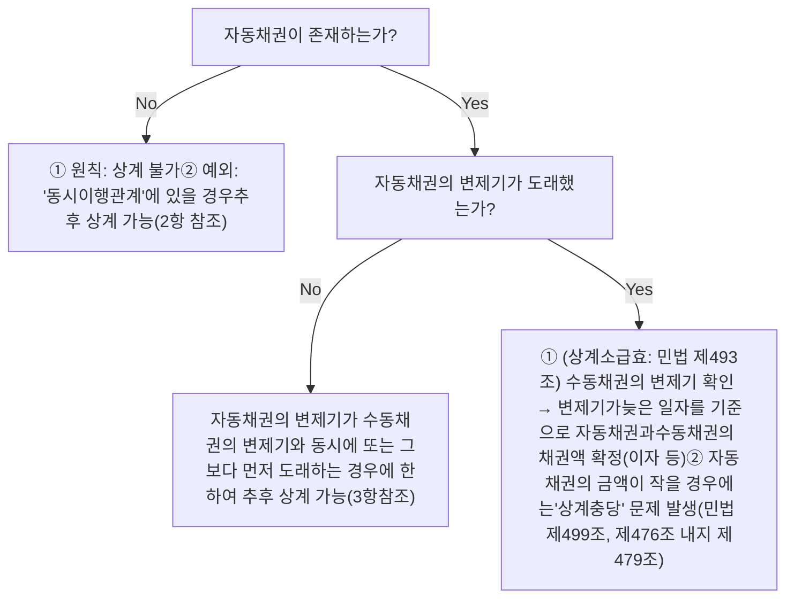
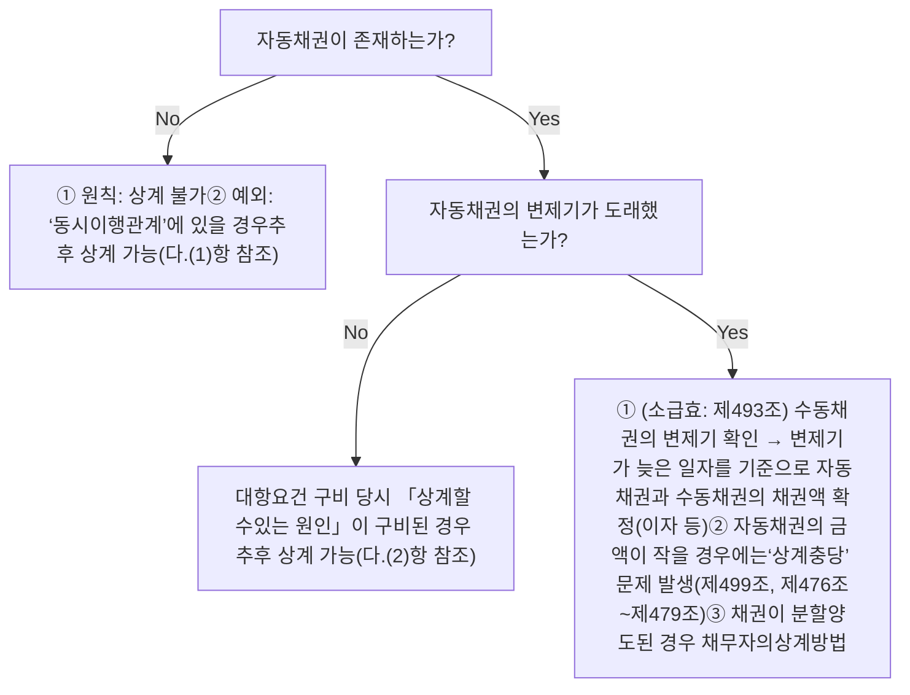

# 민사법 쟁점노트 재산법 () — p.271-300 [llamaparse 미교정]

<!-- p.271 -->

# IV 손해배상청구권의 소멸시효 ⑦

제766조【손해배상청구권의 소멸시효】 ① 불법행위로 인한 손해배상의 청구권은 피해자나 그 법정대리인이 그 손해 및 가해자를 안 날로부터 3년간 이를 행사하지 아니하면 시효로 인하여 소멸한다.

② 불법행위를 한 날로부터 10년을 경과한 때에도 전항과 같다.

③ 미성년자가 성폭력, 성추행, 성희롱, 그 밖의 성적(性的) 침해를 당한 경우에 이로 인한 손해배상청구권의 소멸시효는 그가 성년이 될 때까지는 진행되지 아니한다.

# 1. 기산점

## 가. 피해자나 그 법정대리인이 그 손해 및 가해자를 안 날로부터 3년

### ⑴ 피해자 및 그 법정대리인

* [개 관] 불법행위의 피해자가 미성년자로 행위능력이 제한된 자인 경우 ‘법정대리인’이 손해 및 가해자를 알아야 제766조 제1항의 소멸시효 진행. 법정대리인이 위 사실을 모르면 미성년자가 ‘성년이 될 때까지’ 소멸시효는 미진행(대판 2010.2.11. 2009다79897; 피고로부터 간음을 당할 당시 만 15세로서 미성년자이던 원고의 법정대리인이 원고의 피해사실 및 그 가해자를 알았다고 볼 만한 증거가 없으므로, 원고가 성년이 된 2005. 4. 25.경까지는 원고의 피고에 대한 손해배상청구권의 소멸시효는 진행되지 않았다고 판단하여 피고의 소멸시효 항변을 배척한 원심을 긍정한 사안임. 다만 민법 제766조 제3항이 신설됨에 따라 현재는 제3항에 따라 처리되며, 제3항에서 규정한 이외의 사유일 경우에는 본 판례에 따라 처리됨에 주의할 것)

* [아동·청소년 성폭력 범죄로 인한 손해배상청구권의 단기소멸시효 기산점을 판단함에 있어서 고려사항] ‘아동·청소년 성폭력 범죄로 인한 손해배상청구권의 단기소멸시효 기산점’을 판단함에 있어서는 성폭력 피해의 특수성을 염두에 두고, 피해자가 피해를 인식하여 표현하고 법적 구제절차로 나아가게 된 동기나 경위 및 그 시점, 관련 형사절차 진행 중 수사기관 및 법정에서 가해자가 사실관계나 법리 등을 다투는지 여부, 가해자가 범행을 부인하는 데 그치지 않고 피해자를 무고로 고소하였는지 여부, 관련 형사사건 재판의 심급별 판결 결과 등을 종합적으로 고려하여야 함(대판 2022.6.30. 2022다206384)

[해설 ⑦] 극단 대표인 피고가 자신의 지위와 단원인 원고와의 관계를 이용하여 위력으로 청소년이던 원고를 추행하고 간음한 불법행위를 원인으로 손해배상 청구 사건 → 원고는, 성년에 도달한 날로부터는 3년이 경과하였으나 피고의 위 성폭력행위에 관한 형사사건의 제1심판결 선고일로부터는 3년이 경과하기 전의 시점에 이 사건 소를 제기함 → [대법원] 원고가 사건 당시에는 피고의 성폭력행위가 불법행위에 해당한다는 사실을 인식하지 못하였을 가능성이 높은 점, 이후 원고는 피고로부터 당한 행위가 부당하거나 부적절하다는 것은 인지하면서도 이에 관하여 아무에게도 털어놓지 못하던 중, 2018년경 사회적으로 미투 운동이 전개되고 피고의 극단에 함께 소속되어 있었던 단원이 자신과 유사한 피해사실을 폭로하는 것을 보고는 자신이 피고로부터 당한 행위도 위법성이 있는 행위에 해당한다는 확신을 가지게 되어 비로소 수사기관에 피해사실을 진술한 점, 관련 형사사건 재판에서 피고가 성폭력 사실을 적극 다투었던 점 등에 비추어 피고의 불법행위로 인한 손해배상청구권의 단기소멸시효는 ‘관련 형사재판의 제1심판결 선고일부터’ 진행된다고 판단하여, ‘원고가 성년에 도달한 날부터 단기소멸시효가 진행되어 이 사건 제소 당시 소멸시효가 완성되었다’는 피고의 항변을 배척하고 원고의 청구를 인용한 원심을 수긍함

### ⑵ 「손해 및 가해자를 안다」는 의미

#### (가) 내 용

* [손해 및 가해자를 안 날 ⑦] 손해의 발생, 위법한 가해행위의 존재, 가해행위와 손해의 발생과의 사이에 상당인과관계가 있다는 사실 등 불법행위의 요건 사실에 대하여 현실적이고도 구체적으로 인식하였을 때 (대판 2008.4.24. 2006다30440, 대판 2011.11.10. 2011다54686, 대판 2019.12.13. 2019다259371)

* [손해를 알았다는 의미] 단순히 손해발생의 사실만을 안 때라는 뜻이 아니고 가해행위가 불법행위로서 이를 원인으로 하여 손해배상을 소구할 수 있다는 사실을 안다는 의미(대판 1990.1.12. 88다카25168)

<!-- p.272 -->

(나) 판단시기(원칙적으로 ‘불법행위가 있는 날’ 알았다고 봄)

* [문제되는 경우①-가해행위와 손해발생 사이에 시간적 간극이 있는 경우 [v]]

> **관련판례** ① 가해행위와 이로 인한 현실적인 손해의 발생 사이에 시간적 간격이 있는 불법행위에 기한 손해배상채권에 있어서 소멸시효의 기산점이 되는 불법행위를 안 날이라 함은 단지 관념적이고 부동적인 상태에서 잠재하고 있던 손해에 대한 인식이 있었다는 정도만으로는 부족하고 **그러한 손해가 그 후 현실화된 것을 안 날을 의미한다**(대판 2001.1.19, 2000다11836; 사고 당시 피해자는 만 2세 남짓한 유아로서 좌족부의 성장판을 다쳐 의학적으로 뼈가 성장을 멈추는 만 18세가 될 때까지는 위 좌족부가 어떻게 변형될지 모르는 상태였던 경우, 피해자가 고등학교 1학년 재학 중에 담당의사에게 진찰을 받은 결과 비로소 피해자의 좌족부 변형에 따른 후유장해의 잔존 및 그 정도 등을 가늠할 수 있게 되었다면 피해자의 법정대리인도 그때서야 현실화된 손해를 구체적으로 알았다고 보아야 한다고 한 사례). 이때 신체에 대한 가해행위가 있은 후 상당한 기간 동안 치료가 계속되는 과정에서 어떠한 증상이 발현되어 그로 인한 손해가 현실화된 사안이라면, 법원은 피해자가 담당의사의 최종 진단이나 법원의 감정결과가 나오기 전에 손해가 현실화된 사실을 알았거나 알 수 있었다고 인정하는 데 매우 신중할 필요가 있다(대판 2019.7.25, 2016다1687).

> ② 후유증으로 인한 예견하지 못한 확대손해는 「**그러한 사유가 판명된 때**」에 새로이 발생 또는 확대된 손해를 알았다고 보아야 한다(대판 2001.9.14, 99다42797, 대판 2010.4.29, 2009다99105).

* [문제되는 경우②-불법행위성 여부에 대해 법원의 판단을 기다려야 하는 경우 [v]] 법원의 불법행위 판단이 확정된 때

> **관련판례** ① ㉠ 불법고소의 경우 무죄판결이 확정된 때(대판 1965.5.4, 64다1696), ㉡ 원고가 경찰관들을 폭행죄로 고소하였으나 오히려 무고죄로 기소되어 제1심에서 징역형의 실형을 선고받았다가 나중에 무죄로 확정된 경우 무고죄에 대한 무죄판결이 확정된 때(대판 2010.12.9, 2010다71592), ㉢ 불법행정처분의 경우 행정처분에 대한 무효확인판결이 확정된 때(대판 1981.1.13, 80다1713), ㉣ 면직처분의 근거 법조가 위헌결정을 받아 무효가 되면서 아울러 그 면직처분이 불법행위가 되는 경우 위헌결정일(대판 1996.7.12, 94다52195)이 각 그 기산점이 된다.

> ② 관련 형사재판에서 긴급체포의 적법성이 다투어지고 있는 경우 ‘관련 형사판결이 확정된 때’에 그로 인한 손해 등을 현실적 · 구체적으로 인식하였다고 볼 수 있다(대판 2008.4.24, 2006다30440). 불법행위의 가해자에 대한 형사사건의 제1심에서 무죄판결이 선고되었다가 항소심에서 유죄판결이 선고된 경우, 피해자로서는 ‘**위 형사사건의 항소심에서 유죄판결을 한 때**’에 이르러서야 불법행위의 가해자 등을 현실적이고 구체적으로 인식하였다고 볼 수 있다(대판 2010.5.27, 2010다7577).

> ② 甲의 소유인 건물에 화재가 발생한 후 건물 임차인인 乙 주식회사가 임대인인 甲을 상대로 손해배상을 구하는 소를 제기하였는데, 위 건물의 다른 임차인이 甲을 상대로 임대차계약상 수선의무 불이행을 원인으로 손해배상을 구하고 甲의 손해배상책임을 인정하는 내용의 판결이 선고된 경우(이하 ‘관련사건’), 대법원은 乙 회사는 ‘**관련사건 상고심판결이 선고되어 확정된 때**’에 비로소 화재로 인한 위법한 손해의 발생, 위법한 가해행위의 존재, 가해행위와 손해의 발생 사이에 상당인과관계가 있다는 사실 등 불법행위의 요건사실을 현실적 · 구체적으로 인식하였다고 볼 여지가 있다고 하였다(대판 2019.12.13, 2019다259371).

* [문제되는 경우③-계속적 불법행위] 나날이 발생한 새로운 각 손해를 안 날로부터 별개로 소멸시효 진행(대판(전합) 1966.9.6, 66다615)

### (3) 법인이 피해자인 경우(인식주체와 관련하여)

> **관련판례** [v] 법인의 경우 불법행위로 인한 손해배상청구권의 단기 소멸시효의 기산점인 「손해 및 가해자를 안 날」이란 통상 **‘대표자가 이를 안 날’**을 뜻한다. 다만 법인의 대표자가 가해자에 가담하여 법인에 대하여 공동불법행위가 성립하는 경우 법인과 그 대표자는 이익이 상반하게 되므로 현실로 그로 인한 손해배상청구권을 행사하리라고 기대하기 어려울 뿐만 아니라 일반적으로 그 대표권도 부인되기 때문에 단지 그 대표자가 손해 및 가해자를 아는 것만으로는 부족하고, 적어도 「**법인의 이익을 정당하게 보전할 권한을 가진 다른 임원 또는 사원이나 직원 등이 손해배상청구권을 행사할 수 있을 정도로 이를 안 때**」를 의미하며(대판 1998.11.10, 98다34126, 대판 2002.6.14, 2002다11441), 임원 등이 법인 대표자와 공동불법행위를 한 경우에는 **그 임원 등을 배제하고** 단기소멸시효 기산점을 판단하여야 한다(대판 2012.7.12, 2012다20475, 대판 2015.1.15, 2013다50435).

<!-- p.273 -->

나. 불법행위를 한 날로부터 10년

* [불법행위를 한 날 [v]] ‘가해행위를 한 날’이 아니라 ‘가해행위로 인해 손해가 현실적으로 발생한 날’을 말함(대판(全合) 1979.12.26. 77다1894, 대판 2018.6.15. 2016다212272)

* [가해행위와 그로 인한 현실적인 손해 발생 사이에 시간적 간격이 있는 불법행위의 경우 손해의 현실화 시점 [v]] 관념적이고 부동적인 상태에서 잠재적으로만 존재하고 있는 손해가 그 후 현실화되었다고 볼 수 있는 때, 즉 손해의 결과 발생이 ‘현실적인 것으로’ 되었다고 할 수 있는 때(대판 2007.11.16. 2005다55312, 대판 2012.8.30. 2010다54566)

> > <mark>관련판례</mark> ① [v] 무권리자가 위법한 방법으로 그 명의로 부동산에 관한 등기를 마친 다음 제3자에게 이를 매도하여 제3자 명의로 소유권이전등기를 마쳐준 경우 제3자가 소유자의 등기말소 청구에 대하여 시효취득을 주장하는 때에는 제3자 명의의 등기의 말소 여부는 소송 등의 결과에 따라 결정되는 특별한 사정이 있으므로, 소유자의 소유권 상실이라는 손해는 소송 등의 결과가 나오기까지는 관념적이고 부동적인 상태에서 잠재적으로만 존재하고 있을 뿐 현실화되었다고 볼 수 없고, ‘소유자가 제3자를 상대로 제기한 등기말소 청구 소송이 패소 확정될 때’에 그 손해의 결과발생이 현실화된다고 볼 것이며, 그 등기부 취득시효 완성 당시에 이미 손해가 현실화되었다고 볼 것은 아니다(대판 2008.6.12. 2007다36445).
> > ② [수사기관이 형사소송법 요건을 충족하지 않는데도 위법하게 압수물을 폐기한 이후 형사재판에서 무죄판결이 확정되어 위법한 폐기로 인해 압수물의 환부를 받지 못한 피압수자에게 손해가 발생한 경우 [v]] 수사기관의 위법한 폐기처분으로 인한 피압수자의 손해는 형사재판 결과가 확정되기 전까지는 관념적이고 부동적인 상태에서 잠재적으로만 존재하고 있을 뿐 아직 현실화되었다고 볼 수 없으므로, 수사기관의 위법한 폐기처분으로 인한 손해배상청구권에 관한 장기소멸시효의 기산점은 위법한 폐기처분이 이루어진 시점이 아니라 무죄의 형사판결이 확정되었을 때로 봄이 타당하다(대판 2022.1.14. 2019다282197).

다. 미성년자가 성폭력, 성추행, 성희롱, 그 밖의 성적(性的) 침해를 당한 경우

* 2020. 10. 20. 민법 제766조 제3항이 신설되어 미성년자가 성폭력, 성추행, 성희롱, 그 밖의 성적 침해를 당한 경우 해당 미성년자가 성년이 될 때까지 손해배상청구권의 소멸시효가 진행되지 아니하도록 하여 미성년자인 피해자가 성년이 된 후 스스로 가해자에게 손해배상을 청구할 수 있도록 보장

## 2. 행사기간의 법적 성격(= 소멸시효기간)

## 3. 피해자 혹은 가해자가 수인인 경우

> > <mark>관련판례</mark> 시효는 개별적으로 진행되고, 그 중 어느 한 명에 대한 손해배상청구권이 시효로 소멸하여도 다른 손해배상청구권에 영향 없다(대판 1966.12.20. 66다1667).

<!-- p.274 -->

논점 61

# 변제(1) - 「변제」 주요쟁점

## I 제3자의 변제(총괄)

제469조【제삼자의 변제】 ① 채무의 변제는 제3자도 할 수 있다. 그러나 채무의 성질 또는 당사자의 의사표시로 제3자의 변제를 허용하지 아니하는 때에는 그러하지 아니하다.
② 이해관계없는 제3자는 채무자의 의사에 반하여 변제하지 못한다.

### 1. 제3자의 변제

* 채무의 변제는 원칙적으로 채무자뿐만 아니라 제3자도 할 수 있고, 채무의 성질상 반드시 변제자 본인의 행위에 의해서만 가능한 것이 아닌 이상 제3자를 이행보조자 내지 이행대행자로 사용하여 대위변제할 수도 있음(대판 2001.6.15, 99다13515)
* 제3자가 ‘타인의 채무를 변제한다는 의사’를 가지고 있어야. 이러한 의사가 없이 한 제3자의 변제는 ‘<u>타인채무의 변제</u>’에 해당하여 부당이득반환 문제 발생(제745조 참조)

> [관련판례] [x] 저당권이 설정된 부동산을 매수하면서 동시에 저당권에 의하여 담보되는 채무를 인수하여 변제하는 것은 자기 채무의 변제이므로 구상권이나 변제자 대위권이 발생할 여지가 없고, 그 후 매매계약이 해제되고 채무의 인수도 해제되어 그 채무가 매도인의 채무로 환원되었다 하더라도 그 채무변제가 새삼스럽게 ‘이해관계 있는 제3자의 변제’로 되는 것은 아니다(대판 2003.7.11, 2002다59825; [논점78] 1.1.다.항 참조).

### 2. 제3자변제의 효과

* [채권 소멸]
* [채무자와 제3자 사이의 법률관계] 구상권 및 변제자대위권([논점62] 참조)

### 3. 저당부동산의 제3취득자의 변제권 등(특칙) [x]

* [제364조 특칙성] 제469조에 의한 변제의 경우에는 ‘채무자가 지는 채무전액’을 변제해야 저당권말소를 청구할 수 있으나, 제364조에 의하면 ‘<u>피담보채권</u>’만 변제하면 된다는 점
* [제576조 특칙성] ㉠ 일반적인 구상권은 오로지 ‘채무자’를 상대로 행사할 수 있음에 비하여, 제576조 제2항은 ‘<u>매도인</u>’이기만 하면 그 자가 반드시 채무자인 것을 요하지 않는다는 점, ㉡ ‘손해배상청구권’이 별도인정된다는 점(같은조 제3항)

<!-- p.275 -->

# 4. 무효인 제3자변제와 부당이득반환106)

## 가. 제3자변제의 제한(제469조)

* [「채무의 성질」에 의한 제한(제1항 단서 전단)]
* [「반대의 의사표시」에 의한 제한(제1항 단서 후단)]
* [「이해관계 없는 제3자 변제」 제한(제2항) [x]] 채무자의 의사에 반하여 변제할 수 없음

> **관련판례** ① [이해관계 [x]] 이해관계란 ‘변제를 하지 않으면 채권자로부터 집행을 받게 되거나 또는 채무자에 대한 자기의 권리를 잃게 되는 지위에 있기 때문에 변제함으로써 당연히 대위의 보호를 받아야 할 법률상 이익을 가지는 자’를 말하고, 단지 사실상의 이해관계를 가진 자는 제외된다(대결 2009.5.28, 2008마109).

> ② [법률상 이해관계 있는 제3자 ○] ㉠ 저당권이 설정된 부동산을 매도담보로 취득한 제3취득자(대판 1974.12.10, 74다1419), ㉡ 「채무담보 목적의 가등기가 경료되어 있는 부동산을 시효취득하였으나 그 등기를 경료하지 못하고 있던 자」는 청산절차를 거치지 아니하고 위 가등기에 기하여 본등기를 경료한 채권자에게 위 채무를 변제할 수 있는 이해관계 있는 제3자에 해당(대판 1991.7.12, 90다17774), ㉢ 甲이 그 소유부동산을 乙에게 매도 후 등기이전 전에 丙 앞으로 양도담보를 경료한 경우 매수인 乙(대판 1971.10.22, 71다1888), ㉣ 이행인수인(대결 2012.7.16, 2009마461; 채무자와의 이행인수약정에 따라 채권자에게 채무를 이행하기로 약정하였음에도 불구하고 이를 이행하지 아니하는 경우 채무자에 대하여 채무불이행의 책임을 지게 되어 특별한 법적 불이익을 입게 될 지위에 있다는 점), ㉤ 채무자 소유의 부동산에 대한 후순위 저당권자(대판 2002.12.6, 2001다2846; 채무자의 선순위 저당권자에 대한 채무와 관련하여 이해관계 있는 제3자에 해당)

> ③ [법률상 이해관계 있는 제3자 × [x]] 공동저당의 목적인 ‘물상보증인 소유의 부동산에 물상보증인에 대한 채권을 담보하기 위하여 후순위로 담보가등기가 설정’되어 있는데 그 부동산에 대하여 먼저 경매가 실행되어 공동저당권자가 매각대금 전액을 배당받고 채무의 일부가 남은 경우 위 가등기권리자는 위 선순위근저당권에 대하여 물상대위함으로써 우선하여 변제를 받을 수 있으므로, 위 가등기권자가 채무자 소유의 부동산에 대해 직접 경매신청을 하기 위하여 위 채무 잔액을 변제함에 있어서 이해관계 있는 제3자에 해당하지 않는다(대결 2009.5.28, 2008마109; 후순위 가등기권자가 당해 부동산에 대하여 직접 경매신청을 하기 위하여 위 채무 잔액을 변제하려고 한다는 취지의 주장은 채권자로부터 집행을 받게 되거나 또는 채무자에 대한 자기의 권리를 잃게 되는 지위에 있기 때문이 아닌 사실상의 이해관계에 지나지 않는다고 함).

> ④ [채무자의 의사에 반하는지 여부에 관한 증명책임 [x]] 채무자의 의사에 반하는지의 여부를 가림에 있어서 채무자의 의사는 제3자가 변제할 당시의 객관적인 제반사정에 비추어 명확하게 인식될 수 있는 것이어야 하며 함부로 채무자의 반대 의사를 추정해서는 안 되고(대판 1988.10.24, 87다카1644), 그 증명책임은 ‘채무자의 의사에 반하였음을 주장하는 자’가 부담한다(대판 1961.11.19, 4293민상729).

## 나. 부당이득반환

* [청구권자 주장 · 증명사항] 급부자인 제3자는 위 제한사유가 있었다는 점을 주장 · 증명해야 함
* [상대방 방어수단] 급부수령자는 ㉠ 제3자가 자신에게 채무가 없음을 명백히 알면서도 변제한 사실(제742조 참조) 혹은 ㉡ 변제가 도의관념에 부합하는 사실(제744조) 혹은 ㉢ 채권자가 그 변제를 받음으로써 증서 등을 훼멸시킨 사실(제745조 참조)을 주장 · 증명하여 부당이득반환 청구를 거부할 수 있음

# icon 비변제수령권자에 대한 변제임에도 유효한 변제로 되는 경우

## 1. 「채권의 준점유자」에 대한 변제107) [x]

> 제470조 【채권의 준점유자에 대한 변제】 채권의 준점유자에 대한 변제는 변제자가 선의이며 과실없는 때에 한하여 효력이 있다.

<!-- p.276 -->

# 가. 채권의 준점유자

* [개 념] 변제자의 입장에서 볼 때 일반의 거래관념상 채권을 행사할 정당한 권한을 가진 것으로 믿을 만한 외관을 가지는 자(대판 2003.7.22, 2003다24598)

* [채권자의 대리인이라고 칭하는 자] 예금주의 대리인이라고 주장하는 자가 예금주의 통장과 인감을 소지하고 예금반환청구를 한 경우, 은행이 예금청구서에 나타난 인영과 비밀번호를 신고된 것과 대조 · 확인하는 외에 주민등록증을 통하여 예금주와 청구인의 호주가 동일인이라는 점까지 확인하여 예금을 지급하였다면 채권의 준점유자에 대한 변제 ○(대판 2004.4.23, 2004다5389)

* [무효인 전부명령 등에 의한 집행채권자① [v]] ㉠ 압류 경합 등으로 무효인 전부명령의 전부채권자(대판 1980.9.30, 78다1292, 대판 1997.3.11, 96다44747, 대판 2000.10.27, 2000다23006), ㉡ 가압류로 인하여 채권의 추심 기타 처분행위에 제한을 받다가 가압류를 취소하는 가집행선고부 판결을 선고받아 다시 채권을 제한 없이 행사할 수 있을 듯한 외관을 가지게 된 채권자(대판 2003.7.22, 2003다24598)

* [무효인 전부명령 등에 의한 집행채권자② [v]] ‘채권의 준점유자에 대한 변제’는 적어도 채권의 존재 사실 자체가 인정되어야 적용. 경매절차가 무효이면 배당금채권이 존재하지 않으므로, 위 배당금채권에 관한 압류 및 추심 · 전부명령 역시 무효이고, 이에 민법 제470조가 적용될 수 없음(대판 2023.7.27, 2023다228107)

* [위조된 영수증소지자] 인정 ○

* [채권양도 후 당해 채무를 인수한 자가 채권양도 사실을 모르고 종전 채권자에게 변제한 경우] 채권양도 · 대항요건 구비 후 당해 채무를 인수한 자가 채권양도 사실을 모르고 종전 채권자에게 변제시 채권의 준점유자에 대한 변제 ○(대판 1989.11.14, 88다카29962)

* [예금증서 및 인장소지자] ‘예금명의자 아닌 자’가 예금증서 및 통장에 찍힌 인영과 동일한 인장을 소지하여 비밀번호까지 입력한 채 예금출금을 요청하여 이에 변제한 경우(대판 2007.10.25, 2006다44791). 단 예금명의자도 아니고 예금증서 등도 소지하지 않는 예금행위자에 대한 변제는 채권의 준점유자에 대한 변제 X(대판 2002.6.14, 2000다38992)

> **관련판례** 금융실명제가 시행되고 있는 현재 ‘예금명의자’가 예금주로 취급되는 바(대판(全合) 2009.3.19, 2008다45828), ‘예금명의자’에 대한 예금지급은 그 자체로 정당한 변제로 취급되고 채권의 준점유자에 대한 변제에 해당하지 않는다(대판 1998.6.12, 97다18455 참조).

* [표현상속인] 상속이 개시된 후 피상속인의 채무자가 상속인의 외관을 갖춘 자에게 변제를 한 경우에도 채권의 준점유자에 대한 변제에 해당(대판 1996.3.17, 93다32996)

# 나. 채권의 준점유자에 대한 변제의 유효요건(변제자 선의 · 무과실)

> **관련판례** 효력규정인 강행법규에 위반되는 계약을 체결한 자가 그 약정의 효력이 부인된다는 사실을 알지 못한 탓에 그 약정에 따라 변제수령권을 갖는 것처럼 외관을 갖게 된 자에게 변제를 한 경우, 특별한 사정이 없는 한, 그 변제자가 채권의 준점유자에게 변제수령권이 있는 것으로 오해한 것은 법률적인 검토를 제대로 하지 않은 과실에 기인한 것이라고 하여 채권의 준점유자에 대한 변제에 해당하지 않는다(대판 2004.6.11, 2003다1601).

[주장 · 증명책임] 선의 · 무과실에 관한 증명책임은 ‘변제 유효성을 주장하는 채무자’가 부담

# 다. 효 과

* [채권소멸(절대적) [v]] 대법원은 채권의 준점유자에 대한 선의 · 무과실 변제에 절대적인 효력 부여하여 채무자의 채권준점유자에 대한 부당이득반환청구 부정(대판 1980.9.30, 78다1292; 압류경합으로 전부명령이 무효임에도 제3채무자가 귀책없이 전부채권자에게 전부금 변제시 채권의 준점유자에 대한 변제로서 유효하므로 제3채무자의 채무자에 대한 채무는 소멸되고 압류채권자에게 이중변제의 의무를 부담하지 않으며 이 경우 전부채권자에게 전부명령의 무효를 주장하여 부당이득반환청구를 할 수 없다고 한 사례)

<!-- p.277 -->

\* [채권자의 채권준점유자에 대한 권리] 채권자는 ‘채권준점유자’에 대하여 **부당이득반환청구권**을 취득하는 한편 채권준점유자가 변제받은 것은 채권의 귀속 자체를 침해한 것이므로 그 자에게 고의 · 과실이 있는 경우 채권자에 대한 **불법행위**도 성립. 채권자는 ㉠ 채무자가 채권준점유자에게 변제한 사실, ㉡ 채권준점유자 변제 요건 충족사실(채무자의 선의 · 무과실)을 주장 · 증명해야(대판 1999.4.27. 98다61593; 보험금을 지급한 보험자가 피보험자를 상대로 보험자대위권 침해를 이유로 부당이득반환 · 손해배상청구를 하기 위하여는 보험자가 피보험자에게 보험금을 지급한 사실, 피보험자가 보험금을 수령한 후 무권한자임에도 불구하고 제3자로부터 손해배상을 받은 사실, 제3자의 피보험자에 대한 손해배상이 채권의 준점유자에 대한 변제로서 유효한 사실을 주장 · 입증해야 한다고 한 사례)

## 2. 권한없는 자에 대한 변제라도 채권자가 이익을 받은 한도에서 변제효력 인정(제472조)

<table>
  <thead>
    <tr>
        <th>해당하는 경우</th>
        <th>해당하지 않는 경우</th>
    </tr>
  </thead>
  <tbody>
    <tr>
        <td>\* <u>변제수령자가 채권자에게 변제로 받은 급부 전달한 경우</u></td>
        <td>\* 「<u>변제수령자가 변제로 받은 급부를 가지고 자신이나 제3자의 채권자에 대한 채무</u>」를 변제함으로써 채권자의 기존 채권을 소멸시킨 경우에는 채권자에게 실질적인 이익이 생겼다고 할 수 없으므로 제472조에 의한 변제의 효력을 인정할 수 없음(대판 2014.10.15. 2013다17117, 대판 2021.3.11. 2017다278729)</td>
    </tr>
    <tr>
        <td>\* <u>변제수령자가 변제로 받은 급부를 가지고 「채권자의 자신에 대한 채무」의 변제에 충당하거나 「채권자의 제3자에 대한 채무」를 대신 변제함으로써 채권자의 기존 채무를 소멸시키는 등 채권자에게 실질적인 이익이 생긴 경우</u>(대판 2014.10.15. 2013다17117),</td>
        <td rowspan="2">\* [대판 2017다278729] 압류채권자(X)가 채무자에 대한 여러 채권 중 ‘①채권’을 집행채권으로 해서 제3채무자(Y)에 대한 물품대금채권 압류 → Y가 착오로 채무자에게 물품대금을 지급하고, 채무자가 받을 돈을 다시 X에게 지급 → X가 이를 ‘②채권 및 ③채권’에 충당한 다음 피압류채권에 대한 추심명령을 받아 추심금 청구 → [대법원] ㉠ Y가 채무자에게 물품대금을 지급하였다는 이유로 X에게 피압류채권의 소멸을 주장할 수 없음(압류의 처분금지효), ㉡ Y는 압류만 있는 상황에서 채무자에게 돈을 지급했다고 하므로 Y 자신의 채무자에 대한 채무변제 명목으로 보낸 것이지, 추심금 명목으로 X에게 전달해 달라는 취지로 지급한 것으로 볼 여지가 없음 &amp; 채무자가 Y로부터 받은 돈을 X에게 송금한 것 역시 채무자 자신의 채무를 변제하기 위한 것에 불과함. 따라서 ‘<u>변제수령자(채무자)가 변제로 받은 급부를 가지고 자신의 채권자(X)에 대한 채무를 변제함으로써 채권자의 기존 채권을 소멸시킨 경우</u>’에 해당하여 채권자에게 실질적인 이익이 생겼다고 할 수 없어 민법 제472조를 적용해서는 안 됨108)</td>
    </tr>
    <tr>
        <td>\* <u>무권한자의 변제수령을 채권자가 사후에 추인한 때와 같이 무권한자의 변제수령을 채권자의 이익으로 돌릴 만한 실질적 관련성이 인정되는 경우</u>(대판 2012.10.25. 2010다32214, 대판 2023.12.14. 2023다272234) ☞ 채권자는 무권한자에 대해 ‘부당이득반환청구권’을 행사할 수 있음(대판 2016. 7.14. 2015다71856, 대판 2023.12.14. 2023다272234)</td>
    </tr>
  </tbody>
</table>

# III 변제충당

## 1. 합의충당

\* [의 의] 변제충당에 관한 제476조~제479조는 「임의규정」이므로(대판 2015.11.26. 2014다71712) 변제자와 변제수령자는 합의로 제공된 급부를 어느 채무에 어떤 방법으로 충당할 것인가를 결정할 수 있음

> **관련판례** 합의충당의 경우 당사자의 합의에 따라 ‘비용 - 이자 - 원본’의 충당순서를 배제할 수 있다(대판 2000.12.8. 2000다51339 등).

\* [합의 방식] 채권자와 주채무자가, 주채무자의 변제가 채권자에 대한 모든 채무를 소멸시키기에 부족한 때에는 채권자가 적당하다고 인정하는 순서와 방법에 의하여 충당하기로 약정하였다면, 변제수령자인 채권자가 위 약정에 기하여 스스로 적당하다고 인정하는 순서와 방법에 좇아 변제충당한 이상 변제자에 대한 의사표시와는 관계없이 충당의 효력이 있음(대판 1987.3.24. 84다카1324). 이러한 법리는 ‘상계’의 경우에도 적용(대판 2015.6.11. 2012다10386)

<!-- p.278 -->

* [합의에 어긋난 지정행위의 효력] 무효

> **관련판례** [x] 채무자의 변제가 채권자에 대한 모든 채무를 소멸시키기에 부족한 때에는 채권자가 적당하다고 인정하는 순서와 방법에 의하여 충당하기로 하는 약정이 있는 경우, 채무자가 변제를 하면서 위 약정과 달리 특정 채무의 변제에 우선적으로 충당한다고 지정하더라도, 그에 대하여 채권자가 명시적 또는 묵시적으로 동의하지 않는 한, 그 지정은 효력이 없어 채무자가 지정한 채무가 변제되어 소멸하는 것은 아니다(대판 1999.11.26, 98다27517, 대판 2004.3.25, 2001다53349).

## 2. 지정충당

제476조 【지정변제충당】 ① 채무자가 동일한 채권자에 대하여 같은 종류를 목적으로 한 수개의 채무를 부담한 경우에 변제의 제공이 그 채무전부를 소멸하게 하지 못하는 때에는 변제자는 그 당시 어느 채무를 지정하여 그 변제에 충당할 수 있다.

② 변제자가 전항의 지정을 하지 아니할 때에는 변제받는 자는 그 당시 어느 채무를 지정하여 변제에 충당할 수 있다. 그러나 변제자가 그 충당에 대하여 즉시 이의를 한 때에는 그러하지 아니하다.

③ 전2항의 변제충당은 상대방에 대한 의사표시로써 한다.

* [지정에 대한 이의(제476조 제2항 단서)] ‘변제수령자의 지정’에 대한 이의제기시 ‘법정충당’에 의함

* [지정 제한] 지정충당으로 제479조 변제순서를 바꿀 수 없음(대판 2000.12.8, 2000다51339 참조)

> **관련판례** [이행지체 상태에서 채무자가 일부급부만을 제공하면서 행한 지정행위 효력] 채무자가 원본과 지연이자 지급 의무가 있는 때에는 원본과 지연이자를 합한 전액에 대하여 이행의 제공을 해야 하고, 그에 미치지 못하는 이행제공을 하면서 원본에 대한 변제로 지정하더라도 제479조 제1항에 반하여 채권자에 대하여 효력이 없으므로 채권자는 그 수령을 거절할 수 있다(대판 2005.8.19, 2003다22042).

* [수개의 채무들 중 ‘특정채무’만에 대한 변제로 지정하였는데 변제액수가 지정한 특정채무액을 초과한 경우 [x]] 초과액수 상당의 채권은 부당이득이 되므로 다른 채권에 대한 상계의 자동채권이 될 수 있음. 다만 당사자 사이에 다른 채권의 변제에 충당하거나 공제의 대상으로 삼기로 하는 합의가 있는 등 특별한 사정이 없는 한 초과액수가 다른 채권의 변제에 당연 충당된다거나 공제의 대상이 된다고 볼 수는 없음(대판 2021.1.14, 2020다261776)

## 3. 법정충당(1)(제479조)

* [원 칙] 비용-이자-원본 순서대로 충당되며(제479조), 각 비용 · 이자 · 원본 사이에는 법정충당(같은법 제477조) 순서대로 충당됨(대판 2000.12.8, 2000다51339, 대판 2022.8.31, 2022다239896)

* [적용범위] 위 규정에 반하는 「지정충당」과 「법정충당」은 무효(대판 2002.1.11, 2001다60767, 대판 2005.8.19, 2003다22042). 단 당사자들의 합의가 있거나 일방의 지정에 대하여 상대방이 지체 없이 이의를 제기하지 아니함으로써 묵시적 합의가 되었다고 보이는 특단의 경우에는 적용 배제○(대판 2002.5.10, 2002다1287, 대판 2009.6.11, 2009다12399)

<!-- p.279 -->

# 4. 법정충당(2)(제477조)

가. 충당순서(기준시점 = 채무자의 변제제공당시)(대판 2015.11.26, 2014다71712)

<table>
  <thead>
    <tr><th> </th><th> </th><th colspan="3" rowspan="2">변제충당순서</th></tr>
    <tr>
        <th>A채무</th>
        <th colspan="4">B채무</th>
    </tr>
  </thead>
  <tbody>
    <tr><td rowspan="3">이행기</td><td>○</td><td>×</td><td>A채무에 우선충당</td></tr>
    <tr>
        <td>×</td>
        <td>×</td>
        <td rowspan="2">변제이익이 많은 채무에 우선충당</td>
        <td rowspan="2">변제이익이 같을 경우 이행기가 먼저 도래했거나 먼저 도래할 채무에 우선충당</td>
        <td rowspan="2">이행기 도래조건까지 동일할 경우 각 채무액에 비례충당</td>
    </tr>
    <tr>
        <td>○</td>
        <td>○</td>
    </tr>
  </tbody>
</table>

* [주장·증명책임(주요사실) ☑] ㉠ 법정충당 기준이 되는 **이행기나 변제이익에 관한 사항** 등은 구체적 사실로서 자백의 대상이 될 수 있음. ㉡ 법정충당의 순서 자체는 **법률상의 효과**여서 그에 관한 진술이 진술자에게 불리하더라도 자백이라고 볼 수 없음(대판 1990.11.9, 90다카7262, 대판 1998.7.10, 98다6763)

## 나. 변제이익

(1) 무이자채무 < 이자부채무 & 저이율 채무 < 고이율 채무

(2) 주채무자가 보증채무 혹은 연대채무를 같이 부담하고 있는 경우(2023년 제12회 변시 기록형 출제)

> **관련판례** 변제자가 타인의 채무에 대한 보증인으로서 부담하는 **보증채무(연대보증채무도 포함)는 변제자 자신의 채무에 비하여, 연대채무는 단순채무에 비하여, 각각 변제자에게 그 변제의 이익이 적다**(대판 2002.7.12, 99다68652; 보증채무는 주채무에 부종하고, 특히 단순보증의 경우에는 최고·검색의 항변권을 갖는 등 주채무보다 유리하기 때문이고, 연대채무는 단순채무에 비하여 아무래도 채권자로부터 바로 전액청구를 받을 가능성이 낮기 때문).

(3) 주채무자가 부담하는 수 개의 채무 사이에 ‘인적·물적 담보’ 차이가 있는 경우109)

* [원 칙] 변제자가 ‘주채무자’인 경우 ‘담보부 채무’와 ‘무담보 채무’ 사이에 변제이익이 동일함. **주채무자가 최종적인 책임주체**이기 때문(아래 ‘관련판례①, ②’ 참조). 다만 **‘주채무자 아닌 자’**가 변제시 **‘인적·물적 담보가 있는 채무’에 우선적으로 변제충당**해야. 제3자가 ‘변제자대위’에 의해 종전 채권자가 갖고 있던 위 인적·물적 담보권을 당연 이전받는 법률상의 이익이 있기 때문(아래 ‘관련판례③’ 참조)

> **관련판례** ① [주채무자의 변제이익(1)] 변제자가 주채무자인 경우 ㉠ 담보로 제3자가 발행 또는 배서한 약속어음이 교부된 채무와 다른 채무 사이에 변제이익의 점에서 차이가 없으며(대판 1999.8.24, 99다22281), ㉡ 보험에 가입되어 있는 채무와 그렇지 않은 채무 사이에 변제이익의 점에서 차이가 없고(대판 2000.11.10, 2000다29769), ㉢ 물상보증인이 제공한 물적 담보가 있는 채무와 그러한 담보가 없는 채무 사이에도 변제이익의 점에서 차이가 없다(대판 2014.4.30, 2013다8250).

> ② [주채무자의 변제이익(2)] 채권자와 주채무자 사이에서 주계약상 거래기간이 연장되었으나 보증인과 사이에서 보증기간이 연장되지 아니하는 등의 사정으로 보증계약 관계가 먼저 종료된 때에는 그 종료로 보증채무가 확정되므로, 보증인은 그 당시의 주계약상의 채무에 대하여 보증책임을 지고, 그 후의 채무에 대하여는 보증책임을 지지 아니한다. 한편 변제자가 주채무자인 경우, 보증인이 있는 채무와 보증인이 없는 채무 사이에는 변제이익의 점에서 차이가 없다고 보아야 하므로 **‘보증기간 중의 채무’와 ‘보증기간 종료 후의 채무’ 사이에서도 변제이익의 점에서 차이가 없다.** 따라서 주채무자가 변제한 금원은 이행기가 먼저 도래한 채무부터 법이 정하는 바에 따라 변제충당을 하여야 한다(대판 2021.1.28, 2019다207141).

> ③ [변제자가 주채무자가 아닌 경우 ☑] 주채무자 이외의 자가 변제자인 경우, 변제자가 발행 또는 배서한 어음에 의하여 담보되는 채무가 다른 채무보다 변제이익이 많다(대판 1999.8.24, 99다22281).

<!-- p.280 -->

*   [예 외] [x] 주채무자가 변제자인 경우 담보로 ‘주채무자 자신이 발행 또는 배서한 어음이 교부된 채무’는 다른 채무보다 변제이익이 많음(대판 1999.8.24. 99다22281). 채무자가 담보로 어음 · 수표를 발행 · 배서한 경우 원인채무와 무인적(無因的) 관계에 있는 어음 · 수표채무를 별도로 질 위험이나 불이행시 형사적으로도 처벌받을 수 있는 위험에서 빨리 벗어날 수 있는 이익이 있기 때문

## 다. 적용범위

*   [경 매] [x] 강제경매의 경우 「법정충당」만 허용(대판 1991.7.23. 90다8678). 임의경매도 원칙적으로 강제경매에 관한 규정들이 준용되는 이상 「법정충당」만 허용(대판 1996.5.10. 95다55504, 대판 2000.12.8. 2000다51339)

*   [가지급금] [x] 채무자가 채권자에게 지급한 가지급금의 액수가 채무자가 채권자에게 지급하여야 할 정당한 금원(최종적으로 확정된 금원)인 원본 및 지연손해금 합계액에 미치지 못하였다면, 특별한 사정이 없는 한, 변제충당의 법리에 따라 채무자가 채권자에게 지급하여야 할 정당한 금원에 관하여 지연손해금, 원본의 순서로 변제에 충당되어야 함(대판 2010.1.28. 2009다40349). 이 법리는 가집행의 근거가 된 판결의 소송물이 복수의 금전청구가 객관적으로 병합된 경우에도 동일 적용됨(대판 2024.10.31. 2024다257812)

# 5. 기존 변제충당방법을 배제한 새로운 충당합의의 허용여부(적극)

*   변제자(채무자)와 변제수령자(채권자)는 변제로 소멸한 채무에 관한 보증인 등 이해관계 있는 제3자의 이익을 해하지 않는 이상 이미 급부를 마친 뒤에도 기존의 충당방법을 배제하고 제공된 급부를 어느 채무에 어떤 방법으로 다시 충당할 것인가를 약정할 수 있음(대판 2013.9.12. 2012다118044)

# 6. 변제 및 변제충당 증명책임110) [x]

*   [변제 증명책임-채무자 부담] 변제에 관한 증명책임은 「채무자」 부담(대판 1984.6.12. 83다카2014). 채무자는 ‘채권자에게 급부한 점’ 및 ‘<u>그 급부가 특정채무 변제로서 이루어졌다는 점</u>’을 증명해야(대판 1997.6.13. 97다11072). 급부가 특정채무 변제로서 이루어졌는지는 급부와 채무의 구체적 내용, 당사자의 의사, 급부 당시의 상황 등 여러 사정을 고려하여 판단. <u>채무자가 객관적으로 특정 채무의 내용에 적합한 급부를 하였다면 특별한 사정이 없는 한 급부가 그 채무의 변제로서 이루어졌다는 점이 인정됨</u>(대판 2024.10.8. 2024다258921)

*   [변제충당 증명책임-채권자 부담] ① 채권자 甲과 채무자 乙 사이에 수개의 금전채무(A채무, B채무)가 존재하는 상황에서, 甲이 乙을 상대로 A채무의 이행을 구하는 소를 제기하였는바, 피고는 A채무 변제조로 돈을 이미 지급했다고 주장하고 원고는 피고 주장 금액을 받았다는 사실은 인정하면서도 B채무의 변제에 충당하였다고 주장하는 경우 원고인 채권자는 ‘타 채권이 존재하는 사실’과 ‘타 채권에 대한 변제충당 합의 혹은 채무자가 타 채권 변제로 지정한 사실 혹은 타 채권이 법정충당의 우선순위에 있다는 사실’을 주장 · 입증하여야(대판 1984.1.31. 83다카1560, 대판 1994.2.22. 93다49338, 대판 1999.12.10. 99다14433, 대판 2009.2.12. 2007다77712, 대판 2014.1.23. 2011다108095, 대판 2021.10.28. 2021다247937, 대판 2021.10.28. 2021다251813)

    ② ‘원고(채권자)가 피고(채무자)에 대해 타 채권을 갖고 있다는 사실’은 증명되었으나 ‘타 채권에 변제충당하기로 합의한 사실’ 혹은 ‘채무자가 타 채권 변제로 지정한 사실’이 입증되지 않으면 민법 제477조의 규정에 따라 법정충당됨. 만일 채권자가 채무자에 대해 타 채권을 갖고 있었다는 사실만 입증하였을 뿐 채무자로부터 수령한 금원을 위 타 채권에 우선충당할 근거를 증명하지 못한 경우 민법 제477조 제4호에 따라 결정(대판 1994.2.22. 93다49338, 대판 1999.12.10. 99다14433, 대판 2009.2.12. 2007다77712, 대판 2014.1.23. 2011다108095, 대판 2021.10.28. 2021다247937). 따라서 ㉠ 제477조 제1호~제3호 규정에 따라 소구채권의 법정충당순서가 다른 채권보다 빠르면 ‘전부기각판결’을, ㉡ 다른 채권보다 늦으면 ‘전부인용판결’을 각각 선고해야 하고, ㉢ 법정충당순서가 동일하면 제4호 규정에 따라 각 채무액에 안분비례하여 각 채권의 변제에 충당되므로 ‘일부인용판결’ 선고

<!-- p.281 -->

# 논점 62 변제(2) - 구상권 및 변제자대위권 제1편 재산법

## I 서 설

* 제3자 또는 연대채무자 · 보증채무자 · 불가분채무자 중 1인이 변제를 함으로써 채무자에 대하여 구상권을 취득한 경우, 구상권 효력 강화를 위하여 변제로 소멸하게 될 채권자의 채권 또는 그 담보권을 변제자와 채무자 사이의 관계에서는 그대로 존속시키면서 구상권자에 의한 행사 허용

## II 변제자대위의 요건

> <mark>제480조【변제자의 임의대위】 ① 채무자를 위하여 변제한 자는 변제와 동시에 채권자의 승낙을 얻어 채권자를 대위할 수 있다.</mark>
> <mark>② 전항의 경우에 제450조 내지 제452조의 규정을 준용한다.</mark>
> <mark>제481조【변제자의 법정대위】 변제할 정당한 이익이 있는 자는 변제로 당연히 채권자를 대위한다.</mark>

### 1. 변제 기타로 채권자에게 만족을 줌으로써 변제자가 채무자에 대하여 「구상권」을 가질 것

#### 가. 명문규정

* <mark>[불가분채무자]</mark> 제424조~제427조 준용(제411조)
* <mark>[연대채무자]</mark> 제424조~제427조([논점80] 참조) ☞ **'부진정연대채무'는 관련 일부 규정 유추적용**
* <mark>[보증채무자]</mark> 제441조~제448조([논점82] 참조)
* <mark>[물상보증인]</mark> 제341조(권리질권 및 저당권자에게 준용; 제355조, 제370조)([논점82] 참조)

#### 나. 일반조항

* <mark>[채무자의 부탁에 의하여 변제한 자]</mark> 수임인의 비용상환청구권(제688조 제1항)
* <mark>[부탁 없이 변제한 자]</mark> 사무관리자의 비용상환청구권(제739조) 및 부당이득반환청구권(제741조)

### 2. 「임의대위」의 경우 '채권자의 승낙 + 대항요건' 추가필요(제480조)

## III 효 과

### 1. 일반적 효력

> <mark>제482조【변제자대위의 효과, 대위자간의 관계】 ① 전2조의 규정에 의하여 채권자를 대위한 자는 자기의 권리에 의하여 구상할 수 있는 범위에서 채권 및 그 담보에 관한 권리를 행사할 수 있다.</mark>

<!-- p.282 -->

### 가. 법률상 권리이전

* [이전되는 권리] ① 채권자가 갖던 ‘채권 및 그에 따른 기타 권리(손해배상청구권 · 채권자대위권 · 채권자취소권)’는 물론이고 ‘채권자와 채무자 특약에 기한 권리’(대판 2000.1.21. 97다1013), ‘담보권’(대위변제자는 ‘저당권 이전의 부기등기’를 청구하여 자신의 명의로 할 수 있음; 부동산등기법 제79조)도 법률상 당연히 이전
② ‘압류나 양도가 금지되는 권리’라고 할지라도 채권자에게 변제가 된 이후에는 변제자대위 대상○(대판 2009.12.10. 2007다30171; 양도 내지 압류금지의 취지가 원래의 채권자에 의한 수급을 보장하기 위한 것이고, 원래의 채권자에 대해 변제가 이루어진 이상 변제자대위로 인해 그 채권의 이전을 인정하더라도 위와 같은 취지에 어긋나는 것이 아니기 때문)
③ 종전 채권자의 ‘집행법적 권리 내지 지위’도 그대로 이전 ☞ ㉠ 종전 채권자가 이미 배당요구를 하였거나 배당요구 없이도 당연히 배당받을 수 있었던 경우 대위변제자는 따로 배당요구를 할 필요 없음(대판 2006.2.10. 2004다2762, 대판 2021.2.25. 2016다232597), ㉡ 종전 채권자가 집행정본을 갖고 있었다면 대위변제자는 승계집행문을 부여받아 강제집행할 수 있는 지위 인정(대판 2007.4.27. 2005다64033)
* [이전되지 않는 권리] ㉠ 계약해제권과 같이 계약당사자 지위에 부수하는 권리(제483조 제2항은 일부대위에서 명문규정을 두고 있지만, 전부대위의 경우에도 마찬가지로 봄), ㉡ 채권자에 의하여 행사되지 아니할 것으로 예상되는 권리(대판 2009.8.20. 2009다27452; 甲이 자동차종합보험[책임보험 포함]에 가입하지 않은 채 사실상 보유 · 사용하던 차량을 처인 乙이 운전하던 중 과실에 의한 사고로 동승자인 딸 丙이 부상을 입은데 대하여 관련법에 따라 보장사업자가 치료비와 보상금을 지급한 후 피해자 丙이 사고차량의 법률상 운행자인 甲과 乙에 대해 가지는 손해배상청구권을 대위행사한 사안에서 ‘손해배상채무자가 피해자의 동거친족인 경우’ 피해자가 청구권을 포기하거나 용서의 의사로 권리를 행사하지 아니할 것으로 예상되고, 이럴 경우 대위행사를 인정한다면 사실상 피해자는 보험금을 지급받지 못하는 것과 동일한 결과가 초래된다고 판시한 사안)

### 나. 대위의 범위(구상권의 범위 내)

* 변제자대위로 인한 원채권 이전 자체가 구상권의 범위로 한정된다는 것이 아니라, 원채권은 그 담보권과 함께 전액 대위변제자에게 이전되지만 그 행사의 범위가 구상권의 범위로 한정된다는 의미

### 다. 청구권경합

* ‘구상권’과 ‘대위변제로 인하여 취득한 원채권’은 발생근거 및 권리내용(원본액, 변제기, 이자, 소멸시효 등)이 다르므로 별개의 채권으로서 병존(대판 1997.5.30. 97다1556). 상법 제682조의 ‘보험자대위권’에 있어서도 동일(대판 2022.4.28. 2019다200843)

> > **관련판례** [x] 대위변제자와 채무자 사이에 구상금에 관한 지연손해금 약정이 있더라도 이 약정은 구상금을 청구하는 경우에 적용될 뿐, 변제자대위권을 행사하는 경우에는 적용될 수 없다(대판 2009.2.26. 2005다32418).

## 2. 일부대위변제에 따른 추가적 법률효과

제483조【일부의 대위】 ① 채권의 일부에 대하여 대위변제가 있는 때에는 대위자는 그 변제한 가액에 비례하여 채권자와 함께 그 권리를 행사한다.
② 전항의 경우에 채무불이행을 원인으로 하는 계약의 해지 또는 해제는 채권자만이 할 수 있고 채권자는 대위자에게 그 변제한 가액과 이자를 상환하여야 한다.

### 가. 채권자의 부기등기경료의무

### 나. 채권자와 변제자의 권리행사방법(제483조)

<!-- p.283 -->

(1) 채권자의 우선권 인정(채권자우선설)

(가) 권리행사시

* 채권자는 일부변제자의 동의 없이 저당권을 실행하여 경매를 신청할 수 있는 반면 일부변제자는 단독으로는 경매를 신청할 수 없고 채권자의 경매신청에 부수하여서만 할 수 있음

(나) 배당시

1) 원칙

* <mark>[채권자 우선배당]</mark> 채권자가 우선하여 배당받고 그 잔액에 대하여 일부대위자가 배당(대판 2009.11.26. 2009다57545, 대판 2011.1.27. 2008다13623)

* <mark>[수인의 일부대위변제자 배당순서]</mark> 일부 대위변제자들은 ‘채권자가 우선 배당받고 남은 한도액을 각 대위변제액에 비례하여’ 안분 배당받음(대판 2001.1.19. 2000다37319)

2) 「우선회수특약」이 있는 경우111)

* <mark>[경매법원 조치]</mark> 먼저 원칙적인 배당방법에 따라 채권자의 근저당권 채권최고액 범위 내에서 채권자에게 그의 잔존 채권액을 우선 배당하고, 나머지 한도액을 일부 대위변제자들에게 각 대위변제액에 비례하여 안분 배당하는 방법으로 배당할 금액을 정한 다음, 약정 당사자인 채권자와 일부 대위변제자 사이에서 약정 내용을 반영하여 배당액을 조정하는 방법으로 배당(대판 2010.4.8. 2009다80460, 대판 2011.6.10. 2011다9013)
* <mark>[우선회수특약에 따른 권리도 대위의 목적이 되는지 여부(소극) [x]]</mark> ‘일부변제되고 남은 잔액을 대위변제한 자’ 혹은 ‘일부대위변제자의 채무자에 대한 구상채권에 대해 보증한 자’는 ‘우선특약에 따른 권리’를 당연대위하지 못함(전자는 대판 2001.1.19. 2000다37319, 후자는 대판 2010.4.8. 2009다80460 각 참조)
* <mark>[일부대위변제자가 자신을 다시 대위하는 보증채무 변제자에게 ‘우선회수특약’에 따른 권리의 승계 등 절차를 이행할 의무의 존부 및 위반시 손해배상책임 [x]]</mark> 일부대위변제자로서는 그 보증채무 변제자가 대위로 이전 받은 담보에 관한 권리 행사 등과 관련하여 채권자 등을 상대로 ‘우선회수특약’에 따른 권리를 주장할 수 있도록 그 권리의 승계 등에 관한 절차를 해 주어야 할 의무를 지고, 이를 위반함으로 인해 그 보증채무 변제자가 채권자 등에 대하여 그 권리를 주장할 수 없게 되어 손해를 입은 경우에는 그에 대한 손해배상책임을 짐(대판 2017.7.18. 2015다206973)

(2) 일부대위변제자의 「구상권」 행사시 권리행사 방법

* 채권자우선설의 내용은 대위변제자가 대위채권이 아닌 자신의 「고유한 구상권」을 행사할 경우에는 적용되지 않음(대판 1995.3.3. 94다33514)

다. 「해지 · 해제권」은 채권자만 행사 가능(제483조 제2항; 전부대위의 경우에도 동일)

라. 근저당권의 변경 · 이전 [x]

* 근저당권 설정 후 근저당설정자와 근저당권자의 합의로 채무의 범위 또는 채무자를 추가 · 교체하는 등으로 피담보채무를 변경할 수 있음. 후순위저당권자 등 이해관계인은 근저당권의 채권최고액에 해당하는 담보가치가 근저당권에 의하여 이미 파악되어 있는 것을 알고 이해관계를 맺었기 때문에 위 변경으로 예측하지 못한 손해를 입었다고 볼 수 없어, 위 변경시 이해관계인의 승낙을 받을 필요 없음(대판 2021.12.16. 2021다255648)
* 등기사항의 변경이 있다면 변경등기를 해야 하지만, 등기사항에 속하지 않는 사항은 당사자의 합의만으로 변경 효력 발생(대판 2021.12.16. 2021다255648)

\* 111) [연습사례] (2021.8. 모의) 제3자 변제⑤ - ‘우선회수특약에 따른 권리’도 변제자대위의 목적이 되는지 여부(민법사례연습[8판], 341면)

<!-- p.284 -->

마. 근저당권의 피담보채무의 일부 대위변제와 근저당권의 일부이전 문제

* [근저당권이 확정된 이후 일부변제가 이루어진 경우] 변제자대위권 ○
* [근저당 거래가 계속 중에 일부변제가 이루어진 경우] 변제자대위권 X

> **관련판례** 근저당권은 기본계약에 따른 거래가 종료되기까지 채권이 계속적으로 증감변동하는 데 특징이 있으므로, 피담보채권이 확정되기 전에 그 채권 일부를 양도하거나 대위변제하더라도 근저당권이 양수인이나 대위변제자에 이전되지 않는다(대판 1996.6.14. 95다53812, 대판 2000.12.26. 2000다54451). 다만 그 근저당권에 의하여 담보되는 피담보채권이 나중에 확정되면, 피담보채권액이 채권최고액을 초과하지 않는 한, 「근저당권」 내지 「그 실행으로 인한 매수대금에 대한 권리 중 그 피담보채권액을 담보하고 남는 부분」은 저당권의 일부이전의 부기등기의 경료 여부와 관계없이 대위변제자에게 법률상 당연히 이전된다(대판 2002.7.26. 2001다53929).

# 3. 대위자와 채권자 사이의 효과

## 가. 채권자의 채권증서 및 담보물의 교부의무 등

제484조【대위변제와 채권증서, 담보물】 ① 채권전부의 대위변제를 받은 채권자는 그 채권에 관한 증서 및 점유한 담보물을 대위자에게 교부하여야 한다.
② 채권의 일부에 대한 대위변제가 있는 때에는 채권자는 채권증서에 그 대위를 기입하고 자기가 점유한 담보물의 보존에 관하여 대위자의 감독을 받아야 한다.

## 나. 채권자의 담보보전의무

제485조【채권자의 담보상실, 감소행위와 법정대위자의 면책】 제481조의 규정에 의하여 대위할 자가 있는 경우에 채권자의 고의나 과실로 담보가 상실되거나 감소된 때에는 대위할 자는 그 상실 또는 감소로 인하여 상환을 받을 수 없는 한도에서 그 책임을 면한다.

### (1) 요 건

* [법정대위채권자의 존재]
* [채권자의 고의 · 과실에 의한 담보상실 · 감소] 담보 = 인적 · 물적 담보, 일반재산 X

**해당사례**
* 채권자가 ‘보증인의 채무를 면제’해 주거나 ‘담보물권을 포기’하거나 ‘순위를 불리하게 변경’하거나 ‘담보물을 훼손하거나 반환’하는 행위(대판 2000.12.12. 99다13669)
* 주채무자가 채권자에게 가등기담보권을 설정하기로 약정한 뒤 이를 이행하지 않고 있음에도 채권자가 그 약정에 기하여 담보권자로서의 지위를 보전 · 실행 · 집행하기 위한 조치를 취하지 아니하다가 당해 부동산을 제3자가 압류 또는 가압류함으로써 가등기담보권자로서의 권리를 제대로 확보하지 못한 경우(대판 2009.10.29. 2009다60527)
* 약속어음의 소지인인 채권자가 소구권 보존을 위한 조치를 취하지 않아 소구권이 시효소멸되는 등과 같이 고의 · 과실로 소구권을 상실한 경우(대판 2003.1.24. 2000다37937; 소구권 상실로 면책되는 금액은 원칙적으로 「약속어음의 액면금액 전액」이 되고, 다만 소구권이 상실된 때에 그 소구의무자의 변제자력이 약속어음의 액면금액보다 부족하였다는 특별한 사정이 인정되는 경우에는 「그 변제자력 상당액」이 됨)
* 채권자가 ‘일부 대위변제자에게 그가 대위변제한 비율을 넘어 근저당권 전부를 이전’하여 준 경우 다른 보증인은 ‘그의 보증채무를 이행함으로써 채권자에 대한 법정대위권자로서 근저당권을 실행하여 배당받을 수 있었던 금액의 한도에서’ 보증의 책임을 면함(대판 1996.12.6. 96다35774)
* 도급인이 ‘공사지연에 따른 지체상금을 담보하는 성질이 있는 「기성금」을 약정일보다 먼저 수급인에게 교부’한 경우 수급인의 지체상금 지급의무를 보증한 연대보증인은 도급인에게 면책주장 가능(대판 2005.8.19. 2002다59764)
* 경매절차에서 채권자가 착오로 실제 채권액보다 적은 금액을 채권계산서에 기재하여 경매법원에 제출

<!-- p.285 -->

함으로써 배당받을 수 있었던 채권액을 배당받지 못한 경우 ‘채권자가 채권계산서를 제대로 작성하였다면 배당을 받을 수 있었는데 이를 잘못 작성하는 바람에 배당을 받지 못한 금액 중 연대보증인이 연대보증한 채무에 충당되었어야 할 금액’에 대하여는 연대보증인은 면책(대판 2000.12.8, 2000다51339)

**부정사례**

* 담보물인 부동산의 평가가 애당초 시가보다 높게 된 경우(대판 1974.7.23, 74다257)
* 양도담보로 제공된 부동산에 대하여 양도담보권자의 채권자가 가압류나 가처분의 기입등기를 경료한 경우(대판 1997.10.28, 97다28858)
* 법정대위의 전제가 되는 보증 등의 시점 이전에 소멸한 채권자의 담보(대판 2014.10.15, 2013다91788)

## (2) 면책 효과 [x]

* [채무부담자] ‘보증인, 연대채무자, 불가분채무자 등과 같이 채무를 부담하는 자’는 채권자로부터 전액의 청구를 받더라도 책임을 면한 한도에서는 그것에 응할 의무가 없음
* [물상보증인 등] 채무자가 부담하는 근저당권의 피담보채무 자체가 소멸한다는 뜻은 아니고 피담보채무에 관한 물상보증인의 책임이 소멸한다는 의미(대판 2017.10.31, 2015다65042)
* [면책범위①] 상실 · 감소된 담보물의 시가 혹은 교환가치 상당액(대판 2000.1.21, 97다1013)
* [면책범위②-채권자가 채권액을 초과하는 담보물을 취득하였다가 후에 채권액에 미달하는 담보물만을 갖게 된 경우] ‘총채권액에서 잔존 담보물의 가액 상당을 뺀 나머지 금액’ 상당(대판 1997.10.28, 97다28858)
[예시] 채권액 1억 원, 저당권 2억 원, 보증 1억 원인 상황에서 채권자의 귀책으로 저당목적물이 1.7억 원 감소했다면 보증인은 0.7억 원(=1억 원-0.3억 원) 면책. 한편 저당목적물이 1억 원 감소했다면 보증인은 면책받지 못함(1억 원-1억 원 = 0원)
* [표준시기] 담보상실 · 감소 시점(대판 2001.10.9, 2001다36283, 대판 2008.12.11, 2007다66590) ☞ ‘담보상실 · 감소시점 이후에 담보물의 시가가 하락함에 따라 채권자의 담보물 상실 · 감소가 없었더라도 대위변제자가 채권자를 대위하여 변제 등을 받을 것이 없었다는 사정’은 고려X(대판 2008.12.11, 2007다66590)
* [의무면제 특약] 유효(대판 1987.4.14, 86다카520)

## (3) 채권자가 제3자에 대해 「채권 · 담보권을 성실히 행사해야 할 의무」를 부담하는지

* [원칙-부정] 채권자가 자신의 채권이나 담보권을 행사할 것인지 여부는 채권자가 자유롭게 선택할 수 있는 영역에 속하는 것이므로, 원칙적으로 채권자가 자신의 채권이나 담보권을 행사하지 않거나 포기하였다고 하여 이를 불법행위에 해당한다고 할 수는 없고, 대위변제의 정당한 이익을 갖는 자가 채권자의 위 행위를 들어 제485조 소정의 면책을 주장할 수 있음은 별론으로 하더라도 대위변제의 정당한 이익을 갖는 자가 있다는 사정만으로 채권자가 자신의 채권이나 담보권을 성실히 행사하여야 할 의무를 부담한다고 할 수는 없음(대판 2001.12.24, 2001다42677, 대판 2005.11.25, 2004다66834)
* [예 외 [x]] 채권자가 제3자에 대하여 자신의 담보권을 성실하게 보존 · 행사하여야 할 의무를 부담하는 특별한 사정이 인정되는 경우에는 채권자의 담보권의 포기 행위가 불법행위에 해당할 수 있음(대판 2022.12.29, 2017다261882)

[해설] 피고1(채무자)과 원고(물상보증인)가 각 1/2 지분씩 소유하는 이 사건 토지에 공동저당권을 보유하던 피고2(채권자)가 원고지분에 관하여만 임의경매를 신청하여 개시된 이 사건 경매절차에서 원고지분이 매각되어 매수인이 매각대금 완납 → 피고2는 피고1 지분에 관한 근저당권설정등기 말소 → 피고1 지분에 관한 근저당권에 대하여 변제자대위권을 행사할 수 있을 것으로 기대하던 원고가 피고2의 근저당권 임의 말소행위가 자신에 대한 불법행위에 해당한다고 주장하며 손해배상을 구하는 이 사건 소 제기 → [대법원] 원고의 지분에 관하여 담보권이 실행될 가능성이 현실화됨으로써 원고가 변제자대위권(피고 2에게 배당이 이루어지면 민법 제481조, 제482조의 규정에 따라 피고 1 지분에 관한 피고 2 명의의 근저당권에 대하여 원고의 변제자대위 인정)에 관한 정당한 기대를 갖게 되는 경우 채권자인 피고 2는 원고에 대하여 자신의 담보권을 성실하게 보존 · 행사하여야 할 의무를 부담하는 바, 피고 2의 담보권 포기행위는 원고에 대한 관계에서 불법행위에 해당

<!-- p.286 -->

# 4. 법정대위자 상호간의 관계⑦112)

제482조【변제자대위의 효과, 대위자간의 관계】 ② 전항의 권리행사는 다음 각호의 규정에 의하여야 한다.

1. 보증인은 미리 전세권이나 저당권의 등기에 그 대위를 부기하지 아니하면 전세물이나 저당물에 권리를 취득한 제삼자에 대하여 채권자를 대위하지 못한다.
2. 제삼취득자는 보증인에 대하여 채권자를 대위하지 못한다.
3. 제삼취득자 중의 1인은 각 부동산의 가액에 비례하여 다른 제삼취득자에 대하여 채권자를 대위한다.
4. 자기의 재산을 타인의 채무의 담보로 제공한 자가 수인인 경우에는 전호의 규정을 준용한다.
5. 자기의 재산을 타인의 채무의 담보로 제공한 자와 보증인간에는 그 인원수에 비례하여 채권자를 대위한다. 그러나 자기의 재산을 타인의 채무의 담보로 제공한 자가 수인인 때에는 보증인의 부담부분을 제외하고 그 잔액에 대하여 각 재산의 가액에 비례하여 대위한다. 이 경우에 그 재산이 부동산인 때에는 제1호의 규정을 준용한다.

## 가. 「보증인」과 「전세물 · 저당물의 제3취득자」와의 관계(제482조 제2항 제1호, 제2호)

* [보증인의 부기등기 요구(제1호) + 제3취득자 대위권 부정(제2호)] 다만 **제3취득자가 목적부동산에 대하여 권리를 취득한 후 채무를 변제한 보증인은 대위의 부기등기를 하지 않고도 대위할 수 있음에 주의**(대판 2020.10.15, 2019다222041; 보증인이 변제하기 전 목적부동산에 대하여 권리를 취득한 제3자는 등기부상 저당권 등의 존재를 알고 권리를 취득하였으므로 나중에 보증인이 대위하더라도 예측하지 못한 손해를 입을 염려가 없기 때문임)

**[예시① - 제1호]** 甲이 乙에게 1억 원 대여 → (담보) 丙 보증 + 乙 소유 X토지 저당권 → 丙이 甲에게 전액변제 → (丙 권리) 乙에 대한 구상권 + 甲 권리 변제자대위 → 乙이 X토지 丁에게 매각(이전등기) → 丙이 구상금을 받지 못하여 X토지에 관하여 변제자대위권에 의해 甲으로부터 취득한 저당권을 실행하려면 제3취득자가 취득하기 이전에 '저당권이전의 부기등기'를 해야 함(부기등기 없으면 X토지 임의경매신청 불가)

**[예시② - 제2호]** 위 사례에서 甲이 丁에게 매각된 X토지에 관하여 저당권 실행하여 채권회수(배당) → (丁 권리) 乙에 대한 구상권(= 사무관리에 기한 비용상환청구권) + 甲 권리 변제자대위. 단 '甲의 丙에 대한 보증채권'은 대위취득 X

* [보증인 - 후순위저당권자] 대법원은 ㉠ 「후순위저당권자」는 제482조 제2항 제1호의 '제3자'에 해당하지 않아 보증인은 변제 후 대위 부기등기를 않더라도 후순위저당권자에게 채권자(선순위저당권자)를 대위할 수 있다고 하며, ㉡ 「후순위저당권자」는 같은항 제2호의 '제3취득자'에 해당하지 않아 후순위저당권자는 선순위 피담보채무 대위변제시 보증인에 대해서 채권자를 대위할 수 있다고 함(대판 2013.2.15, 2012다48855)

**[예시①]** 甲이 乙에게 1억 원 대여 → (담보) 乙 소유 X토지 저당권 + 丙 보증 → 丙 보증채무 완제 → (丙 권리) 乙에 대한 구상권 + 甲 권리 변제자대위 → 丙이 X토지상 저당권에 관하여 자신의 명의로 부기등기를 경료하지 않고 있는 사이에 乙이 丁으로부터 금원을 차용하면서 X토지에 2순위 저당권 설정 → 丙이 乙로부터 구상금을 받지 못한 경우 X토지에 관하여 임의경매를 신청하여 丁보다 우선배당받을 수 있음

**[예시②]** 甲이 乙에게 1억 원 대여 → (담보) 乙 소유 X토지 저당권 + 丙 보증 → 乙이 丁으로부터 금원을 차용하면서 X토지에 2순위 저당권 설정 → 丁은 이해관계 있는 제3자로서 甲에게 변제 가능 → (丁 권리) 乙에 대한 구상권 + 甲 권리 변제자대위 → 丁이 乙로부터 구상금을 받지 못한 경우 丙에게 보증채권 행사 가능

\*112) ㉠ [연습사례] (2015.10. 모의) 제3자 변제①-구상권 · 법정대위권 및 법정대위자 상호간의 관계(후순위저당권자가 민법 제482조 제2항 제2호의 '제3취득자'에 해당하는지 여부)(민법사례연습[8판], 331면), ㉡ [연습사례] (2018.8. 모의) 제3자 변제②-구상권 · 법정대위권 및 법정대위자 상호간의 관계(보증인-물상보증인)(민법사례연습[8판], 333면), ㉢ [연습사례] 제3자 변제③-구상권 · 법정대위권 및 법정대위자 상호간의 관계(물상보증인-제3취득자)(민법사례연습[8판], 336면), ㉣ [연습사례] (2019.6. 모의) 제3자 변제④-근저당권의 일부 대위변제와 변제자대위 및 채권자와 대위변제자의 권리순위(민법사례연습[8판], 339면)

<!-- p.287 -->

## 나. 「제3취득자 상호」간의 관계(같은조 제3호)

* 제3취득자 중의 1인은 「각 부동산의 가액에 비례하여」 다른 제3취득자에 대하여 채권자 대위

**[예시]** 甲이 乙에게 1억 원 대여 → (담보) 乙소유 A토지(8,000만 원)와 B토지(2,000만 원)에 저당권 설정(공동저당) → A토지를 丙에게, B토지를 丁에게 매각(이전등기) → 丙이 1억 원 대위변제 → (丙 권리) 乙에 대한 구상권(= 사무관리에 의한 비용상환청구권) + 甲 권리 변제자대위 → 丙이 乙로부터 구상금을 받지 못하여 B토지에 관하여 임의경매신청시 우선변제받을 수 있는 금액은 '공동저당목적물 총가액에서 B토지가 차지하는 비율 × 총채무액'에 해당하는 2,000만 원(= 1억 원 × 20,000,000/100,000,000)이 됨

제1편재산법

## 다. 「물상보증인 상호」간의 관계(같은조 제4호)

* 물상보증인이 수인인 경우 제3호의 규정 준용

**[예시]** 甲이 乙에게 1억 원 대여 → (담보) 丙소유 A토지(8,000만 원)와 丁소유 B토지(2,000만 원)에 저당권 설정(공동저당) → 丙이 1억 원 대위변제 → (丙 권리) 乙에 대한 구상권(= 제341조, 제370조) + 甲 권리 변제자대위 → 丙이 乙로부터 구상금을 받지 못하여 B토지에 관하여 임의경매신청시 우선변제받을 수 있는 금액은 '공동저당목적물 총가액에서 B토지가 차지하는 비율 × 총채무액'에 해당하는 2,000만 원(= 1억 원 × 20,000,000/100,000,000)이 됨

* <mark>[수인의 물상보증인 또는 그로부터 담보목적 부동산에 관한 소유권 등을 취득한 제3취득자 중 1인이 채무를 변제하거나 담보권실행으로 소유권을 잃은 경우, 다른 물상보증인 또는 그로부터 담보의 목적이 된 부동산에 관한 소유권을 취득한 제3취득자에 한 구상권 행사(제482조 제2항 제3호 및 제4호)]</mark> [v] 수인의 물상보증인 또는 그로부터 담보의 목적이 된 부동산에 관한 소유권 등을 취득한 제3취득자 중 1인이 채무를 변제하거나 담보권의 실행으로 소유권을 잃은 때에는 다른 물상보증인 또는 그로부터 담보의 목적이 된 부동산에 관한 소유권을 취득한 제3취득자에 대하여 구상권의 범위 내에서 채권자를 대위하여 채권 및 그 담보에 관한 권리를 행사할 수 있음. 이 경우 그 행사는 민법 제482조 제2항 제3호 및 제4호에 따라 각 부동산의 가액에 비례함(대판 2024.7.31, 2023다266420)

## 라. 「보증인」과 「물상보증인」 상호간의 관계(같은조 제5호)

* <mark>[내 용]</mark> ㉠ '보증인 - 물상보증인' 사이에는 「인원수에 비례」하여 채권자 대위, ㉡ '물상보증인이 수인'인 경우에는 보증인의 부담부분을 제외하고 그 잔액에 대하여 「각 재산의 가액에 비례」하여 대위, ㉢ 당해 재산이 부동산인 때에는 「제1호」의 규정 준용

**[예시]** A가 B에게 600만 원 대여 → (담보) 甲 · 乙 공동보증 + 丙 400만 원 부동산, 丁 200만 원 부동산 담보제공(물상보증) → 甲 600만 원 변제 → (甲 권리) B에 대한 구상권 + A 권리 변제자대위 → 甲이 B로부터 구상금을 받지 못한 경우 인원수에 비례하여 보증인(2인) : 물상보증인(2인) = 300만 원 : 300만 원씩 나눔 → 공동보증인 乙과는 원칙적으로 내부부담이 균등하므로 乙에게는 150만 원 변제자대위권 행사 → 물상보증인(丙, 丁)의 부담인 300만 원 중 丙에게는 200만 원(= 300 × 400/600), 丁에게는 100만 원(= 300 × 200/600) 각각 변제자대위 → 물상보증인 丁이 당해 부동산을 제3자에게 매각한 경우 제3자 취득 전 당해 부동산에 대한 저당권 등기에 대위를 부기해야만 변제자대위권 행사 가능(제1호 참조)

* <mark>[보증인 · 물상보증인 지위 겸비(단일책임설)]</mark> 동일채무에 대해 수인의 보증인 또는 물상보증인이 있고, 보증인과 물상보증인의 지위를 겸하는 자가 있는 경우 '1인'으로 보아 산정(대판 2010.6.10, 2007다61113)

**[단일책임설]** [v] ㉠ '보증인'으로서의 1인으로 보는 견해, ㉡ '물상보증인'으로서의 1인으로 보는 견해, ㉢ 이중자격자가 자격을 선택할 수 있다는 견해(다수설)로 나뉨. 가령 1,500만 원의 채권에 대하여 甲 · 乙 · 丙이 연대보증을 하고, 甲 · 乙이 각각 3,000만 원, 1,000만 원의 재산에 근저당권을 설정하였다가 甲이 피담보채권 전액을 변제하였다고 하자. ㉠ 「보증인자격설」은 甲 · 乙 · 丙 3인이 모두 단순보증인인 경우와 동일하게 보아 각각 500만 원을 부담한다고 보며, ㉡ 「물상보증인자격설」은 甲 · 乙은 물상보증인으로서의 자격만을 가지는 것으로 취급하여 제482조 제2항 제5호 단서에 따라 甲은 750만 원, 乙은 250만 원, 丙은 500만 원을 부담한다고 봄. ㉢ 「자격선택설」에 따르면 이중자격자가 어떤 자격을 선택하느냐에 따라 결론 달라짐

<!-- p.288 -->

마. 「물상보증인」과 「제3취득자」 상호간의 관계(‘물상보증인’은 「보증인」과 같이 취급)

* [「물상보증인의 제3취득자에 대한 변제자대위권」 행사(인정)] 물상보증인이 채무를 변제하거나 담보권의 실행으로 소유권을 잃은 때에는 ‘채무자로부터 담보부동산을 취득한 제3자’에 대하여 구상권의 범위 내에서 출재한 전액에 관하여 채권자를 대위할 수 있음(대판(全合) 2014.12.18. 2011다50233). 다만 ‘대위의 부기등기’를 해야 위 권리를 행사할 수 있고(제482조 제2항 제1호 유추적용), ‘제3취득자’에는 「담보물의 제3취득자」뿐만 아니라 「담보권을 취득한 자」도 포함(대판 2011.8.18. 2011다30666; 공동근저당의 목적인 채무자 甲소유 부동산과 물상보증인 乙소유 부동산 중 乙소유 부동산이 먼저 경매되어 공동근저당권자인 丙이 변제 받음 → 乙소유 부동산에 대한 후순위저당권자 丁이 乙명의로 대위의 부기등기를 하지 않고 있는 동안 丙이 임의로 甲소유 부동산에 설정되어 있던 공동근저당권 말소하고, 그 후 甲소유 부동산에 戊명의의 근저당권 설정 → 경매로 그 부동산이 제3자에게 매각되어 대금 완납 → [대법원] 부기등기가 없는 이상 乙과 丁은 戊에게 대항할 수 없고, 매각대금이 완납된 날 丙의 공동근저당권 불법말소로 인한 丁의 손해가 확정적으로 발생하였으므로 불법행위책임을 물을 수 있다고 함)

* [「제3취득자의 물상보증인에 대한 변제자대위권」 행사(부정)] 대법원은 종래 “담보부동산을 매수한 제3취득자는 물상보증인에 대하여 「각 부동산의 가액에 비례하여」 채권자를 대위할 수 있다”는 입장이었으나(대판 1974.12.10. 74다419), 최근 채무자로부터 담보부동산을 취득한 제3자는 채무를 변제하거나 담보권의 실행으로 소유권을 잃더라도 ‘물상보증인’에 대하여 채권자를 대위할 수 없다는 쪽으로 변경(대판(全合) 2014.12.18. 2011다50233; 물상보증인의 지위를 보증인과 다르게 보아서 물상보증인과 채무자로부터 담보부동산을 취득한 제3자 상호 간에는 각 부동산의 가액에 비례하여 채권자를 대위할 수 있다고 한다면, 본래 채무자에 대하여 출재한 전액에 관하여 대위할 수 있었던 물상보증인은 채무자가 담보부동산의 소유권을 제3자에게 이전하였다는 우연한 사정으로 이제는 각 부동산의 가액에 비례하여서만 대위하게 되는 반면, 당초 채무 전액에 대한 담보권의 부담을 각오하고 채무자로부터 담보부동산을 취득한 제3자는 그 범위에서 뜻하지 않은 이득을 얻게 되어 부당하다는 점)

[예시①] 甲이 乙에 1억 원 대여 → (담보) 丙 소유 Y토지 저당권 + 乙 소유 X토지 저당권 → 丙이 甲에게 전액변제 or 甲이 Y토지에 관하여 임의경매신청하여 채권전액 회수 → (丙 권리) 乙에 대한 구상권(제370조, 제341조) + 甲 권리 변제자대위 → 乙이 X토지 丁에게 매각 → 丙이 구상금을 받지 못하여 X토지에 관하여 변제자대위권에 의해 甲으로부터 취득한 저당권을 실행하려면 제3취득자가 취득하기 이전에 ‘저당권이전의 부기등기’를 해야

[예시②] 위 사례에서 甲이 丁에게 매각된 X토지에 관하여 저당권 실행하여 채권회수(배당) → (丁 권리) 乙에 대한 구상권(사무관리에 기한 비용상환청구권) + 甲 권리 변제자대위. 단 ‘甲의 丙에 대한 권리(저당권)’은 대위취득 X

<!-- p.289 -->

논점 63

# 대물변제 및 원인채무에 대해 어음 · 수표가 교부된 경우

# I 대물변제 · 대물변제약정

## 1. 대물변제

### 가. 개 관

* [개 념] 채무자(혹은 변제자)가 채권자의 승낙을 얻어 본래의 채무의 이행에 갈음하여 다른 급여를 하는 경우
* [법적 성격] 통설은 ㉠ 대물(代物)을 본래의 급부에 갈음하기로 하는 채권자와 변제자 사이의 합의 및 현실적인 대물급부가 필요하므로 「요물계약」에 해당하고, ㉡ 변제자의 대물급부가 소멸되는 본래의 급부에 대한 대가로서의 의미를 가지므로 「유상계약」에 해당한다고 봄(=요물 · 유상계약설) ☞ (판례 [x]) 대물변제는 「요물계약」이므로, 다른 급부가 부동산의 소유권이전인 때에는 소유권이전등기를 완료하여야만 대물변제가 성립함(대판 1978.8.22, 77다1940, 대판 1987.10.26, 86다카1755, 대판 2023.2.2, 2022다276789; 요물계약설)

### 나. 요 건

* [채권이 존재할 것] ① 대물변제 약정 후 채무의 본지에 따른 이행으로 기존채무가 소멸해 버리면 대물변제 약정에 따른 이행 청구할 수 없음(대판 1987.10.26, 86다카1755)
② 채권이 존재하지 아니함에도 불구하고 대물변제가 행하여진 경우 원칙적으로 적법한 물권변동이 일어나지 않음(대판 1991.11.12, 91다9503; 채무자가 채권자 승낙을 얻어 본래의 채무이행에 갈음하여 부동산으로 대물변제를 하였으나 본래 채무가 존재하지 않았던 경우 당사자가 특별한 의사표시를 하지 않은 한 대물변제는 무효로서 부동산 소유권 이전 효과가 발생하지 않는다고 한 사례 [x])
* [본래의 급부와 다른 급부를 현실적으로 할 것] ① 대물변제가 되기 위해서는 본래의 급부와 다른 급부를 ‘현실적으로’ 하여야 함(부동산으로 대물변제를 하는 경우 ‘등기가 경료된 때’ 발생한다는 판례로는 대판 1995.9.15, 95다13371 참조). 다른 급부의 내용이나 종류는 원칙적으로 불문으로 하나, ‘<u>법률상 양도가 금지되는 물건</u>’으로 대물변제한다는 계약은 무효(대판 1965.7.6, 65다563).
② 본래의 급부와 다른 급부간의 등가(等價)성이 엄격하게 지켜질 것이 요구되지 않으며, 이 경우 <u>제606조~제608조 규정이 적용되지 않음</u>(대판 1992.2.28, 91다25574). 다만 본래의 급부의 가액에 비해 다른 급부의 가액이 현저히 크고, 그것이 대물변제자의 궁박한 사정이나 경솔, 무경험으로 인해 비롯된 경우에는 <u>제104조에 따라 무효가 될 수 있음</u>(대판 1963.11.7, 63다479)
* [「본래의 채무이행에 갈음하여」 다른 급부가 행하여질 것] 「본래의 채무이행에 갈음」한다는 것은 본래의 채무의 소멸을 위해 다른 급부가 행하여진다는 것을 의미

<!-- p.290 -->

**관련판례** [「대물변제」와 「담보」의 구별]

### 1. 구별기준

채무자가 기존채무와 관련하여 채권자에게 채무자 소유의 재산을 양도한 경우에, 그것이 종전 채무의 변제에 갈음하여 대물변제 조로 양도하기로 한 것인지 아니면 종전 채무의 담보를 위하여 추후 청산절차를 유보하고 양도하기로 한 것인지는 약정 당시의 당사자 의사해석에 관한 문제이다(대판 1993.6.8, 92다19880, 대판 2012.6.14, 2010다94410 등).

### 2. 구체적인 사례

① 채권자에 대한 채무변제를 위하여 다른 채권을 채권자에게 양도한 경우, 특단의 사정이 없는 한, 그 채권양도는 「채무변제를 위한 담보」 또는 「변제의 방법」으로 양도되는 것이므로, 채권양도만 있으면 바로 원래의 채권이 소멸한다고 볼 수는 없고 채권자가 양도받은 채권을 변제받음으로써 그 범위 내에서 채무자가 면책된다. 양도채권의 변제에 관해서는 '기존채무의 채무자'에게 주장·증명책임이 있다(대판 1995.12.22, 95다16660, 대판 2003.9.5, 2002다40456 등).

② 사용자가 근로자의 임금 지급에 갈음하여 사용자가 제3자에 대하여 가지는 채권을 근로자에게 양도하기로 하는 약정은 전부 무효임이 원칙이지만, 당사자 쌍방이 위와 같은 무효를 알았더라면 **'임금의 지급을 위하여'** 채권을 양도하는 것을 의욕하였으리라고 인정될 때에는 무효행위 전환의 법리에 따라 그 채권양도 약정은 **'임금의 지급을 위하여 한 것'**으로서 효력을 가질 수 있다(대판 2012.3.29, 2011다101308; 무효행위전환 법리 적용 사례).

* [채권자의 승낙이 있을 것] '채권자와 채무자 사이에 대물급부로써 원래 급부의 이행에 갈음하기로 하는데 대해 의사의 일치가 있는 것'을 의미함(요물계약설의 입장)

### 다. 효 과

* [기존채무의 소멸] 대물변제는 '변제'와 같은 효력이 있음(제466조). 본래의 채권과 담보권도 함께 소멸함. 대물변제가 무효·취소되면 기존 채권은 소멸되지 아니하고 존속함(대판 1977.6.7, 77다369)

> **관련판례** [대물변제조로 채무자의 제3자에 대한 채권이 양도된 경우 기존채무 소멸시기] 채무자가 채권자에게 '채무변제에 갈음하여' 다른 채권을 양도하기로 한 경우에는 「채권양도의 요건을 갖추어 대체급부가 이루어짐으로써」 원래의 채무는 소멸하는 것이고 그 양수한 채권의 변제까지 이루어져야만 원래의 채무가 소멸하는 것은 아니다. 대체급부로서 채권을 양도한 양도인은 양도 당시 '양도대상인 채권의 존재'에 대해서는 담보책임을 지지만, 당사자 사이에 별도의 약정이 있다는 등 특별한 사정이 없는 한, 그 '채무자의 변제자력'까지 담보하는 것은 아니다(대판 2013.5.9, 2012다40998).

* [매도인의 담보책임] 대법원은 '공사대금을 다세대주택 구분건물로 대물변제하기로 약정한 사안'에서 수급인 명의로 이전등기가 되면 대물변제가 되어 공사대금채권은 소멸되고, 구분건물이 사용승인을 받지 못하였고 대지지분에 제한물권이 설정되었다는 사정은 대물변제 목적물의 하자로서 담보책임을 물을 수 있는 사유가 된다고 하였음(대판 2023.2.2, 2022다276789)

## 2. 대물변제약정

### 가. 개 념

* 채무자가 본래의 급부 대신 다른 급부를 할 것을 약속하는 것

### 나. 법적 성격

### (1) 학 설

* [예약설] 대물변제는 「요물계약」이라는 전제에서, 본래의 채무이행에 갈음하여 다른 급부를 하기로 미리 약정하는 것은 아직 그와 같은 계약이 유효하게 성립하기 위한 요건(즉 대물의 현실적 급부)을 갖추지 못하였으므로, 단지 「대물변제의 예약」이라고 보는 견해(다수설)
* [본계약설] 대물변제약정은 당사자 사이에 존재하는 채무의 원래의 내용을 변경하는 「본계약」으로 보아야 한다는 견해(김상용, 채권총론[개정판], 50면 이하; 양창수, 타인의 물건에 관한 대물변제계약상의 책임, 민사판례연구 제12권, 140면 이하; 지원림, 대물변제약정의 효력, 민사판례연구 제21권, 204면 이하). 채무변경의 내용은 당사자들의 구체적인 의사에 따

<!-- p.291 -->

라 정하여질 것이나(경계, 채무변경계약, 대물변제예약, 대물급부권능 부여계약 등), 전형적으로는 「당사자 일방 또는 쌍방에 대하여 소위 ‘대용권’ 혹은 ‘보충권’을 부여」하는 계약으로서, 일종의 「임의채권관계」를 이루게 된다고 함

(2) 판 례

* <mark>[개 관]</mark> ① 채권자에 대하여 금전채무를 부담하는 채무자가 채권자에게 그 금전채무와 관련하여 다른 급부를 하기로 약정한 경우, 그 약정을 언제나 기존 금전채무를 소멸시키고 다른 채무를 성립시키는 약정이라고 단정할 수는 없고, 기존 금전채무를 존속시키면서 당사자의 일방 또는 쌍방에게 기존 급부와 다른 급부를 하거나 요구할 수 있는 권능을 부여하는 등 그 약정이 기존 금전채무의 존속을 전제로 하는 약정일 가능성도 배제할 수 없음(대판 2018.11.15, 2018다28273; 당사자간 약정의 내용에 따라 ‘경계 · 채무변경계약’ 혹은 채권자에게 대물급부권능을 추가로 부여하는 약정’ 등 달리 해석할 수 있다는 취지)

② 채무와 관련하여 ‘채무자 소유의 부동산의 소유권을 채권자에게 이전하기로 약정’한 경우, 그것이 종전 채무의 변제에 갈음하여 대물변제조로 이전하기로 한 것인지, 아니면 종전 채무의 담보를 위하여 추후 청산절차를 유보하고 이전하기로 한 것인지의 문제는 당사자 의사해석에 관한 문제(대판 2013.1.16, 2012다11648, 대판 2015.8.27, 2013다28247; ‘대물변제 예약’ 혹은 ‘비전형담보’에 해당하는 경우도 있다는 취지)

* <mark>[담보목적으로 대물변제예약 체결 후 기존 채무가 소멸된 경우 대물변제계약에 기한 부동산소유권이전등기 청구의 가부]</mark> 도급계약과 관련된 대물변제예약에 있어서와 같이 공사대금의 지급에 갈음하여 부동산을 대물변제받기로 하는 약정은 ‘채권보전을 위한 담보방법으로 행하여진 것’으로 보아야 할 것이므로, 채무자가 채무의 본지에 따른 이행을 함으로써 기존의 채무가 소멸되고 난 뒤에는 채권자는 그와 같은 약정에 기한 부동산 소유권이전등기를 청구할 수 없음(대판 1997.4.25, 96다32133)

# Ⅱ 원인채무에 대해 어음 · 수표가 교부된 경우 법률관계113)

## 1. 원인채무와 어음 · 수표채무의 관계

* <mark>[원 칙]</mark> 대법원은 원인채무에 대해 어음 · 수표가 교부된 경우 기존의 원인채무와 어음 · 수표채무는 병존하는 것으로 추정(대판 1996.12.20, 96다41588)

* <mark>[은행발행 자기앞수표]</mark> 채무자가 ‘은행이 발행한 자기앞수표’를 교부한 경우에는 지급이 확실하고 거래상 현금과 동일시되므로, 통상 **「대물변제」**로 해석함(대판 1961.12.21, 4294민상324)

* <mark>[제3자가 어음 · 수표상 최종적 책임자인 경우]</mark> ‘제3자가 어음 · 수표상의 최종적 책임자’로 되어 있는 경우(가령 채무자인 배서인이 제3자 발행어음을 교부한 경우)에는 통상 **「지급을 위한 것」**으로 봄(대판 2010.12.23, 2010다44019 등). 이 경우 어음 · 수표채권을 우선 행사하여야 하고, 그로써 만족을 얻을 수 없으면 채무자에 대해 원인채권을 행사할 수 있음(대판 2001.2.13, 2000다5961)

* <mark>[채무자가 어음 · 수표상 최종적 책임자인 경우]</mark> ① ‘채무자 자신이 어음 · 수표상의 최종적 책임자’인 경우(가령 채무자가 자신명의의 약속어음을 발행하여 교부하는 경우)에는 통상 **「지급을 담보하기 위한 것」**으로 봄(대판 1972.3.28, 72다119). 이 경우 권리행사의 순서는 **‘채권자의 선택’**에 달려 있음(대판 1999.6.11, 99다16378)
② 어음 · 수표상 권리가 시효소멸된 경우, 어음 · 수표는 수단에 불과하므로, 원인채권이 당연히 소멸되는 것은 아님(대판 1976.11.23, 76다1391). 반대로 원인채권이 시효소멸된 경우에는 수단적 성격의 어음 · 수표금 채권도 소멸되지만, 어음 · 수표는 ‘무인적(無因的) 증권’이므로 원인채권의 소멸사유는 **「채무자의 인적항변 사유」**에 불과함(대판 1999.6.11, 99다16378 참조). 따라서 채무자는 채권자의 어음 · 수표금 청구에 대해서는 항시 위 사유를 들어 지급을 거절할 수 있으나, 당해 어음 · 수표가 제3자에게 배서양도된 경우에는 제3자가 **‘해의(害意)’**를 가지고 위 어음 등을 취득한 경우에 한하여 원인채권의 소멸사유로써 어음 · 수표금 지급을 거절할

<!-- p.292 -->

수 있음(어음법 제17조 단서, 수표법 제22조 단서 참조)

* [제3자가 기존채무와 관련하여 어음 · 수표를 발행한 경우 [x]] 제3자가 채권자에게 기존채무와 관련하여 어음 · 수표를 발행하였다면 ‘병존적 채무인수’로 추정함(대판 1998.3.13. 97다52493; 제3자가 대여금 채무를 지급하기 위하여 발행한 당좌수표를 채권자가 교부받았다거나 그 당좌수표를 채권자에게 발행한 이후 제3자가 매월 이자를 채권자에게 지급하여 왔다는 사정 등만으로는 제3자가 대여금 채무를 면책적으로 인수하였다거나 채권자가 채무자와 제3자 사이의 면책적 채무인수의 약정을 묵시적으로 승낙한 것으로 볼 수는 없다고 한 사례)

# 2. 어음 · 수표의 교부와 기존채무의 변제기한 유예 [x]

* [원 칙—「변제기 유예합의」로 취급 [x]] ① 기존채무의 지급과 관련하여 만기를 백지로 하여 약속어음이 발행된 경우에는 ‘그보다 뒤의 날짜로 보충된 위 백지어음의 만기일’로 유예한 것으로 보아야 하며(대판 1982.12.14. 82다카861, 대판 1990.6.26. 89다카32606), 채권자가 기존채무의 지급을 위하여 그 채무의 변제기보다 후의 일자가 만기로 된 어음의 교부를 받은 때에는 기존채무의 변제기는 ‘어음에 기재된 만기일’로 변경된 걸로 봐야 함(대판 2014.6.26. 2011다105199).

② 위 어음이 발행인의 지급정지의 사유로 그 지급기일 이전에 지급거절되었더라도 물품대금 지급채무가 그 지급거절된 때에 이행기에 도달하는 것은 아님(대판 2000.9.5. 2000다26333)

* [예 외—채무불이행 이후 발행된 경우 [x]] 채무자가 ‘채무불이행상태에 빠진 다음에 기존 채무의 지급을 위하여 어음을 발행한 경우’에는 기존채무의 변제기가 어음에 기재된 만기일로 변경되었다고 보기 어려움(대판 2001.3.23. 2000다11560)

# 3. 기존 원인채권과 어음 · 수표채권이 병존할 경우 동시이행항변권 · 이행지체 문제

## 가. 동시이행

* [개 관] 어음 · 수표의 상환증권성에 관한 어음법 등 조항(어음법 제39조, 수표법 제34조)은 원인채권을 행사할 경우 적용되지 않는 관계로, 양자간 동시이행 관계를 인정할 수 있는지에 대해 논의

* [법 리①—원인채무 이행과 어음 등 교부는 동시이행 관계에 있음 [x]] 기존의 원인채권과 어음 · 수표 채권이 병존하는 경우 채권자가 기존의 원인채권을 행사함에 있어서는 어음이나 수표를 채무자에게 반환하여야 하는 바(대판 1996.12.20. 96다41588), ‘채무자의 원인채무 이행’과 ‘채권자의 어음 · 수표 교부’와는 동시이행관계에 있음(대판 1985.11.26. 85다카848 참조). 어음 · 수표는 ‘무인적(無因的) 증권’으로서 원인채무와는 별개로 독립하여 유통되므로, 있을 수 있는 ‘이중지급의 위험’을 피하기 위한 법률상의 이익이 채무자에게 있기 때문임

[주의 [x]] ‘어음 · 수표상의 권리가 시효완성으로 소멸한 경우’에는 어음 · 수표 기재 자체에 의해 제3자도 알 수 있어 채무자가 그 자에 대해서 이중지급의 항변을 할 수 있으므로(물적항변[物的 抗辯]에 해당) 채권자의 원인채권 행사에 대하여 채무자는 어음 · 수표상환의 동시이행항변을 할 수 없음(대판 2010.7.29. 2009다69692)

* [법 리②—채권자가 어음 등을 제3자에게 양도하여 처분대가를 받은 후 원인채권의 이행을 구하는 경우와 동시이행관계 [x]] 어음 · 수표채권이 어음금 등 변제 등으로 소멸하면 그 원인채권 역시 목적이 달성되어 함께 소멸되는 것이 원칙이지만(대판 2000.2.11. 99다56437), 채권자가 그 어음 등을 제3자에게 양도하고 그 양도대가를 받은 경우에는 「채권자가 어음 · 수표상 상환의무를 종국적으로 면한 때」에 비로소 그 원인채권도 소멸함(대판 2002.12.24. 2001다3917; 이 경우 채권자가 받은 양도대가는 최종적인 것이 아니어서 나중에 채권자는 어음양수인으로부터 어음지급거절 등을 이유로 소구권 행사를 당할 수도 있기 때문임). 따라서 채권자는 자신의 어음 · 수표상의 상환의무를 종국적으로 면할 때까지는(‘어음 · 수표채무자가 어음 · 수표소지인에게 어음금 · 수표금을 지급’하거나 ‘어음 · 수표양수인이 보전절차를 해태함으로써 기존 채권자가 상환의무를 이행할 필요가 없을 때’) 채무자를 상대로 기존 원인채무의 이행을 구할 수 있음. 이 경우에도 채무자는 ‘이중지급의 위험’을 벗어나기 위하여 발행된 어음 · 수표를 돌려주기까지는 원인채무의 이행을 거절할 수 있음(대판 2002.12.24. 2001다3917 등)

<!-- p.293 -->

* [법 리③—채권자가 원인채권만을 제3자에게 양도한 경우 채무자가 양수인의 양수금청구에 대해 어음 등 상환과의 동시이행을 주장할 수 있는지(적극) ☑] 채무자가 기존채무의 지급을 위하여 채권자에게 수표(혹은 어음)를 교부하였는데 채권자가 그 수표와 분리하여 기존 원인채권만을 제3자에게 양도한 경우, 채무자는 ‘기존 원인채권의 양도인에 대하여 「채권자가 위 수표의 반환 없는 기존 원인채무의 이행을 거절할 수 있는 항변권」을 그 채권양도통지를 받기 이전부터 이미 가지고 있었으므로’ 채권양수인에 대하여도 이와 같은 항변권을 행사할 수 있음(제451조 제2항 참조; 대판 2003.5.30. 2003다13512)

## 나. 이행지체 저지효

* 채무자가 어음반환이 없음을 이유로 원인채무의 변제를 거절할 수 있는 것은 채무자로 하여금 이중지급의 위험을 면하게 하려는 데에 목적이 있고, 기존의 원인채권에 터잡은 이행청구권과 상대방의 어음 반환청구권이 민법 제536조에 정하는 쌍무계약상의 채권채무관계나 그와 유사한 대가관계가 있어서가 아님. 채무자는 「원인채무의 이행기를 도과하면」 원칙적으로 이행지체책임 부담(대판 1999.7.9. 98다47542)

## 4. 소멸시효 중단

* 어음 혹은 수표가 원인채권의 “지급확보를 위하여” 수수된 경우, 어음·수표상 채권에 관하여 재판상 청구가 있으면 원인채권에 대하여도 시효중단의 효력이 미침(대판 1999.6.11. 99다16378 등).
* 반대로 원인채권에 관한 재판상의 청구는 어음상 채권에 대하여 시효중단의 효력이 없음(대판 1994.12.2. 93다59922, 대판 1999.6.11. 99다16378)

<!-- p.294 -->

논점 64

# 상 계(3가지 유형 흐름도)

# I 상계 기본형(기준시점=상계권행사시)114)

자동채권 및 수동채권 흐름도

[제495조] ('관련판례①, ②').

* **[상호대립성]** 원칙적으로 ㉠ 상계하는 사람 자신이, ㉡ 피상계자에 대해서 갖는 채권이어야 함('관련판례③' 참조)
  - [예외] '㉠'에 대한 예외로 민법 제418조 제2항, 제434조, '㉡'에 대한 예외로 민법 제426조, 제445조, 제446조
* **[상대방 항변권 유무]** 상대방 항변권(동시이행항변권, 최고·검색의 항변권, 주채무자 면책청구권)이 부착되어 있지 않을 것
  - [예외①] 대립하는 양채권이 서로 동시이행관계인 경우 상계○ (대판 2004다54633)
  - [예외②] ㉠ '상계약정'(대판 81다595), ㉡ '주채무자가 사전에 담보제공청구권의 항변권을 포기한 경우' 보증인은 사전구상권을 자동채권으로 하여 주채무자에 대한 채무와 상계○ (대판 2001다81245)
* **[변제기]** '자동채권 변제기' 도래해야
  - [주의] '수동채권 변제기 도래' 여부 체크X (대판 2015다252501; 임대차계약 존속 중이라도 임대차보증금반환채무에 관한 기한이익 포기하고 임대차보증금반환채권을 수동채권으로 하여 상계 가능)
* **[양수금채권]** '자동채권'이 '양수금채권'인 경우 검토사항 ☞ '관련판례⑥' 참조

* **[상호대립성]** 수동채권은 '피상계자가 상계자에 대해 갖는' 채권이어야. '피상계자가 제3자에 대해 갖는 채권'을 수동채권으로 한 상계 허용X (대판 2010다101394; 유치권이 인정되는 아파트 경락인이 '유치권자에 대한 임료 상당의 부당이득금반환채권'을 자동채권으로, '유치권자의 종전 소유자에 대한 유익비상환채권'을 수동채권으로 한 상계 불가)
* **[법률상 상계금지채권 아닐 것]**
  ① 고의의 불법행위로 인한 손해배상채권(제496조)
  - [적용 ○] ㉠ 불법행위로 인한 손해배상채권과 부당이득반환채권이 모두 성립하여 양 채권이 경합하여 피해자가 '부당이득반환채권' 행사시(대판 2001다52506), ㉡ 고의에 의한 행위가 불법행위 및 채무불이행을 동시에 구성하고 피해자가 '채무불이행에 의한 손해배상청구권' 행사시(대판 2014다19776), ㉢ 피용자의 고의 불법행위로 사용자책임 성립시(대판 2004다63019)
  - [적용 X] ㉠ 수동채권이 '(중)과실'의 불법행위로 인한 손해배상채권(대판 93다52808), ㉡ 위 채권을 '자동채권'으로 하는 상계(대판 83다카542), ㉢ 상대방의 기망행위로 소비대차계약을 체결한 자가 불법행위로 인한 손해배상청구를 하지 아니하고 계약상 채권에 따른 대여금 및 이자 등의 지급을 구하는 경우(대판 2024다204696)
  ② 압류금지채권(제497조) ☞ '관련판례⑤' 참조

Yes (상계가능)

* **[상계소급효 - 제493조]** 기준시점 당시 ㉠ (수동채권 변제기 도래) '변제기가 늦은 일자'를 기준으로 자동채권과 수동채권의 채권액 확정(이자 등), ㉡ (수동채권 변제기 미도래) '자동채권 변제기'가 기준시점(13회 변시 출제 ☑), ㉢ (자동채권이 양수금채권인 경우) '관련판례⑥' 참조
* 자동채권의 금액이 작을 경우 '상계충당' 문제 발생(제499조, 제476조~제479조)

114) ㉠ [연습사례] (2014년 제3회 변시) 상계 기본형①(민법사례연습[8판], 355면), ㉡ [연습사례] (2024년 제13회 변시) 상계 기본형 ②-상계의사표시 당시 수동채권의 변제기가 미도래한 경우 상계적상 시점(민법사례연습[8판], 358면), ㉢ [연습사례] (2018.8.모의) 보증인이 「주채무자가 채권자에 대해 갖고 있는 금전채권」을 자동채권으로 상계할 수 있는지 여부 및 자동채권에 「최고·검색의 항변권」이 부착되어 있는 경우 상계허용 여부(민법사례연습[8판], 360면)

<!-- p.295 -->

<mark>관련판례</mark> **1 [ 민법 제495조가 적용되기 위한 요건 [x] ]** 민법 제495조는 ‘자동채권의 소멸시효 완성 전에 양 채권이 상계적상에 이르렀을 것’을 요건으로 함. ‘임차인의 유익비상환채권’은 임대차계약이 종료한 때에 비로소 발생(제626조 제2항 참조). ‘임대차 존속 중 임대인의 구상금채권’의 소멸시효가 완성된 경우에는 위 구상금채권과 임차인의 유익비상환채권이 상계할 수 있는 상태에 있지 않으므로, 그 이후에 임대인이 이미 소멸시효가 완성된 구상금채권을 자동채권으로 삼아 임차인의 유익비상환채권과 상계하는 것은 **민법 제495조에 의하더라도 인정 안 됨**(대판 2021.2.10, 2017다258787).115)

[참고판례] 임대인이 ‘임대차종료 당시 이미 소멸시효가 완성된 차임채권’을 자동채권으로 삼아 임대차보증금 반환채무와 상계하는 것은 민법 제495조에 의하더라도 인정될 수 없고 … 그 연체차임은 제495조 유추적용에 의해 임대차보증금에서 공제할 수는 있다(대판 2016.11.25, 2016다211309, 대판 2025.3.27, 2024다302217).

**2 [ 상계적상 상태에 있던 자동채권이 ‘제척기간 도과’로 소멸된 경우 제495조 유추적용(적극) [x] ]** 매도인의 담보책임을 기초로 매수인의 손해배상채권 또는 수급인의 담보책임을 기초로 도급인의 손해배상채권이 각각 상대방의 채권과 상계적상에 있는 경우에 당사자들은 채권 · 채무관계가 이미 정산되었거나 정산될 것으로 기대하는 것이 일반적이므로, 그 신뢰를 보호할 필요가 있다. …따라서 매도인이나 수급인의 담보책임을 기초로 한 손해배상채권의 제척기간이 지난 경우에도 **제척기간이 지나기 전 상대방의 채권과 상계할 수 있었던 경우에는 매수인이나 도급인은 민법 제495조를 유추적용해서 위 손해배상채권을 자동채권으로 해서 상대방의 채권과 상계할 수 있다고 봄**이 타당하다(대판 2019.3.14, 2018다255648).

**3 [ 「채권자의 제3자에 대한 채권을 자동채권」으로 한 상계허용성(소극) [x] ]** 법률의 규정 등 특별한 사정이 없는 한 자동채권으로 될 수 있는 채권은 상계자가 상대방에 대하여 가지는 채권이어야 하고 제3자가 상대방에 대하여 가지는 채권으로는 상계할 수 없음(대판 2019.5.16, 2016다239420, 대판 2022.12.16, 2022다218271).

**[대판 2016다239420]** Y가 A를 대위하여 X를 상대로 제기한 채권자대위소송에서 X가 Y에게 직접 지급을 명하는 판결이 선고 · 확정되더라도 A의 X에 대한 채권이 Y에게 이전되지 않아 Y는 X에 대해 위 채권을 자동채권으로 하여 상계불가

**[대판 2022다218271]** 압류채권자가 채무자의 제3채무자에 대한 채권을 압류한 경우 그 채권은 압류채권자가 제3채무자에 대하여 가지는 채권이 아니므로, 압류채권자는 이를 자동채권으로 하여 제3채무자의 압류채권자에 대한 채권과 상계할 수 없음. 이는 피압류채권에 대하여 이중압류, 배분요구 등이 없더라도 동일함

**4 [ 「고의의 불법행위로 인한 손해배상채권의 양수인」을 상대로 한 상계허용성 [x] ]** 고의의 불법행위로 인한 손해배상채권의 채무자는 그 채권을 수동채권으로 한 상계로 채권자에게 대항하지 못하고, **그 결과 채권이 양도된 경우에 ‘양수인’에게도 상계로 대항할 수 없다**(대판 2011.6.10, 2011다8980; 채권양도가 사해행위에 해당하는 경우 불법행위로 인한 손해배상채권의 채무자가 ‘채권양도인에 대한 별도의 채권자 지위에서’ 채권양수인에게 채권자취소권을 행사하여 채권양도의 취소를 구함과 아울러 취소에 따른 원상회복 방법으로 직접 자신 앞으로 가액배상의 지급을 구하는 것 자체는 민법 제496조에 반하지 않으므로 허용된다고 한 사례).

**5 [ 압류금지채권이 양도되거나 변제자대위권의 객체가 되는 경우 [x] ]** 양도 또는 대위되는 채권이 원래 압류가 금지되는 것이었던 경우에는, 처음부터 이를 수동채권으로 한 상계로 채권자에게 대항하지 못하던 것이어서 그 채권의 존재가 채무자의 자동채권에 대한 담보로서 기능할 여지가 없고 따라서 그 담보적 기능에 대한 채무자의 합리적 기대가 있다고도 할 수 없으므로, 그 채권이 양도되거나 대위의 요건이 구비된 이후에 있어서도 여전히 이를 수동채권으로 한 상계로써 채권양수인 또는 대위채권자에게 대항할 수 없다고 봄이 상당하다(대판 2009.12.10, 2007다30171).

**6 [ 「양수채권을 자동채권으로」 한 상계시 체크사항 [x] ]** ① **[자동채권 존재 요건 관련]** 기준시점 당시 ‘자동채권 존재’ 요건과 관련하여 ‘양도인과 양수인 사이의 양도합의 + 대항요건 구비’가 인정되어야 함(‘자동채권 변제기 도래’ 등 기타 요건은 동일), ② **[제493조 제2항 상계적상일]** 채권양수인이 양수채권을 자동채권으로 하여 그 채무자가 채권양수인에 대해 가지고 있던 기존 채권과 상계한 경우, 채권양수인은 채권양도의 대항요건이 갖추어진 때 자동채권을 행사할 수 있으므로, 채권양도 전에 이미 양 채권의 변제기가 도래하였더라도 상계효력은 변제기로 소급하는 것이 아니라 **‘채권양도 대항요건이 갖추어진 시점’**으로 소급함(대판 2022.6.30, 2022다200089) ☞ ㉠ **‘자동채권(=양수금채권)’의 ‘변제기’**, ㉡ **‘수동채권’의 ‘변제기’**, ㉢ **‘자동채권 대항요건 구비일’** 중 가장 늦게 오는 날짜가 기준시점이 됨(종전 학설도 같은 입장임; 대표적으로 윤용섭, 민법주해 제11권, 369면 참조), ③ **[권리남용 문제]** 양도인의 부도 등 상황을 이용하여 양수채권을 헐값에 인수한 경우 위 상계가 권리남용으로 평가될 수 있으며, 이 경우 **일반적인 권리 남용의 경우에 요구되는 주관적 요건을 필요로 하는 것은 아니라고 함**(대판 2003.4.11, 2002다59481)

115) ㉠ [연습사례] (2022년 제11회 변시) 민법 제495조①-시효소멸된 ‘임대차 존속 중 임대인의 구상금채권’을 자동채권으로 하고 ‘임차인의 유익비상환청구권’을 수동채권으로 한 상계의 허용성(민법사례연습[8판], 362면), ㉡ [연습사례] (2023. 6. 모의) 민법 제495조②-시효소멸된 ‘임대차 존속 중 임대인의 구상금채권’을 자동채권으로 하고 ‘임차인의 유익비상환청구권’을 수동채권으로 한 상계의 허용성 및 소멸시효가 완성된 차임채권도 임대차보증금에서 당연공제되는 반대채무에 해당하는지 여부(민법사례연습[8판], 365면)

<!-- p.296 -->

<mark>제498조【지급금지채권을 수동채권으로 하는 상계의 금지】</mark> 지급을 금지하는 명령을 받은 제삼채무자는 그 후에 취득한 채권에 의한 상계로 그 명령을 신청한 채권자에게 대항하지 못한다.

# 1. 개 관

* 집행채권자가 제3채무자를 상대로 전부금 · 추심금 지급청구시 ‘제3채무자가 집행채무자에 대해 갖고 있는 채권’을 「자동채권」으로 하고, ‘전부금 채권 등’을 「수동채권」으로 하여 상계할 수 있는지?

[기준시점 - (가)압류 · 전부명령 등 결정정본이 제3채무자에게 송달된 날]

\*116) ㉠ [연습사례] (2013.10.모의) 전부 · 추심금채권을 수동채권으로 하는 상계①(민법사례연습[8판], 368면), ㉡ [연습사례] (2017.8.모의) 전부 · 추심금채권을 수동채권으로 하는 상계②(민법사례연습[8판], 371면), ㉢ [연습사례] (2018.8.모의) 전부 · 추심금채권을 수동채권으로 하는 상계③(민법사례연습[8판], 373면), ㉣ [연습사례] (2017.10.모의) 전부 · 추심금채권을 수동채권으로 하는 상계④(민법사례연습[8판], 375면), ㉤ [연습사례] (2024.8.모의) 전부 · 추심금채권을 수동채권으로 하는 상계⑤(민법사례연습[8판], 377면), ㉥ [연습사례] (2020.8.모의) 전부 · 추심금채권을 수동채권으로 하는 상계⑥ - 제3채무자인 수탁보증인이 집행채무자인 주채무자의 금전채권자의 추심금청구에 대해 사후구상권 · 사전구상권을 자동채권으로 하여 상계하는 경우(민법사례연습[8판], 380면), ㉦ [연습사례] (2014.6.모의) 전부 · 추심금채권을 수동채권으로 하는 상계⑦(민법사례연습[8판], 383면)

<!-- p.297 -->

# 2. 기준시점 당시 ‘자동채권’이 부존재하나 예외적으로 상계가 허용되는 경우

## 가. 요 건

제1편재산법

> **관련판례** 금전채권에 대한 압류·전부명령이 있는 경우 제3채무자는 ‘채권이 압류되기 전에 압류채무자에게 대항할 수 있는 사유’로써 압류채권자에게 대항할 수 있는 것이므로 ‘제3채무자의 압류채무자에 대한 자동채권이 수동채권인 피압류채권과 「동시이행의 관계」에 있는 경우’에는 “압류명령이 제3채무자에게 송달되어 압류의 효력이 생긴 후에 자동채권이 발생하였다고 하더라도” 제3채무자는 동시이행의 항변권을 주장할 수 있다. 따라서 그 채권에 의한 상계로 압류채권자에게 대항할 수 있다. 이 경우 ‘자동채권이 발생한 기초가 되는 원인은 수동채권이 압류되기 전에 이미 성립하여 존재하고 있었던 것이므로’ 자동채권은 제498조 소정의 ‘지급을 금지하는 명령을 받은 제3채무자가 그 후에 취득한 채권’에 해당하지 않는다(대판 1993.9.28. 92다55794, 대판 2010.3.25. 2007다35152). 117)

[요 약]

<table>
  <thead>
    <tr>
        <th>기준시점 당시</th>
        <th>기준시점 이후</th>
    </tr>
  </thead>
  <tbody>
    <tr>
        <td>[자동채권] 발생 X but ‘자동채권 발생의 기초 원인관계’ 자체는 존재 ↕ (동시이행관계) [수동채권] 발생 ○</td>
        <td>‘자동채권’ 발생 → 제3채무자는 ‘(가)압류 당시 채무자에 대해 갖는 항변’으로써 집행채권자에게 대항 ○ ∴ ‘동시이행관계’ 주장 ○ → 자동채권은 ‘자동채권 발생의 기초가 되는 원인관계의 변형물’로서 그와 동시이행관계에 있는 채권(전부채권 or 추심채권)을 수동채권으로 하여 상계 가능 → 이 경우 자동채권은 제498조 소정의 ‘지급을 금지하는 명령을 받은 제3채무자가 그 후에 취득한 채권’에 해당 X</td>
    </tr>
  </tbody>
</table>

## 나. 구체적인 사례(전부 암기)

* [판 례①] 甲이 가압류등기된 X토지 乙에게 매각하면서 A명의 가압류등기말소 약속 → 甲의 금전채권자 丙이 ‘甲의 乙에 대한 매매대금채권’ (가)압류 → A가 X토지에 관하여 강제경매신청 → 乙이 대위변제하면서 경매취소(乙의 甲에 대한 구상금채권 발생) → 丙이 매매대금채권 집행(압류·추심) 후 乙에게 추심금 청구 → 乙이 ‘甲에 대한 구상금채권’을 자동채권으로 하여 상계항변 ⇒ (판결요지) 부동산 매수인의 매매잔대금 지급의무와 매도인의 가압류기입등기말소의무가 동시이행관계에 있었는데 위 가압류에 기한 강제경매절차가 진행되자 매수인이 강제경매의 집행채권액과 집행비용을 변제공탁한 경우 매도인은 매수인에 대해 대위변제로 인한 구상채무를 부담하게 되고, 그 구상채무는 「가압류기입등기말소의무의 변형」으로서 매수인의 매매잔대금 지급의무와 동시이행관계에 있음. 따라서 매수인은 매도인의 매매잔대금채권에 대해 추심명령을 받은 채권자에게 가압류 이후에 발생한 위 구상금채권에 의한 상계로 대항할 수 있음(대판 2001.3.27. 2000다43819)

* [판 례②] 수급인(甲)의 도급인(乙)에 대한 공사대금채권’에 관하여 丙(甲의 금전채권자)이 압류·전부 → 甲의 공사하자로 제3자에게 손해 발생하여 乙이 전액 배상(공동불법행위자 구상권 취득) → 丙이 공사대금채권(전부채권) 지급을 구하자 乙이 ‘甲에 대한 구상금채권’을 자동채권으로 하여 상계항변 ⇒ (판결요지) 도급인이 수급인에 대하여 하자보수와 함께 청구할 수 있는 손해배상채권 또는 하자확대손해로 인한 손해배상채권과 수급인의 공사대금채권은 동시이행관계에 있음. 수급인(또는 하수급인)이 건설공사 시공을 조잡하게 하여 타인에게 손해를 입힘에 따라 도급인이 손해 전부를 배상한 경우 도급인은 수급인(또는 하수급인)에게 구상권을 갖게 됨

\*117) [제498조 적용이 배제되어야 하는 이유] 원래 동시이행관계에 있으면 일방 당사자(甲)는 타방 당사자(乙)의 이행청구가 있더라도 ‘자신의 乙에 대한 채권과 자신의 乙에 대한 채무가 동시에 이행될 것’이라는 정당한 기대를 갖게 된다. 그런데 이러한 관계에 있던 그의 채권이 압류 및 전부명령(혹은 추심명령)에 의해 제3자 A에게 이전되거나(전부명령) 혹은 제3자(A)가 추심권한을 갖게 된 경우(추심명령), 甲의 乙에 대한 채권이 발생한 기초가 되는 원인이 乙의 채권이 압류되기 전에 이미 성립하고 있어 甲이 이미 위와 같은 정당한 기대를 갖고 있음에도 불구하고, 단지 그 채권발생 시기가 위 압류 이후라는 이유만으로 A의 지급청구에 대해 甲이 무조건 따라야 한다고 하면 이는 甲으로 하여금 ‘선이행’을 하도록 강요하는 결과를 낳게 되고 결과적으로 甲은 그의 무자력 위험을 모두 부담하게 된다. 대법원은 이러한 부당함을 없애고 원래 甲이 갖고 있던 위와 같은 동시이행에 대한 기대를 유지시키기 위한 수단으로서, 전부채권자(혹은 추심채권자) A의 이행청구에 대해 甲이 乙에 대해 갖고 있던 채권을 자동채권으로 하여 ‘상계’를 할 수 있도록 허용하는 한편(이는 제3채무자는 압류시까지 압류채무자에 대해 갖고 있던 항변사유로써 전부채권자 혹은 추심채권자에 대항할 수 있다는 법리에 의해 정당화된다), 제498조와의 관계를 고려하여 甲이 갖고 있는 채권(자동채권)은 제498조 소정의 ‘지급을 금지하는 명령을 받은 제3채무자가 그 후에 취득한 채권’에 해당하지 않는다는 점을 명확히 밝히고 있는 것이다(私見).

<!-- p.298 -->

(공동불법행위자의 구상권). 이 구상권은 도급인이 「하자보수와 함께 청구할 수 있는 손해배상채권이나 이른바 하자 확대손해의 배상채권의 변형물」로서 수급인의 공사대금채권과 동시이행관계에 있음. 수급인이 갖고 있는 공사대금채권을 압류하여 전부명령을 받은 전부채권자가 도급인을 상대로 공사대금의 지급을 청구할 경우, 도급인이 갖는 위 구상금채권이 위 압류명령이 제3채무자인 도급인에게 송달되어 압류의 효력이 생긴 후에 비로소 발생했다고 하더라도, 도급인은 위 구상금채권을 자동채권으로 하고 위 공사대금채권을 수동채권으로 하여 상계할 수 있고, 이를 전부채권자에게 대항할 수 있음(대판 2005.11.10, 2004다37676)

* [판 례③] 도급인(乙)이 자신 소유 X토지에 근저당권을 설정하여 수급인(甲)으로 하여금 공사자금을 대출받도록 함 → '수급인(甲)의 도급인(乙)에 대한 공사대금채권'에 관하여 丙(甲의 금전채권자)이 압류·전부 → 甲이 대출금을 변제하지 않자 乙이 변제하여 근저당권등기 말소 → 丙이 공사대금채권(전부채권) 지급을 구하자 乙이 '甲에 대한 구상금채권'을 자동채권으로 하여 상계항변 ⇒ (판결요지) 공사도급계약의 도급인이 자신 소유의 토지에 근저당권을 설정하여 수급인으로 하여금 공사에 필요한 자금을 대출받도록 경우, 수급인의 근저당권 말소의무는 도급인의 공사대금채무에 대하여 공사도급계약상 고유한 대가관계가 있는 의무는 아니지만 이행상의 견련관계가 인정되므로 양자는 서로 동시이행의 관계에 있음. '수급인이 근저당권 말소의무를 이행하지 아니한 결과 도급인이 위 대출금 및 연체이자를 대위변제함으로써 수급인이 지게 된 구상금채무'도 「근저당권 말소의무의 변형물」로서 그 대등액의 범위 내에서 도급인의 공사대금채무와 동시이행의 관계에 있음(대판 2010.3.25, 2007다35152)

## 3. 기준시점 당시 자동채권은 존재하지만 변제기가 미도래한 경우

* 기준시점을 '상계권 행사시점'으로 변경 → '자동채권의 변제기가 도래한 사실' 및 '자동채권의 변제기가 수동채권의 변제기보다 앞서거나 적어도 동일한 사실'이 인정되어야 상계 허용(아래 '관련판례' 참조)

> <mark>관련판례</mark> 압류 당시에는 상계적상에 있지 않더라도 「자동채권의 변제기가 수동채권의 변제기와 동시에 또는 그보다 먼저 도래하는 경우」에는 나중에 상계적상에 도달한 후에 상계를 함으로써 압류채권자에게 대항할 수 있다(대판 1982.6.22, 82다카 200, 대판(全合) 2012.2.16, 2011다45521, 대판 2015.1.29, 2012다108764).

## 4. 제3채무자(보증채무자)가 압류채무자에 대해 압류 이전에 사전구상권(자동채권)을 가지고 있고 압류채무자가 제3채무자에 대해 담보제공청구항변권을 가지고 있는 경우 제3채무자가 압류채무자에 대한 위 자동채권에 기한 상계로써 압류채권자에게 대항하기 위한 요건 [v]

> <mark>관련판례</mark> 제3채무자가 압류채무자에 대한 사전구상권을 가지고 있는 경우에 상계로써 압류채권자에게 대항하기 위해서는, 압류의 효력 발생 당시 사전구상권에 부착된 담보제공청구의 항변권이 소멸하여 사전구상권과 피압류채권이 상계적상에 있거나, 압류 당시 여전히 사전구상권에 담보제공청구의 항변권이 부착되어 있는 경우에는 '제3채무자의 면책행위 등으로 인해 위 항변권을 소멸시켜 사전구상권을 통한 상계가 가능하게 된 때'가 '피압류채권의 변제기'보다 먼저 도래하여야 한다(대판 2019.2.14, 2017다274703).

<table>
    <tr>
        <th>요 약</th>
        <th>* [허용①] 수탁보증인의 변제 등 면책행위 일자(=주채무자의 항변권이 소멸된 일자) &gt; 지급을 금지하는 명령이 수탁보증인에게 송달된 일자 * [허용②] '①요건' 미충족시 ☞ 수탁보증인의 변제 등 면책행위 일자(=주채무자의 항변권이 소멸된 일자) &gt; 피압류채권 변제기</th>
    </tr>
</table>

<!-- p.299 -->

# IU logo 양수금채권을 수동채권으로 한 상계권 행사118)

## 1. 개 관

* 채권자가 채무자에 대한 채권을 제3자에게 양도하고 채권양도 대항요건을 갖춘 양수인이 채무자에게 양수금채권의 지급을 구할 경우, 채무자가 종전 채권자에게 갖고 있던 채권을 ‘자동채권’으로 하고 위 양수금채권을 ‘수동채권’으로 하여 상계할 수 있는지?

## 2. 대항요건이 「채권양도 통지」인 경우 [x]

### 가. 전체 흐름도

[기준시점 - 채권양도 통지 도달일]

### 나. 원칙

* [판단기준] 기준시점인 ‘채권양도통지 도달일’ 당시 ㉠ 자동채권이 존재 하고(‘양도통지 후 채무자가 양도인에 대해 취득한 채권’으로는 원칙적으로 상계 불가[대판 1984.9.11. 83다카2288]), ㉡ 적어도 ‘자동채권의 변제기’가 도래해 있어야 함
* [채권이 일부만 양도 혹은 압류·전부된 경우 상계권 행사 [x]] ① 채권의 일부 양도가 이루어지면 각 분할된 부분에 대하여 독립한 분할채권이 성립하므로 그 채권에 대하여 양도인에 대한 반대채권으로 상계하고자

***
118) ㉠ [연습사례] (2015년 제4회 변시) 양수금채권을 수동채권으로 하는 상계①(민법사례연습[8판], 386면), ㉡ [연습사례] (2015.6. 모의) 양수금채권을 수동채권으로 하는 상계②(민법사례연습[8판], 388면)

<!-- p.300 -->

하는 채무자로서는 양도인을 비롯한 각 분할채권자 중 어느 누구도 상계의 상대방으로 지정하여 상계할 수 있음. 채무자의 상계 의사표시를 수령한 분할채권자는 제3자에 대한 대항요건을 갖춘 양수인이라 하더라도 ‘양도인 또는 다른 양수인에 귀속된 부분에 대하여’ 먼저 상계되어야 한다거나 각 분할채권액의 채권 총액에 대한 비율에 따라 상계되어야 한다는 이의를 할 수 없음(대판 2002.2.8. 2000다50596)

② 가분적인 금전채권의 일부에 대한 전부명령이 확정되면 전부명령이 제3채무자에 송달된 때에 소급하여 ‘전부된 채권 부분’과 ‘전부되지 않은 채권 부분’에 대하여 각기 독립한 분할채권이 성립하게 되므로, 그 채권에 대하여 압류채무자에 대한 반대채권으로 상계하고자 하는 제3채무자로서는 전부채권자 혹은 압류채무자 중 어느 누구도 상계의 상대방으로 지정하여 상계하거나 상계로 대항할 수 있음. 제3채무자의 상계 의사표시를 수령한 전부채권자는 ‘압류채무자에 잔존한 채권 부분’이 먼저 상계되어야 한다거나 각 분할채권액의 채권 총액에 대한 비율에 따라 상계되어야 한다는 이의를 할 수 없음(대판 2010.3.25. 2007다35152)

## 다. 각 상계요건이 흠결된 경우 상계가 허용되기 위한 요건

(1) 양도통지 당시 채무자의 채권(자동채권)이 발생하지는 않았으나 기초가 되는 법률관계는 이미 성립해 있고 양수금채권과 동시이행관계에 있었던 경우 [x]

* ‘채무자의 채권양도인에 대한 자동채권이 발생하는 기초가 되는 원인이 양도 전에 이미 성립하여 존재하고 자동채권이 수동채권인 양도채권과 동시이행의 관계’에 있는 경우, 양도통지가 채무자에게 도달한 후에 자동채권이 발생하였다고 하더라도 채무자는 동시이행항변권을 주장할 수 있고, 따라서 그 채권에 의한 상계로 양수인에게 대항할 수 있음(대판 2015.4.9. 2014다80945)

(2) 양도통지 당시 채무자가 채권(자동채권)을 갖고 있으나 그 변제기가 양도통지 이후에 도달한 경우

* [개 관] ‘양도통지 당시 이미 상계를 할 수 있는 원인이 있었던 경우’에는 아직 상계적상이 있지 않더라도 그 후 상계적상이 생기면 채무자는 양수인에 대해 상계로 대항 가능(대판 2019.6.27. 2017다222962)

* [이미 상계할 수 있는 원인이 있었던 경우 [x]]

**학 설**
* [1설] 압류 당시에는 상계적상에 있지 않더라도 「자동채권의 변제기가 수동채권의 변제기와 동시에 또는 그보다 먼저 도래하는 경우」에는 나중에 상계적상에 도달한 후에 상계를 함으로써 압류채권자에게 대항할 수 있다는 견해(지원림, 민법강의[제11판], 1235면)
* [2설] 상계권 행사 당시 자동채권의 변제기만 도래하면 족하고 자동채권의 변제기가 수동채권의 그것보다 앞서거나 동시에 도달할 필요는 없다는 견해(16.10. 모의 기록형 채점기준표)

**판 례**
* ‘양도통지도달일 당시 자동채권이 수동채권과 상계적상에 있거나, 그 변제기가 수동채권의 그것보다 먼저 혹은 동시에 도래한다고 볼 수 없음을 이유로 채무자의 상계항변을 배척한 것은 타당하다’고 판시하여 제1설과 같은 입장을 취하고 있음(대판 2017.6.15. 2015다78123; 같은 취지로 강경구, 주석민법 [채권총칙4] 제5판, 642면 및 여미숙, 채권양도에서 이의를 보류하지 않은 승낙 및 상계, 법률신문[2021. 12. 16.자] 판례평석 참조)

## 3. 대항요건이 「채무자의 승낙」인 경우

* [전 제] ㉠ 자동채권에 관하여 이의유보를 하고 승낙을 하였거나, ㉡ 이의유보 없이 승낙을 했지만 양수인이 악의 · 중과실인 경우라야 함(대판 1999.8.20. 99다18039; 아래 ‘관련판례’ 참조)

* [상계허용 판단] 기준시점은 ‘채무자의 승낙일’. 나머지 요건은 위에서 살펴본 것과 동일

> <mark>관련판례</mark> [대판 99다18039 판결요지 - 대항요건이 ‘채무자 승낙’인 사안 [x]] 채권양도에 있어서 채무자가 양도인에게 이의를 보류하지 아니하고 승낙을 하였다는 사정이 없거나 또는 이의를 보류하지 아니하고 승낙을 하였더라도 양수인이 악의 또는 중과실의 경우에 해당하는 한, 채무자의 승낙 당시까지 양도인에 대하여 생긴 사유로써 양수인에게 대항할 수 있다고 할 것인데, 승낙 당시 이미 상계를 할 수 있는 원인이 있었던 경우에는 아직 상계적상에 있지 아니하였다 하더라도 그 후에 상계적상이 생기면 채무자는 양수인에 대하여 상계로 대항할 수 있다.
