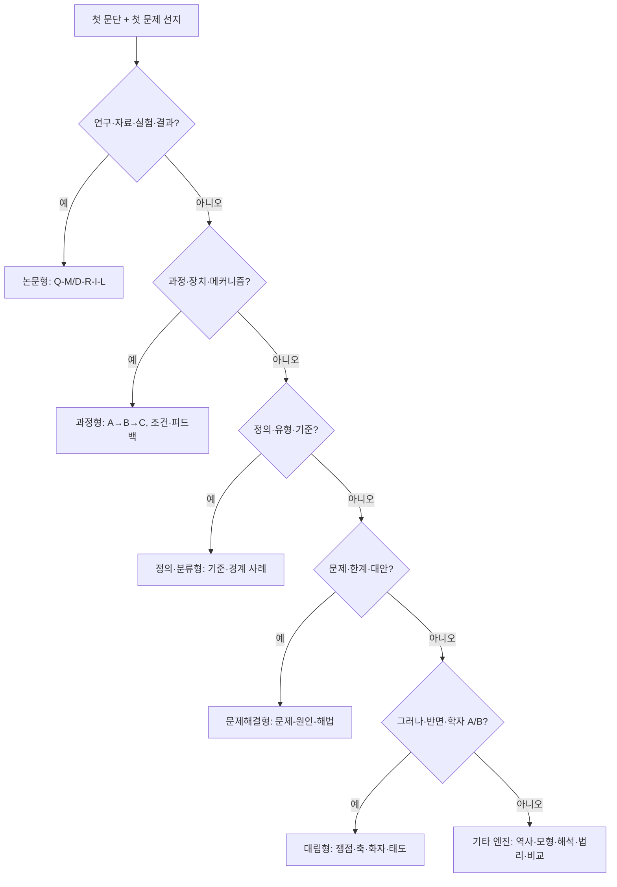
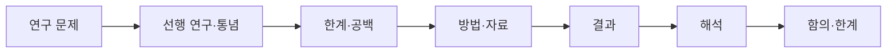
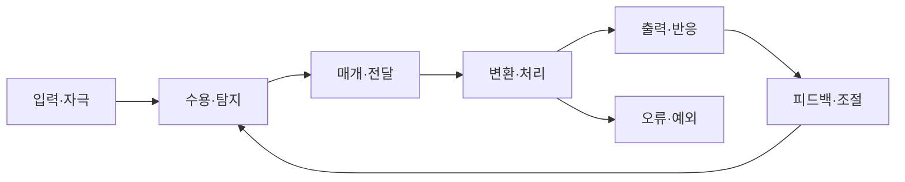
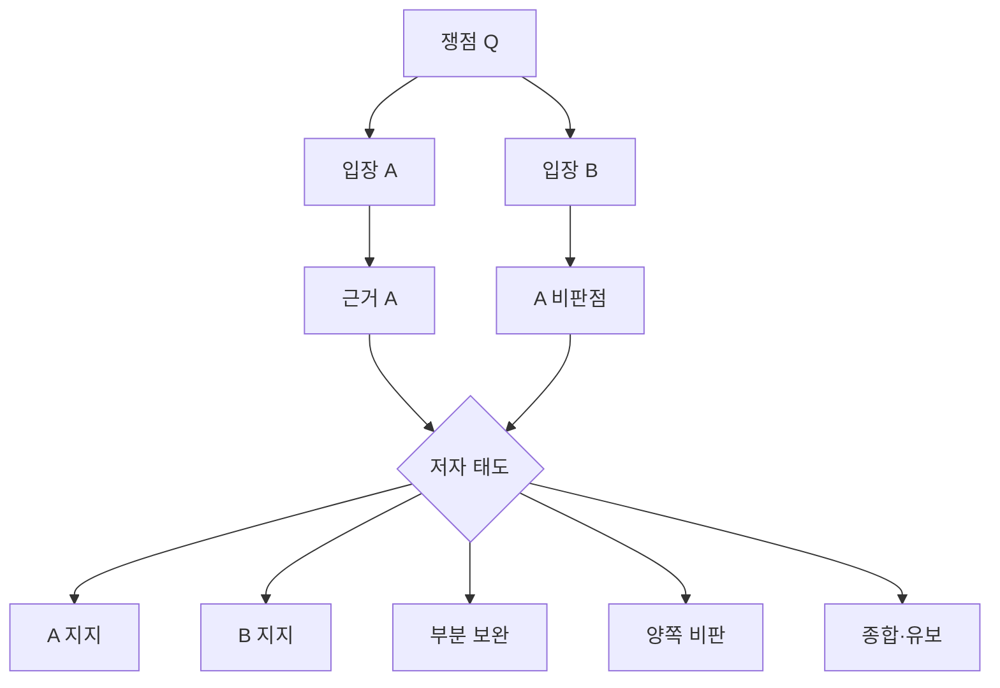

# LEET 언어이해 95점 전개방식·선지대응 종합본

>[!abstract] 핵심 명령
>언어이해는 지식 시험이 아니라 **전개 방식 → 축 → 선지 조작**을 식별하는 시험이다. 95점 목표에서는 “내용을 많이 이해했다”보다 **선지가 본문의 관계를 보존하는지**를 더 빠르게 판정해야 한다.

---

## 0. 시험장 최상위 알고리즘

>[!note] 30초 판별
>첫 문단과 첫 문제 선지를 보고 아래 순서로 판별한다.
>
>1. **전개 엔진**: 논문형 / 과정형 / 정의·분류형 / 문제해결형 / 역사발전형 / 모형·가정형 / 법리·규범형 / 해석·비평형 / 비교읽기형 / 대립형
>2. **축**: 무엇과 무엇이 갈리는가?  
>   예: 실재/구성, 보편/특수, 규칙/원리, 구조/행위, 효율/형평, 사실/가치
>3. **선지 조작 위치**: 주체 / 관계 / 조건 / 범위 / 태도 / 층위 / 시간 / 평가어 중 어디를 바꿨는가?

### 0.1 95점 목표자의 기본 태도

| 단계 | 하수 | 95점 목표자 |
|---|---|---|
| 지문 읽기 | 문장을 모두 이해하려 함 | 문단 기능과 관계를 먼저 잡음 |
| 전문용어 | 뜻을 외우려 함 | 기호로 치환하고 동사·관계만 추적 |
| 대립형 | A와 B 내용을 각각 기억 | **쟁점 Q**와 **축**으로 압축 |
| 논문형 | 연구 내용을 요약 | **문제-방법-결과-해석**의 대응만 고정 |
| 선지 판단 | 본문에 나온 단어를 찾음 | 주체·관계·범위·태도 보존 여부를 검사 |
| 고난도 문항 | 오래 붙잡음 | 축이 안 잡히면 표시 후 회수 |

### 0.2 선지 검사용 8항목

>[!tip] `S-R-C-M-L-T-E-Q`
>선지는 아래 8개 중 하나를 바꿔 오답이 된다.

| 코드 | 검사 항목 | 질문 | 대표 오답 조작 |
|---|---|---|---|
| `S` | Source / 주체 | 누구의 말인가? | 저자 견해를 기존 견해로, A 견해를 B 견해로 바꿈 |
| `R` | Relation / 관계 | 무엇이 무엇을 일으키거나 지지하는가? | 인과 역전, 근거와 결론 뒤바꿈 |
| `C` | Condition / 조건 | 어떤 조건에서만 성립하는가? | 필요조건을 충분조건화, 조건 누락 |
| `M` | Modality / 양상 | 가능/필연/대체로/항상 중 무엇인가? | 가능성을 필연으로, 일부를 전부로 과장 |
| `L` | Level / 층위 | 개인/제도/사회, 관찰/해석 중 어느 층위인가? | 분석 수준 이동 |
| `T` | Time / 시간 | 전후·변화 단계가 맞는가? | 시대착오, 원인·결과 시점 전도 |
| `E` | Evaluation / 평가 | 저자의 태도 강도가 맞는가? | 보완을 전면 부정으로, 유보를 지지로 과장 |
| `Q` | Question / 쟁점 | 같은 질문에 답하는가? | 논점 이탈, 다른 문제의 답을 끼워 넣음 |

---

## 1. 축 먼저 읽기

전개 방식은 “글이 움직이는 방식”이고, 축은 “정보가 갈라지는 기준”이다. 고난도 지문은 내용을 많이 넣어서 어렵게 만드는 것이 아니라, **축을 숨기거나 중첩**해서 어렵게 만든다.

>[!warning] 95점 목표자의 금지 습관
>대립형이 나왔을 때 곧바로 “A는 무엇, B는 무엇”을 길게 적지 않는다. 먼저 **A와 B가 갈리는 기준**을 적는다.
>
>```text
>쟁점 Q: ________?
>축: ________ vs ________
>A: 결론 / 근거 / 약점
>B: 결론 / 근거 / A 비판점
>저자: 지지 / 비판 / 보완 / 종합 / 유보
>```

### 1.1 보편 축 인덱스

| 축 | 한쪽 | 다른 쪽 | 선지에서 자주 바뀌는 지점 |
|---|---|---|---|
| 실재/구성 | 대상은 독립적으로 존재 | 대상은 인식·언어·사회가 구성 | 발견을 구성으로, 구성론을 임의성으로 과장 |
| 보편/특수 | 일반 원리·법칙 | 개별 맥락·사례 | 특수 조건을 보편 명제로 확장 |
| 내부/외부 | 내재적 구조·성질 | 외부 환경·제도·맥락 | 내부 원인을 외부 원인으로 바꿈 |
| 구조/행위 | 제도·구조가 결정 | 개인·행위자가 선택 | 구조 설명을 개인 책임론으로 이동 |
| 의도/결과 | 행위자의 의도 | 실제 결과·효과 | 좋은 의도와 좋은 결과를 동일시 |
| 사실/가치 | 기술적 설명 | 규범적 평가 | “그러하다”를 “그래야 한다”로 바꿈 |
| 원인/이유 | 자연적 인과 | 합리적 근거·정당화 | 발생 원인을 정당화 이유로 오독 |
| 규칙/원리 | 명확한 요건 | 가치 형량·원칙 최적화 | 예외적 형량을 기계적 규칙처럼 처리 |
| 절차/실질 | 절차의 정당성 | 결과의 실질적 정의 | 절차 충족을 실질 정당성으로 확대 |
| 형식/내용 | 구조·형식 | 의미·내용 | 형식적 특징을 사회적 내용으로 바꿈 |
| 효율/형평 | 총량·최적화 | 분배·공정성 | 효율 개선을 형평 개선으로 오독 |
| 자유/질서 | 자율성·선택 | 안정·통제 | 자유 제한의 이유를 질서가 아닌 효율로 바꿈 |
| 안정/변화 | 예측가능성·연속성 | 개혁·전환 | 부분 수정을 전면 폐기로 과장 |
| 환원/창발 | 부분으로 설명 | 전체 수준의 새 성질 | 전체 효과를 부분의 단순 합으로 처리 |
| 정태/동태 | 고정 구조 | 변화 과정 | 시간적 변화를 정적인 속성으로 바꿈 |
| 예측/설명 | 맞히는 능력 | 원인 이해 | 예측 성공을 진리 설명으로 확대 |
| 객관/해석 | 사실의 복원 | 관점에 따른 구성 | 해석 가능성을 객관성 부정으로 과장 |
| 중심/주변 | 핵심 원리 | 보조 사례·배경 | 예시를 중심 주장처럼 만듦 |
| 미시/거시 | 개인·세포·행위 | 사회·제도·생태계 | 분석 단위를 이동시킴 |
| 정상/이상 | 표준 작동 | 오류·예외·병리 | 예외 상황을 일반 원리로 확대 |

### 1.2 논문형 분석축

논문형은 단순 정보 설명이 아니라 **연구자가 어떤 질문에 어떤 방법으로 답했는가**를 압축한 글이다. 따라서 일반 대립축과 별도로 논문형 전용 축을 잡아야 한다.

| 논문형 축 | 읽는 질문 | 선지 함정 |
|---|---|---|
| 문제/결과 | 연구 질문과 결과가 대응하는가? | 다른 질문에 대한 결과를 정답처럼 제시 |
| 자료/해석 | 관찰 사실인가, 연구자의 설명인가? | 결과를 해석으로, 해석을 결과로 바꿈 |
| 방법/결론 | 방법이 실제로 결론을 뒷받침하는가? | 방법의 장점을 결론의 참으로 확대 |
| 가설/검증 | 무엇을 검증하려 했는가? | 검증 대상이 아닌 명제를 입증한 것처럼 처리 |
| 표본/모집단 | 어느 범위까지 일반화 가능한가? | 제한된 표본을 전체 현상으로 일반화 |
| 상관/인과 | 함께 변한 것인가, 원인인가? | 상관관계를 인과관계로 바꿈 |
| 조작/측정 | 무엇을 조작하고 무엇을 측정했는가? | 독립변수·종속변수 혼동 |
| 통제/교란 | 통제된 변수와 대안 원인은 무엇인가? | 통제 실패를 무시하거나 대안 원인을 삭제 |
| 모델/현실 | 모형의 가정 안에서만 성립하는가? | 모형 결론을 현실 일반 명제로 바꿈 |
| 한계/함의 | 저자가 어디까지 말했는가? | 한계 인정을 전면 부정으로 과장 |
| 선행연구/저자 | 기존 견해와 저자 견해가 다른가? | 기존 연구의 주장을 저자 결론으로 둔갑 |
| 설명/처방 | 현상을 설명하는가, 정책을 제안하는가? | 실증 설명을 규범 처방으로 바꿈 |

### 1.3 분야별 축 인덱스

#### 철학·인식론

| 축 | 한쪽 | 다른 쪽 | 선지 포인트 |
|---|---|---|---|
| 존재론 | 실재론 | 유명론·구성주의 | 보편자·범주의 존재 여부 |
| 인식론 | 합리론 | 경험론 | 지식의 원천 |
| 정당화 | 토대주의 | 정합주의 | 근거 구조 |
| 의미론 | 기술주의 | 지시주의 | 이름의 의미와 지시 |
| 심신문제 | 이원론 | 물리주의·기능주의 | 정신의 독립성 |
| 자유의지 | 결정론 | 자유의지·양립가능론 | 책임의 가능성 |
| 해석학 | 저자 의도 | 텍스트 구조·독자 수용 | 의미의 소재 |

#### 윤리·규범철학

| 축 | 한쪽 | 다른 쪽 | 선지 포인트 |
|---|---|---|---|
| 판단 기준 | 의무론 | 공리주의 | 행위 자체 vs 결과 |
| 행위자 평가 | 덕윤리 | 규칙·결과 중심 윤리 | 행위 판단과 인격 평가 구분 |
| 보편/특수 | 보편주의 | 도덕 특수주의 | 원칙 적용 가능성 |
| 권리/복지 | 개인 권리 | 전체 후생 | 침해 불가능성 vs 총효용 |
| 정의론 | 자유 | 평등·분배 | 우선 가치 |
| 책임 | 응보 | 예방·교정 | 처벌 정당화 기준 |

#### 법학·법철학

| 축 | 한쪽 | 다른 쪽 | 선지 포인트 |
|---|---|---|---|
| 법의 본질 | 자연법 | 법실증주의 | 법과 도덕의 연결 여부 |
| 재판관 | 형식주의 | 법현실주의 | 법문 vs 판사·사회 요인 |
| 해석 | 문언 | 목적·체계 | 법문 그대로 vs 입법 취지 |
| 규범 구조 | 규칙 | 원리 | 요건-효과 vs 형량 |
| 가치 | 법적 안정성 | 구체적 타당성 | 예측가능성 vs 개별 정의 |
| 권한 | 사법적극주의 | 사법소극주의 | 법원이 어디까지 개입하는가 |
| 절차/실체 | 절차적 정당성 | 실체적 정의 | 과정의 정당성과 결과의 정당성 |
| 권리 제한 | 기본권 보장 | 공익·질서 | 제한의 필요성과 비례성 |

#### 경제·정책

| 축 | 한쪽 | 다른 쪽 | 선지 포인트 |
|---|---|---|---|
| 시장관 | 시장 효율 | 시장 실패 | 정부개입 필요성 |
| 인간관 | 완전합리성 | 제한된 합리성 | 예측과 실제 행동 차이 |
| 정보 | 완전정보 | 정보비대칭 | 역선택·도덕적 해이 |
| 정책 기준 | 효율성 | 형평성 | 총후생 vs 분배 |
| 외부효과 | 피구세 | 코즈 협상 | 정부 조정 vs 권리 설정 |
| 분석 수준 | 개인 선택 | 제도·구조 | 미시/거시 구분 |
| 시간 | 단기 효율 | 장기 안정성 | 당장의 성과와 지속 가능성 |

#### 정치·사회

| 축 | 한쪽 | 다른 쪽 | 선지 포인트 |
|---|---|---|---|
| 정치철학 | 자유주의 | 공동체주의 | 무연고적 자아 vs 연고적 자아 |
| 사회분석 | 개인주의 | 구조주의·사회실재론 | 개인 행위 vs 구조 |
| 국제정치 | 현실주의 | 자유주의·구성주의 | 권력, 제도, 규범 |
| 사회 작동 | 기능론 | 갈등론 | 통합 vs 지배·불평등 |
| 불평등 | 경제자원 | 문화자본·상징권력 | 물질 vs 문화·상징 |
| 정체성 | 본질주의 | 구성주의 | 고정 본질 vs 사회적 형성 |
| 변화 | 엘리트 주도 | 대중·운동 주도 | 변화 주체 |

#### 과학·기술철학

| 축 | 한쪽 | 다른 쪽 | 선지 포인트 |
|---|---|---|---|
| 이론 지위 | 과학적 실재론 | 도구주의·반실재론 | 이론은 진리인가 도구인가 |
| 과학 변화 | 누적주의 | 반증주의·패러다임 전환 | 축적 vs 단절 |
| 방법 | 귀납 | 가설연역·반증 | 일반화 vs 검증 구조 |
| 설명 수준 | 환원주의 | 창발주의 | 부분 vs 전체 |
| 기술사회 | 기술결정론 | 사회구성론 | 기술이 사회를 바꾸나 사회가 기술을 빚나 |
| 위험 | 예방 원칙 | 비용편익 | 불확실성 대응 |
| 데이터 | 관찰 | 이론 의존성 | 자료는 중립적인가 |

#### 역사·예술

| 축 | 한쪽 | 다른 쪽 | 선지 포인트 |
|---|---|---|---|
| 역사 서술 | 객관적 복원 | 관점 구성 | 과거는 발견인가 서술인가 |
| 변화 설명 | 사건사 | 구조사 | 인물·사건 vs 장기 구조 |
| 예술 본질 | 모방론 | 표현론·형식론·제도론 | 예술성의 기준 |
| 예술 가치 | 자율성 | 사회성 | 작품 내적 형식 vs 사회 역사 |
| 해석 권한 | 작가 | 텍스트·독자 | 의미의 주체 |
| 미학 기준 | 형식 | 내용·맥락 | 작품 평가 기준 |

---

## 2. 논문형 세분화

논문형은 95점 목표에서 가장 중요하게 앞쪽에 두어야 한다. 이유는 두 가지다.

1. LEET 언어이해의 많은 비대립 지문은 단순 설명문이 아니라 **학술 논문의 압축본**처럼 움직인다.
2. 고난도 선지는 논문형에서 특히 **자료/해석, 방법/결론, 상관/인과, 표본/모집단**을 바꾼다.

>[!important] 논문형 표준 흐름
>```text
>연구 문제/현상 → 선행 연구·통념 → 한계·공백 → 방법·자료 → 결과 → 해석 → 함의·한계
>```

### 2.1 논문형 전체 지도

| 번호 | 논문형 하위 유형 | 표준 흐름 | 핵심 축 | 선지 함정 |
|---:|---|---|---|---|
| 1 | 실증 연구형 | 질문 → 자료 → 분석 → 결과 → 해석 | 자료/해석 | 관찰 결과를 저자 해석으로 바꿈 |
| 2 | 실험 연구형 | 가설 → 실험 설계 → 변수 통제 → 결과 → 원인 추론 | 조작/측정 | 독립·종속변수 혼동, 통제 실패 누락 |
| 3 | 가설 검증형 | 문제 → 가설 A/B → 예측 → 증거 → 채택·수정 | 가설/검증 | 증거가 지지하는 가설 범위 확대 |
| 4 | 이론 논문형 | 기존 개념 → 문제점 → 새 개념·모형 → 귀결 | 개념/귀결 | 정의와 결론 뒤섞기 |
| 5 | 개념 재구성형 | 통념 정의 → 경계 사례 → 기준 수정 → 새 정의 | 기준/경계 | 분류 기준 바꿔치기 |
| 6 | 문헌 검토형 | 선행 견해들 → 공통점·차이 → 평가 → 정리 | 주체/견해 | 기존 견해를 저자 견해로 오독 |
| 7 | 방법론 논문형 | 기존 방법 한계 → 새 방법 → 절차 → 장점·한계 | 방법/문제 | 방법의 장점을 결론의 참으로 확대 |
| 8 | 모델·가정형 논문 | 현상 단순화 → 가정 → 변수 → 예측 → 한계 | 모델/현실 | 가정 삭제, 현실 일반화 |
| 9 | 역사적 논문형 | 기존 단계 → 전환 계기 → 변화 → 현재적 의미 | 연속/단절 | 후대 관점을 전대에 적용 |
| 10 | 비평·해석 논문형 | 대상 → 기존 해석 → 한계 → 새 해석 → 근거 | 사실/해석 | 작품 사실과 해석자의 주장 혼동 |
| 11 | 법리 논문형 | 원칙 → 요건 → 예외 → 사례 → 형량·결론 | 규칙/원리 | 원칙과 예외 뒤섞기 |
| 12 | 정책평가 논문형 | 정책 문제 → 평가 기준 → 자료 → 효과 → 부작용 | 효율/형평 | 효과를 정당성으로, 단기 효과를 장기 효과로 확대 |
| 13 | 메타이론 논문형 | 이론들의 전제 → 공통 한계 → 새 관점 → 함의 | 전제/차원 | 종합을 단순 절충으로 오해 |
| 14 | 융합 논문형 | 한 분야 문제 → 다른 분야 방법 적용 → 설명 확장 | 방법/대상 | 차용한 방법의 범위 초과 |

### 2.2 실증 연구형

```text
질문 → 자료 수집 → 분석 기준 → 결과 → 해석 → 한계
```

| 읽을 것 | 메모 | 선지 판단 |
|---|---|---|
| 연구 질문 | Q = 무엇을 밝히려는가 | 답이 Q와 맞는지 확인 |
| 자료 | D = 어떤 자료인가 | 표본 범위 확인 |
| 결과 | R = 관찰된 사실 | 사실과 해석 분리 |
| 해석 | I = 연구자의 설명 | 과장·규범화 여부 확인 |
| 한계 | L = 일반화 제한 | 선지가 한계를 지웠는지 확인 |

>[!warning] 대표 오답
>- 표본에서 발견된 경향을 전체 사회의 법칙으로 일반화
>- 자료가 보여준 상관관계를 원인관계로 단정
>- 연구자의 조심스러운 해석을 확정적 결론으로 바꿈

### 2.3 실험 연구형

```text
가설 → 실험 설계 → 조작변수 → 측정변수 → 통제변수 → 결과 → 원인 추론
```

| 요소 | 질문 | 선지 함정 |
|---|---|---|
| 조작변수 | 연구자가 바꾼 것은 무엇인가? | 측정값을 조작한 것처럼 제시 |
| 측정변수 | 무엇을 결과로 보았는가? | 결과 지표를 원인 지표로 바꿈 |
| 통제변수 | 무엇을 같게 유지했는가? | 통제하지 않은 변수를 무시 |
| 비교집단 | 무엇과 무엇을 비교했는가? | 비교 대상 변경 |
| 추론 | 결과가 어떤 인과를 허용하는가? | 대안 원인 삭제 |

### 2.4 가설 검증형

```text
현상 P → 가설 H1/H2 → 각각의 예측 → 증거 E → H1 지지 / H2 약화 / 수정
```

| 지점 | 95점 독해 |
|---|---|
| 가설 | 내용보다 **예측 차이**를 잡는다. |
| 증거 | 어떤 가설에 유리하고 어떤 가설에 불리한지 표시한다. |
| 결론 | 가설의 전면 확정인지, 부분 지지인지, 수정인지 구분한다. |

>[!example] 선지화 방식
>본문: “H1이면 A가 관찰되어야 하고, H2이면 B가 관찰되어야 한다. 실제로 A가 관찰되었다.”  
>정답: “이 결과는 H1을 H2보다 더 지지한다.”  
>오답: “이 결과는 H2가 거짓임을 확정한다.” / “A가 H1의 원인이다.”

### 2.5 이론 논문형

```text
기존 개념 → 설명 실패 → 새 개념·모형 → 기존 문제 해결 → 함의
```

| 읽을 것 | 메모 |
|---|---|
| 기존 이론의 설명 대상 | X를 설명하려 했다 |
| 실패 지점 | X 중 Y를 설명하지 못했다 |
| 새 개념 | Z를 도입한다 |
| 해결 방식 | Z가 Y를 설명한다 |
| 함의 | 기존 이론은 폐기/수정/보완 중 무엇인가 |

>[!warning] 대표 오답
>- 기존 이론의 일부 한계를 전면 폐기로 과장
>- 새 이론의 설명 범위를 기존 이론의 모든 문제로 확대
>- 새 개념의 전제를 결론처럼 제시

### 2.6 개념 재구성형

```text
통념 정의 → 반례·경계 사례 → 기준 수정 → 새 정의 → 적용
```

| 핵심 | 설명 |
|---|---|
| 기준 | 무엇 때문에 A가 A인가? |
| 경계 사례 | A인지 아닌지 애매한 사례는 무엇인가? |
| 수정 | 어떤 기준을 버리고 어떤 기준을 세우는가? |

>[!tip] 선지 검사
>개념 재구성형은 본문 어휘보다 **분류 기준**이 중요하다. 오답은 대개 본문에 나온 사례를 쓰되, 기준을 다른 것으로 바꾼다.

### 2.7 문헌 검토형

```text
학자 A → 학자 B → 학자 C → 공통점·차이 → 저자의 평가
```

| 검사 항목 | 질문 |
|---|---|
| 주체 | 누가 주장했는가? |
| 관계 | A와 B는 대립, 보완, 계승 중 무엇인가? |
| 저자 | 저자는 정리자인가, 평가자인가? |
| 최종 | 저자가 새 입장을 제시하는가? |

>[!warning] 대표 오답
>- A와 B의 공통점을 차이점으로 제시
>- B의 비판 대상을 A 전체로 과장
>- 저자가 소개한 견해를 저자가 지지한다고 처리

### 2.8 방법론 논문형

```text
기존 방법의 한계 → 새 방법의 절차 → 해결되는 문제 → 남는 한계
```

| 읽을 것 | 선지 함정 |
|---|---|
| 기존 방법의 한계 | 기존 방법이 아무 쓸모 없다고 과장 |
| 새 방법의 절차 | 단계 순서 바꿈 |
| 해결 문제 | 다른 문제를 해결한다고 함 |
| 남는 한계 | 한계가 없다고 함 |

### 2.9 모델·가정형 논문

```text
현실 단순화 → 가정 설정 → 변수 관계 → 예측 → 가정 완화·한계
```

| 요소 | 메모 예시 |
|---|---|
| 가정 | 완전정보, 거래비용 없음, 합리적 선택자 |
| 변수 | X 증가, Y 감소 |
| 관계 | X↑ → Y↓ |
| 예측 | C 조건에서 R 발생 |
| 한계 | C가 깨지면 R 약화 |

>[!warning] 대표 오답
>- 모형 안의 결론을 현실 일반 결론으로 제시
>- X가 Y를 줄인다는 관계를 X가 Y를 늘린다고 바꿈
>- 기술적 예측을 규범적 권고로 바꿈

### 2.10 역사적 논문형

```text
초기 상태 → 변화 압력 → 전환 계기 → 새 체계 → 현재적 의미
```

| 추적 대상 | 질문 |
|---|---|
| 단계 | 몇 시기로 나뉘는가? |
| 원인 | 변화 원인은 내부 모순인가 외부 충격인가? |
| 지속 | 무엇이 유지되었는가? |
| 단절 | 무엇이 폐기되었는가? |
| 평가 | 저자는 발전, 왜곡, 재구성 중 무엇으로 보는가? |

### 2.11 비평·해석 논문형

```text
작품·현상 → 기존 해석 → 한계 → 새 해석 기준 → 근거 → 의의
```

| 구분 | 확인 질문 |
|---|---|
| 대상 | 작품 자체인가, 작가인가, 독자인가, 시대인가? |
| 기준 | 형식, 표현, 사회성, 역사성, 의도, 수용 중 무엇인가? |
| 기존 해석 | 무엇을 보았고 무엇을 놓쳤는가? |
| 새 해석 | 어떤 기준으로 재평가하는가? |
| 저자 태도 | 전면 부정인가, 보완인가? |

### 2.12 법리 논문형

```text
규범·원칙 → 요건 → 효과 → 예외 → 사례 적용 → 형량·결론
```

| 요소 | 메모 |
|---|---|
| 원칙 | 기본 규칙 |
| 요건 | 충족되어야 하는 사실 A/B/C |
| 효과 | 요건 충족 시 결과 |
| 예외 | 원칙 제한 조건 |
| 형량 | 충돌 가치 |
| 적용 | 사례 사실이 어느 요건에 대응하는가 |

>[!warning] 대표 오답
>- 예외를 원칙처럼 제시
>- A, B, C가 모두 필요한데 A만 보고 결론
>- 현행법 설명과 저자의 당위론을 바꿈

### 2.13 정책평가 논문형

```text
정책 문제 → 평가 기준 → 자료 → 효과 → 부작용 → 최종 판단
```

| 평가 기준 | 선지 함정 |
|---|---|
| 효율성 | 비용 감소를 분배 개선으로 오독 |
| 형평성 | 분배 개선을 전체 후생 증가로 오독 |
| 자유 | 선택권 증가와 실질 역량 증가 혼동 |
| 안정성 | 단기 성과를 장기 안정성으로 확대 |
| 실행가능성 | 당위적 필요를 실행 가능성으로 둔갑 |

### 2.14 메타이론·융합 논문형

```text
여러 이론의 공통 전제 → 그 전제의 한계 → 새 차원 도입 → 기존 이론 재배치
```

>[!important] 고난도 포인트
>메타이론형의 정답은 보통 “A와 B를 절충한다”가 아니라, **A와 B가 공유한 전제 자체를 바꾼다**에 가깝다. 오답은 이를 단순 중간값으로 처리한다.

---

## 3. 실제 기출 선지 조작 패턴

실제 언어이해 선지는 대체로 본문 어휘를 그대로 가져오되, **관계·범위·태도·주체**를 바꾼다. 따라서 “본문에 나온 말인가?”보다 “본문에서 그 말이 맡은 기능이 같은가?”를 물어야 한다.

### 3.1 정답 선지의 일반형

| 정답 유형 | 특징 | 판단 기준 |
|---|---|---|
| 추상화형 | 본문 표현을 더 추상적인 말로 바꿈 | 관계가 보존되면 정답 가능 |
| 재배열형 | 여러 문단의 정보를 묶음 | 순서·조건이 보존되어야 함 |
| 제한형 | 강한 표현 대신 조건부 표현 사용 | 지문의 유보와 맞으면 정답 가능 |
| 구조형 | 문단 기능을 묻는 선지 | 배경/문제/반론/결론 기능이 맞는지 확인 |
| 적용형 | 새로운 사례를 지문 원리에 맞춤 | 사례의 어느 요소가 어느 변수에 대응하는지 확인 |
| 함의형 | 직접 표현은 없지만 구조상 따라 나옴 | 지문 전제에서 필연 또는 강하게 지지되는지 확인 |

### 3.2 오답 선지의 40개 조작

| 번호 | 조작 | 설명 | 즉시 소거 질문 |
|---:|---|---|---|
| 1 | 주체 바꾸기 | A 견해를 B 견해로 제시 | “누가 말했나?” |
| 2 | 저자 귀속 오류 | 소개된 견해를 저자 주장으로 제시 | “저자가 지지했나, 소개했나?” |
| 3 | 관점 혼합 | A 결론에 B 전제를 섞음 | “한 사람의 입장으로 일관되나?” |
| 4 | 태도 과장 | 부분 인정 → 전면 찬성/부정 | “강도 표현이 맞나?” |
| 5 | 쟁점 이탈 | 논쟁 질문과 다른 답을 제시 | “같은 Q에 답하나?” |
| 6 | 적용 범위 확대 | 특정 조건 → 일반 명제 | “조건이 삭제됐나?” |
| 7 | 적용 범위 축소 | 일반 주장 → 특정 사례 한정 | “지문보다 좁혔나?” |
| 8 | 필요조건 충분조건화 | A 필요 → A면 충분 | “필요와 충분이 바뀌었나?” |
| 9 | 충분조건 필요조건화 | A면 B → B려면 A 필요 | “역이 성립하나?” |
| 10 | 인과 역전 | A→B를 B→A로 바꿈 | “화살표 방향이 맞나?” |
| 11 | 상관의 인과화 | 함께 변함 → 원인 | “원인이라고 했나?” |
| 12 | 결과의 원인화 | 결과를 원인처럼 제시 | “시간 순서가 맞나?” |
| 13 | 매개 단계 생략 | A→M→B를 A→B로 단순화 | “중간 조건이 빠졌나?” |
| 14 | 억제 지점 오류 | 억제제가 작용하는 단계를 바꿈 | “어느 단계가 막히나?” |
| 15 | 피드백 방향 오류 | 음성/양성 되먹임 반전 | “결과가 원인을 줄이나 늘리나?” |
| 16 | 예시 일반화 | 사례 하나를 원리 전체로 확대 | “예시는 근거인가 설명 보조인가?” |
| 17 | 배경 중심화 | 배경 정보를 중심 주장처럼 제시 | “글의 결론인가?” |
| 18 | 보조 논점 중심화 | 주변 설명을 주제화 | “전체 회수 구조와 맞나?” |
| 19 | 기존 견해와 새 견해 혼동 | 정설을 저자의 수정 견해로 제시 | “전환 뒤 입장인가?” |
| 20 | 반론 대상 변경 | B가 A의 일부만 비판했는데 A 전체 비판으로 제시 | “무엇을 비판했나?” |
| 21 | 한계의 전면화 | 일부 한계 → 전면 무효 | “저자가 폐기했나, 수정했나?” |
| 22 | 가능성의 필연화 | 가능/시사 → 반드시 | “양상 표현이 강해졌나?” |
| 23 | 빈도 과장 | 일부/대체로 → 항상/모두 | “수량어가 바뀌었나?” |
| 24 | 부정 범위 오류 | A가 아님 → A와 무관함 | “부정의 범위가 맞나?” |
| 25 | 시간 착오 | 후대 개념을 전대 입장으로 제시 | “시점이 맞나?” |
| 26 | 연속/단절 혼동 | 수정·발전을 단절로, 단절을 연속으로 제시 | “저자는 무엇이 유지된다고 했나?” |
| 27 | 층위 이동 | 개인 설명을 제도 설명으로 이동 | “분석 단위가 맞나?” |
| 28 | 사실/가치 혼동 | 설명을 처방으로 제시 | “무엇인가 vs 무엇이어야 하나?” |
| 29 | 원인/이유 혼동 | 발생 원인을 정당화 이유로 제시 | “왜 생겼나 vs 왜 옳은가?” |
| 30 | 관찰/해석 혼동 | 자료 결과와 연구자 해석을 섞음 | “측정값인가 설명인가?” |
| 31 | 방법/결론 혼동 | 방법이 우수하니 결론이 참이라고 함 | “방법이 무엇을 보장하나?” |
| 32 | 표본/모집단 혼동 | 제한 표본을 전체로 일반화 | “대상 범위가 맞나?” |
| 33 | 비교 기준 변경 | A와 B를 다른 기준으로 비교 | “비교 축이 같나?” |
| 34 | 유사성 과장 | 일부 유사 → 본질 동일 | “공통점의 범위가 맞나?” |
| 35 | 차이성 과장 | 차이 하나 → 완전 대립 | “다른 점이 핵심인가?” |
| 36 | 법리 요건 누락 | 다요건 중 일부만 충족 | “모든 요건이 충족됐나?” |
| 37 | 원칙/예외 전도 | 예외를 원칙처럼 제시 | “일반 규칙인가 예외인가?” |
| 38 | 형량의 절대화 | 가치 비교를 한 가치 절대 우위로 제시 | “조건부 우위인가?” |
| 39 | 사례 매핑 오류 | 보기 사례의 요소를 잘못 대응 | “이 사례의 X는 지문 변수 중 무엇인가?” |
| 40 | 지시어 오인 | “이러한”, “전자의” 지칭 대상 오류 | “가장 가까운 명사가 아니라 실제 선행 내용은?” |

### 3.3 발문별 선지 처리

| 발문 | 먼저 볼 것 | 오답 우선 소거 |
|---|---|---|
| 주제·제목 | 마지막 회수 구조, 문제-결론 대응 | 너무 좁은 예시형, 너무 넓은 배경형 |
| 구조 | 단락 기능 | 내용 요약은 맞지만 기능이 틀린 선지 |
| 세부 일치 | 지문 위치와 조건 | 단어는 같은데 관계가 다른 선지 |
| 추론 | 명시 전제와 조건 | 가능성을 필연화한 선지 |
| 적용 | 보기 요소와 지문 변수 대응 | 변수 매핑 오류 |
| 평가 | 근거의 취약점 | 대안 원인, 표본 편향, 통제 실패 |
| 비교 | 공통 쟁점과 차이 축 | 한 글의 용어를 다른 글에 무단 이전 |
| 태도 | 평가어·양상어 | 중립을 지지/비판으로 과장 |

---

## 4. 전개 방식 전체 지도

| 전개 방식 | 표준 흐름 | 독해 핵심 | 대표 선지 함정 |
|---|---|---|---|
| 논문형 | 문제 → 선행연구 → 방법·자료 → 결과 → 해석 → 한계 | 연구 질문과 결론 대응 | 결과와 해석 혼동 |
| 과정·메커니즘형 | 입력 → 단계 → 변환 → 산출 → 피드백·오류 | 방향·순서·조건 | 인과 역전, 단계 생략 |
| 단일 이론 전개형 | 현상 → 개념 → 원리 → 적용 → 한계 | 이론의 적용 조건 | 적용범위 과장 |
| 정의·분류형 | 개념 → 기준 → 하위 유형 → 경계 사례 | 분류 기준 | 기준 바꿔치기 |
| 문제해결형 | 문제 → 원인 → 기존 해법 한계 → 새 해법 → 평가 | 문제-해법 대응 | 다른 문제의 해법 제시 |
| 역사발전형 | 초기 상태 → 변화 계기 → 전환 → 현재 의미 | 연속/단절 | 시대 착오 |
| 모형·가정형 | 가정 → 변수 → 예측 → 한계 | 가정과 결론 연결 | 가정 삭제 |
| 해석·비평형 | 대상 → 기존 해석 → 한계 → 새 해석 → 근거 | 해석 기준 | 작품 사실과 해석 혼동 |
| 법리·규범형 | 원칙 → 요건 → 예외 → 사례 → 형량 | 요건-효과 | 원칙·예외 전도 |
| 비교읽기형 | A 구조 → B 구조 → 공통 쟁점 → 차이 축 | 두 글의 관계 | 참조 실패, 용어 이전 |
| 대립형 | 쟁점 → A → B/반론 → 저자 평가 → 종합·유보 | 화자·축·태도 | 관점 혼동 |

---

## 5. 과정·메커니즘형

>[!note] 범용 골격
>```text
>입력/자극 → 수용/탐지 → 매개/전달 → 변환/처리 → 출력/반응 → 피드백/조절 → 오류/예외
>```

### 5.1 읽는 법

| 추적 대상 | 질문 | 메모 |
|---|---|---|
| 방향 | 무엇이 무엇을 일으키는가? | `A → B` |
| 순서 | 무엇이 먼저이고 나중인가? | `1, 2, 3` |
| 조건 | 무엇이 있어야 작동하는가? | `C 필요` |
| 억제 | 무엇이 어느 단계에서 막는가? | `X ⊣ Y` |
| 증폭 | 작은 원인이 어떻게 큰 결과가 되는가? | `A ⇑ B` |
| 피드백 | 결과가 다시 원인을 조절하는가? | `R ↺ A` |

### 5.2 생명과학 템플릿

#### 유전정보형

```text
DNA → RNA → 단백질 → 기능·형질
```

| 단계 | 선지 함정 |
|---|---|
| DNA | 유전자 존재와 발현을 혼동 |
| RNA | 전사량과 단백질 기능을 무조건 비례시킴 |
| 단백질 | 단백질 구조 변화와 기능 변화를 단선화 |
| 기능 | 세포 수준 결과를 개체 전체 결과로 일반화 |

#### 복제형

```text
주형 → 상보 결합 → 새 가닥 합성 → 오류 수정 → 산출
```

| 함정 | 설명 |
|---|---|
| 주형/새 가닥 혼동 | 원래 가닥과 합성 가닥을 뒤바꿈 |
| 상보 결합 역적용 | A-T, G-C 대응 방향 오류 |
| 효소 단계 오류 | 효소가 작용하는 위치를 바꿈 |
| 방향성 무시 | 합성 방향 조건 누락 |
| 오류 수정 시점 오류 | 복제 전/후 단계 혼동 |

#### PCR·시퀀싱형

```text
가열 분리 → 프라이머 결합 → 중합효소 연장 → 반복 증폭 → 표지·판독 → 원서열 추론
```

| 핵심 | 선지 함정 |
|---|---|
| 프라이머 | 표적 구간을 정한다는 점 누락 |
| 반복 | 증폭의 누적성 무시 |
| 표지 | 관찰 신호와 원래 DNA 혼동 |
| 역추론 | 조각 정보에서 원서열로 가는 방향 반전 |

#### 신호전달형

```text
리간드/자극 → 수용체 결합 → 세포 내 전달연쇄 → 증폭·분기 → 표적 반응 → 종료·피드백
```

| 포인트 | 선지 함정 |
|---|---|
| 수용체 특이성 | 신호가 아무 세포에나 작용한다고 함 |
| 전달연쇄 | 중간 단계를 생략 |
| 증폭 | 1:1 대응처럼 단순화 |
| 분기 | 한 경로 결과를 전체 결과로 일반화 |
| 종료 | 신호가 자동 지속된다고 오해 |
| 피드백 | 억제와 촉진 방향 반전 |

### 5.3 통신·정보·공학 템플릿

```text
정보원 → 부호화·압축 → 변조 → 채널 전송 → 잡음·손실 → 수신 → 복조·복호화 → 오류정정 → 피드백
```

| 요소 | 질문 | 함정 |
|---|---|---|
| 정보원 | 무엇을 보내려는가? | 원자료와 전송 신호 혼동 |
| 부호화 | 정보를 어떤 형식으로 바꾸는가? | 압축·암호화·부호화 혼동 |
| 변조 | 신호를 매체에 맞게 어떻게 싣는가? | 신호 내용과 운반파 혼동 |
| 채널 | 어떤 경로로 이동하는가? | 채널 용량과 실제 전송률 혼동 |
| 잡음 | 어디서 손상되는가? | 잡음 원인과 결과 혼동 |
| 복호화 | 받은 신호에서 정보를 어떻게 복원하는가? | 복조와 복호화 혼동 |
| 오류정정 | 오류를 어떻게 탐지·수정하는가? | 중복성을 비효율로만 이해 |
| 피드백 | 재전송·조정이 있는가? | 피드백 지연 효과 누락 |

### 5.4 제어·피드백 시스템형

```text
목표값 → 센서 측정 → 제어기 비교 → 구동기 작동 → 출력 → 피드백 → 안정화/진동
```

| 포인트 | 설명 |
|---|---|
| 음성 피드백 | 오차를 줄여 안정화 |
| 양성 피드백 | 변화를 증폭 |
| 지연 | 과잉 보정·진동 발생 가능 |
| 잡음 | 측정값이 실제 상태를 왜곡 |
| 안정성 | 외란 후 원래 상태로 돌아오는가 |

---

## 6. 정의·분류형

```text
개념 도입 → 기존 정의·통념 → 기준 제시 → 하위 유형 분류 → 경계 사례 → 정의의 의의
```

### 6.1 독해 포인트

| 읽을 것 | 질문 |
|---|---|
| 정의의 기준 | A가 A인 이유는 무엇인가? |
| 필요조건/충분조건 | 이 기준이 없으면 A가 아닌가, 이 기준만 있으면 A인가? |
| 경계 사례 | 애매한 사례를 어느 쪽으로 넣는가? |
| 분류 축 | 기준이 하나인가, 둘 이상인가? |
| 예외 | 정의를 수정하게 만드는 사례는 무엇인가? |

### 6.2 대표 함정

- **기준 바꿔치기**: 기능 기준인데 발생 원인 기준으로 판단.
- **상위·하위 혼동**: 상위 개념 특징을 하위 유형 모두에 적용.
- **필요조건의 충분조건화**: “A이려면 B 필요”를 “B이면 A”로 바꿈.
- **경계 사례 오독**: 지문이 애매하다고 한 사례를 명백한 사례로 처리.

---

## 7. 문제해결형

```text
문제·난점 → 원인 → 기존 해법의 한계 → 새 해법·대안 → 평가 → 남은 문제
```

| 단계 | 확인 질문 |
|---|---|
| 문제 | 정확히 무엇이 문제인가? |
| 원인 | 그 문제가 왜 생겼는가? |
| 기존 해법 | 무엇을 해결하려 했고 왜 부족했는가? |
| 새 해법 | 어떤 원인을 겨냥하는가? |
| 평가 | 성공 조건과 부작용은 무엇인가? |

>[!warning] 대표 함정
>- A 문제를 해결하는 방안인데 B 문제 해결책처럼 제시
>- 증상을 원인으로 바꿈
>- 기존 해법의 장점을 삭제하고 전면 실패로 과장
>- 새 해법의 조건을 누락하고 일반화

---

## 8. 역사발전형·통시형

```text
초기 상태 → 변화 압력·전환 계기 → 중간 단계 → 새로운 체계 → 현재적 의미·평가
```

| 추적 대상 | 질문 |
|---|---|
| 시대 구분 | 몇 단계로 나뉘는가? |
| 변화 원인 | 내부 모순인가, 외부 충격인가? |
| 지속 요소 | 바뀌지 않은 것은 무엇인가? |
| 단절 요소 | 새 단계에서 폐기된 것은 무엇인가? |
| 평가 | 저자는 발전, 왜곡, 구성, 복원 중 무엇으로 보는가? |

---

## 9. 모형·가정형

```text
현상 단순화 → 가정 설정 → 변수 정의 → 작동 원리 → 예측 → 가정 완화·한계
```

| 요소 | 메모 예시 |
|---|---|
| 가정 | 완전정보, 거래비용 없음, 합리적 선택자 |
| 변수 | X 증가, Y 감소 |
| 관계 | X↑ → Y↓ |
| 예측 | 조건 C에서 결과 R |
| 한계 | C가 깨지면 R도 약화 |

>[!warning] 대표 함정
>- 가정이 성립할 때만 나오는 결론을 현실 일반으로 확장
>- 변수 방향을 반대로 제시
>- 예측 모형을 규범적 주장으로 읽게 함
>- 상호작용 구조를 단선 인과로 단순화

---

## 10. 해석·비평형

```text
작품·현상 제시 → 기존 해석 → 기존 해석의 한계 → 새 해석·비평 기준 → 근거 → 의의
```

| 구분 | 확인 질문 |
|---|---|
| 대상 | 무엇을 해석하는가? |
| 기준 | 형식, 표현, 사회성, 역사성, 작가 의도, 독자 수용 중 무엇인가? |
| 기존 해석 | 무엇을 보았고 무엇을 놓쳤는가? |
| 새 해석 | 어떤 기준으로 재평가하는가? |
| 저자 태도 | 기존 해석을 전면 부정하는가, 보완하는가? |

---

## 11. 법리·규범 적용형

```text
규범·원칙 → 요건 → 효과 → 예외 → 사례 적용 → 형량·결론
```

### 11.1 요건-효과 메모법

```text
원칙 P: ______
요건: A + B + C
효과: R
예외: E일 때 P 제한
형량: 가치 X vs 가치 Y
사례: 사실 a/b/c가 요건 A/B/C에 대응하는가?
```

### 11.2 선지 함정

- 원칙과 예외를 뒤섞는다.
- 요건 일부 충족을 전체 충족으로 처리한다.
- 엄격한 규칙 판단과 가치 형량을 섞는다.
- 현행법 설명과 저자의 당위론을 바꾼다.

---

## 12. 비교읽기·융합형

```text
A 글의 중심 주장·구조 → B 글의 중심 주장·구조 → 공통 주제 → 차이의 축 → 상호 평가 가능성
```

### 12.1 관계 유형

| 관계 | 설명 | 문제 포인트 |
|---|---|---|
| 동의 | 같은 결론, 다른 근거 | 근거 차이 |
| 부분 동의 | 큰 방향은 같지만 범위나 조건이 다름 | 적용 범위 |
| 정면 대립 | 같은 쟁점에 반대 결론 | 대립축 |
| 원칙-사례 | A가 일반 원칙, B가 적용 사례 | 사례가 원칙의 어디에 해당하는가 |
| 이론-비판 | A가 이론, B가 한계 지적 | 비판 대상의 정확성 |
| 방법 차이 | 같은 현상, 다른 접근법 | 방법론 축 |
| 수준 차이 | 미시/거시, 개인/구조 등 분석 단위 차이 | 분석 수준 혼동 |

### 12.2 최대 함정

>[!warning] 참조 실패 + 근접성 편향
>“이 과정”, “전자의 견해”, “이러한 접근”이 나오면 가장 가까운 명사를 가리킨다고 단정하지 않는다. 실제 지칭 대상은 보통 **직전 문장 전체 구조**이거나 **앞 단락의 핵심 관점**이다.

---

## 13. 대립형 고급 처리

대립형은 “A vs B”가 아니라 **쟁점 Q에 대한 서로 다른 답**이다. 따라서 내용 암기보다 주체·쟁점·축·태도 분리가 우선이다.

### 13.1 표준 흐름

```text
배경·쟁점 → 입장 A → 입장 B·반론 → 저자의 평가 → 조정·종합·잔여 쟁점
```

### 13.2 대립형 하위 구조

| 유형 | 흐름 | 저자 태도 | 대표 함정 |
|---|---|---|---|
| 단순 양자 대립 | A 주장 → B 반박 | 한쪽 지지 또는 중립 | A 주장에 B 전제 섞기 |
| 정설-수정형 | 기존 정설 → 한계 → 수정 이론 | 수정 지지 | 기존 정설 전면 폐기로 과장 |
| 변증법형 | 정 → 반 → 합 | 제3안 제시 | 합을 절충으로 오해 |
| 논쟁 소개형 | A/B/C 견해 병렬 소개 | 중립 | 저자 입장 있다고 착각 |
| 비판-방어형 | A 비판 → A 방어·재구성 | A의 세련된 형태 지지 | 원래 A와 수정 A 혼동 |
| 양쪽 비판형 | A 한계 → B 한계 → 새 기준 | 양쪽 모두 비판 | 저자를 A나 B로 귀속 |
| 방법론 대립형 | 같은 현상, 다른 연구 방법 | 방법 평가 | 결론 차이와 방법 차이 혼동 |
| 수준 대립형 | 미시 설명 vs 거시 설명 | 상보·우열 평가 | 분석 단위 혼동 |
| 가치 형량형 | 가치 A vs 가치 B | 균형·우선순위 | 한 가치를 절대화 |

### 13.3 변증법형 세분화

| 세부형 | 구조 | 읽는 법 |
|---|---|---|
| 보완적 합 | A가 놓친 점을 B가 보완해 C가 됨 | C가 A와 B 중 무엇을 각각 수용하는지 표시 |
| 초월적 합 | A/B가 공유한 전제 자체를 넘음 | “둘 다 틀린 이유”가 핵심 |
| 조건부 합 | 상황에 따라 A/B가 각각 타당 | 적용 조건을 분리 |

>[!warning] 변증법형 오답
>- 합을 단순 절충으로 처리
>- 반론이 정설 전체를 부정한다고 과장
>- 저자가 B를 소개했다고 B를 지지한다고 착각
>- A의 한계를 말했더라도 A의 모든 내용을 버린 것으로 처리

### 13.4 저자 태도 분류

| 태도 | 신호 | 정답 선지 특징 | 오답 함정 |
|---|---|---|---|
| A 지지 | 타당하다, 설득력 있다 | A의 주장과 근거 결합 | B의 비판을 저자 견해로 둔갑 |
| B 지지 | 그러나, 한계를 드러낸다, 대안 | A의 한계를 B가 보완 | A를 전면 무가치하게 과장 |
| 중립 소개 | 서로 다르다, 논의된다 | 입장 차이의 정확한 기술 | 저자 편들기 삽입 |
| 부분 보완 | 다만, 보완할 필요 | A 일부 인정 + 수정 | 전면 부정/전면 찬성으로 과장 |
| 양쪽 비판 | 모두 한계가 있다 | 공통 전제 비판 | 저자를 A나 B로 귀속 |
| 종합 | 이를 종합하면 | 새 차원의 입장 | 단순 중간 절충으로 축소 |
| 유보 | 아직 불분명하다 | 판단 제한 | 확정 결론처럼 제시 |

---

## 14. 분야별 빠른 템플릿

### 14.1 자연과학·기술

| 유형 | 흐름 | 선지 함정 |
|---|---|---|
| 생명정보 | DNA → RNA → 단백질 → 기능 | 단계 혼동, 발현/존재 혼동 |
| 신호전달 | 신호 → 수용체 → 전달 → 반응 → 종료 | 인과 방향, 피드백 방향 |
| 실험기법 | 조작 → 측정 → 해석 | 변수 혼동, 대안 원인 |
| 시스템 | 입력 → 처리 → 출력 → 피드백 | 센서/처리/출력 구분 실패 |
| 과학사 | 정설 → 변칙 → 새 이론 | 정설 전면 폐기 과장 |

### 14.2 경제·사회과학

| 유형 | 흐름 | 선지 함정 |
|---|---|---|
| 모형 | 가정 → 변수 → 예측 → 한계 | 가정 삭제 |
| 정책평가 | 문제 → 기준 → 효과 → 부작용 | 효율/형평 혼동 |
| 제도분석 | 개인 행위 → 제도 → 집합 결과 | 미시/거시 이동 |
| 정보경제 | 정보비대칭 → 유인 → 행태 → 결과 | 신호/선별/도덕적 해이 혼동 |

### 14.3 법학·규범

| 유형 | 흐름 | 선지 함정 |
|---|---|---|
| 법리 | 원칙 → 요건 → 예외 → 적용 | 요건 일부 충족 |
| 법철학 | 법의 본질 → 도덕과 관계 → 판결론 | 자연법/실증주의 혼동 |
| 헌법·권리 | 권리 → 제한 근거 → 비례성 | 제한 정당화 단계 누락 |
| 판례형 | 사실관계 → 쟁점 → 법리 → 결론 | 사실과 법리의 대응 오류 |

### 14.4 인문·예술

| 유형 | 흐름 | 선지 함정 |
|---|---|---|
| 해석학 | 저자/텍스트/독자 → 의미 기준 | 의미 주체 혼동 |
| 예술비평 | 작품 → 기존 해석 → 새 기준 | 작품 사실/해석 혼동 |
| 역사서술 | 사건/구조 → 서술 관점 → 평가 | 객관 복원/관점 구성 혼동 |
| 철학 논증 | 개념 → 반례 → 수정 | 반례의 범위 과장 |

---

## 15. 95점 실전 운영

### 15.1 시간 운영 원칙

>[!note] 비율 원칙
>언어이해가 `70분·30문항` 구성인 경우, 평균은 문항당 약 2분 20초다. 그러나 실제 운영은 문항 단위가 아니라 **지문 묶음 단위**로 해야 한다.
>
>형식이 변동되더라도 아래 비율은 유지한다.

| 구간 | 목표 | 행동 |
|---|---|---|
| 첫 30초 | 유형·축 판별 | 첫 문단 + 첫 문제 선지 확인 |
| 지문 독해 | 구조 지도 작성 | 문단 기능, 축, 전환점 표시 |
| 문제 풀이 | 선지 조작 검사 | S-R-C-M-L-T-E-Q 순서로 소거 |
| 막힘 발생 | 손절 | 축이 안 잡히면 표시 후 다음 지문 |
| 회수 | 남은 고난도 처리 | 표시한 축·조건 문제만 재검토 |

### 15.2 지문별 메모 최소형

#### 논문형

```text
Q: 연구 질문
Old: 기존 설명/한계
M/D: 방법·자료
R: 결과
I: 해석
L: 한계
```

#### 과정형

```text
A → B → C → D
조건: C 필요
억제: X ⊣ B
피드백: D ↺ A
```

#### 대립형

```text
쟁점 Q:
축: ___ vs ___
A: 결론 / 근거
B: 결론 / A비판점
저자: 지지·비판·보완·종합·유보
```

#### 법리형

```text
원칙 P:
요건 A+B+C:
예외 E:
사례 대응:
결론:
```

### 15.3 선지 소거 순서

1. **주체 오류 제거**: 누가 말했는지 틀린 선지.
2. **관계 오류 제거**: 인과, 조건, 근거-결론 방향이 틀린 선지.
3. **범위 오류 제거**: 일부/조건부를 전체/무조건으로 만든 선지.
4. **태도 오류 제거**: 보완·유보를 전면 찬반으로 과장한 선지.
5. **층위 오류 제거**: 개인/제도, 관찰/해석, 사실/가치가 이동한 선지.
6. **마지막 비교**: 남은 두 선지 중 본문 구조를 더 잘 보존한 것을 선택.

### 15.4 95점 목표자의 오답노트

오답노트는 문제 내용을 복사하지 말고, **선지 조작 방식**을 기록한다.

```markdown
## YYYY-MM-DD 언어이해 오답

### 지문 유형
- 전개 엔진:
- 축:
- 문단 기능:

### 틀린 문항
- 발문:
- 내가 고른 선지:
- 정답 선지:
- 오답 조작: `S/R/C/M/L/T/E/Q` 중 무엇?
- 재발 방지 규칙:
```

---

## 16. 훈련 루틴

### 16.1 매일 40분 루틴

| 시간 | 훈련 | 목적 |
|---:|---|---|
| 5분 | 전날 오답의 조작 코드 복습 | 반복 함정 고정 |
| 10분 | 지문 1개 첫 문단 판별만 훈련 | 전개 엔진 자동화 |
| 15분 | 지문 1개 전체 풀이 | 구조-선지 연결 |
| 10분 | 선지 5개 조작 코드 분류 | 정답 감각보다 오답 제거력 강화 |

### 16.2 주간 루틴

| 요일 | 훈련 중심 |
|---|---|
| 월 | 논문형: 문제-방법-결과-해석 |
| 화 | 과정형: 인과·조건·단계 |
| 수 | 정의·분류형: 기준·경계 사례 |
| 목 | 대립형: 축·화자·태도 |
| 금 | 법리·규범형: 요건·예외·형량 |
| 토 | 실전 세트 풀이 |
| 일 | 오답 조작 코드 통계화 |

### 16.3 점수대별 우선순위

| 현재 상태 | 우선 보완 | 금지 |
|---|---|---|
| 시간 부족 | 첫 문단 판별, 손절 기준 | 모든 문장 완전 이해 시도 |
| 세부 일치 약함 | 조건·범위·양상어 표시 | 단어 매칭으로 선지 선택 |
| 추론 약함 | 전제-결론 연결, 적용형 매핑 | 배경지식 동원 |
| 대립형 약함 | 쟁점 Q와 축 먼저 작성 | A/B 내용 나열 |
| 과학형 약함 | 화살표·조건·피드백 메모 | 전문용어 뜻 암기 |
| 고득점 정체 | 오답 선지 조작 코드화 | 해설 읽고 납득만 하기 |

---

## 17. 최종 체크리스트

>[!check] 지문을 읽은 뒤 문제로 들어가기 전에
>- [ ] 이 글의 전개 엔진을 잡았는가?
>- [ ] 핵심 축을 하나 이상 적었는가?
>- [ ] 논문형이면 Q-M/D-R-I-L을 분리했는가?
>- [ ] 과정형이면 화살표 방향과 조건을 표시했는가?
>- [ ] 대립형이면 주체·쟁점·태도를 분리했는가?
>- [ ] 보기형이면 사례 요소를 지문 변수에 매핑했는가?
>- [ ] 선지를 단어 일치가 아니라 관계 보존으로 판단했는가?

>[!done] 정답 선택 직전
>- [ ] 선지의 주체가 맞는가?
>- [ ] 인과·조건·단계 방향이 맞는가?
>- [ ] 범위와 양상어가 지문보다 강하지 않은가?
>- [ ] 저자 태도가 과장되지 않았는가?
>- [ ] 예시·배경을 중심 주장으로 착각하지 않았는가?
>- [ ] 남은 두 선지 중 더 구조를 보존하는 것은 무엇인가?

---

## 18. Mermaid 요약도

### 18.1 전체 판별 흐름



### 18.2 논문형 흐름



### 18.3 과정형 흐름



### 18.4 대립형 흐름



---

## 19. 한 줄 결론

>[!summary]
>95점 목표의 언어이해는 “많이 읽기”가 아니라 **전개 엔진을 잡고, 축으로 압축한 뒤, 선지가 본문의 관계를 보존하는지 검사하는 훈련**이다. 특히 논문형은 `문제-방법/자료-결과-해석-한계`로, 대립형은 `쟁점-축-화자-태도`로, 과정형은 `방향-조건-피드백`으로 읽어야 한다.
