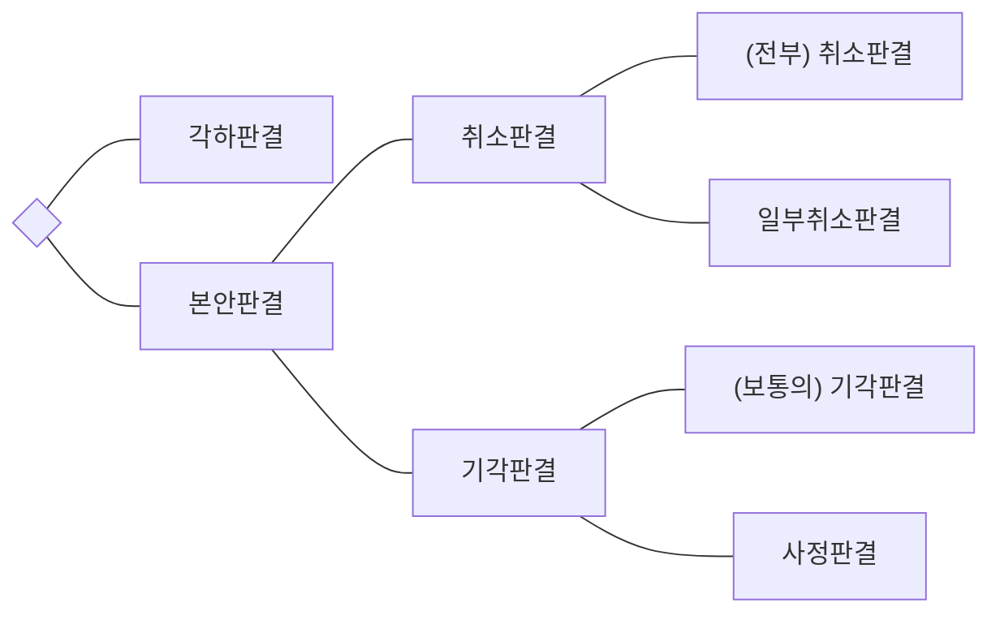

# 취소소송의 판결의 종류

> 상위: [[_행정법_목차]]

| | 소송요건 구비여부 | 처분의 위법여부 | 처분의 취소여부 |
|---|---|---|---|
| 각하판결 | X | | |
| 기각판결 | O | 적법 | 취소 X |
| 사정판결 | O | 위법 | 취소 X |
| 취소판결 | O | 위법 | 취소 O |

## Ⅰ. 서 설

종국판결은 취소소송의 전부나 일부를 종료시키는 판결이며, 중간판결은 종국판결을 하기 전에 소송의 진행 중에 생긴 쟁점을 해결하기 위한 확인적 성질의 판결을 말한다. 따라서 중간판결에 의하여 심급을 종료시킬 수는 없다. 취소소송의 종국판결은 다시 소송판결(각하판결)과 본안판결로 구분되며, 본안판결은 다시 기각판결과 인용판결로 나눌 수 있다.

## Ⅱ. 각하판결

각하판결(소송판결)은 소송요건을 갖추지 못한 소(訴)에 대하여 본안심리를 거절하는 판결이다. 소송요건이 결여된 경우는 예를 들어 당사자적격이 없는 경우, 제소기간이 경과된 경우, 행정심판의 전치가 요구됨에도 불구하고 행정심판을 거치지 않은 경우, 소송의 목적인 처분이 소멸된 경우 등을 들 수 있다.

각하판결은 취소소송의 본안에 해당하는 부분인 처분의 위법여부에 대해서는 기판력이 발생하지 않지만, 소송요건이 흠결되었다는 점에서는 기판력이 발생한다.

**관련판례** **소송판결의 기판력은 그 판결에서 확정한 소송요건의 흠결에 관하여 미친다**

소송판결의 기판력은 그 판결에서 확정한 소송요건의 흠결에 관하여 미치며, 확정된 종국판결의 사실심 변론종결 이전에 발생하고 제출할 수 있었던 사유에 기인한 주장이나 항변은 확정판결의 기판력에 의하여 차단되므로 당사자가 그와 같은 사유를 원인으로 확정판결의 내용에 반하는 주장을 새로이 하는 것은 허용되지 아니한다([[대판 2015.10.29, 2015두44288]]).

## Ⅲ. 본안판결

### 1. 기각판결

#### 가. (보통의) 기각판결

법원이 원고의 취소청구가 이유없다고 인정하여, 즉 행정청의 처분이 적법하다고 판단하여 원고의 청구를 배척하는 판결을 말한다. 기각판결의 경우에는 해당 처분이 적법하다는 점에 기판력이 미친다.

#### 나. 사정판결

> **행정소송법 제28조 (사정판결)**
> ① 원고의 청구가 이유있다고 인정하는 경우에도 처분등을 취소하는 것이 현저히 공공복리에 적합하지 아니하다고 인정하는 때에는 법원은 원고의 청구를 기각할 수 있다. 이 경우 법원은 그 판결의 주문에서 그 처분등이 위법함을 명시하여야 한다.
> ② 법원이 제1항의 규정에 의한 판결을 함에 있어서는 미리 원고가 그로 인하여 입게 될 손해의 정도와 배상방법 그 밖의 사정을 조사하여야 한다.
> ③ 원고는 피고인 행정청이 속하는 국가 또는 공공단체를 상대로 손해배상, 제해시설의 설치 그 밖에 적당한 구제방법의 청구를 해당 취소소송등이 계속된 법원에 병합하여 제기할 수 있다.

> **행정소송법 제32조 (소송비용의 부담)**
> 취소청구가 제28조의 규정에 의하여 기각되거나 행정청이 처분등을 취소 또는 변경함으로 인하여 청구가 각하 또는 기각된 경우에는 소송비용은 피고의 부담으로 한다.

**(1) 의 의**

원고의 취소청구가 이유 있다고 인정하는 경우에도 해당 처분 등을 취소·변경함이 현저히 공공복리에 적합하지 아니하다고 인정하는 때에는 법원은 원고의 청구를 기각할 수 있는데, 이를 사정판결이라고 한다(법 제28조).

사정판결제도에 대해서는 두 가지 관점이 충돌하고 있다. 사정판결이 법치국가원리를 약화시키는 것으로 보아 최대한 축소적용하려는 입장과 사정판결의 화해적 기능을 강조하여 이를 확대적용하려는 입장으로 나뉜다. 전자는 처분의 위법성이 확인되었음에도 불구하고 처분을 취소하지 않는다는 것은 법치주의에 반하는 것이라고 주장하는데 반해, 후자는 사정판결제도는 원고에게 일방적인 희생만을 강요하는 제도가 아니라 손해배상 등 기타의 방법으로 원고의 청구를 일부 수용하면서도(법 제28조 제3항) 공공복리에 이바지할 수 있는 제도라고 주장하고 있다. 이러한 대립은 무효등확인소송에서 사정판결을 허용할 것인가에 대한 논의로 이어지는데, 후자의 입장에서는 무효등확인소송에서의 사정판결의 허용에 대하여 긍정적이다.

**(2) 요 건**

**(가) 원고의 청구가 이유있을 것**

원고는 처분 등의 위법성을 주장하는 자이므로 원고의 청구가 이유가 있다는 것은 처분 등이 위법하다는 것을 의미한다. 이때 처분 등의 위법판단의 기준시점은 일반원칙에 따라 '처분시'가 된다.

**(나) 처분 등의 취소가 현저히 공공복리에 적합하지 않을 것**

판례는 사정판결에 있어서 공공복리의 개념을 적극적으로 제시하는 대신에 "위법한 행정처분을 취소·변경하여야 할 필요와 그 취소·변경으로 인하여 발생할 수 있는 공공복리에 반하는 사태 등을 비교·교량하여 그 적용 여부를 판단하여야 한다"고 판시하고 있다. 한편 사정판결은 처분시에는 위법하였으나 사후의 변화된 사정을 고려하는 제도이기 때문에 사정판결이 필요한가의 판단의 기준시점은 '사실심변론종결시'가 된다(행정소송규칙 제14조).

**1) 사정판결을 한 사례**

① 환지예정지지정처분에 토지평가협의회의 심의를 거치지 아니한 위법이 있으나, 원고를 제외한 종전 토지소유자 및 체비지 수분양자 등이 이에 불복하지 아니하였고, 위 지정처분을 전제로 다수인의 새로운 법률관계가 형성된 경우([[대판 1992.2.14, 90누9032]])

② 재개발조합설립 및 사업시행인가처분이 처분 당시에는 토지 및 건물 소유자 총수의 각 3분의 2 이상 동의를 얻지 못하였으나, 그 후 90% 이상의 소유자 등이 재개발사업의 속행을 구하고 있고, 새로운 절차를 다시 거치더라도 90% 이상의 소유자 등이 동의할 것으로 예상되어 불필요한 절차만 반복하게 될 경우([[대판 1995.7.28, 95누4629]])

③ 제척사유에 해당하는 교수위원이 법학전문대학원 예비인가를 위한 심의과정에 참여하여 전남대 법학전문대학원에 대한 예비인가처분에 절차하자가 인정되지만, 전남대 법학전문대학원이 이미 120명의 입학생을 받아들여 교육을 하고 있는데 인가처분이 취소되면 그 입학생들이 피해를 입을 수 있는 점, 법학전문대학원의 인가 취소가 이어지면 우수한 법조인의 양성을 목적으로 하는 법학전문대학원 제도 자체의 운영에 큰 차질을 빚을 수 있는 점 등을 고려하여 인가처분을 취소하고 다시 심의하는 것은 무익한 절차의 반복에 그칠 것으로 보이는 경우([[대판 2009.12.10, 2009두8359]])

**2) 사정판결을 하지 않은 사례**

① 이른바 심재륜 고검장 사건에서 징계면직된 검사의 복직이 검찰조직의 안정과 인화를 저해할 우려가 있다는 등의 사정은 검찰 내부에서 조정, 극복하여야 할 문제일 뿐이고, 준사법기관인 검사에 대한 위법한 면직처분의 취소 필요성을 부정할 만큼 현저히 공공복리에 반하는 사유라고 볼 수 없다는 이유로 사정판결을 할 경우에 해당하지 않는다고 한 사례([[대판 2001.8.24, 2000두7704]])

② 버스운송사업계획인가처분 취소소송에서, 인가처분이 취소되면 연장노선을 이용하는 승객들의 불편이 예상되지만 그러한 불편은 일시적 현상에 그칠 것으로 예상되므로, 이 사건 처분의 취소가 현저히 공공복리에 적합하지 아니하는 때에 해당한다고 볼 수는 없다는 사례([[대판 1991.5.28, 90누1359]])

③ 계약이행과 관련하여 관계 공무원에게 뇌물을 준 업체에 대한 입찰참가자격제한처분을 취소하는 것이 현저히 공공복리에 적합하지 아니한 경우에 해당하지 않는다고 본 사례([[대판 1999.3.9, 98두18565]])

**(다) 사정조사**

법원이 사정판결을 하기 위하여는 미리 원고가 사정판결로 인하여 입게 될 손해의 정도와 배상방법 그 밖의 사정을 조사하여야 한다(법 제28조 제2항). 이는 사정판결의 요건으로서 공익과 사익의 비교형량을 위한 심리와 사정판결의 효과로서 부수적 조치를 하기 위한 심리를 위함이다. 따라서 당사자가 이를 간과하였음이 분명하다면 적절하게 석명권을 행사하여 그에 관한 의견을 진술할 수 있는 기회를 주어야 한다.

**관련판례** **사정판결의 요건을 갖추었다고 판단되는 경우, 법원이 취할 조치**

사정판결의 요건을 갖추었다고 판단되는 경우 법원으로서는 행정소송법 제28조 제2항에 따라 원고가 입게 될 손해의 정도와 배상방법, 그 밖의 사정에 관하여 심리하여야 하고, 이 경우 원고는 행정소송법 제28조 제3항에 따라 손해배상, 제해시설의 설치 그 밖에 적당한 구제방법의 청구를 병합하여 제기할 수 있으므로, 당사자가 이를 간과하였음이 분명하다면 적절하게 석명권을 행사하여 그에 관한 의견을 진술할 수 있는 기회를 주어야 한다([[대판 2016.7.14, 2015두4167]]).

**(라) 피고인 행정청의 신청이 필요한지 여부**

1) 문제점

사정판결을 위하여 피고인 행정청의 신청이 필요한지에 관해 견해의 대립이 있다. 이는 행정소송법 제26조의 해석에 대한 견해의 대립과 관련이 깊다.

2) 학 설

① 행정소송법 제26조를 민사소송에서와 같이 법원이 보충적으로 직권증거조사를 할 수 있다는 뜻으로 이해하는 변론주의보충설에 따르면 행정소송법 제26조가 직권심리를 규정하고 있다 하더라도 행정소송법 제8조 제2항에 따라 민사소송법상의 변론주의가 배제되는 것이 아니기 때문에 피고의 신청이 필요하다는 견해를 취하고 있으나(필요설), ② 동 조문을 당사자가 주장하지 아니한 사실에 대하여도 법원이 직권으로 이를 탐지할 수 있다는 뜻으로 이해하는 직권탐지주의설에 따르면 피고의 신청이 없어도 법원은 직권으로 사정판결 여부를 결정할 수 있다고 한다(불요설).

3) 판 례

판례는 법원이 사정판결을 할 필요가 있다고 인정하는 때에는 당사자의 명백한 주장이 없는 경우에도 일건 기록에 나타난 사실을 기초로 하여 직권으로 사정판결을 할 수 있다고 판시하여 불요설의 입장을 취하고 있다.

4) 검 토

생각건대, 행정소송법 제26조가 '법원은 당사자가 주장하지 아니한 사실에 대하여도 판단할 수 있다'고 규정하고 있으며, 동법 제28조에서 사정판결을 위하여 당사자의 신청이 필요하다고 규정한 바 없으므로 법원은 직권으로 사정판결을 할 수 있다고 보는 것이 타당할 것이다.

**관련판례** **법원이 직권으로 사정판결을 할 수 있는지 여부**

행정소송법 제28조 제1항 전단은 원고의 청구가 이유 있다고 인정하는 경우에도 처분등을 취소하는 것이 현저히 공공복리에 적합하지 아니하다고 인정하는 때에는 법원은 원고의 청구를 기각할 수 있다고 규정하고 있고 한편 같은 법 제26조는 법원은 필요하다고 인정할 때에는 직권으로 증거조사를 할 수 있고 당사자가 주장하지 아니한 사실에 대하여도 판단할 수 있다고 규정하고 있으므로 행정소송에 있어서 법원이 행정소송법 제28조 소정의 사정판결을 할 필요가 있다고 인정하는 때에는 당사자의 명백한 주장이 없는 경우에도 일건 기록에 나타난 사실을 기초로 하여 직권으로 사정판결을 할 수 있다고 풀이함이 상당하다 할 것이다([[대판 1992.2.14, 90누9032]]; [[대판 2006.9.22, 2005두2506]]).

**(3) 효 과**

**(가) 청구기각**

처분 등이 위법하여 원고의 청구가 이유가 있음에도 불구하고 원고의 청구는 기각된다(법 제28조 제1항 제1문). 따라서 원고는 사정판결을 할 사정이 없음에도 불구하고 법원이 사정판결을 하여 청구가 기각되었다는 이유로 상급 법원에 상소(上訴)할 수 있다.

**(나) 판결주문에 위법성 명시**

사정판결을 하는 경우 법원은 판결주문에 그 처분 등이 위법하다는 점을 명시하여야 한다(법 제28조 제1항 제2문). 따라서 피고는 처분이 적법함에도 불구하고 위법하다고 선언되었다는 이유로 역시 상급 법원에 상소(上訴)할 수 있다.

한편, 기판력은 판결주문에 발생하므로(민사소송법 제216조 제1항) 사정판결이 확정된 경우, 그 처분 등의 위법성에 대하여 기판력이 발생하게 된다.

**(다) 원고의 권익구제**

원고는 피고인 행정청이 속하는 국가 또는 공공단체를 상대로 손해배상 · 제해시설의 설치 그 밖에 적당한 구제방법의 청구를 해당 취소소송 등이 계속된 법원에 병합하여 제기할 수 있다(법 제28조 제3항).

이는 행정소송법 제10조에서 규정하는 관련 손해배상청구소송 등의 병합과는 구별되는 것으로서, 원고가 취소소송 계속 중에 예비적으로 위와 같은 구제방법의 청구를 추가할 경우 이때 예비적 청구의 피고는 행정청이 아닌 국가 또는 공공단체가 될 것이므로, 소의 주관적 · 예비적 병합이 된다.

**(라) 소송비용의 피고부담**

사정판결은 원고의 청구가 이유가 있음에도 불구하고 그 청구를 기각하는 것이므로 일반적인 소송비용부담의 예와는 달리 승소한 피고가 부담한다(법 제32조).

**(4) 적용범위**

사정판결에 관한 규정은 부작위위법확인소송에 준용되지 않는다. 한편 사정판결이 무효등확인소송에 인정될 수 있는지 여부에 대하여 견해의 대립이 있으나, 판례는 처분이 무효 또는 부존재인 경우에는 존치시킬 유효한 처분이 없다는 이유로 부정적인 입장을 취하고 있다.

**관련판례** **사정판결이 무효등확인소송에 적용되는지 여부**

당연무효의 행정처분을 소송목적물로 하는 행정소송에서는 존치시킬 효력이 있는 행정행위가 없기 때문에 행정소송법 제28조 소정의 사정판결을 할 수 없다([[대판 1996.3.22, 95누5509]]).

## 2. 인용판결

### 가. 의 의

취소소송의 인용판결은 원고의 청구가 이유있다하여 그 전부 또는 일부를 인용하는 형성판결을 말한다. 행정심판의 경우에는 위법한 처분뿐만 아니라 부당한 처분에 대해서도 인용재결을 하는 것과 달리(행정심판법 제5조 제1호), 행정소송은 위법한 처분에 대해서만 인용판결을 하고 부당한 처분에 대해서는 기각판결을 한다(행정소송법 제4조 제1호).

### 나. 일부취소판결

**(1) 일부취소판결의 인정여부**

원고의 청구 중 일부에 대해서만 이유가 있는 경우, 즉 처분의 일부만이 위법한 경우에 법원이 그 일부에 대해서만 취소판결을 내릴 수 있는지 여부가 문제되는바, 판례는 행정소송법 제4조 제1호의 '변경'을 소극적 변경, 즉 일부취소를 의미하는 것으로 보고, 일정한 요건 하에 일부취소판결을 인정하고 있다.

**(2) 일부취소판결의 요건**

처분의 일부취소의 가능성은 일부취소의 대상이 되는 부분의 분리취소가능성에 따라 결정된다. 즉 외형상 하나의 처분이라 하더라도 가분성이 있거나 그 처분대상의 일부가 특정될 수 있다면 그 일부만의 취소가 가능하다. 판례는 조세부과처분(판례 ❶), 정보비공개결정처분(판례 ❷), 국가유공자 비해당결정처분(판례 ❸), 공정거래위원회가 과징금을 부과하면서 여러 개의 위반행위에 대하여 외형상 하나의 과징금 납부명령을 하였으나, 그 중 일부의 위반행위에 대한 과징금 부과만이 위법한 경우(판례 ❹)와 같이 가분성이 인정되는 처분에 대해 일부취소판결을 허용하고 있다.

다만, 과징금부과처분이나 영업정지처분과 같이 재량행위인 경우에는 처분청의 재량권을 존중하여야 하고, 법원이 직접 처분을 하는 것은 인정되지 않으므로 전부취소를 하여 처분청이 재량권을 행사하여 다시 적정한 처분을 하도록 하여야 한다는 것이 판례의 입장이다(판례 ❺, ❻). 또한 조세부과처분과 같은 금전부과처분이 기속행위라 하더라도 당사자가 법원에 제출한 자료에 의해 적법하게 부과될 부과금액을 산출할 수 없는 경우에는 법원이 처분청의 역할을 할 수는 없으므로 부과처분 전부를 취소할 수밖에 없다는 것이 판례의 입장이다(판례 ⑦).

**관련판례 ❶ 과세처분 : 일부취소**

과세처분취소소송의 처분의 적법 여부는 과세액이 정당한 세액을 초과하느냐의 여부에 따라 판단되는 것으로서 당사자는 사실심 변론종결시까지 객관적인 조세채무액을 뒷받침하는 주장과 자료를 제출할 수 있고 이러한 자료에 의하여 적법하게 부과될 정당한 세액이 산출되는 때에는 그 정당한 세액을 초과하는 부분만 취소하여야 할 것이고 전부를 취소할 것이 아니다([[대판 2000.6.13, 98두5811]]).

**관련판례 ❷ 정보비공개결정처분 : 일부취소**

법원이 행정기관의 정보공개거부처분의 위법 여부를 심리한 결과 공개를 거부한 정보에 비공개대상 정보에 해당하는 부분과 공개가 가능한 부분이 혼합되어 있고 공개청구의 취지에 어긋나지 아니하는 범위 안에서 두 부분을 분리할 수 있음을 인정할 수 있을 때에는 청구취지의 변경이 없더라도 공개가 가능한 정보에 관한 부분만의 일부취소를 명할 수 있다([[대판 2003.10.10, 2003두7767]]).

**관련판례 ❸ 국가유공자 비해당결정처분 : 일부취소**

국가유공자 등 예우 및 지원에 관한 법률 제4조 제1항 제6호, 제6조의3 제1항, 제6조의4 등 관련 법령의 해석상, 여러 개의 상이에 대한 국가유공자 요건 비해당결정처분에 대한 취소소송에서 그중 일부 상이에 대해서만 국가유공자 요건이 인정될 경우에는 비해당결정처분 중 요건이 인정되는 상이에 대한 부분만을 취소하여야 하고, 비해당결정처분 전부를 취소할 것은 아니다([[대판 1982.9.28, 82누2]]).

**관련판례 ❹ 과징금을 부과하면서 여러 개의 위반행위에 대하여 외형상 하나의 과징금 납부명령을 하였으나, 그 중 일부의 위반행위에 대한 과징금 부과만이 위법한 경우 : 일부취소**

공정거래위원회가 위반행위에 대한 과징금을 부과하면서 여러 개의 위반행위에 대하여 외형상 하나의 과징금 납부명령을 하였으나 여러 개의 위반행위 중 일부의 위반행위에 대한 과징금 부과만이 위법하고 소송상 그 일부의 위반행위를 기초로 한 과징금액을 산정할 수 있는 자료가 있는 경우에는, 하나의 과징금 납부명령일지라도 그 일부의 위반행위에 대한 과징금액에 해당하는 부분만을 취소하여야 한다([[대판 2019.1.31, 2013두14726]]).

**관련판례 ❺ 영업정지처분 : 전부취소**

행정청이 영업정지처분을 함에 있어서 그 정지기간을 어느 정도로 할 것인지는 행정청의 재량권에 속하는 사항인 것이며, 다만 그것이 공익의 원칙이나 평등의 원칙 또는 비례의 원칙 등에 위반하여 재량권의 한계를 벗어난 재량권 남용에 해당하는 경우에만 위법한 처분으로서 사법심사의 대상이 되는 것이나, 법원으로서는 영업정지처분이 재량권 남용이라고 판단될 때에는 위법한 처분으로서 그 처분의 취소를 명할 수 있을 뿐이고, 재량권의 한계 내에서 어느 정도가 적정한 영업정지 기간인지를 가리는 일은 사법심사의 범위를 벗어난다([[대판 2016.8.30, 2014두460342]]).

**관련판례 ❻ 과징금부과처분 : 전부취소**

자동차운수사업면허조건 등을 위반한 사업자에 대하여 행정청이 행정제재수단으로 사업 정지를 명할 것인지, 과징금을 부과할 것인지, 과징금을 부과키로 한다면 그 금액은 얼마로 할 것인지에 관하여 재량권이 부여되었다 할 것이므로 과징금부과처분이 법이 정한 한도액을 초과하여 위법할 경우 법원으로서는 그 전부를 취소할 수밖에 없고, 그 한도액을 초과한 부분이나 법원이 적정하다고 인정되는 부분을 초과한 부분만을 취소할 수 없다([[대판 1998.4.10, 98두2270]]).

**관련판례 ⑦ 과세처분이지만 전부취소를 한 사건**

과세처분취소소송에 있어 처분의 적법 여부는 정당한 세액을 초과하느냐의 여부에 따라 판단되는 것으로서, 당사자는 사실심 변론종결시까지 객관적인 조세채무액을 뒷받침하는 주장과 자료를 제출할 수 있고, 이러한 자료에 의하여 적법하게 부과될 정당한 세액이 산출되는 때에는 그 정당한 세액을 초과하는 부분만 취소하여야 할 것이고 전부를 취소할 것이 아님은 소론이 지적하는 바와 같으나, 이 사건에 있어서는 앞에서 본 바와 같이 상속재산 일부에 대한 적법한 가액평가의 자료가 있다 할 수 없고, 따라서 정당한 상속세액을 산출할 수 없어 과세처분 전부를 취소할 수밖에 없다([[대판 1992.7.24, 92누4840]]).
