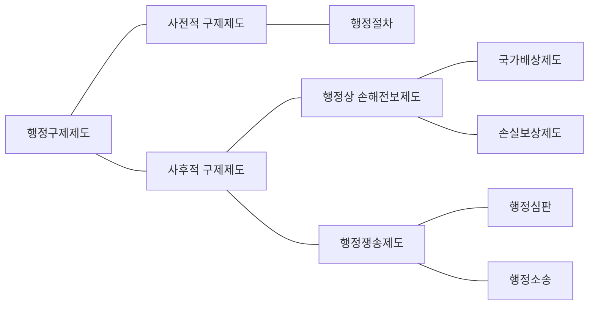

# 행정구제법 개설

> 상위: [[_행정법_목차]]

## 제1장 개 설

행정구제제도는 사전적 구제제도와 사후적 구제제도로 구분할 수 있다. 사전적 구제제도란 행정작용으로 인하여 개인의 권리나 이익의 침해가 발생되기 전에 이를 방지하는 제도적 장치로서 행정절차가 그 주된 기능을 수행한다. 이에 비하여 사후적 구제제도란 행정작용으로 인하여 개인의 권리나 이익이 이미 침해된 경우에 이를 시정하거나 그 손해나 손실을 보전하여 주는 제도를 의미하며, 여기에는 행정쟁송과 행정상 손해전보가 있다.

행정쟁송에는 행정청의 처분 등에 대하여 행정심판위원회가 일정한 절차에 따라 재결을 하는 [[행정심판]]과 법원이 제소에 의하여 소송절차에 따라 판결을 하는 [[행정소송]]이 있다. 이에 비하여 행정상 손해전보에는 위법한 국가작용에 의하여 발생된 손해에 대한 구제수단인 [[국가배상]]과 적법한 행정작용에 의하여 발생된 손실에 대한 구제수단인 [[손실보상]]이 있다.

